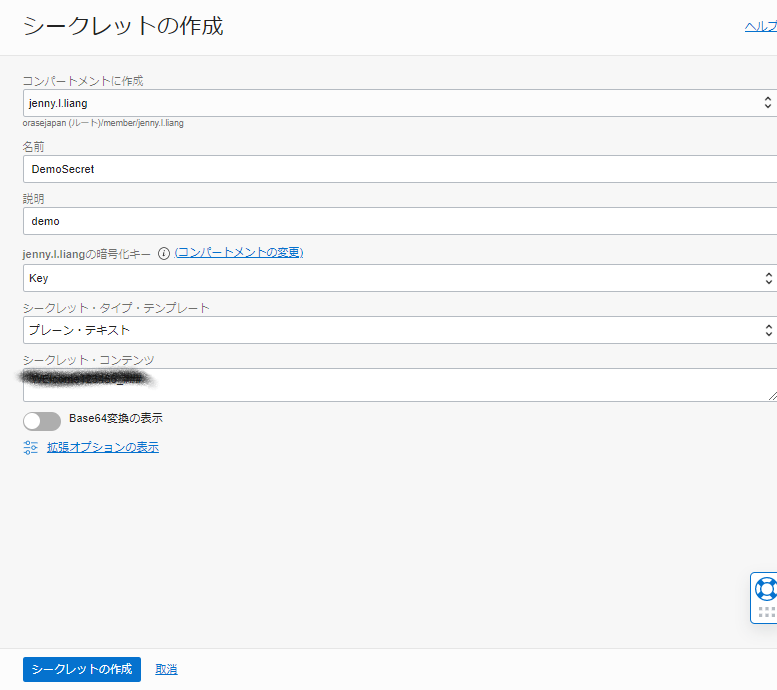
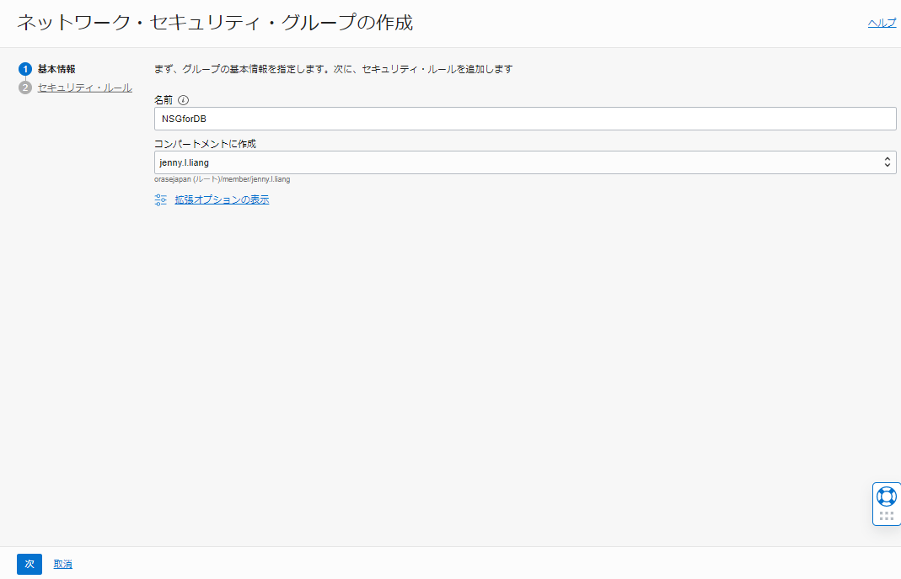
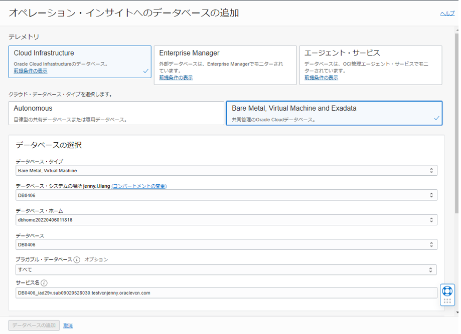
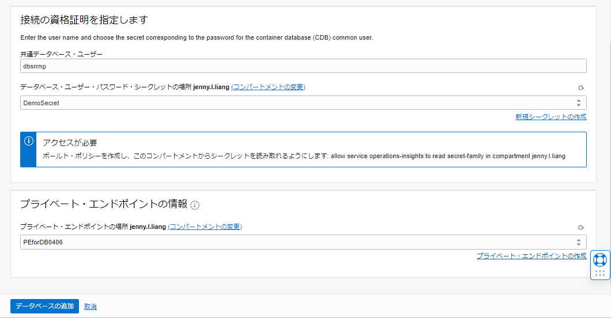
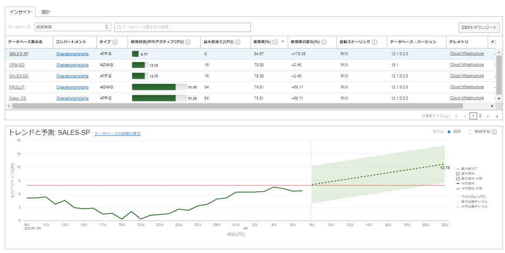
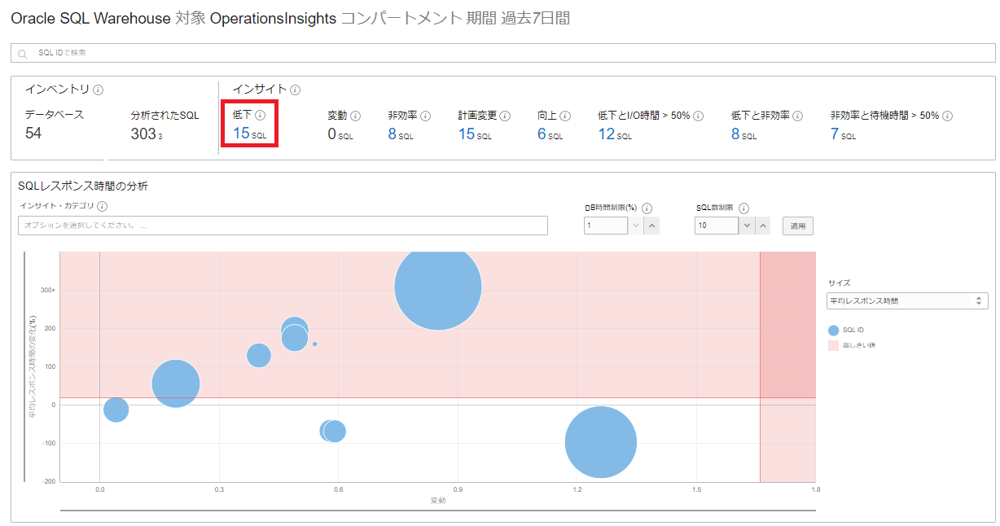
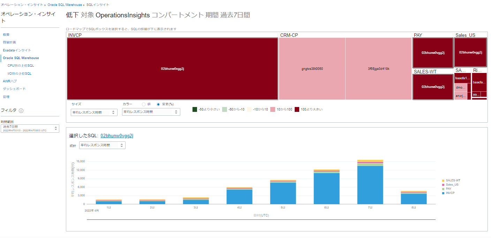
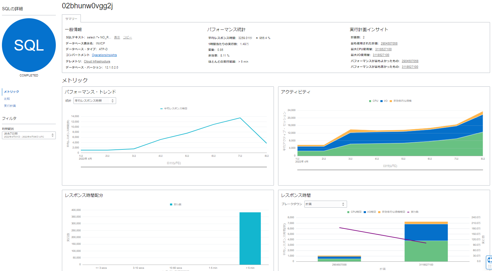

OCI Observability & Managementのサービスの1つ、Operations Insightsでは、Oracle Databaseのデータを長期保存し、機械学習による分析でリソースの需要分析と将来値の予測、パフォーマンス問題を検出することができます。Operations Insightsを利用することで、リソース配分の最適化によるコストの削減、パフォーマンスの向上などを図ることが可能です。
この章では、OCIのBase Database Service（以下BaseDB）でOperations Insightsを有効化する手順をご紹介します。Operations Insightsを有効化するためにエージェントなどをインストールする必要はなく、OCIコンソールからの操作で有効化することができます。


**所要時間 :** 約20分


**前提条件 :**
+ [101: Oracle CloudでOracle Databaseを使おう（BaseDB）](/ocitutorials/database/dbcs101-create-db)を通じて、BaseDBインスタンスの作成が完了していること


**注意 :**
+ ※チュートリアル内の画面ショットについてはOracle Cloud Infrastructureの現在のコンソール画面と異なっている場合があります。


# 1. IAMポリシーの作成
Operations Insightsを利用するためにはOCIの他のサービスと同様に、IAMポリシーによってアクセス権限が付与されている必要があります。
以下のポリシーをテナンシで作成してください。

※この章では、ユーザーにOperations Insightsの管理権限を付与します。ユーザーはログ・アナリティクスの構成やログファイルのアップロード、削除を含む全ての管理権限を行うことができます。[ドキュメント](https://docs.oracle.com/ja-jp/iaas/operations-insights/doc/get-started-operations-insights.html#OOPSI-GUID-E72645F2-03F8-44CF-ACA1-FF57F3AA298D) を参考にユーザーの役割、ロールごとにIAMポリシーの権限を調整してください。

```
allow group <IAMグループ名> to manage opsi-family in tenancy
allow group <IAMグループ名> to use database-family in tenancy
allow group <IAMグループ名> to manage virtual-network-family in tenancy
allow group <IAMグループ名> to manage secret-family in tenancy
allow service operations-insights to read secret-family in tenancy/compartment <Vaultを作成するコンパートメント名>
```


# 2. DBユーザーの権限設定
Operations Insightsを有効化するには、Operations InsightsがBaseDBにアクセスできること、および情報の取得のために必要な権限をDatabaseユーザーに付与する必要があります。
今回はBaseDBの監視に使用されるDBSNMPユーザーに必要な権限を付与します。

Operations Insightsを有効化するBaseDBにアクセスし、以下SQLコマンドを実行してください。

```
SQL> alter user dbsnmp account unlock;
SQL> alter user dbsnmp identified by "<パスワード※>"
SQL> GRANT SELECT ANY DICTIONARY, SELECT_CATALOG_ROLE TO DBSNMP;
```
※DBSNMPユーザーのパスワードには、最低2つの小文字、2つの大文字、2つの数字および2つの特殊文字を含め、14文字以上である必要があります。


# 3. Vaultとシークレットの作成
DBSNMPユーザーのパスワードと権限を設定したら、Operations InsightsがDBSNMPユーザーの資格証明を使用してBaseDBにアクセスできるように、OCI VaultサービスにDBSNMPユーザーのパスワードを登録します。
IAMポリシーによる権限設定で、Operations Insightsはシークレットの情報を読み取ることができるようになります。


## 3-1. Vaultの作成
OCIコンソールのメニューボタン→アイデンティティとセキュリティ→ボールト→ボールトの作成をクリックします。
ボールトの作成画面にて以下情報を入力したら、画面下部の「ボールトの作成」ボタンをクリックします。
+ **`コンパートメント`** - 任意（Vaultを作成したいコンパートメントを選択）
+ **`名前`** - 任意
    

<br>

## 3-2. マスター暗号化キーの作成
OCIコンソールのメニューボタン→アイデンティティとセキュリティ→ボール→3-1で作成したボールト→ボールトの詳細画面→キーの作成をクリックします。
キーの作成画面にて、以下情報を入力したら、画面下部の「キーの作成」ボタンをクリックします。
+ **`保護モード`** - HSM
+ **`名前`** - 任意
+ **`キーのシェイプ：アルゴリズム`** - AES
+ **`キーのシェイプ：長さ`** - 256ビット
    

<br>

## 3-3. シークレットの作成
OCIコンソールのメニューボタン→アイデンティティとセキュリティ→ボール→3-1で作成したボールト→ボールトの詳細画面→画面左下のシークレット→シークレットの作成ボタンをクリックします。
シークレットの作成画面にて、以下情報を入力したら、画面下部の「シークレットの作成」ボタンをクリックします。
+ **`名前`** - 任意
+ **`説明`** - 任意
+ **`暗号化キー`** - 手順3-2で作成したキーを選択
+ **`シークレット・タイプ・テンプレート`** - プレーン・テキスト
+ **`シークレット・コンテンツ`** - DBSNMPユーザーのパスワードを入力
    

<br>

# 4. Network Security Groupの作成とDBCSへの紐づけ

## 4-1. Network Security Groupの作成
OCIコンソールのメニュー→ネットワーキング→仮想クラウド・ネットワーク→DBCSが配置されているVCN→画面左下のリソースのネットワーク・セキュリティ・グループ→ネットワーク・セキュリティ・グループの作成ボタンをクリックします。
ネットワーク・セキュリティ・グループの作成画面の基本情報にて、以下情報を入力したら、画面下部の「次」ボタンをクリックします
+ **`名前`** - 任意
    


続いて、ネットワーク・セキュリティ・グループの作成画面のセキュリティ・ルールにて、以下情報を入力したら、画面下部の「次」ボタンをクリックします。

**ルール1**
+ **`方向`** -イングレス
+ **`ソース・タイプ`** -CIDR
+ **`ソース・CIDR`** -10.0.0.0/24※
+ **`IPプロトコル`** -TCP
+ **`宛先ポート範囲`** -1521

**ルール2**
+ **`方向`** -エグレス
+ **`ソース・タイプ`** -CIDR
+ **`ソース・CIDR`** -10.0.0.0/16※
+ **`IPプロトコル`** -TCP
+ **`宛先ポート範囲`** -1521
 
※CIDR範囲はセキュリティ要件に合わせて修正してください。
    

<br>

## 4-2. BaseDBにNetwork Security Groupの割当て
OCIコンソールのメニュー→Oracle Database→ベア・メタル、VMおよびExadata→Operations Insightsを有効化したいBaseDB→BaseDBの詳細画面のDBシステム情報の「ネットワーク・セキュリティ・グループ：編集」をクリックします。
    


ネットワーク・セキュリティ・グループの編集ページにて、手順4-1で作成したネットワーク・セキュリティ・グループを選択し、「変更の保存」ボタンをクリックします。
    

<br>

# 5. Private Endpointの作成
OCIコンソールのメニュー→監視および管理→オペレーション・インサイト→管理→画面左下のプライベート・エンドポイント→プライベート・エンドポイントの作成をクリックします。
プライベート・エンドポイントの作成画面にて、以下情報を入力したら、画面下部の「プライベート・エンドポイントの作成」ボタンをクリックします。
+ **`名前`** - 任意
+ **`説明`** - 任意
+ **`コンパートメント`** -プライベート・エンドポイントを作成したいコンパートメントを選択
+ **`仮想クラウド・ネットワークの場所`** -Operations Insightsを有効化したいBaseDBが配置されているVCNを選択
+ **`サブネットの場所`** -Operations Insightsを有効化したいDBCSが配置されているサブネットを選択
+ **`ネットワーク・セキュリティ・グループ`** -手順4で作成したネットワーク・セキュリティ・グループを選択
    

<br>

# 6. Operations Insightsの有効化
OCIコンソールのメニュー→監視および管理→オペレーション・インサイト→管理→データベース・フリート→データベースの追加をクリックします。
オペレーション・インサイトへのデータベース追加画面から以下情報を入力したら、画面下部の「データベースの追加」ボタンをクリックします。
+ **`テレメトリ`** - Cloud Infrastructure
+ **`クラウド・データベース・タイプ`** - Bare Metal, Virtual Machine and Exadata
+ **`データベース・システムの場所`** - Operations Insightsを有効化したいBaseDBインスタンス名を選択
+ **`データベース・ホーム`** - BaseDBの情報が自動的に表示されます。
+ **`データベース`** - BaseDBの情報が自動的に表示されます。
+ **`プラガブル・データベース`** - すべて、もしくは特定の一部のPDBだけ有効化したい場合はプルダウンボックスから該当PDBを選択
+ **`サービス名`** - BaseDBの情報が自動的に表示されます。
     

+ **`共通データベース・ユーザー`** - dbsnmp
+ **`データベース・ユーザー・パスワード・シークレットの場所`** - 手順3-3で作成したシークレットを選択
+ **`プライベート・エンドポイントの場所`** - 手順5で作成したプライベート・エンドポイントを選択 
    

<br>


# 7. Operations Insightsの利用
以上の手順で、正常にOperations Insightsが有効化された場合、OCIコンソールのメニュー→監視および管理→オペレーション・インサイト→データベース・フリートにて、有効化したBaseDBの状態が「アクティブ」として表示されます。
    


OCIコンソールのメニュー→監視および管理→オペレーション・インサイト→需要計画から、Operations Insightsを有効化した全てのOracle Databaseのうち、リソースを消費しているOracle Databaseを特定することができます。
    

例えば、CPUインサイトから、使用率が高い6つのOracle Databaseをクリックすると、以下のようにCPU使用率が高いOracle Databaseを一覧で確認することが可能です。
また、選択されたOracle DatabaseのCPUの使用率の遷移と、将来の予測値を確認することもできます。
将来の予測値は過去に保存されたデータをもとに、機械学習による分析より算出されたものになり、リソース割当ての意思決定に役立てていただけます。
    


OCIコンソールのメニュー→監視および管理→オペレーション・インサイト→Oracle SQL Warehouseからは、データベース全体で実行されたSQL文の中から、パフォーマンスに問題があるSQL文を確認することが可能です。
    
    画面上部の「インサイト」からは、それぞれ以下のSQL文を確認することができます。
+ **`低下`** - 一定期間内にパフォーマンスが大幅に低下したSQL文
+ **`変動`** - 実行時間の変動が大きいSQL文
+ **`非効率`** - 最適化されておらず、非CPU待機イベントおよび非IO待機イベントでの待機時間が長いSQL文
+ **`計画変更`** - 複数の実行計画を持つSQL文
+ **`向上`** - 一定期間内にパフォーマンスが大幅に向上したSQL文


例えば、パフォーマンスが低下しているSQL文を確認すると、該当するSQL IDの一覧と、SQL IDが実行されているDatabaseインスタンスを確認することができます。
画面上部に表示されているツリーマップは、平均レスポンス時間の変動が大きいもののボックスの色が濃くなり、更に平均レスポンス時間が長いものはボックスのサイズも大きくなるように配置されています。
    
    スクリーンショットの例では、SQL ID「02bhunw0vgg2j」の変動が一番大きく、問題があることが分かります。

更にSQL IDをクリックすると、SQL文の詳細情報を確認することができます。
    


このように、Operations InsightsではSQL文のパフォーマンスの問題の特定や、Oracle Databaseのリソース使用率の傾向分析、予測などを行うことができます。
BaseDBだけでなく、Autonomous Database、オンプレミスのOracle DatabaseでもOperations Insightsを有効化することができるので、是非試してみてください。
Autonomous Databaseや、オンプレミスのOracle DatabaseでのOperations Insightsの有効化については[ドキュメント](https://docs.oracle.com/ja-jp/iaas/operations-insights/doc/get-started-operations-insights.html#OOPSI-GUID-853EF638-94FE-44DC-BC29-116EB068E736)をご参照ください。