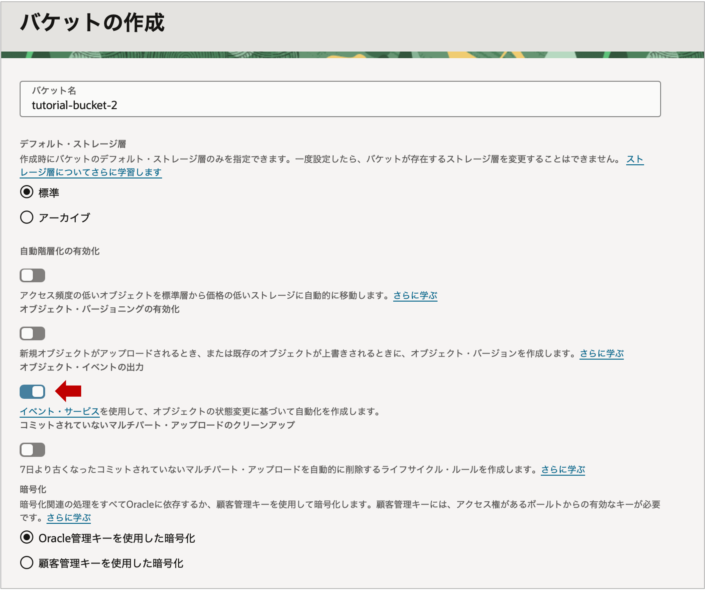
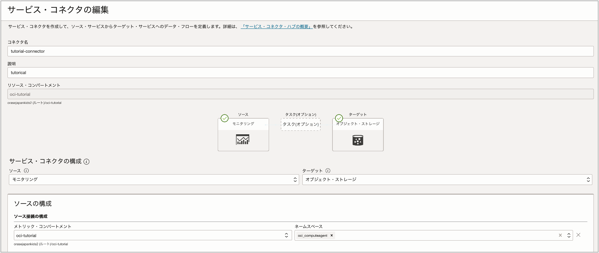
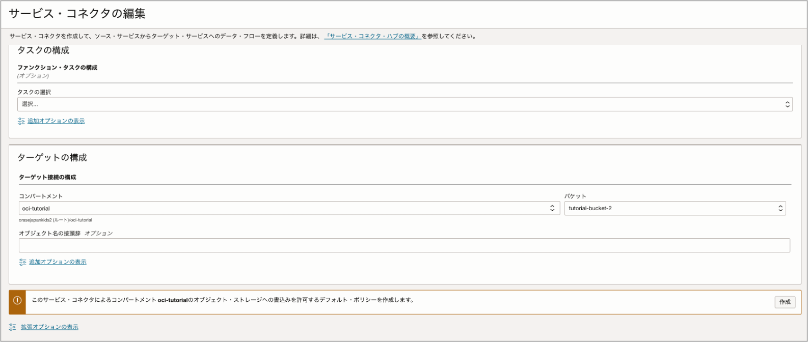
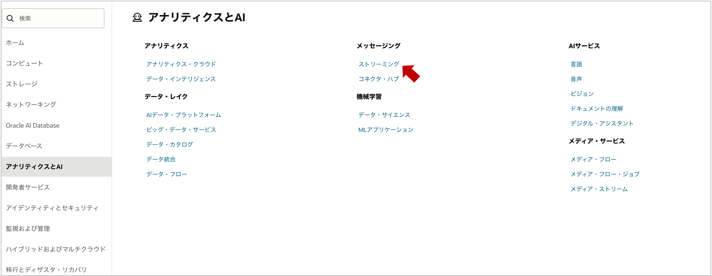
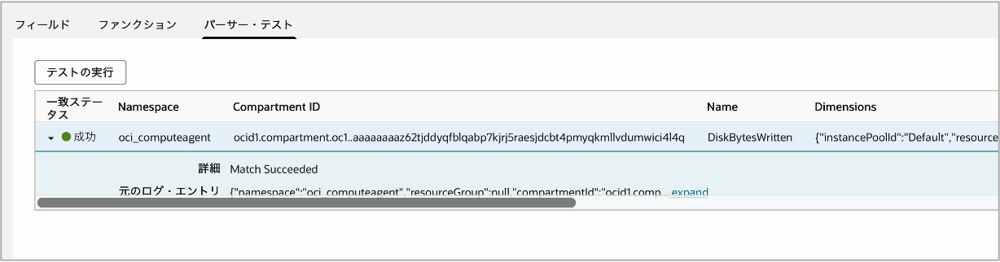
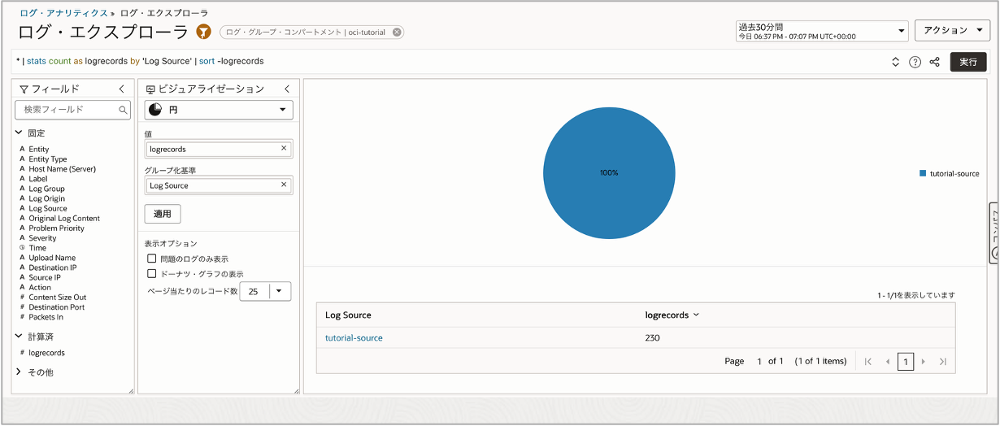
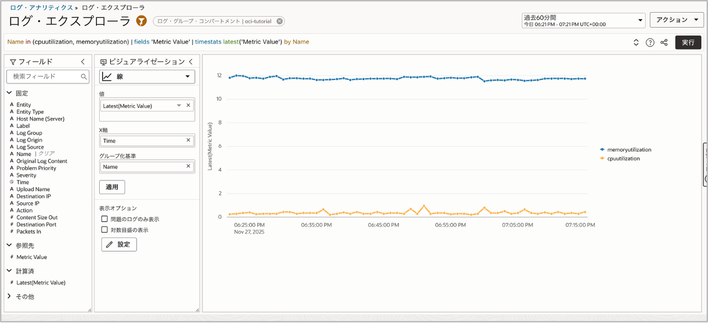

Log Analyticsは、管理エージェントやコネクタ・ハブ経由のログ収集だけでなくオブジェクト・ストレージに格納されたデータについてもログとして収集することができます。  
例えば、Monitoringのメトリックデータは標準的な構成ではLog Analyticsへ取り込むことができませんが、オブジェクト・ストレージを経由することで収集が可能となり、CPUやメモリ使用率などのリソース情報と各種ログを同じダッシュボードに統合することが可能になります。  
このチュートリアルでは、オブジェクト・ストレージに蓄積されたOCIコンピュートのメトリックデータをLog Analyticsへ転送し、グラフ表示する手順を紹介します。

**所要時間 :** 約50分

# 1. 事前準備
## Log Analyticisの有効化とログ・グループの作成  
Log Analyticsの有効化については[Log Analyticsの有効化](/ocitutorials/management/logginganalytics_onboarding/)を参照ください。  
ログ・グループについては有効化の過程で作成された「Default」を使用するか、新規に作成します。  

## OCIコンピュートとオブジェクト・ストレージを作成   
OCIコンピュートやオブジェクト・ストレージの作成については、OCI入門編の以下のチュートリアルを参考にしてください。  
[その3 - インスタンスを作成する](/ocitutorials/beginners/creating-compute-instance/)  
[その7 - オブジェクト・ストレージを使う](/ocitutorials/beginners/object-storage/)  

今回、オブジェクト・ストレージはイベントサービスと連携しますので、オブジェクト・イベントの出力をONにしておきます。


## コネクタ・ハブを作成  
Log Analyticsの有効化で自動作成されたコネクタ・ハブとは別に、新しくコネクタ・ハブを作成します。「監視および管理」>「ロギング」>「コネクタ」と進み、以下のように設定します。
  


コネクタ・ハブに関するポリシーを作成するか聞かれますので作成しておきます。
  
しばらくすると、OCIコンピュートのメトリックデータがバケットに蓄積され始めます。  
圧縮ファイルで保存されていますので、ダウンロードして解凍しておきます。


# 2. 動的グループとポリシーの作成  
## 動的グループの作成  
以下の一致ルールを使用して動的グループを作成します。
```
ALL {resource.type='loganalyticsobjectcollectionrule'}
```

動的グループの作成方法については、[こちらのチュートリアルの記事](/ocitutorials/management/logginganalytics_logcollection4ocivm/#2-動的グループの作成とポリシーの追加)を参考にしてください。

## ポリシーの作成  
次に、以下のポリシーを作成します。
```
allow DYNAMIC-GROUP <Dynamic_Group_Name> to read buckets in compartment/tenancy
allow DYNAMIC-GROUP <Dynamic_Group_Name> to read objects in compartment/tenancy
allow DYNAMIC-GROUP <Dynamic_Group_Name> to manage cloudevents-rules in compartment/tenancy
allow DYNAMIC-GROUP <Dynamic_Group_Name> to inspect compartments in tenancy
allow DYNAMIC-GROUP <Dynamic_Group_Name> to use tag-namespaces in tenancy where all {target.tag-namespace.name = /oracle-tags/}
allow DYNAMIC-GROUP <Dynamic_Group_Name> to {STREAM_CONSUME} in compartment <stream_compartment>
```
ここではテナント管理者権限のユーザーを前提としているため、ユーザーポリシーについては記載しておりません。  
ユーザーポリシーについては[マニュアル](https://docs.oracle.com/ja-jp/iaas/log-analytics/doc/collect-logs-from-your-oci-object-storage-bucket.html)を参照ください。

# 2. Streamingの作成  
オブジェクト・ストレージから継続的にログを収集するためには、OCI Streamingサービスが必要となります。  
「アナリティクスとAI」>「メッセージング」>「ストリーミング」と進み、「ストリームの作成」をクリックし、必要項目を記入し作成します。
ストリーム設定の定義にある保持時間はデフォルトでは24時間ですが、48時間に変更しておきます。  
  


# 3. パーサーとソースの作成  
## パーサーの作成  
オブジェクト・ストレージのデータをLog Analyticsで表示するために、ログ・ソースとログ・パーサーを作成します。  
Log Analyticsの「管理」へと進み、管理の概要で「パーサーの作成」をクリックします。  
名前と説明を記入し、タイプはJSONとします。  
サンプルのログ・コンテンツに、オブジェク・トストレージに保存されているOCIコンピュートのJSONデータを１〜２行分貼り付けます。


解析されたJSONのデータに対して、フィールドをマッピングします。  
全てマッピングする必要はありませんが、ログの可視化に重要なフィールドを作成します。  
例えば以下のようにマッピングします。


パーサー・テストを実行し、成功と表示されたのを確認して作成を完了します。


## ソースの作成  
Log Analyticsの「管理」へと進み、管理の概要で「ソースの作成」をクリックします。  
名前と説明を記入し、ソース・タイプは File とします。  
エンティティ・タイプは Host(Linux) とします。  
パーサーの項目では特定のパーサーにチェックを入れ、先ほど作成したパーサーを選択し、完了します。


# 3. ObjectCollectionRuleの作成  
ObjectCollectionRuleとは、Log Analyticsがオブジェクト・ストレージからログを収集するために必要となる内部リソースです。  
現時点ではコンソールのGUIで作成することはできませんので、REST API、またはOCI CLIで作成します。このチュートリアルではOCI CLIを前提とします。  

ObjectCollectionRuleを作成するためのCLIコマンドテンプレートは以下になります。
```
oci log-analytics object-collection-rule create --from-json <json_file_name> --namespace-name <namespace_name>
```
こちらに、JSONの設定ファイルのパスとLog Analyticsのネームスペースを追記して実行します。  
コマンドの最後尾で指定されている `<namespace_name>` については、以下の手順で確認できます。  
- Log Analytics「管理」>「サービス詳細」>「サービス・ネームスペース」

## JSONファイルの作成

コマンド内で指定される設定ファイル`<json_file_name>`には、以下の内容を記入する必要があります。これらは全て必須プロパティのため、もれなく記入します。
```
{
    "name": "<Rule_Name>",
    "compartmentId": "<Compartment_OCID>",
    "osNamespace": "<Namespace>",
    "osBucketName": "<Bucket_Name>",
    "logGroupId": "<Log_Group_OCID>",
    "logSourceName": "<Log_Source>",
    "streamId":"<Stream_OCID>"
}
```

必須プロパティに関する説明はこちら
- name: ObjectCollectionRuleに与えられた一意の名前。名前はテナンシ内で一意である必要があり、変更できません。
- compartmentId: ObjectCollectionRuleが配置されているコンパートメントのOCID。
- osNamespace: オブジェクト・ストレージ・ネームスペース。バケットの詳細画面で確認可能です。
- osBucketName: オブジェクト・ストレージのバケット名。
- logGroupId: 処理済ログを関連付けるLog Analyticsログ・グループOCID。
- logSourceName: 処理に使用するLog Analyticsソースの名前。
- streamId: LIVEまたはHISTORIC_LIVE型のオブジェクト収集ルールには、ストリームOCIDが必要です。（デフォルトではLIVE）


次のいずれかの方法で、オブジェクト・ストレージ・バケットからログを収集できます。
- LIVE: ObjectCollectionRuleの作成時点からオブジェクトを継続的に収集する場合。これはデフォルトの方法です。
- HISTORIC: 指定した時間範囲でオブジェクトを1回限り収集する場合。
- HISTORIC_LIVE: バケット内のすべての過去のログの収集、その後、ログを含むすべての新規作成オブジェクトを継続的に収集する場合。
LIVEとHISTORIC_LIVEの場合はStreamingが必要になります。


ファイルを作成したら、名前をつけて保存しておきます。  

## OCI CLIの実行  
OCI CLIは、ローカル端末やクラウドのコンピュートなど、さまざまな環境で使用できますが、このチュートリアルではOCI Cloud Shellを利用します。  
使い方については[クラウド・シェルを使ってブラウザだけで簡単コマンド操作](/ocitutorials/intermediates/cloud-shell/)を参考にしてください。

先ほど作成した設定ファイルをCloud Shellにアップロードし、コマンドを実行します。ここでは、ファイル名は tutorial.json とし、ホームディレクトリに配置する前提とします。  

コマンド例
```
oci log-analytics object-collection-rule create --from-json file:///home/<username>/tutorial.json --namespace-name <Log Analytics namespace>
```

無事作成が完了すると、以下のようなレスポンスが返ってきます。
```
{
    "id": "ocid1.loganalyticsobjectcollectionrule.oc1..exampleuniqueID",
    "name": "My Rule",
    "compartmentId": "ocid.compartment.oc1..exampleuniqueID",
    "osNamespace": "MyNamespace",
    "osBucketName": "MyBucket1",
    "collectionType": "LIVE",
    "pollSince": "2020-09-08 14:06:28.028",
    "logGroupId": "ocid1.loganalyticsloggroup.oc1.. exampleuniqueID",
    "logSourceName": "MyLogSource",
    "lifecycleState": "ACTIVE",
    "timeCreated": "2020-09-08T14:06:28.028Z",
    "timeUpdated": "2020-09-08T14:06:28.028Z",
    "streamId": "ocid1.stream.oc1..exampleuniqueID"
}
```

ObjectCollectionRuleの更新や削除についてもOCI CLIによる操作になります。詳細は[ドキュメント](https://docs.oracle.com/ja-jp/iaas/log-analytics/doc/collect-logs-from-your-oci-object-storage-bucket.html#LOGAN-GUID-349A8682-ED2D-4FEE-BCAA-D8CF455DEEE6)を参照ください。

# 4. ログ・エクスプローラーでOCIコンピュートのメトリックデータを表示する  
ObjectCollectionRuleの作成が成功していると、Log Analyticsのログ・エクスプローラーにログが表示され始めます。


パーサーの作成でマッピングしたフィールドを使用して、CPUやメモリの使用率をグラフ化することができるようになりました。



