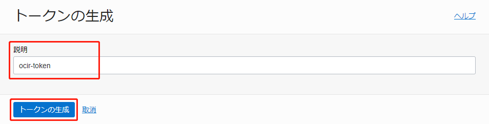
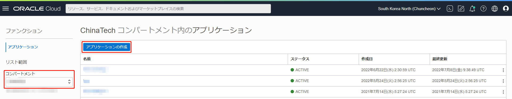
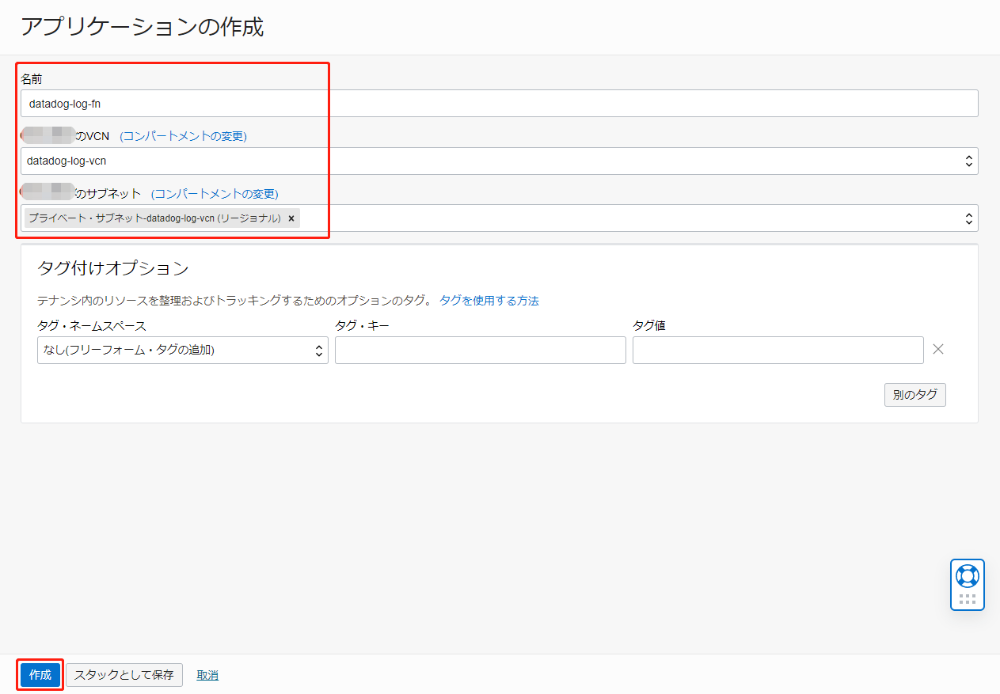

このチュートリアルでは、DataDogにOCIのログを転送するための、オーバーヘッドが低く拡張性の高いソリューションを構成する方法をご紹介します。オブジェク・トストレージにファイルをアップロードした際に生成される書き込みログが、サービス・コネクタとファンクションを経由してDataDogに転送され、ダッシュボードに表示されるまでの流れをステップ・バイ・ステップで説明します。

ソリューションの全体像は以下になります。


## 前提条件

OCI
 - OCIのアカウントを取得済みであること。無料アカウントにサインアップするには、[OCI Cloud Free Tier](https://www.oracle.com/cloud/free/)を参照してください。

DataDog
 - Datadogのアカウントを取得済みであること。14日間の無料トライアルが利用できます。[DataDog 無料トライアル](https://www.datadoghq.com/ja/)にアクセスしてください。


## 1. 事前準備

事前準備として以下を実施します。

- IAMポリシーの作成
- トークンの生成
- VCNの作成
- バケットの作成
- リポジトリの作成
- サンプルコードのダウンロード

### 1-1. IAMポリシーの作成

ファンクションに関するポリシーを設定します。
[Oracle Functions ハンズオン](https://oracle-japan.github.io/ocitutorials/cloud-native/functions-for-beginners/)の「事前準備」の項目を参考にしてください。


このチュートリアルでは、ユーザーはテナント管理者を想定していますので、ユーザー（グループ）に設定するポリシーは特にありません。個別に設定したい場合は[ポリシー・リファレンス](https://docs.oracle.com/ja-jp/iaas/Content/Identity/policyreference/policyreference.htm)を参考に設定してください。 


### 1-2. トークンの生成

ファンクションで利用するイメージはコンテナ・レジストリのリポジトリに格納されます。コンテナ・レジストリにイメージをプッシュするには認証用のトークンを生成します。

コンソールの画面右上にあるユーザー・プロファイルのユーザー情報をクリックします。


ユーザー情報の詳細ページで「認証トークン」を選択して「トークンの生成」へ進みます。


「説明」を入力して「トークンの生成」をクリックします。



「コピー」をクリックして、生成されたトークンをメモしてください。これは再度表示されませんのでご注意ください。メモしたら「閉じる」をクリックします。


これで、トークンの生成は完了しました。

### 1-3. VCNの作成

ファンクションで使用するVCNを作成します。  
コンソールのメニューから「ネットワーキング」を選択し、「仮想クラウド・ネットワーク」へ進みます。


使用するコンパートメントを選択して、「VCNウィザードの起動」をクリックします。


「インターネット接続性を持つVCNの作成」を選択して、「VCNウィザードの起動」をクリックします。


「VCN名」を入力し、その他の項目はデフォルトのままで「次」をクリックします。


「確認および作成」のページで「作成」をクリックします。


これで、VCNの作成は完了しました。

### 1-4. バケットの作成

オブジェクト・ストレージのバケットを作成します。  
コンソールのメニューから「ストレージ」を選択して、「オブジェクト・ストレージとアーカイブ・ストレージ」の「バケット」をクリックします。


使用するコンパートメントを選択して、「バケットの作成」をクリックします。


「パケット名」を入力し、その他の項目はデフォルトのままで「作成」をクリックします。


これで、バケットの作成は完了しました。

### 1-5. リポジトリの作成

ファンクションで使用するイメージのリポジトリを作成します。  
コンソールのメニューから「開発者サービス」を選択し、「コンテナ・レジストリ」へ進みます。


使用するコンパートメントを選択して、「リポジトリの作成」をクリックします。


各項目を選択または入力して、「リポジトリの作成」をクリックします。

コンパートメント：使用するコンパートメントを選択します。  

リポジトリ名：datadog-log/oci-logs-to-datadog-fn  
（repo-name-prefix/repo-name という形式で入力します。後述のファンクションの設定では、一意のリポジトリ名の接頭辞は datadog-log、ファンクションの名前は oci-logs-to-datadog-fn というように、一致させる必要があります）

アクセス：セキュリティを考慮してプライベートを推奨します。


これで、リポジトリの作成は完了しました。

### 1-6. サンプルコードのダウンロード

[こちら](https://github.com/yohono/oci_sample_code/raw/main/oci-logs-to-datadog-fn.zip)からサンプルコードをダウンロードし、保存しておきます。

以上で、事前準備はすべて完了しました。

## 2. DataDog API KeyとDataDog Logs API情報の取得

これから、OCIからDataDogにログを転送する方法について説明します。

まず、DataDog API Keyを取得します。  
DataDogのコンソールで、左下のユーザー情報をクリックして「Organization Settings」へ進みます。


「API Keys」をクリックして、利用するAPI keyの行をクリックします。


API Keyの画面で「Copy」をクリックして、コピーされたAPI Keyをメモしてください。


これで、DataDog API Keyの取得は完了しました。

次に、DataDog Logs APIの情報を取得します。  
[DataDog API Reference-Logs](https://docs.datadoghq.com/api/latest/logs/)に移動して、「SITE」の項目で、DataDog IDの登録で選択したリージョンを選択します。この例では「US」を選択します。
次に、「Send logs」の「API Endpoint」(https://http-intake.logs.datadoghq.com/api/v2/logs)をコピーして、メモしてください。


次に、同じページの「Code Example」から利用する開発言語を選択します。この例では「Python」を選択します。
「INSTRUCTIONS」に記述されている「DD_SITE="datadoghq.com"」の情報をメモしてください。（注意：選択されたSITEと開発言語によって、INSTRUCTIONSに記述される情報が異なります)


これで、DataDog Logs API情報の取得は完了しました。

## 3. ログ・グループの作成および有効化

取り込みたいログを設定します。まずは、ログ・グループを作成します。  
コンソールのメニューから、「監視および管理」を選択して「ロギング」の「ログ・グループ」へ進みます。


使用するコンパートメントを選択して、「ログ・グループの作成」をクリックします。


以下のように任意で入力し、「作成」をクリックします。
- 名前：datadog_log_group
- 説明：OCI logs to Datadog


ログ・グループの詳細ページで、「リソース」の「ログ」を選択して、「サービス・ログの有効化」をクリックします。


各項目を選択または入力し、「ログの有効化」をクリックします。

- リソース・コンパートメント：使用するコンパートメントを選択します。
- サービス：Object Stoarge
- リソース：datadog-bucket（バケット作成のステップで作成したバケットです）
- ログ・カテゴリ：Write Access Events
- ログ名：datadog


これで、ログ・グループの作成および有効化は完了しました。

## 4. ファンクションの作成

DataDogにログをプッシュするためのファンクションを作成します。  
コンソールのメニューから「開発者サービス」を選択し、「ファンクション」の「アプリケーション」へ進みます。


使用するコンパートメントを選択し、「アプリケーションの作成」をクリックします。



各項目を選択または入力して、「作成」をクリックします。

- 名前：datadog-log-fn
- VCN：datadog-log-vcn（VCNの作成のステップで作成したVCNです）
- サブネット：セキュリティを考慮し、プライベート・サブネットを推奨します。



アプリケーションの詳細ページで、「スタート・ガイド」をクリックします。  
今回は、Cloud Shellを利用するので、「Cloud Shell設定」を選択して「Cloud Shellの起動」をクリックします。（ローカル環境を使用する場合は「ローカル設定」を選択し、内容に従って進めてください）


Cloud Shellで、2番、3番、4番、6番のコマンドをコピーして実行します。（利用するリージョンとテナントによって、内容は異なります）

- 4番の「repo-name-prefix」は「リポジトリの作成」で入力した「datadog-log」へ変更して実行してください。

- 6番のコマンドでパスワードが求められる場合、「トークンの生成」で生成されたトークンを入力してください。


Cloud Shellで、画面右上の「Cloud Shellのメニュー」にある「アップロード」をクリックします。


ダウンロードしておいたサンプルコードを選択して、「アップロード」をクリックします。  
このサンプルはOCIのログをそのままをDataDogへ転送する内容となっています。必要に応じて、ファンクションのロジックを修正してください。


Cloud Shellで、下記コマンドをコピーして実行します。

```
unzip oci-logs-to-datadog-fn.zip; cd oci-logs-to-datadog-fn
fn deploy --app datadog-log-fn
```

成功すると、下記のようなメッセージが表示されます。

```
Updating function oci-logs-to-datadog-fn using image ***.ocir.io/******/datadog-log/oci-logs-to-datadog-fn:0.0.2...
Successfully created function: oci-logs-to-datadog-fn with ***.ocir.io/******/datadog-log/oci-logs-to-datadog-fn:0.0.2
```

DataDog APIで利用する変数を「DataDog API Keyの取得」と「DataDogのLogs API関連情報の取得」のステップで取得した情報に書き換えて、以下のコマンドを実行してください。

- YOUR-DD-API-ENDPOINT：「DataDog API Keyの取得」で取得した「API Endpoint」情報
- YOUR-DD-API-KEY：「DataDog API Keyの取得」で取得した「API Key」情報
- YOUR-DD_SITE：「DataDog API Keyの取得」で取得した「DD_SITE」情報

```
fn config function datadog-log-fn oci-logs-to-datadog-fn DD-API-ENDPOINT <YOUR-DD-API-ENDPOINT>
fn config function datadog-log-fn oci-logs-to-datadog-fn DD-API-KEY <YOUR-DD-API-KEY>
fn config function datadog-log-fn oci-logs-to-datadog-fn DD_SITE <YOUR-DD_SITE>
```

以下のコマンドを実行して、ファンクションの動作を確認します。

```
fn invoke datadog-log-fn oci-logs-to-datadog-fn < example.json
```

DataDogのコンソールで、「Logs」へ進み「Search」をクリックします。  
ファンクションが「example.json」にあるログ・データをDataDogにアップロードできたことを確認できます。


これで、ファンクションの作成は完了しました。

## 5. サービス・コネクタの作成及び検証

ロギングからログを読み込み、ファンクションを起動するためのサービス・コネクタを作成します。  
コンソールのメニューから、「監視および管理」を選択して「サービス・コネクタ」へ進みます。


使用するコンパートメントを選択して、「サービス・コネクタの作成」をクリックします。


各項目を選択または入力します。

- コネクタ名：datadog-service-connector
- 説明：service Connector for Datadog
- リソース・コンパートメント：使用するコンパートメントを選択します。
- サービス・コネクタの構成－ソース：ロギング
- サービス・コネクタの構成－ターゲット：ファンクション


- ソース接続の構成－コンパートメント名：使用するコンパートメントを選択します。
- ソース接続の構成－ログ・グループ：datadog_log_group
- ソース接続の構成－ログ：datadog


- ターゲット接続の構成－コンパートメント名：使用するコンパートメントを選択します。
- ターゲット接続の構成－ファンクション・アプリケーション：datadog-log-fn
- ターゲット接続の構成－ファンクション：oci-logs-to-datadog-fn


- サービス・コネクタがファンクションにアクセスするためのポリシーを自動設定するか聞かれますので「作成」をクリックします。


これでサービス・コネクタの作成は完了しました。

次に、サービス・コネクタを検証します。  
コンソールのメニューから「ストレージ」を選択して、「オブジェクト・ストレージとアーカイブ・ストレージ」の「バケット」へ進みます。


使用するコンパートメントを選択して、バケットを選択します。


「アップロード」をクリックします。


中身が空のファイルを作成して、アップロードします。


DataDogのコンソールで「Logs」を選択し、「Search」をクリックします。  
バケットにファイルをアップロードするイベント・ログが、サービス・コネクタとファンクションを経由して、DataDogにアップロードされたことを確認できます。


これで、サービス・コネクタの検証は完了しました。

以上で、チュートリアルは終了です。
