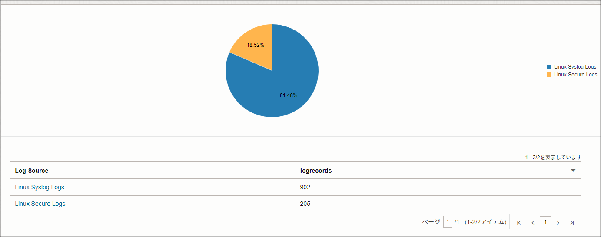
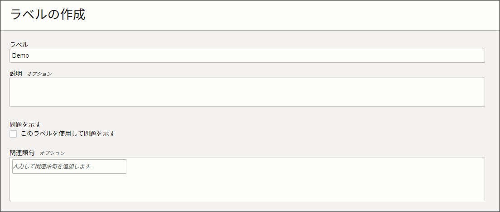
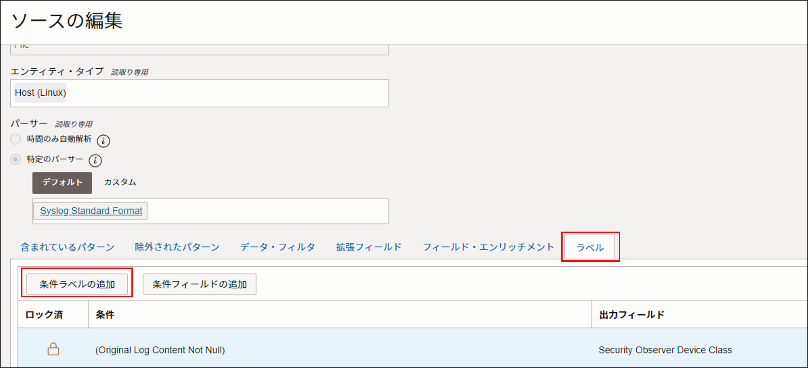
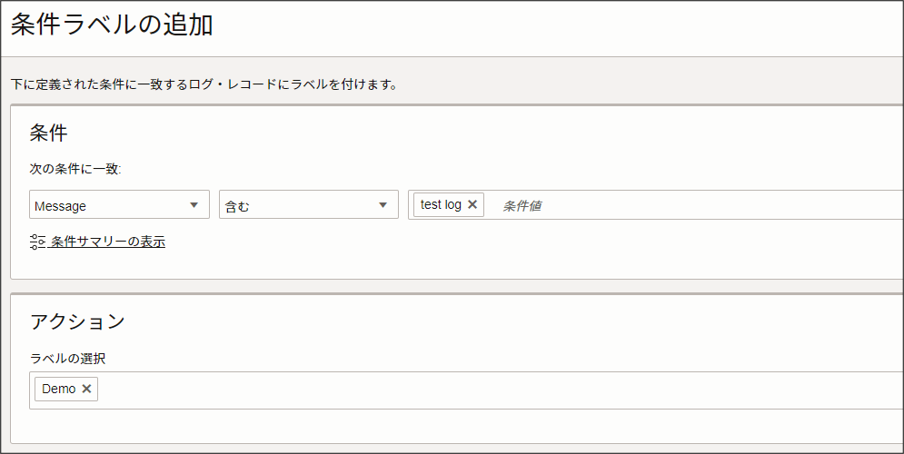
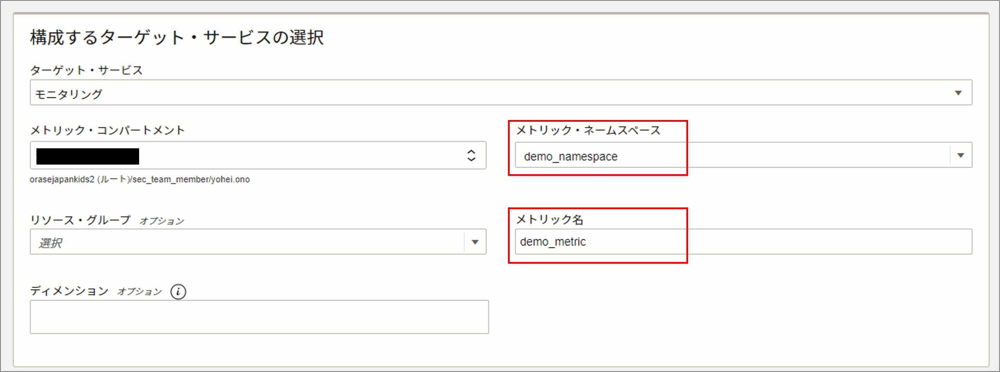

このチュートリアルでは、OCIコンピュートのOSログに検出ルールを設定し、Monitoringのアラームへ連携するための設定手順をご紹介します。

**所用時間**：30分

**前提事項**：  
・OCIコンピュートが作成済であること  
このチュートリアルではOSはOracle Linux 8を前提としています。

・Logging Analyticsが有効化されていること    
このチュートリアルでは、オンボーディング機能を使用してポリシーやLogging Analyticsのリソースが作成済みであることを前提としています。  
オンボーディング機能については[こちらの記事](https://oracle-japan.github.io/ocitutorials/management/logginganalytics_onboarding/)を参照ください。  

ポリシーやリソースの作成はマニュアルで設定しても問題ありません。  
マニュアルで設定する場合は以下のドキュメントを参照ください。  
[前提条件のIAMポリシー](https://docs.oracle.com/ja-jp/iaas/logging-analytics/doc/prerequisite-iam-policies.html#LOGAN-GUID-4CA8D8F4-2218-4C14-AF73-40111C459270)  
[管理エージェントを使用した継続的なログ収集の許可](https://docs.oracle.com/ja-jp/iaas/logging-analytics/doc/allow-continuous-log-collection-using-management-agents.html#LOGAN-GUID-AA23C2F5-6046-443C-A01B-A507E3B5BFB2)

このチュートリアルでは管理者権限を持つユーザーを前提としています。  
ユーザーにアクセス制御を設定する場合は以下のドキュメントを参照ください。  
[ログ・アナリティクスのIAMポリシー・カタログ](https://docs.oracle.com/ja-jp/iaas/logging-analytics/doc/iam-policies-catalog-logging-analytics.html#LOGAN-GUID-04929DA1-E865-4536-A0EC-46AB4B8B0FE1)

・OCIコンピュートのOSログがLogging Analyticsで表示できていること  
サンプルとして、Linux Syslogを使用します。  
参考：[Logging Analytics：OCIコンピュートからOSのログを収集する](https://oracle-japan.github.io/ocitutorials/management/logginganalytics_logcollection4ocivm/)



<br>

# 1. ラベルを作成する
------------------------------------------
OCIコンソール ホーム画面のサービスメニューから「監視および管理」＞「管理」＞「ラベル」と進み、「ラベルの作成」をクリックします。



ラベルとは、ログコンテンツの特定の文字列に対して任意の名前を割り当てる機能です。 最初から定義されたものもあれば、ユーザー自身で作成することもできます。ラベルの詳細は[こちら](https://docs.oracle.com/ja-jp/iaas/logging-analytics/doc/create-label.html) 


任意の名前をつけて、作成を完了します。


<br>

# 2. ログソースにラベルを設定する
------------------------------------------
「監視および管理」＞「管理」へ進み、「ソース」の数字の部分をクリックします。


linuxで検索し、Linux Syslog Logs をクリックします。


「編集」をクリックします。


ソースの編集画面で、ラベルのタブで「条件ラベルの追加」をクリックします。


以下の画像のように条件を設定します。
これは、ログコンテンツのメッセージ部分に"test log"という文字列が含まれていた場合、"Demo"というラベルを自動割り当てするという意味になります。


「追加」をクリックすると一覧に表示されますので、問題なければ「変更の保存」をクリックします。


<br>

# 3. 検出ルールの作成
------------------------------------------
「監視および管理」＞「管理」＞「検出ルール」と進み、「ルールの作成」をクリックします。


検出ルールには2種類あり、スケジュール実行して検出するタイプのものと、特定のラベルが生成されたタイミングで検出するタイプのものがあります。今回は後者の「取込み時検出ルール」を使用します。検出ルールの詳細については[こちら](https://docs.oracle.com/ja-jp/iaas/logging-analytics/doc/manage-detection-rules.html)

「取込み時検出ルール」をクリックし、ルール名に任意で名前を付けます。


ラベルの選択では、先ほど作成したラベルを指定します。


ターゲットサービス（検出結果を連携するサービス）は「モニタリング」のままとします。
メトリック・ネームスペースとメトリック名は、プルダウンでOracle管理のものが表示されますが、こちらは使用できませんので、任意の名前を付けておきます。


その他、ポリシーに関する注意点が表示されますので、こちらのポリシーがまだ設定されていなければ追記しておいてください。


<br>

# 4. 検出の検証
------------------------------------------
では、実際に検証してみます。
OCIコンピュートにログインし、以下のコマンドでLinux Syslogにメッセージを表示させます。
```
$ logger test log
```
ログ・エクスプローラーで少し待つと、以下のように該当メッセージが表示され、ラベルもきちんと割り当てられていることが確認できました。


検証ルールの画面でも結果が反映されています。


つぎに、Monitoringのメトリック・エクスプローラーでも確認してみます。
ネームスペースとメトリック名について、検出ルール作成時に指定したものが表示できるようになっています。


この条件で検索すると、ログ検出結果がメトリックとして連携されていることがわかります。



検出結果の反映やMonitoringのネームスペースの表示など、画面の反映に数分程度の時間がかかるケースがあります。 


<br>

# 5. アラート通知の設定
------------------------------------------
通知の設定については以下のチュートリアルを参考にしてください。
[モニタリング機能でOCIのリソースを監視する](https://oracle-japan.github.io/ocitutorials/intermediates/monitoring-resources/)

以上でチュートリアルは終了です。