このチュートリアルでは、OCIコンピュートからOSのログをエージェント経由で取得するための設定手順をご紹介します。

**所用時間**：30分

**前提事項**：  
・OCIコンピュートが作成済であること  
このチュートリアルではOSはOracle Linux 8を前提としています。

・Logging Analyticsが有効化されていること    
このチュートリアルでは、オンボーディング機能を使用してポリシーやLogging Analyticsのリソースが作成済みであることを前提としています。  
オンボーディング機能については[こちらの記事](https://oracle-japan.github.io/ocitutorials/management/logginganalytics_onboarding/)を参照ください。  

ポリシーやリソースの作成はマニュアルで設定しても問題ありません。  
マニュアルで設定する場合は以下のドキュメントを参照ください。  
[前提条件のIAMポリシー](https://docs.oracle.com/ja-jp/iaas/logging-analytics/doc/prerequisite-iam-policies.html#LOGAN-GUID-4CA8D8F4-2218-4C14-AF73-40111C459270)  
[管理エージェントを使用した継続的なログ収集の許可](https://docs.oracle.com/ja-jp/iaas/logging-analytics/doc/allow-continuous-log-collection-using-management-agents.html#LOGAN-GUID-AA23C2F5-6046-443C-A01B-A507E3B5BFB2)

このチュートリアルでは管理者権限を持つユーザーを前提としています。  
ユーザーにアクセス制御を設定する場合は以下のドキュメントを参照ください。  
[ログ・アナリティクスのIAMポリシー・カタログ](https://docs.oracle.com/ja-jp/iaas/logging-analytics/doc/iam-policies-catalog-logging-analytics.html#LOGAN-GUID-04929DA1-E865-4536-A0EC-46AB4B8B0FE1)

<br>

# 1. OCIコンピュートの管理エージェントを有効化する
-----------------------------------------------
OCIコンピュートの詳細画面で「Oracle Cloudエージェント」タブを開き、  
「管理エージェント」を有効化します。


OCIコンソールのメニューから「監視および管理」を選択し、  
「管理エージェント」の「エージェント」をクリックします。
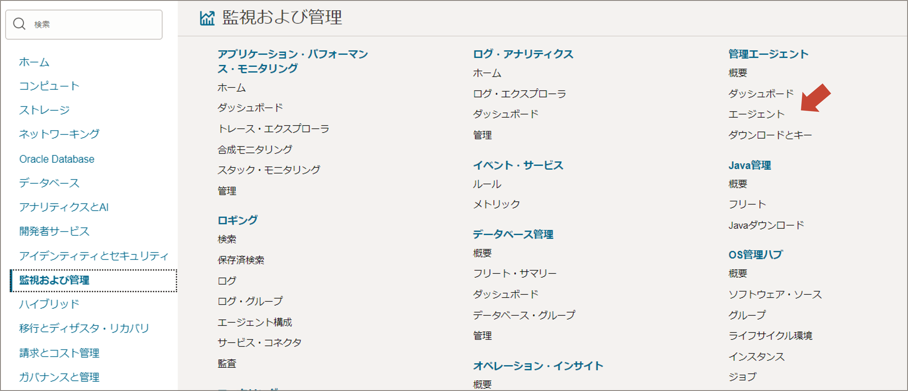

管理エージェントが有効になっていると、以下のようにアクティブとして表示されます。
エージェント名をクリックして詳細画面へ進みます。


「プラグインのデプロイ」をクリックし、「Logging Analytics」にチェックを入れます。

  
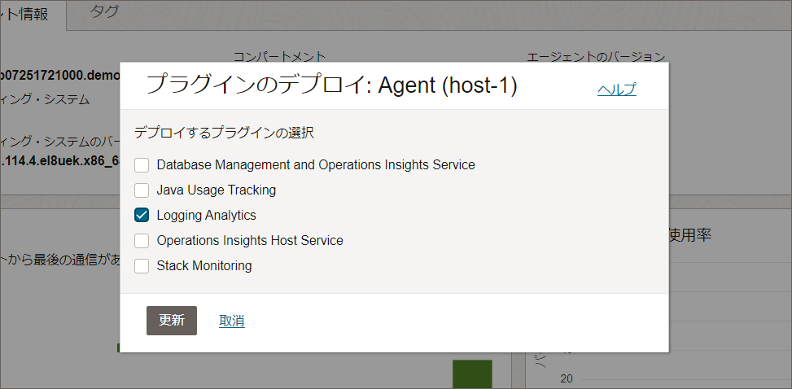

<br>

# 2. ポリシーの変更
-------------------
オンボーディングで自動作成されるポリシーの一部を変更します。
OCIコンソールのメニューから「アイデンティティとセキュリティ」を選択し、「ドメイン」をクリックして詳細画面へ進みます。


「Default」ドメイン内にある「動的グループ」を編集します。

  


一致ルールを「下で定義したいずれかのルールに一致」に変更します。

  
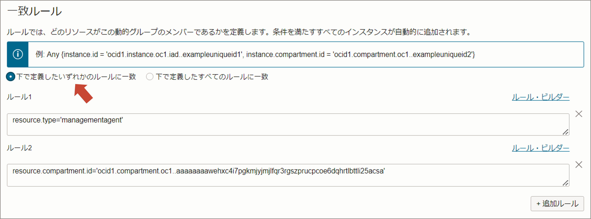

アイデンティティのトップ画面に戻り、「ポリシー」をクリックして詳細画面へ進みます。
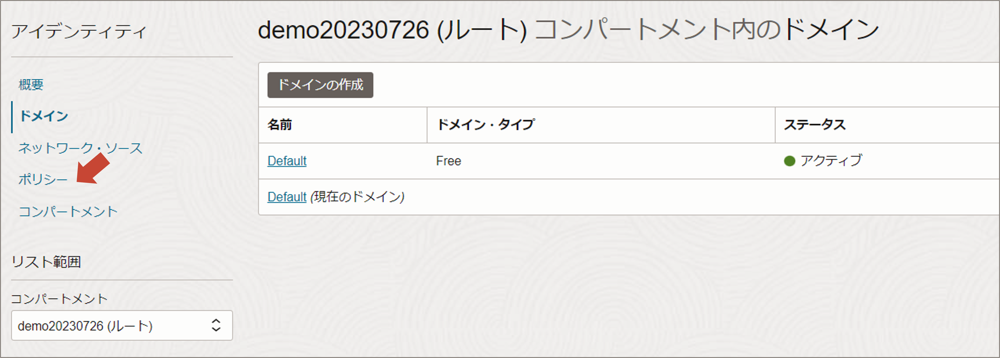

「logging_analytics_automatic_injection_policies」を編集します。
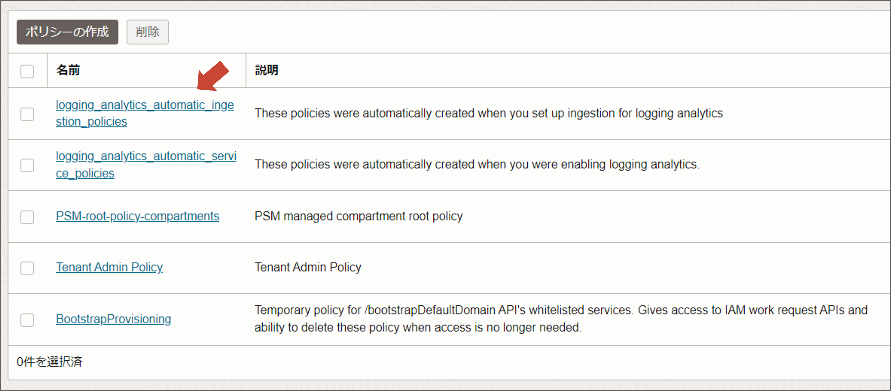

以下のようにポリシーのWhere句を in tenancy に変更します。



オンボーディング機能では、管理エージェントを「Management-Agents」というコンパートメントで管理するように自動設定されますが、OCIコンピュートで有効化する管理エージェントはOCIコンピュートと同じコンパートメントに割り当てられるため、管理エージェントがLogging Analyticsへログをアップロードできるようにするためには、上記のようにポリシーを変更する必要があります。 


<br>

# 3. 管理エージェントがOSのログファイルを読み取るための権限を付与する
-------------------
OSへログインし、setfaclやchmodなどのコマンドで、エージェントにログファイルの読み取り権限を付与します。
権限付与の方法については以下のドキュメントを参照ください。  
[ホストのエージェント・ユーザーへのログに対するREADアクセス権の付与](https://docs.oracle.com/ja-jp/iaas/logging-analytics/doc/grant-read-access-logs-agent-user-your-host.html#LOGAN-GUID-DA6F72E1-CD95-476C-BD4E-CC881FEB6271)


ここでは、以下を実行します。  
(/var/log配下の全てのログへの読み取り権限をoracle-cloud-agentに付与)

```
sudo setfacl -m u:oracle-cloud-agent:r /var/log/*
```


Oracle Cloudエージェントを使用して管理エージェントを有効化した場合は、OSユーザーは「Oracle-Cloud-Agent」になります。管理エージェントを手動でインストールした場合は「mgmt_agent」になります。 


<br>

# 4. エンティティとログソースを関連付ける
----------------
OCIコンソールのメニューから「監視および管理」を選択し、  
「Logging Analytics」の「管理」をクリックします。
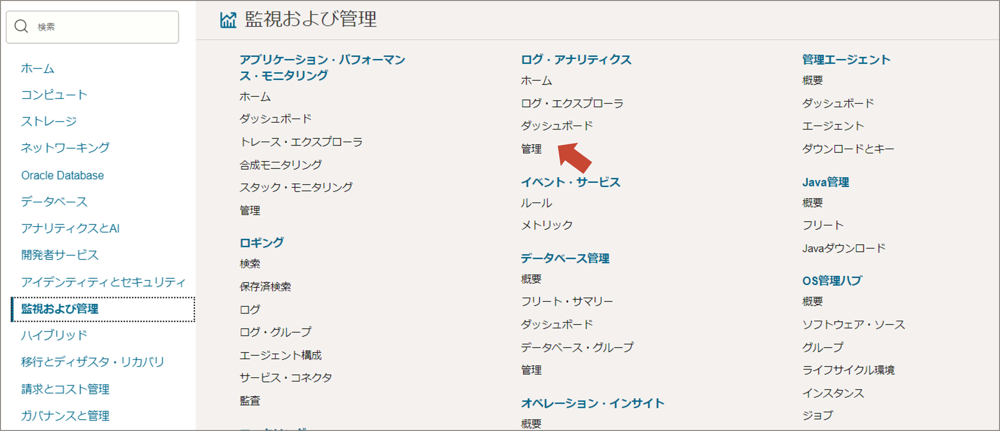

「エンティティ」をクリックし、詳細画面へ進みます。


OCIコンピュートのエンティティが作成されていることを確認します。
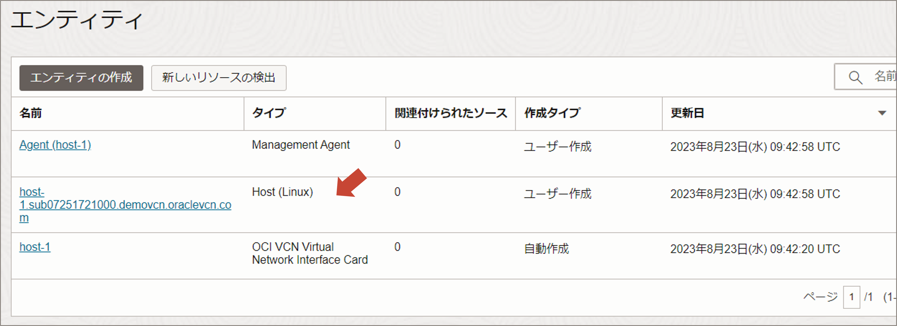

Logging Analyticsの管理画面で「データの追加」をクリックします。
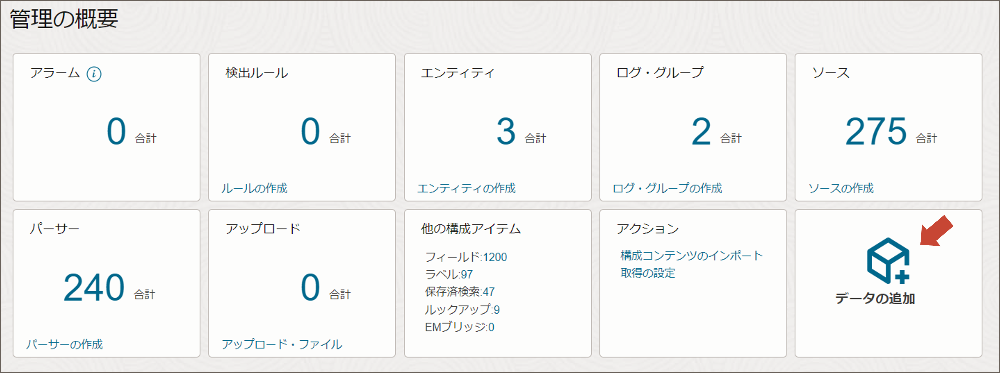

「Linuxコア・ログ」をクリックします。
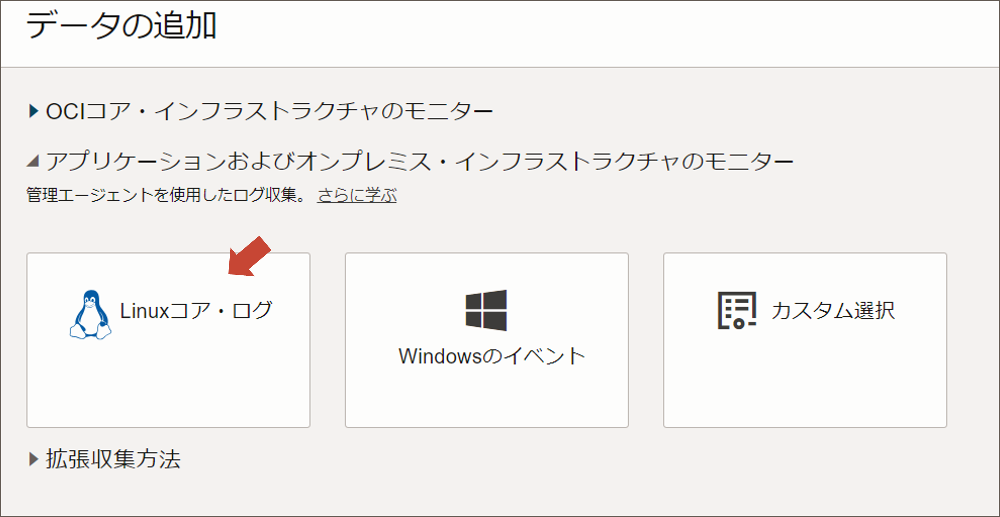

エンティティの選択画面でOCIコンピュートが表示されているのでチェックを入れます。
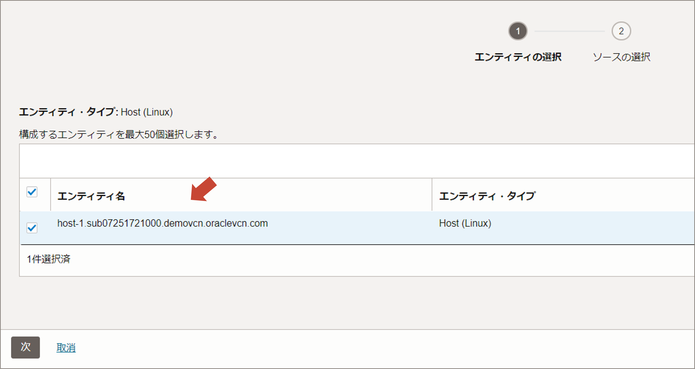

ソース一覧が表示されますので、必要なものにチェックを入れます。  
ここではデフォルトのまま、全てチェックが入っている状態で先へ進みます。
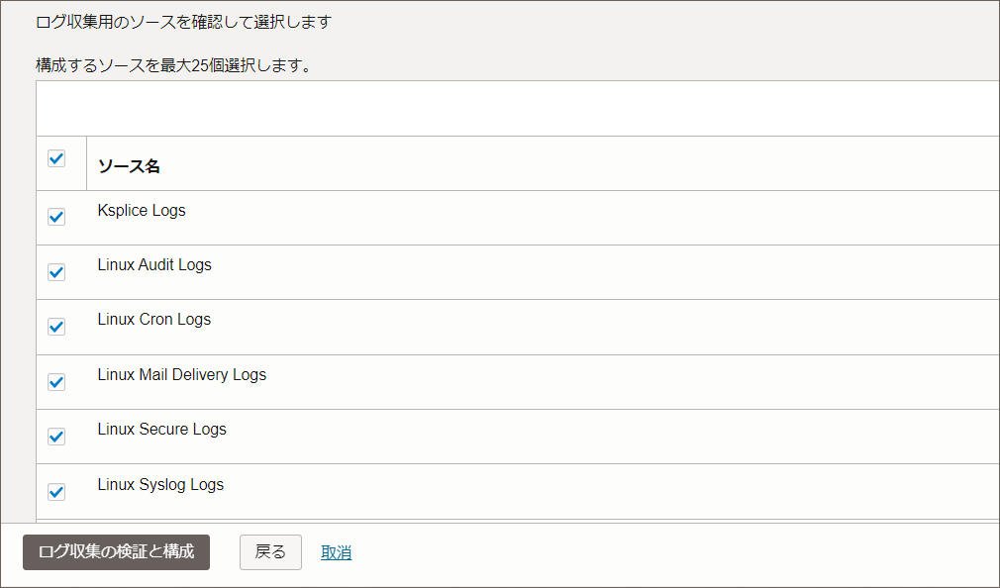

ロググループを選択します。ここでは「Default」を指定します。


エンティティとログソースの関連付けが成功したことを確認し、  
「ログ・エクスプローラに移動」をクリックします。
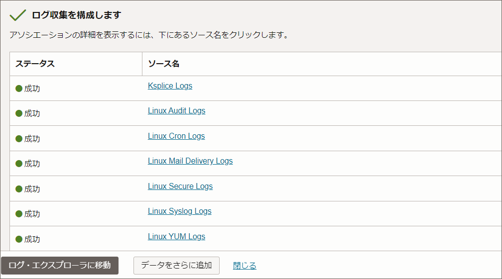

1分ほど待つと、ログが表示されるようになります。
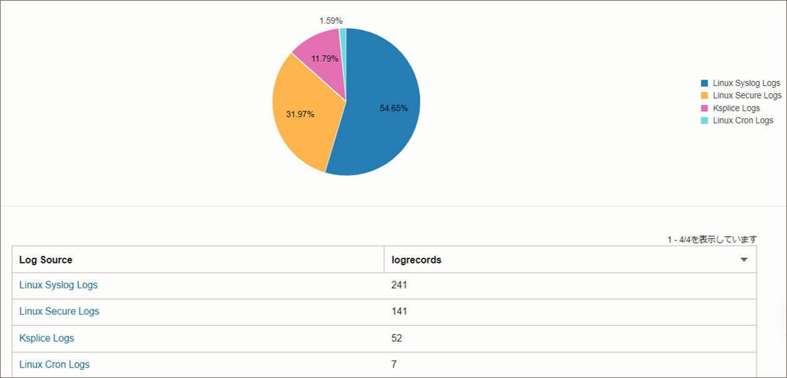

以上で、OCIコンピュートからOSログを収集するための設定は完了です。

