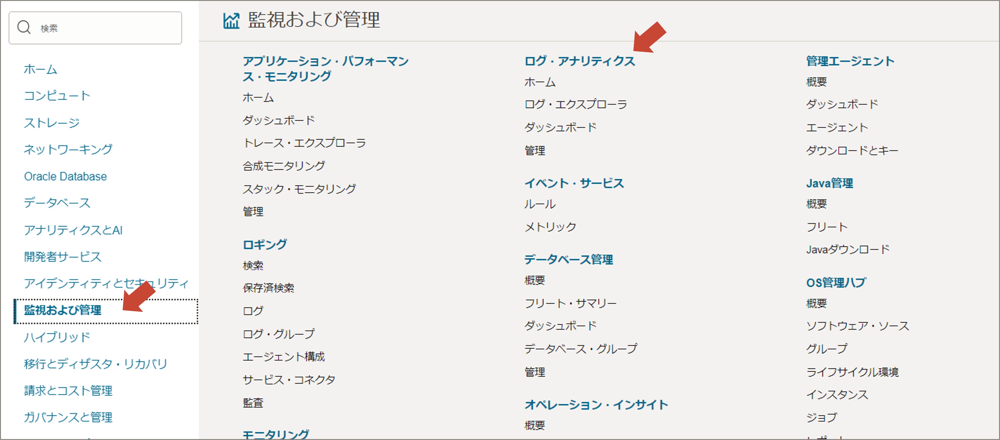
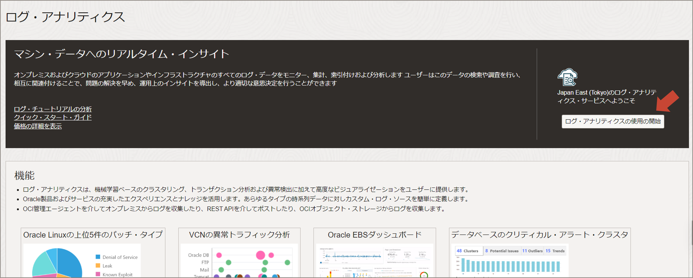
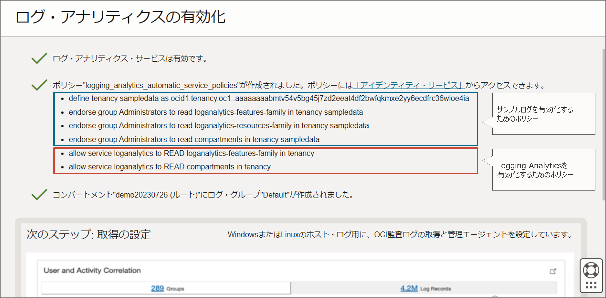
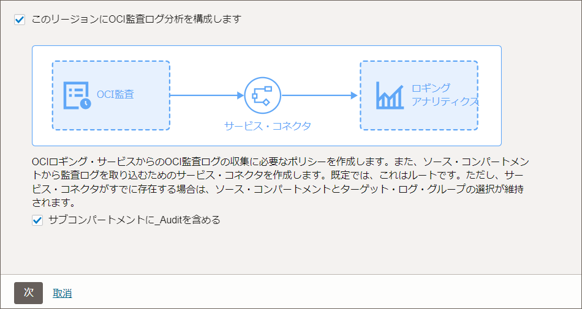
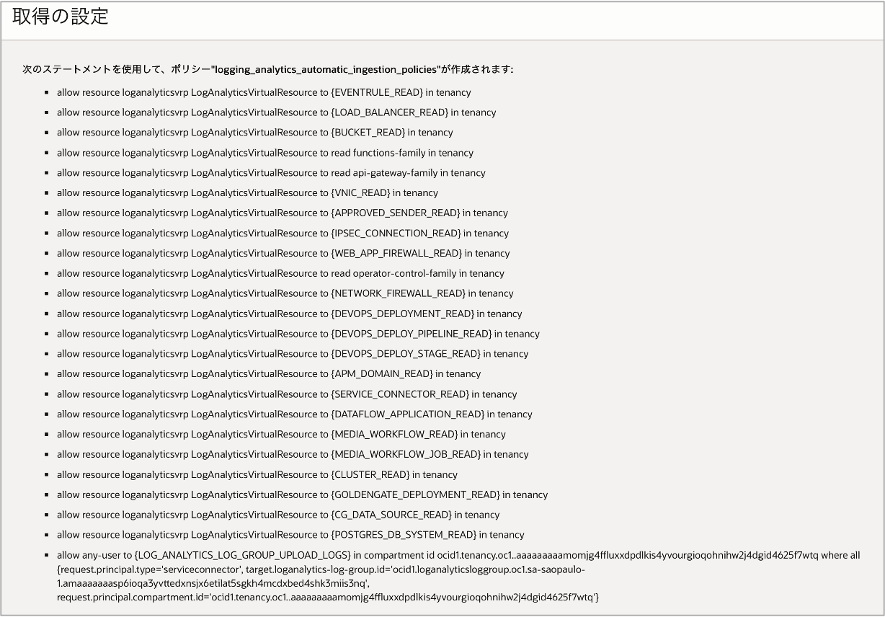
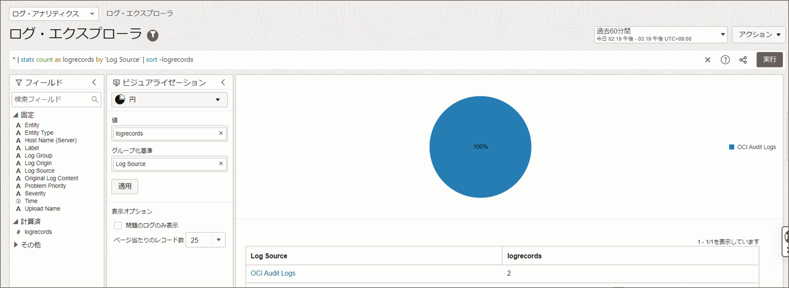
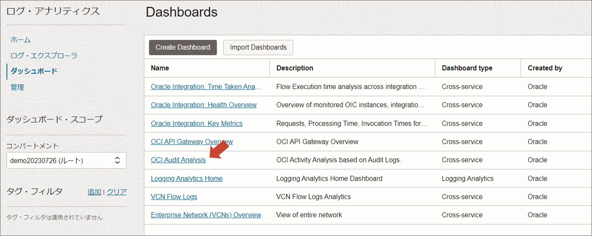
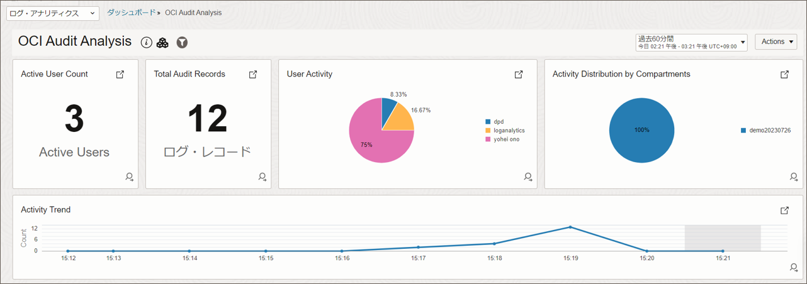

チュートリアル概要
----------------
オンボーディング機能で自動設定されるLog Analyticsのリソースは以下になります。
* Log Analyticsを使用するために必要なポリシー
* OCI監査ログを取り込むために必要なポリシー
* 構成に必要となるサービス（コネクタ・ハブ、ログ・グループなど）

このチュートリアルでは、Log Analyticsの有効化と、OCI監査ログを取得してダッシュボードに表示するところまでの手順を紹介します。

**所用時間**：10分

 

前提条件
----------------
オンボーディング機能を使用するためにはOCIテナント管理者レベルの権限が必要です。

 

設定の流れ
------------------
OCIコンソールの左上のメニューから「監視および管理」を選択し、  
「ログ・アナリティクス」をクリックします。  

 

Log Analyticsがまだ有効化されていない場合、以下のような画面になります。  
「ログ・アナリティクスの使用の開始」をクリックします。  

 

Log Analyticsを有効化するためのポリシーが自動作成され、「logging_analytics_automatic_service_policies」という名前で保存されます。  
また、ログ・グループ「Default」が作成されます。  

 

次の取得の設定画面では、OCI監査ログの継続的な収集を有効化するかどうか、チェックボックスが表示されます。 ここでは、有効化する前提でチェックを入れた状態で次をクリックして進みます。  

 

「logging_analytics_automatic_ingestion_policies」という名前で必要なポリシーが作成されます。  

 また、以下のリソースが作成されます。
 - ログ・グループ「logging_analytics_ociaudit」
 - サービス・コネクタ「logging_analytics_ociaudit」
 
 設定完了後、収集されたOCI監査ログを確認するため「ログ・エクスプローラに移動」をクリックします。  

 

1分ほど待つと、ログ・エクスプローラにOCI監査ログが表示されます。  

 

次にダッシュボードの一覧から「OCI Audit Analysis」をクリックします。  
これはデフォルトで作成済のOCI監査ログ用のダッシュボードです。  

 

OCI監査ログの状況がダッシュボードで直感的に確認できます。  

 

以上、OCI監査ログを取り込み、ログ・エクスプローラやダッシュボードで表示するための手順でした。

