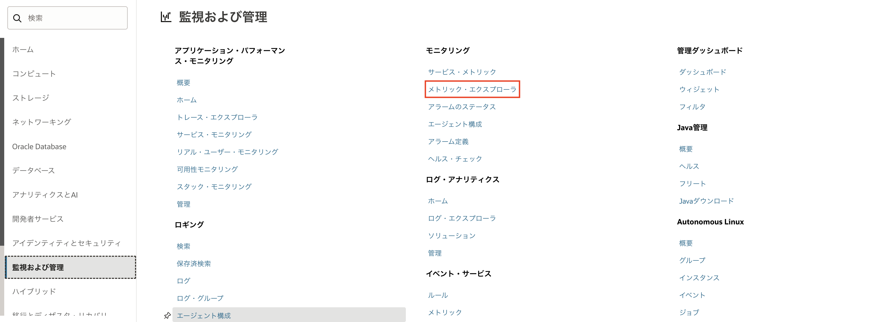
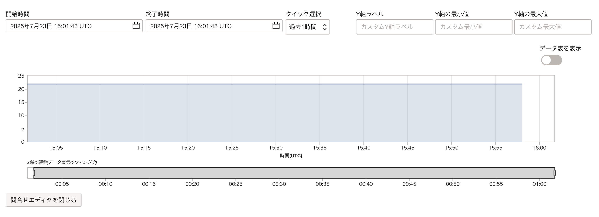

OCIのモニタリング・サービスではカスタム・メトリックの機能を利用して、通常のメトリックでは監視できないユーザ独自のメトリックをモニタリングで監視できます。カスタム・メトリックで追加したメトリックも通常のメトリックと同様にアラームで事前定義した条件にメトリック値が合致した際には管理者に通知を行うことで管理者はタイムリーに適切な対処を行うことができます。

この章では、デフォルトのメトリックでは監視できないコンピュート・インスタンスのディスク使用率をMonitoringのカスタム・メトリックで監視する手順をご紹介します。ディスク使用率以外でもOSで稼働する特定プロセスの有無（プロセスが見つかれば1、なければ0をポスト）など数値で取得できるメトリックであればカスタム・メトリックで監視できます。

**所要時間 :** 約30分

**前提条件1 :** 

[インスタンスを作成する - Oracle Cloud Infrastructureを使ってみよう(その3)](https://oracle-japan.github.io/ocitutorials/beginners/creating-compute-instance/) を通じてコンピュート・インスタンスの作成が完了していること

**注意 :** チュートリアル内の画面ショットについては Oracle Cloud Infrastructure の現在のコンソール画面と異なっている場合があります。

**前提条件2 :**
[モニタリング機能でOCIのリソースを監視する](https://oracle-japan.github.io/ocitutorials/intermediates/monitoring-resources/)を通じてモニタリングのメトリックが参照できること

**必要な権限 :** カスタム・メトリックの監視には以下の権限設定が最低限必要です。
+ 動的グループ
```
instance.compartment.id = '<compartment_ocid>'
```
  動的グループの概要と設定方法については以下を参照ください。  
  参考：[OCI活用資料集：IDおよびアクセス管理 (IAM) 詳細](https://oracle-japan.github.io/ocidocs/services/governance%20and%20administration/iam-200/)

+ ポリシー
```
Allow dynamic-group <group-name> to use metrics in tenancy
```

# 1. Pythonスクリプトの作成
カスタム・メトリックはOCI CLIやAPIで設定することができますが、ここではPython スクリプトでカスタム・メトリックを監視する方法を紹介します。
まだPythonがインストールされていない場合は、インストールしておきます。

今回はコンピュートのディスク使用率を取得して、モニタリングにポストするPythonスクリプトを作成します。
ディスク使用率のメトリックを収集するコンピュート・インスタンスに下記のスクリプト（disk_usage.py）を作成します。


"compartment_ocid"と"service_endpoint" については対象のコンピュートが存在するコンパートメントのOCIDとリージョンのエンドポイントに書き換えます。
エンドポイントについては、[こちら](https://docs.oracle.com/en-us/iaas/api/#/en/monitoring/20180401/)から確認できます。



```
import oci,psutil,datetime
from pytz import timezone

signer = oci.auth.signers.InstancePrincipalsSecurityTokenSigner()
monitoring_client = oci.monitoring.MonitoringClient(config={}, signer=signer, service_endpoint="https://telemetry-ingestion.ap-mumbai-1.oraclecloud.com")

# ディスクの使用率を取得
disk = psutil.disk_usage('/')
disk_usage=disk.percent
print(disk_usage)
   
times_stamp = datetime.datetime.now(timezone('UTC'))

post_metric_data_response = monitoring_client.post_metric_data(
   post_metric_data_details=oci.monitoring.models.PostMetricDataDetails(
      metric_data=[
            oci.monitoring.models.MetricDataDetails(
               namespace="custom_metrics",
               compartment_id="your_compartment_ocid",
               name="disk_usage",
               dimensions={'resourceDisplayName': 'srv01'},
               datapoints=[
                  oci.monitoring.models.Datapoint(
                        timestamp=datetime.datetime.strftime(
                           times_stamp,"%Y-%m-%dT%H:%M:%S.%fZ"),
                        value=disk_usage)]
               )]
   )
)

print(post_metric_data_response.data)
```

# 2. メトリックの公開
下記のスクリプトを実行して、モニタリング・サービスにメトリックが表示されるか確認できます。
```
python disk_usage.py
```


OCIのモニタリング・サービスにデータを定期的に送信するには、スクリプトをスケジュール実行します。OSがLinuxの場合はcronジョブ、Windowsの場合はスケジューリング・タスクを使用することでスケジュール実行できます。


# 3. モニタリング・メトリックの参照（各リソースの詳細画面からの参照）
ナビゲーション・メニューを開き、「監視および管理」の「メトリック・エクスプローラ」をクリックします。


画面下部の問い合わせで以下の項目を設定し、「チャートの更新」をクリックすると画面上部にメトリックのグラフが表示されます。
 - コンパートメント：コンピュート・インスタンスの存在するコンパートメント
 - メトリック・ネームスペース：custom_metrics
 - メトリック名：disk_usage
 - 間隔：任意の間隔
 - 統計：任意の統計
 - ディメンション名：resourceDisplayName
 - ディメンション値：srv01





# 4.アラームの作成
アラームを作成することで、メトリックの値が特定のしきい値に達したらアラームを発報してメール等でユーザーに通知が可能です。
カスタム・メトリックで作成したメトリックは、custom_metricsを使用することでアラームを設定することができます。

詳細のアラーム作成手順については[こちら](https://oracle-japan.github.io/ocitutorials/intermediates/monitoring-resources/#4-%E3%82%A2%E3%83%A9%E3%83%BC%E3%83%A0%E3%81%AE%E9%80%9A%E7%9F%A5%E5%85%88%E3%81%AE%E4%BD%9C%E6%88%90)をご確認ください。
