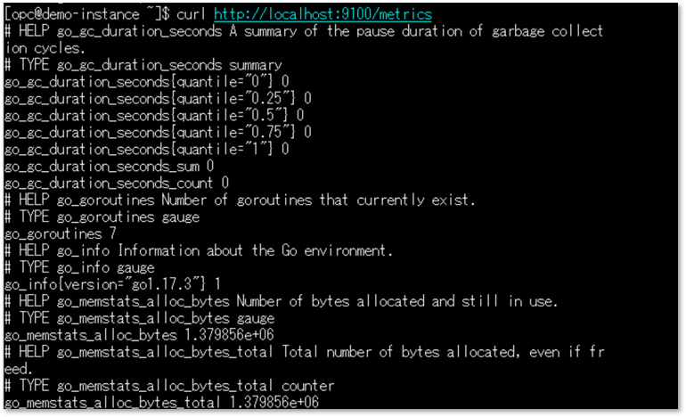

**チュートリアル概要説明**  
Prometheus Node Exporterが収集したOCIインスタンスのメトリックをOCI Monitoringで表示するまでのステップをご紹介します。
このチュートリアルは[OCIドキュメント](https://docs.oracle.com/ja-jp/iaas/management-agents/doc/set-management-agents-collect-prometheus-metrics.html#OCIAG-GUID-7DBE4880-9E73-44C5-AB0E-3CEF93B8DDFD)を補足する内容となりますので、あわせてご参照ください。

**所要時間 :** 約30分

**前提条件 :**
+ 監視対象となるコンピュート・インスタンスの作成  
  参考：[その3 - インスタンスを作成する](https://oracle-japan.github.io/ocitutorials/beginners/creating-compute-instance/)
+ OSはOracle Linux 9
+ 管理エージェントはOracle Cloud Agentプラグインを使用
+ 構成のイメージ


**必要な権限 :**  
以下の権限設定が最低限必要となります。OCIユーザーはテナント管理者を想定しています。
+ 動的グループ
```
all {resource.type='managementagent' resource.compartment.id='<compartment name>'}
```
  動的グループの概要と設定方法については以下を参照ください。  
  OCIドキュメント：[動的グループの管理](https://docs.oracle.com/ja-jp/iaas/Content/Identity/Tasks/managingdynamicgroups.htm)

+ ポリシー
```
allow dynamic-group Management-Agent-Dynamic-Group to use metrics in compartment <compartment name> where target.metrics.namespace = '<namespace name>'
```


コンパートメントはエージェントがあるコンパートメント名を、ネームスペースには任意のネームスペース名を入力します。6章で設定する管理エージェントのUIで指定する名前と一致させる必要があります。


<a id="anchor1"></a>

# 1. Oracle Cloud Agent プラグインの有効化
+ コンピュートインスタンスの詳細画面で管理エージェントのプラグインを有効にします。  


<br><br>

<a id="anchor2"></a>

# 2. Node Exporter ダウンロード
+ コンピュート・インスタンスにSSHでログインし、OPCユーザーで以下コマンドを実行します。
```
wget https://github.com/prometheus/node_exporter/releases/download/v1.10.2/node_exporter-1.10.2.linux-amd64.tar.gz
```
+ または、[Github](https://github.com/prometheus/node_exporter/releases)から直接ダウンロードし、SCPツール等で監視対象サーバーにコピーします。  



2026年2月時点でNode Exporterの最新版はv1.10.2となります。  
使用するバージョンにあわせてコマンドのファイル名を変更してください。

<br><br>

<a id="anchor4"></a>

# 3. Node Exporter インストールの確認
+ 解凍した後、インストール確認のためNode_Exporterを実行します。
```
tar xvfz node_exporter-1.10.2.linux-amd64.tar.gz
```
```
cd node_exporter-1.10.2.linux-amd64
```
```
sudo cp node_exporter /usr/local/bin
```
```
cd /usr/local/bin
```
```
./node_exporter
```
+ 実行するとNode Exporterが起動し、以下のようなメッセージが出力されますのでそのままにしておきます。※停止するにはCtl+C


+ Node Exporterを起動したまま、別のターミナル画面を開いて以下コマンドを実行します。
```
curl http://localhost:9100/metrics
```
+ 以下のように収集されたメトリック一覧が表示されれば、インストールは成功です。


<br><br>

<a id="anchor5"></a>

# 4. SElinux モード変更
+ Node Exporterが自動起動するようにサービス化するため、SELinuxのモードを変更しておきます。
```
sudo vi /etc/selinux/config
```
+ コンフィグファイルで enforcing > permissive へ変更し、OSを再起動します。


+ getenforceコマンドでモードがpermissiveに変更されていることを確認します。
<br><br>


この記事では便宜的にSELinuxをPermissiveにしていますが、本番環境等ではセキュリティの観点からEnforcingとすることが推奨されます。


<a id="anchor6"></a>

# 5. Node Exporter サービス化
+ Systemdのユニット定義ファイルを作成します
```
sudo vi /etc/systemd/system/node_exporter.service
```

+ 記述例
```
[Unit]
Description=Node Exporter
After=network.target

[Service]
User=opc
Type=simple
ExecStart=/usr/local/bin/node_exporter
Restart=always
RestartSec=5

[Install]
WantedBy=multi-user.target
```


この記事では便宜的にNode Exporterの実行ユーザーをopcとしていますが、本番環境等ではセキュリティの観点から専用ユーザーを作成することが推奨されます。


+ ユニット定義ファイルのリロード
```
sudo systemctl daemon-reload
```

+ OS再起動時にサービスが自動起動するよう有効化
```
sudo systemctl enable node_exporter
```

+ サービスの起動
```
sudo systemctl start node_exporter
```

+ 以下コマンドでステータスを確認し、ActiveになっていればOKです。
```
sudo systemctl status node_exporter
```
<br>

<a id="anchor7"></a>

# 6. 管理エージェント データソースの作成
+ 管理エージェント > エージェントとゲートウェイ > 対象のエージェントへ進み「データソースの管理」をクリックします。


+ 「データソースの追加」をクリックし、必要項目を入力します。


  **データソース・タイプ**：Prometheusuで固定  
  **名前**：任意  
  **メトリック・コンパートメント**：ポリシーで指定したコンパートメント  
  **メトリック・ネームスペース**：任意、ポリシーで指定したコンパートメント  
  **URL**：http://localhost:9100/metrics


  **カスタム・メトリック・ディメンション**：この記事では使用しません  
  **オプションのプロパティ**：この記事ではメトリックのフィルタリングのため allowMetrics のみ使用します  

  この例では以下のメトリックのアップロードを許可しています。
  - node_cpu_seconds_total（CPU時間）  
  - node_memory_Active_bytes（メモリ使用量）  
  - node_filesystem_avail_bytes（ファイルシステム使用量）
<br><br>


オプションのプロパティ詳細についてはOCIドキュメント：[オプション・データソース・プロパティ](https://docs.oracle.com/ja-jp/iaas/management-agents/doc/set-management-agents-collect-prometheus-metrics.html#OCIAG-GUID-7DBE4880-9E73-44C5-AB0E-3CEF93B8DDFD)を参照ください。


<a id="anchor8"></a>

# 7. モニタリングでメトリックを確認
+ データソースを作成すると、1分程度でメトリックが反映されます。  


+ ネームスペースやメトリックを選択できるようになっています。  


<br><br>

<a id="anchor9"></a>

# 参考：メトリックのフィルタリングについて
+ Node Exporterでは多くのメトリックがデフォルトで有効になっており、そのままでは大量のデータがOCIに送信されます。カスタムメトリックのInjectionは課金対象となるため、「allowMetrics」で必要なメトリックのみ許可する設定をお勧めします。
+ Node Exporterにはコレクタという概念があり、メトリックの種類ごとにカテゴリ分けがされています。Node Exporter起動時にコレクタを有効化・無効化することができますので、こちらを使ってより効率的に細かくメトリックをフィルタリングすることも可能です。コレクタについては[GitHub](https://github.com/prometheus/node_exporter#collectors)に公開されていますので、フィルタリングの参考にしてください。
  
- ユニット定義ファイルの記述例
```
[Unit]
Description=Node Exporter
After=network.target

[Service]
User=opc
Type=simple
ExecStart=/usr/local/bin/node_exporter --collector.disable-defaults --collector.cpu --collector.meminfo --collector.filesystem
Restart=always
RestartSec=5

[Install]
WantedBy=multi-user.target
```
<br><br>

<a id="anchor11"></a>

# 参考：管理エージェントのログファイルの配置場所
+ Oracle Cloud Agent プラグインを使用している場合
```
/var/lib/oracle-cloud-agent/plugins/oci-managementagent/polaris/agent_inst/log/
```

+ 管理エージェントを個別にインストールした場合
```
/opt/oracle/mgmt_agent/agent_inst/log/
```

+ 主に以下のログファイルがインストールのトラブルシューティングに役立ちます。
```
mgmt_agent.log
mgmt_agent_client.log
```