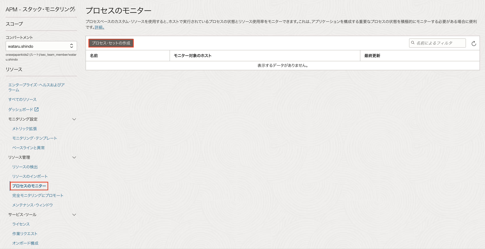
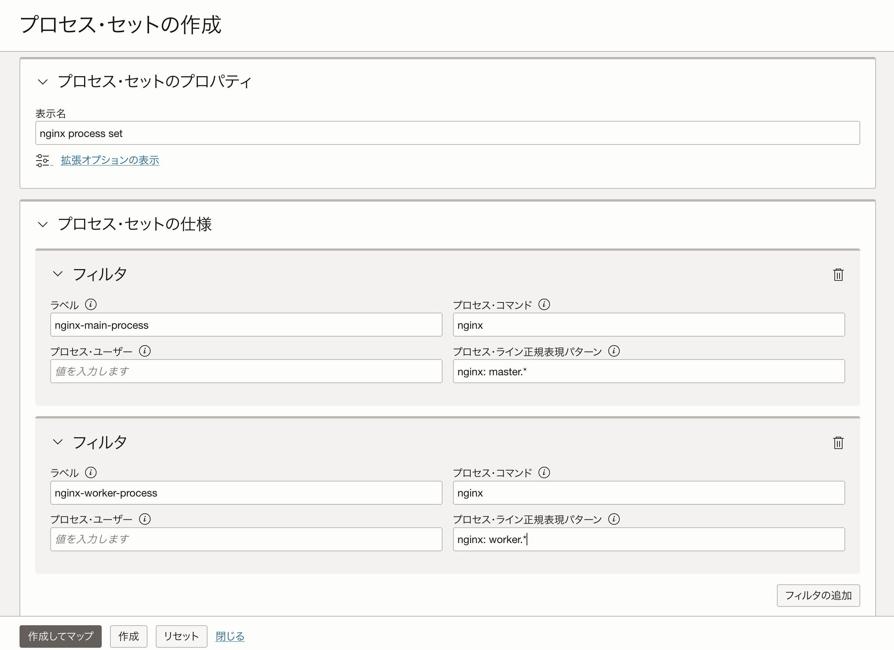
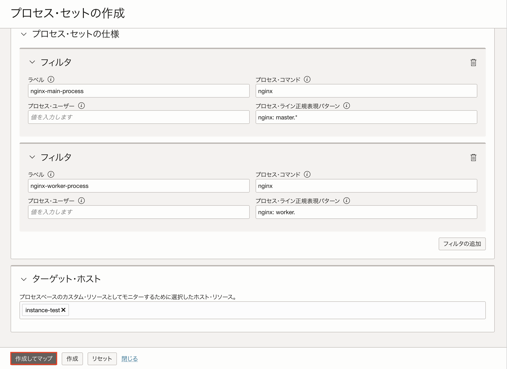
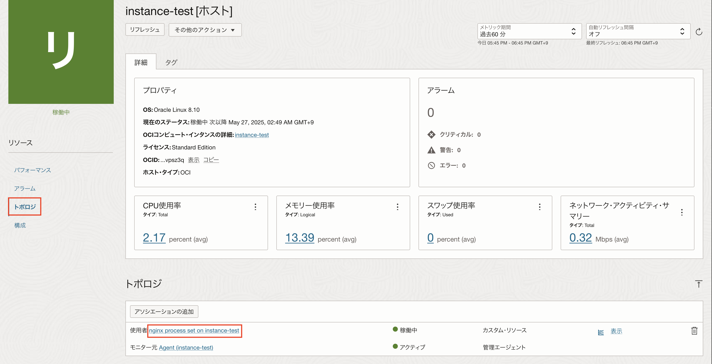
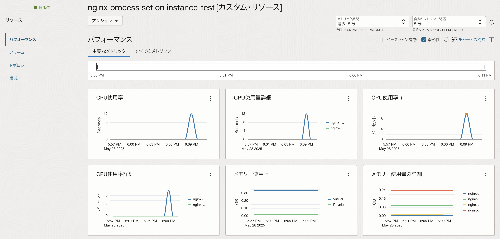
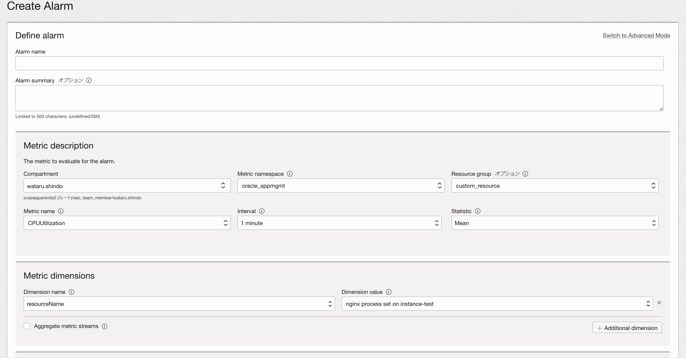

**チュートリアル概要 :**  
本チュートリアルでは、Stack Monitoring のプロセスベースのカスタム・リソースを設定しホストで実行されているプロセスを監視する手順をご紹介します。プロセスベースのカスタム・リソースを利用することで、プロセスが使用しているCPUやメモリーの使用率を監視できます。

**所要時間 :** 約20分

**前提条件1 :** テナンシ上で以下のリソースが作成済であること
+ コンパートメント
+ ユーザー
+ ユーザーグループ
+ VCN
+ 対象リソース

**前提条件2 :** Stack Monitoring が有効化済みであること 
[こちら](https://oracle-japan.github.io/ocitutorials/management/stack_monitoring_onboarding/)を参考にStack Monitoringを有効化できます。

**前提条件3 :** Stack Monitoringで対象リソースが監視されていること  
 - [こちら](https://oracle-japan.github.io/ocitutorials/management/stack_monitoring_basedb/)を参考にStack Monitoring でBaseDB を監視できます。
 - [こちら](https://oracle-japan.github.io/ocitutorials/management/stack_monitoring_install/)を参考にStack Monitoring でCompute を監視できます。

# 1.プロセス・セットの作成
本チュートリアルではコンピュートで実行されているnginxのプロセスを監視するための設定をご紹介します。 
プロセスを監視するためのプロセス・セットは、プロセスのモニターから作成できます。 

プロセスセットの作成をクリックします。

プロセス・セットのプロパティは以下のように設定します。
 - 表示名：任意の名前
 - ラベル：nginx-main-process
 - プロセス・コマンド：nginx
 - プロセス・ライン行正規表現パターン：nginx: master.*
 - ターゲット・ホスト：プロセスを実行している監視対象のリソース


プロセス・ユーザーはプロセスを実行中のユーザーの名前がある場合は指定します。


プロセス・セットのプロパティを設定したら、「作成してマップ」クリックします。

プロセスセットを設定したリソースのトポロジから作成したプロセスセットをクリックします。

そのプロセスによって消費されているリソースなどのメトリックが表示されます。

# 2.アラームの作成
アラーム定義を作成し、メトリックの値がなんらかのしきい値に達したらアラームを発行して通知などを行うことが可能です。
プロセス・セットで設定したメトリックは、oracle_metric_extensions_appmgmtを使用することでアラームを設定することができます。

詳細のアラーム作成手順については[こちら](https://oracle-japan.github.io/ocitutorials/intermediates/monitoring-resources/#4-%E3%82%A2%E3%83%A9%E3%83%BC%E3%83%A0%E3%81%AE%E9%80%9A%E7%9F%A5%E5%85%88%E3%81%AE%E4%BD%9C%E6%88%90)をご確認ください。