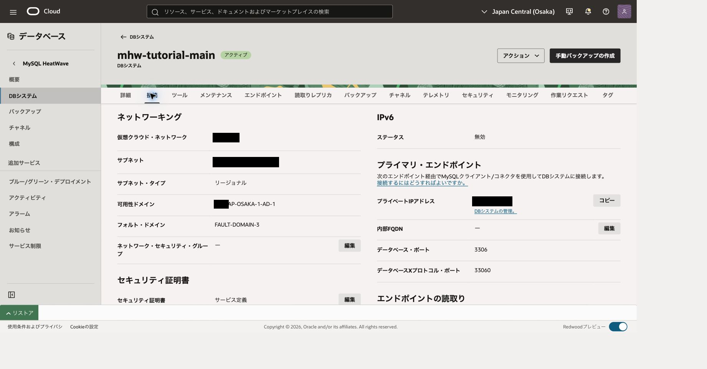
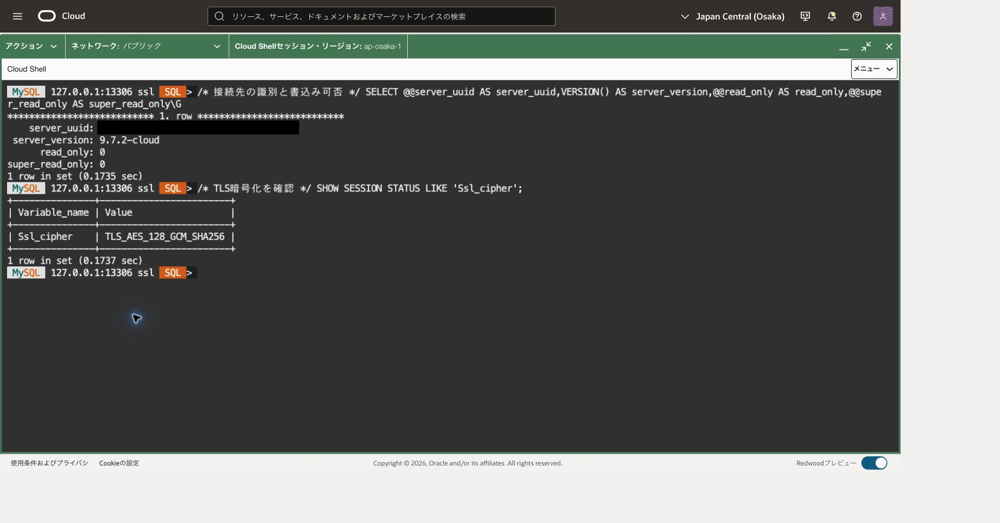

この章では、MySQL HeatWaveをクラウド版MySQLとして使うためのDBシステムを作成します。分析用HeatWaveクラスタはまだ追加しません。

Cloud ShellでMySQL Shell Communityを動かし、ComputeをSSHの転送先としてDBに接続します。ComputeへログインしてSQLを実行する構成ではありません。

```text
Cloud Shell: MySQL Shell Community
  → 127.0.0.1:13306
  → SSHの暗号化された転送 → Compute
  → private DB endpoint:3306
```

MySQL接続には別途TLSを使います。SSHだけではComputeからDBまでの区間の暗号化を確認できません。

所要時間の目安は60～90分です。DB作成待ちと、前提環境の準備時間は別に必要です。

## この章の完成状態

- MySQL 9.7 LTSのstandalone DBがACTIVEになっている。
- Community版クライアントから、Classic protocolとTLSで接続できる。
- 接続先UUIDと版を記録し、専用データの件数と集計値を確認できる。
- 後続章へ引き継ぐDBと、終了してよい接続プロセスを区別できる。

## 1. 前提条件を確認する

実行する画面やSQL/JSモードの違いは、[コース冒頭の操作場所の説明](../#操作する場所を見分ける)を参照してください。

次の達成条件を満たしてください。既存のMySQLチュートリアルを実施済みである必要はありません。

コンパートメントは資源と権限の整理単位、VCNはクラウド内の仮想ネットワーク、サブネットはその区画です。OCIDはOCI資源の識別子、UUIDは接続したMySQLサーバーの識別子です。画面の表示名だけでなく、これらの識別子を使って操作対象を確認します。

- OCIにサインインでき、対象コンパートメントと大阪リージョンを選択できる。
- 後述のIAMポリシーが適用され、DBシステムとCloud Shellを利用できる。
- 同じVCNにCompute用サブネットとDB用のIPv4-only private subnetがある。後続の読取りレプリカ演習のため、dual-stackやIPv6-onlyのsubnetは使わない。
- 転送用Computeが起動済みで、公開IP、OSユーザー名、SSH鍵、信頼できる経路で確認したホスト鍵指紋が分かる。
- Cloud ShellからComputeのTCP22、およびComputeのprivate IPからDBのTCP3306へ通信できる。
- Cloud ShellのhomeにCommunity版クライアントと少量の演習ファイルを置く空き容量がある。
- DB、Compute、ストレージ、バックアップ等の利用料金と、演習終了後の削除方針を確認している。

VCNがない場合は[仮想ネットワークの作成](https://oracle-japan.github.io/ocitutorials/beginners/creating-vcn/)、Computeがない場合は[インスタンスの作成](https://oracle-japan.github.io/ocitutorials/beginners/creating-compute-instance/)を参考に準備します。本章ではComputeにMySQL Shellを導入せず、公開SSHの送信元をCloud Shellの現在の出口IPに限定します。既存のルールを確認し、DBをインターネットへ公開しないでください。

Cloud Shellの出口IPはセッションの変更で変わることがあります。変更時は許可済み送信元を更新し、不要になった古い許可を整理します。共有ネットワークのルールを他の利用者の確認なしで変更しないでください。

ネットワークを自分で管理していない場合は、次の準備票を管理者へ渡してください。Cloud Shell側の通信は、手順3でPublic Networkを選んでから確認します。端末内の `hostname -I` などで表示される内部IPを、公開SSHの送信元に使わないでください。

|管理者と確認・記録する項目|必要な状態|
|---|---|
|リージョン・区画・VCN・DB用サブネット|大阪の演習用資源。DB用はIPv4-onlyのプライベート・サブネット|
|Computeの公開IP・プライベートIP・OSユーザー|公開IPはSSH接続先、プライベートIPはDB通信の送信元として使用|
|Computeに適用されるセキュリティ・リスト／NSGとOSファイアウォール|管理者が承認した方法で確認したCloud Shellの現在の出口IPv4（`/32`）からTCP22を許可|
|DBに適用されるセキュリティ・リスト／NSG|ComputeのプライベートIPv4（`/32`）からTCP3306を許可。必要な送信側ルールも確認|
|公開SSHの経路と鍵|Computeの公開サブネットからインターネット・ゲートウェイへの経路、対応する利用者の秘密鍵、信頼済みホスト鍵指紋|

出口IPの確認方法が用意されていない場合は管理者に確認し、便宜的に送信元を `0.0.0.0/0` へ広げて進めないでください。準備が整ったら手順4の鍵確認と転送へ進み、手順5のSQL接続でDBまでの疎通を確認します。[セキュリティ・ルールの設定](https://docs.oracle.com/en-us/iaas/Content/Network/Concepts/securityrules.htm)

### 必要なポリシー

OCI管理者が、[HeatWaveの必須ポリシー](https://docs.oracle.com/en-us/iaas/mysql-database/doc/creating-mandatory-policies.html)のPolicy Builderテンプレート **Let database admins manage HeatWave resources** を使い、演習グループと対象コンパートメントに適用します。作成前に以下が含まれることを確認します。

|権限の対象|必要な操作|
|---|---|
|mysql-family|対象区画のDB、バックアップ、レプリカ等の管理|
|ネットワークの列挙権限|区画/VCN/subnet参照、subnetへのattach/detach、VNIC作成/変更/削除、NSGメンバー更新・関連付け|
|dbmgmt-mysql-family|テンプレートが要求するDatabase Management関連管理|
|tag-namespaces|テンプレートに従うタグ名前空間の利用|

テンプレートの全文と対象範囲をコンソールで確認してください。`mysql-family`だけを付与しても、subnetやVNICの権限不足は解消しません。IAMポリシーを作成する権限を、演習者全員に付与する必要はありません。

Cloud Shellには、演習者のIAMグループに対して次の権限も必要です。山括弧部分を自分のドメイン/グループへ置き換えます。既存ポリシーで満たしていれば重複作成しません。

```text
Allow group <DOMAIN>/<GROUP> to use cloud-shell in tenancy
Allow group <DOMAIN>/<GROUP> to use cloud-shell-public-network in tenancy
```

この構成は公開IPを持つComputeへ接続するため、Cloud ShellのPublic Networkを使います。[Cloud Shellの権限](https://docs.oracle.com/en-us/iaas/Content/API/Concepts/cloudshellintro.htm)と[Public Networkの権限](https://docs.oracle.com/en-us/iaas/Content/API/Concepts/cloudshellintro_topic-Cloud_Shell_Networking.htm)は別です。Compute/VCNを新規作成する場合は、それらの準備手順に必要な権限も別途用意します。

セキュリティ・リストとNSGの許可は合算されます。広い既存許可がある状態で限定NSGだけ追加しても、通信元を制限したことにはなりません。

## 2. DBシステムを作成する

大阪リージョンのMySQL HeatWaveのDBシステム一覧を開き、作成を選びます。開発/テスト用テンプレートを出発点とし、次の値を一つずつ確認します。既定値が異なる場合は表に合わせます。

|項目|設定|
|---|---|
|コンパートメント|演習用の区画|
|表示名|`mhw-tutorial-main`（自分の演習と区別できる名前）|
|管理ユーザー|`tutorial_admin`|
|バージョン|MySQL 9.7.2（9.7 LTS）|
|DB構成|Standalone|
|HeatWaveクラスタ|無効|
|シェイプ|ECPUモデルのMySQL.8|
|初期データストレージ|50GiB|
|ネットワーク|準備したVCNとDB用IPv4-only private subnet|
|自動バックアップ|有効、保持7日|
|ポイントインタイム・リカバリ|有効|
|バックアップのソフト削除|有効|
|自動ストレージ拡張|無効（高可用性の章で上限を設定して有効化）|
|削除保護|無効|
|DB削除後の自動バックアップ保持|無効|
|DB削除時の最終バックアップ|無効（必要なデータは削除前に別途保護）|

管理パスワードを安全に設定します。パスワードをコマンド、本文、スクリーンショットへ記録しないでください。

自動拡張の有無と上限、削除保護、最終バックアップ、DB削除後の自動バックアップ保持も確認して自分の記録へ残します。これらは費用と後片付けに影響します。バックアップのソフト削除が有効なため、削除操作の直後にバックアップが完全消去されるとは限りません。

作成を送信したら、同じDBを再作成せず現在の状態と作業リクエストを確認します。ACTIVEになった後、DBのOCID、private IP、MySQL port（3306）、実際の版、シェイプを控えます。名前は重複可能なので、対象の識別にはOCIDも使います。

入力項目の意味や既定値は[DBシステム作成の公式説明](https://docs.oracle.com/en-us/iaas/mysql-database/doc/creating-db-system.html)で確認できます。



DBがアクティブになったら、接続タブでプライベートIPとデータベース・ポート3306を確認します。

## 3. Cloud ShellにCommunity版を用意する

[Cloud Shellの基本操作](https://oracle-japan.github.io/ocitutorials/intermediates/cloud-shell/)を参考に、OCIコンソールのCloud Shellを開きます。以後のOSコマンドはこの画面で実行します。ネットワークをPublic Networkへ切り替えます。これはCloud Shell側の接続方式の変更であり、DBを公開する操作ではありません。

本章のクライアントは **MySQL Shell Community 26.7.1**、サーバーは **MySQL 9.7.2** です。別製品の版番号なので一致させる必要はありません。

以下はOracle Linux 8、aarch64のCloud Shell向けです。OS/CPUが違う場合は対応する[公式配布物](https://dev.mysql.com/downloads/shell/)を選択し、このARM用RPMを使用しないでください。

```bash
# 目的: 配布物に適合するOS、CPU、メモリページサイズを確認する。
cat /etc/os-release
uname -m
getconf PAGESIZE
```

本章のOracle Linux 8/aarch64（64KiBページ）環境には、EL8 aarch64 RPMを利用者専用の別領域に展開します。汎用tar版とは同梱ライブラリの適合条件が異なるため、配布物を置き換えないでください。標準搭載版やシステムのRPM管理情報は変更しません。

### 3.1 配布物と公開署名鍵を取得する

以下は[公式ダウンロード](https://dev.mysql.com/downloads/shell/)のEL8 aarch64用RPMと、Oracleの公開検証鍵を取得するコマンドです。新しい作業領域を作るため、既存ファイルを上書きしません。失敗した場合は次のブロックへ進まず、通信と表示エラーを確認してください。

```bash
# 目的: この導入専用の保存先を作り、公式配布物を時間制限付きで取得する。
MHW_DOWNLOAD_DIR=$(mktemp -d "$HOME/mhw-community-download-XXXXXX")
MHW_RPM="$MHW_DOWNLOAD_DIR/mysql-shell-26.7.1-1.el8.aarch64.rpm"
MHW_GPG_KEY="$MHW_DOWNLOAD_DIR/RPM-GPG-KEY-mysql-2025"
(
  set -eu
  curl --fail --location --connect-timeout 15 --max-time 180 \
    --output "$MHW_RPM" \
    'https://dev.mysql.com/get/Downloads/MySQL-Shell/mysql-shell-26.7.1-1.el8.aarch64.rpm'
  curl --fail --location --connect-timeout 15 --max-time 60 \
    --output "$MHW_GPG_KEY" 'https://repo.mysql.com/RPM-GPG-KEY-mysql-2025'
)
```

### 3.2 公開鍵とRPM署名を検証する

[MySQLの公開署名鍵の確認方法](https://dev.mysql.com/doc/refman/9.7/en/checking-gpg-signature.html)と照合します。本版で用いる主鍵の指紋は `BCA43417C3B485DD128EC6D4B7B3B788A8D3785C` です。公開鍵なので秘密鍵ではありません。

```bash
# 目的: 取得した公開鍵の指紋を表示する。秘密鍵の表示ではない。
gpg --show-keys --with-fingerprint "$MHW_GPG_KEY"
```

一致を確認後、利用者専用のRPM DBを使って署名を検証し、成功した場合だけ展開します。[RPM署名の確認](https://dev.mysql.com/doc/refman/9.7/en/checking-rpm-signature.html)はファイルのチェックサム一致とは別の検査です。

```bash
# 目的: システムRPM DBを変更せず、署名検証済みの配布物だけを新規展開する。
MHW_ROOT="$HOME/mysql-shell-community-26.7.1-el8"
MHW_RPMDB=$(mktemp -d /tmp/mhw-rpmdb-XXXXXX)
(
  set -eu
  set -o pipefail
  MHW_FINGERPRINT=$(gpg --show-keys --with-colons "$MHW_GPG_KEY" |
    awk -F: '$1 == "fpr" { print $10; exit }')
  test "$MHW_FINGERPRINT" = 'BCA43417C3B485DD128EC6D4B7B3B788A8D3785C'
  rpm --dbpath "$MHW_RPMDB" --initdb
  rpm --dbpath "$MHW_RPMDB" --import "$MHW_GPG_KEY"
  rpm --dbpath "$MHW_RPMDB" -K "$MHW_RPM"
  test ! -e "$MHW_ROOT"
  mkdir "$MHW_ROOT"
  cd "$MHW_ROOT"
  rpm2cpio "$MHW_RPM" | cpio -idmu
)
# 目的: 以後使用する実体を明示し、Community版と版番号を確認する。
MHW_SHELL="$MHW_ROOT/usr/bin/mysqlsh"
"$MHW_SHELL" --version
```

署名検査が `digests signatures OK`、版表示が26.7.1でCommunityを示すことを確認します。`NOKEY` や `NOT OK`、展開エラーなら中止してください。既に導入先が存在する場合は上書きせず、その実体の版を確認します。配布版は更新されるため、実施時に公式配布ページで最新版と対応OSを確認してください。別版を選ぶ場合は、URL・ファイル名・展開先・署名鍵をその版に合わせて変更し、署名検証を省略しません。

以後、単に `mysqlsh` とせず `"$MHW_SHELL"` を使います。Cloud Shell再開時には `MHW_ROOT` と `MHW_SHELL` を再設定します。永続PATHや標準搭載版の置換は不要です。

## 4. Computeを経由する転送を開始する

Cloud ShellのOSシェルで値を設定します。DBのIPには**この章で新規作成したDB**の値を使い、以前の演習のIPを再利用しません。

```bash
# 目的: 接続先と既存鍵を明示する。秘密鍵の内容は表示しない。
MHW_COMPUTE_IP='COMPUTE_PUBLIC_IP'
MHW_OS_USER='opc'
MHW_DB_IP='NEW_DB_PRIVATE_IP'
MHW_KEY="$HOME/.ssh/mhw-learning.key"
MHW_ADMIN='tutorial_admin'
MHW_TUNNEL_DIR=$(mktemp -d /tmp/mhw-tunnel-XXXXXX)
MHW_SOCKET="$MHW_TUNNEL_DIR/control"
```

### 4.1 SSHの秘密鍵を用意する

Compute作成時に登録した公開鍵と対になる、**既存の秘密鍵**が必要です。公開鍵（通常は末尾が `.pub`）を秘密鍵として指定しないでください。鍵を紛失した場合はここで新しい鍵を無関係に生成せず、Compute管理者へ相談します。

Cloud Shell左上メニューの **Upload** から、自分が管理する秘密鍵ファイルをアップロードします。ファイル名に個人情報を含めず、鍵本文は表示・コピー・撮影しません。転送後の権限は保持されないため、次で自分だけが読めるよう設定します。[Cloud Shellのファイル転送](https://docs.oracle.com/en-us/iaas/Content/API/Concepts/devcloudshellgettingstarted.htm)

```bash
# 目的: アップロードした自分の秘密鍵を権限制限した専用パスに配置する。
MHW_UPLOADED_KEY="$HOME/uploaded-private.key"
(
  set -eu
  test -f "$MHW_UPLOADED_KEY"
  test ! -e "$MHW_KEY"
  chmod 600 "$MHW_UPLOADED_KEY"
  mkdir -p "$HOME/.ssh"
  chmod 700 "$HOME/.ssh"
  mv "$MHW_UPLOADED_KEY" "$MHW_KEY"
  chmod 600 "$MHW_KEY"
)
```

`uploaded-private.key` は実際にアップロードしたファイル名へ置き換えます。同名の導入済み鍵があれば上書きせず、それが今回のCompute用であることを確認して再利用します。秘密鍵は公開リポジトリやObject Storageへ置きません。

### 4.2 Computeのホスト鍵を検証する

SSHには、利用者の秘密鍵とは別に、接続先Computeを識別するホスト鍵があります。初回接続前に、管理者から **対象ComputeのSSHサーバーのECDSA公開ホスト鍵のSHA256指紋** を、既に信頼できる連絡経路で受け取ります。管理者は信頼済みの管理接続等で `/etc/ssh/ssh_host_ecdsa_key.pub` の指紋を確認できます。本章の転送接続を使って取得元の信頼を自己証明しません。

OCIの「コンソール接続」に表示される指紋はシリアルコンソールサービス側の鍵の場合があり、Compute OSのTCP22の鍵とは別です。混同しないでください。管理者から正しい指紋を取得できない場合は、初回接続を進めません。

次はComputeの公開ホスト鍵を候補として取得し、**独立して受領した指紋と一致した場合だけ**演習専用のknown_hostsへ登録します。`ssh-keyscan` 単独では相手の真正性を保証しません。[OpenSSHの説明](https://man.openbsd.org/ssh-keyscan)

```bash
# 目的: ネットワークから得た鍵候補を、事前に信頼した指紋と照合する。
MHW_EXPECTED_HOST_FP='SHA256:ADMIN_VERIFIED_FINGERPRINT'
MHW_KNOWN_HOSTS="$HOME/.ssh/mhw-learning-known-hosts"
MHW_CANDIDATE=$(mktemp /tmp/mhw-hostkey-XXXXXX)
(
  set -eu
  set -o pipefail
  ssh-keyscan -4 -T 10 -t ecdsa "$MHW_COMPUTE_IP" > "$MHW_CANDIDATE"
  ssh-keygen -lf "$MHW_CANDIDATE" -E sha256
  MHW_ACTUAL_HOST_FP=$(ssh-keygen -lf "$MHW_CANDIDATE" -E sha256 |
    awk '{print $2}')
  test "$MHW_ACTUAL_HOST_FP" = "$MHW_EXPECTED_HOST_FP"
  test ! -e "$MHW_KNOWN_HOSTS"
  install -m 600 "$MHW_CANDIDATE" "$MHW_KNOWN_HOSTS"
)
```

一致しない場合、警告を無視した登録はせず管理者へ確認します。既に専用known_hostsがある場合は上書きせず、今回のComputeと確認済み指紋に対応することを確認します。

### 4.3 転送だけを開始する

```bash
# 目的: 13306が空いていることを確認する。出力があれば既存転送を調べる。
ss -ltn 'sport = :13306'
```

LISTEN行がない場合だけ次へ進みます。既存待受があれば対象を調べ、新しく開始しません。

```bash
# 目的: リモートコマンドを実行せず、loopbackだけで転送を待ち受ける。
ssh -F /dev/null -4 -fN -T -M -S "$MHW_SOCKET" \
  -o StrictHostKeyChecking=yes -o UserKnownHostsFile="$MHW_KNOWN_HOSTS" \
  -o ForwardAgent=no -o IdentitiesOnly=yes \
  -o ExitOnForwardFailure=yes -o ConnectTimeout=10 -o ServerAliveInterval=30 \
  -o ServerAliveCountMax=3 -i "$MHW_KEY" \
  -L "127.0.0.1:13306:$MHW_DB_IP:3306" \
  "$MHW_OS_USER@$MHW_COMPUTE_IP"
```

起動成功後に次で状態を確認します。

```bash
# 目的: 制御接続とloopback限定待受を確認する。
printf 'MHW_SOCKET=%s\n' "$MHW_SOCKET"
ssh -F /dev/null -S "$MHW_SOCKET" -O check "$MHW_OS_USER@$MHW_COMPUTE_IP"
ss -ltn 'sport = :13306'
```

`-F /dev/null` は既存のSSH設定にある別の転送やリモートコマンドを引き継がないための指定です。秘密鍵にパスフレーズが設定されている場合は、表示された非表示入力に入力します。

`Master running` と `127.0.0.1:13306` の待受を確認します。この段階ではDBへ接続できたことはまだ証明していません。SSHの接続先はCompute、転送先はDBである点に注意してください。

表示された `MHW_SOCKET` の絶対パスを、DBのOCID・プライベートIP・ローカルポート13306と組にして自分の作業メモへ控えます。後続章で転送を再利用・終了するときに必要です。パスワードや秘密鍵本文はメモに含めません。DBへ接続できたら、次節で得るUUIDも追記します。

## 5. TLSでDBに接続する

```bash
# 目的: Classic protocolの接続を転送に通し、TLS暗号化を必須にする。
"$MHW_SHELL" --mysql --sql --host=127.0.0.1 --port=13306 \
  --user="$MHW_ADMIN" --ssl-mode=REQUIRED --password
```

非表示のパスワードプロンプトへ入力します。引数にパスワードを続けて書かないでください。保存を選択する場合は演習用アカウントだけを対象にし、利用環境の保存方針と演習後の削除方法を確認します。

`REQUIRED` はTLS暗号化を必須にしますが、証明書のCA/ホスト名による接続先本人性検証までは行いません。本番構成では信頼するCAと接続先名を整え、検証モードを選んでください。loopback転送と証明書名の整合も検討が必要です。[暗号化接続の説明](https://dev.mysql.com/doc/mysql-shell/26.7/en/mysql-shell-encrypted-connections.html)

SQLモードで次を実行します。

```sql
-- 目的: 接続先を識別し、9.7 LTSと書込み可能な主DBであることを確認する。
SELECT @@server_uuid AS server_uuid, VERSION() AS server_version,
       @@read_only AS read_only, @@super_read_only AS super_read_only\G

-- 目的: この接続でTLS暗号化が成立したことを確認する。
SHOW SESSION STATUS LIKE 'Ssl_cipher';
```

版が9.7.2、両read-only値が0、cipherが空でないことを確認します。UUIDをこのDBの識別値として控えます。異なる結果の場合はデータ作成へ進まず、DB詳細と転送先を確認してください。



接続先の版と読取り専用フラグを確認し、Ssl_cipherに暗号スイートが表示されることを確認します。

## 6. 後続章で使うデータを作成する

ここでは備品の貸出データを新規作成します。個人情報は使いません。

|表|用途|初期件数|
|---|---|---|
|items|備品の一覧|3|
|loans|貸出と料金（整数のセント単位）|4|
|checkpoints|章の検証用マーカー|1|

次のSQLを順番に実行します。各ブロックの結果を確認してから次へ進みます。エラーになった状態で残りを一括貼付けしないでください。

```sql
-- 目的: 同名の既存データがないことを確認する。0行でなければ作成を中止する。
SELECT SCHEMA_NAME FROM information_schema.SCHEMATA
WHERE SCHEMA_NAME = 'mhw_learning';
```

0行を確認したら、スキーマと表を作成します。DDLは暗黙にコミットされるため、途中失敗時にROLLBACKだけでは元に戻りません。途中の再実行はせず、作成済みオブジェクトを確認します。

```sql
-- 目的: このチュートリアルだけで使う名前空間を作成する。
CREATE DATABASE mhw_learning CHARACTER SET utf8mb4;
-- 目的: 後続SQLの対象を演習スキーマへ限定する。
USE mhw_learning;
-- 目的: 主キーを持つ備品マスターを作成する。
CREATE TABLE items (
  item_id INT PRIMARY KEY,
  item_name VARCHAR(60) NOT NULL
) ENGINE=InnoDB;
-- 目的: 貸出を主キーで識別し、備品との参照整合性を保つ。
CREATE TABLE loans (
  loan_id INT PRIMARY KEY,
  item_id INT NOT NULL,
  fee_cents INT NOT NULL,
  CONSTRAINT fk_loans_item FOREIGN KEY (item_id) REFERENCES items(item_id)
) ENGINE=InnoDB;
-- 目的: HA・複製・復元で到達を確認するマーカーを保存する。
CREATE TABLE checkpoints (
  checkpoint_id INT PRIMARY KEY,
  note VARCHAR(80) NOT NULL
) ENGINE=InnoDB;
```

全て成功したら、データを一つのトランザクションで登録します。

```sql
-- 目的: 初期データをまとめて確定できるようトランザクションを開始する。
START TRANSACTION;
-- 目的: 架空の備品3件を登録する。
INSERT INTO items VALUES (1,'Camera'),(2,'Tripod'),(3,'Microphone');
-- 目的: 合計6000セントとなる貸出4件を登録する。
INSERT INTO loans VALUES (11,1,1200),(12,2,1800),(13,3,900),(14,1,2100);
-- 目的: この章で初期データを用意したことを識別する。
INSERT INTO checkpoints VALUES (101,'initial-data');
```

3件、4件、1件の登録成功を確認します。いずれかが失敗した場合は次のCOMMITを実行せず、`ROLLBACK`でこのデータ登録を取り消して原因を確認します。


```sql
-- 目的: 成功した初期データの登録を確定する。
COMMIT;
```

確定後に次の読取りで照合します。応答不明なら再接続して読取りだけを実行します。

```sql
-- 目的: 確定後の件数と料金合計が設計値と一致することを確認する。
SELECT (SELECT COUNT(*) FROM mhw_learning.items) AS item_count,
       COUNT(*) AS loan_count, SUM(fee_cents) AS total_fee_cents
FROM mhw_learning.loans;
-- 目的: 確定済みの章マーカーを確認する。
SELECT checkpoint_id, note FROM mhw_learning.checkpoints ORDER BY checkpoint_id;
```

期待値は `item_count=3`、`loan_count=4`、`total_fee_cents=6000`、マーカーは `101 / initial-data` です。これが後続章の基準です。COMMITの応答が不明なまま切断した場合は、再接続してこの読取りで状態を確認し、INSERTをそのまま再送しないでください。


別接続からもitems 3件、loans 4件、料金合計6000セントと101のマーカーを確認します。

## 7. 接続を終了し、DBは次章へ引き継ぐ

MySQL Shellで `\quit` を実行し、Cloud ShellのOSシェルへ戻ります。

```bash
# 目的: この章で開始した制御ソケットの転送だけを終了する。
ssh -F /dev/null -S "$MHW_SOCKET" -O exit "$MHW_OS_USER@$MHW_COMPUTE_IP"
# 目的: 13306の待受がなくなったことを確認する。
ss -ltn 'sport = :13306'
```

Public Networkの利用を終える場合は、Cloud Shellのネットワークを元の設定へ戻します。再開時は必要な変数を再設定し、同じDBのOCIDと現在のendpointを確認して転送を作り直します。Cloud Shellのhomeにファイルが残っていても、プロセスや変数が継続するとは限りません。

後続の読取りレプリカにも使用するため、MySQL.8を維持します。HA変更とHeatWaveの表ロード/再ロードは同時に実施しません。これらの処理中は完了を確認してから次の構成変更へ進みます。

次章へ進む場合は **主DBと演習データを削除しません**。このDBを使って高可用性構成を学びます。ここで演習を終了する場合は、後片付けの章の対象確認に従ってDBとバックアップ等を整理してください。Compute/VCNを共有している場合は削除しません。

## うまくいかない場合

|症状|確認する点|
|---|---|
|DB作成が進まない|作業リクエストの非秘密エラー、shape容量、IAM。成功不明の再作成はしない|
|SSH host keyエラー|信頼する管理者の指紋と照合。StrictHostKeyCheckingを無効化しない|
|転送だけ成功しDBがタイムアウト|新DB ACTIVE/endpoint、Compute→DBの3306、既存SL/NSG、転送先IP|
|アクセス拒否|管理ユーザー、入力したパスワード、対象DB。秘密をログへ出さない|
|TLS cipherが空|接続コマンドのTLS指定と接続方式。平文接続で先へ進まない|
|スキーマが既にある|所有者と前回の実行結果を確認。自動DROPしない|
|Community版が起動しない|OS/CPU/page sizeと配布物。標準搭載版で成功したことに置き換えない|

## 参考資料

- [MySQL HeatWave DBシステムの作成](https://docs.oracle.com/en-us/iaas/mysql-database/doc/creating-db-system.html)
- [MySQL Shell Communityの配布](https://dev.mysql.com/downloads/shell/)
- [Cloud Shellの利用](https://docs.oracle.com/en-us/iaas/Content/API/Concepts/devcloudshellgettingstarted.htm)

## 失敗時のトランザクション取消

INSERT等のエラーがあり、同じ接続で未確定の変更が残っている場合だけ実行します。DDLや既に確定した変更は取り消せません。

```sql
-- 目的: 失敗した未確定DMLを取り消し、状態確認から再開する。
ROLLBACK;
```

## 章の移動

[次章](../102-high-availability/)
