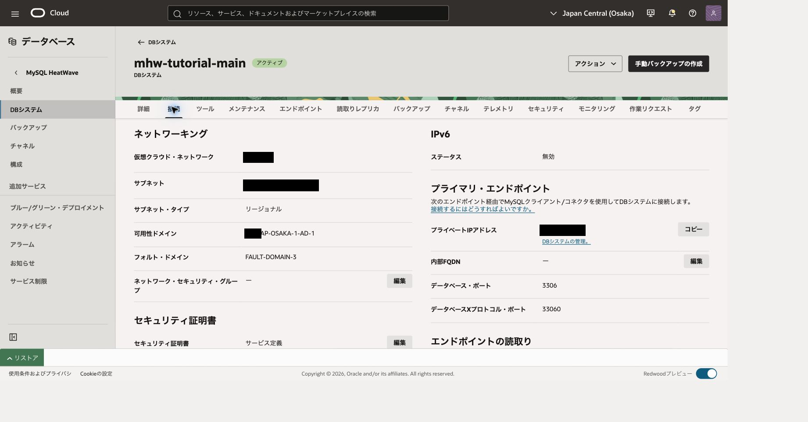
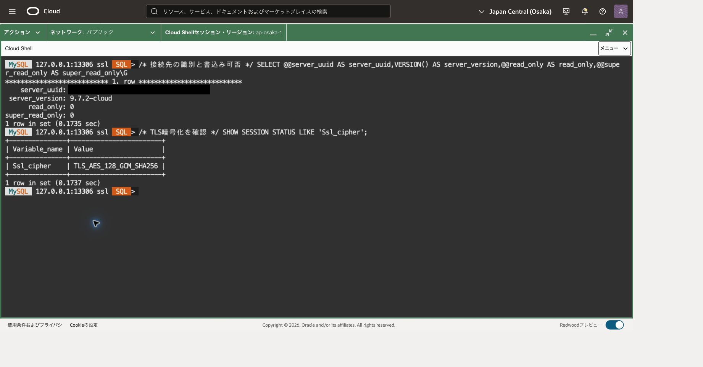

この章ではMySQL 9.7 LTSのDBシステムを作り、Cloud Shellから接続して後続章の基準データを用意します。分析用HeatWaveクラスタはまだ追加しません。所要時間は60〜90分と作成待ちです。

## 前提・費用・完成状態

OCIの演習区画と大阪リージョン、IPv4-onlyのprivate DB subnet、転送用Computeを用意します。[VCN作成](https://oracle-japan.github.io/ocitutorials/beginners/creating-vcn/)と[Compute作成](https://oracle-japan.github.io/ocitutorials/beginners/creating-compute-instance/)が未実施なら先に準備してください。

- Cloud Shell Public NetworkからComputeのTCP22、ComputeからDBのTCP3306へ到達できること。送信元は確認済みIPへ限定し、DBをインターネットへ公開しません。
- Computeの公開IP、対応する自分の秘密鍵、信頼済みの管理者から得たOSのECDSAホスト鍵SHA256指紋が分かること。OCIシリアルコンソール用の指紋とは別です。
- IAM管理者が[必須ポリシー](https://docs.oracle.com/en-us/iaas/mysql-database/doc/creating-mandatory-policies.html)の「Let database admins manage HeatWave resources」を演習グループ・区画へ適用していること。DB管理だけでなくsubnet/VNIC等の付随権限も必要です。
- 次のCloud Shell権限があること。既存許可で満たす場合は追加しません。

```text
Allow group <DOMAIN>/<GROUP> to use cloud-shell in tenancy
Allow group <DOMAIN>/<GROUP> to use cloud-shell-public-network in tenancy
```

DB・Compute・保存領域・バックアップは課金対象です。[価格表](https://www.oracle.com/cloud/price-list/)と契約単価、保持期間を確認します。本章後は主DBと教材データを保持し、全演習終了時に[106章](../106-monitor-cleanup/)で専用資源だけを削除します。共有Compute・鍵・VCNは削除しません。

完成条件はDBがACTIVE、TLS接続成功、3表とitems=3・loans=4・fee_cents=6000・checkpoint 101です。OCIDはOCI資源、UUIDは接続したMySQLサーバーの識別に使います。

## 1. DBシステムを作る

OCIのMySQL HeatWave→DB systemsから作成します。開発/テスト用テンプレートを選び、次を確認します。

|項目|設定|
|---|---|
|区画／名前|演習区画／mhw-tutorial-main|
|管理ユーザー／バージョン|tutorial_admin／MySQL 9.7.2（9.7 LTS）|
|シェイプ／容量|MySQL.2（2 ECPU・16GiB）／50GiB|
|構成／HeatWave|Standalone／無効|
|ネットワーク|演習VCNのIPv4-only private subnet|
|自動backup／PITR／ソフト削除|有効・7日／有効／有効|
|自動ストレージ拡張|無効。102で上限を設定|
|削除保護／削除後backup保持／最終backup|無効／無効／無効|

管理パスワードは安全に保管し、コマンドラインや作業メモへ書きません。作成を送信したら同じ要求を再送せず、ACTIVEと作業リクエスト成功を確認します。DBのOCID、private IP、ポート 3306、バージョン、シェイプを控えます。ソフト削除されたbackupが追加保持される場合は106で残存を確認します。[公式作成手順](https://docs.oracle.com/en-us/iaas/mysql-database/doc/creating-db-system.html)



## 2. Cloud ShellにMySQL Shell 26.7.1コミュニティ版を用意する

OCI右上のCloud Shellを開き、ネットワークをPublic Networkにします。SQLはCloud Shellで動かし、Computeは転送だけに使います。標準搭載版やComputeへインストールする手順とは混在させません。

OSで環境を確認します。以下はOracle Linux 8・aarch64用です。異なる場合は対応する[公式配布物](https://dev.mysql.com/downloads/shell/)を選び、このRPMを使いません。

```bash
cat /etc/os-release
uname -m
getconf PAGESIZE
```

クライアントはMySQL Shell 26.7.1コミュニティ版、DBサーバーはMySQL 9.7.2 LTSです。最新のMySQL Shellは複数のMySQLサーバーのバージョンをサポートするためバージョン番号が異なっていますが、利用上は問題ありません。Cloud Shellの64KiBページ環境向けにEL8 RPMを専用領域へ展開します。OSのRPM DBや標準版は変更しません。

### 入手して署名を確認する

新規の固定ダウンロード領域を作ります。既存なら停止し、過去の取得物を上書きしません。`curl -fL` はHTTPエラーを失敗にし、配布先への転送を追跡します。

```bash
(
  set -eu
  test ! -e "$HOME/mhw-community-download"
  mkdir "$HOME/mhw-community-download"
  curl -fL --output "$HOME/mhw-community-download/mysql-shell-26.7.1-1.el8.aarch64.rpm" \
    'https://dev.mysql.com/get/Downloads/MySQL-Shell/mysql-shell-26.7.1-1.el8.aarch64.rpm'
  curl -fL --output "$HOME/mhw-community-download/RPM-GPG-KEY-mysql-2025" \
    'https://repo.mysql.com/RPM-GPG-KEY-mysql-2025'
)
```

公開署名鍵の指紋を表示します。主鍵が `BCA43417C3B485DD128EC6D4B7B3B788A8D3785C` と一致し、[公式署名鍵](https://dev.mysql.com/doc/refman/9.7/en/checking-gpg-signature.html)と照合できた場合だけ次へ進みます。

```bash
gpg --show-keys --with-fingerprint "$HOME/mhw-community-download/RPM-GPG-KEY-mysql-2025"
```

隔離したRPM DBで署名を検査します。NOKEY/NOT OKなら停止します。[RPM署名検証](https://dev.mysql.com/doc/refman/9.7/en/checking-rpm-signature.html)

```bash
(
  set -eu
  test ! -e "$HOME/mhw-community-download/rpmdb"
  mkdir "$HOME/mhw-community-download/rpmdb"
  rpm --dbpath "$HOME/mhw-community-download/rpmdb" --initdb
  rpm --dbpath "$HOME/mhw-community-download/rpmdb" --import "$HOME/mhw-community-download/RPM-GPG-KEY-mysql-2025"
  rpm --dbpath "$HOME/mhw-community-download/rpmdb" -K "$HOME/mhw-community-download/mysql-shell-26.7.1-1.el8.aarch64.rpm"
)
```

digests signatures OKを確認した場合だけ新規展開します。既存の導入先は上書きしません。`set -o pipefail` は途中の展開エラーも失敗にします。

```bash
(
  set -eu
  set -o pipefail
  test ! -e "$HOME/mysql-shell-community-26.7.1-el8"
  mkdir "$HOME/mysql-shell-community-26.7.1-el8"
  cd "$HOME/mysql-shell-community-26.7.1-el8"
  rpm2cpio "$HOME/mhw-community-download/mysql-shell-26.7.1-1.el8.aarch64.rpm" | cpio -idmu
)
"$HOME/mysql-shell-community-26.7.1-el8/usr/bin/mysqlsh" --version
```

バージョン表示が26.7.1 Communityなら準備完了です。中断した場合は既存物を読み取り、完了した工程を繰り返しません。

## 3. SSH鍵とホスト鍵を準備する

Cloud ShellのUploadで、Computeの公開鍵と対になる自分の秘密鍵をホームへ置きます。次のuploaded-private.keyを実ファイル名へ置換します。公開鍵.pubは使いません。秘密鍵の内容は画面へ表示したりシェルへ貼り付けたりせず、ファイルのままアップロードします。

```bash
(
  set -eu
  test -f "$HOME/uploaded-private.key"
  test ! -e "$HOME/.ssh/mhw-learning.key"
  mkdir -p "$HOME/.ssh"
  chmod 700 "$HOME/.ssh"
  install -m 600 "$HOME/uploaded-private.key" "$HOME/.ssh/mhw-learning.key"
)
```

既存の演習用鍵がある場合は上書きせず、対象Compute用と確認して再利用します。アップロード元の余分なコピーは所有と用途を照合して後片付けします。

次にCOMPUTE_PUBLIC_IPを実値へ置換して候補ホスト鍵を取得します。`ssh-keyscan`単独では相手を信頼できません。

```bash
(
  set -eu
  set -C
  ssh-keyscan -t ecdsa COMPUTE_PUBLIC_IP > "$HOME/.ssh/mhw-learning-hostkey-candidate"
  ssh-keygen -lf "$HOME/.ssh/mhw-learning-hostkey-candidate" -E sha256
)
```

表示された指紋を、事前に管理者から得た指紋と比較します。**一致した場合だけ**登録します。不明・不一致なら停止し、検証を無効化しません。

```bash
(
  set -eu
  test ! -e "$HOME/.ssh/mhw-learning-known-hosts"
  install -m 600 "$HOME/.ssh/mhw-learning-hostkey-candidate" "$HOME/.ssh/mhw-learning-known-hosts"
)
```

## 4. 前面転送とTLS接続を確認する

Cloud Shellの**タブAは転送専用**です。OSで13306の待受を確認し、LISTENがあれば対象を調べます。不明なプロセスを終了したり、二重に転送を開いたりしません。

```bash
ss -ltn 'sport = :13306'
```

待受がない場合だけ、MAIN_PRIVATE_IPとCOMPUTE_PUBLIC_IPを実値へ置換して開始します。`-N`はSSH先でコマンドを実行しない転送専用、`-L`はCloud Shell内のポート13306とDBのポート3306を結ぶ指定です。`ExitOnForwardFailure`は転送を開始できない場合にSSHを終了します。`StrictHostKeyChecking`と`UserKnownHostsFile`は、前の手順で確認したホスト鍵だけを信頼するための指定です。`-i`で接続に使う秘密鍵を指定します。

```bash
ssh -N \
  -o ExitOnForwardFailure=yes \
  -o StrictHostKeyChecking=yes \
  -o UserKnownHostsFile="$HOME/.ssh/mhw-learning-known-hosts" \
  -i "$HOME/.ssh/mhw-learning.key" \
  -L '127.0.0.1:13306:MAIN_PRIVATE_IP:3306' \
  opc@COMPUTE_PUBLIC_IP
```

正常なら待機したままです。**タブAを閉じず、別のタブBをSQL用に開きます。** Computeへログインしてコマンドを動かす構成ではありません。終了はタブAのCtrl+C、再開は同じ完全コマンドです。

タブBのOSで次を実行します。`--mysql`はClassic protocol、`--sql`はSQLモード、host/portは転送入口です。`REQUIRED`はTLS必須、`--password`は最初のパスワードを非表示入力する指定で、値を引数へ付けません。

```bash
"$HOME/mysql-shell-community-26.7.1-el8/usr/bin/mysqlsh" --mysql --sql --host=127.0.0.1 --port=13306 \
  --user=tutorial_admin --ssl-mode=REQUIRED --password
```

接続後に `Save password for 'tutorial_admin@127.0.0.1:13306'?` と表示されたら、この演習では `Y` を選びます。資格情報はCloud Shell利用者のMySQL Shell資格情報ストアに保存され、後続章の同じhost/port/userでは `--password` を省略できます。パスワード値はコマンドラインやシェルの履歴へ書きません。保存できない環境では接続コマンドへ `--password` だけを戻し、非表示プロンプトへ入力します。演習終了時は106章で保存した資格情報を削除します。

SQLプロンプトでバージョン、UUID、書込み可能状態、TLSを確認します。9.7.2、両read-only値0、cipher非空が条件です。UUID全体をOCID・IPと組にして記録し、次回接続時に照合します。

```sql
SELECT VERSION(),@@server_uuid,@@read_only,@@super_read_only\G
SHOW SESSION STATUS LIKE 'Ssl_cipher';
```



REQUIREDは暗号化を要求しますが、証明書のホスト名検証を意味しません。SSHとDBのTLSは別の暗号化層です。結果が違う場合はデータ作成へ進みません。

## 5. 後続章の基準データを作る

ここでは備品の貸出データを新規作成します。個人情報は使いません。

|表|用途|初期件数|
|---|---|---|
|items|備品の一覧|3|
|loans|貸出と料金（整数のセント単位）|4|
|checkpoints|章の検証用マーカー|1|

次のSQLを順番に実行します。各ブロックの結果を確認してから次へ進みます。エラーになった状態で残りを一括貼付けしないでください。

```sql
SELECT SCHEMA_NAME FROM information_schema.SCHEMATA
WHERE SCHEMA_NAME = 'mhw_learning';
```

0行を確認したら、スキーマと表を作成します。DDLは暗黙にコミットされるため、途中失敗時にROLLBACKだけでは元に戻りません。途中の再実行はせず、作成済みオブジェクトを確認します。

```sql
CREATE DATABASE mhw_learning CHARACTER SET utf8mb4;
USE mhw_learning;
CREATE TABLE items (
  item_id INT PRIMARY KEY,
  item_name VARCHAR(60) NOT NULL
) ENGINE=InnoDB;
CREATE TABLE loans (
  loan_id INT PRIMARY KEY,
  item_id INT NOT NULL,
  fee_cents INT NOT NULL,
  CONSTRAINT fk_loans_item FOREIGN KEY (item_id) REFERENCES items(item_id)
) ENGINE=InnoDB;
CREATE TABLE checkpoints (
  checkpoint_id INT PRIMARY KEY,
  note VARCHAR(80) NOT NULL
) ENGINE=InnoDB;
```

全て成功したら、データを一つのトランザクションで登録します。

```sql
START TRANSACTION;
INSERT INTO items VALUES (1,'Camera'),(2,'Tripod'),(3,'Microphone');
INSERT INTO loans VALUES (11,1,1200),(12,2,1800),(13,3,900),(14,1,2100);
INSERT INTO checkpoints VALUES (101,'initial-data');
```

3件、4件、1件の登録成功を確認します。いずれかが失敗した場合は次のCOMMITを実行せず、`ROLLBACK`でこのデータ登録を取り消して原因を確認します。

```sql
COMMIT;
```

確定後に次の読取りで照合します。応答不明なら再接続して読取りだけを実行します。

```sql
SELECT (SELECT COUNT(*) FROM mhw_learning.items) AS item_count,
       COUNT(*) AS loan_count, SUM(fee_cents) AS total_fee_cents
FROM mhw_learning.loans;
SELECT checkpoint_id, note FROM mhw_learning.checkpoints ORDER BY checkpoint_id;
```

期待値は `item_count=3`、`loan_count=4`、`total_fee_cents=6000`、マーカーは `101 / initial-data` です。これが後続章の基準です。COMMITの応答が不明なまま切断した場合は、再接続してこの読取りで状態を確認し、INSERTをそのまま再送しないでください。


別接続からもitems 3件、loans 4件、料金合計6000セントと101のマーカーを確認します。

## 完了・再開・後片付け

3表と3/4/6000、checkpoint 101を確認できたら完了です。主DBとデータは次章へ残し、課金は継続します。MySQL Shellを終了し、転送タブでCtrl+Cを押します。

```text
\quit
```

再開は手順4からです。データ作成途中に切れた場合は表と件数を先に読み、CREATE/INSERTを無条件に再送しません。同じ接続で未確定DMLが失敗した場合だけ、次で取り消します。DDLや確定済み変更は戻りません。

```sql
ROLLBACK;
```

[次章](../102-high-availability/) · 終了する場合は[106章](../106-monitor-cleanup/)で専用資源を整理します。
