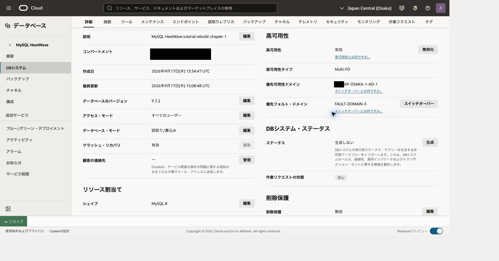
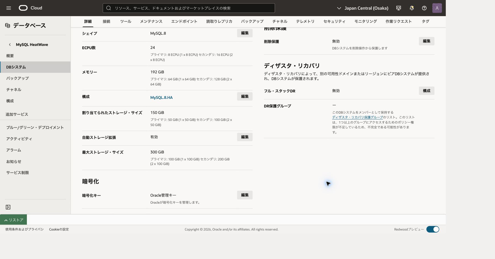
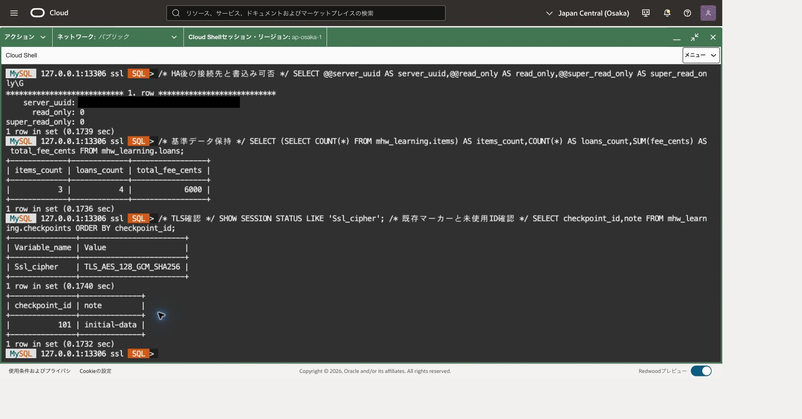
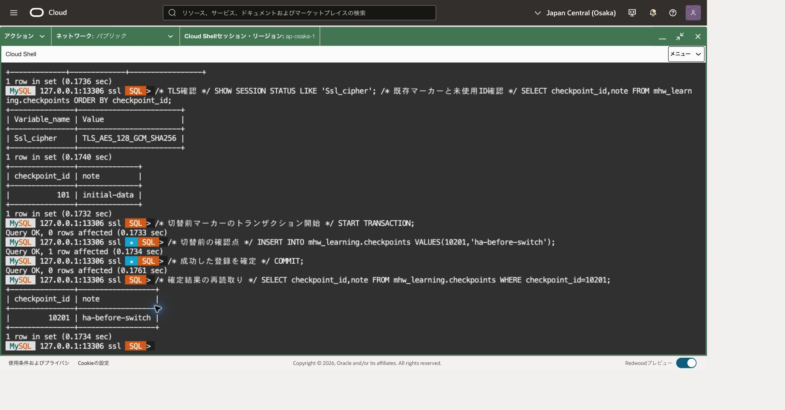
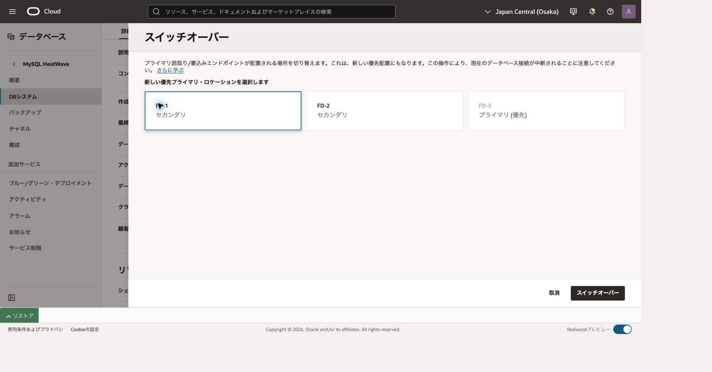
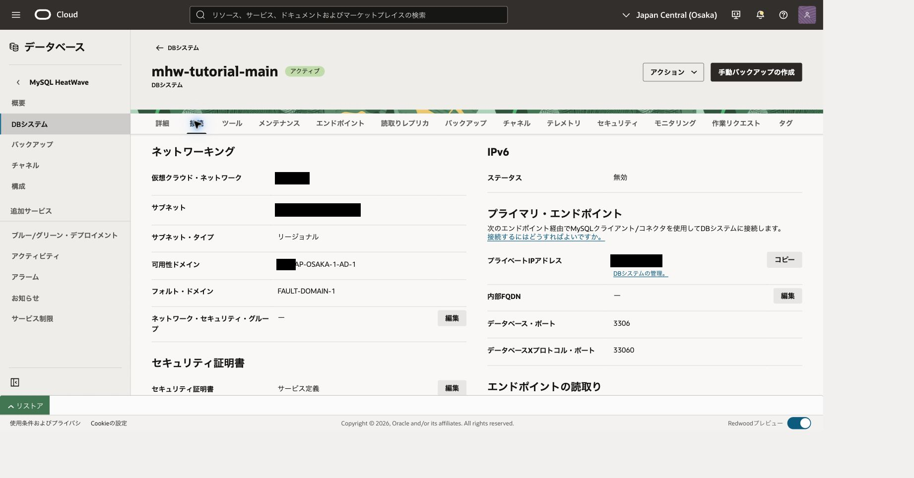
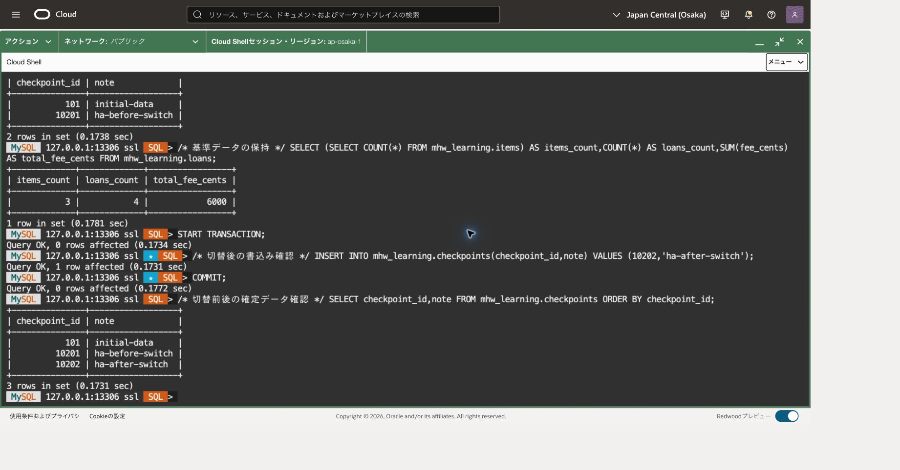
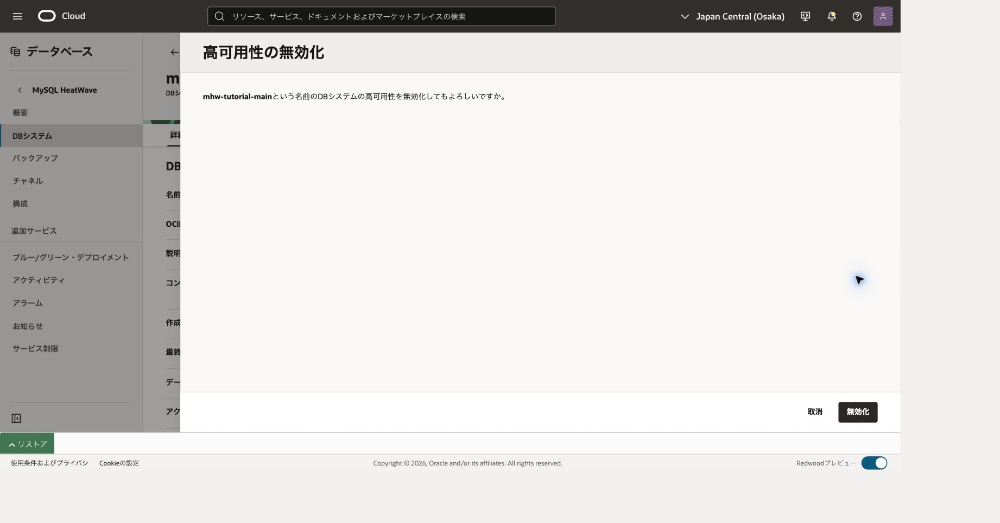
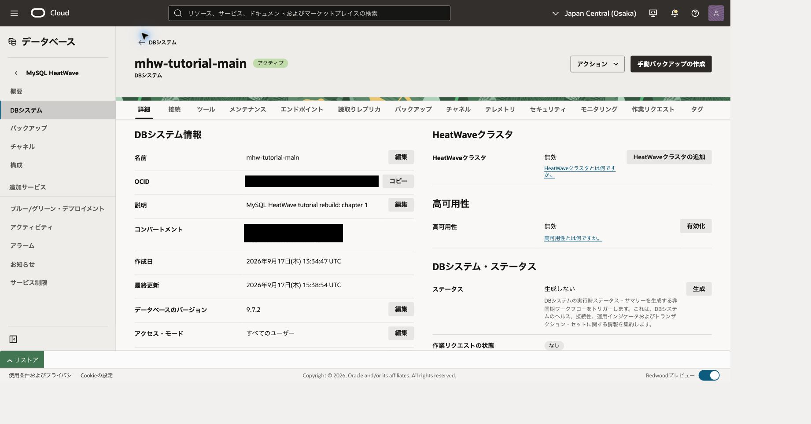
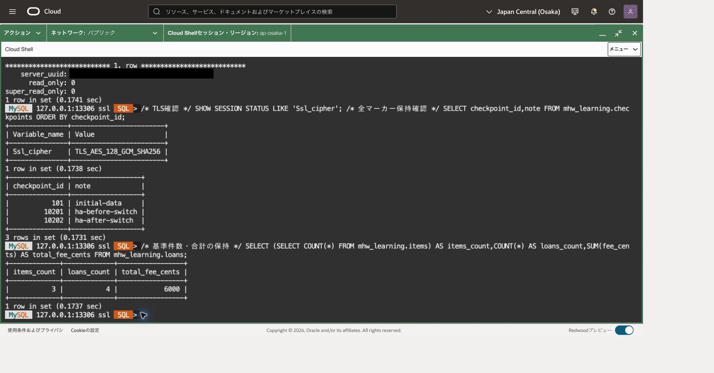

この章では、主DBを3インスタンスの高可用性（HA）構成に変更し、別のインスタンスへ計画的にプライマリを切り替えます。HAのセカンダリへ直接接続する演習ではありません。HAは可用性を高める仕組みで、読取り分散やバックアップとは目的が異なります。

所要時間は45〜75分とサービスの処理待ちが目安です。計画切替では接続が切れるため、ほかの利用者の処理がない演習用DBで実施してください。

## 前提と費用

1. [101](../101-create-connect/)を完了し、MySQL 9.7 LTS、MySQL.8の主DBへCloud ShellのCommunity MySQL Shellから接続できること。Computeは転送専用です。
2. `mhw_learning`にitems 3件、loans 4件、fee_cents合計6000、checkpoint 101/initial-dataがあること。
3. 101のDB管理IAMを持ち、対象DBの更新と作業リクエストを確認できること。SQLには教材表のSELECT/INSERT権限が必要です。
4. 対象DBは稼働中で、全ユーザー表に主キーがあり、Crash recoveryが有効であること。HeatWaveのロード処理やほかのDB変更が実行中でないこと。

HAでは同じ構成のMySQLインスタンス3台分のCPU・メモリー・ストレージを使用します。単体DBの見積りをそのまま使わず、HAを有効にする期間と自動ストレージ拡張の上限を確認してください。内部レプリケーションのネットワークには追加料金がありませんが、DBやバックアップは別途課金されます。[HAの課金](https://docs.oracle.com/en-us/iaas/mysql-database/doc/billing2.html)

この章では、検証後にHAを無効化して単体DBへ戻す進め方を推奨します。103の読取りレプリカを使うためにHA解除が必須という意味ではなく、演習後の追加費用を抑えるためです。MySQL.8と教材データは保持します。

## 接続の再開（Cloud Shell）

101の終了時には転送を閉じています。Cloud Shellで101と同じネットワーク経路を選び、OSプロンプトで次を再設定します。値は今回の主DBとComputeの記録から置き換えてください。ファイルが残っていても変数やプロセスが残っているとは限りません。

```bash
# 目的: 導入済みCommunity版と検証済みホスト鍵、今回の接続先を再設定する。
MHW_SHELL="$HOME/mysql-shell-community-26.7.1-el8/usr/bin/mysqlsh"
MHW_KNOWN_HOSTS="$HOME/.ssh/mhw-learning-known-hosts"
MHW_KEY="$HOME/.ssh/mhw-learning.key"
MHW_COMPUTE_IP='COMPUTE_PUBLIC_IP'
MHW_OS_USER='opc'
MHW_DB_IP='CURRENT_MAIN_DB_PRIVATE_IP'
MHW_ADMIN='tutorial_admin'
# 目的: 実行ファイルと鍵関連ファイルの存在を確認する。
if test -x "$MHW_SHELL" && test -s "$MHW_KNOWN_HOSTS" && test -f "$MHW_KEY"; then
  printf '%s\n' '前提ファイル: OK'
else
  printf '%s\n' '前提ファイル: NG。ここで止め、101章の準備を確認してください。'
fi
```

成功した場合だけ進みます。不足していれば[101](../101-create-connect/)の導入・ホスト鍵検証へ戻ります。ホスト鍵検証を無効化しません。新しいCloud Shell端末を開いた場合も、この変数設定を行ってください。

```bash
# 目的: 主DB用の既存待受を確認する。LISTEN行がある場合は新規起動しない。
ss -ltn 'sport = :13306'
```

LISTEN行がある場合は、今回の主DB用として記録した制御ソケットの絶対パスを次の変数へ戻します。パスの記録がない、または用途が分からない場合はここで止め、既存転送の対象を確認します。別プロセスの終了や新規起動は行いません。

```bash
# 目的: 記録済みの主DB用ソケットを新しい端末へ引き継ぐ。
MHW_SOCKET='/tmp/mhw-tunnel-RECORDED/control'
# 目的: ソケットの存在と制御接続を確認する。失敗した場合は再利用しない。
test -S "$MHW_SOCKET" && ssh -F /dev/null -S "$MHW_SOCKET" -O check "$MHW_OS_USER@$MHW_COMPUTE_IP"
```

成功し、記録した転送先が現在の主DBであることを照合できた場合は、新規起動の枠を飛ばして、その下の確認・SQL接続へ進みます。SQL接続後にもUUIDを照合します。

LISTEN行がない場合だけ、次の枠で新規起動します。

```bash
# 目的: 専用ソケットで主DBへ転送だけを開始する。
MHW_TUNNEL_DIR=$(mktemp -d /tmp/mhw-tunnel-XXXXXX)
MHW_SOCKET="$MHW_TUNNEL_DIR/control"
ssh -F /dev/null -4 -fN -T -M -S "$MHW_SOCKET" \
 -o StrictHostKeyChecking=yes -o UserKnownHostsFile="$MHW_KNOWN_HOSTS" \
 -o IdentitiesOnly=yes -o ForwardAgent=no -o ExitOnForwardFailure=yes \
 -o ConnectTimeout=10 -o ServerAliveInterval=30 -o ServerAliveCountMax=3 \
 -i "$MHW_KEY" -L "127.0.0.1:13306:$MHW_DB_IP:3306" \
 "$MHW_OS_USER@$MHW_COMPUTE_IP"
```

秘密鍵のパスフレーズが必要な場合は非表示入力に入力します。起動に成功してから、制御ソケットのパスを記録し、次を確認します。

```bash
# 目的: 転送プロセスとloopback待受を照合する。DBへの接続成功は後で確認する。
printf 'MHW_SOCKET=%s\n' "$MHW_SOCKET"
ssh -F /dev/null -S "$MHW_SOCKET" -O check "$MHW_OS_USER@$MHW_COMPUTE_IP"
ss -ltn 'sport = :13306'
# 目的: Community版から主DBへClassic protocolとTLSで接続する。
"$MHW_SHELL" --mysql --sql --host=127.0.0.1 --port=13306 --user="$MHW_ADMIN" \
  --ssl-mode=REQUIRED --password
```

パスワード値を引数へ付けません。後のOSコマンドを実行するときは、まずMySQL Shellで `\quit` を実行してください。再開したソケットはこの章だけでなく後続章でも対象を確認して再利用できます。

## 1. 対象と基準データを確認する

OCIコンソールで主DBの詳細を開き、OCID、IPアドレス、MySQL.8、9.7のパッチ版、現在の配置、構成、ストレージ拡張の設定を記録します。Crash recoveryも確認します。HA互換構成への変更が必要な場合、構成変更による再起動を作業時間に含めます。必要条件が不明なまま有効化しないでください。

前の「接続の再開」で13306転送を確認します。再接続する場合はOSプロンプトで次を実行します。パスワードは隠しプロンプトに入力します。

```bash
"$MHW_SHELL" --mysql --sql --host=127.0.0.1 --port=13306 --user="$MHW_ADMIN" --ssl-mode=REQUIRED
```

実行場所：主DBに接続したMySQL Shell、SQLモード。

```sql
-- 目的: 101で記録した主DBのUUID、版、書込み可能状態を照合する。
SELECT @@server_uuid AS server_uuid, VERSION() AS server_version,
       @@read_only AS read_only, @@super_read_only AS super_read_only\G
-- 目的: 今回の接続もTLS暗号化されていることを確認する。
SHOW SESSION STATUS LIKE 'Ssl_cipher';
-- 目的: HAの前提となる主キーが欠けたユーザー表を検出する。
SELECT t.table_schema,t.table_name FROM information_schema.tables AS t
WHERE t.table_type='BASE TABLE'
  AND t.table_schema NOT IN ('mysql','sys','performance_schema','information_schema')
  AND NOT EXISTS (SELECT 1 FROM information_schema.table_constraints AS c
    WHERE c.table_schema=t.table_schema AND c.table_name=t.table_name
      AND c.constraint_type='PRIMARY KEY');
-- 目的: 101の件数と金額を変更前の基準として確認する。
SELECT (SELECT COUNT(*) FROM mhw_learning.items) AS items_count,
       COUNT(*) AS loans_count,SUM(fee_cents) AS total_fee_cents
FROM mhw_learning.loans;
-- 目的: 既存マーカーを保持し、今回のIDが未使用であることを確認する。
SELECT checkpoint_id,note FROM mhw_learning.checkpoints ORDER BY checkpoint_id;
```

UUIDが101の対象と一致し、read_only/super_read_onlyが0、cipherが空でないことを確認します。主キー欠落は0行、基準は3/4/6000です。今回使う10201・10202が既に存在する場合は追記せず、前回の実行状態を調べます。権限によって見える表が限られる場合、全表の主キー確認はDB管理者に依頼してください。

## 2. HAを有効化する

1. まずDB詳細の「詳細（Details）」タブで「自動ストレージ拡張」の「編集（Edit）」を開きます。無効の場合は有効にし、この演習では上限を**100GiB/台**に設定して更新します。画面の最小値が100GiBであることを確認してください。初期容量50GiBと拡張上限100GiBは別の値です。既に異なる上限で運用しているDBを無条件に変更しません。
2. ストレージ設定の更新完了と実設定を確認してから、「高可用性（High availability）」の「有効化（Enable）」を選びます。
3. 確認後に現在の構成 `MySQL.8.Standalone` が非互換と表示され、対応する構成の選択を求められた場合は、`MySQL.8.HA` を選びます。MySQL.8のshapeを維持する構成であることと、構成変更・再起動の影響を確認してください。
4. 対象と構成を照合して、表示されたEnableから処理を開始します。構成変更待ちの説明後にフォームが閉じ、DBが更新中になった場合は受付済みとして状態を追跡し、同じ操作を再送しません。
5. DBがACTIVE、高可用性が有効、作業リクエストが成功になったことを確認します。構成変更の受付やUPDATINGだけをHA完了とは扱いません。



高可用性の「有効」とMulti-FDを確認します。この例では優先フォルト・ドメインはFD-3です。作業リクエストの成功も別途照合してください。

HAでは3台を使用するため、自動拡張の上限100GiB/台は構成全体で最大300GiBに相当します。これは事前に300GiBへ拡張する指定ではありません。実際の使用量と課金対象を確認します。



3台合計の24 ECPU・192GiB、割当ストレージ150GiB、拡張上限300GiBを確認する例です。現在の割当と拡張上限を区別します。

有効化だけで別プライマリへ移動したとは判断しません。処理失敗や容量不足の場合は作業リクエストを確認し、同じ要求を連打せず現在の状態を読み直します。利用者スキーマの削除や設定の無断緩和で解決しないでください。[有効化と無効化](https://docs.oracle.com/en-us/iaas/mysql-database/doc/enabling-or-disabling-high-availability.html)

HA有効化後に接続が失われていれば、同じ転送先と待受ポートで再接続します。手順1の識別・TLS・集計SQLを再実行し、切替直前のUUIDを記録します。



HA有効化後にも、両read-only値が0、TLS cipherが非空、基準が3件・4件・6000セント、既存マーカーが101であることを確認する例です。UUIDは手元の記録と照合してください。

## 3. 切替前のデータを確定する

実行場所：現在のプライマリ、SQLモード。まず不在だけを確認します。

```sql
-- 目的: 今回の切替前マーカーを重複登録しない。
SELECT checkpoint_id,note FROM mhw_learning.checkpoints WHERE checkpoint_id=10201;
```

0行の場合だけ次を1文ずつ実行します。失敗した文があれば後続を実行しません。

```sql
-- 目的: 切替前に確定する変更のトランザクションを開始する。
START TRANSACTION;
-- 目的: 貸出データを変えず、切替前の確認点を追加する。
INSERT INTO mhw_learning.checkpoints(checkpoint_id,note) VALUES(10201,'ha-before-switch');
```

直前の変更がすべて成功した場合だけ確定します。エラーがあればCOMMITせずROLLBACKします。

```sql
-- 目的: 切替前にマーカーを確定し、未確定変更と区別する。
COMMIT;
```

確定後に次の読取りで照合します。応答不明なら再接続して読取りだけを実行します。

```sql
-- 目的: COMMIT後に保存されたIDと内容を照合する。
SELECT checkpoint_id,note FROM mhw_learning.checkpoints WHERE checkpoint_id=10201;
```

10201/ha-before-switchが表示されてから切替へ進みます。COMMITの応答が不明なら、再接続して同じSELECTで結果を確認します。INSERTを再送しません。



10201 / ha-before-switchを登録し、COMMIT後のSELECTで確定結果を確認しています。

## 4. 別の配置へ計画切替する

1. DB詳細のDetailsで、現在の配置と優先配置を確認します。
2. 優先可用性ドメインまたは優先フォルト・ドメイン欄の「スイッチオーバー（Switchover）」を選びます。
3. 現在のプライマリとは異なる、セカンダリが配置されている候補を選びます。表示された大阪の構成に従って選択し、候補名を推測しません。
4. 切替を送信し、ACTIVEと作業リクエスト成功、新しい現在/優先配置を確認します。DBのIPアドレスは切替前と同じであることを照合します。



切替先選択の例です。現在のプライマリFD-3ではなく、セカンダリFD-1を選んでいます。この選択画面だけでは切替完了とは判断しません。



切替後の接続タブではFD-1が表示されています。プライベートIPは手元の切替前記録と照合し、同じendpointへ再接続します。

同じ現在配置を選ぶと優先配置の更新だけになり、別インスタンスへの切替検証にはなりません。実際に配置が変わる切替では接続を開き直す必要があります。未確定のトランザクションを残さず、アプリケーションは結果不明の書込みを無条件再送しない設計にします。作業リクエスト全体の時間を接続停止時間と呼ばないでください。[Switchover](https://docs.oracle.com/en-us/iaas/mysql-database/doc/switchover.html)

## 5. 再接続して保持と書込み再開を確認する

古いMySQL Shellを終了します。

```text
\quit
```

101の転送が生きていることを確認し、手順1と同じ接続コマンドを実行します。DB endpointは変わらないので、勝手に別IPへ転送先を変えません。転送自体が終了していた場合だけ、101の再開手順で同じ宛先へ張り直します。

実行場所：切替後のプライマリ、SQLモード。

```sql
-- 目的: 切替直前と異なるプライマリUUIDと書込み可否を確認する。
SELECT @@server_uuid AS server_uuid,@@read_only AS read_only,
       @@super_read_only AS super_read_only\G
-- 目的: 再接続後もTLSを使用していることを確認する。
SHOW SESSION STATUS LIKE 'Ssl_cipher';
-- 目的: 貸出基準が切替前の3件、4件、6000セントを保持することを確認する。
SELECT (SELECT COUNT(*) FROM mhw_learning.items) AS items_count,
       COUNT(*) AS loans_count,SUM(fee_cents) AS total_fee_cents
FROM mhw_learning.loans;
-- 目的: 101と切替前に確定した10201の両マーカーを確認する。
SELECT checkpoint_id,note FROM mhw_learning.checkpoints ORDER BY checkpoint_id;
-- 目的: 切替後マーカーを新規登録できる状態か確認する。
SELECT checkpoint_id,note FROM mhw_learning.checkpoints WHERE checkpoint_id=10202;
```

新UUID、両read_only値0、非空cipher、基準3/4/6000、101/initial-dataと10201/ha-before-switchの保持を確認します。10202が0行の場合だけ、書込み再開を検証します。


再接続後に、101と10201の保持、TLS、基準3件・4件・6000セントを確認する例です。UUIDは手元の切替前記録と比較してください。

```sql
-- 目的: 切替後の書込みを1トランザクションにする。
START TRANSACTION;
-- 目的: 切替後の書込み可能性を示す新しい確認点を追加する。
INSERT INTO mhw_learning.checkpoints(checkpoint_id,note) VALUES(10202,'ha-after-switch');
```

直前の変更がすべて成功した場合だけ確定します。エラーがあればCOMMITせずROLLBACKします。

```sql
-- 目的: 切替後の変更を確定する。
COMMIT;
```

確定後に次の読取りで照合します。応答不明なら再接続して読取りだけを実行します。

```sql
-- 目的: 切替後の確定結果を再読取りする。
SELECT checkpoint_id,note FROM mhw_learning.checkpoints WHERE checkpoint_id=10202;
```



切替後の書込みを確定し、101・10201・10202の3マーカーがそろった例です。既存データの保持と、新しい書込みの成功を分けて確認します。

UUIDが変わらない、マーカーが欠ける、書込み不可などの相違があれば次章へ進まず、対象DB・切替先・作業結果を確認します。データを入れ直して検証結果を合わせないでください。

## 6. 単体DBへ戻して次章へ進む

費用を抑えるため、この演習ではHAを解除して主DBを残します。解除前に、現在のプライマリ配置が優先配置と一致していることを確認します。異なる場合、解除に伴う制御された切替と短い停止が起こり得ます。独自判断で追加切替を重ねず、必要な停止を計画してください。



これはHA解除前の確認画面です。対象DBを照合してから送信し、解除完了はこの画面ではなく、後続の状態と作業結果で確認します。

DB詳細のDetailsでHigh availabilityのDisableを選び、対象を確認して解除します。ACTIVE、高可用性無効、作業リクエスト成功を確認します。同じendpointへ再接続して、手順5の識別・TLS・基準データ・全マーカー照会を再実行します。解除後のUUIDは新たに記録し、切替前後比較と混同しません。



解除後の詳細画面で、アクティブと高可用性「無効」を確認する例です。作業リクエスト成功とSQLでのデータ確認も合わせて行います。

終了状態はMySQL.8の単体主DB、items3/loans4/6000、マーカー101・10201・10202です。DB、スキーマ、101のバックアップ、共有Compute/ネットワークは削除しません。自動ストレージ拡張を有効にした場合、解除しても元に戻ると考えず設定と上限を記録します。



単体復帰後の再接続でも、両read-only値0、TLS、3マーカーと基準3件・4件・6000セントを確認します。これが次章へ引き継ぐデータです。

構成名が `MySQL.8.HA` のまま残る場合があります。構成名だけでHAの有効・無効を判断せず、「高可用性」が無効、資源が1台分（この例では8 ECPU・64GiB・50GiB）に戻ったことを確認します。

HAを保持する運用を選ぶ場合、3台分の継続費用を確認し、その状態を次章へ引き継ぎます。103の読取りレプリカはHAとは別資源です。後続演習を中断する場合は、106で示す対象別の後片付けを行ってください。

## 参考資料

- [HA有効化・無効化](https://docs.oracle.com/en-us/iaas/mysql-database/doc/enabling-or-disabling-high-availability.html)
- [計画切替](https://docs.oracle.com/en-us/iaas/mysql-database/doc/switchover.html)
- [HAの課金](https://docs.oracle.com/en-us/iaas/mysql-database/doc/billing2.html)
- [対応シェイプ](https://docs.oracle.com/en-us/iaas/mysql-database/doc/supported-shapes.html)

## 失敗時のトランザクション取消

INSERT等のエラーがあり、同じ接続で未確定の変更が残っている場合だけ実行します。DDLや既に確定した変更は取り消せません。

```sql
-- 目的: 失敗した未確定DMLを取り消し、状態確認から再開する。
ROLLBACK;
```

## 章の移動

[前章](../101-create-connect/) · [次章](../103-read-replicas/)
