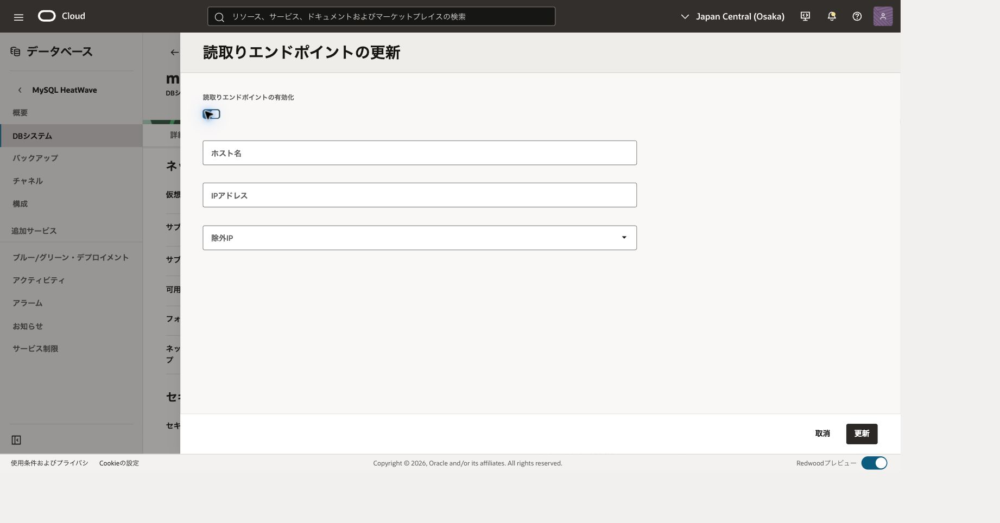
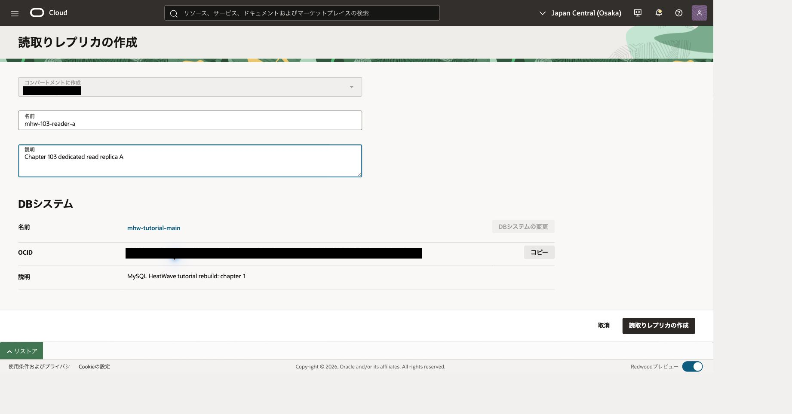
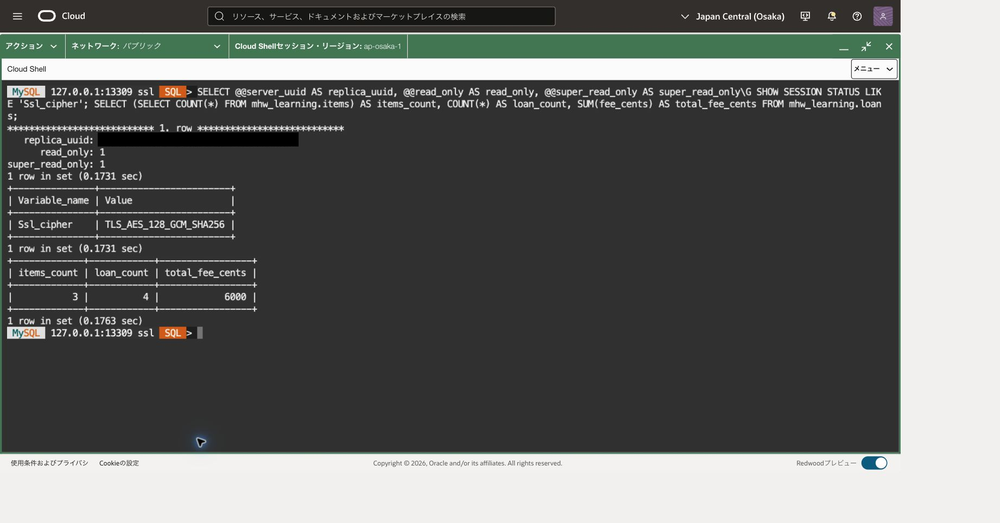
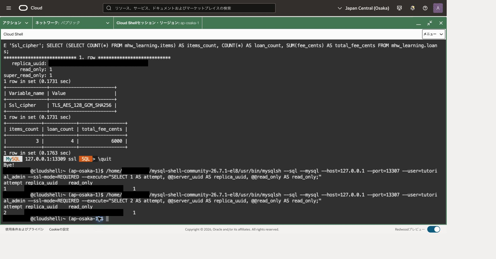
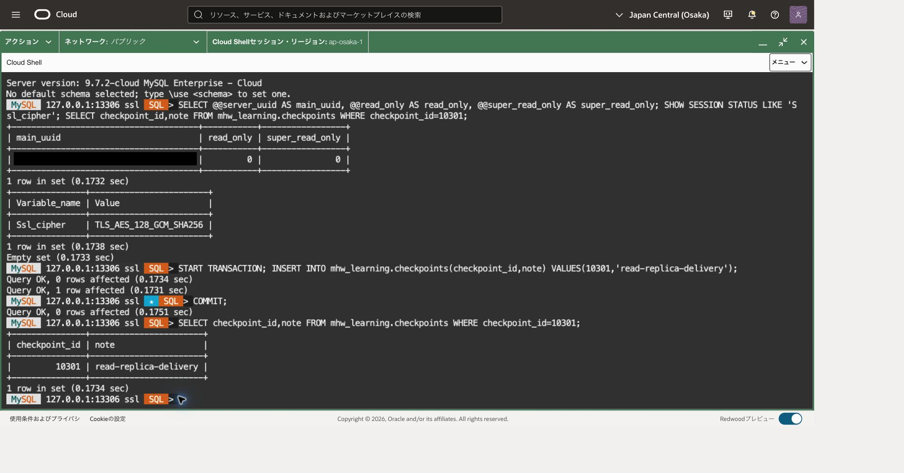
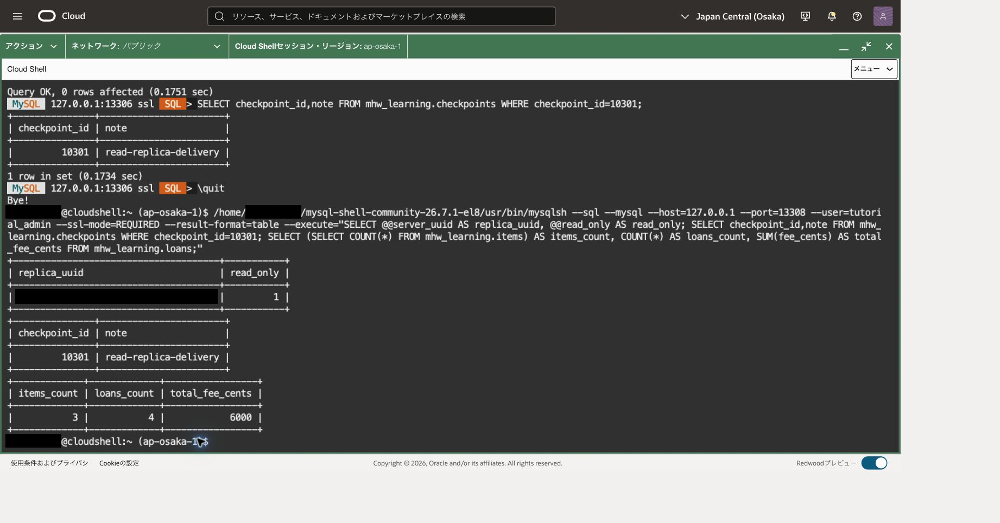
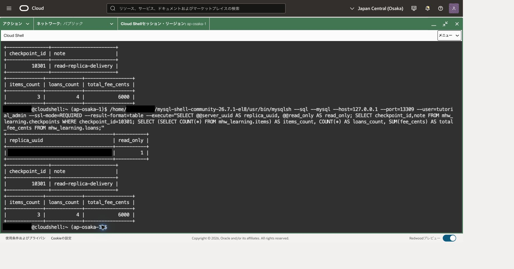

読取りレプリカは、主DBの変更を非同期で受け取る読取り用のコピーです。HAのセカンダリとは異なり、個別の接続先があります。この章では2台を作成し、読取りエンドポイント経由の接続先と、各レプリカへの更新反映を確認します。所要時間は45〜75分とサービスの処理待ちが目安です。

## 前提・権限・費用

- 101・102を完了したMySQL 9.7 LTS/MySQL.8の主DBと、IPv4のみのサブネットを使用します。主DBは単体でもHAでも利用できます。
- `mhw_learning`の基準はitems3件、loans4件、fee_cents合計6000、checkpointsの101/initial-data、10201/ha-before-switch、10202/ha-after-switchです。
- 101のDB管理・サブネット利用権限に加え、読取りエンドポイントのVNIC管理権限を確認します。必要な追加例は次です。区画・グループを置換し、既存権限を重複追加しません。

```text
Allow group <group> to {VNIC_CREATE, VNIC_DELETE, VNIC_UPDATE, NETWORK_SECURITY_GROUP_UPDATE_MEMBERS, VNIC_ASSOCIATE_NETWORK_SECURITY_GROUP} in compartment <network-compartment>
```

NSGを別区画に置く構成などは[必須ポリシー](https://docs.oracle.com/en-us/iaas/mysql-database/doc/mandatory-policies-permissions.html)を確認します。SQLには教材表のSELECTと主DB上のINSERT権限が必要です。ロードバランサ経由のアカウント認証にはホストベース制約があるため、101の管理アカウントで接続できる条件を管理者と確認します。認証失敗を理由に無関係なユーザーのHostを広げません。

レプリカ2台分の計算資源・ストレージと関連サービスの費用を見積ります。MySQL.8を継承する例なら追加も各8 ECPUです。作成時の実設定を照合し、無料や主DB料金への包含を仮定しません。読取りエンドポイントの有効化・無効化はDB再起動を伴うため、停止可能な演習時間に行ってください。

## 接続の再開（Cloud Shell）

101の終了時には転送を閉じています。Cloud Shellで101と同じネットワーク経路を選び、OSプロンプトで次を再設定します。値は今回の主DBとComputeの記録から置き換えてください。ファイルが残っていても変数やプロセスが残っているとは限りません。

```bash
# 目的: 導入済みCommunity版と検証済みホスト鍵、今回の接続先を再設定する。
MHW_SHELL="$HOME/mysql-shell-community-26.7.1-el8/usr/bin/mysqlsh"
MHW_KNOWN_HOSTS="$HOME/.ssh/mhw-learning-known-hosts"
MHW_KEY="$HOME/.ssh/mhw-learning.key"
MHW_COMPUTE_IP='COMPUTE_PUBLIC_IP'
MHW_OS_USER='opc'
MHW_DB_IP='CURRENT_MAIN_DB_PRIVATE_IP'
MHW_ADMIN='tutorial_admin'
# 目的: 実行ファイルと鍵関連ファイルの存在を確認する。
if test -x "$MHW_SHELL" && test -s "$MHW_KNOWN_HOSTS" && test -f "$MHW_KEY"; then
  printf '%s\n' '前提ファイル: OK'
else
  printf '%s\n' '前提ファイル: NG。ここで止め、101章の準備を確認してください。'
fi
```

成功した場合だけ進みます。不足していれば[101](../101-create-connect/)の導入・ホスト鍵検証へ戻ります。ホスト鍵検証を無効化しません。新しいCloud Shell端末を開いた場合も、この変数設定を行ってください。

```bash
# 目的: 主DB用の既存待受を確認する。LISTEN行がある場合は新規起動しない。
ss -ltn 'sport = :13306'
```

LISTEN行がある場合は、今回の主DB用として記録した制御ソケットの絶対パスを次の変数へ戻します。パスの記録がない、または用途が分からない場合はここで止め、既存転送の対象を確認します。別プロセスの終了や新規起動は行いません。

```bash
# 目的: 記録済みの主DB用ソケットを新しい端末へ引き継ぐ。
MHW_SOCKET='/tmp/mhw-tunnel-RECORDED/control'
# 目的: ソケットの存在と制御接続を確認する。失敗した場合は再利用しない。
test -S "$MHW_SOCKET" && ssh -F /dev/null -S "$MHW_SOCKET" -O check "$MHW_OS_USER@$MHW_COMPUTE_IP"
```

成功し、記録した転送先が現在の主DBであることを照合できた場合は、新規起動の枠を飛ばして、その下の確認・SQL接続へ進みます。SQL接続後にもUUIDを照合します。

LISTEN行がない場合だけ、次の枠で新規起動します。

```bash
# 目的: 専用ソケットで主DBへ転送だけを開始する。
MHW_TUNNEL_DIR=$(mktemp -d /tmp/mhw-tunnel-XXXXXX)
MHW_SOCKET="$MHW_TUNNEL_DIR/control"
ssh -F /dev/null -4 -fN -T -M -S "$MHW_SOCKET" \
 -o StrictHostKeyChecking=yes -o UserKnownHostsFile="$MHW_KNOWN_HOSTS" \
 -o IdentitiesOnly=yes -o ForwardAgent=no -o ExitOnForwardFailure=yes \
 -o ConnectTimeout=10 -o ServerAliveInterval=30 -o ServerAliveCountMax=3 \
 -i "$MHW_KEY" -L "127.0.0.1:13306:$MHW_DB_IP:3306" \
 "$MHW_OS_USER@$MHW_COMPUTE_IP"
```

秘密鍵のパスフレーズが必要な場合は非表示入力に入力します。起動に成功してから、制御ソケットのパスを記録し、次を確認します。

```bash
# 目的: 転送プロセスとloopback待受を照合する。DBへの接続成功は後で確認する。
printf 'MHW_SOCKET=%s\n' "$MHW_SOCKET"
ssh -F /dev/null -S "$MHW_SOCKET" -O check "$MHW_OS_USER@$MHW_COMPUTE_IP"
ss -ltn 'sport = :13306'
# 目的: Community版から主DBへClassic protocolとTLSで接続する。
"$MHW_SHELL" --mysql --sql --host=127.0.0.1 --port=13306 --user="$MHW_ADMIN" \
  --ssl-mode=REQUIRED --password
```

パスワード値を引数へ付けません。後のOSコマンドを実行するときは、まずMySQL Shellで `\quit` を実行してください。再開したソケットはこの章だけでなく後続章でも対象を確認して再利用できます。

## 1. 読取りエンドポイントと2台のレプリカを作る

主DBのOCID、endpoint、現在のUUID、読取りエンドポイントの初期状態を記録します。今回の専用レプリカ名は例として`mhw-103-reader-a`、`mhw-103-reader-b`を使います。

1. DB詳細の「接続（Connections）」タブで、Read endpoint欄のEditを選びます。
2. Enable read endpointを有効にします。IPは自動割当、Excluded IPsは空とします。すでに共有利用中なら設定を変更せず、専用演習環境を管理者と確認します。
3. 更新後のACTIVEと作業成功を待ち、割り当てられた読取りendpointを記録します。必要に応じて主DBへ再接続します。
4. 主DB詳細の「読取りレプリカ（Read replicas）」タブでCreate read replicaを選び、1台目を作成します。対象主DB、区画、名前、shape、削除保護を照合します。
5. 1台目の成功を確認して2台目を作成し、両方ACTIVEと作業成功になるまで待ちます。個別のOCIDとendpointを記録します。

最初のレプリカ作成ではロードバランサが自動作成され、明示的なRead endpointとは同じネットワーク・ロードバランサを共有します。作成要求を送っただけでデータ同期済みとは扱いません。[レプリカ作成](https://docs.oracle.com/en-us/iaas/mysql-database/doc/creating-read-replica.html)、[Read endpointの変更](https://docs.oracle.com/en-us/iaas/mysql-database/doc/updating-read-endpoint-db-system.html)

読取りエンドポイントの設定画面です。有効化、IPの自動割当、除外IPを確認して更新します。画面を開いただけでは設定完了ではありません。



レプリカAの作成画面では、演習用の名前と対象DBシステムを確認します。Bも別の名前で作成してください。



## 2. 接続先と転送ポートを区別する

Cloud ShellからComputeへ転送だけを行い、MySQL ShellはCloud Shell上で実行します。101の鍵・ホスト鍵確認を再利用し、リモートシェルは開きません。例のポートが使用中なら、衝突しない値を記録して全コマンドを合わせます。

|Cloud Shell待受|転送先TCP3306|用途|
|---|---|---|
|127.0.0.1:13306|主DB endpoint|更新・基準照会|
|127.0.0.1:13307|Read endpoint|新規接続の分散確認|
|127.0.0.1:13308|レプリカA endpoint|Aへの反映確認|
|127.0.0.1:13309|レプリカB endpoint|Bへの反映確認|

13306の既存転送は維持し、次をCloud ShellのOSプロンプトで開始します。山括弧を実値へ置き換えてください。手前のCompute接続先と、転送先のDB IPを取り違えないようにします。

```bash
ssh -F /dev/null -4 -N -T -o ConnectTimeout=10 -o IdentitiesOnly=yes \
  -o UserKnownHostsFile="$MHW_KNOWN_HOSTS" -o ExitOnForwardFailure=yes \
  -o ServerAliveInterval=30 -o ServerAliveCountMax=3 -o StrictHostKeyChecking=yes \
  -o ForwardAgent=no -i "$MHW_KEY" -L '127.0.0.1:13307:<read-endpoint-IP>:3306' \
  -L '127.0.0.1:13308:<replica-A-IP>:3306' -L '127.0.0.1:13309:<replica-B-IP>:3306' \
  "$MHW_OS_USER@$MHW_COMPUTE_IP"
```

この端末を **端末A（転送用）** とし、前面で待機したままにします。別のCloud Shell端末を **端末B（SQL用）** とし、冒頭のMHW_SHELL等の変数設定だけを再実行してから以下のMySQL Shellを使用します。転送の起動部分は繰り返しません。検証終了時は端末Bで `\quit`、端末AでCtrl+Cを実行してこの3ポートの転送を閉じます。待受成功だけではDB接続成功ではありません。Computeから各endpointへの3306経路と実効セキュリティを確認し、インターネットへDBポートを公開しません。

まずAへ接続します。初回パスワードは隠しプロンプトへ入力します。

```bash
"$MHW_SHELL" --mysql --sql --host=127.0.0.1 --port=13308 --user="$MHW_ADMIN" --ssl-mode=REQUIRED
```

実行場所：レプリカA、SQLモード。

```sql
-- 目的: 個体UUIDと読取り専用状態を記録する。
SELECT @@server_uuid AS server_uuid,@@read_only AS read_only\G
-- 目的: 転送の内側でもTLS暗号化されていることを確認する。
SHOW SESSION STATUS LIKE 'Ssl_cipher';
-- 目的: コピーされた教材の件数と金額を照合する。
SELECT (SELECT COUNT(*) FROM mhw_learning.items) AS items_count,
       COUNT(*) AS loans_count,SUM(fee_cents) AS total_fee_cents FROM mhw_learning.loans;
-- 目的: 前章までの確定マーカーを確認する。
SELECT checkpoint_id,note FROM mhw_learning.checkpoints ORDER BY checkpoint_id;
```

read_only=1、非空cipher、基準3/4/6000と既存3マーカーを確認します。`\quit`で終了し、次の接続でも同じSQLを実行します。

```bash
"$MHW_SHELL" --mysql --sql --host=127.0.0.1 --port=13309 --user="$MHW_ADMIN" --ssl-mode=REQUIRED
```

レプリカBのUUIDはAとも主DBとも異なることを確認し、接続ポートと対応付けます。違う個体であることをUUIDの文字列全体で判定します。

主DB・A・BのUUIDは、ご自身の実行結果からそれぞれ記録してください。掲載画面の値ではなく、その記録と各接続の結果を比較します。

Bの個別接続の確認例です。read_only=1、TLS暗号、items=3・loans=4・合計6000を確認できます。Aでも同じ確認を行います。



## 3. 新規接続を読取りエンドポイントへ送る

MySQL Shellを終了し、Cloud ShellのOSプロンプトで次を1回実行します。このコマンドは新しく接続し、UUID照会後に終了します。資格情報を保存していなければ各接続で入力が必要です。パスワードを引数やファイルへ追記しません。

```bash
"$MHW_SHELL" --mysql --sql \
  --host=127.0.0.1 --port=13307 --user="$MHW_ADMIN" \
  --ssl-mode=REQUIRED \
  --execute $'-- 目的: 新規接続1回の転送先個体と読取り状態を記録する。
SELECT @@server_uuid AS server_uuid, @@read_only AS read_only;'
```

結果のUUID全体が手順2で記録したAまたはBと一致し、read_only=1であることを確認します。実行エラー、未知のUUID、read_onlyが1以外の場合は繰り返さず、接続先とレプリカの状態を確認してください。両条件を満たした場合だけ同じコマンドを再実行します。合計8回を目安にしますが、A・B両方を観測できた時点でこの確認を終えて構いません。各回の番号とUUIDを記録し、毎回、結果を照合してから次へ進みます。

同一接続中のクエリーは同じ個体へ送られます。分散を確認するには接続を作り直す必要があります。A・B両方の記録済みUUIDが観測できれば、複数個体へ接続が分散したことを確認できます。8回で均等になる保証はありません。片方だけの場合は両レプリカの状態、除外設定、個別接続を確認し、試行を増やして観測結果を記録します。観測できなかった個体を「分散確認済み」としません。

実行例では、新規接続の1回目でB、2回目でAを観測し、いずれもread_only=1でした。2回で両個体を確認した例であり、常に2回で両方へ接続できることや、均等な分配を保証するものではありません。各回のUUIDは手順2で記録したご自身のA・Bの値と照合してください。



Read endpointは書込み禁止の境界ではありません。利用可能なレプリカがない場合は主DBへ転送され、書込みも可能です。想定外の主DB UUIDやread_only=0が返った場合は本検証を止め、設定と状態を確認します。[DBシステムのエンドポイント](https://docs.oracle.com/en-us/iaas/mysql-database/doc/db-system-endpoints.html)

## 4. 主DBの変更が各レプリカへ届くことを確認する

Cloud Shellから主DBへ接続します。

```bash
"$MHW_SHELL" --mysql --sql --host=127.0.0.1 --port=13306 --user="$MHW_ADMIN" --ssl-mode=REQUIRED
```

実行場所：主DB、SQLモード。

```sql
-- 目的: 主DBの記録済みUUIDと書込み可能状態を確認する。
SELECT @@server_uuid AS server_uuid,@@read_only AS read_only,
       @@super_read_only AS super_read_only\G
-- 目的: 主DBへのTLS接続を確認する。
SHOW SESSION STATUS LIKE 'Ssl_cipher';
-- 目的: 今回の新マーカーを重複登録しない。
SELECT checkpoint_id,note FROM mhw_learning.checkpoints WHERE checkpoint_id=10301;
```

対象UUID一致、両read_only値0、非空cipher、10301が0行の場合だけ進みます。

```sql
-- 目的: レプリカへの反映を確認する変更を開始する。
START TRANSACTION;
-- 目的: 貸出データを変えず、103の新しいマーカーを追加する。
INSERT INTO mhw_learning.checkpoints(checkpoint_id,note) VALUES(10301,'read-replica-delivery');
```

直前の変更がすべて成功した場合だけ確定します。エラーがあればCOMMITせずROLLBACKします。

```sql
-- 目的: レプリカへ伝える変更を主DBで確定する。
COMMIT;
```

確定後に次の読取りで照合します。応答不明なら再接続して読取りだけを実行します。

```sql
-- 目的: 主DBでの確定結果を読み返す。
SELECT checkpoint_id,note FROM mhw_learning.checkpoints WHERE checkpoint_id=10301;
```

各文の成功を確認し、途中失敗なら後続を実行しません。COMMITの応答が不明な場合、再接続してSELECTで調べ、INSERTを再送しません。

主DBでCOMMIT後に10301/read-replica-deliveryを読み返した例です。INSERTの受付だけでなく、確定後の1行を確認します。



主DB接続を終了し、手順2の13308・13309へ順に新しく接続します。反映確認ではSTART TRANSACTIONを実行せず、各接続のSQLモードで次を実行します。

```sql
-- 目的: 反映確認を行うレプリカのUUIDを照合する。
SELECT @@server_uuid AS server_uuid,@@read_only AS read_only\G
-- 目的: 103の確定マーカーがこの個体へ届いたか確認する。
SELECT checkpoint_id,note FROM mhw_learning.checkpoints WHERE checkpoint_id=10301;
-- 目的: 貸出の基準値が保持されていることを確認する。
SELECT (SELECT COUNT(*) FROM mhw_learning.items) AS items_count,
       COUNT(*) AS loans_count,SUM(fee_cents) AS total_fee_cents FROM mhw_learning.loans;
```

A・B双方で10301/read-replica-deliveryと基準3/4/6000を確認します。非同期なので直後に0行でも未到達の可能性があります。その場合は `\quit` で接続を終了し、少し待って同じレプリカへ新しく接続して、上の読取りSQLだけを繰り返します。古いトランザクションで取得した結果を見続けないためです。継続して届かなければレプリカの状態・エラーを確認します。主DBのINSERTは再実行しません。読取りエンドポイントで1回見えただけでは、両個体へ届いた証明にはなりません。

個別接続での確認例です。A・Bの両方で10301/read-replica-deliveryが到達し、items=3・loans=4・合計6000も維持されていました。これだけで反映遅延が常にゼロとは判断できません。





## 5. 専用レプリカとRead endpointを片付ける

1. 読取り検証を終了し、13307〜13309を使うMySQL Shellを閉じます。手順2で開始した専用転送プロセスだけを、その端末のCtrl+Cで終了します。13306の主DB転送は残します。
2. 主DB詳細のRead replicasタブで、記録したAのOCIDを照合し、Actions→Deleteから削除します。削除保護が有効なら、今回専用個体に限って解除してから操作します。削除完了と作業結果を確認し、Bも同様に削除します。
3. 主DBにレプリカが0台であることを確認します。最終レプリカ削除だけでRead endpointや関連資源が自動削除されたとは判断しません。
4. 今回有効化した専用Read endpointについて、Connections→Read endpointのEditで無効化します。レプリカが残っている間は無効化できません。再起動のためACTIVEと作業成功を待ち、endpoint無効とIP解放・関連資源の残存を確認します。
5. 主DBの13306へ再接続し、識別・TLS・基準3/4/6000とcheckpoints全行を再確認します。101、10201、10202、10301を保持し、主DB自体は削除しません。

共有Read endpointが元から存在した場合は手順4で無効化せず、所有者と保持を確認します。関連資源を汎用ネットワーク画面から手作業で強制削除しないでください。残存があれば記録して106の最終清掃へ引き継ぎます。[レプリカ削除](https://docs.oracle.com/en-us/iaas/mysql-database/doc/deleting-read-replica.html)、[Read endpointの無効化](https://docs.oracle.com/en-us/iaas/mysql-database/doc/updating-read-endpoint-db-system.html)

## 参考資料

- [読取りレプリカの概要](https://docs.oracle.com/en-us/iaas/mysql-database/doc/overview-read-replica.html)
- [エンドポイントの動作](https://docs.oracle.com/en-us/iaas/mysql-database/doc/db-system-endpoints.html)
- [読取りレプリカの制約](https://docs.oracle.com/en-us/iaas/mysql-database/doc/limitations2.html)

## 失敗時のトランザクション取消

INSERT等のエラーがあり、同じ接続で未確定の変更が残っている場合だけ実行します。DDLや既に確定した変更は取り消せません。

```sql
-- 目的: 失敗した未確定DMLを取り消し、状態確認から再開する。
ROLLBACK;
```

## 章の移動

[前章](../102-high-availability/) · [次章](../104-replication-channel/)
