この章では、主DBの `mhw_learning` を新しいDBへコピーし、その後の変更をレプリケーション・チャネルで同期します。既存の読取りレプリカを作る103とは異なり、宛先DBと同期対象を自分で指定します。

所要時間の目安は90～150分です。DB作成等の待ち時間は別途必要です。

## 完成状態と前提

- 101の主DB `mhw-tutorial-main` がACTIVEで、items 3件、loans 4件、料金合計6000セントを保持している。
- 同じ主DBに対する102・103の処理が完了し、構成変更や作業リクエストが進行していない。
- MySQL 9.7.2を利用し、Cloud ShellのMySQL Shell Community 26.7.1とComputeの転送専用SSHが使用できる。
- 対象区画でDBとチャネルを作成・管理するIAM権限がある。SQLではソースのmysql.userの非秘密列参照、CREATE USER、REPLICATION SLAVEを付与できる権限を確認する。dump用のSELECT・SHOW VIEW・TRIGGER・EVENT等と整合性取得に必要な権限、load先のDDL/DML・GTID更新権限は別に、公式dump/load要件とSHOW GRANTSで照合する。接続できるだけではこれらの権限を保証しない。権限不足時は管理者へ必要差分を依頼し、広い管理権限を無条件に追加しない。
- 宛先DB1台分の追加料金、保持期間、最終削除を了承している。

この演習の宛先は専用の新規standalone DBです。既存データを持つDBへロードしません。主DBのデータは後続章でも使うため保持します。

|接続|Cloud Shellからの接続先|実際の宛先|
|---|---|---|
|ソース管理接続|127.0.0.1:13306|主DBのprivate IPv4:3306|
|宛先管理接続|127.0.0.1:13310|新規宛先DBのprivate IPv4:3306|
|レプリケーション|Cloud Shellを通らない|宛先DBから主DBのprivate IPv4:3306|

Consoleのチャネル作成欄へ `127.0.0.1` や `13306` を入力しないでください。

## 接続の再開（Cloud Shell）

101の終了時には転送を閉じています。Cloud Shellで101と同じネットワーク経路を選び、OSプロンプトで次を再設定します。値は今回の主DBとComputeの記録から置き換えてください。ファイルが残っていても変数やプロセスが残っているとは限りません。

```bash
# 目的: 導入済みCommunity版と検証済みホスト鍵、今回の接続先を再設定する。
MHW_SHELL="$HOME/mysql-shell-community-26.7.1-el8/usr/bin/mysqlsh"
MHW_KNOWN_HOSTS="$HOME/.ssh/mhw-learning-known-hosts"
MHW_KEY="$HOME/.ssh/mhw-learning.key"
MHW_COMPUTE_IP='COMPUTE_PUBLIC_IP'
MHW_OS_USER='opc'
MHW_DB_IP='CURRENT_MAIN_DB_PRIVATE_IP'
MHW_ADMIN='tutorial_admin'
# 目的: 実行ファイルと鍵関連ファイルの存在を確認する。
if test -x "$MHW_SHELL" && test -s "$MHW_KNOWN_HOSTS" && test -f "$MHW_KEY"; then
  printf '%s\n' '前提ファイル: OK'
else
  printf '%s\n' '前提ファイル: NG。ここで止め、101章の準備を確認してください。'
fi
```

成功した場合だけ進みます。不足していれば[101](../101-create-connect/)の導入・ホスト鍵検証へ戻ります。ホスト鍵検証を無効化しません。新しいCloud Shell端末を開いた場合も、この変数設定を行ってください。

```bash
# 目的: 主DB用の既存待受を確認する。LISTEN行がある場合は新規起動しない。
ss -ltn 'sport = :13306'
```

LISTEN行がある場合は、今回の主DB用として記録した制御ソケットの絶対パスを次の変数へ戻します。パスの記録がない、または用途が分からない場合はここで止め、既存転送の対象を確認します。別プロセスの終了や新規起動は行いません。

```bash
# 目的: 記録済みの主DB用ソケットを新しい端末へ引き継ぐ。
MHW_SOCKET='/tmp/mhw-tunnel-RECORDED/control'
# 目的: ソケットの存在と制御接続を確認する。失敗した場合は再利用しない。
test -S "$MHW_SOCKET" && ssh -F /dev/null -S "$MHW_SOCKET" -O check "$MHW_OS_USER@$MHW_COMPUTE_IP"
```

成功し、記録した転送先が現在の主DBであることを照合できた場合は、新規起動の枠を飛ばして、その下の確認・SQL接続へ進みます。SQL接続後にもUUIDを照合します。

LISTEN行がない場合だけ、次の枠で新規起動します。

```bash
# 目的: 専用ソケットで主DBへ転送だけを開始する。
MHW_TUNNEL_DIR=$(mktemp -d /tmp/mhw-tunnel-XXXXXX)
MHW_SOCKET="$MHW_TUNNEL_DIR/control"
ssh -F /dev/null -4 -fN -T -M -S "$MHW_SOCKET" \
 -o StrictHostKeyChecking=yes -o UserKnownHostsFile="$MHW_KNOWN_HOSTS" \
 -o IdentitiesOnly=yes -o ForwardAgent=no -o ExitOnForwardFailure=yes \
 -o ConnectTimeout=10 -o ServerAliveInterval=30 -o ServerAliveCountMax=3 \
 -i "$MHW_KEY" -L "127.0.0.1:13306:$MHW_DB_IP:3306" \
 "$MHW_OS_USER@$MHW_COMPUTE_IP"
```

秘密鍵のパスフレーズが必要な場合は非表示入力に入力します。起動に成功してから、制御ソケットのパスを記録し、次を確認します。

```bash
# 目的: 転送プロセスとloopback待受を照合する。DBへの接続成功は後で確認する。
printf 'MHW_SOCKET=%s\n' "$MHW_SOCKET"
ssh -F /dev/null -S "$MHW_SOCKET" -O check "$MHW_OS_USER@$MHW_COMPUTE_IP"
ss -ltn 'sport = :13306'
# 目的: Community版から主DBへClassic protocolとTLSで接続する。
"$MHW_SHELL" --mysql --sql --host=127.0.0.1 --port=13306 --user="$MHW_ADMIN" \
  --ssl-mode=REQUIRED --password
```

パスワード値を引数へ付けません。後のOSコマンドを実行するときは、まずMySQL Shellで `\quit` を実行してください。再開したソケットはこの章だけでなく後続章でも対象を確認して再利用できます。

## 1. 宛先DBと転送を用意する

101の作成手順に従い、大阪・同じ演習区画・同じIPv4-only private subnetに次のDBを作ります。

|項目|値|
|---|---|
|表示名|mhw-tutorial-channel-target|
|管理ユーザー|tutorial_admin|
|MySQL|9.7.2|
|シェイプと初期容量|MySQL.8、50GiB|
|HA / HeatWave|どちらも無効|
|用途|この章だけで使用し、検証後に削除|

この一時DBでは、自動backup/PITR、最終backup、削除保護、自動backup保持を無効にできる場合は無効にし、設定を記録します。意図しないbackupがある場合は削除前に一覧を確認します。主DBのbackup設定は変更しません。

次は作成フォームの設定例です。`MySQL.8.Standalone` とバージョン9.7.2を選択しています。作成の完了は送信後の状態で別に確認します。

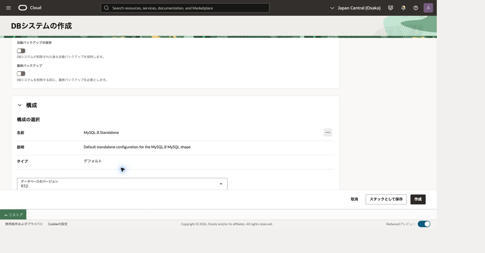

ACTIVEと作業リクエスト完了を確認し、宛先のOCID・private IPv4を控えます。主DBと異なることを確認してください。通信には、Compute→宛先3306に加え、**宛先DB→主DB3306** の許可が必要です。既存の広い許可を最小権限の証明にしません。

Cloud ShellのOSシェルで、101の `MHW_COMPUTE_IP`、`MHW_OS_USER`、`MHW_KEY`、検証済み `MHW_KNOWN_HOSTS` を再設定します。冒頭の接続再開で13306を準備してからMySQL Shellを終了します。以下では確認済み13306を再利用し、新しく13310だけを開始します。

```bash
# 目的: 新しい宛先だけをローカル13310へ転送する。
MHW_TARGET_IP='TARGET_PRIVATE_IPV4'
MHW104_TUNNEL_DIR=$(mktemp -d /tmp/mhw104-tunnel-XXXXXX)
MHW104_SOCKET="$MHW104_TUNNEL_DIR/control"
ss -ltn 'sport = :13310'
```

LISTEN行がない場合だけ次へ進みます。既存待受があれば対象を確認し、重複起動しません。

```bash
ssh -F /dev/null -4 -fN -T -M -S "$MHW104_SOCKET" \
  -o StrictHostKeyChecking=yes -o UserKnownHostsFile="$MHW_KNOWN_HOSTS" \
  -o IdentitiesOnly=yes -o ForwardAgent=no -o ExitOnForwardFailure=yes -o ConnectTimeout=10 \
  -o ServerAliveInterval=30 -o ServerAliveCountMax=3 -i "$MHW_KEY" \
  -L "127.0.0.1:13310:$MHW_TARGET_IP:3306" \
  "$MHW_OS_USER@$MHW_COMPUTE_IP"
```

起動成功を確認してから次の状態確認へ進みます。エラー時は新しい接続を開始せず原因を確認します。

```bash
# 目的: 宛先の転送接続と、loopback限定の待受を確認する。
ssh -F /dev/null -S "$MHW104_SOCKET" -O check "$MHW_OS_USER@$MHW_COMPUTE_IP"
ss -ltn 'sport = :13310'
# 目的: ダンプと進捗ファイル用に新しい専用領域を作る。
export MHW104_WORK=$(mktemp -d "$HOME/mhw104-work-XXXXXX")
# 目的: 中断後の再開と後片付けに使う非秘密のパスを記録する。
printf 'MHW104_SOCKET=%s\nMHW104_WORK=%s\n' "$MHW104_SOCKET" "$MHW104_WORK"
MHW_SHELL="$HOME/mysql-shell-community-26.7.1-el8/usr/bin/mysqlsh"
"$MHW_SHELL" --mysql --js --host=127.0.0.1 --port=13306 \
  --user=tutorial_admin --ssl-mode=REQUIRED --password
```

ポート確認で既存待受があれば、新しい転送を重ねて起動せず対象を確認します。mysqlshのJSモードで、次の接続変数を定義します。パスワードを変数や接続文字列へ書きません。

```javascript
var sourceOptions = {scheme:'mysql',host:'127.0.0.1',port:13306,user:'tutorial_admin','ssl-mode':'REQUIRED'};
var targetOptions = {scheme:'mysql',host:'127.0.0.1',port:13310,user:'tutorial_admin','ssl-mode':'REQUIRED'};
var work = os.getenv('MHW104_WORK');
var dumpPath = work + '/dump';
```

この章は同じmysqlshプロセスで接続を切り替えます。再起動するとJS変数は消えるため、専用作業ディレクトリと識別値を再設定してください。保存済み管理認証の利用は、所属環境の保存方針に従います。

## 2. ソースと宛先の条件を検査する

dump/loadは最初のデータをコピーする操作、チャネルはその後の変更を継続して送る経路です。GTIDは確定したトランザクションを識別するIDで、どこまで反映済みかの照合に使います。以下のJSコードは枠ごとに実行し、例外が出たら次の枠へ進みません。

ソースで `\sql` に切り替えます。

```sql
-- 目的: ソースの識別、GTID、バイナリログ、ROW形式、書込み可否を確認する。
SELECT @@server_uuid AS uuid, VERSION() AS version,
       @@GLOBAL.gtid_mode AS gtid_mode, @@GLOBAL.log_bin AS log_bin,
       @@GLOBAL.binlog_format AS global_format, @@SESSION.binlog_format AS session_format,
       @@GLOBAL.lower_case_table_names AS name_case,
       @@read_only AS read_only, @@super_read_only AS super_read_only\G
-- 目的: 現ソース接続のTLSを確認する。
SHOW SESSION STATUS LIKE 'Ssl_cipher';
-- 目的: 対象の3表がInnoDBであることを確認する。
SELECT TABLE_NAME, ENGINE FROM information_schema.TABLES
WHERE TABLE_SCHEMA='mhw_learning' ORDER BY TABLE_NAME;
-- 目的: 初期コピーするデータの基準を確認する。
SELECT (SELECT COUNT(*) FROM mhw_learning.items) AS items,
       COUNT(*) AS loans, SUM(fee_cents) AS fee_cents FROM mhw_learning.loans;
-- 目的: 初期コピー後に照合する全チェックポイントを記録する。
SELECT checkpoint_id,note FROM mhw_learning.checkpoints ORDER BY checkpoint_id;
-- 目的: この章のマーカーと除外スキーマが未使用であることを確認する。
SELECT checkpoint_id,note FROM mhw_learning.checkpoints WHERE checkpoint_id BETWEEN 10401 AND 10403;
-- 目的: 除外試験用名前空間の事前不在を確認する。
SELECT SCHEMA_NAME FROM information_schema.SCHEMATA WHERE SCHEMA_NAME='mhw_excluded';
```

表示されたUUID全体を、101～103で記録した現在の主DB UUIDと照合してから進みます。今回の接続から取得したUUIDを、照合なしに正しい値として採用しません。GTIDはON、log_binは1、両binlog_formatはROW、read-only値は両方0、cipherは非空を確認します。items=3、loans=4、fee_cents=6000です。既存の101～103マーカーはそのまま保持します。104マーカーと除外スキーマは0行でなければ中止し、前回状態を調べます。名前の大文字小文字設定は宛先と一致させます。[ソース条件](https://docs.oracle.com/en-us/iaas/mysql-database/doc/source-configuration.html)

`\js` へ戻り、ソースUUIDを保持して宛先に接続します。

```javascript
// 目的: 照合済みソースのUUIDを、このプロセス中の接続先検査に使う。
var sourceUuid = session.runSql('-- 目的: ソースUUIDを保持する。\nSELECT @@server_uuid').fetchOne()[0];
shell.connect(targetOptions);
```

`\sql` で宛先を確認します。

```sql
-- 目的: 宛先の識別とGTID開始状態を確認する。
SELECT @@server_uuid AS uuid, VERSION() AS version, @@GLOBAL.gtid_executed AS executed,
       @@GLOBAL.gtid_purged AS purged, @@GLOBAL.lower_case_table_names AS name_case\G
-- 目的: 宛先管理接続にもTLSが使われていることを確認する。
SHOW SESSION STATUS LIKE 'Ssl_cipher';
-- 目的: これからロードするスキーマがないことを確認する。
SELECT SCHEMA_NAME FROM information_schema.SCHEMATA
WHERE SCHEMA_NAME IN ('mhw_learning','mhw_excluded');
```

新規専用宛先であること、ソースと異なるUUID、同じ版とname_case、非空cipher、対象スキーマ0行を確認します。既存GTIDや別のチャネルがある場合はこの演習を進めません。宛先のConsoleでHA無効・既存channelなしも確認します。

ソース確認の例では、書込み可能、GTID有効、バイナリログ有効、TLS接続、基準データ3件・4件・6,000を確認できます。

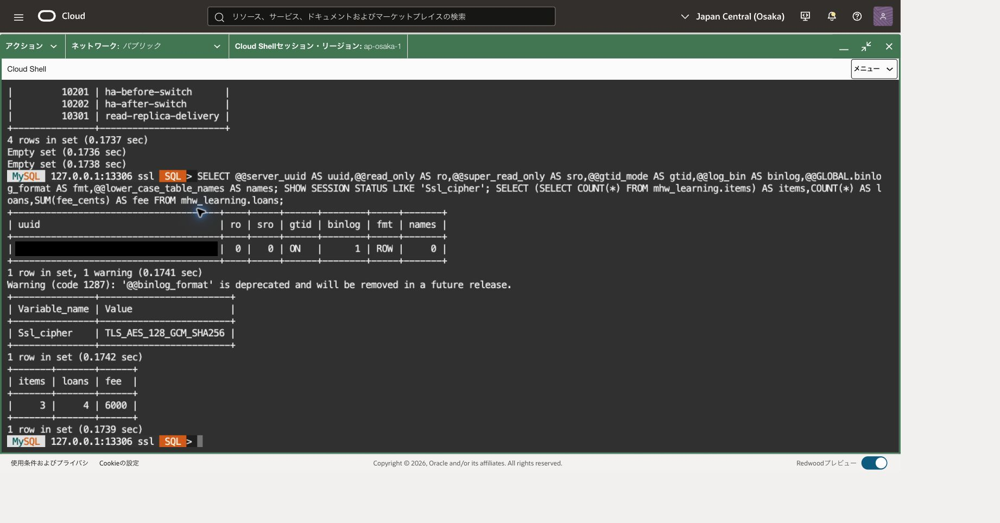

宛先確認の例では、ロード前のGTID集合が空で、TLS接続が有効、`mhw_learning` と `mhw_excluded` が存在しないことを確認できます。

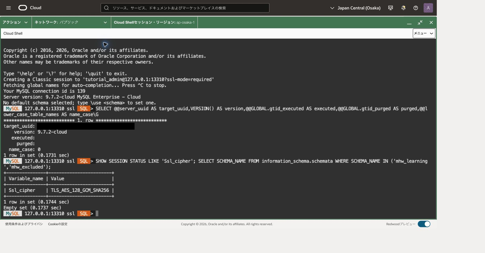

```text
\js
```

```javascript
// 目的: 照合済み宛先UUIDを保持し、ソースへの誤ロードを防ぐ。
var targetUuid = session.runSql('-- 目的: 宛先UUIDを保持する。\nSELECT @@server_uuid').fetchOne()[0];
if (targetUuid === sourceUuid) throw new Error('Source and target must differ');
shell.connect(sourceOptions);
```

## 3. レプリケーション専用アカウントを作る

ソース上に `tutorial_repl104` を作り、接続元を**宛先のprivate IPv4**に限定します。必要権限は `REPLICATION SLAVE`、通信はTLS必須です。管理者アカウントをチャネルへ流用しません。[専用ユーザーの公式手順](https://docs.oracle.com/en-us/iaas/mysql-database/doc/creating-replication-user-source-server.html)

targetPrivateIpには、宛先DB詳細のOCIDとprivate IPv4を照合した値だけを設定します。単にIPv4形式が正しいだけでは対象確認になりません。

この章に添付する [create-repl-user.js](create-repl-user.js) を手元の端末に保存します。Cloud Shell右上の「メニュー」から「アップロード」を開き、保存したファイルを選択してアップロードしてください。アップロード先をホームディレクトリにすると、次のコマンドで配置を確認できます。MySQL Shellを使用中の場合は、先に `\quit` でCloud ShellのOSプロンプトへ戻ります。

```bash
# 目的: 実行するスクリプトがCloud Shellのホームに置かれたことを確認する。
ls -l "$HOME/create-repl-user.js"
```

スクリプトに秘密値は含みません。新しいパスワードは非表示プロンプトへ入力し、安全な方法で保管します。このアカウントはチャネル作成でも使います。

配置を確認したら、Cloud ShellのOSプロンプトから専用プロセスでソースへ接続します。

```bash
# 目的: 新規アカウント設定だけを、クライアントSQLログを出さないプロセスで行う。
"$MHW_SHELL" --mysql --js --host=127.0.0.1 --port=13306 \
  --user=tutorial_admin --ssl-mode=REQUIRED --log-sql=off --log-level=none --password
```

```javascript
// 目的: 非秘密の宛先と確認済みソースUUIDをスクリプトへ渡す。
var targetPrivateIp = 'TARGET_PRIVATE_IPV4';
var expectedSourceUuid = 'VERIFIED_SOURCE_UUID';
```

次のパスを先ほどの `ls` で表示された絶対パスへ置き換え、スクリプトを実行します。`New replication password:` と `Confirm replication password:` に同じパスワードを入力し、それぞれEnterを押します。確認入力の送信後にアカウントと権限が作成され、成功時は `REPL_ACCOUNT_CREATED` が表示されます。

```text
\source /absolute/path/create-repl-user.js
```

パスワードは8～128文字で、英大文字・英小文字・数字と、`! # % + , - . : = @ ^ _` のいずれかの記号を含め、確認入力と一致させます。この教材スクリプトは引用符・空白・バックスラッシュを受け付けません。秘密をSQL履歴へ直接書く代わりに非表示入力を使います。この入力条件は実運用での強度を保証するものではありません。実運用では所属組織のポリシーに従い、十分に長く推測困難で他用途と重複しないパスワードを使用してください。サーバー側のパスワードポリシーに拒否された場合、そのポリシーを緩和せず、条件を満たす値を選び直します。作成途中で失敗した場合は既存アカウントと権限の非秘密情報を確認し、作成要求を無条件に再送しません。

成功後、次で付与権限を確認します。TARGET_PRIVATE_IPV4を作成時の宛先IPへ置き換えます。

```text
\sql
```

```sql
-- 目的: 専用アカウントの付与権限が予定どおりであることを確認する。
SHOW GRANTS FOR 'tutorial_repl104'@'TARGET_PRIVATE_IPV4';
```

確認後に `\quit` します。既存アカウントがある場合は上書きせず停止します。パスワード設定が成功して権限設定だけ失敗した場合も、アカウント作成をそのまま再送しません。

通常のログ設定で接続し直し、手順1のJS変数と、手順2で確認したsourceUuid/targetUuidを再設定します。

```bash
# 目的: 初期コピーのため通常のクライアント設定でソースへ戻る。
"$MHW_SHELL" --mysql --js --host=127.0.0.1 --port=13306 \
  --user=tutorial_admin --ssl-mode=REQUIRED --password
```

```javascript
// 目的: プロセス再起動後に非秘密の接続先、識別値、作業領域を復元する。
var sourceOptions = {scheme:'mysql',host:'127.0.0.1',port:13306,user:'tutorial_admin','ssl-mode':'REQUIRED'};
var targetOptions = {scheme:'mysql',host:'127.0.0.1',port:13310,user:'tutorial_admin','ssl-mode':'REQUIRED'};
var sourceUuid = 'VERIFIED_SOURCE_UUID';
var targetUuid = 'VERIFIED_TARGET_UUID';
// 目的: 接続切替が成功したことと記録済みUUID・TLSを、後続操作の前に検査する。
function connectChecked(options, expectedUuid) {
  shell.connect(options);
  var id = session.runSql('-- 目的: 接続先UUIDと書込み状態を照合する。\nSELECT @@server_uuid,@@read_only,@@super_read_only').fetchOne();
  if (!id || id[0] !== expectedUuid) throw new Error('Wrong DB; stop');
  var tls = session.runSql("-- 目的: 切替後のTLSを確認する。\nSHOW SESSION STATUS LIKE 'Ssl_cipher'").fetchOne();
  if (!tls || !String(tls[1]).length) throw new Error('TLS required; stop');
  if (expectedUuid === sourceUuid && (Number(id[1]) !== 0 || Number(id[2]) !== 0)) {
    throw new Error('Source not writable; stop');
  }
}
var work = os.getenv('MHW104_WORK');
var dumpPath = work + '/dump';
```

## 4. 初期データをdumpして宛先へloadする

初期コピー中は、この演習データへの別セッションからのDDL/DMLを止めます。ソースJSモードで、UUIDが一致することを確認してdry runを実行します。

```javascript
// 目的: ソースを取り違えず、9.7.2向け互換性検査を先に行う。
(function () {
if (session.runSql('-- 目的: ダンプ元を照合する。\nSELECT @@server_uuid').fetchOne()[0] !== sourceUuid) throw new Error('Wrong source');
util.dumpSchemas(['mhw_learning'], dumpPath, {ocimds:true,targetVersion:'9.7.2',threads:2,dryRun:true});
})();
```

エラーや整合性警告があれば修正するまで進めません。成功後、同じオプションで実行します。

```javascript
// 目的: 対象スキーマの構造とデータを整合したスナップショットとして出力する。
util.dumpSchemas(['mhw_learning'], dumpPath, {ocimds:true,targetVersion:'9.7.2',threads:2});
// 目的: ダンプ時点のGTID集合をメタデータから取得する。
var dumpGtid = JSON.parse(os.loadTextFile(dumpPath + '/@.json')).gtidExecuted;
if (typeof dumpGtid !== 'string' || !dumpGtid) throw new Error('Dump GTID missing');
print(dumpGtid);
```

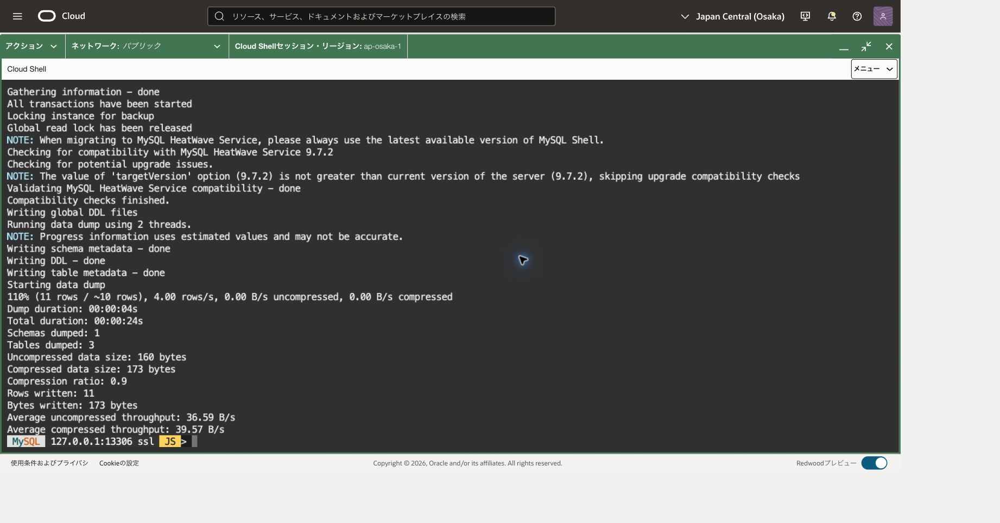

完了結果は1スキーマ・3表・11行です。進捗の110%は推定行数10行と実際の11行との差による表示で、コピー件数は完了結果で確認します。

GTID集合はスキーマ単位ではなくソース全体の実行履歴です。`mhw_learning` 以外の履歴も含まれ得ます。この部分コピーを根拠に、宛先にソース全体のデータが揃ったとは判断できません。[dumpSchemas](https://dev.mysql.com/doc/mysql-shell/26.7/en/mysql-shell-utilities-dump-instance-schema.html)

以下の `connectChecked` で例外や接続エラーが出た場合、その枠の後続文を実行せず停止します。古い接続のまま続行しません。以後の接続切替でも同じです。

宛先へ接続してdry run、成功後に実ロードします。

接続・識別・GTIDの検査とdry runを同じ関数内で実行します。どこかで例外が発生すると、その関数内の後続処理は実行されません。

```javascript
(function () {
connectChecked(targetOptions, targetUuid);
// 目的: ロード先を確認する。
if (session.runSql('-- 目的: 宛先UUIDを照合する。\nSELECT @@server_uuid').fetchOne()[0] !== targetUuid) throw new Error('Wrong target');
// 目的: 既存GTIDとダンプGTIDに重複がないことを確認する。
var overlap = session.runSql('-- 目的: GTID集合の共通部分を計算する。\nSELECT GTID_SUBTRACT(?, GTID_SUBTRACT(?, @@GLOBAL.gtid_executed))',[dumpGtid,dumpGtid]).fetchOne()[0];
if (overlap !== '') throw new Error('GTIDs overlap; do not reload');
util.loadDump(dumpPath, {threads:2,updateGtidSet:'append',dryRun:true});
})();
```

```javascript
// 目的: データとダンプ時点GTIDを新規宛先へ読み込む。
util.loadDump(dumpPath, {threads:2,updateGtidSet:'append'});
// 目的: ダンプの全GTIDを宛先が保持していることを確認する。
var copied = session.runSql('-- 目的: 初期コピーのGTID反映を検査する。\nSELECT GTID_SUBSET(?,@@GLOBAL.gtid_executed)',[dumpGtid]).fetchOne()[0];
if (Number(copied) !== 1) throw new Error('Initial GTID not applied');
print('INITIAL_GTID_PASS');
```

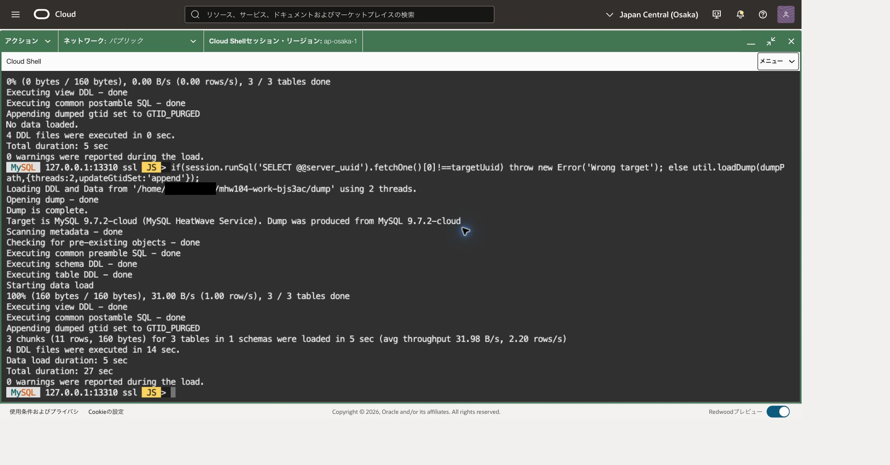

画面下部の本ロードは11行・3表・1スキーマ、警告0件で完了しています。上端に残る前の処理の「No data loaded」と区別して確認してください。

`append`は既存集合との非重複が必要です。エラー時に `replace` や `ignoreVersion` へ変更して通過させません。失敗時の進捗ファイルを残し、完了状況を確認してから再開します。HAが有効な宛先にはこの手順を適用しません。[loadDumpとGTID](https://dev.mysql.com/doc/mysql-shell/26.7/en/mysql-shell-utilities-load-dump.html)

`\sql` で件数、集計、チェックポイントを確認します。

```sql
-- 目的: 宛先に初期データの基準値が揃ったことを確認する。
SELECT (SELECT COUNT(*) FROM mhw_learning.items) AS items,
       COUNT(*) AS loans,SUM(fee_cents) AS fee_cents FROM mhw_learning.loans;
-- 目的: 101～103の既存マーカーもコピーされたことをソース結果と照合する。
SELECT checkpoint_id,note FROM mhw_learning.checkpoints ORDER BY checkpoint_id;
```

items=3、loans=4、fee_cents=6000とソースのマーカー一覧が一致したら、初期コピーは完了です。宛先へ追加の業務データを書き込まないでください。

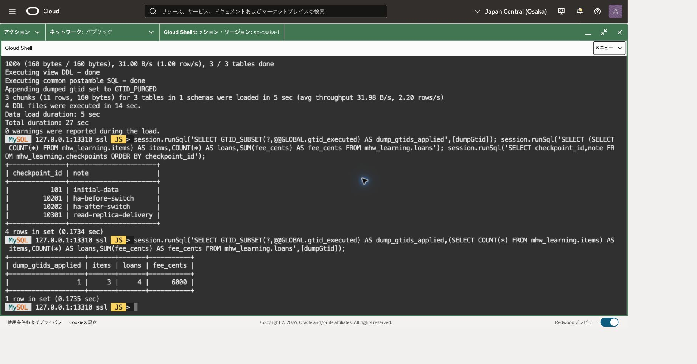

GTID適用結果1、items 3件、loans 4件、料金合計6000セントと、101・10201・10202・10301の4マーカーを確認した例です。件数・集計・マーカーの照合結果であり、全データの網羅的な同一性検査を示すものではありません。

## 5. チャネルを作成して継続同期する

宛先DBのConsoleで **Create channel** を選びます。

|項目|設定|
|---|---|
|表示名|mhw-tutorial-channel|
|ソースhostname|主DBの実private IPv4（loopbackではない）|
|ソースport|3306|
|IPv6接続|無効|
|ソースユーザー|tutorial_repl104|
|パスワード|手順3で設定した専用パスワード|
|SSL mode|REQUIRED|
|GTID位置指定|ソースGTIDを利用する自動位置指定|
|Target DB|mhw-tutorial-channel-target|
|内部channel名|replication_channel（表示名とは別）|
|Applier|既定値、遅延0秒|
|作成時有効化|有効|
|Filter type|REPLICATE_WILD_DO_TABLE|
|Filter value|`mhw\_learning.%`|

Consoleに入力するフィルターのバックスラッシュは1個です。`_` を文字として扱い、末尾 `%` は表名全体に一致させます。追加のincludeルールは入れません。[チャネル作成とフィルター](https://docs.oracle.com/en-us/iaas/mysql-database/doc/creating-replication-channel.html)

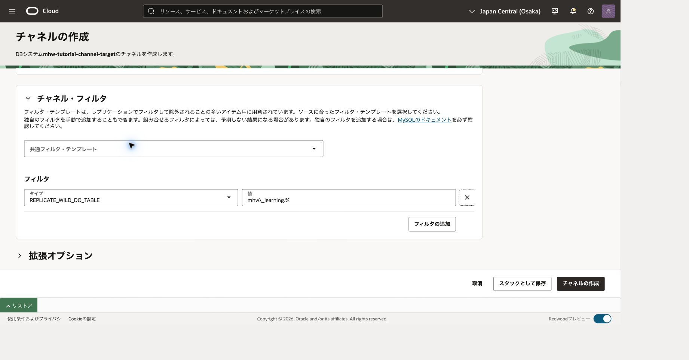

作成フォームでフィルター種別と値を確認します。この画面は設定の入力段階で、チャネルの作成完了や同期成功を示すものではありません。

作成の受付と完了を区別し、ACTIVEと作業リクエスト成功を確認します。この表示だけではデータ到達を証明していないため、次で実データを検査します。

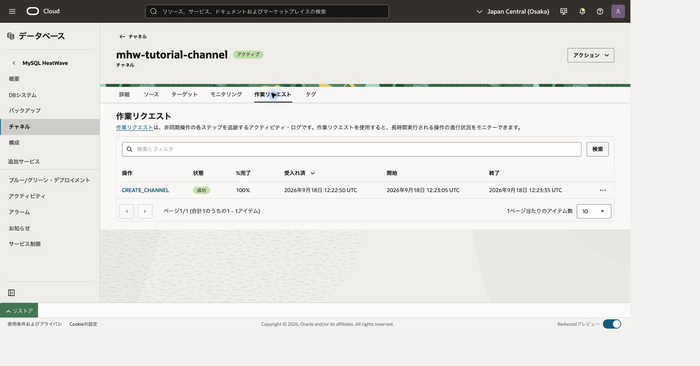

ACTIVEとCREATE_CHANNELの成功100%を確認します。実データの到達は、続くマーカーの登録と宛先での照会で検査します。

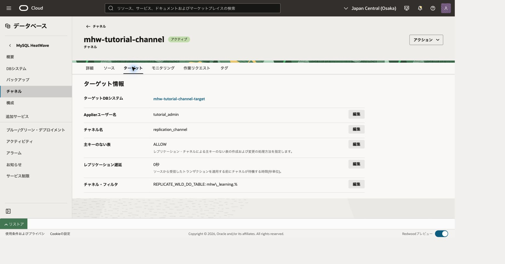

宛先DBとフィルターが指定どおりであることを確認します。「遅延0秒」は意図的な遅延の設定値であり、実測の同期遅延が0秒という意味ではありません。画面のALLOWも、主キーを省略してよいという推奨ではありません。

`\js` でソースへ戻ります。

```javascript
connectChecked(sourceOptions, sourceUuid);
```

`\sql` で、10401がまだないことを確認してから登録します。以後、INSERT等が失敗したらCOMMITせずROLLBACKし、再実行前に状態を確認します。

```sql
-- 目的: 同期検証マーカーの二重登録を防ぐ。
SELECT checkpoint_id FROM mhw_learning.checkpoints WHERE checkpoint_id=10401;
```

0行の場合だけ次へ進みます。既存行があれば更新を再送せず前回状態を確認します。

```sql
-- 目的: 最初の継続同期マーカーを一つのトランザクションで登録する。
START TRANSACTION;
-- 目的: チャネル作成後の新しい変更を発生させる。
INSERT INTO mhw_learning.checkpoints VALUES (10401,'channel-live');
```

直前の変更がすべて成功した場合だけ確定します。エラーがあればCOMMITせずROLLBACKします。

```sql
-- 目的: レプリケーション対象となる変更を確定する。
COMMIT;
```

0行確認後の登録成功・COMMITを確認して `\js` に戻ります。

```javascript
// 目的: 確定後の到達待ち境界を保持する。
var liveBarrier = session.runSql('-- 目的: 10401確定後のGTIDを取得する。\nSELECT @@GLOBAL.gtid_executed').fetchOne()[0];
connectChecked(targetOptions, targetUuid);
// 目的: 最大30秒の範囲で境界到達を待つ。0が成功、1は時間切れ。
var liveWait = session.runSql('-- 目的: 同期境界を待つ。\nSELECT WAIT_FOR_EXECUTED_GTID_SET(?,30)',[liveBarrier]).fetchOne()[0];
if (Number(liveWait) !== 0) throw new Error('GTID not reached; inspect channel');
```

`\sql` で到達内容を確認します。

```sql
-- 目的: GTIDだけでなく、期待したマーカーの実データ到達を確認する。
SELECT checkpoint_id,note FROM mhw_learning.checkpoints WHERE checkpoint_id=10401;
```

期待値は `10401 / channel-live` です。タイムアウトの場合はINSERTを再送せず、チャネルの接続/TLS/ユーザー/フィルター/エラーを確認します。

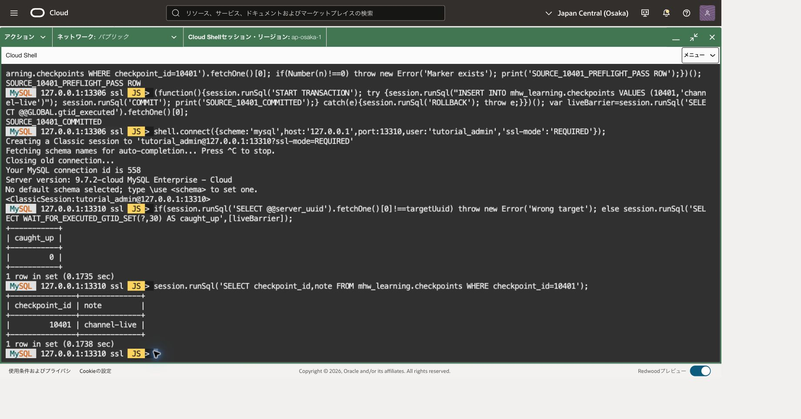

待機結果0は指定したGTID集合まで処理済みであることを示します。その後のSELECTで、対象マーカーが宛先に反映されたことを確認しています。

## 6. 停止中の変更と再開を確認する

Consoleでこのチャネルを無効化します。無効状態と作業リクエスト完了を確認してから、新しい変更を作ります。DB自体は停止しません。

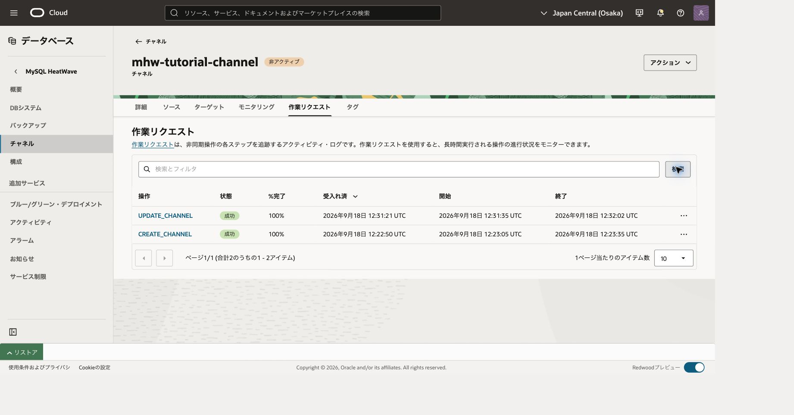

`\js` で `connectChecked(sourceOptions, sourceUuid);`、続けて `\sql` を実行します。

```sql
-- 目的: 再開検証マーカーの事前不在を確認する。
SELECT checkpoint_id FROM mhw_learning.checkpoints WHERE checkpoint_id=10402;
```

0行の場合だけ次へ進みます。既存行があれば更新を再送せず前回状態を確認します。

```sql
-- 目的: 停止中に発生する変更の確定単位を開始する。
START TRANSACTION;
-- 目的: チャネル停止中の差分を作る。
INSERT INTO mhw_learning.checkpoints VALUES (10402,'channel-resume');
```

直前の変更がすべて成功した場合だけ確定します。エラーがあればCOMMITせずROLLBACKします。

```sql
-- 目的: 差分をソースで確定する。
COMMIT;
```

`\js` へ戻ります。

```javascript
// 目的: 再開後に待つ境界を保存する。
var resumeBarrier = session.runSql('-- 目的: 10402確定後のGTIDを取得する。\nSELECT @@GLOBAL.gtid_executed').fetchOne()[0];
connectChecked(targetOptions, targetUuid);
```

`\sql` で次を確認します。

```sql
-- 目的: チャネル停止中は新しいマーカーが宛先にないことを確認する。
SELECT checkpoint_id,note FROM mhw_learning.checkpoints WHERE checkpoint_id=10402;
```

0行を確認します。Consoleで同じチャネルを有効に戻し、ACTIVEと作業リクエスト完了を待ちます。`\js` で宛先の同期を確認します。

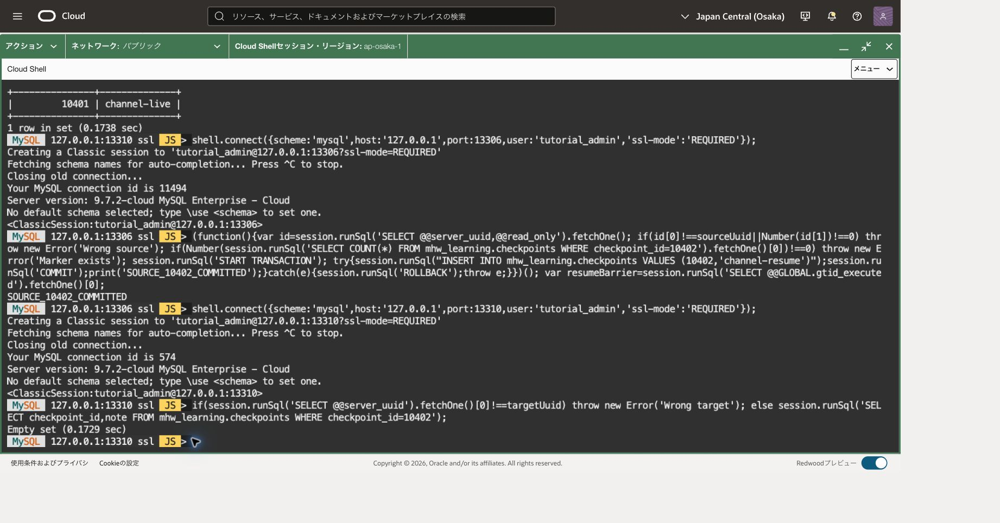

```javascript
// 目的: 停止中の変更を含む境界まで、再開後の処理を待つ。
var resumeWait = session.runSql('-- 目的: 再開境界を待つ。\nSELECT WAIT_FOR_EXECUTED_GTID_SET(?,30)',[resumeBarrier]).fetchOne()[0];
if (Number(resumeWait) !== 0) throw new Error('Resume GTID not reached');
```

`\sql` に戻り、同じSELECTを実行して `10402 / channel-resume` を確認します。停止時の0行と再開後の1行の両方を記録してください。

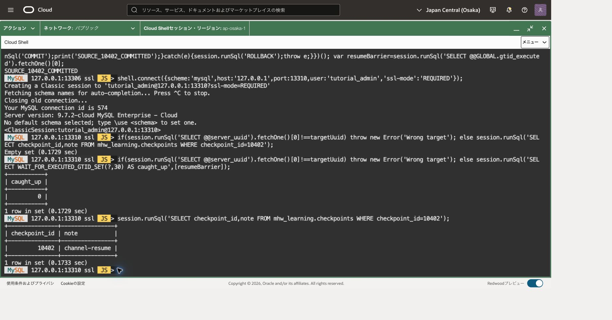

画像上部のEmpty setは停止中の結果です。下部の待機結果0と1行の結果が、再開後に滞留していた変更を処理できたことを示します。

## 7. フィルターを実データで検証する

対象外のスキーマに表を作り、対象内にも新しいマーカーを登録します。`\js` で `connectChecked(sourceOptions, sourceUuid);`、次に `\sql` を実行します。

```sql
-- 目的: 対象外テストの名前空間を上書きしないため不在を確認する。
SELECT SCHEMA_NAME FROM information_schema.SCHEMATA WHERE SCHEMA_NAME='mhw_excluded';
```

0行の場合だけ作成します。次のDDLは暗黙COMMITを伴い、ROLLBACKで取り消せません。

```sql
-- 目的: この章の対象外スキーマを新規作成する。
CREATE DATABASE mhw_excluded;
```

作成成功を確認して次へ進みます。

```sql
-- 目的: 同期してほしくない表を作成する。
CREATE TABLE mhw_excluded.probe (id INT PRIMARY KEY,note VARCHAR(80) NOT NULL) ENGINE=InnoDB;
```

表の作成成功後、次の不在確認を行います。

```sql
-- 目的: 対象内マーカーの事前不在を確認する。
SELECT checkpoint_id FROM mhw_learning.checkpoints WHERE checkpoint_id=10403;
```

0行の場合だけ次へ進みます。既存行があれば更新を再送せず前回状態を確認します。

```sql
-- 目的: 対象外データと対象内マーカーを一つの確定単位にする。
START TRANSACTION;
-- 目的: フィルターで除外される行を作る。
INSERT INTO mhw_excluded.probe VALUES (1,'must-not-arrive');
-- 目的: 同じ時点に処理される対象内の変更を作る。
INSERT INTO mhw_learning.checkpoints VALUES (10403,'channel-filter');
```

直前の変更がすべて成功した場合だけ確定します。エラーがあればCOMMITせずROLLBACKします。

```sql
-- 目的: フィルター試験のデータ変更を確定する。
COMMIT;
```

各不在確認が0行の場合だけ次へ進みます。DDLには暗黙COMMITがあるため、失敗したら残存オブジェクトを調べます。`\js` へ戻り、全操作後の境界を宛先で待ちます。

```javascript
// 目的: 除外対象のDDL/DMLも含む試験完了時点を保存する。
var filterBarrier = session.runSql('-- 目的: フィルター試験後のGTIDを取得する。\nSELECT @@GLOBAL.gtid_executed').fetchOne()[0];
connectChecked(targetOptions, targetUuid);
// 目的: 単なる遅延による未到達を、フィルター成功と誤認しないよう待つ。
var filterWait = session.runSql('-- 目的: 試験全体のGTID境界を待つ。\nSELECT WAIT_FOR_EXECUTED_GTID_SET(?,30)',[filterBarrier]).fetchOne()[0];
if (Number(filterWait) !== 0) throw new Error('Filter boundary not reached');
```

`\sql` で最終確認します。

```sql
-- 目的: 同期対象の行は到達していることを確認する。
SELECT checkpoint_id,note FROM mhw_learning.checkpoints WHERE checkpoint_id=10403;
-- 目的: GTID境界到達後も対象外スキーマが存在しないことを確認する。
SELECT SCHEMA_NAME FROM information_schema.SCHEMATA WHERE SCHEMA_NAME='mhw_excluded';
-- 目的: 対象外表も存在しないことを確認する。
SELECT TABLE_SCHEMA,TABLE_NAME FROM information_schema.TABLES
WHERE TABLE_SCHEMA='mhw_excluded';
-- 目的: 元の貸出データが変わっていないことを確認する。
SELECT COUNT(*) AS loans,SUM(fee_cents) AS fee_cents FROM mhw_learning.loans;
```

10403が1行、対象外スキーマ・表が0行、loans=4/fee_cents=6000なら合格です。GTID到達は「全データをコピーした」という意味ではありません。フィルターで除外したトランザクションも処理済み履歴に反映されます。

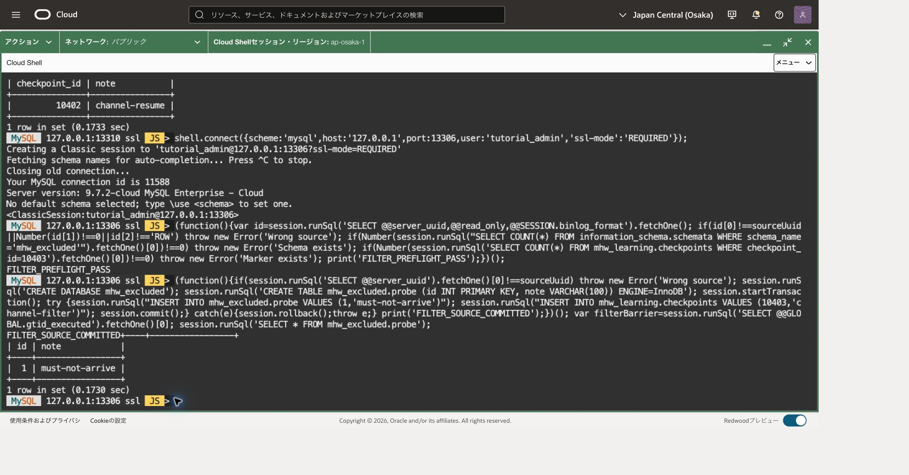

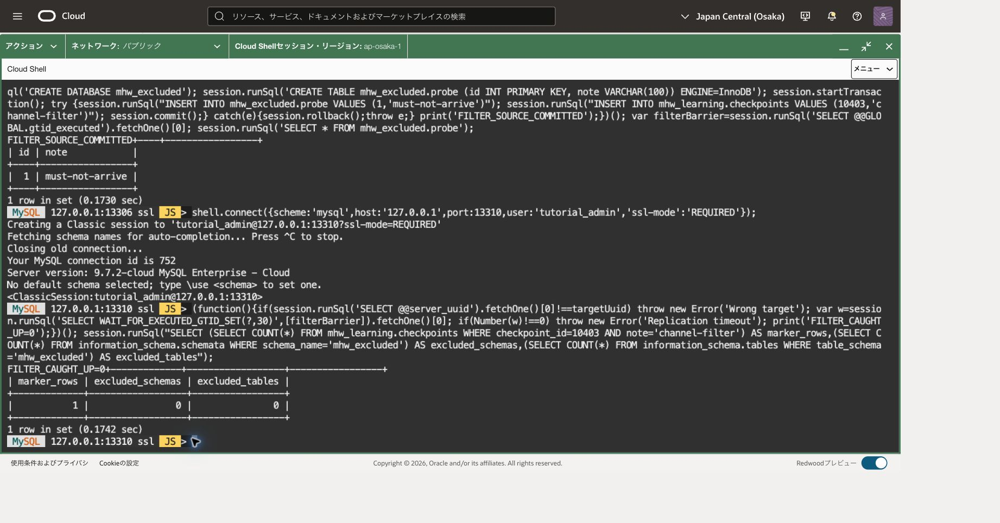

確認例では、上記SELECTと同じ条件を件数にまとめています。`marker_rows=1`、`excluded_schemas=0`、`excluded_tables=0`です。GTID待機成功後に照会しているため、単なる反映待ちとフィルターによる除外を区別できます。

今回のワイルドカードルールは表名部分が `%` のためDBレベルDDLにも適用されます。ただし、ストアドルーチンや権限変更まで何でも遮断する境界ではありません。この演習中に無関係なアカウント変更を流さず、セキュリティ分離の代わりにしないでください。[フィルター評価](https://dev.mysql.com/doc/refman/9.7/en/replication-options-replica.html)、[GTID待機関数](https://dev.mysql.com/doc/refman/9.7/en/gtid-functions.html)

## 8. この章だけの資源を片付ける

1. 記録したOCIDでチャネルを照合し、無効化→削除→削除完了の順に確認します。
2. 宛先DBがこの章の専用DBであることを再確認し、backup一覧と削除設定を確認して削除します。最終backupを作らない設定でも、既存backupがあれば別に残存を確認します。
3. ソースへ接続して、この章の専用レプリケーションユーザーと対象外スキーマだけを削除します。実行前に対象を確認し、下の宛先IPを作成時の値に置き換えます。

```sql
-- 目的: 専用アカウントのhostを削除前に照合する。ハッシュ等は取得しない。
SELECT User,Host FROM mysql.user WHERE User='tutorial_repl104';
```

削除前に `\js` で `connectChecked(sourceOptions, sourceUuid);` を実行し、成功後に `\sql` へ戻って上のアカウント照会をもう一度行います。表示が今回作成した単一Hostに一致し、専用スキーマも自分の作成物である場合だけ次を実行します。

```sql
-- 目的: 削除済みチャネルだけが使用した専用アカウントを廃止する。
DROP USER 'tutorial_repl104'@'TARGET_PRIVATE_IPV4';
-- 目的: 所有確認済みの対象外試験データだけを削除する。
DROP DATABASE mhw_excluded;
```

削除要求の結果を確認してから、次の読取りで残存を確認します。結果不明の場合も削除を再送せず読取りから再開します。

```sql
-- 目的: 専用アカウントと対象外スキーマが消えたことを確認する。
SELECT User,Host FROM mysql.user WHERE User='tutorial_repl104';
-- 目的: 対象外スキーマの削除を確認する。
SELECT SCHEMA_NAME FROM information_schema.SCHEMATA WHERE SCHEMA_NAME='mhw_excluded';
```

`mhw_learning` と主DBは削除しません。104のマーカーも検証履歴として残します。

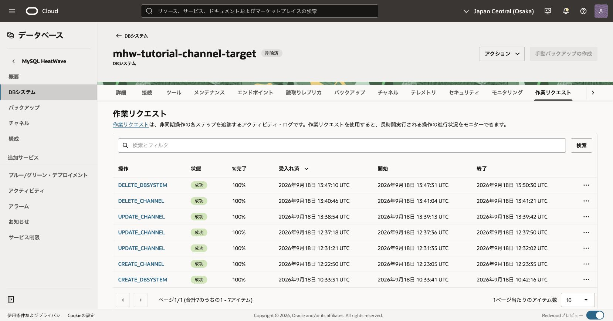

削除後は、宛先DBが「削除済」で、`DELETE_CHANNEL` と `DELETE_DBSYSTEM` が成功していることを確認します。

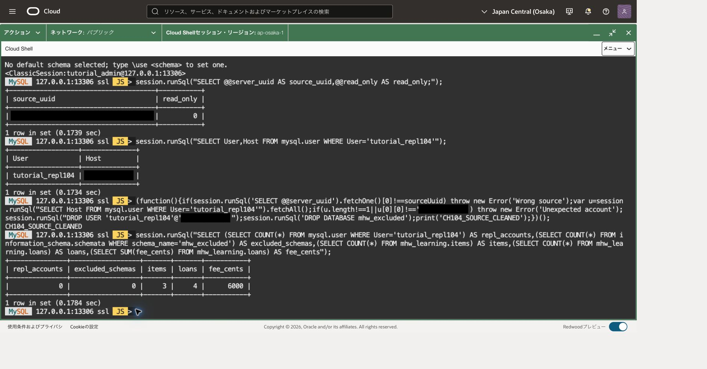

上の例は削除後の専用アカウントと対象外スキーマが0件で、主データは3品目・4件・合計6,000のままです。画像上部のアカウント1件は削除前の照会結果です。

mysqlshを `\quit` で終了し、OSシェルで宛先向けの転送を閉じます。

```bash
# 目的: 宛先DB用の転送だけを終了し、待受がなくなったことを確認する。
ssh -F /dev/null -S "$MHW104_SOCKET" -O exit "$MHW_OS_USER@$MHW_COMPUTE_IP"
ss -ltn 'sport = :13310'
# 目的: 削除対象の専用ダンプ領域を明示し、対象を確認する。
printf '%s\n' "$MHW104_WORK"
find "$MHW104_WORK" -maxdepth 2 -type f -print
```

必要な証跡を残した後、表示した専用領域だけを削除します。次はパスの形を検査し、ファイルごとに確認して削除します。作業変数が失われていたら、確認済みの絶対パスを設定し直します。

```bash
# 目的: この章で新規作成した専用領域だけを、対象確認付きで削除する。
case "$MHW104_WORK" in
  "$HOME"/mhw104-work-*) test -d "$MHW104_WORK" && rm -ri -- "$MHW104_WORK" ;;
  *) printf '%s\n' 'Unexpected path; nothing removed' ;;
esac
```

保存した宛先管理認証があれば、OSシェルから `"$MHW_SHELL" --js` を開き、接続先一覧だけを確認します。

```javascript
// 目的: 保存済み接続先名だけを調べる。パスワード値は読み出さない。
shell.listCredentials();
```

一覧に今回保存した宛先接続先がある場合だけ、次を実行します。表記が異なる場合は一覧の宛先1件を照合して指定し、全資格情報を削除しません。

```javascript
// 目的: 廃止した宛先DBの管理認証1件だけを削除する。
shell.deleteCredential('tutorial_admin@127.0.0.1:13310');
// 目的: 対象の保存認証が消えたことを確認する。
shell.listCredentials();
```

主DB用の保存認証は後続章の方針に従って保持します。専用の転送ソケット領域や配布スクリプトも不要になった対象だけ整理し、共有SSH鍵とCompute/VCNは削除しません。

## 注意点

- 非同期なのでACTIVEとデータ到達は別に検査します。30秒の時間切れは失敗原因の診断開始点であり、INSERT再送の理由ではありません。
- ダンプのGTIDは全ソースの履歴です。後からフィルターを広げても、コピーしていなかった過去データが自動で補われるとは限りません。
- ダンプ・ロードはそれぞれ複数の接続を使います。転送経由の動作、容量、TLSを個別に確認します。
- 公式のHeatWaveロード手順は到達可能なCompute上のShellを説明しています。本章はCloud Shell上のShellから転送を使う構成です。

## 失敗時のトランザクション取消

INSERT等のエラーがあり、同じ接続で未確定の変更が残っている場合だけ実行します。DDLや既に確定した変更は取り消せません。

```sql
-- 目的: 失敗した未確定DMLを取り消し、状態確認から再開する。
ROLLBACK;
```

## 章の移動

[前章](../103-read-replicas/) · [次章](../105-backup-restore/)
