この章では、主DBの `mhw_learning` を新しいDBへコピーし、その後の変更をレプリケーション・チャネルで同期します。既存の読取りレプリカを作る103とは異なり、宛先DBと同期対象を自分で指定します。

## 完成状態と前提

- 101の主DB `mhw-tutorial-main` がACTIVEで、items 3件、loans 4件、料金合計6000セントを保持している。
- 同じ主DBに対する102・103の処理が完了し、構成変更や作業リクエストが進行していない。
- MySQL 9.7.2を利用し、Cloud ShellのMySQL Shell Community 26.7.1とComputeの転送専用SSHが使用できる。
- 101のIAMに加え、専用ユーザー作成とREPLICATION SLAVE付与、dump/loadの公式SQL権限をSHOW GRANTSで確認する。接続成功だけで権限充足とはしない。
- 宛先DB1台分の追加料金、保持期間、最終削除を了承している。

管理接続はソース13306・宛先13310、チャネルは宛先DBからソースのprivate IP:3306へ直接接続します。主DBの転送は[101章](../101-create-connect/)で再開します。

## 1. 宛先DBと転送を用意する

101の作成手順に従い、大阪・同じ演習区画・同じIPv4-only private subnetに次のDBを作ります。

|項目|値|
|---|---|
|表示名|mhw-tutorial-channel-target|
|管理ユーザー／版|tutorial_admin／9.7.2|
|シェイプと初期容量|MySQL.2、50GiB|
|HA / HeatWave|どちらも無効|
|用途|この章だけで使用し、検証後に削除|

この一時DBでは、自動backup/PITR、最終backup、削除保護、自動backup保持を無効にできる場合は無効にし、設定を記録します。意図しないbackupがある場合は削除前に一覧を確認します。主DBのbackup設定は変更しません。

ACTIVEと作業リクエスト完了を確認し、宛先のOCID・private IPv4を控えます。主DBと異なることを確認してください。通信には、Compute→宛先3306に加え、**宛先DB→主DB3306** の許可が必要です。既存の広い許可を最小権限の証明にしません。

主DBの13306転送は維持します。追加のCloud Shellタブを宛先転送用に開き、OSで13310が未使用か確認します。既存待受があれば所有を確認するまで起動しません。

```bash
ss -ltn 'sport = :13310'
```

宛先IPとCompute IPを実値へ置換します。オプションは冒頭と同じ意味で、追加するのは宛先用の1ポートだけです。このタブも開いたままにします。

```bash
ssh -F /dev/null -N \
  -o ExitOnForwardFailure=yes -o IdentitiesOnly=yes -o ForwardAgent=no \
  -o StrictHostKeyChecking=yes \
  -o UserKnownHostsFile="$HOME/.ssh/mhw-learning-known-hosts" \
  -i "$HOME/.ssh/mhw-learning.key" \
  -L '127.0.0.1:13310:TARGET_PRIVATE_IPV4:3306' \
  opc@COMPUTE_PUBLIC_IP
```

SQL用タブのMySQL Shellを終了し、OSで専用作業領域を**初回だけ**作ります。固定パス`$HOME/mhw104-work`を使います。既存なら新規処理を止め、末尾の再開手順を使います。

```text
\quit
```

```bash
( test ! -e "$HOME/mhw104-work" && mkdir -m 700 "$HOME/mhw104-work" )
"$HOME/mysql-shell-community-26.7.1-el8/usr/bin/mysqlsh" --mysql --js --host=127.0.0.1 --port=13306 \
  --user=tutorial_admin --ssl-mode=REQUIRED
```

--jsはJavaScriptモードです。作業領域は後の初期コピーで使います。

## 2. ソースと宛先の条件を検査する

dump/loadは最初のデータをコピーする操作、チャネルはその後の変更を継続して送る経路です。GTIDは確定したトランザクションを識別するIDで、どこまで反映済みかの照合に使います。以下のJSコードは枠ごとに実行し、例外が出たら次の枠へ進みません。

ソースで `\sql` に切り替えます。

```sql
SELECT @@server_uuid AS uuid, VERSION() AS version,
       @@GLOBAL.gtid_mode AS gtid_mode, @@GLOBAL.log_bin AS log_bin,
       @@GLOBAL.binlog_format AS global_format, @@SESSION.binlog_format AS session_format,
       @@GLOBAL.lower_case_table_names AS name_case,
       @@read_only AS read_only, @@super_read_only AS super_read_only\G
SHOW SESSION STATUS LIKE 'Ssl_cipher';
SELECT TABLE_NAME, ENGINE FROM information_schema.TABLES
WHERE TABLE_SCHEMA='mhw_learning' ORDER BY TABLE_NAME;
SELECT (SELECT COUNT(*) FROM mhw_learning.items) AS items,
       COUNT(*) AS loans, SUM(fee_cents) AS fee_cents FROM mhw_learning.loans;
SELECT checkpoint_id,note FROM mhw_learning.checkpoints ORDER BY checkpoint_id;
SELECT checkpoint_id,note FROM mhw_learning.checkpoints WHERE checkpoint_id BETWEEN 10401 AND 10403;
SELECT SCHEMA_NAME FROM information_schema.SCHEMATA WHERE SCHEMA_NAME='mhw_excluded';
```

表示されたUUID全体を、101～103で記録した現在の主DB UUIDと照合してから進みます。今回の接続から取得したUUIDを、照合なしに正しい値として採用しません。GTIDはON、log_binは1、両binlog_formatはROW、read-only値は両方0、cipherは非空を確認します。items=3、loans=4、fee_cents=6000です。既存の101～103マーカーはそのまま保持します。104マーカーと除外スキーマは0行でなければ中止し、前回状態を調べます。名前の大文字小文字設定は宛先と一致させます。[ソース条件](https://docs.oracle.com/en-us/iaas/mysql-database/doc/source-configuration.html)

`\js` へ戻り、ソースUUIDを保持して宛先に接続します。

```javascript
var sourceUuid = session.runSql('SELECT @@server_uuid').fetchOne()[0];
shell.connect({scheme:'mysql',host:'127.0.0.1',port:13310,user:'tutorial_admin','ssl-mode':'REQUIRED'});
```

`\sql` で宛先を確認します。

13310へ初めて切り替えたときは管理パスワードを非表示入力し、保存確認で `Y` を選びます。以後、同じtarget URLへの再接続では保存済み資格情報を使用します。

```sql
SELECT @@server_uuid AS uuid, VERSION() AS version, @@GLOBAL.gtid_executed AS executed,
       @@GLOBAL.gtid_purged AS purged, @@GLOBAL.lower_case_table_names AS name_case\G
SHOW SESSION STATUS LIKE 'Ssl_cipher';
SELECT SCHEMA_NAME FROM information_schema.SCHEMATA
WHERE SCHEMA_NAME IN ('mhw_learning','mhw_excluded');
```

新規専用宛先であること、ソースと異なるUUID、同じ版とname_case、非空cipher、対象スキーマ0行を確認します。既存GTIDや別のチャネルがある場合はこの演習を進めません。宛先のConsoleでHA無効・既存channelなしも確認します。

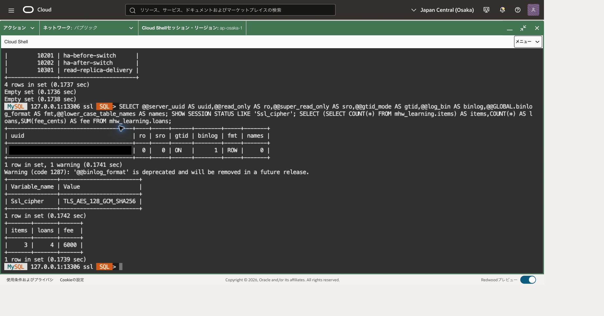

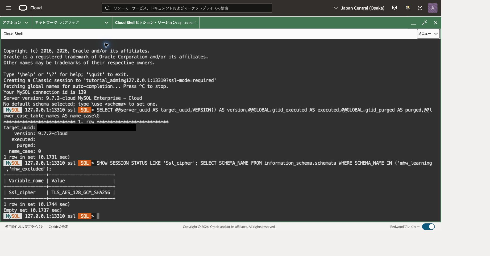

```text
\js
var targetUuid = session.runSql('SELECT @@server_uuid').fetchOne()[0];
if (targetUuid === sourceUuid) throw new Error('Source and target must differ');
shell.connect({scheme:'mysql',host:'127.0.0.1',port:13306,user:'tutorial_admin','ssl-mode':'REQUIRED'});
```

## 3. レプリケーション専用アカウントを作る

ソース上に `tutorial_repl104` を作り、接続元を**宛先のprivate IPv4**に限定します。必要権限は `REPLICATION SLAVE`、通信はTLS必須です。管理者アカウントをチャネルへ流用しません。[専用ユーザーの公式手順](https://docs.oracle.com/en-us/iaas/mysql-database/doc/creating-replication-user-source-server.html)

[create-repl-user.js](create-repl-user.js)をCloud ShellのホームへUploadし、MySQL Shellを終了してOSで配置を確認します。

```bash
ls -l "$HOME/create-repl-user.js"
```

```bash
"$HOME/mysql-shell-community-26.7.1-el8/usr/bin/mysqlsh" --mysql --js --host=127.0.0.1 --port=13306 \
  --user=tutorial_admin --ssl-mode=REQUIRED --log-sql=off --log-level=none
```

JSモードで次を設定します。

```javascript
var targetPrivateIp = 'TARGET_PRIVATE_IPV4';
var expectedSourceUuid = 'VERIFIED_SOURCE_UUID';
```

絶対パスを配置先へ置換して実行します。New replication passwordとConfirm replication passwordへ同じ秘密を隠し入力し、REPL_ACCOUNT_CREATEDを確認します。

```text
\source /absolute/path/create-repl-user.js
```

秘密は8〜128文字、英大小・数字・指定記号で組織規約も満たします。途中失敗ではUser/HostとSHOW GRANTSを読み、CREATEを再送しません。

成功後、次で付与権限を確認します。TARGET_PRIVATE_IPV4を作成時の宛先IPへ置き換えます。

```text
\sql
SHOW GRANTS FOR 'tutorial_repl104'@'TARGET_PRIVATE_IPV4';
```

通常のログ設定で接続し直し、手順1のJS変数と、手順2で確認したsourceUuid/targetUuidを再設定します。

```bash
"$HOME/mysql-shell-community-26.7.1-el8/usr/bin/mysqlsh" --mysql --js --host=127.0.0.1 --port=13306 \
  --user=tutorial_admin --ssl-mode=REQUIRED
```

JSモードで次を設定します。

```javascript
var sourceUuid = 'VERIFIED_SOURCE_UUID';
var targetUuid = 'VERIFIED_TARGET_UUID';
var liveBarrier, resumeBarrier, filterBarrier;
function connectChecked(port, expectedUuid) {
  if (![13306,13310].includes(port) || !expectedUuid || expectedUuid.includes('VERIFIED')) throw new Error('Restore recorded UUIDs');
  shell.connect({scheme:'mysql',host:'127.0.0.1',port:port,user:'tutorial_admin','ssl-mode':'REQUIRED'});
  var id = session.runSql('SELECT @@server_uuid,@@read_only,@@super_read_only').fetchOne();
  if (!id || id[0] !== expectedUuid) throw new Error('Wrong DB; stop');
  var tls = session.runSql("SHOW SESSION STATUS LIKE 'Ssl_cipher'").fetchOne();
  if (!tls || !String(tls[1]).length) throw new Error('TLS required; stop');
  if (expectedUuid === sourceUuid && (Number(id[1]) !== 0 || Number(id[2]) !== 0)) {
    throw new Error('Source not writable; stop');
  }
}
function insertCheckpoint104(id, note) {
  connectChecked(13306, sourceUuid);
  if (session.runSql('SELECT checkpoint_id FROM mhw_learning.checkpoints WHERE checkpoint_id=?',[id]).fetchOne()) throw new Error('Already present; read state');
  session.runSql('START TRANSACTION');
  try {
    session.runSql('INSERT INTO mhw_learning.checkpoints VALUES (?,?)',[id,note]);
    session.runSql('COMMIT');
  } catch (e) {
    try { session.runSql('ROLLBACK'); } catch (ignored) {}
    throw new Error('Result uncertain; read source before retry');
  }
}
var work = os.getenv('HOME') + '/mhw104-work';
if (!work || !os.path.isdir(work)) throw new Error('Check fixed work directory');
var dumpPath = work + '/dump';
```

## 4. 初期データをdumpして宛先へloadする

初期コピー中は、この演習データへの別セッションからのDDL/DMLを止めます。`ocimds` はHeatWave互換性、`targetVersion` は宛先版、`threads` は並列数、`dryRun` は変更しない事前検査です。ロードの `updateGtidSet:append` はコピー済みGTIDを引き継ぎ、`progressFile` は同じ宛先への再開記録を残します。ソースJSモードで、UUIDが一致することを確認してdry runを実行します。

```javascript
(function () {
if (session.runSql('SELECT @@server_uuid').fetchOne()[0] !== sourceUuid) throw new Error('Wrong source');
util.dumpSchemas(['mhw_learning'], dumpPath, {ocimds:true,targetVersion:'9.7.2',threads:2,dryRun:true});
})();
```

エラーや整合性警告があれば修正するまで進めません。成功後、同じオプションで実行します。

```javascript
(function () {
connectChecked(13306, sourceUuid);
if ((os.path.isdir(dumpPath) || os.path.isfile(dumpPath))) throw new Error('Existing dump; use recovery table');
util.dumpSchemas(['mhw_learning'], dumpPath, {ocimds:true,targetVersion:'9.7.2',threads:2});
})();
var dumpGtid;
(function () {
if (!os.path.isfile(dumpPath + '/@.done.json')) throw new Error('Dump incomplete');
dumpGtid = JSON.parse(os.loadTextFile(dumpPath + '/@.json')).gtidExecuted;
})();
if (typeof dumpGtid !== 'string' || !dumpGtid) throw new Error('Dump GTID missing');
print(dumpGtid);
```

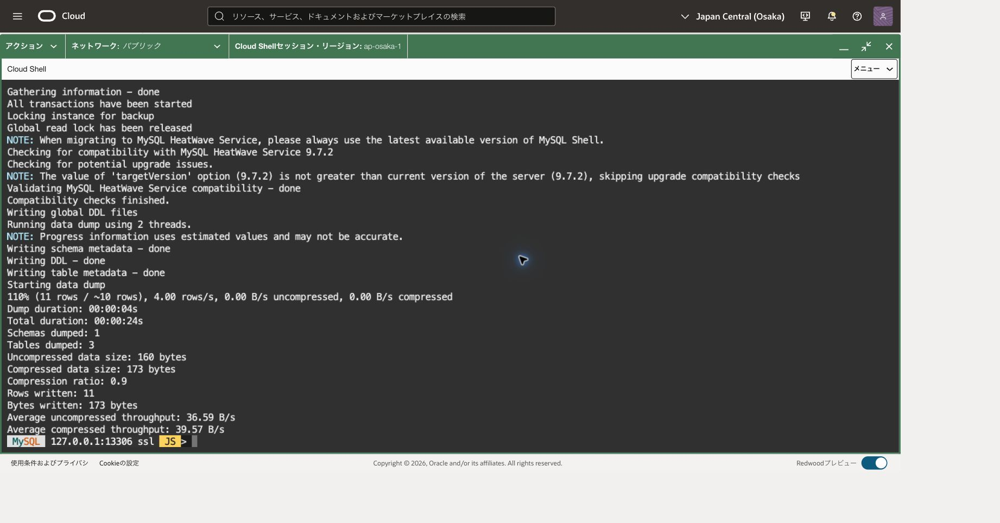

完了結果は1スキーマ・3表・11行です。進捗の110%は推定行数10行と実際の11行との差による表示で、コピー件数は完了結果で確認します。

dump GTIDは全ソースの履歴です。このschemaのコピーだけで全データを複製したとは判断しません。[dump仕様](https://dev.mysql.com/doc/mysql-shell/26.7/en/mysql-shell-utilities-dump-instance-schema.html)

```javascript
(function () {
connectChecked(13310, targetUuid);
if (session.runSql('SELECT @@server_uuid').fetchOne()[0] !== targetUuid) throw new Error('Wrong target');
var overlap = session.runSql('SELECT GTID_SUBTRACT(?, GTID_SUBTRACT(?, @@GLOBAL.gtid_executed))',[dumpGtid,dumpGtid]).fetchOne()[0];
if (overlap !== '') throw new Error('GTIDs overlap; do not reload');
if (!os.path.isfile(dumpPath + '/@.done.json')) throw new Error('Dump incomplete');
if (os.path.isfile(dumpPath + '/load-progress.' + targetUuid + '.json')) throw new Error('Use recovery table');
if (Number(session.runSql("SELECT COUNT(*) FROM information_schema.SCHEMATA WHERE SCHEMA_NAME='mhw_learning'").fetchOne()[0]) !== 0) throw new Error('Target not empty');
util.loadDump(dumpPath, {threads:2,updateGtidSet:'append',progressFile:dumpPath + '/load-progress.' + targetUuid + '.json',dryRun:true});
})();
```

検査が成功した場合だけ本ロードします。

```javascript
(function () {
connectChecked(13310, targetUuid);
if (!os.path.isfile(dumpPath + '/@.done.json')) throw new Error('Dump incomplete');
if (os.path.isfile(dumpPath + '/load-progress.' + targetUuid + '.json')) throw new Error('Use recovery table');
if (Number(session.runSql("SELECT COUNT(*) FROM information_schema.SCHEMATA WHERE SCHEMA_NAME='mhw_learning'").fetchOne()[0]) !== 0) throw new Error('Target not empty');
var executed = session.runSql('SELECT @@GLOBAL.gtid_executed').fetchOne()[0];
if (executed !== '') throw new Error('Unexpected GTID; use recovery table');
util.loadDump(dumpPath, {threads:2,updateGtidSet:'append',progressFile:dumpPath + '/load-progress.' + targetUuid + '.json'});
})();
var copied = session.runSql('SELECT GTID_SUBSET(?,@@GLOBAL.gtid_executed)',[dumpGtid]).fetchOne()[0];
if (Number(copied) !== 1) throw new Error('Initial GTID not applied');
print('INITIAL_GTID_PASS');
```

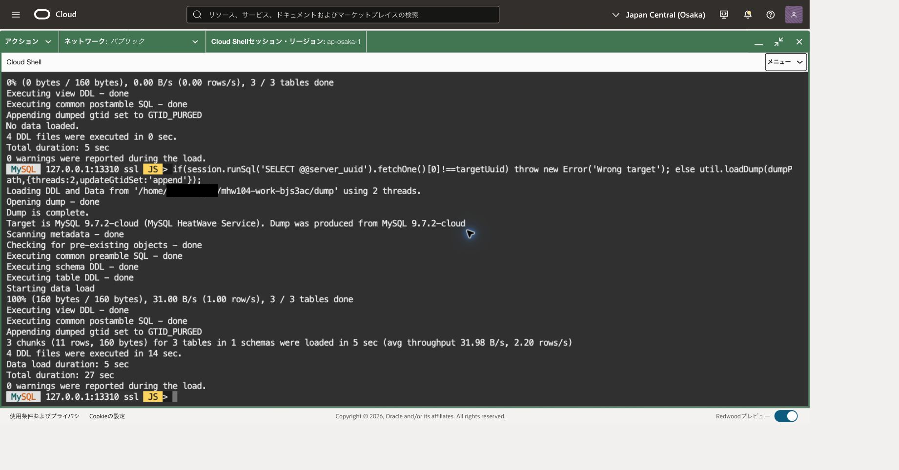

画面下部の本ロードは11行・3表・1スキーマ、警告0件で完了しています。上端に残る前の処理の「No data loaded」と区別して確認してください。

`append`は既存集合との非重複が必要です。エラー時に `replace` や `ignoreVersion` へ変更して通過させません。失敗時の進捗ファイルを残し、完了状況を確認してから再開します。HAが有効な宛先にはこの手順を適用しません。[loadDumpとGTID](https://dev.mysql.com/doc/mysql-shell/26.7/en/mysql-shell-utilities-load-dump.html)

`\sql` で件数、集計、チェックポイントを確認します。

```sql
SELECT (SELECT COUNT(*) FROM mhw_learning.items) AS items,
       COUNT(*) AS loans,SUM(fee_cents) AS fee_cents FROM mhw_learning.loans;
SELECT checkpoint_id,note FROM mhw_learning.checkpoints ORDER BY checkpoint_id;
```

items=3、loans=4、fee_cents=6000とソースのマーカー一覧が一致したら、初期コピーは完了です。宛先へ追加の業務データを書き込まないでください。

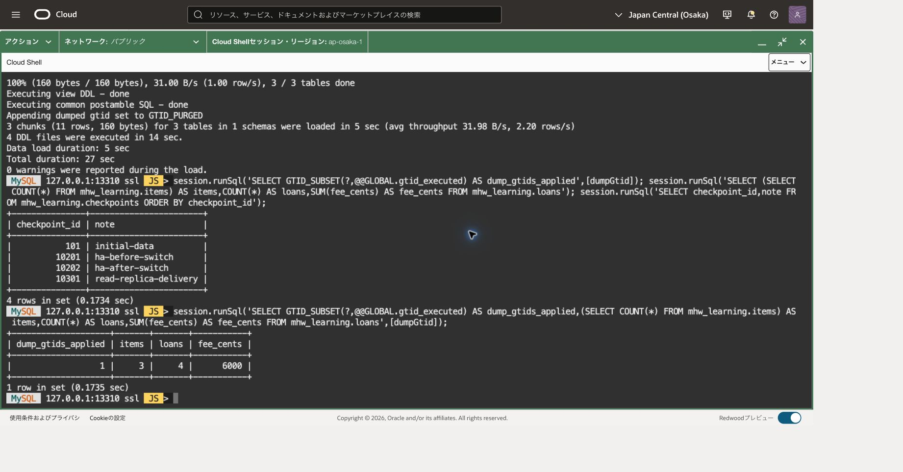

## 5. チャネルを作成して継続同期する

宛先DBのConsoleで **Create channel** を選びます。

|項目|設定|
|---|---|
|表示名|mhw-tutorial-channel|
|ソースhost／port|主DBのprivate IPv4／3306|
|ソース認証|tutorial_repl104／設定した専用パスワード|
|SSL mode|REQUIRED|
|GTID位置指定|ソースGTIDを利用する自動位置指定|
|Target DB|mhw-tutorial-channel-target|
|内部channel名|replication_channel（表示名とは別）|
|Applier／遅延／有効化|既定値／0秒／有効|
|Filter type|REPLICATE_WILD_DO_TABLE|
|Filter value|`mhw\_learning.%`|

Consoleに入力するフィルターのバックスラッシュは1個です。`_` を文字として扱い、末尾 `%` は表名全体に一致させます。追加のincludeルールは入れません。[チャネル作成とフィルター](https://docs.oracle.com/en-us/iaas/mysql-database/doc/creating-replication-channel.html)

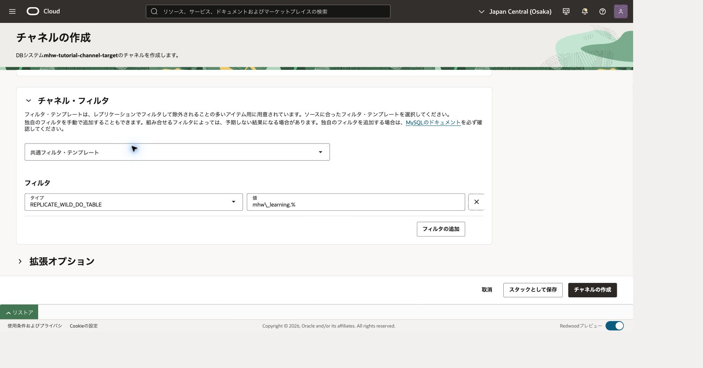

作成の受付と完了を区別し、ACTIVEと作業リクエスト成功を確認します。この表示だけではデータ到達を証明していないため、次で実データを検査します。

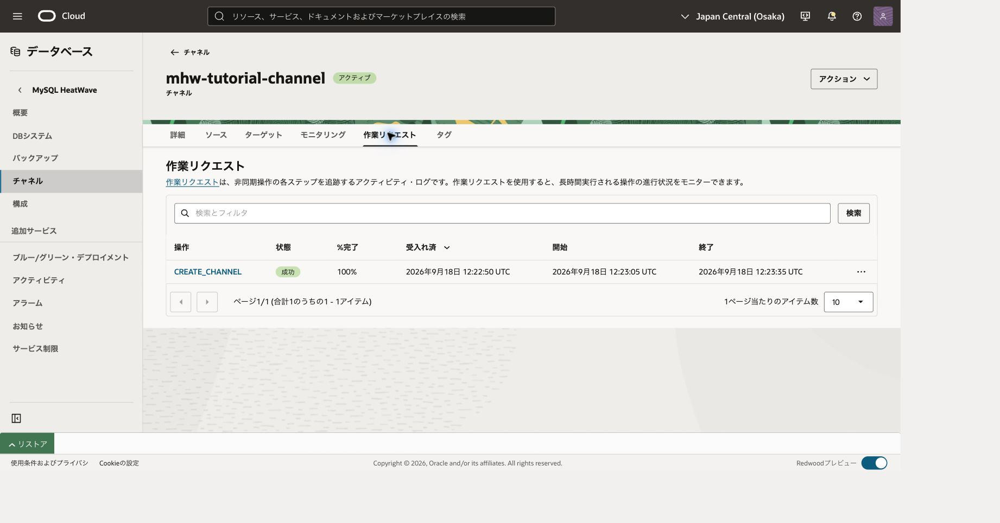

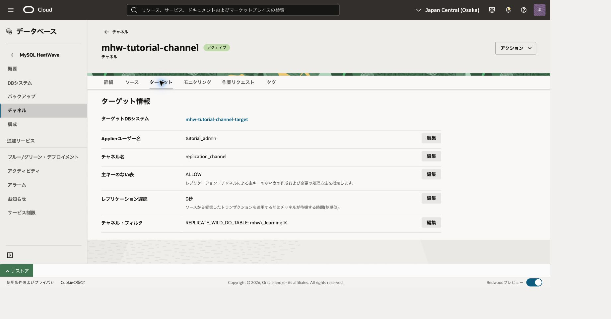

設定した宛先とフィルターを確認します。遅延0秒は設定値で、実測遅延ゼロではありません。

JSの補助関数はソースUUIDとID不在を検査し、INSERT成功時だけCOMMITします。失敗・応答不明なら再送せずソースを読みます。10401を1回登録します。

```text
\js
insertCheckpoint104(10401,'channel-live');
```

成功後、確定したGTIDを宛先で待ちます。

```javascript
(function () {
liveBarrier = session.runSql('SELECT @@GLOBAL.gtid_executed').fetchOne()[0];
connectChecked(13310, targetUuid);
var liveWait = session.runSql('SELECT WAIT_FOR_EXECUTED_GTID_SET(?,30)',[liveBarrier]).fetchOne()[0];
if (Number(liveWait) !== 0) throw new Error('GTID not reached; inspect channel');
})();
```

`\sql` で到達内容を確認します。

```sql
SELECT checkpoint_id,note FROM mhw_learning.checkpoints WHERE checkpoint_id=10401;
```

期待値は `10401 / channel-live` です。タイムアウトの場合はINSERTを再送せず、チャネルの接続/TLS/ユーザー/フィルター/エラーを確認します。

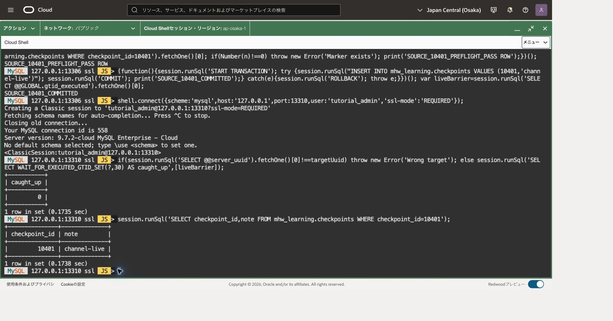

## 6. 停止中の変更と再開を確認する

Consoleでこのチャネルを無効化します。無効状態と作業リクエスト完了を確認してから、新しい変更を作ります。DB自体は停止しません。

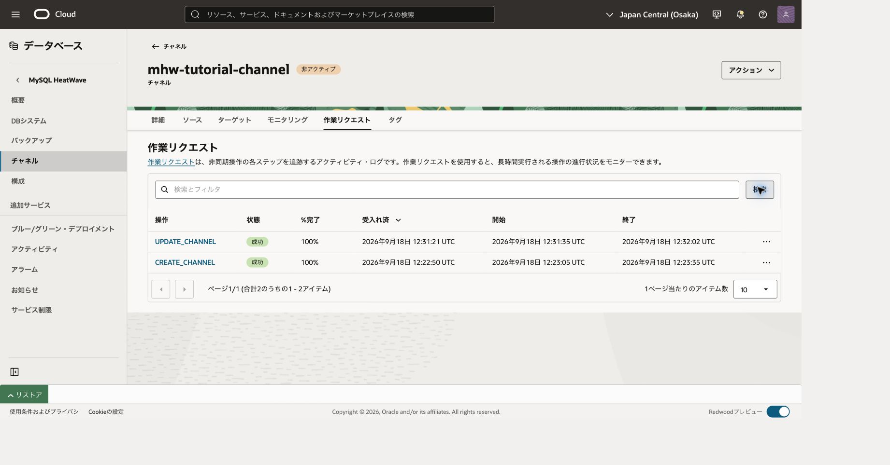

同じ不在・成功時COMMITの補助関数で10402を1回登録します。失敗時はここで停止します。

```text
\js
insertCheckpoint104(10402,'channel-resume');
```

成功後、停止中の宛先を調べます。

```javascript
(function () {
resumeBarrier = session.runSql('SELECT @@GLOBAL.gtid_executed').fetchOne()[0];
connectChecked(13310, targetUuid);
})();
```

`\sql` で次を確認します。

```sql
SELECT checkpoint_id,note FROM mhw_learning.checkpoints WHERE checkpoint_id=10402;
```

0行を確認します。Consoleで同じチャネルを有効に戻し、ACTIVEと作業リクエスト完了を待ちます。`\js` で宛先の同期を確認します。

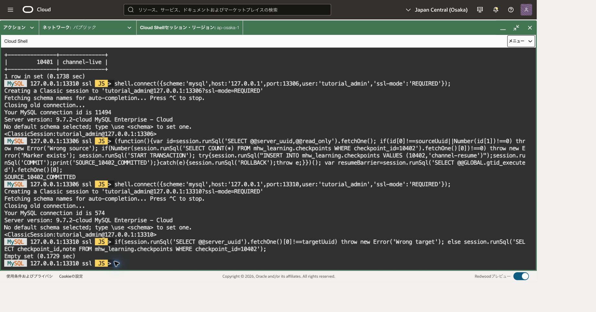

```javascript
var resumeWait = session.runSql('SELECT WAIT_FOR_EXECUTED_GTID_SET(?,30)',[resumeBarrier]).fetchOne()[0];
if (Number(resumeWait) !== 0) throw new Error('Resume GTID not reached');
```

`\sql` に戻り、同じSELECTを実行して `10402 / channel-resume` を確認します。停止時の0行と再開後の1行の両方を記録してください。

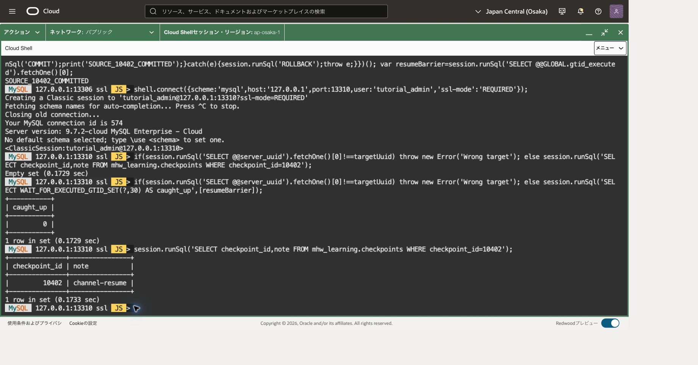

## 7. フィルターを実データで検証する

対象外のスキーマに表を作り、対象内にも新しいマーカーを登録します。ソースへ戻ります。

```text
\js
connectChecked(13306, sourceUuid);
\sql
SELECT SCHEMA_NAME FROM information_schema.SCHEMATA WHERE SCHEMA_NAME='mhw_excluded';
```

0行の場合だけ作成します。次のDDLは暗黙COMMITを伴い、ROLLBACKで取り消せません。

```sql
CREATE DATABASE mhw_excluded;
```

作成成功を確認して次へ進みます。

```sql
CREATE TABLE mhw_excluded.probe (id INT PRIMARY KEY,note VARCHAR(80) NOT NULL) ENGINE=InnoDB;
```

表の作成成功後、次の不在確認を行います。

```sql
SELECT checkpoint_id FROM mhw_learning.checkpoints WHERE checkpoint_id=10403;
```

0行の場合だけ次へ進みます。既存行があれば更新を再送せず前回状態を確認します。

```sql
START TRANSACTION;
INSERT INTO mhw_excluded.probe VALUES (1,'must-not-arrive');
INSERT INTO mhw_learning.checkpoints VALUES (10403,'channel-filter');
```

直前の変更がすべて成功した場合だけ確定します。エラーがあればCOMMITせずROLLBACKします。

```sql
COMMIT;
```

各不在確認が0行の場合だけ次へ進みます。DDLには暗黙COMMITがあるため、失敗したら残存オブジェクトを調べます。`\js` へ戻り、全操作後の境界を宛先で待ちます。

```javascript
(function () {
filterBarrier = session.runSql('SELECT @@GLOBAL.gtid_executed').fetchOne()[0];
connectChecked(13310, targetUuid);
var filterWait = session.runSql('SELECT WAIT_FOR_EXECUTED_GTID_SET(?,30)',[filterBarrier]).fetchOne()[0];
if (Number(filterWait) !== 0) throw new Error('Filter boundary not reached');
})();
```

`\sql` で最終確認します。

```sql
SELECT checkpoint_id,note FROM mhw_learning.checkpoints WHERE checkpoint_id=10403;
SELECT SCHEMA_NAME FROM information_schema.SCHEMATA WHERE SCHEMA_NAME='mhw_excluded';
SELECT TABLE_SCHEMA,TABLE_NAME FROM information_schema.TABLES
WHERE TABLE_SCHEMA='mhw_excluded';
SELECT COUNT(*) AS loans,SUM(fee_cents) AS fee_cents FROM mhw_learning.loans;
```

10403が1行、対象外スキーマ・表が0行、loans=4/fee_cents=6000なら合格です。GTID到達は「全データをコピーした」という意味ではありません。フィルターで除外したトランザクションも処理済み履歴に反映されます。

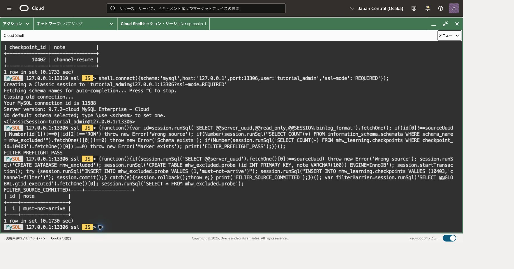

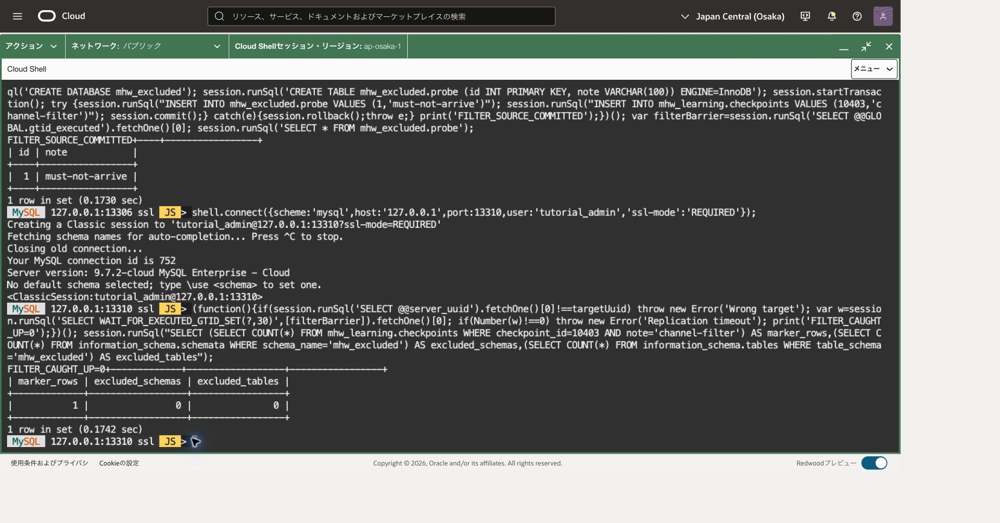

## 8. この章だけの資源を片付ける

1. 記録したOCIDでチャネルを照合し、無効化→削除→削除完了の順に確認します。
2. 宛先DBがこの章の専用DBであることを再確認し、backup一覧と削除設定を確認して削除します。最終backupを作らない設定でも、既存backupがあれば別に残存を確認します。
3. ソースへ接続して、この章の専用レプリケーションユーザーと対象外スキーマだけを削除します。実行前に対象を確認し、下の宛先IPを作成時の値に置き換えます。

```sql
SELECT User,Host FROM mysql.user WHERE User='tutorial_repl104';
```

削除前に `\js` で `connectChecked(13306, sourceUuid);` を実行し、成功後に `\sql` へ戻って上のアカウント照会をもう一度行います。表示が今回作成した単一Hostに一致し、専用スキーマも自分の作成物である場合だけ次を実行します。

```sql
DROP USER 'tutorial_repl104'@'TARGET_PRIVATE_IPV4';
DROP DATABASE mhw_excluded;
```

削除要求の結果を確認してから、次の読取りで残存を確認します。結果不明の場合も削除を再送せず読取りから再開します。

```sql
SELECT User,Host FROM mysql.user WHERE User='tutorial_repl104';
SELECT SCHEMA_NAME FROM information_schema.SCHEMATA WHERE SCHEMA_NAME='mhw_excluded';
```

`mhw_learning` と主DBは削除しません。104のマーカーも検証履歴として残します。

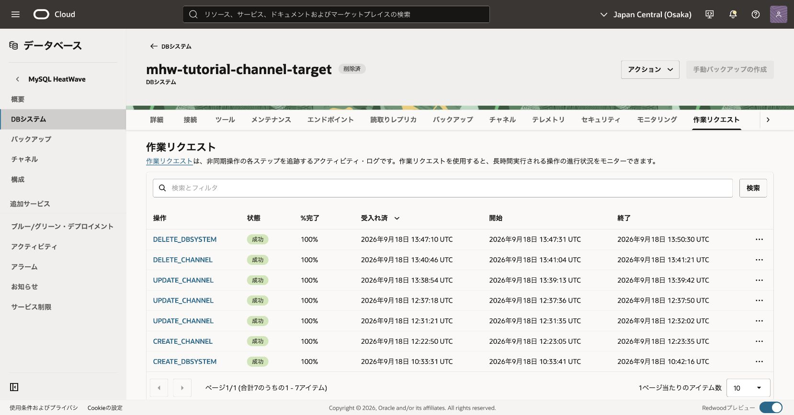

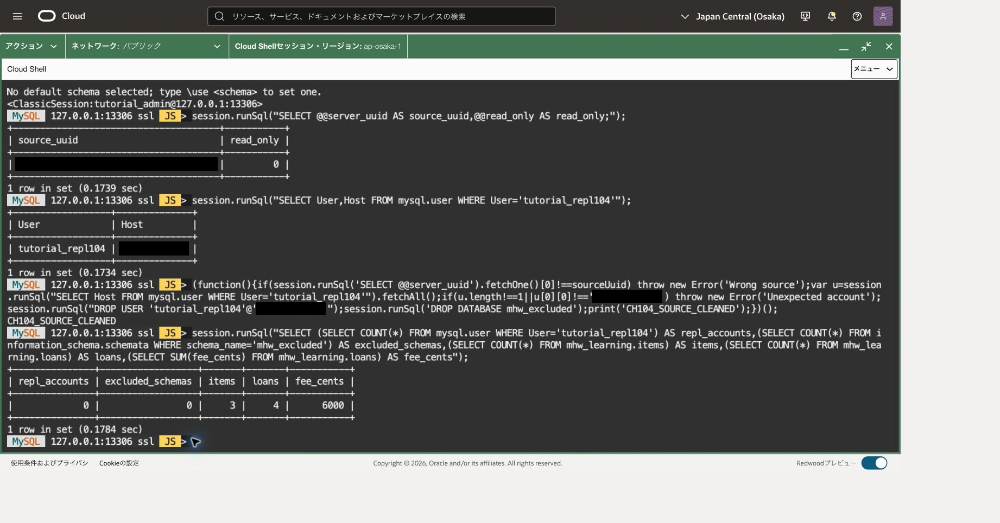

mysqlshを `\quit` で終了し、宛先転送専用タブでCtrl+Cを押します。主DB用タブは後続章で使う場合だけ保持します。OSで待受消失と削除対象を確認します。

```bash
ss -ltn 'sport = :13310'
printf '%s\n' "$HOME/mhw104-work"
find "$HOME/mhw104-work" -maxdepth 2 -type f -print
```

必要な記録を残し、この章専用と照合した固定領域だけを削除します。

```bash
rm -ri -- "$HOME/mhw104-work"
```

保存した宛先認証は[106章](../106-monitor-cleanup/)の方法で`tutorial_admin@127.0.0.1:13310`だけを照合して削除します。主DB認証・共有SSH鍵・Compute・VCNは保持します。

## 中断したときの再開

OSで固定領域を確認し、手順3末尾のUUIDと関数も再設定します。dumpのパス・完了メタデータ・宛先UUID別進捗を確認します。未設定や不一致なら停止します。

```bash
test -d "$HOME/mhw104-work"
find "$HOME/mhw104-work/dump" -maxdepth 1 -type f -print
```

|状態|確認|続行方法|
|---|---|---|
|初回|完了dump、宛先schema・GTID・進捗がない|手順4の初回検査、dry run、本ロード|
|dump未完|`@.done.json` がない|ロードしない。失敗ファイルを保持し、失敗領域を保全・改名してから、空の固定作業領域でdumpし直す|
|load途中|同一dumpが完了、同一宛先UUIDの進捗あり、部分オブジェクトあり|以下のresumeだけを実行|
|load完了|dump GTIDが実行済み集合に含まれ、3/4/6000とマーカーが一致|appendを再実行せず手順5へ|
|不整合|進捗紛失、別dump・別宛先、由来不明のschema/GTID|停止して調査。resetProgressやignoreExistingObjectsで押し通さない|

途中のロードだけは、同じdumpと同じ進捗で再開します。**初回の非重複条件を途中・完了済みに適用しません。** JSモードで、確認と処理を一つのブロックとして実行します。

```javascript
(function () {
connectChecked(13310, targetUuid);
if (!os.path.isfile(dumpPath + '/@.done.json')) throw new Error('Dump incomplete');
if (!os.path.isfile(dumpPath + '/load-progress.' + targetUuid + '.json')) throw new Error('Progress missing');
util.loadDump(dumpPath, {threads:2,updateGtidSet:'append',
  progressFile:dumpPath + '/load-progress.' + targetUuid + '.json'});
})();
```

10401〜10403の結果不明時は、ソースの該当行をSELECTします。行が正しい内容で確定済みならINSERTを再送しません。到達待ち変数を失った場合に限り、演習中に他の書込みがなかったことを確認して現在のソースGTIDを新しい境界にできます。並行更新があった場合は停止します。各試験の既存「GTID取得→宛先待機」ブロックから再開します。INSERTは再実行しません。

宛先へ切り替えて対応するWAIT処理から続けます。10403は必ず境界到達0を確認してから、対象外schema/tableが存在しないことを確認します。中断前の結果ではなく、再開後に実行したSELECTの結果で判断してください。

未確定のSQL変更が失敗した場合は同じ接続でROLLBACKします。DDLや確定済み変更は戻りません。

```sql
ROLLBACK;
```

## 章の移動

[前章](../103-read-replicas/) · [次章](../105-backup-restore/)
