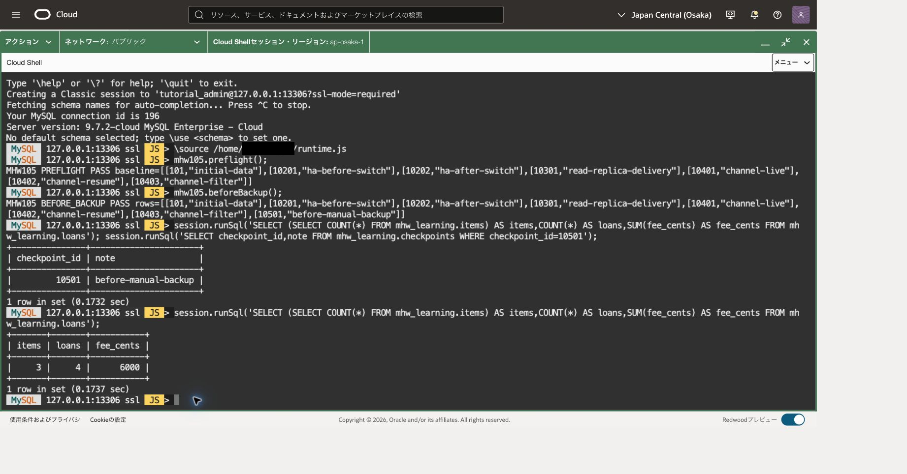
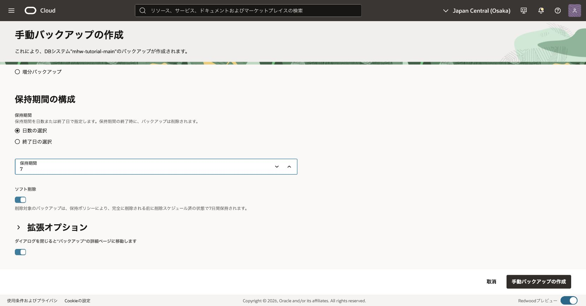
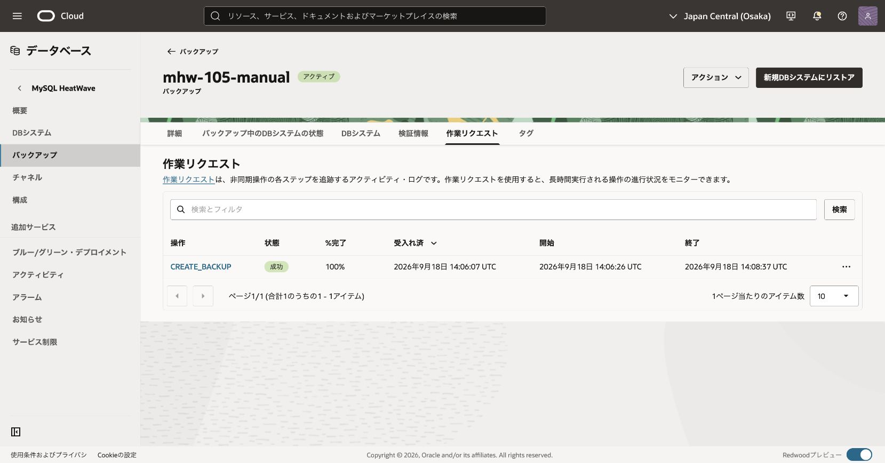
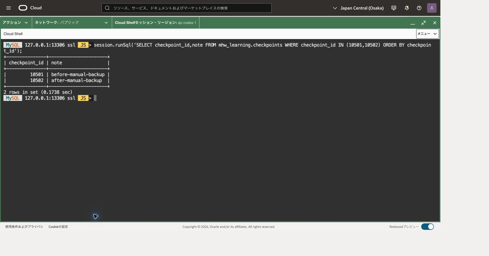
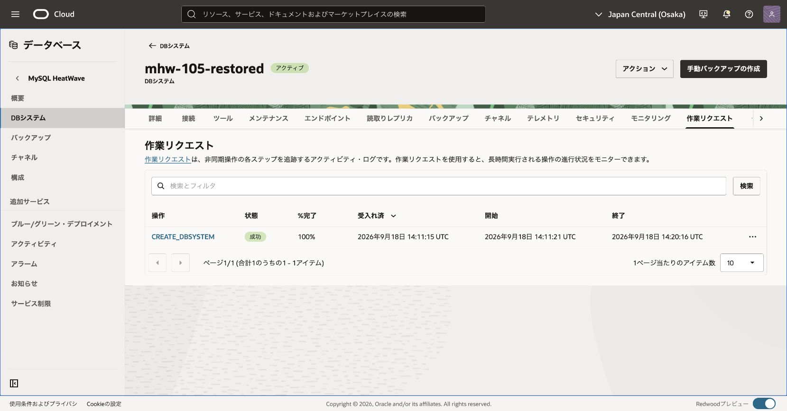
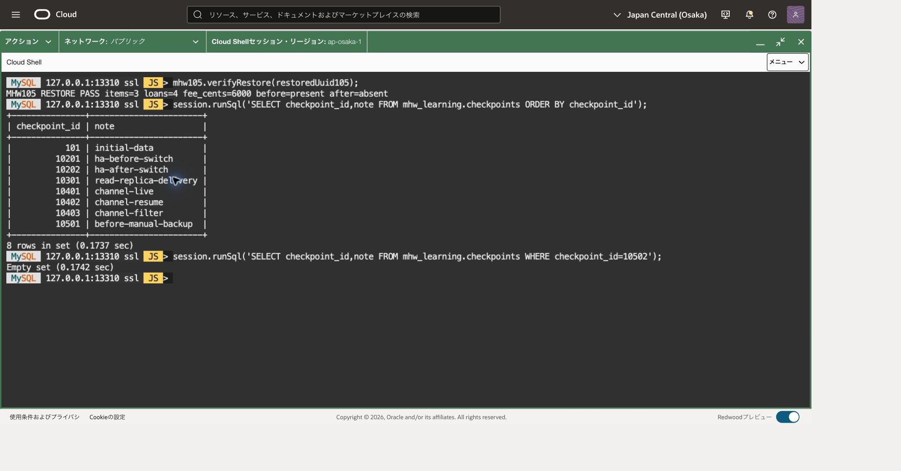
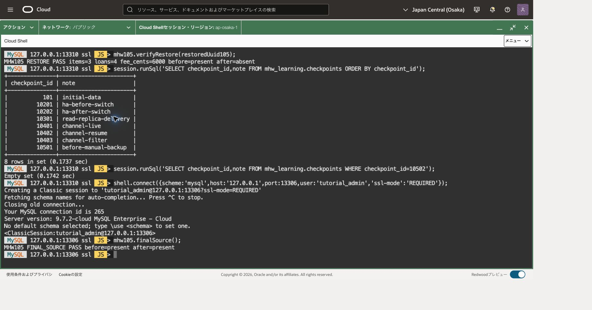

バックアップを取得するだけでなく、別DBへ復元してデータを読めることまで確認します。元の主DBを上書きする演習ではありません。所要時間は45〜75分とバックアップ・復元の処理待ちが目安です。

## 前提と費用

101〜104を終え、104の専用宛先とチャネルを整理した主DBを使います。`mhw_learning`はitems3件、loans4件、fee_cents合計6000を保持し、checkpointsには実施した章の記録が残っていることを確認します。MySQL 9.7 LTS/MySQL.8を維持し、HeatWaveクラスタはまだ追加しません。

101のDB管理IAMとサブネット利用権限、およびバックアップ作成・復元・削除の権限が必要です。SQLには教材表のSELECT/INSERT権限が必要です。バックアップ保存量・保持期間と、復元DBの計算資源・ストレージに費用が発生します。取得前に通貨・契約単価・保持期間を確認してください。

元DB・バックアップ・復元DBの名前とOCIDを別々に記録します。復元DBには新しいIPを使い、元DBを削除してIPを空ける操作は行いません。

## 接続の再開（Cloud Shell）

101の終了時には転送を閉じています。Cloud Shellで101と同じネットワーク経路を選び、OSプロンプトで次を再設定します。値は今回の主DBとComputeの記録から置き換えてください。ファイルが残っていても変数やプロセスが残っているとは限りません。

```bash
# 目的: 導入済みCommunity版と検証済みホスト鍵、今回の接続先を再設定する。
MHW_SHELL="$HOME/mysql-shell-community-26.7.1-el8/usr/bin/mysqlsh"
MHW_KNOWN_HOSTS="$HOME/.ssh/mhw-learning-known-hosts"
MHW_KEY="$HOME/.ssh/mhw-learning.key"
MHW_COMPUTE_IP='COMPUTE_PUBLIC_IP'
MHW_OS_USER='opc'
MHW_DB_IP='CURRENT_MAIN_DB_PRIVATE_IP'
MHW_ADMIN='tutorial_admin'
# 目的: 実行ファイルと鍵関連ファイルの存在を確認する。
if test -x "$MHW_SHELL" && test -s "$MHW_KNOWN_HOSTS" && test -f "$MHW_KEY"; then
  printf '%s\n' '前提ファイル: OK'
else
  printf '%s\n' '前提ファイル: NG。ここで止め、101章の準備を確認してください。'
fi
```

成功した場合だけ進みます。不足していれば[101](../101-create-connect/)の導入・ホスト鍵検証へ戻ります。ホスト鍵検証を無効化しません。新しいCloud Shell端末を開いた場合も、この変数設定を行ってください。

```bash
# 目的: 主DB用の既存待受を確認する。LISTEN行がある場合は新規起動しない。
ss -ltn 'sport = :13306'
```

LISTEN行がある場合は、今回の主DB用として記録した制御ソケットの絶対パスを次の変数へ戻します。パスの記録がない、または用途が分からない場合はここで止め、既存転送の対象を確認します。別プロセスの終了や新規起動は行いません。

```bash
# 目的: 記録済みの主DB用ソケットを新しい端末へ引き継ぐ。
MHW_SOCKET='/tmp/mhw-tunnel-RECORDED/control'
# 目的: ソケットの存在と制御接続を確認する。失敗した場合は再利用しない。
test -S "$MHW_SOCKET" && ssh -F /dev/null -S "$MHW_SOCKET" -O check "$MHW_OS_USER@$MHW_COMPUTE_IP"
```

成功し、記録した転送先が現在の主DBであることを照合できた場合は、新規起動の枠を飛ばして、その下の確認・SQL接続へ進みます。SQL接続後にもUUIDを照合します。

LISTEN行がない場合だけ、次の枠で新規起動します。

```bash
# 目的: 専用ソケットで主DBへ転送だけを開始する。
MHW_TUNNEL_DIR=$(mktemp -d /tmp/mhw-tunnel-XXXXXX)
MHW_SOCKET="$MHW_TUNNEL_DIR/control"
ssh -F /dev/null -4 -fN -T -M -S "$MHW_SOCKET" \
 -o StrictHostKeyChecking=yes -o UserKnownHostsFile="$MHW_KNOWN_HOSTS" \
 -o IdentitiesOnly=yes -o ForwardAgent=no -o ExitOnForwardFailure=yes \
 -o ConnectTimeout=10 -o ServerAliveInterval=30 -o ServerAliveCountMax=3 \
 -i "$MHW_KEY" -L "127.0.0.1:13306:$MHW_DB_IP:3306" \
 "$MHW_OS_USER@$MHW_COMPUTE_IP"
```

秘密鍵のパスフレーズが必要な場合は非表示入力に入力します。起動に成功してから、制御ソケットのパスを記録し、次を確認します。

```bash
# 目的: 転送プロセスとloopback待受を照合する。DBへの接続成功は後で確認する。
printf 'MHW_SOCKET=%s\n' "$MHW_SOCKET"
ssh -F /dev/null -S "$MHW_SOCKET" -O check "$MHW_OS_USER@$MHW_COMPUTE_IP"
ss -ltn 'sport = :13306'
# 目的: Community版から主DBへClassic protocolとTLSで接続する。
"$MHW_SHELL" --mysql --sql --host=127.0.0.1 --port=13306 --user="$MHW_ADMIN" \
  --ssl-mode=REQUIRED --password
```

パスワード値を引数へ付けません。後のOSコマンドを実行するときは、まずMySQL Shellで `\quit` を実行してください。再開したソケットはこの章だけでなく後続章でも対象を確認して再利用できます。

## 1. バックアップ前の基準を確定する

実行場所：Cloud ShellのMySQL Shell、主DBのSQLモード。101の転送13306を使い、記録済みの接続先と照合します。

```sql
-- 目的: バックアップ元のUUIDと書込み状態を照合する。
SELECT @@server_uuid AS server_uuid,VERSION() AS server_version,
       @@read_only AS read_only,@@super_read_only AS super_read_only\G
-- 目的: 主DBの接続がTLS暗号化されていることを確認する。
SHOW SESSION STATUS LIKE 'Ssl_cipher';
-- 目的: 復元比較用の件数と金額を記録する。
SELECT (SELECT COUNT(*) FROM mhw_learning.items) AS items_count,
       COUNT(*) AS loans_count,SUM(fee_cents) AS total_fee_cents FROM mhw_learning.loans;
-- 目的: 既存章の全マーカーを保存し、105のIDが未使用であることを確認する。
SELECT checkpoint_id,note FROM mhw_learning.checkpoints ORDER BY checkpoint_id;
```

正しい主DB、両read_only値0、非空cipher、基準3/4/6000を確認します。10501・10502が存在する場合は再登録せず前回状態を調べます。両IDがない場合だけ次を順に実行します。

次の存在確認だけを先に実行し、0行だった場合に限って下のトランザクションへ進みます。接続先や条件が違った場合は、同じ貼付け操作で後続のINSERTまで実行しないでください。

~~~sql
-- 目的: 前後両マーカーが未使用であることを、変更前に明示的に検査する。
SELECT checkpoint_id,note FROM mhw_learning.checkpoints
WHERE checkpoint_id IN (10501,10502) ORDER BY checkpoint_id;
~~~

```sql
-- 目的: バックアップ前マーカーを1つの確定単位で登録する。
START TRANSACTION;
-- 目的: バックアップへ含める確認点を追加する。
INSERT INTO mhw_learning.checkpoints VALUES(10501,'before-manual-backup');
```

直前の変更がすべて成功した場合だけ確定します。エラーがあればCOMMITせずROLLBACKします。

```sql
-- 目的: バックアップ開始前に変更を確定する。
COMMIT;
```

確定後に次の読取りで照合します。応答不明なら再接続して読取りだけを実行します。

```sql
-- 目的: 確定済みの内容をバックアップ比較基準として記録する。
SELECT checkpoint_id,note FROM mhw_learning.checkpoints ORDER BY checkpoint_id;
```

各文の成功を確認し、失敗後に次へ進みません。COMMITの結果が不明ならSELECTで照合し、INSERTを再送しません。ここからバックアップ完了まで、ほかの教材データ更新は行わないでください。



## 2. 専用の手動バックアップを取得する

OCIコンソールで元DB詳細からCreate manual backupを選びます。名前例は`mhw-105-manual`、Backup typeはFullとし、演習に必要な保持日数とSoft delete設定を明示して作成します。既定の保持期間をそのまま採用せず、復元完了まで失効しない期間を設定してください。

この例では保持7日、ソフト削除を有効にしています。ソフト削除が有効なバックアップは、削除を要求しても直ちに完全消去されず、削除スケジュール済みの状態で7日間保持されます。第106章で残存状態と期限を確認します。



バックアップがACTIVE、作業が成功し、対象の元DB OCIDと版・作成時刻・保持期限が一致することを確認します。作成中のUPDATINGは完了ではありません。[手動バックアップの作成](https://docs.oracle.com/en-us/iaas/mysql-database/doc/creating-manual-backup.html)

10501はこのバックアップに含め、10502は含めないため、次の更新はバックアップの完了後に行います。開始要求の受付だけでは先へ進みません。



完了後、主DBでバックアップに含まれないマーカーを追加します。待機中に接続が切れた場合は13306へ接続し直します。まず次の読取りで現在の接続先を再確認してください。

```sql
-- 目的: バックアップ待機後も変更先が記録済みの主DBであることを確認する。
SELECT @@server_uuid AS server_uuid,
       @@read_only AS read_only,@@super_read_only AS super_read_only\G
-- 目的: 現在の主DB接続のTLSを再確認する。
SHOW SESSION STATUS LIKE 'Ssl_cipher';
```

手順1の主DB UUIDと一致し、両read_only値0、非空cipherの場合だけ進みます。接続エラーや想定外の値なら変更せず、接続先を確認します。続いて10502の不在を単独で確認します。

```sql
-- 目的: バックアップ後マーカーを重複登録しない。
SELECT checkpoint_id,note FROM mhw_learning.checkpoints WHERE checkpoint_id=10502;
```

0行のときだけ実行します。

```sql
-- 目的: バックアップ後の更新を1つの確定単位にする。
START TRANSACTION;
-- 目的: 復元時点との差を確認するマーカーを主DBだけに追加する。
INSERT INTO mhw_learning.checkpoints VALUES(10502,'after-manual-backup');
```

直前の変更がすべて成功した場合だけ確定します。エラーがあればCOMMITせずROLLBACKします。

```sql
-- 目的: バックアップ完了後の更新を確定する。
COMMIT;
```

確定後に次の読取りで照合します。応答不明なら再接続して読取りだけを実行します。

```sql
-- 目的: 主DBには前後両マーカーが存在することを確認する。
SELECT checkpoint_id,note FROM mhw_learning.checkpoints WHERE checkpoint_id IN (10501,10502) ORDER BY checkpoint_id;
```

## 3. 別DBへ復元する



この時点の主DBには10501と10502の両方があります。これから作る復元DBには10501だけが含まれることを確認します。

Backups一覧から今回のバックアップOCIDを開き、Restore to new DB systemを選びます。名前例`mhw-105-restored`、大阪の同じ演習区画、専用の新IP、Standalone、MySQL.8、元と同じ9.7パッチを選びます。容量・拡張上限、バックアップと削除計画も確認します。復元元バックアップを取り違えないでください。

復元DBはバックアップ時点の管理者資格情報を継承するため、その時点のユーザー名とパスワードで接続します。新しいパスワードの設定や元DBの認証変更は不要です。復元時にアップグレードを同時実施せず、元と同じ版が選べない場合は適用版と影響を確認してから進みます。ACTIVEと作業成功後、新しいOCID・IPを記録します。[バックアップからの復元](https://docs.oracle.com/en-us/iaas/mysql-database/doc/restoring-from-backup.html)

元DBが残っているため、フォームには元のIP・ポート値を削除した旨の警告が表示されます。元DBを削除する必要はありません。IPは空欄のまま自動割当とし、拡張オプションの「接続」でデータベース・ポートに`3306`、Xプロトコル・ポートに`33060`を指定します。復元専用DBの自動バックアップ、最終バックアップ、自動バックアップ保持は無効にし、元DBの設定は変更しません。

## 4. 復元内容を照合する



Cloud Shellで101と同じ鍵・ホスト鍵確認を使い、復元専用の転送を開始します。13310が空いていることを確認し、山括弧を実値へ置き換えます。既存の13306は元DBのまま保持します。

```bash
ssh -F /dev/null -4 -N -T -o ConnectTimeout=10 -o IdentitiesOnly=yes \
  -o UserKnownHostsFile="$MHW_KNOWN_HOSTS" -o ExitOnForwardFailure=yes \
  -o StrictHostKeyChecking=yes -o ForwardAgent=no -i "$MHW_KEY" \
  -L '127.0.0.1:13310:<復元DBのprivate-IP>:3306' "$MHW_OS_USER@$MHW_COMPUTE_IP"
```

転送を起動した画面を **端末A（転送用）** として待機させます。別のCloud Shell端末を **端末B（SQL用）** とし、冒頭のMHW_SHELL等の変数設定だけを再実行してから接続します。転送の起動部分は繰り返しません。終了時は端末Bで `\quit`、端末AでCtrl+Cを実行して復元DB用転送だけを閉じます。パスワードは隠しプロンプトへ入力します。

```bash
"$MHW_SHELL" --mysql --sql --host=127.0.0.1 --port=13310 --user="$MHW_ADMIN" --ssl-mode=REQUIRED
```

実行場所：復元DB、SQLモード。転送先IPが復元DBのOCIDと対応することを照合し、UUIDをこの接続先の値として記録します。識別を名前だけに頼りません。

```sql
-- 目的: 復元先のUUIDと版を記録する。
SELECT @@server_uuid AS server_uuid,VERSION() AS server_version\G
-- 目的: 復元先へのTLS接続を確認する。
SHOW SESSION STATUS LIKE 'Ssl_cipher';
-- 目的: バックアップ時点の基準件数と金額を照合する。
SELECT (SELECT COUNT(*) FROM mhw_learning.items) AS items_count,
       COUNT(*) AS loans_count,SUM(fee_cents) AS total_fee_cents FROM mhw_learning.loans;
-- 目的: バックアップ前に記録した全マーカーと比較する。
SELECT checkpoint_id,note FROM mhw_learning.checkpoints ORDER BY checkpoint_id;
-- 目的: バックアップ完了後の更新がこの復元には含まれないことを確認する。
SELECT checkpoint_id,note FROM mhw_learning.checkpoints WHERE checkpoint_id=10502;
```

非空cipher、基準3/4/6000、取得前の全マーカーと10501の一致、10502が0行であることが期待値です。10502まで復元されていれば、別のバックアップや接続先を選んでいないか調べます。復元先へ不足行をINSERTして結果を合わせてはいけません。この手順は特定時刻へのPITRではなく、選んだ手動バックアップからの復元です。

前後の差を確認する照会も、復元DBのSQLモードで実行します。

~~~sql
-- 目的: 選んだバックアップに含まれる境界だけが復元されたことを確認する。
SELECT checkpoint_id,note FROM mhw_learning.checkpoints
WHERE checkpoint_id IN (10501,10502) ORDER BY checkpoint_id;
~~~

期待する結果は10501 / before-manual-backupの1行です。主DBでは同じ照会が前後2行になることと区別してください。



主DBへ戻ると、10501と10502の両方が残っています。復元操作は主DBのデータを過去へ戻す操作ではありません。



## 5. 専用の復元DBを削除する

照合が終わったら復元側のMySQL Shellを終了し、復元専用転送の端末でCtrl+Cを押します。OCIで復元DBのOCIDを照合してDeleteを選びます。削除計画の自動バックアップを残すか、最終バックアップを作るかを確認してから永久削除します。不要なコピーを残さない演習では、それぞれDelete/Skipを選ぶ方針を事前に決めます。元DBは対象にしません。

DELETEDと作業成功を確認し、復元DBに付随するバックアップの残存を確認します。手動バックアップはDB削除だけでは消えません。今回の元DBの手動バックアップは106の保持・削除一覧に引き継ぎます。[DB削除](https://docs.oracle.com/en-us/iaas/mysql-database/doc/deleting-db-system.html)

最後に13306の元DBへ接続し、手順1の識別・TLS・基準・全マーカーを再確認します。主DBには10501と10502の両方を残します。保存した復元DBのクライアント資格情報は、その接続URLだけを後片付け対象とし、共有資格情報を一括削除しません。

## 失敗時のトランザクション取消

INSERT等のエラーがあり、同じ接続で未確定の変更が残っている場合だけ実行します。DDLや既に確定した変更は取り消せません。

```sql
-- 目的: 失敗した未確定DMLを取り消し、状態確認から再開する。
ROLLBACK;
```

## 章の移動

[前章](../104-replication-channel/) · [次章](../106-monitor-cleanup/)
