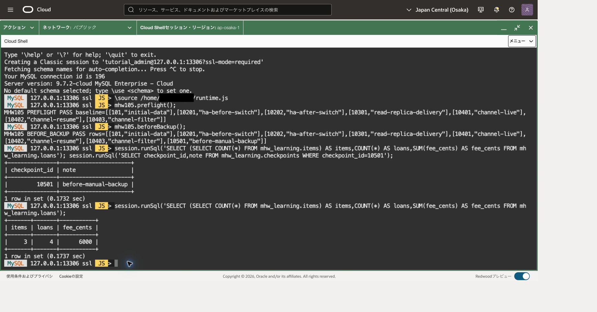
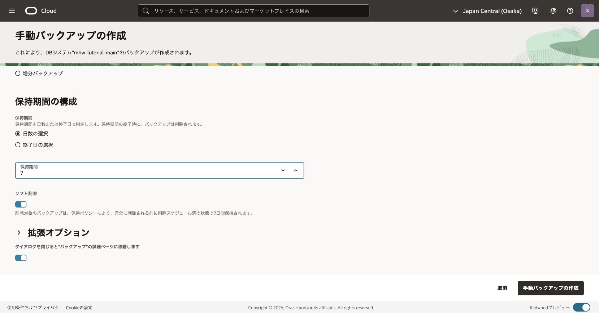
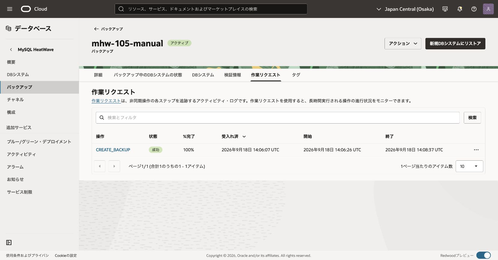
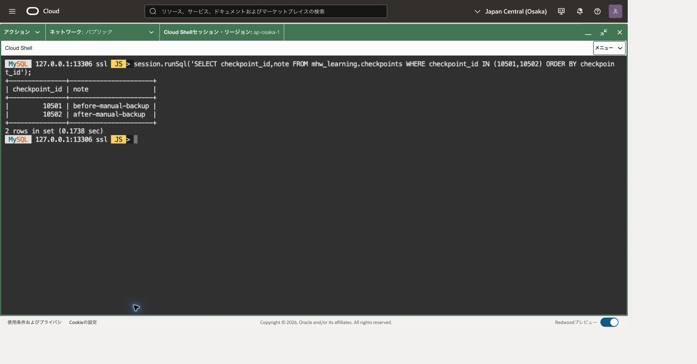
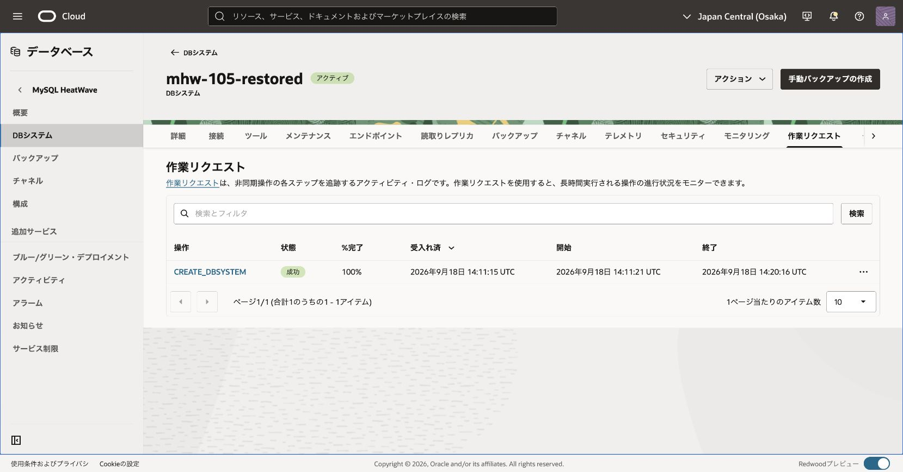
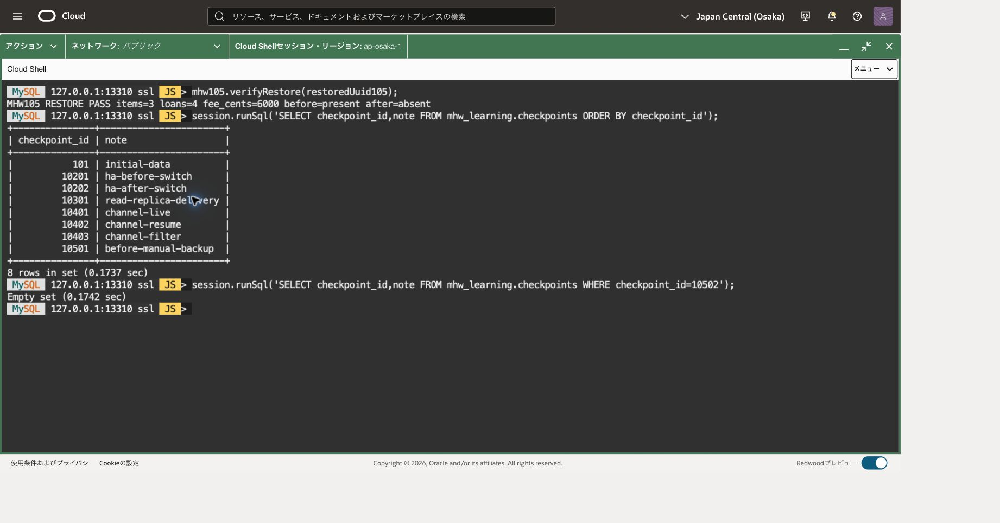
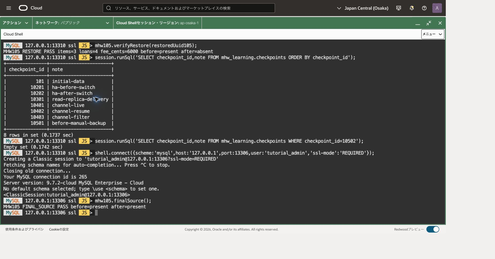

バックアップを取得するだけでなく、別DBへ復元してデータを読めることまで確認します。元の主DBを上書きする演習ではありません。所要時間は45〜75分とバックアップ・復元の処理待ちが目安です。

## 前提と費用

101〜104を終え、104の専用宛先とチャネルを整理した主DBを使います。`mhw_learning`はitems3件、loans4件、fee_cents合計6000を保持し、checkpointsには実施した章の記録が残っていることを確認します。MySQL 9.7 LTS/MySQL.2を維持し、HeatWaveクラスタはまだ追加しません。

101のDB管理IAMとサブネット利用権限、およびバックアップ作成・復元・削除の権限が必要です。SQLには教材表のSELECT/INSERT権限が必要です。バックアップ保存量・保持期間と、復元DBの計算資源・ストレージに費用が発生します。取得前に通貨・契約単価・保持期間を確認してください。

元DB・バックアップ・復元DBの名前とOCIDを別々に記録します。復元DBには新しいIPを使い、元DBを削除してIPを空ける操作は行いません。

## 接続を再開する場合だけ

同じ主DB接続が開いていれば再利用します。転送が閉じたら[101章](../101-create-connect/)の前面SSHを再開します。SQL用の別タブで次を実行します。`--mysql`はClassic protocol、`--sql`はSQLモード、`--ssl-mode=REQUIRED`はTLS必須を指定します。101章で保存した資格情報を使うため、通常はパスワードの再入力はありません。保存していない場合だけ末尾に `--password` を付け、非表示プロンプトへ入力します。

```bash
"$HOME/mysql-shell-community-26.7.1-el8/usr/bin/mysqlsh" --mysql --sql --host=127.0.0.1 --port=13306 \
  --user=tutorial_admin --ssl-mode=REQUIRED
```

## 1. バックアップ前の基準を確定する

比較するのは「現在の主DB」と「バックアップ時点へ復元した別DB」です。

|対象|10501|10502|章の終了時|
|---|---|---|---|
|主DB|あり|あり|保持|
|手動バックアップ|取得前に確定済み|取得後なので含まない|106で保持・削除確認|
|復元DB|あり|なし|照合後に削除|

実行場所：Cloud ShellのMySQL Shell、主DBのSQLモード。101の転送13306を使い、記録済みの接続先と照合します。

```sql
SELECT @@server_uuid AS server_uuid,VERSION() AS server_version,
       @@read_only AS read_only,@@super_read_only AS super_read_only\G
SHOW SESSION STATUS LIKE 'Ssl_cipher';
SELECT (SELECT COUNT(*) FROM mhw_learning.items) AS items_count,
       COUNT(*) AS loans_count,SUM(fee_cents) AS total_fee_cents FROM mhw_learning.loans;
SELECT checkpoint_id,note FROM mhw_learning.checkpoints ORDER BY checkpoint_id;
```

正しい主DB、両read_only値0、非空cipher、基準3/4/6000を確認します。10501・10502が存在する場合は再登録せず前回状態を調べます。両IDがない場合だけ次を順に実行します。

次の存在確認だけを先に実行し、0行だった場合に限って下のトランザクションへ進みます。接続先や条件が違った場合は、同じ貼付け操作で後続のINSERTまで実行しないでください。

~~~sql
SELECT checkpoint_id,note FROM mhw_learning.checkpoints
WHERE checkpoint_id IN (10501,10502) ORDER BY checkpoint_id;
~~~

```sql
START TRANSACTION;
INSERT INTO mhw_learning.checkpoints VALUES(10501,'before-manual-backup');
```

直前の変更がすべて成功した場合だけ確定します。エラーがあればCOMMITせずROLLBACKします。

```sql
COMMIT;
```

確定後に次の読取りで照合します。応答不明なら再接続して読取りだけを実行します。

```sql
SELECT checkpoint_id,note FROM mhw_learning.checkpoints ORDER BY checkpoint_id;
```

各文の成功を確認し、失敗後に次へ進みません。COMMITの結果が不明ならSELECTで照合し、INSERTを再送しません。ここからバックアップ完了まで、ほかの教材データ更新は行わないでください。



## 2. 専用の手動バックアップを取得する

OCIコンソールで元DB詳細からCreate manual backupを選びます。名前例は`mhw-105-manual`、Backup typeはFullとし、演習に必要な保持日数とSoft delete設定を明示して作成します。既定の保持期間をそのまま採用せず、復元完了まで失効しない期間を設定してください。

この例では保持7日、ソフト削除を有効にしています。ソフト削除が有効なバックアップは、削除を要求しても直ちに完全消去されず、削除スケジュール済みの状態で7日間保持されます。第106章で残存状態と期限を確認します。



バックアップがACTIVE、作業が成功し、対象の元DB OCIDと版・作成時刻・保持期限が一致することを確認します。作成中のUPDATINGは完了ではありません。[手動バックアップの作成](https://docs.oracle.com/en-us/iaas/mysql-database/doc/creating-manual-backup.html)

10501はこのバックアップに含め、10502は含めないため、次の更新はバックアップの完了後に行います。開始要求の受付だけでは先へ進みません。



完了後、主DBでバックアップに含まれないマーカーを追加します。待機中に接続が切れた場合は13306へ接続し直します。まず次の読取りで現在の接続先を再確認してください。

```sql
SELECT @@server_uuid AS server_uuid,
       @@read_only AS read_only,@@super_read_only AS super_read_only\G
SHOW SESSION STATUS LIKE 'Ssl_cipher';
```

手順1の主DB UUIDと一致し、両read_only値0、非空cipherの場合だけ進みます。接続エラーや想定外の値なら変更せず、接続先を確認します。続いて10502の不在を単独で確認します。

```sql
SELECT checkpoint_id,note FROM mhw_learning.checkpoints WHERE checkpoint_id=10502;
```

0行のときだけ実行します。

```sql
START TRANSACTION;
INSERT INTO mhw_learning.checkpoints VALUES(10502,'after-manual-backup');
```

直前の変更がすべて成功した場合だけ確定します。エラーがあればCOMMITせずROLLBACKします。

```sql
COMMIT;
```

確定後に次の読取りで照合します。応答不明なら再接続して読取りだけを実行します。

```sql
SELECT checkpoint_id,note FROM mhw_learning.checkpoints WHERE checkpoint_id IN (10501,10502) ORDER BY checkpoint_id;
```

## 3. 別DBへ復元する



この時点の主DBには10501と10502の両方があります。これから作る復元DBには10501だけが含まれることを確認します。

Backups一覧から今回のバックアップOCIDを開き、Restore to new DB systemを選びます。名前例`mhw-105-restored`、大阪の同じ演習区画、専用の新IP、Standalone、MySQL.2、元と同じ9.7パッチを選びます。容量・拡張上限、バックアップと削除計画も確認します。復元元バックアップを取り違えないでください。

復元DBはバックアップ時点の管理者資格情報を継承するため、その時点のユーザー名とパスワードで接続します。新しいパスワードの設定や元DBの認証変更は不要です。復元時にアップグレードを同時実施せず、元と同じ版が選べない場合は適用版と影響を確認してから進みます。ACTIVEと作業成功後、新しいOCID・IPを記録します。[バックアップからの復元](https://docs.oracle.com/en-us/iaas/mysql-database/doc/restoring-from-backup.html)

元DBが残っているため、フォームには元のIP・ポート値を削除した旨の警告が表示されます。元DBを削除する必要はありません。IPは空欄のまま自動割当とし、拡張オプションの「接続」でデータベース・ポートに`3306`、Xプロトコル・ポートに`33060`を指定します。復元専用DBの自動バックアップ、最終バックアップ、自動バックアップ保持は無効にし、元DBの設定は変更しません。

## 4. 復元内容を照合する



Cloud Shellで101と同じ鍵・ホスト鍵確認を使い、復元専用の転送を開始します。13310が空いていることを確認し、山括弧を実値へ置き換えます。既存の13306は元DBのまま保持します。

```bash
ssh -F /dev/null -N \
  -o ExitOnForwardFailure=yes -o IdentitiesOnly=yes -o ForwardAgent=no \
  -o StrictHostKeyChecking=yes \
  -o UserKnownHostsFile="$HOME/.ssh/mhw-learning-known-hosts" \
  -i "$HOME/.ssh/mhw-learning.key" \
  -L '127.0.0.1:13310:RESTORED_DB_PRIVATE_IP:3306' \
  opc@COMPUTE_PUBLIC_IP
```

転送を起動した画面を **端末A（転送用）** として待機させます。別のCloud Shell端末を **端末B（SQL用）** とし、変数設定なしで接続します。転送の起動部分は繰り返しません。終了時は端末Bで `\quit`、端末AでCtrl+Cを実行して復元DB用転送だけを閉じます。パスワードは隠しプロンプトへ入力します。

```bash
"$HOME/mysql-shell-community-26.7.1-el8/usr/bin/mysqlsh" --mysql --sql --host=127.0.0.1 --port=13310 --user=tutorial_admin --ssl-mode=REQUIRED --password
```

復元DBの13310へ初めて接続したときは非表示プロンプトへ入力し、保存確認で `Y` を選びます。削除済みの104宛先と同じローカルportを再利用する場合も、接続後のUUIDが今回の復元DBと一致するまでSQLを変更しません。

実行場所：復元DB、SQLモード。転送先IPが復元DBのOCIDと対応することを照合し、UUIDをこの接続先の値として記録します。識別を名前だけに頼りません。

```sql
SELECT @@server_uuid AS server_uuid,VERSION() AS server_version\G
SHOW SESSION STATUS LIKE 'Ssl_cipher';
SELECT (SELECT COUNT(*) FROM mhw_learning.items) AS items_count,
       COUNT(*) AS loans_count,SUM(fee_cents) AS total_fee_cents FROM mhw_learning.loans;
SELECT checkpoint_id,note FROM mhw_learning.checkpoints ORDER BY checkpoint_id;
SELECT checkpoint_id,note FROM mhw_learning.checkpoints WHERE checkpoint_id=10502;
```

非空cipher、基準3/4/6000、取得前の全マーカーと10501の一致、10502が0行であることが期待値です。10502まで復元されていれば、別のバックアップや接続先を選んでいないか調べます。復元先へ不足行をINSERTして結果を合わせてはいけません。この手順は特定時刻へのPITRではなく、選んだ手動バックアップからの復元です。

前後の差を確認する照会も、復元DBのSQLモードで実行します。

~~~sql
SELECT checkpoint_id,note FROM mhw_learning.checkpoints
WHERE checkpoint_id IN (10501,10502) ORDER BY checkpoint_id;
~~~

期待する結果は10501 / before-manual-backupの1行です。主DBでは同じ照会が前後2行になることと区別してください。



主DBへ戻ると、10501と10502の両方が残っています。復元操作は主DBのデータを過去へ戻す操作ではありません。



## 5. 専用の復元DBを削除する

照合が終わったら復元側のMySQL Shellを終了し、復元専用転送の端末でCtrl+Cを押します。OCIで復元DBのOCIDを照合してDeleteを選びます。削除計画の自動バックアップを残すか、最終バックアップを作るかを確認してから永久削除します。不要なコピーを残さない演習では、それぞれDelete/Skipを選ぶ方針を事前に決めます。元DBは対象にしません。

DELETEDと作業成功を確認し、復元DBに付随するバックアップの残存を確認します。手動バックアップはDB削除だけでは消えません。今回の元DBの手動バックアップは106の保持・削除一覧に引き継ぎます。[DB削除](https://docs.oracle.com/en-us/iaas/mysql-database/doc/deleting-db-system.html)

最後に13306の元DBへ接続し、手順1の識別・TLS・基準・全マーカーを再確認します。主DBには10501と10502の両方を残します。保存した復元DBのクライアント資格情報は、その接続URLだけを後片付け対象とし、共有資格情報を一括削除しません。

## 失敗時のトランザクション取消

INSERT等のエラーがあり、同じ接続で未確定の変更が残っている場合だけ実行します。DDLや既に確定した変更は取り消せません。

```sql
ROLLBACK;
```

## 章の移動

[前章](../104-replication-channel/) · [次章](../106-monitor-cleanup/)
