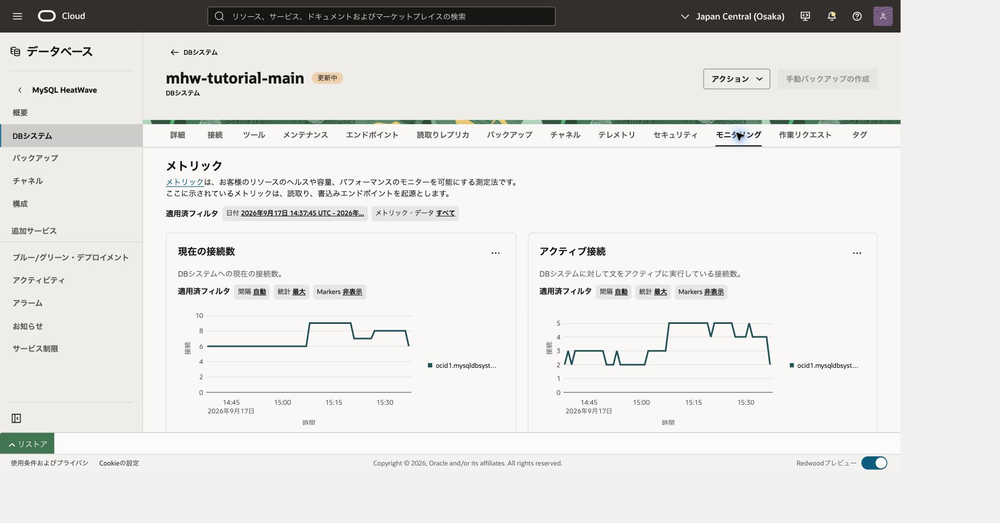
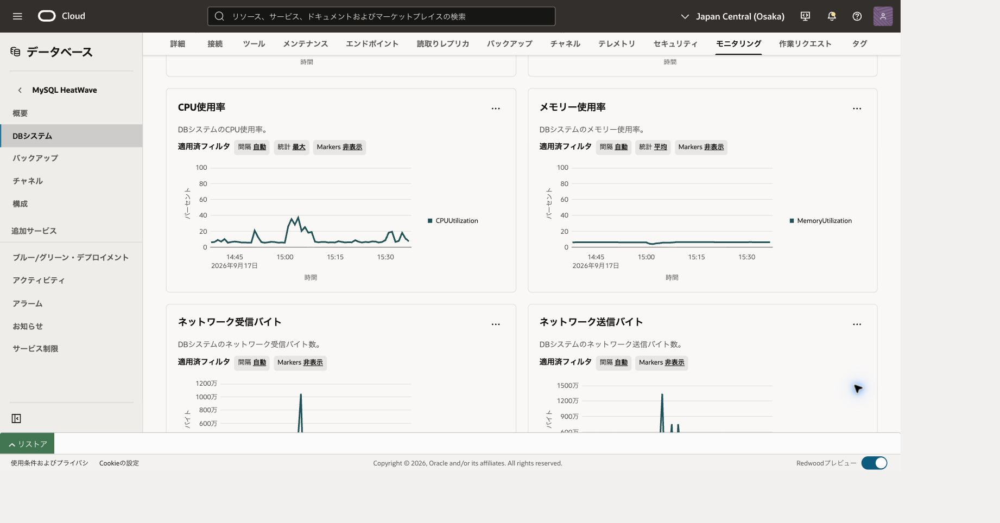

この章は監視・費用確認と、演習資源の最終整理を扱います。所要時間は30〜60分と削除・集計の待ち時間が目安です。

**応用編201〜204へ進む場合、手順1・2まで実施し、手順3以降の主DB削除は実施しません。** 主DB、教材データ、必要な接続設定を保持して201へ進み、204終了後にこの章へ戻ってください。基礎編で終了する場合だけ、そのまま削除へ進みます。

## 1. DBを監視する

対象DBのOCID、リージョン、監視する時間帯を記録します。OCIコンソールのDB詳細でMonitoringタブのMetricsを開き、CPU利用率、現在の接続、ステートメント数などを確認します。指標ごとの単位、集計方法、表示間隔を確認し、異なる時間帯のグラフを直接比較しません。[MySQLメトリック](https://docs.oracle.com/iaas/mysql-database/doc/mysql-database-metrics.html)





作業リクエストの成功・失敗や保守時間と照らし合わせます。グラフの空白をCPU使用率0と解釈せず、対象・期間・メトリック収集・権限を確認してください。瞬間的な低負荷だけで容量が十分とは判断しません。高負荷を作るために共有DBへ無制限のクエリーを送る必要はありません。

DB参照権限に加え、メトリック閲覧の例は次です。実グループと対象区画へ置き換えます。

```text
Allow group <group> to read mysql-family in compartment <lab>
Allow group <group> to read metrics in compartment <lab>
```

## 2. 費用と保持状態を確認する

Billing & Cost ManagementからCost Analysisを開きます。費用閲覧権限はDB管理権限とは別なので、請求管理者に対象範囲への閲覧を依頼してください。テナンシ全体の請求権限を演習者へ無条件で付与しません。

ホーム・リージョンでの操作を求めるメッセージが表示されたら、コンソール右上のリージョンをテナンシのホーム・リージョンへ切り替えて、Cost Analysisを開き直します。これは請求画面を表示する場所の変更であり、DBを別リージョンへ移動する操作ではありません。

期間、通貨、サービス、区画を指定し、可能なら資源IDや演習タグで絞ります。主DB、HA期間、レプリカ、104宛先、105復元DB、バックアップ、共有Compute、ネットワークを分けて記録します。共用Computeの既存費用をすべて演習の増分としません。

費用データには反映遅延があり、最新分には予測が含まれます。削除直後の表示を最終請求額としたり、表示0を無料の証拠にしたりしません。価格表と契約単価、実際の使用量を区別します。金額が表示されない場合は未確認として記録します。[Cost Analysis](https://docs.oracle.com/en-us/iaas/Content/Billing/Concepts/costanalysisoverview.htm)、[公式価格表](https://www.oracle.com/cloud/price-list/)

ここで応用編へ進むかを決めます。継続する場合は保持対象、担当者、次の見直し時期を記録してください。停止中もストレージやバックアップなどが残るため、停止だけを後片付け完了とは扱いません。

## 3. 削除対象を確定する

削除は戻せません。以下を名前だけでなくOCIDや正確なパスで一覧化し、共有・既存資源を除外します。

|対象|確認と削除方針|
|---|---|
|主DBと教材データ|応用完了または基礎終了時のみ削除。必要なデータの保全を先に確認|
|103のレプリカ・Read endpoint|残存確認。専用レプリカ0台後に専用Read endpointを無効化。再起動に注意|
|104のチャネル・宛先DB|章の台帳と照合し残存していれば依存順に削除|
|105復元DB・手動バックアップ|復元DBの残存と、独立して保持されるmanual backupを確認|
|201〜204のクラスタ・Object Storage・モデル等|各章で作った専用資源だけ。共有モデルサービス/既存bucketを削除しない|
|転送・クライアント資格情報・ローカルファイル|演習専用のプロセス、接続URL、正確なパスだけを対象にする|
|Compute・VCN・鍵・IAM|共用資源は保持。専用に作った場合も依存・所有・別用途を確認してから削除|

## 4. DBを削除する前に確認する

監視と費用確認にはSQL接続は不要でした。この段階でのみ、接続が閉じていれば[101章の転送とTLS接続](../101-create-connect/)を再開します。既に削除済みなら再接続せず、削除結果と残存資源の確認へ進んでください。

応用のSQLオブジェクトを整理する必要がある場合、DB接続がまだ可能な段階で各章の手順に従います。未知のスキーマを一括DROPしません。削除する主DBへ接続したMySQL ShellのSQLモードで最終状態を記録します。

応用編で使った専用スキーマは`mhw_analytics_lab`、`mhw_lakehouse_lab`、`mhw_ml_lab`です。AutoMLモデルは本人のモデルカタログに保存されるため、203章で記録したハンドルも確認します。専用主DBを削除する場合は、最終記録を取る前に各スキーマやモデルカタログを個別削除する必要はありません。主DBを保持して教材だけを整理する場合も、共有の`ML_SCHEMA_ユーザー名`全体を削除しないでください。

```sql
SELECT @@server_uuid AS server_uuid,VERSION() AS server_version\G
SELECT (SELECT COUNT(*) FROM mhw_learning.items) AS items_count,
       COUNT(*) AS loans_count,SUM(fee_cents) AS total_fee_cents FROM mhw_learning.loans;
SELECT checkpoint_id,note FROM mhw_learning.checkpoints ORDER BY checkpoint_id;
```

記録後にクライアントを閉じ、演習専用の転送プロセスを終了します。必要なバックアップを保持するか、演習データを完全に消すかを確定します。

MySQL Shellを終了し、前面転送を開始したタブでCtrl+Cを押します。別の転送があれば、その専用タブも同様に終了します。他用途のプロセスは終了しません。

```text
\quit
```

OSで主DBの待受が消えたことを確認します。残る場合は所有を確認し、無関係なプロセスを停止しません。

```bash
ss -ltn 'sport = :13306'
```

OCIで対象DBのDeleteを選び、削除計画のAutomatic backup retentionとFinal backupを確認します。前者のRetainはバックアップ保持、後者のRequireは削除前の最終バックアップ作成を意味します。不要な演習バックアップまで残すつもりがなければ、対象と方針を照合してDelete/Skipを選びます。保存が必要な場合は保持と費用を台帳へ記録します。削除保護を解除する場合も専用対象だけです。

永久削除を確認して送信し、DELETEDと作業成功を確認します。削除済みDBが履歴として一覧に表示されても、再起動できるDBとは限りません。要求の応答が不明なら状態を調べてから判断し、別DBを消して数を合わせないでください。[DBシステムの削除](https://docs.oracle.com/en-us/iaas/mysql-database/doc/deleting-db-system.html)

## 5. 残存する保存領域を確認する

DB削除後も、手動バックアップは保持期限まで残ります。自動バックアップは削除計画に従い、最終バックアップを作った場合はそれも別資源です。Backups一覧を元DBのOCIDで照合し、不要と確定した専用バックアップだけを削除します。

Soft deleteが有効なバックアップは、保持期限による削除時にDELETE_SCHEDULEDで追加7日間残る場合があります。削除要求・期限切れ・永久削除を区別し、状態と最終削除予定日を記録します。残存中に「すべて削除済み」としません。[バックアップ管理](https://docs.oracle.com/en-us/iaas/mysql-database/doc/managing-backup.html)

DB削除計画で自動バックアップをDeleteにした場合、ACTIVEの自動バックアップはSoft deleteが有効でも即時永久削除されます。一方、既にDELETE_SCHEDULEDのバックアップは追加保持期間中に残ります。手動バックアップの保持とは別に確認してください。

Lakehouseを使った場合、HeatWaveクラスタ停止だけではLakehouse storageの課金が終わりません。Lakehouse無効化またはクラスタ削除が必要です。Object Storageの元データも別管理なので、専用オブジェクト、バージョン、未完了アップロード、保持ルールを確認します。ロックされた保持ルールを回避して削除しないでください。[HeatWave課金](https://docs.oracle.com/en-us/iaas/mysql-database/doc/billing.html)

Read endpointも最後のレプリカを削除しただけで消えたと判断しません。DB削除後のendpointや関連資源を台帳と照合し、残存があれば管理手順を確認します。サービス管理のネットワーク資源を汎用画面から強制削除しません。

## 6. 接続資源を整理し、完了を記録する

今回保存したMySQL Shell資格情報は、記録した接続URLだけを削除します。たとえばCloud ShellのMySQL ShellをJSモードで開き、今回の管理ユーザーと転送ポートのURLを確認して操作します。

```bash
"$HOME/mysql-shell-community-26.7.1-el8/usr/bin/mysqlsh" --js
```

JSモードで保存接続名を確認します。

```javascript
shell.listCredentials();
```

一覧の対象が廃止した主DB用である場合だけ実行します。tutorial_admin以外の管理ユーザーを使った場合は、一覧で照合した実際の接続URL1件へ置き換えます。

```javascript
shell.deleteCredential('tutorial_admin@127.0.0.1:13306');
shell.listCredentials();
```

保存していなければ不要です。13307〜13310などに保存したURLも個別に確認します。同じURLを他用途で再利用している場合は、所有と用途を確認してから整理します。全資格情報の一括削除は行いません。

204のプロンプト・台帳・応答を保存した専用ディレクトリも削除対象です。比較記録が不要になったことを確認し、記録した絶対パスを1件ずつ指定します。専用dumpや設定ファイルは正確な絶対パスと中身の用途を確認してから削除します。homeや共有ディレクトリ全体、名前のワイルドカードだけを根拠に削除しません。共用Compute、VCN、既存のSSH鍵、Cloud Shell標準ソフトは保持します。

完了票には「削除済み」「意図して保持」「削除予定待ち」を分け、対象ID、確認時刻、残る費用、次の確認日を記載します。完全な後片付けは、今回削除対象とした資源の残存がなくなった時点です。費用画面の反映が遅れている場合は、資源削除の確認と後日の請求照合を別項目にしてください。

## 章の移動

[前章](../105-backup-restore/) · 応用編へ継続する場合は主DBを保持し、[201章](../201-heatwave-analytics/)へ進みます。
