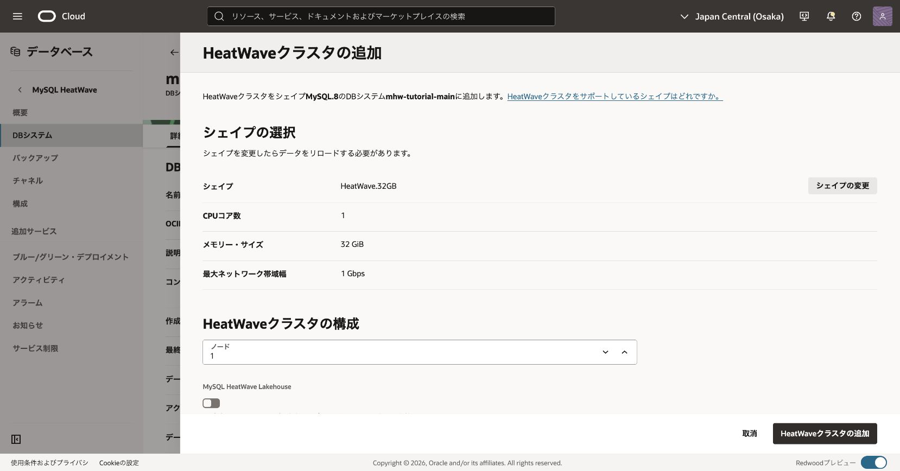
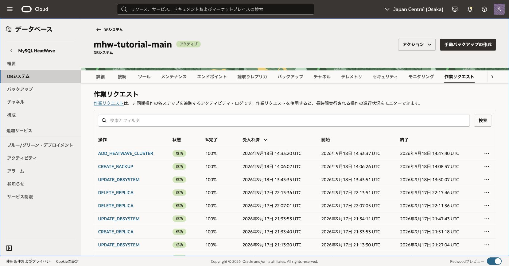
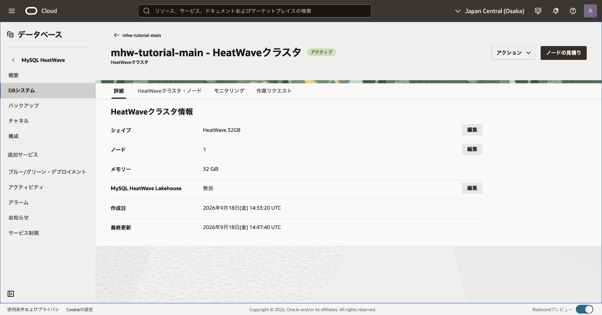
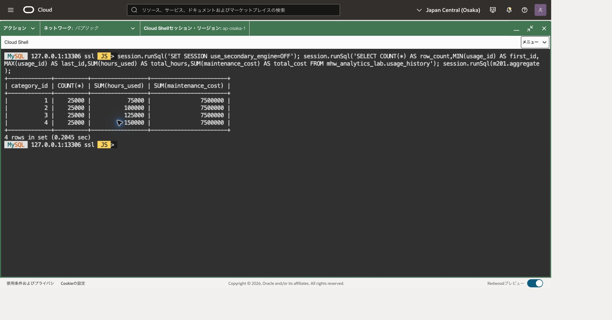
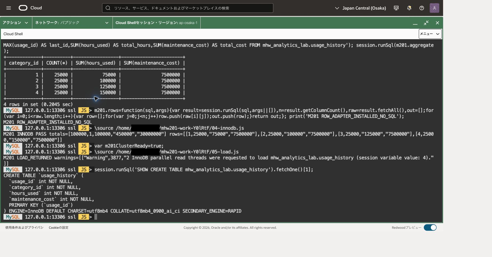
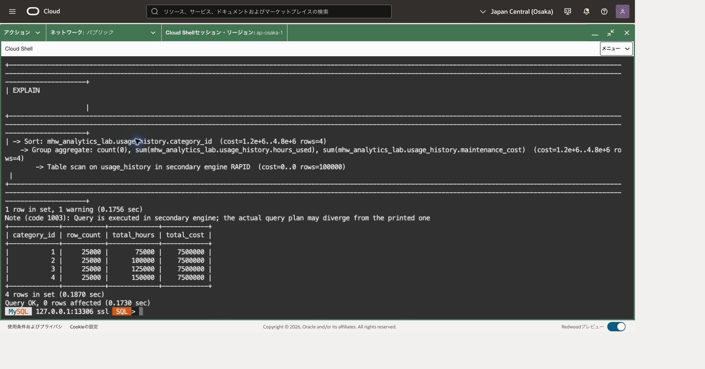

この章では、備品の利用履歴10万行をカテゴリー別に集計します。同じSQLをInnoDBとHeatWaveで実行し、結果が一致することと、HeatWaveへ処理が渡ったことを確認します。

InnoDBは通常のデータ保存・更新を担当するエンジン、HeatWaveは分析向けの処理先です。SQLの処理をHeatWaveへ渡すことを「オフロード」と呼びます。スキーマは、表などをまとめるデータベース領域です。

## 前提と完成状態

大阪リージョンのMySQL 9.7.2、MySQL.8のDBシステムを使用します。この章でHeatWave.32GBの1ノードを追加します。MySQL.8はDBのshape名で、サーバーのバージョン番号ではありません。

作業に必要なのは、対象DBへのSQL接続、専用schemaの作成、表の作成・投入・参照・変更権限です。

本章の処理は専用schema `mhw_analytics_lab`に限定します。各SQLブロックを順に実行し、エラーや期待しない件数が出たら次へ進まず原因を確認します。

[参照SQL](201-analytics.sql)も同梱しています。一括実行用ではなく、本文の確認条件に従ってブロック単位で利用します。

## HeatWaveクラスタを追加する

DBのMySQL.8と、分析ノードのHeatWave.32GBは別の設定です。OCI側は101で設定した対象区画のDB管理権限を確認し、不足する差分だけを管理者へ依頼します。SQLのCREATE/INSERT/SELECT/ALTER権限とは別です。

1. 大阪リージョンのDB systems一覧から今回の主DBを開き、OCIDを照合します。
2. ページ上部のメニューで **Add HeatWave cluster** を選びます。**HeatWave cluster details** が表示される場合は既存クラスタを確認し、二重に追加しません。
3. 追加パネルの **Change shape** で **HeatWave.32GB**、**Node** で **1** を選びます。この章では **MySQL HeatWave Lakehouse** は無効とし、202で有効化します。すでに有効な既存クラスタを使う場合は無効化せず、その状態を記録します。
4. shape、ノード数、費用と保持期間を照合して **Add HeatWave cluster** を選びます。
5. HeatWave cluster detailsでクラスタがACTIVE、shapeがHeatWave.32GB、ノード数が1、対応する作業リクエストが成功したことを確認します。CREATING/UPDATING中はSQLロードへ進みません。

これらの操作名は[公式のクラスタ追加手順](https://docs.oracle.com/en-us/iaas/mysql-database/doc/adding-heatwave-cluster.html)に対応します。対象を見失った場合はDB一覧へ戻り、別のDBや大きいshapeへ変更して進めないでください。

32GBを1ノード使う場合、16GBメモリ単位で2 capacity-hours/時です。主DBのECPU、保存領域等は別料金です。契約単価と保持時間を[価格表](https://www.oracle.com/cloud/price-list/)で見積り、次章以降で利用する間だけ保持します。







## Cloud Shellから主DBへ接続する

前章と同じ主DBのMySQL SQLプロンプトが開いている場合、転送や接続を作り直す必要はありません。この節の最後にある版・UUID・TLSのSQL確認から再開します。端末を閉じた場合だけ、以下の接続準備を行います。OSプロンプト（通常は末尾が`$`）にはbashの枠、MySQLの`SQL >`プロンプトにはsqlの枠を入力します。

[101章](../101-create-connect/)で導入したCommunity 26.7.1と検証済みSSHホスト鍵を使います。106章では主DBを削除せず、監視・費用確認までにしてください。大阪の今回の主DBのOCID・現在のprivate IPを照合し、DBがACTIVEで構成変更中ではないことを確認します。

新しいCloud Shell端末では101と同じネットワーク経路を選び、OSプロンプトで次を設定します。大文字の接続先を記録した実値へ置き換え、管理ユーザーを変更した場合はその値も合わせます。

```bash
# 目的: Community版、確認済み鍵、今回の主DBへの転送先を明示する。
MHW_SHELL="$HOME/mysql-shell-community-26.7.1-el8/usr/bin/mysqlsh"
MHW_KNOWN_HOSTS="$HOME/.ssh/mhw-learning-known-hosts"
MHW_KEY="$HOME/.ssh/mhw-learning.key"
MHW_COMPUTE_IP='COMPUTE_PUBLIC_IP'
MHW_OS_USER='opc'
MHW_DB_IP='CURRENT_MAIN_DB_PRIVATE_IP'
MHW_ADMIN='tutorial_admin'
# 目的: 前提ファイルの存在を確認する。失敗時は101章へ戻る。
if test -x "$MHW_SHELL" && test -s "$MHW_KNOWN_HOSTS" && test -f "$MHW_KEY"; then
  echo "前提ファイル: OK"
else
  echo "前提ファイル: NG。ここで止め、101章の配置先を確認してください。"
fi
```

「前提ファイル: OK」の場合だけ、次で待受を確認します。NGの場合は後続の枠を貼り付けません。標準搭載版へ切り替えたりホスト鍵検証を無効化したりしません。

```bash
# 目的: 主DB用13306の既存転送を二重に作らない。
ss -ltn 'sport = :13306'
```

LISTEN行がある場合は、今回の主DBへ向けた転送として記録した制御ソケットの絶対パスを、次の値へ置き換えます。記録がなく対象不明ならここで調べ、別のプロセスを終了したり転送を重ねたりしません。

```bash
# 目的: 再利用する今回の転送の制御ソケットを復元する。
MHW_SOCKET='RECORDED_CONTROL_SOCKET_ABSOLUTE_PATH'
# 目的: 記録したパスが実際にソケットであることを確認する。
if test -S "$MHW_SOCKET"; then
  echo "制御ソケット: OK"
else
  echo "制御ソケット: NG。次の枠を実行せず、記録したパスを確認してください。"
fi
```

LISTEN行がない場合だけ、代わりに次で新しい転送を開始します。既存転送を再利用する場合はこの枠を実行しません。

```bash
# 目的: 専用制御ソケットを用意し、主DBへのloopback限定転送を開始する。
MHW_TUNNEL_DIR=$(mktemp -d /tmp/mhw-tunnel-XXXXXX)
MHW_SOCKET="$MHW_TUNNEL_DIR/control"
ssh -F /dev/null -4 -fN -T -M -S "$MHW_SOCKET" \
  -o StrictHostKeyChecking=yes -o UserKnownHostsFile="$MHW_KNOWN_HOSTS" \
  -o IdentitiesOnly=yes -o ForwardAgent=no -o ExitOnForwardFailure=yes \
  -o ConnectTimeout=10 -o ServerAliveInterval=30 -o ServerAliveCountMax=3 \
  -i "$MHW_KEY" -L "127.0.0.1:13306:$MHW_DB_IP:3306" \
  "$MHW_OS_USER@$MHW_COMPUTE_IP"
```

秘密鍵のパスフレーズを求められたら非表示入力へ入力します。ソケット確認または起動に成功した場合だけ、次の共通確認へ進みます。ソケットパスは後で再利用・終了できるように記録します。

```bash
# 目的: 記録した制御接続とloopback待受を確認する。
ssh -F /dev/null -S "$MHW_SOCKET" -O check "$MHW_OS_USER@$MHW_COMPUTE_IP"
ss -ltn 'sport = :13306'
```

Master runningと127.0.0.1:13306を確認したら、次で制御ソケットの絶対パスを表示し、今回の主DBのIPと一緒に控えます。

```bash
# 目的: 次回の再利用と終了に使う制御ソケットのパスを記録する。
printf '%s\n' "$MHW_SOCKET"
```

確認に失敗した場合は接続せず、転送先と記録を調べます。成功した場合だけ接続します。パスワード値をコマンド引数へ付けません。

```bash
# 目的: 専用Community版で主DBへClassic protocol・TLS・SQLモードで接続する。
"$MHW_SHELL" --mysql --sql --host=127.0.0.1 --port=13306 \
  --user="$MHW_ADMIN" --ssl-mode=REQUIRED --password
```

```sql
-- 目的: 記録した主DBであり、現在のプライマリへ書き込めることを確認する。
SELECT VERSION() AS server_version, @@server_uuid AS server_uuid,
       CURRENT_USER() AS db_account, @@read_only AS read_only,
       @@super_read_only AS super_read_only\G
-- 目的: SQLセッションのTLS暗号化を確認する。
SHOW SESSION STATUS LIKE 'Ssl_cipher';
```

版9.7.2、対象の記録と一致するUUID、両read-only値0、空でないcipherを確認します。HAの切替を行った場合は切替後のUUID記録と照合します。REQUIREDは暗号化を要求しますが、ホスト名の証明書検証を意味しません。以後のSQLはこの接続のSQLモードで実行し、OSコマンドへ戻るときは`\quit`します。

## 1. 分析用データを作成する

データは架空の利用履歴です。1行を1回の利用とし、カテゴリーID、利用時間、保守費用を格納します。保守費用の単位は円です。5桁の数字を組み合わせて0〜99999を作るので、毎回同じ10万行になります。再帰設定の変更や外部ファイルは不要です。

```sql
-- 目的: 接続中のサーバー版・利用者を記録する。
SELECT VERSION() AS server_version, CURRENT_USER() AS db_account;

-- 目的: 同名schemaとの衝突を調べる。結果が0行の場合だけ次へ進む。
SELECT SCHEMA_NAME FROM information_schema.SCHEMATA
WHERE SCHEMA_NAME = 'mhw_analytics_lab';
```

schema検索の結果が0行であることを確認します。同名schemaがある場合は、この章の途中まで実行した結果かを確認してください。既存のschemaを削除して最初からやり直す必要はありません。

```sql
-- 目的: この章だけのschemaを新規作成する。既存schemaがあればエラーで停止する。
CREATE DATABASE mhw_analytics_lab;

```

CREATE DATABASEの成功を確認してから、次の表作成へ進みます。DDLは暗黙のCOMMITを伴います。失敗後に同じ枠の後続文を続けて実行せず、存在状態を確認してください。

```sql

-- 目的: 10万行の架空利用履歴を格納する専用InnoDB表を作る。
CREATE TABLE mhw_analytics_lab.usage_history (
  usage_id INT NOT NULL PRIMARY KEY,
  category_id INT NOT NULL,
  hours_used INT NOT NULL,
  maintenance_cost INT NOT NULL
) ENGINE=InnoDB;

```

表作成の成功後に、次の0行確認を実行します。

```sql
-- 目的: 途中実行したデータへ重ねて投入しないため、未投入であることを確認する。
SELECT COUNT(*) AS existing_rows FROM mhw_analytics_lab.usage_history;
```

0の場合だけ投入します。

```sql

-- 目的: データ投入をInnoDB側で行い、意図しないオフロードを避ける。
SET SESSION use_secondary_engine = OFF;

-- 目的: 今回の投入を一つの確定単位にする。
START TRANSACTION;
-- 目的: 0〜9の5桁の直積から重複しない0〜99999を作り、決定的な10万行を投入する。
INSERT INTO mhw_analytics_lab.usage_history
  (usage_id, category_id, hours_used, maintenance_cost)
WITH digits AS (
  SELECT 0 AS d UNION ALL SELECT 1 UNION ALL SELECT 2 UNION ALL SELECT 3
  UNION ALL SELECT 4 UNION ALL SELECT 5 UNION ALL SELECT 6 UNION ALL SELECT 7
  UNION ALL SELECT 8 UNION ALL SELECT 9
), numbers AS (
  SELECT a.d + 10*b.d + 100*c.d + 1000*d.d + 10000*e.d AS n
  FROM digits a CROSS JOIN digits b CROSS JOIN digits c
  CROSS JOIN digits d CROSS JOIN digits e
)
SELECT n+1, MOD(n,4)+1, MOD(n,8)+1, 100*(MOD(n,5)+1)
FROM numbers;

```

INSERTが成功した場合だけ次のCOMMITを実行します。失敗した場合は同じ接続でROLLBACKし、件数を読取り確認してから再開します。COMMITの応答が不明なら変更を再送しません。

```sql

-- 目的: 明示的に確定し、別の読取りでも確認できる状態にする。
COMMIT;
```

10万行の投入が完了したら、件数と合計を確認します。

```sql
-- 目的: 10万行・ID範囲・合計が期待値と一致することを確認する。
SELECT COUNT(*) AS row_count, MIN(usage_id) AS min_id, MAX(usage_id) AS max_id,
       SUM(hours_used) AS hours_total, SUM(maintenance_cost) AS cost_total
FROM mhw_analytics_lab.usage_history;
```

|row_count|min_id|max_id|hours_total|cost_total|
|---:|---:|---:|---:|---:|
|100000|1|100000|450000|30000000|

`usage_id`は主キーなので重複できません。投入中に接続が切れた場合は、再投入する前に件数を確認してください。

## 2. InnoDBの集計結果を確認する

`use_secondary_engine=OFF`により、このセッションの集計をInnoDBで実行します。別のセッションへ接続し直した場合は、集計前に同じ設定を実行してください。

```sql
-- 目的: 比較の基準となるInnoDB実行を指定する。
SET SESSION use_secondary_engine = OFF;

-- 目的: InnoDBでカテゴリー別の基準結果を取得する。
SELECT category_id, COUNT(*) AS row_count, SUM(hours_used) AS hours_total,
       SUM(maintenance_cost) AS cost_total
FROM mhw_analytics_lab.usage_history
GROUP BY category_id ORDER BY category_id;
```

次の4行になります。

|category_id|row_count|hours_total|cost_total|
|---:|---:|---:|---:|
|1|25000|75000|7500000|
|2|25000|100000|7500000|
|3|25000|125000|7500000|
|4|25000|150000|7500000|

カテゴリー1の利用時間は1と5が交互に現れ、平均3時間×25000行で75000時間です。カテゴリー2〜4も同様に平均4、5、6時間になります。各カテゴリーの保守費は100〜500円が均等に現れ、平均300円×25000行です。



## 3. HeatWaveへロードする

InnoDB表の原本を保ちながら、HeatWave側へ分析用のデータをロードします。`RAPID`はHeatWaveのセカンダリエンジン名です。

```sql
-- 目的: 専用表のセカンダリエンジンをHeatWaveのRAPIDにする。
ALTER TABLE mhw_analytics_lab.usage_history SECONDARY_ENGINE=RAPID;
```

設定が成功した場合だけ、次のロードを実行します。エラーなら後続を貼り付けず停止してください。

```sql
-- 目的: 専用表をHeatWaveメモリへロードする。
ALTER TABLE mhw_analytics_lab.usage_history SECONDARY_LOAD;

-- 目的: ロードが返した警告を直後に調べる。
SHOW WARNINGS;
```

ロード後の警告には、処理上の通知が含まれる場合があります。列が除外された場合やロードエラーがある場合は、集計を始める前に原因を解消してください。

Guided Loadは既定で有効で、ロードできない列へNOT SECONDARYを設定する場合があります。SHOW WARNINGSの結果を保存した後、次の定義も確認します。

```sql
-- 目的: 分析に必要な4列がロード対象から除外されていないかを調べる。
SHOW CREATE TABLE mhw_analytics_lab.usage_history;
```

クエリ対象の列が除外されていたらFORCED集計へ進まず、原因を確認します。



## 4. 実行計画と結果を比べる

データが小さいクエリは通常の自動判断ではInnoDBで実行される場合があります。この演習では`FORCED`を指定し、HeatWaveで実行できないときにエラーとして検出します。

```sql
-- 目的: HeatWaveへオフロードできなければ失敗させ、暗黙のInnoDB実行を防ぐ。
SET SESSION use_secondary_engine = FORCED;
```

設定の成功後に、次の実行計画を確認します。

```sql
-- 目的: 集計の実行計画がHeatWaveのRAPIDを使うことを確認する。
EXPLAIN SELECT category_id, COUNT(*) AS row_count, SUM(hours_used) AS hours_total,
       SUM(maintenance_cost) AS cost_total
FROM mhw_analytics_lab.usage_history
GROUP BY category_id ORDER BY category_id;

-- 目的: HeatWaveで同じ集計を実行し、InnoDBの結果と照合する。
SELECT category_id, COUNT(*) AS row_count, SUM(hours_used) AS hours_total,
       SUM(maintenance_cost) AS cost_total
FROM mhw_analytics_lab.usage_history
GROUP BY category_id ORDER BY category_id;
```

EXPLAINがツリー形式の場合は`in secondary engine RAPID`、表形式の場合はExtraの`Using secondary engine RAPID`を確認します。表示形式により文言が異なりますが、いずれもRAPIDを使う計画を示します。SELECTの4行は前節の表と一致します。EXPLAINは計画の確認であり、SELECTそのものの実行時間ではありません。

性能も観察する場合は、同じ接続でOFFとFORCEDを切り替え、それぞれ同じ集計をウォームアップ1回＋計測3回実行します。クライアントに表示された各時間と中央値を記録し、ロード時間は別に扱います。10万行の軽い処理ではHeatWaveの方が短くなるとは限りません。目的は実行先と結果を確かめることであり、一定の高速化倍率を保証するものではありません。

```sql
-- 目的: 比較後にセッションのエンジン選択を通常動作へ戻す。
SET SESSION use_secondary_engine = ON;
```



## 5. うまくいかないとき

接続エラーならDBシステムの状態と接続経路を確認します。ロードエラーならクラスタの状態、空きメモリ、表の権限と警告を確認します。`FORCED`で失敗した場合は、HeatWaveへロードできているか、EXPLAINがオフロードを示すかを調べます。OFFへ変えて成功しただけではHeatWave実行の確認になりません。

## 6. 後片付け

章の検証が終わり、このschemaを再利用しない場合に限り次を実行します。DBシステムや他章のschemaは対象に含みません。

```sql
-- 目的: この章で作成した専用表とschemaだけを削除する。
DROP DATABASE mhw_analytics_lab;
```

表の削除だけではクラスタの計算費用は止まりません。202〜204章へ進むならクラスタとDBを保持します。ここで終了する場合、または全演習を終えた場合は、[106章の後片付け](../106-monitor-cleanup/)へ戻ります。

この章の達成条件は、実行計画がRAPIDを示し、HeatWaveとInnoDBのカテゴリー別4行の結果が一致することです。

## 参考資料

- [Supported Shapes](https://docs.oracle.com/en-us/iaas/mysql-database/doc/supported-shapes.html)
- [Define the Secondary Engine](https://dev.mysql.com/doc/heatwave/en/mys-hw-defining-secondary-engine.html)
- [Load Tables](https://dev.mysql.com/doc/heatwave/en/mys-hw-secondary-load.html)
- [Diagnose Query Offload](https://dev.mysql.com/doc/heatwave/en/mys-hw-debugging-queries.html)

## 章の移動

[基礎編の監視・整理](../106-monitor-cleanup/) · [次章](../202-lakehouse-join/)
