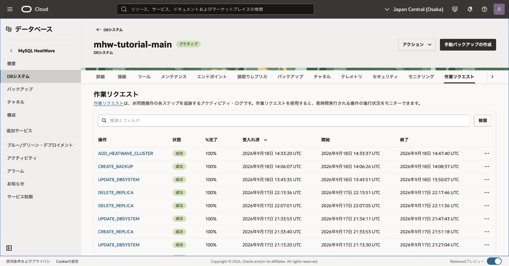
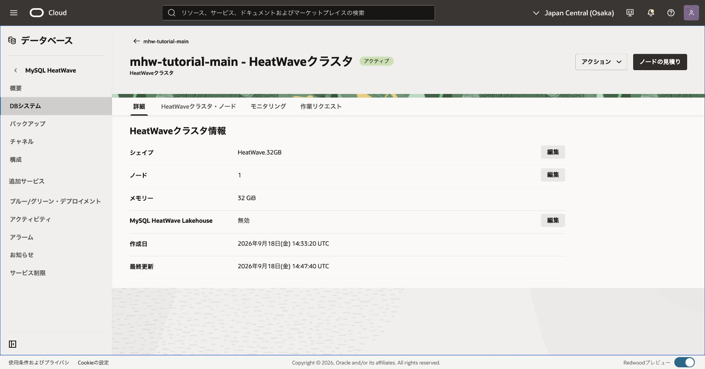
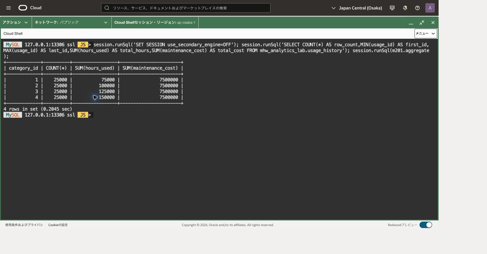
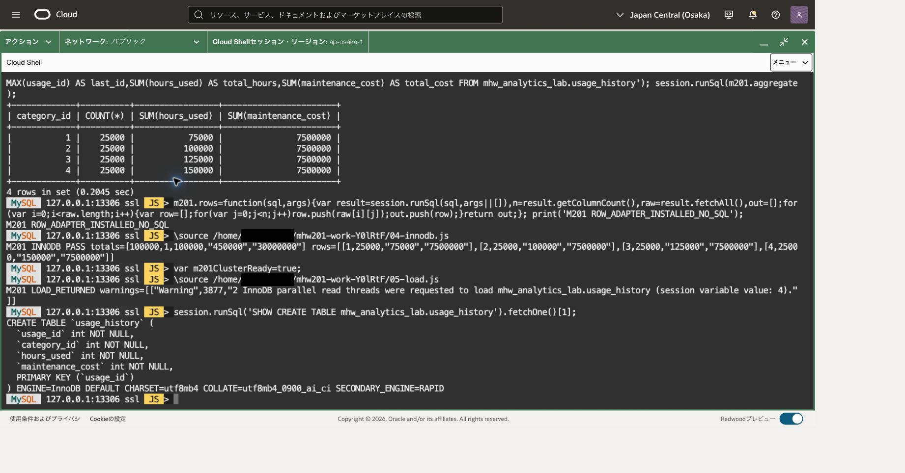
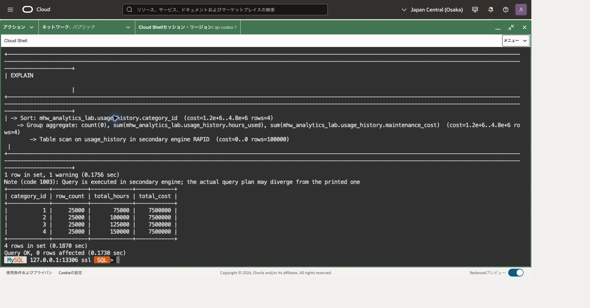

この章では、備品の利用履歴10万行をカテゴリー別に集計します。同じSQLをInnoDBとHeatWaveで実行し、結果が一致することと、HeatWaveへ処理が渡ったことを確認します。

InnoDBは通常のデータ保存・更新を担当するエンジン、HeatWaveは分析向けの処理先です。SQLの処理をHeatWaveへ渡すことを「オフロード」と呼びます。スキーマは、表などをまとめるデータベース領域です。

## 前提と完成状態

大阪リージョンのMySQL 9.7.2、MySQL.2のDBシステムを使用します。この章でHeatWave.32GBの1ノードを追加します。MySQL.2はDBのshape名で、サーバーのバージョン番号ではありません。

作業に必要なのは、対象DBへのSQL接続、専用schemaの作成、表の作成・投入・参照・変更権限です。

本章の処理は専用schema `mhw_analytics_lab`に限定します。各SQLブロックを順に実行し、エラーや期待しない件数が出たら次へ進まず原因を確認します。

[参照SQL](201-analytics.sql)も同梱しています。一括実行用ではなく、本文の確認条件に従ってブロック単位で利用します。

## HeatWaveクラスタを追加する

DBのMySQL.2と、分析ノードのHeatWave.32GBは別の設定です。OCI側は101で設定した対象区画のDB管理権限を確認し、不足する差分だけを管理者へ依頼します。SQLのCREATE/INSERT/SELECT/ALTER権限とは別です。

1. 大阪リージョンのDB systems一覧から今回の主DBを開き、OCIDを照合します。
2. ページ上部のメニューで **Add HeatWave cluster** を選びます。**HeatWave cluster details** が表示される場合は既存クラスタを確認し、二重に追加しません。
3. 追加パネルの **Change shape** で **HeatWave.32GB**、**Node** で **1** を選びます。この章では **MySQL HeatWave Lakehouse** は無効とし、202で有効化します。すでに有効な既存クラスタを使う場合は無効化せず、その状態を記録します。
4. shape、ノード数、費用と保持期間を照合して **Add HeatWave cluster** を選びます。
5. HeatWave cluster detailsでクラスタがACTIVE、shapeがHeatWave.32GB、ノード数が1、対応する作業リクエストが成功したことを確認します。CREATING/UPDATING中はSQLロードへ進みません。

これらの操作名は[公式のクラスタ追加手順](https://docs.oracle.com/en-us/iaas/mysql-database/doc/adding-heatwave-cluster.html)に対応します。対象を見失った場合はDB一覧へ戻り、別のDBや大きいshapeへ変更して進めないでください。

32GBを1ノード使う場合、16GBメモリ単位で2 capacity-hours/時です。主DBのECPU、保存領域等は別料金です。契約単価と保持時間を[価格表](https://www.oracle.com/cloud/price-list/)で見積り、次章以降で利用する間だけ保持します。





## 接続を再開する場合だけ

同じ主DB接続が開いていれば再利用します。転送が閉じたら[101章](../101-create-connect/)の前面SSHを再開します。SQL用の別タブで次を実行します。`--mysql`はClassic protocol、`--sql`はSQLモード、`--ssl-mode=REQUIRED`はTLS必須を指定します。101章で保存した資格情報を使うため、通常はパスワードの再入力はありません。保存していない場合だけ末尾に `--password` を付け、非表示プロンプトへ入力します。

```bash
"$HOME/mysql-shell-community-26.7.1-el8/usr/bin/mysqlsh" --mysql --sql --host=127.0.0.1 --port=13306 \
  --user=tutorial_admin --ssl-mode=REQUIRED
```

新しいSQL接続では、記録した主DB UUID、両read-only値0、非空cipherを照合します。不一致なら後続を止めます。

```sql
SELECT @@server_uuid,@@read_only,@@super_read_only\G
SHOW SESSION STATUS LIKE 'Ssl_cipher';
```

## 1. 分析用データを作成する

データは架空の利用履歴です。1行を1回の利用とし、カテゴリーID、利用時間、保守費用を格納します。保守費用の単位は円です。5桁の数字を組み合わせて0〜99999を作るので、毎回同じ10万行になります。再帰設定の変更や外部ファイルは不要です。

```sql
SELECT SCHEMA_NAME FROM information_schema.SCHEMATA
WHERE SCHEMA_NAME = 'mhw_analytics_lab';
```

schema検索の結果が0行であることを確認します。同名schemaがある場合は、この章の途中まで実行した結果かを確認してください。既存のschemaを削除して最初からやり直す必要はありません。

```sql
CREATE DATABASE mhw_analytics_lab;
```

CREATE DATABASEの成功を確認してから、次の表作成へ進みます。DDLは暗黙のCOMMITを伴います。失敗後に同じ枠の後続文を続けて実行せず、存在状態を確認してください。

```sql
CREATE TABLE mhw_analytics_lab.usage_history (
  usage_id INT NOT NULL PRIMARY KEY,
  category_id INT NOT NULL,
  hours_used INT NOT NULL,
  maintenance_cost INT NOT NULL
) ENGINE=InnoDB;
```

表作成の成功後に、次の0行確認を実行します。

```sql
SELECT COUNT(*) AS existing_rows FROM mhw_analytics_lab.usage_history;
```

0の場合だけ投入します。

```sql
SET SESSION use_secondary_engine = OFF;
START TRANSACTION;
INSERT INTO mhw_analytics_lab.usage_history
  (usage_id, category_id, hours_used, maintenance_cost)
WITH digits AS (
  SELECT 0 AS d UNION ALL SELECT 1 UNION ALL SELECT 2 UNION ALL SELECT 3
  UNION ALL SELECT 4 UNION ALL SELECT 5 UNION ALL SELECT 6 UNION ALL SELECT 7
  UNION ALL SELECT 8 UNION ALL SELECT 9
), numbers AS (
  SELECT a.d + 10*b.d + 100*c.d + 1000*d.d + 10000*e.d AS n
  FROM digits a CROSS JOIN digits b CROSS JOIN digits c
  CROSS JOIN digits d CROSS JOIN digits e
)
SELECT n+1, MOD(n,4)+1, MOD(n,8)+1, 100*(MOD(n,5)+1)
FROM numbers;
```

INSERTが成功した場合だけ次のCOMMITを実行します。失敗した場合は同じ接続でROLLBACKし、件数を読取り確認してから再開します。COMMITの応答が不明なら変更を再送しません。

```sql
COMMIT;
```

10万行の投入が完了したら、件数と合計を確認します。

```sql
SELECT COUNT(*) AS row_count, MIN(usage_id) AS min_id, MAX(usage_id) AS max_id,
       SUM(hours_used) AS hours_total, SUM(maintenance_cost) AS cost_total
FROM mhw_analytics_lab.usage_history;
```

|row_count|min_id|max_id|hours_total|cost_total|
|---:|---:|---:|---:|---:|
|100000|1|100000|450000|30000000|

`usage_id`は主キーなので重複できません。投入中に接続が切れた場合は、再投入する前に件数を確認してください。

## 2. InnoDBの集計結果を確認する

`use_secondary_engine=OFF`により、このセッションの集計をInnoDBで実行します。別のセッションへ接続し直した場合は、集計前に同じ設定を実行してください。

```sql
SET SESSION use_secondary_engine = OFF;
SELECT category_id, COUNT(*) AS row_count, SUM(hours_used) AS hours_total,
       SUM(maintenance_cost) AS cost_total
FROM mhw_analytics_lab.usage_history
GROUP BY category_id ORDER BY category_id;
```

次の4行になります。

|category_id|row_count|hours_total|cost_total|
|---:|---:|---:|---:|
|1|25000|75000|7500000|
|2|25000|100000|7500000|
|3|25000|125000|7500000|
|4|25000|150000|7500000|

カテゴリー1の利用時間は1と5が交互に現れ、平均3時間×25000行で75000時間です。カテゴリー2〜4も同様に平均4、5、6時間になります。各カテゴリーの保守費は100〜500円が均等に現れ、平均300円×25000行です。



## 3. HeatWaveへロードする

InnoDB表の原本を保ちながら、HeatWave側へ分析用のデータをロードします。`RAPID`はHeatWaveのセカンダリエンジン名です。

```sql
ALTER TABLE mhw_analytics_lab.usage_history SECONDARY_ENGINE=RAPID;
```

設定が成功した場合だけ、次のロードを実行します。エラーなら後続を貼り付けず停止してください。

```sql
ALTER TABLE mhw_analytics_lab.usage_history SECONDARY_LOAD;
SHOW WARNINGS;
```

ロード後の警告には、処理上の通知が含まれる場合があります。列が除外された場合やロードエラーがある場合は、集計を始める前に原因を解消してください。

Guided Loadは既定で有効で、ロードできない列へNOT SECONDARYを設定する場合があります。SHOW WARNINGSの結果を保存した後、次の定義も確認します。

```sql
SHOW CREATE TABLE mhw_analytics_lab.usage_history;
```

クエリ対象の列が除外されていたらFORCED集計へ進まず、原因を確認します。



## 4. 実行計画と結果を比べる

データが小さいクエリは通常の自動判断ではInnoDBで実行される場合があります。この演習では`FORCED`を指定し、HeatWaveで実行できないときにエラーとして検出します。

```sql
SET SESSION use_secondary_engine = FORCED;
```

設定の成功後に、次の実行計画を確認します。

```sql
EXPLAIN SELECT category_id, COUNT(*) AS row_count, SUM(hours_used) AS hours_total,
       SUM(maintenance_cost) AS cost_total
FROM mhw_analytics_lab.usage_history
GROUP BY category_id ORDER BY category_id;
SELECT category_id, COUNT(*) AS row_count, SUM(hours_used) AS hours_total,
       SUM(maintenance_cost) AS cost_total
FROM mhw_analytics_lab.usage_history
GROUP BY category_id ORDER BY category_id;
```

EXPLAINがツリー形式の場合は`in secondary engine RAPID`、表形式の場合はExtraの`Using secondary engine RAPID`を確認します。表示形式により文言が異なりますが、いずれもRAPIDを使う計画を示します。SELECTの4行は前節の表と一致します。EXPLAINは計画の確認であり、SELECTそのものの実行時間ではありません。

性能も観察する場合は、同じ接続でOFFとFORCEDを切り替え、それぞれ同じ集計をウォームアップ1回＋計測3回実行します。クライアントに表示された各時間と中央値を記録し、ロード時間は別に扱います。10万行の軽い処理ではHeatWaveの方が短くなるとは限りません。目的は実行先と結果を確かめることであり、一定の高速化倍率を保証するものではありません。

```sql
SET SESSION use_secondary_engine = ON;
```



## 5. うまくいかないとき

接続エラーならDBシステムの状態と接続経路を確認します。ロードエラーならクラスタの状態、空きメモリ、表の権限と警告を確認します。`FORCED`で失敗した場合は、HeatWaveへロードできているか、EXPLAINがオフロードを示すかを調べます。OFFへ変えて成功しただけではHeatWave実行の確認になりません。

## 6. 後片付け

章の検証が終わり、このschemaを再利用しない場合に限り次を実行します。DBシステムや他章のschemaは対象に含みません。

```sql
DROP DATABASE mhw_analytics_lab;
```

表の削除だけではクラスタの計算費用は止まりません。202〜204章へ進むならクラスタとDBを保持します。ここで終了する場合、または全演習を終えた場合は、[106章の後片付け](../106-monitor-cleanup/)へ戻ります。

この章の達成条件は、実行計画がRAPIDを示し、HeatWaveとInnoDBのカテゴリー別4行の結果が一致することです。

## 参考資料

- [Supported Shapes](https://docs.oracle.com/en-us/iaas/mysql-database/doc/supported-shapes.html)
- [Define the Secondary Engine](https://dev.mysql.com/doc/heatwave/en/mys-hw-defining-secondary-engine.html)
- [Load Tables](https://dev.mysql.com/doc/heatwave/en/mys-hw-secondary-load.html)
- [Diagnose Query Offload](https://dev.mysql.com/doc/heatwave/en/mys-hw-debugging-queries.html)

## 章の移動

[基礎編の監視・整理](../106-monitor-cleanup/) · [次章](../202-lakehouse-join/)
