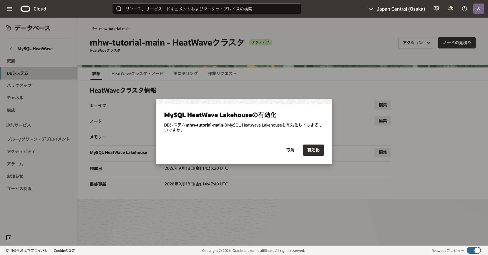
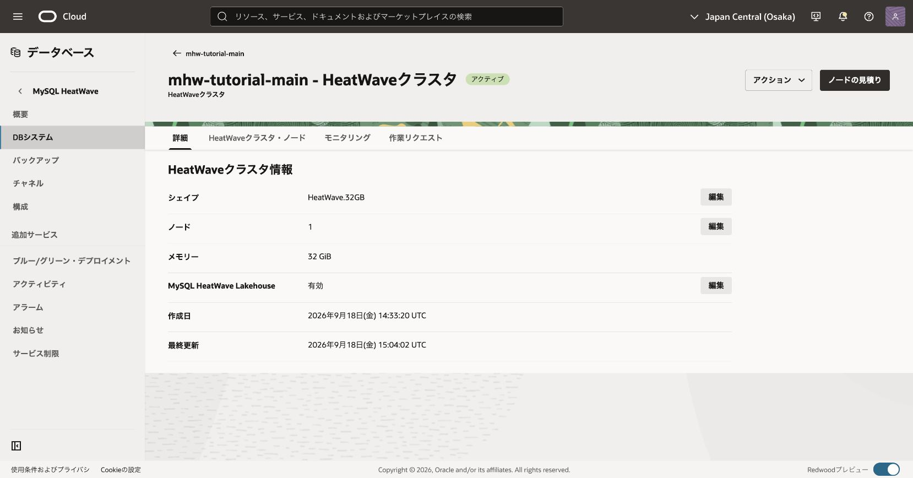
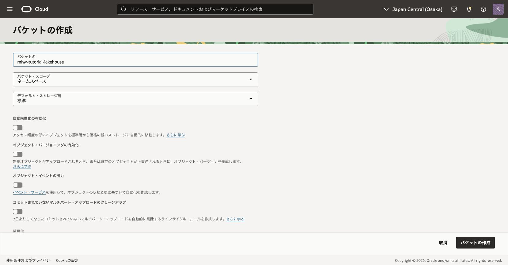
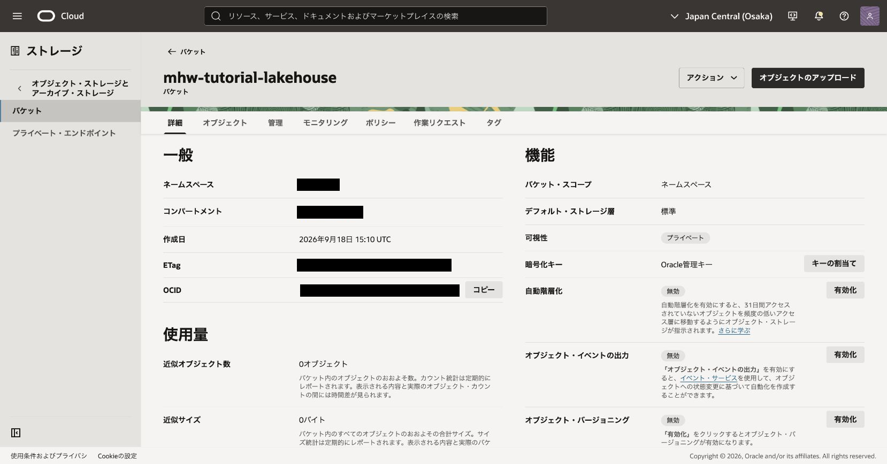
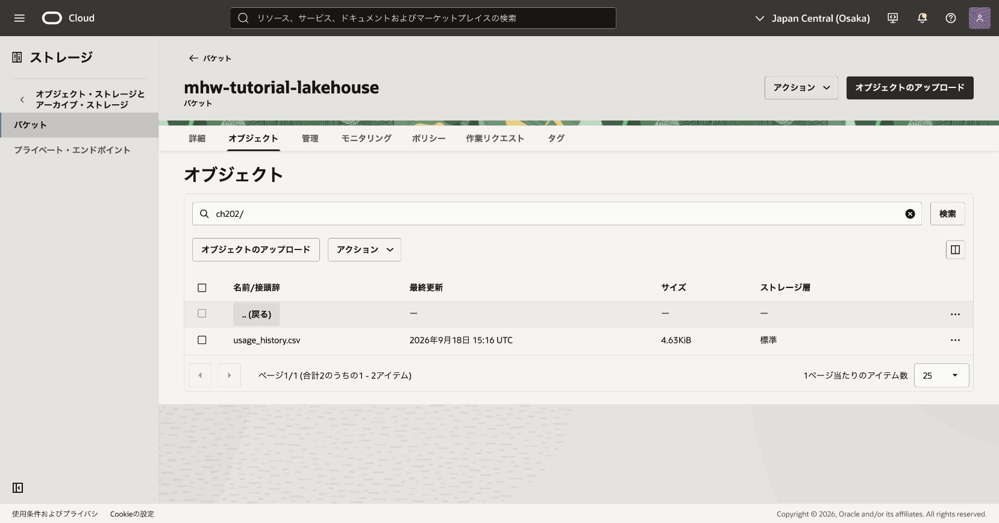
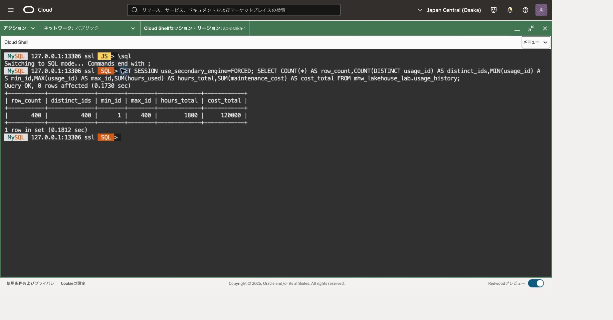
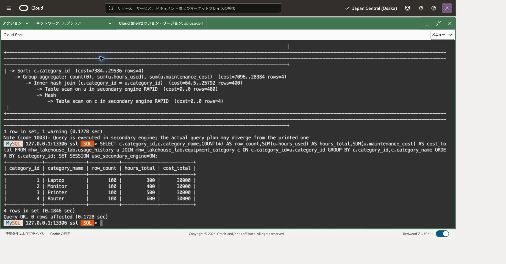

利用履歴はObject StorageのCSV、カテゴリー名はMySQLの通常表にある、という構成で集計します。履歴をInnoDB表へ取り込まずに、両方のデータをHeatWaveからJOINできることを確認します。

マスターはカテゴリーIDに名前を対応させる通常表です。JOINは共通のカテゴリーIDで履歴と名前を結び付ける処理です。Resource Principalは利用者の鍵ではなくDB自身としてサービスへアクセスする仕組みで、動的グループはそのDBをIAMで指定するための条件をまとめます。

## 前提と完成状態

MySQL 9.7.2、MySQL.8、HeatWave.32GBの1ノードを使用し、HeatWave Lakehouseを有効にします。専用schemaは`mhw_lakehouse_lab`です。[201章](../201-heatwave-analytics/)の分析用schemaや既存の備品台帳とは独立しています。

Object Storageには大阪リージョンの非公開・演習専用bucketを使用します。DB側の読取り、利用者のアップロード、SQLの表操作の権限を分けて準備します。管理者が専用bucketを作成し、その名前に限定した権限を設定してから、利用者がCSVをアップロードする順番です。

[参照SQL](202-lakehouse.sql)は本文と同じ段階実行用です。一括実行せず、存在確認とVALIDATEの結果を確認してから次のブロックを選択します。

## Cloud Shellから主DBへ接続する

前章と同じ主DBのMySQL SQLプロンプトが開いている場合、転送や接続を作り直す必要はありません。この節の最後にある版・UUID・TLSのSQL確認から再開します。端末を閉じた場合だけ、以下の接続準備を行います。OSプロンプト（通常は末尾が`$`）にはbashの枠、MySQLの`SQL >`プロンプトにはsqlの枠を入力します。

[101章](../101-create-connect/)で導入したCommunity 26.7.1と検証済みSSHホスト鍵を使います。106章では主DBを削除せず、監視・費用確認までにしてください。大阪の今回の主DBのOCID・現在のprivate IPを照合し、DBがACTIVEで構成変更中ではないことを確認します。

新しいCloud Shell端末では101と同じネットワーク経路を選び、OSプロンプトで次を設定します。大文字の接続先を記録した実値へ置き換え、管理ユーザーを変更した場合はその値も合わせます。

```bash
# 目的: Community版、確認済み鍵、今回の主DBへの転送先を明示する。
MHW_SHELL="$HOME/mysql-shell-community-26.7.1-el8/usr/bin/mysqlsh"
MHW_KNOWN_HOSTS="$HOME/.ssh/mhw-learning-known-hosts"
MHW_KEY="$HOME/.ssh/mhw-learning.key"
MHW_COMPUTE_IP='COMPUTE_PUBLIC_IP'
MHW_OS_USER='opc'
MHW_DB_IP='CURRENT_MAIN_DB_PRIVATE_IP'
MHW_ADMIN='tutorial_admin'
# 目的: 前提ファイルの存在を確認する。失敗時は101章へ戻る。
if test -x "$MHW_SHELL" && test -s "$MHW_KNOWN_HOSTS" && test -f "$MHW_KEY"; then
  echo "前提ファイル: OK"
else
  echo "前提ファイル: NG。ここで止め、101章の配置先を確認してください。"
fi
```

「前提ファイル: OK」の場合だけ、次で待受を確認します。NGの場合は後続の枠を貼り付けません。標準搭載版へ切り替えたりホスト鍵検証を無効化したりしません。

```bash
# 目的: 主DB用13306の既存転送を二重に作らない。
ss -ltn 'sport = :13306'
```

LISTEN行がある場合は、今回の主DBへ向けた転送として記録した制御ソケットの絶対パスを、次の値へ置き換えます。記録がなく対象不明ならここで調べ、別のプロセスを終了したり転送を重ねたりしません。

```bash
# 目的: 再利用する今回の転送の制御ソケットを復元する。
MHW_SOCKET='RECORDED_CONTROL_SOCKET_ABSOLUTE_PATH'
# 目的: 記録したパスが実際にソケットであることを確認する。
if test -S "$MHW_SOCKET"; then
  echo "制御ソケット: OK"
else
  echo "制御ソケット: NG。次の枠を実行せず、記録したパスを確認してください。"
fi
```

LISTEN行がない場合だけ、代わりに次で新しい転送を開始します。既存転送を再利用する場合はこの枠を実行しません。

```bash
# 目的: 専用制御ソケットを用意し、主DBへのloopback限定転送を開始する。
MHW_TUNNEL_DIR=$(mktemp -d /tmp/mhw-tunnel-XXXXXX)
MHW_SOCKET="$MHW_TUNNEL_DIR/control"
ssh -F /dev/null -4 -fN -T -M -S "$MHW_SOCKET" \
  -o StrictHostKeyChecking=yes -o UserKnownHostsFile="$MHW_KNOWN_HOSTS" \
  -o IdentitiesOnly=yes -o ForwardAgent=no -o ExitOnForwardFailure=yes \
  -o ConnectTimeout=10 -o ServerAliveInterval=30 -o ServerAliveCountMax=3 \
  -i "$MHW_KEY" -L "127.0.0.1:13306:$MHW_DB_IP:3306" \
  "$MHW_OS_USER@$MHW_COMPUTE_IP"
```

秘密鍵のパスフレーズを求められたら非表示入力へ入力します。ソケット確認または起動に成功した場合だけ、次の共通確認へ進みます。ソケットパスは後で再利用・終了できるように記録します。

```bash
# 目的: 記録した制御接続とloopback待受を確認する。
ssh -F /dev/null -S "$MHW_SOCKET" -O check "$MHW_OS_USER@$MHW_COMPUTE_IP"
ss -ltn 'sport = :13306'
```

Master runningと127.0.0.1:13306を確認したら、次で制御ソケットの絶対パスを表示し、今回の主DBのIPと一緒に控えます。

```bash
# 目的: 次回の再利用と終了に使う制御ソケットのパスを記録する。
printf '%s\n' "$MHW_SOCKET"
```

確認に失敗した場合は接続せず、転送先と記録を調べます。成功した場合だけ接続します。パスワード値をコマンド引数へ付けません。

```bash
# 目的: 専用Community版で主DBへClassic protocol・TLS・SQLモードで接続する。
"$MHW_SHELL" --mysql --sql --host=127.0.0.1 --port=13306 \
  --user="$MHW_ADMIN" --ssl-mode=REQUIRED --password
```

```sql
-- 目的: 記録した主DBであり、現在のプライマリへ書き込めることを確認する。
SELECT VERSION() AS server_version, @@server_uuid AS server_uuid,
       CURRENT_USER() AS db_account, @@read_only AS read_only,
       @@super_read_only AS super_read_only\G
-- 目的: SQLセッションのTLS暗号化を確認する。
SHOW SESSION STATUS LIKE 'Ssl_cipher';
```

版9.7.2、対象の記録と一致するUUID、両read-only値0、空でないcipherを確認します。HAの切替を行った場合は切替後のUUID記録と照合します。REQUIREDは暗号化を要求しますが、ホスト名の証明書検証を意味しません。以後のSQLはこの接続のSQLモードで実行し、OSコマンドへ戻るときは`\quit`します。

## Lakehouseと権限を準備する

201の主DBを開き、Detailsタブの **MySQL HeatWave Lakehouse** の状態を確認します。無効なら同欄の **Edit** を選び、**Enable MySQL HeatWave Lakehouse** ダイアログで対象を確認して **Enable** を選びます。有効なら変更は不要です。更新中を完了扱いせず、Lakehouse有効、クラスタACTIVE、作業成功を確認してからロードします。shapeとノード数はHeatWave.32GB × 1を維持します。[公式の有効化手順](https://docs.oracle.com/en-us/iaas/mysql-database/doc/managing-heatwave-cluster.html)



対象DB名を確認して有効化します。すでに有効な場合は、この操作を繰り返しません。



更新後は「有効」と「アクティブ」を確認します。この例はHeatWave.32GB、1ノードです。作業リクエストの成功も確認しますが、これだけではCSVのロードは完了していません。

Lakehouseの保存領域とObject Storage原本にも費用が発生します。クラスタの停止だけではLakehouse保存領域の課金は終わらないため、最終整理は[106章](../106-monitor-cleanup/)へ引き継ぎます。[課金](https://docs.oracle.com/en-us/iaas/mysql-database/doc/billing.html)

### IAM管理者が設定する読取り権限

非公開の演習専用bucketを事前に用意します。次の設定はIAM管理者が行い、既存設定が必要範囲を満たす場合は重複作成しません。DB用dynamic groupの一致ルールは、主DBのOCID一つだけに絞ります。

```text
ALL {resource.type = 'mysqldbsystem', resource.id = 'DB_OCID'}
```

DB_OCID、IdentityDomainName、LakehouseDBGroup、DataCompartment、TutorialBucketを実環境へ置換します。DataCompartmentはDBの区画ではなく、読むbucketが属する区画です。大文字小文字だけが異なる同名bucketは用意しないでください。

```text
Allow dynamic-group IdentityDomainName/LakehouseDBGroup to read buckets in compartment DataCompartment where target.bucket.name = 'TutorialBucket'
Allow dynamic-group IdentityDomainName/LakehouseDBGroup to read objects in compartment DataCompartment where target.bucket.name = 'TutorialBucket'
```

これでDBには対象bucketの読取りのみを許し、書込み・削除・PAR作成を与えません。今回のbucketには教材CSVだけを置きます。resource.id条件とbucket名条件で対象を狭めた設定であり、IAMポリシー全体にある別の許可が消えるわけではありません。[Resource Principalの読取り権限](https://dev.mysql.com/doc/heatwave/en/mys-hw-resource-principal.html)、[動的グループ条件](https://docs.oracle.com/en-us/iaas/Content/Identity/dynamicgroups/Writing_Matching_Rules_to_Define_Dynamic_Groups.htm)

### アップロードする利用者の権限

アップロード者は別の利用者グループUploadGroupに属します。既存bucketへ今回の小さなCSVを新規作成する例です。bucket一覧を開くためのinspectと、選択したbucketの読取り、object一覧と新規作成を分けます。

```text
Allow group IdentityDomainName/UploadGroup to inspect buckets in compartment DataCompartment
Allow group IdentityDomainName/UploadGroup to read buckets in compartment DataCompartment where target.bucket.name = 'TutorialBucket'
Allow group IdentityDomainName/UploadGroup to manage objects in compartment DataCompartment where all {target.bucket.name = 'TutorialBucket', any {request.permission = 'OBJECT_CREATE', request.permission = 'OBJECT_INSPECT'}}
```

manageという動詞でも、この例のobject操作は条件内の新規作成と一覧確認に限定します。既存objectの上書き・読取り・削除権限は含めません。小さなCSVを通常アップロードし、同名があればまず内容と所有を確認します。大容量multipartや上書きに必要な権限を無条件に追加せず、対象と必要操作を管理者と確認します。bucket作成やIAM変更はこの利用者ポリシーには含めません。Consoleの共通前提権限は101のものを使います。[Object Storageの権限と条件](https://docs.oracle.com/en-us/iaas/Content/Identity/Reference/objectstoragepolicyreference.htm)

### SQL権限

DB管理者はmhw_lakehouse_labに対するCREATE/INSERT/SELECT/ALTERを確認します。後片付けのDROPは今回のschemaに限定します。通常表の操作権限と、外部表の作成・ロードに必要な権限を[Lakehouse権限](https://dev.mysql.com/doc/heatwave/en/hw-lh-privileges.html)とSHOW GRANTSで照合します。IAMはSQL権限の代わりにはなりません。

```sql
-- 目的: 接続ユーザーの実際の権限を確認し、必要な範囲と照合する。
SHOW GRANTS;
```

## 1. CSVをObject Storageへ配置する

IAM管理者などbucket作成権限を持つ担当者が、大阪リージョンの演習用コンパートメントに専用bucketを用意します。名前の例は`mhw-tutorial-lakehouse`、ストレージ層は「標準」です。既存の同名bucketがある場合は、所有と用途を確認し、別用途のものを変更しません。



作成後の詳細で、対象bucket名、ストレージ層「標準」、可視性「プライベート」を確認します。アップロード者の権限例にはbucket作成権限を含めていません。



この画面はアップロード前の状態です。表示された使用量をアップロード後の確認に代用せず、次のオブジェクト一覧で確認します。

添付の[usage_history.csv](usage_history.csv)は400行の架空データと1行のヘッダーです。文字コードはUTF-8、区切りはカンマです。リンク先をファイルとして保存し、ファイル名が`usage_history.csv`、サイズが4741バイトであることを確認します。ブラウザで内容が表示された場合は「名前を付けて保存」を使い、表計算ソフトでは再保存しないでください。

|列|意味|
|---|---|
|usage_id|1〜400の利用ID|
|category_id|1〜4のカテゴリーID|
|hours_used|利用時間|
|maintenance_cost|保守費用（円）|

OCIコンソールのObject Storageで対象bucketを開き、アップロード画面のオブジェクト名のプレフィックスに`ch202/`を指定して、保存した`usage_history.csv`をアップロードします。最終的なオブジェクト名が`ch202/usage_history.csv`であることを確認し、`ch202/ch202/`のように重ねないでください。アップロード完了後に名前とサイズを確認してください。bucketを公開する必要はありません。後のSQLではbucket名とnamespaceを使うURIを指定します。



`ch202/usage_history.csv`が1件あり、サイズが4.63KiB、ストレージ層が「標準」であることを確認します。一覧下部の合計には親フォルダーへ戻る行も含まれるため、CSVの件数はファイル名の行で数えます。この一覧はCSVの内容やDBへのロード結果を示すものではありません。

この添付CSVは4741バイトです。同名オブジェクトが既にあれば上書きせず、今回の教材ファイルかを確認します。単一ファイル名を指定し、URIをフォルダー末尾のスラッシュやワイルドカードに変えないでください。Resource Principal方式では、PARや新しいAPIキーを作成する必要はありません。

## 2. InnoDBマスターを作成する

SQL接続後、サーバーと既存schemaを確認します。

```sql
-- 目的: 接続中のサーバー版と利用者を記録する。
SELECT VERSION() AS server_version, CURRENT_USER() AS db_account;

-- 目的: 同名schemaとの衝突を調べる。結果が0行の場合だけ次へ進む。
SELECT SCHEMA_NAME FROM information_schema.SCHEMATA
WHERE SCHEMA_NAME = 'mhw_lakehouse_lab';
```

同名schemaの検索が0行である場合に作成を進めます。すでに存在する場合は内容を調べ、途中から再開してください。

```sql
-- 目的: この章専用のschemaを作成する。既存ならエラーで停止する。
CREATE DATABASE mhw_lakehouse_lab;

```

スキーマ作成の成功を確認してから次へ進みます。DDLは暗黙のCOMMITを伴うため、後の失敗で自動的に取り消されるわけではありません。

```sql

-- 目的: カテゴリー名を保持する通常のInnoDBマスターを作る。
CREATE TABLE mhw_lakehouse_lab.equipment_category (
  category_id INT NOT NULL PRIMARY KEY,
  category_name VARCHAR(20) NOT NULL
) ENGINE=InnoDB;

```

表作成が成功したら、投入前の件数を確認します。

```sql
-- 目的: 既存のマスターへ同じ4行を重ねて投入しないよう確認する。
SELECT COUNT(*) AS existing_rows FROM mhw_lakehouse_lab.equipment_category;
```

`existing_rows` が0の場合だけ次のトランザクションを実行します。

```sql
-- 目的: 4行のマスター投入を一つの確定単位にする。
START TRANSACTION;

-- 目的: 同じIDに対して1行だけのマスターを用意する。
INSERT INTO mhw_lakehouse_lab.equipment_category VALUES
(1,'Laptop'), (2,'Monitor'), (3,'Printer'), (4,'Router');

```

INSERTが成功した場合だけCOMMITします。失敗した場合は同じ接続でROLLBACKし、状態を読取り確認します。COMMITの結果が不明なら、INSERTを再送せず既存4行を照合してください。

```sql

-- 目的: マスター投入を確定する。
COMMIT;

-- 目的: 通常表の4行と対応する名前を確認する。
SELECT * FROM mhw_lakehouse_lab.equipment_category ORDER BY category_id;
```

マスターは次の4行です。

|category_id|category_name|
|---:|---|
|1|Laptop|
|2|Monitor|
|3|Printer|
|4|Router|

JOINをHeatWaveで実行するため、通常表もHeatWaveへロードします。

```sql
-- 目的: JOINする通常表にもHeatWaveのセカンダリエンジンを設定する。
ALTER TABLE mhw_lakehouse_lab.equipment_category SECONDARY_ENGINE=RAPID;

```

設定成功を確認した場合だけ、次のロードを実行します。

```sql
-- 目的: 通常表をHeatWaveメモリへロードする。
ALTER TABLE mhw_lakehouse_lab.equipment_category SECONDARY_LOAD;

-- 目的: 通常表のロード警告を直後に確認する。
SHOW WARNINGS;
```

警告を確認した後、カテゴリーIDと名前の2列がロード対象から除外されていないことを確認します。分析に使う列に`NOT SECONDARY`が付いていたら、先へ進まず原因を調べます。

```sql
-- 目的: 通常表の2列とセカンダリエンジン設定を確認する。
SHOW CREATE TABLE mhw_lakehouse_lab.equipment_category\G
```

## 3. 外部表を作成してロードする

通常表のロード警告を保存してからSHOW CREATE TABLEで必要な2列の定義を確認します。外部表も作成後とVALIDATE後に定義を照合し、意図した4列・CSV・HEADER ON・単一ファイルURIであることを確認してください。Guided Loadが列を除外した場合は、そのままJOINへ進みません。

namespaceはテナンシのObject Storageを識別する値、bucket名はその中の保存先名です。Console右上のプロファイルメニューから **Tenancy: テナンシ名** を開き、詳細の **Object Storage namespace** を控えます。表示できない場合は管理者に確認し、コンパートメント名で代用しません。[namespaceの確認手順](https://docs.oracle.com/en-us/iaas/Content/Object/Tasks/understandingnamespaces.htm)

|URIに使う値|確認元|
|---|---|
|`MY_BUCKET`|作成した専用bucketの名前|
|`MY_NAMESPACE`|テナンシ詳細のObject Storage namespace|
|`ch202/usage_history.csv`|アップロード後のオブジェクト名|

`MY_BUCKET`と`MY_NAMESPACE`を実際の値へ置き換えてください。オブジェクト名は前節と同じ`ch202/usage_history.csv`です。`oci://`形式はDB側のresource principalでアクセスします。

```sql
-- 目的: Object Storageの単一CSVを参照する外部表を定義する。
-- MY_BUCKETとMY_NAMESPACEを実際の値に置換する。PARの秘密URLは使わない。
CREATE EXTERNAL TABLE mhw_lakehouse_lab.usage_history (
  usage_id INT NOT NULL PRIMARY KEY,
  category_id INT NOT NULL,
  hours_used INT NOT NULL,
  maintenance_cost INT NOT NULL
)
FILE_FORMAT = (FORMAT csv HEADER ON)
FILES = (URI = 'oci://MY_BUCKET@MY_NAMESPACE/ch202/usage_history.csv')
VERIFY_KEY_CONSTRAINTS = 1;
```

作成成功を確認したら、まず定義を確認します。4列とCSV設定・URIが入力値どおりであること、必要列に`NOT SECONDARY`が付いていないことを確認します。

```sql
-- 目的: 外部表の4列、CSV、HEADER ON、単一ファイルURIを照合する。
SHOW CREATE TABLE mhw_lakehouse_lab.usage_history\G
```

一致した場合だけ、次で形式を検証します。

```sql
-- 目的: 全400行を読んでロード前に形式を検証する。データロードはまだ行わない。
ALTER TABLE mhw_lakehouse_lab.usage_history SECONDARY_LOAD VALIDATE ALL ROWS ONLY;

-- 目的: 検証時の警告を直後に確認し、エラーや列の不一致があれば停止する。
SHOW WARNINGS;
```

ここで停止し、エラーと警告を確認します。列の不一致、読取りエラー、不足する権限があれば本ロードへ進みません。Guided Loadによる定義変更の通知も内容を確認し、意図した4列とCSV形式のままであることを照合します。VALIDATEはデータロードではありません。[検証とロード](https://dev.mysql.com/doc/heatwave/en/mys-hw-lakehouse-loading-data-manually.html)

SHOW WARNINGSの内容を確認した後、次で検証後の定義を再確認します。

```sql
-- 目的: 外部表の4列、CSV、HEADER ON、単一ファイルURIを照合する。
SHOW CREATE TABLE mhw_lakehouse_lab.usage_history\G
```

検証が成功し、定義も一致している場合だけ、次の枠を実行します。

```sql
-- 目的: 検証済みCSVをHeatWaveメモリへロードする。
ALTER TABLE mhw_lakehouse_lab.usage_history SECONDARY_LOAD;

-- 目的: ロードの警告を直後に確認する。
SHOW WARNINGS;
```

`CREATE EXTERNAL TABLE`で作られるのはファイルを参照する外部表です。CSVのデータはInnoDBへコピーされず、HeatWave用の形式でロードされます。`VALIDATE ALL ROWS ONLY`は400行の読み込み形式を事前検証する手順で、ロード完了とは別です。警告とエラーを確認してから`SECONDARY_LOAD`を進めます。

このCSVの`usage_id`は一意なので主キーにします。HAを実習したDBでは主キー必須設定が残る場合がありますが、設定を無効にする必要はありません。`VERIFY_KEY_CONSTRAINTS=1`は初回ロード時に主キー・一意キーを検証します。以後の再ロードやrefreshで継続的に検証する設定ではないため、この章では固定したCSVを使用し、件数・ID・集計も照合します。[外部表のキー検証](https://dev.mysql.com/doc/heatwave/en/mys-hw-lakehouse-table-syntax-sql.html)

## 4. CSVの件数と合計を確認する

```sql
-- 目的: 外部表を使う集計がHeatWaveで実行されるよう明示する。
SET SESSION use_secondary_engine = FORCED;

-- 目的: 400行、ID1〜400、利用1800時間、保守費120000円を照合する。
SELECT COUNT(*) AS row_count, COUNT(DISTINCT usage_id) AS distinct_ids,
       MIN(usage_id) AS min_id, MAX(usage_id) AS max_id,
       SUM(hours_used) AS hours_total, SUM(maintenance_cost) AS cost_total
FROM mhw_lakehouse_lab.usage_history;

-- 目的: CSV中のcategory_idが1〜4で、各100行かを確認する。
SELECT category_id, COUNT(*) AS row_count
FROM mhw_lakehouse_lab.usage_history
GROUP BY category_id ORDER BY category_id;
```

最初のSELECTは次の値になります。

|row_count|distinct_ids|min_id|max_id|hours_total|cost_total|
|---:|---:|---:|---:|---:|---:|
|400|400|1|400|1800|120000|



カテゴリー別の件数は1〜4の各100行です。401行になった場合はヘッダー設定、件数が不足する場合はアップロードしたファイルとロード警告を確認します。

## 5. 通常表と外部表をJOINする

```sql
-- 目的: 通常表と外部表のJOINがRAPIDで処理される実行計画を確認する。
EXPLAIN SELECT c.category_id, c.category_name, COUNT(*) AS row_count,
       SUM(u.hours_used) AS hours_total, SUM(u.maintenance_cost) AS cost_total
FROM mhw_lakehouse_lab.usage_history u
JOIN mhw_lakehouse_lab.equipment_category c ON c.category_id=u.category_id
GROUP BY c.category_id, c.category_name
ORDER BY c.category_id;

-- 目的: 外部履歴にInnoDBのカテゴリー名を付け、カテゴリー別に集計する。
SELECT c.category_id, c.category_name, COUNT(*) AS row_count,
       SUM(u.hours_used) AS hours_total, SUM(u.maintenance_cost) AS cost_total
FROM mhw_lakehouse_lab.usage_history u
JOIN mhw_lakehouse_lab.equipment_category c ON c.category_id=u.category_id
GROUP BY c.category_id, c.category_name
ORDER BY c.category_id;
```

EXPLAINがツリー形式なら`in secondary engine RAPID`、表形式ならExtraの`Using secondary engine RAPID`を確認し、SELECTの結果を次の表と照合します。

|category_id|category_name|row_count|hours_total|cost_total|
|---:|---|---:|---:|---:|
|1|Laptop|100|300|30000|
|2|Monitor|100|400|30000|
|3|Printer|100|500|30000|
|4|Router|100|600|30000|

JOIN後の件数を合計すると400行です。マスターの`category_id`は主キーで一意であり、履歴の`category_id`はすべて1〜4なので、欠落や多重計上は起きない構成です。利用時間はカテゴリー1で1時間と5時間が50行ずつ、合計300時間です。保守費は各カテゴリーで100〜500円が20回ずつ現れ、合計30000円になります。

```sql
-- 目的: セッションのエンジン選択を通常動作へ戻す。
SET SESSION use_secondary_engine = ON;
```



上段の実行計画では、外部表と通常表の両方に`in secondary engine RAPID`が表示されています。下段の4行が実際の集計結果です。

## 6. うまくいかないとき

Object Storageの認可エラーでは、URIのnamespace・bucket名・オブジェクト名、DBを含むdynamic groupとread権限を確認します。resource principalが使えないことを理由にbucketを公開しないでください。

形式エラーはCSVのヘッダー・列順・改行・列の型を確認します。CSVを差し替えただけでロード済みの結果が更新されると考えず、更新時は改めてロードの手順と状態を確認します。JOINエラーは通常表と外部表の両方のロード状態、列型、実行計画を調べます。

## 7. 後片付け

検証が終わり、この章のデータが不要になったときだけ専用schemaを削除します。

```sql
-- 目的: 本章の外部表とInnoDBマスターを含む専用schemaだけを削除する。
DROP DATABASE mhw_lakehouse_lab;
```

schemaを削除してもObject Storageの原本CSVは残ります。保持方針に従って`ch202/usage_history.csv`を削除してください。他のobjectがあるbucket全体を削除しないようにします。後続章でクラスタやIAMを再利用する場合は保持し、利用終了後に今回追加した範囲を確認して後片付けします。

上のアップロード者ポリシーには削除権限がないため、原本の削除は対象objectの削除権限を持つ管理者へ依頼します。演習用に追加したdynamic group・policyの識別子を記録し、他用途がないと確認できたものだけ管理者が整理します。

この章の達成条件は、外部表の400行・合計が一致し、通常表とのJOINでも4カテゴリーの集計が一致することです。

## 参考資料

- [Lakehouse Requirements](https://dev.mysql.com/doc/heatwave/en/mys-hw-lakehouse-prereqs.html)
- [Resource Principals](https://docs.oracle.com/en-us/iaas/mysql-database/doc/resource-principals.html)
- [Use URI to Create External Tables Manually](https://dev.mysql.com/doc/heatwave/en/mys-hw-lakehouse-loading-data-uri.html)
- [Load Structured Data Manually](https://dev.mysql.com/doc/heatwave/en/mys-hw-lakehouse-loading-data-manually.html)

## 章の移動

[前章](../201-heatwave-analytics/) · [次章](../203-automl/)
