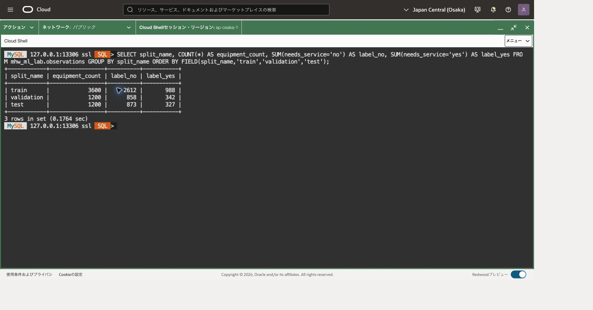
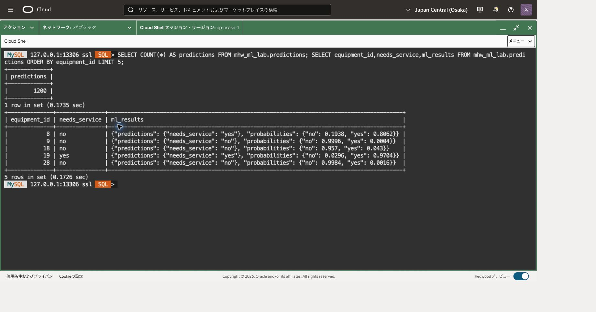

## この章でできること

SQLからモデルを学習し、未知の設備の保守要否を予測します。学習に使わなかった設備で評価し、予測理由を確認します。目的は業務精度の保証ではなく、データ分割からモデル利用までの流れを理解することです。

「特徴」は予測に使う入力項目、「ラベル」は予測したい正解です。ここでは年数や振動などから、保守が必要かを表す`yes` / `no`を予測します。

|データの分け方|役割|
|---|---|
|学習|入力と正解の関係をモデルに学習させる|
|検証|学習に使っていない設備でモデルを点検する|
|テスト|設計を決めた後に最終評価する|

前提条件は次のとおりです。

- [201章](../201-heatwave-analytics/)のDBシステムに接続でき、HeatWaveクラスタが稼働していること。
- MySQL 9.7 LTSを利用し、MySQL ShellのSQLモードで実行できること。
- 演習専用スキーマを作成でき、AutoMLの実行権限があること。
- 同時に大量ロードや他のモデル学習を実行していないこと。

HeatWave.32GB × 1ノードから開始します。メモリ不足の場合は負荷とロード済みデータを確認し、無条件に大きい構成へ変更しないでください。クラスタの稼働・保存領域には費用がかかります。

## Cloud Shellから主DBへ接続する

前章と同じ主DBのMySQL SQLプロンプトが開いている場合、転送や接続を作り直す必要はありません。この節の最後にある版・UUID・TLSのSQL確認から再開します。端末を閉じた場合だけ、以下の接続準備を行います。OSプロンプト（通常は末尾が`$`）にはbashの枠、MySQLの`SQL >`プロンプトにはsqlの枠を入力します。

[101章](../101-create-connect/)で導入したCommunity 26.7.1と検証済みSSHホスト鍵を使います。106章では主DBを削除せず、監視・費用確認までにしてください。大阪の今回の主DBのOCID・現在のprivate IPを照合し、DBがACTIVEで構成変更中ではないことを確認します。

新しいCloud Shell端末では101と同じネットワーク経路を選び、OSプロンプトで次を設定します。大文字の接続先を記録した実値へ置き換え、管理ユーザーを変更した場合はその値も合わせます。

```bash
# 目的: Community版、確認済み鍵、今回の主DBへの転送先を明示する。
MHW_SHELL="$HOME/mysql-shell-community-26.7.1-el8/usr/bin/mysqlsh"
MHW_KNOWN_HOSTS="$HOME/.ssh/mhw-learning-known-hosts"
MHW_KEY="$HOME/.ssh/mhw-learning.key"
MHW_COMPUTE_IP='COMPUTE_PUBLIC_IP'
MHW_OS_USER='opc'
MHW_DB_IP='CURRENT_MAIN_DB_PRIVATE_IP'
MHW_ADMIN='tutorial_admin'
# 目的: 前提ファイルの存在を確認する。失敗時は101章へ戻る。
if test -x "$MHW_SHELL" && test -s "$MHW_KNOWN_HOSTS" && test -f "$MHW_KEY"; then
  echo "前提ファイル: OK"
else
  echo "前提ファイル: NG。ここで止め、101章の配置先を確認してください。"
fi
```

「前提ファイル: OK」の場合だけ、次で待受を確認します。NGの場合は後続の枠を貼り付けません。標準搭載版へ切り替えたりホスト鍵検証を無効化したりしません。

```bash
# 目的: 主DB用13306の既存転送を二重に作らない。
ss -ltn 'sport = :13306'
```

LISTEN行がある場合は、今回の主DBへ向けた転送として記録した制御ソケットの絶対パスを、次の値へ置き換えます。記録がなく対象不明ならここで調べ、別のプロセスを終了したり転送を重ねたりしません。

```bash
# 目的: 再利用する今回の転送の制御ソケットを復元する。
MHW_SOCKET='RECORDED_CONTROL_SOCKET_ABSOLUTE_PATH'
# 目的: 記録したパスが実際にソケットであることを確認する。
if test -S "$MHW_SOCKET"; then
  echo "制御ソケット: OK"
else
  echo "制御ソケット: NG。次の枠を実行せず、記録したパスを確認してください。"
fi
```

LISTEN行がない場合だけ、代わりに次で新しい転送を開始します。既存転送を再利用する場合はこの枠を実行しません。

```bash
# 目的: 専用制御ソケットを用意し、主DBへのloopback限定転送を開始する。
MHW_TUNNEL_DIR=$(mktemp -d /tmp/mhw-tunnel-XXXXXX)
MHW_SOCKET="$MHW_TUNNEL_DIR/control"
ssh -F /dev/null -4 -fN -T -M -S "$MHW_SOCKET" \
  -o StrictHostKeyChecking=yes -o UserKnownHostsFile="$MHW_KNOWN_HOSTS" \
  -o IdentitiesOnly=yes -o ForwardAgent=no -o ExitOnForwardFailure=yes \
  -o ConnectTimeout=10 -o ServerAliveInterval=30 -o ServerAliveCountMax=3 \
  -i "$MHW_KEY" -L "127.0.0.1:13306:$MHW_DB_IP:3306" \
  "$MHW_OS_USER@$MHW_COMPUTE_IP"
```

秘密鍵のパスフレーズを求められたら非表示入力へ入力します。ソケット確認または起動に成功した場合だけ、次の共通確認へ進みます。ソケットパスは後で再利用・終了できるように記録します。

```bash
# 目的: 記録した制御接続とloopback待受を確認する。
ssh -F /dev/null -S "$MHW_SOCKET" -O check "$MHW_OS_USER@$MHW_COMPUTE_IP"
ss -ltn 'sport = :13306'
```

Master runningと127.0.0.1:13306を確認したら、次で制御ソケットの絶対パスを表示し、今回の主DBのIPと一緒に控えます。

```bash
# 目的: 次回の再利用と終了に使う制御ソケットのパスを記録する。
printf '%s\n' "$MHW_SOCKET"
```

確認に失敗した場合は接続せず、転送先と記録を調べます。成功した場合だけ接続します。パスワード値をコマンド引数へ付けません。

```bash
# 目的: 専用Community版で主DBへClassic protocol・TLS・SQLモードで接続する。
"$MHW_SHELL" --mysql --sql --host=127.0.0.1 --port=13306 \
  --user="$MHW_ADMIN" --ssl-mode=REQUIRED --password
```

```sql
-- 目的: 記録した主DBであり、現在のプライマリへ書き込めることを確認する。
SELECT VERSION() AS server_version, @@server_uuid AS server_uuid,
       CURRENT_USER() AS db_account, @@read_only AS read_only,
       @@super_read_only AS super_read_only\G
-- 目的: SQLセッションのTLS暗号化を確認する。
SHOW SESSION STATUS LIKE 'Ssl_cipher';
```

版9.7.2、対象の記録と一致するUUID、両read-only値0、空でないcipherを確認します。HAの切替を行った場合は切替後のUUID記録と照合します。REQUIREDは暗号化を要求しますが、ホスト名の証明書検証を意味しません。以後のSQLはこの接続のSQLモードで実行し、OSコマンドへ戻るときは`\quit`します。

## 1. 接続と権限を確認する

冒頭の接続手順で確認した同じSQLセッションを使います。接続後の権限と実行先を再確認します。

```text
\sql
```

```sql
-- 目的: 操作対象とログインユーザー、書込み可能な主DBであることを確認する。
SELECT VERSION(), @@server_uuid, CURRENT_USER(), @@read_only;
-- 目的: 学習・出力作成に必要な既存権限を確認する。
SHOW GRANTS;
```

DB権限とOCI IAMは別です。入力表にはSELECT/ALTER、出力スキーマには表作成・更新等、sysには必要な参照・ルーチン実行、本人の`ML_SCHEMA_ユーザー名`にはモデル管理権限が必要です。専用スキーマに限定し、不足する場合は管理者に依頼します。本章で新しいDBユーザーを作る必要はありません。[AutoML権限](https://dev.mysql.com/doc/heatwave/en/hw-automl-privileges.html)

## 2. 合成データを生成する

[データ生成SQL](dataset.sql)を開き、最初の既存スキーマ確認を実行します。0行の場合だけ、残りを段階ごとに上から実行してください。末尾のINSERT成功を確認してからCOMMITし、確定後のSELECTを照合します。エラー時は後続を止め、途中まで作られた対象を確認します。同名スキーマの上書きや、ファイル全体の無条件な再実行はしません。

このファイル全体は一つのトランザクションではありません。DDLやautocommitによって途中まで確定するため、最後のROLLBACKだけですべて元に戻るとは限りません。失敗後は各表の状態を確認し、先頭から再実行しないでください。

固定文字列`mhw203-v1`と設備IDから6,000行を生成します。各設備に1行だけあり、年数、稼働時間、温度、振動、保守間隔、設備種別が特徴です。`needs_service`は合成した翌期間の保守要否です。振動は0.1単位の整数で保存しています。現実の故障記録ではありません。

設備IDの余りで学習60%、検証20%、テスト20%に分けます。設備ID、分割名は学習特徴から除外します。ラベル生成規則を使っているため、良いスコアでも現実の保守判断に有効とはいえません。

末尾の確認結果を次と照合します。合計は6,000行、設備数6,000、IDは1〜6,000、分割間の設備重複は0です。

|表|行数|no|yes|
|---|---:|---:|---:|
|train|3,600|2,612|988|
|validation|1,200|858|342|
|test|1,200|873|327|

異なる場合は学習に進みません。この件数は生成規則の期待値であり、学習モデルの精度ではありません。

次の集計では、同じ分布を分割ごとに1行へまとめて確認できます。

```sql
-- 目的: 分割ごとの総設備数とラベル分布を横に並べて検算する。
SELECT split_name, COUNT(*) AS equipment_count,
 SUM(needs_service='no') AS label_no, SUM(needs_service='yes') AS label_yes
FROM mhw_ml_lab.observations GROUP BY split_name
ORDER BY FIELD(split_name,'train','validation','test');
```



## 3. 学習してロードする

モデルハンドルは自動採番させ、表示された値を控えます。セッション切断後は、既存モデルが学習済みであることをモデルカタログで確認し、その値を`@model`に設定します。`SET @model=NULL`と`ML_TRAIN`は再実行しません。学習処理が返らない場合も状態確認を先に行い、重複学習を開始しません。[ML_TRAIN](https://dev.mysql.com/doc/heatwave/en/mys-hwaml-ml-train.html)

```sql
-- 目的: 新しいモデルハンドルを自動生成させる。
SET @model = NULL;
-- 目的: 設備識別子と分割名を除外し、保守要否の二値分類を学習する。
CALL sys.ML_TRAIN('mhw_ml_lab.train', 'needs_service',
 JSON_OBJECT('task','classification',
 'exclude_column_list',JSON_ARRAY('equipment_id','split_name'),
 'optimization_metric','balanced_accuracy'), @model);
```

学習が成功して戻った場合だけ、次でハンドルを表示して控えます。エラーや応答不明の場合は下の中断再開手順を使います。

```sql
-- 目的: 再接続後にも同じモデルを利用できるようハンドルを記録する。
SELECT @model AS model_handle;
```

空でないハンドルを確認した場合だけ、ロードします。

```sql
-- 目的: 学習済みモデルをHeatWaveメモリへロードする。
CALL sys.ML_MODEL_LOAD(@model, NULL);
```


### 接続が切れたときだけ: 既存モデルから再開する

冒頭の主DB接続確認を行い、学習したときと同じDBユーザーでSQLモードへ戻ります。`@model`は接続ごとの変数なので、再接続すると値を引き継ぎません。次は新しい学習を開始しない読取りです。`tutorial_admin`を変更している場合は、カタログ名のユーザー名部分も変更してください。

```sql
-- 目的: 今回の学習表に対応する保存済みモデルと状態を調べる。
SELECT model_handle, model_owner, train_table_name,
       JSON_UNQUOTE(JSON_EXTRACT(model_metadata,'$.status')) AS model_status,
       notes
FROM `ML_SCHEMA_tutorial_admin`.`MODEL_CATALOG`
WHERE train_table_name='mhw_ml_lab.train'\G
```

記録したハンドルと所有者が一致し、状態が`Ready`の行だけを使います。ハンドルを記録できなかった場合は、その学習表の候補が今回の1件だけと確認できたときに限り採用します。候補が複数・0件・状態不明、`Creating`、`Error`の場合はここで止め、管理者と状態やnotesを確認します。学習呼出しは再送しません。[モデルカタログ](https://dev.mysql.com/doc/heatwave/en/mys-hwaml-model-catalog-table.html)、[状態の意味](https://dev.mysql.com/doc/heatwave/en/mys-hwaml-ml-model-metadata.html)

```sql
-- 目的: 確認した既存ハンドルを、この接続の変数へ復元する。
SET @model='RECORDED_MODEL_HANDLE';
SELECT @model AS model_handle;
-- 目的: 本人のロード済みモデルを調べ、二重ロードを避ける。
CALL sys.ML_MODEL_ACTIVE('current',@active_models);
SELECT JSON_PRETTY(@active_models);
```

`RECORDED_MODEL_HANDLE`は確認した実値へ置き換えます。ロード済み一覧に同じハンドルがあればロードせず手順4へ進みます。保存済みモデルがReadyで、一覧にない場合だけ次を実行します。

```sql
-- 目的: 確認済みの既存モデルをロードする。再学習はしない。
CALL sys.ML_MODEL_LOAD(@model,NULL);
```

エラーがないことを確認して手順4へ進みます。メモリ不足なら他用途のモデルを勝手にアンロードせず、負荷を確認します。[ロード済みモデルの確認](https://dev.mysql.com/doc/heatwave/en/mys-hwaml-ml-model-active.html)、[モデルのロード](https://dev.mysql.com/doc/heatwave/en/mys-hwaml-ml-model-load.html)

## 4. 未学習の設備で評価・予測する

Balanced accuracyは各クラスの再現率を平均した指標です。多数派を答えるだけの予測を見抜くため、単純な正解率だけに頼りません。検証結果を見て設計を変える場合も、テスト表は最後の評価まで使いません。この演習では変更せず、そのまま最終評価します。[ML_SCORE](https://dev.mysql.com/doc/heatwave/en/mys-hwaml-ml-score.html)

```sql
-- 目的: 学習に使っていない検証設備で分類性能を評価する。
CALL sys.ML_SCORE('mhw_ml_lab.validation','needs_service',@model,
 'balanced_accuracy',@validation_score,NULL);
-- 目的: 検証スコアがNULLではなく0〜1の値であることを確認する。
SELECT @validation_score AS validation_balanced_accuracy;
-- 目的: モデル選択に使わないテスト設備で最終評価する。
CALL sys.ML_SCORE('mhw_ml_lab.test','needs_service',@model,
 'balanced_accuracy',@test_score,NULL);
-- 目的: 最終評価値を記録する。事前に特定の精度を期待しない。
SELECT @test_score AS test_balanced_accuracy;
```

今回の実行では、検証用が約0.8970、テスト用が約0.9118でした。これはこの合成データと実行時の学習結果の例であり、同じ値になることを合格条件にはしません。ラベル自体を規則で作っているため、現実の設備に対する性能とは区別してください。

次で出力表名の不在を確認します。

```sql
-- 目的: 予測出力の既存表を保護し、呼出し前に衝突を確認する。
SELECT TABLE_NAME FROM information_schema.TABLES
WHERE TABLE_SCHEMA='mhw_ml_lab' AND TABLE_NAME='predictions';
```

0行の場合だけ次へ進みます。存在する場合は既存の件数・内容と前回実行状態を確認します。新たな予測が必要なら未使用の別名を選び、呼出しと後続SELECTの両方を同じ名前へ置換します。既存表を自動削除しません。

```sql
-- 目的: 未使用の出力表名でテスト設備全件の予測を保存する。
CALL sys.ML_PREDICT_TABLE('mhw_ml_lab.test',@model,
 'mhw_ml_lab.predictions',NULL);
-- 目的: 全1200設備の予測が出力されたことを確認する。
SELECT COUNT(*) AS predictions FROM mhw_ml_lab.predictions;
-- 目的: 正解ラベルと予測JSONを並べて読み、予測と正解を区別する。
SELECT equipment_id,needs_service,ml_results
 FROM mhw_ml_lab.predictions ORDER BY equipment_id LIMIT 5;
```

今回の表示例では、設備8の正解ラベルは`no`でしたが、モデルは`yes`と予測しました。JSONの`probabilities`に高い値があっても正解を保証しません。正解ラベルと`predictions`を分けて読み、誤分類も評価対象にします。



出力表が既に存在する場合は、既存結果を確認してから別名を選びます。自動で既存表を削除しません。予測のJSON構造は[ML_PREDICT_TABLE](https://dev.mysql.com/doc/heatwave/en/mys-hwaml-ml-predict-table.html)も参照してください。

## 5. 1設備の予測を説明する

標準の分類学習では、`ML_TRAIN`がPermutation Importanceの説明器も作成します。次の呼出しには、その説明器を持つ学習済みモデルがロードされている必要があります。説明器が利用できないエラーでは学習を繰り返さず、モデル状態を確認します。

```sql
-- 目的: テスト設備1件について、予測へ寄与した特徴を調べる。
SELECT equipment_id, sys.ML_EXPLAIN_ROW(JSON_OBJECT(
 'age_years',age_years,'hours_total',hours_total,
 'temperature_c',temperature_c,'vibration_tenths',vibration_tenths,
 'days_since_service',days_since_service,'equipment_type',equipment_type),
 @model,JSON_OBJECT('prediction_explainer','permutation_importance')) AS explanation
 FROM mhw_ml_lab.test ORDER BY equipment_id LIMIT 1;
```

Permutation Importanceは、特徴の値を入れ替えたときの予測への影響に基づく説明方法です。説明はモデルが利用した関連性であり、故障の因果関係を証明しません。入力の単位と重要な特徴を確認してください。[ML_EXPLAIN_ROW](https://dev.mysql.com/doc/heatwave/en/mys-hwaml-ml-explain-row.html)

## 6. モデルをアンロードして次へ進む

```sql
-- 目的: この演習のモデルが使用するHeatWaveメモリを解放する。
CALL sys.ML_MODEL_UNLOAD(@model);
-- 目的: 本人のロード済みモデルを確認する。
CALL sys.ML_MODEL_ACTIVE('current',@active_models);
-- 目的: 上のモデルハンドルがロード済み一覧から消えたことを確認する。
SELECT JSON_PRETTY(@active_models);
```

アンロードは保存済みモデルや表の削除ではありません。[ML_MODEL_UNLOAD](https://dev.mysql.com/doc/heatwave/en/mys-hwaml-ml-model-unload.html)を確認し、モデルハンドルとスキーマ名を後片付け対象として記録します。[204章](../204-generative-ai/)へ進む場合はDBとクラスタを保持します。全演習終了後は[106章](../106-monitor-cleanup/)へ戻り、モデル・専用データ・クラスタを含めて後片付けします。

この章の達成条件は、学習に使わないデータで評価し、テスト設備1200件の予測と正解を比較し、1設備の説明を確認することです。特定の精度は合格条件にしません。

## 章の移動

[前章](../202-lakehouse-join/) · [次章](../204-generative-ai/)
