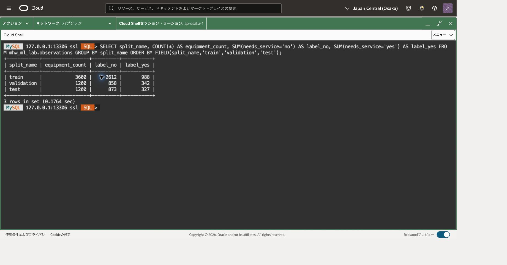
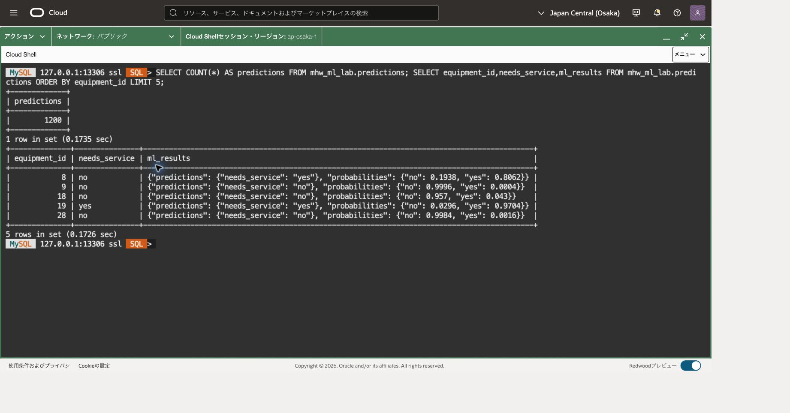

## この章でできること

SQLからモデルを学習し、未知の設備の保守要否を予測します。学習に使わなかった設備で評価し、予測理由を確認します。目的は業務精度の保証ではなく、データ分割からモデル利用までの流れを理解することです。

「特徴」は予測に使う入力項目、「ラベル」は予測したい正解です。ここでは年数や振動などから、保守が必要かを表す`yes` / `no`を予測します。

|データの分け方|役割|
|---|---|
|学習|入力と正解の関係をモデルに学習させる|
|検証|学習に使っていない設備でモデルを点検する|
|テスト|設計を決めた後に最終評価する|

前提条件は次のとおりです。

- [201章](../201-heatwave-analytics/)のDBシステムに接続でき、HeatWaveクラスタが稼働していること。
- MySQL 9.7 LTSを利用し、MySQL ShellのSQLモードで実行できること。
- 演習専用スキーマを作成でき、AutoMLの実行権限があること。
- 同時に大量ロードや他のモデル学習を実行していないこと。

HeatWave.32GB × 1ノードから開始します。メモリ不足の場合は負荷とロード済みデータを確認し、無条件に大きい構成へ変更しないでください。クラスタの稼働・保存領域には費用がかかります。

## 接続を再開する場合だけ

前章の主DB接続が開いていれば、そのまま使います。転送も閉じた場合は[101章](../101-create-connect/)の前面SSHを専用タブで再開し、開いたままにします。SQL用の別タブでは次を実行します。接続先は転送入口です。`--mysql`はClassic protocol、`--sql`はSQLモード、`--ssl-mode=REQUIRED`はTLS必須を指定します。101章で保存した資格情報を使うため、通常はパスワードの再入力はありません。保存していない場合だけ末尾に `--password` を付け、非表示プロンプトへ入力します。

```bash
"$HOME/mysql-shell-community-26.7.1-el8/usr/bin/mysqlsh" --mysql --sql --host=127.0.0.1 --port=13306 \
  --user=tutorial_admin --ssl-mode=REQUIRED
```

SQLで記録済み主DBのUUID、両read-only値0、非空cipherを確認します。不一致なら止めます。OSへ戻る場合だけ `\quit` を実行します。

```sql
SELECT @@server_uuid,@@read_only,@@super_read_only\G
SHOW SESSION STATUS LIKE 'Ssl_cipher';
```

## 1. 接続と権限を確認する

冒頭の接続手順で確認した同じSQLセッションを使います。接続後の権限と実行先を再確認します。

```text
\sql
SHOW GRANTS;
```

DB権限とOCI IAMは別です。入力表にはSELECT/ALTER、出力スキーマには表作成・更新等、sysには必要な参照・ルーチン実行、本人の`ML_SCHEMA_ユーザー名`にはモデル管理権限が必要です。専用スキーマに限定し、不足する場合は管理者に依頼します。本章で新しいDBユーザーを作る必要はありません。[AutoML権限](https://dev.mysql.com/doc/heatwave/en/hw-automl-privileges.html)

## 2. 合成データを生成する

[データ生成SQL](dataset.sql)を開きます。最初のschema検索が0行の場合だけ、まずschemaと4表のCREATEを**1ブロックずつ**実行します。4表の作成を確認したら `START TRANSACTION` から4つのINSERTまでを順に実行し、すべて成功した場合だけ `COMMIT` します。INSERTに失敗した場合は `ROLLBACK` し、学習へ進みません。DDLはトランザクションの前に完了させるため、ROLLBACK後もschemaと空の4表は残ります。ファイル全体を一括sourceしないでください。

schemaがすでにある場合は、次で4表の件数を確認します。期待値どおりならデータ生成を再実行せず、下の検算へ進みます。すべて0件なら `START TRANSACTION` から再開できます。それ以外の部分状態では、ほかの用途のデータがない演習専用schemaであることを確認し、`DROP DATABASE mhw_ml_lab;` で削除してこの節の先頭から作り直します。

```sql
SELECT (SELECT COUNT(*) FROM mhw_ml_lab.observations) AS observations_rows,
       (SELECT COUNT(*) FROM mhw_ml_lab.train) AS train_rows,
       (SELECT COUNT(*) FROM mhw_ml_lab.validation) AS validation_rows,
       (SELECT COUNT(*) FROM mhw_ml_lab.test) AS test_rows;
```

固定文字列`mhw203-v1`と設備IDから6,000行を生成します。各設備に1行だけあり、年数、稼働時間、温度、振動、保守間隔、設備種別が特徴です。`needs_service`は合成した翌期間の保守要否です。振動は0.1単位の整数で保存しています。現実の故障記録ではありません。

設備IDの余りで学習60%、検証20%、テスト20%に分けます。設備ID、分割名は学習特徴から除外します。ラベル生成規則を使っているため、良いスコアでも現実の保守判断に有効とはいえません。

末尾の確認結果を次と照合します。合計は6,000行、設備数6,000、IDは1〜6,000、分割間の設備重複は0です。

|表|行数|no|yes|
|---|---:|---:|---:|
|train|3,600|2,612|988|
|validation|1,200|858|342|
|test|1,200|873|327|

異なる場合は学習に進みません。この件数は生成規則の期待値であり、学習モデルの精度ではありません。

次の集計では、同じ分布を分割ごとに1行へまとめて確認できます。

```sql
SELECT split_name, COUNT(*) AS equipment_count,
 SUM(needs_service='no') AS label_no, SUM(needs_service='yes') AS label_yes
FROM mhw_ml_lab.observations GROUP BY split_name
ORDER BY FIELD(split_name,'train','validation','test');
```



## 3. 学習してロードする

モデルハンドルは学習済みモデルの識別子です。自動採番された値を控えます。セッション切断後は、既存モデルが学習済みであることをモデルカタログで確認し、その値を`@model`に設定します。`SET @model=NULL`と`ML_TRAIN`は再実行しません。学習処理が返らない場合も状態確認を先に行い、重複学習を開始しません。[ML_TRAIN](https://dev.mysql.com/doc/heatwave/en/mys-hwaml-ml-train.html)

```sql
SET @model = NULL;
CALL sys.ML_TRAIN('mhw_ml_lab.train', 'needs_service',
 JSON_OBJECT('task','classification',
 'exclude_column_list',JSON_ARRAY('equipment_id','split_name'),
 'optimization_metric','balanced_accuracy'), @model);
```

学習が成功して戻った場合だけ、次でハンドルを表示して控えます。エラーや応答不明の場合は下の中断再開手順を使います。

```sql
SELECT @model AS model_handle;
```

空でないハンドルを確認した場合だけ、ロードします。

```sql
CALL sys.ML_MODEL_LOAD(@model, NULL);
```

## 4. 未学習の設備で評価・予測する

この節以降は`@model`に手順3のハンドルが入っていることが前提です。再接続した場合は末尾の復旧手順で復元し、NULLや別モデルなら呼び出しません。

```sql
SELECT @model AS model_handle;
```

Balanced accuracyは各クラスの再現率を平均した指標です。多数派を答えるだけの予測を見抜くため、単純な正解率だけに頼りません。検証結果を見て設計を変える場合も、テスト表は最後の評価まで使いません。この演習では変更せず、そのまま最終評価します。[ML_SCORE](https://dev.mysql.com/doc/heatwave/en/mys-hwaml-ml-score.html)

```sql
CALL sys.ML_SCORE('mhw_ml_lab.validation','needs_service',@model,
 'balanced_accuracy',@validation_score,NULL);
SELECT @validation_score AS validation_balanced_accuracy;
CALL sys.ML_SCORE('mhw_ml_lab.test','needs_service',@model,
 'balanced_accuracy',@test_score,NULL);
SELECT @test_score AS test_balanced_accuracy;
```

今回の実行では、検証用が約0.8970、テスト用が約0.9118でした。これはこの合成データと実行時の学習結果の例であり、同じ値になることを合格条件にはしません。ラベル自体を規則で作っているため、現実の設備に対する性能とは区別してください。

次で出力表名の不在を確認します。

```sql
SELECT TABLE_NAME FROM information_schema.TABLES
WHERE TABLE_SCHEMA='mhw_ml_lab' AND TABLE_NAME='predictions';
```

0行の場合だけ次へ進みます。存在する場合は既存の件数・内容と前回実行状態を確認します。新たな予測が必要なら未使用の別名を選び、呼出しと後続SELECTの両方を同じ名前へ置換します。既存表を自動削除しません。

```sql
CALL sys.ML_PREDICT_TABLE('mhw_ml_lab.test',@model,
 'mhw_ml_lab.predictions',NULL);
SELECT COUNT(*) AS predictions FROM mhw_ml_lab.predictions;
SELECT equipment_id,needs_service,ml_results
 FROM mhw_ml_lab.predictions ORDER BY equipment_id LIMIT 5;
```



## 5. 1設備の予測を説明する

標準の分類学習では、`ML_TRAIN`がPermutation Importanceの説明器も作成します。次の呼出しには、その説明器を持つ学習済みモデルがロードされている必要があります。説明器が利用できないエラーでは学習を繰り返さず、モデル状態を確認します。

```sql
SELECT equipment_id, sys.ML_EXPLAIN_ROW(JSON_OBJECT(
 'age_years',age_years,'hours_total',hours_total,
 'temperature_c',temperature_c,'vibration_tenths',vibration_tenths,
 'days_since_service',days_since_service,'equipment_type',equipment_type),
 @model,JSON_OBJECT('prediction_explainer','permutation_importance')) AS explanation
 FROM mhw_ml_lab.test ORDER BY equipment_id LIMIT 1;
```

Permutation Importanceは、特徴の値を入れ替えたときの予測への影響に基づく説明方法です。説明はモデルが利用した関連性であり、故障の因果関係を証明しません。入力の単位と重要な特徴を確認してください。[ML_EXPLAIN_ROW](https://dev.mysql.com/doc/heatwave/en/mys-hwaml-ml-explain-row.html)

## 6. モデルをアンロードして次へ進む

```sql
CALL sys.ML_MODEL_UNLOAD(@model);
CALL sys.ML_MODEL_ACTIVE('current',@active_models);
SELECT JSON_PRETTY(@active_models);
```

アンロードは保存済みモデルや表の削除ではありません。[ML_MODEL_UNLOAD](https://dev.mysql.com/doc/heatwave/en/mys-hwaml-ml-model-unload.html)を確認し、モデルハンドルとスキーマ名を後片付け対象として記録します。[204章](../204-generative-ai/)へ進む場合はDBとクラスタを保持します。全演習終了後は[106章](../106-monitor-cleanup/)へ戻り、モデル・専用データ・クラスタを含めて後片付けします。

この章の達成条件は、学習に使わないデータで評価し、テスト設備1200件の予測と正解を比較し、1設備の説明を確認することです。特定の精度は合格条件にしません。

## 中断からの再開

### 接続が切れたときだけ: 既存モデルから再開する

冒頭の主DB接続確認を行い、学習したときと同じDBユーザーでSQLモードへ戻ります。`@model`は接続ごとの変数なので、再接続すると値を引き継ぎません。次は新しい学習を開始しない読取りです。`tutorial_admin`を変更している場合は、カタログ名のユーザー名部分も変更してください。

```sql
SELECT model_handle, model_owner, train_table_name,
       JSON_UNQUOTE(JSON_EXTRACT(model_metadata,'$.status')) AS model_status,
       notes
FROM `ML_SCHEMA_tutorial_admin`.`MODEL_CATALOG`
WHERE train_table_name='mhw_ml_lab.train'\G
```

記録したハンドルと所有者が一致し、状態が`Ready`の行だけを使います。ハンドルを記録できなかった場合は、その学習表の候補が今回の1件だけと確認できたときに限り採用します。候補が複数・0件・状態不明、`Creating`、`Error`の場合はここで止め、管理者と状態やnotesを確認します。学習呼出しは再送しません。[モデルカタログ](https://dev.mysql.com/doc/heatwave/en/mys-hwaml-model-catalog-table.html)、[状態の意味](https://dev.mysql.com/doc/heatwave/en/mys-hwaml-ml-model-metadata.html)

```sql
SET @model='RECORDED_MODEL_HANDLE';
SELECT @model AS model_handle;
CALL sys.ML_MODEL_ACTIVE('current',@active_models);
SELECT JSON_PRETTY(@active_models);
```

`RECORDED_MODEL_HANDLE`は確認した実値へ置き換えます。ロード済み一覧に同じハンドルがあればロードせず手順4へ進みます。保存済みモデルがReadyで、一覧にない場合だけ次を実行します。

```sql
CALL sys.ML_MODEL_LOAD(@model,NULL);
```

エラーがないことを確認して手順4へ進みます。メモリ不足なら他用途のモデルを勝手にアンロードせず、負荷を確認します。[ロード済みモデルの確認](https://dev.mysql.com/doc/heatwave/en/mys-hwaml-ml-model-active.html)、[モデルのロード](https://dev.mysql.com/doc/heatwave/en/mys-hwaml-ml-model-load.html)

## 章の移動

[前章](../202-lakehouse-join/) · [次章](../204-generative-ai/)
