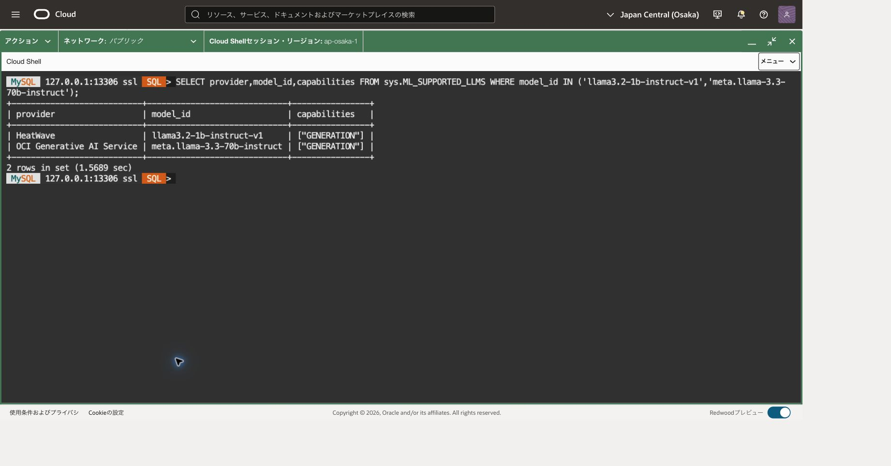

## この章でできること

同じSQL関数から、HeatWave内の言語モデルとOCI Generative AIのモデルを指定して短いメモを要約します。出力の違いだけでなく、どこで処理され、どの権限と費用が必要かを比較します。RAG、埋め込み、外部文書の取込みは扱いません。

モデルIDは呼び出すモデルの識別子、providerはその提供元です。「トークン」はモデルが扱う文字列の単位で、文字数や単語数と必ずしも一致しません。

前提条件は次のとおりです。

- [201章](../201-heatwave-analytics/)と[202章](../202-lakehouse-join/)のHeatWaveクラスタが稼働し、Lakehouseが有効であること。
- MySQL 9.7 LTSの主DBへ接続し、必要なsysルーチンを実行できること。
- [203章](../203-automl/)のモデルをアンロードし、学習や大量ロードを同時に実行していないこと。
- OCI側モデルの利用前に、送信先、入力内容、IAM、課金先を確認できること。

32GB構成のin-databaseモデル候補は`llama3.2-1b-instruct-v1`と`llama3.2-3b-instruct-v1`です。実際に表示される対応モデルを選びます。小型モデルの対応言語を踏まえ、入力・出力は英語にします。[対応モデル](https://dev.mysql.com/doc/heatwave/en/mys-hw-genai-supported-models.html)、[要件](https://dev.mysql.com/doc/heatwave/en/mys-hw-genai-requirements.html)

## Cloud Shellから主DBへ接続する

前章と同じ主DBのMySQL SQLプロンプトが開いている場合、転送や接続を作り直す必要はありません。この節の最後にある版・UUID・TLSのSQL確認から再開します。端末を閉じた場合だけ、以下の接続準備を行います。OSプロンプト（通常は末尾が`$`）にはbashの枠、MySQLの`SQL >`プロンプトにはsqlの枠を入力します。

[101章](../101-create-connect/)で導入したCommunity 26.7.1と検証済みSSHホスト鍵を使います。106章では主DBを削除せず、監視・費用確認までにしてください。大阪の今回の主DBのOCID・現在のprivate IPを照合し、DBがACTIVEで構成変更中ではないことを確認します。

新しいCloud Shell端末では101と同じネットワーク経路を選び、OSプロンプトで次を設定します。大文字の接続先を記録した実値へ置き換え、管理ユーザーを変更した場合はその値も合わせます。

```bash
# 目的: Community版、確認済み鍵、今回の主DBへの転送先を明示する。
MHW_SHELL="$HOME/mysql-shell-community-26.7.1-el8/usr/bin/mysqlsh"
MHW_KNOWN_HOSTS="$HOME/.ssh/mhw-learning-known-hosts"
MHW_KEY="$HOME/.ssh/mhw-learning.key"
MHW_COMPUTE_IP='COMPUTE_PUBLIC_IP'
MHW_OS_USER='opc'
MHW_DB_IP='CURRENT_MAIN_DB_PRIVATE_IP'
MHW_ADMIN='tutorial_admin'
# 目的: 前提ファイルの存在を確認する。失敗時は101章へ戻る。
if test -x "$MHW_SHELL" && test -s "$MHW_KNOWN_HOSTS" && test -f "$MHW_KEY"; then
  echo "前提ファイル: OK"
else
  echo "前提ファイル: NG。ここで止め、101章の配置先を確認してください。"
fi
```

「前提ファイル: OK」の場合だけ、次で待受を確認します。NGの場合は後続の枠を貼り付けません。標準搭載版へ切り替えたりホスト鍵検証を無効化したりしません。

```bash
# 目的: 主DB用13306の既存転送を二重に作らない。
ss -ltn 'sport = :13306'
```

LISTEN行がある場合は、今回の主DBへ向けた転送として記録した制御ソケットの絶対パスを、次の値へ置き換えます。記録がなく対象不明ならここで調べ、別のプロセスを終了したり転送を重ねたりしません。

```bash
# 目的: 再利用する今回の転送の制御ソケットを復元する。
MHW_SOCKET='RECORDED_CONTROL_SOCKET_ABSOLUTE_PATH'
# 目的: 記録したパスが実際にソケットであることを確認する。
if test -S "$MHW_SOCKET"; then
  echo "制御ソケット: OK"
else
  echo "制御ソケット: NG。次の枠を実行せず、記録したパスを確認してください。"
fi
```

LISTEN行がない場合だけ、代わりに次で新しい転送を開始します。既存転送を再利用する場合はこの枠を実行しません。

```bash
# 目的: 専用制御ソケットを用意し、主DBへのloopback限定転送を開始する。
MHW_TUNNEL_DIR=$(mktemp -d /tmp/mhw-tunnel-XXXXXX)
MHW_SOCKET="$MHW_TUNNEL_DIR/control"
ssh -F /dev/null -4 -fN -T -M -S "$MHW_SOCKET" \
  -o StrictHostKeyChecking=yes -o UserKnownHostsFile="$MHW_KNOWN_HOSTS" \
  -o IdentitiesOnly=yes -o ForwardAgent=no -o ExitOnForwardFailure=yes \
  -o ConnectTimeout=10 -o ServerAliveInterval=30 -o ServerAliveCountMax=3 \
  -i "$MHW_KEY" -L "127.0.0.1:13306:$MHW_DB_IP:3306" \
  "$MHW_OS_USER@$MHW_COMPUTE_IP"
```

秘密鍵のパスフレーズを求められたら非表示入力へ入力します。ソケット確認または起動に成功した場合だけ、次の共通確認へ進みます。ソケットパスは後で再利用・終了できるように記録します。

```bash
# 目的: 記録した制御接続とloopback待受を確認する。
ssh -F /dev/null -S "$MHW_SOCKET" -O check "$MHW_OS_USER@$MHW_COMPUTE_IP"
ss -ltn 'sport = :13306'
```

Master runningと127.0.0.1:13306を確認したら、次で制御ソケットの絶対パスを表示し、今回の主DBのIPと一緒に控えます。

```bash
# 目的: 次回の再利用と終了に使う制御ソケットのパスを記録する。
printf '%s\n' "$MHW_SOCKET"
```

確認に失敗した場合は接続せず、転送先と記録を調べます。成功した場合だけ接続します。パスワード値をコマンド引数へ付けません。

```bash
# 目的: 専用Community版で主DBへClassic protocol・TLS・SQLモードで接続する。
"$MHW_SHELL" --mysql --sql --host=127.0.0.1 --port=13306 \
  --user="$MHW_ADMIN" --ssl-mode=REQUIRED --password
```

```sql
-- 目的: 記録した主DBであり、現在のプライマリへ書き込めることを確認する。
SELECT VERSION() AS server_version, @@server_uuid AS server_uuid,
       CURRENT_USER() AS db_account, @@read_only AS read_only,
       @@super_read_only AS super_read_only\G
-- 目的: SQLセッションのTLS暗号化を確認する。
SHOW SESSION STATUS LIKE 'Ssl_cipher';
```

版9.7.2、対象の記録と一致するUUID、両read-only値0、空でないcipherを確認します。HAの切替を行った場合は切替後のUUID記録と照合します。REQUIREDは暗号化を要求しますが、ホスト名の証明書検証を意味しません。以後のSQLはこの接続のSQLモードで実行し、OSコマンドへ戻るときは`\quit`します。

## 1. 実行先と費用を確認する

|方式|処理先|追加確認|
|---|---|---|
|in-database LLM|HeatWave内のモデル|対応shape、空きメモリ、モデルID。OCI LLM向けIAMは不要|
|OCI LLM|OCI Generative AIの選択モデル|対応リージョン・提供モード、DBのresource principal、送信データ、モデル別課金|

SQLクライアントは101章のCloud Shellと転送専用SSH接続を再利用します。OCI LLMへの呼出しはCloud ShellのAPIキーではなく、DBからのサービス認証を使います。SQLのTLS接続と、DBから推論サービスへの通信は別の経路です。OCIサービスを利用することを「入力がDB内から出ない」と説明してはいけません。

HeatWave.32GB × 1は16GB単位の2 capacity-hours/時です。例えば2時間で4 capacity-hoursとなり、DB・ストレージ料金は別です。OCIモデルは選択モデルの入力・出力トークン等の現行SKUで見積もります。契約単価、通貨、税で金額は変わります。[価格表](https://www.oracle.com/cloud/price-list/)

この演習は基本2回、失敗・やり直しを含め生成呼出し合計5回まで、出力上限128トークンにします。これは作業上の上限であり、サービスの課金上限設定ではありません。結果不明の呼出しも1回と数え、無条件再試行しません。

## 2. 使用できるモデルを確認する

```text
\sql
```

```sql
-- 目的: 操作対象と実行ユーザーを確認する。
SELECT VERSION(),@@server_uuid,CURRENT_USER();
-- 目的: 実DBが公開するモデルIDとproviderを確認する。生成は行わない。
SELECT * FROM sys.ML_SUPPORTED_LLMS;
-- 目的: OCIサービス呼出しの課金先設定を確認する。変更は行わない。
SHOW VARIABLES LIKE 'rapid_ml_genai%';
```

in-databaseは一覧のproviderが該当する行から、現在のshapeで使えるモデルを選びます。OCIモデルは一覧だけで決めず、[OCIのモデル・リージョン表](https://docs.oracle.com/en-us/iaas/Content/generative-ai/model-endpoint-regions.htm)と照合し、大阪のon-demand対応、モデルID、廃止予定を確認します。大阪で提供されるすべてのモデルがHeatWaveから利用できるわけではありません。候補`meta.llama-3.3-70b-instruct`が両方で確認できなければ、そのまま実行しません。

選んだ2つのmodel_idとprovider、リージョン、課金コンパートメントを記録してください。別リージョンや外部ホスト型モデルへ無断で切り替えません。

今回の候補2件だけを表示するには、次の読取りSQLを使います。行が返ることは、IAMや課金先設定まで正しいことを保証しません。

```sql
-- 目的: 選択した2モデルの処理先と生成機能を一覧と照合する。
SELECT provider,model_id,capabilities FROM sys.ML_SUPPORTED_LLMS
WHERE model_id IN ('llama3.2-1b-instruct-v1','meta.llama-3.3-70b-instruct');
```



## 3. OCI LLM用ポリシーを用意する

最初に、対象DBのresource principalに対する既存許可を確認します。既存の許可で利用できるなら、動的グループやポリシーを重複作成しません。以下は不足時にIAM管理者が検討する構成例です。次の`DB_OCID`を主DBのOCIDに置き換えます。

```text
ALL {resource.type = 'mysqldbsystem', resource.id = 'DB_OCID'}
```

`IdentityDomainName`、`GroupName`、`CompartmentName`を実環境に合わせ、課金に使うコンパートメント内へ権限を限定します。

```text
Allow dynamic-group IdentityDomainName/GroupName to use generative-ai-chat in compartment CompartmentName
Allow dynamic-group IdentityDomainName/GroupName to inspect generative-ai-model in compartment CompartmentName
```

今回は埋め込みを呼び出さないため、`generative-ai-text-embedding`を追加しません。DBを作れる権限とIAMポリシーを編集できる権限は別です。既存許可を確認し、不要なtenancy全体の権限を追加しないでください。[公式サービス認証手順](https://dev.mysql.com/doc/heatwave/en/mys-hw-genai-authenticate-service.html)、[動的グループの条件](https://docs.oracle.com/en-us/iaas/Content/Identity/dynamicgroups/Writing_Matching_Rules_to_Define_Dynamic_Groups.htm)

DBの既定課金先と許可対象コンパートメントが一致することを確認します。この演習では別課金先へ変更しません。既存許可が不足し、新しいIAM設定を行わない場合はOCI経路を未実施として区別します。in-databaseの成功をOCI経路の成功として扱いません。

## 4. 同じ架空メモを2モデルへ渡す

両モデルを同じ呼出し形式で比較するため、`task`は`generation`を使います。`summarization`タスクはin-databaseモデル専用です。

次の入力には個人情報、実設備、パスワードを含めません。実業務データに置き換える前に、送信可否とサービス利用条件を別途確認してください。2つのモデル変数は手順2で確認した正確なIDに置き換えます。

```sql
-- 目的: 確認済みin-databaseモデルを明示する。候補を無条件に採用しない。
SET @local_model = 'CONFIRMED_IN_DATABASE_MODEL_ID';
-- 目的: 大阪で利用できる確認済みOCIモデルを明示する。
SET @oci_model = 'CONFIRMED_OCI_MODEL_ID';
-- 目的: 両モデルで共通の、英語による架空入力を固定する。
SET @prompt = CONCAT(
 'Summarize this fictional maintenance note in three short bullet points: ',
 'observations, action taken, and next check. Do not add facts. ',
 'Pump P-17 showed a temperature of 72 C and vibration of 4.2 mm/s at 09:00. ',
 'The technician cleaned the cooling filter at 09:20. ',
 'At 09:40 the temperature was 63 C and vibration was 3.8 mm/s. ',
 'A follow-up inspection is scheduled for tomorrow at 09:00.');
-- 目的: モデル送信前に入力文と選択したIDを最終確認する。
SELECT @local_model,@oci_model,@prompt;
```

呼出し記録に「1回目・in-database」を記入し、次を1回だけ実行します。

```sql
-- 目的: HeatWave内のモデルで要約し、表示のたびに再生成しないよう結果を保存する。
SET @local_result = sys.ML_GENERATE(@prompt,JSON_OBJECT(
 'task','generation','model_id',@local_model,'language','en',
 'temperature',0,'max_tokens',128));
-- 目的: 保存済みの応答を表示する。追加のモデル呼出しは行わない。
SELECT JSON_PRETTY(@local_result) AS in_database_result;
```

OCIの送信先・IAM・課金先を確認できたら、記録に「2回目・OCI」を記入して実行します。

```sql
-- 目的: 同じ架空メモを指定OCIモデルへ送り、要約結果を保存する。
SET @oci_result = sys.ML_GENERATE(@prompt,JSON_OBJECT(
 'task','generation','model_id',@oci_model,'language','en',
 'temperature',0,'max_tokens',128));
-- 目的: 保存済みのOCI応答を表示する。追加のモデル呼出しは行わない。
SELECT JSON_PRETTY(@oci_result) AS oci_result;
```

`temperature=0`でも完全な再現性は保証しません。応答JSONのエラー、所要時間、利用可能ならトークン情報も記録します。128トークンで途切れた場合も呼出しを数え、出力上限を無断で増やしません。[ML_GENERATE](https://dev.mysql.com/doc/heatwave/en/mys-hwgenai-ml-generate.html)

## 5. 結果と方式を比較する

両方の出力で、温度72→63、振動4.2→3.8、フィルター清掃、翌日09:00の確認予定が正しいかを点検します。故障原因や安全性の断定など、入力にない記述は誤りとして扱います。短いメモ1件の結果だけでモデル全体の優劣を判断しません。

2026年9月19日（日本時間）の実行例では、`llama3.2-1b-instruct-v1`と`meta.llama-3.3-70b-instruct`を各1回呼び出し、両方からエラーのない応答を取得しました。ただし、要約に残った情報は異なりました。

|実行したモデル|今回の要約で確認できた内容|
|---|---|
|in-database：`llama3.2-1b-instruct-v1`|温度72→63、清掃、翌日09:00の予定を保持。観測・清掃時刻も記載した一方、振動4.2→3.8は省略|
|OCI：`meta.llama-3.3-70b-instruct`|温度と振動の4つの数値、清掃、翌日09:00の予定を保持。観測・清掃時刻は省略|

APIの成功は、必要な情報をすべて含む要約であることを保証しません。省略された情報が用途にとって重要なら、その出力をそのまま採用しないでください。この例は当時の環境で得た1回ずつの結果であり、モデルの一般的な優劣や今後の利用可能性を示すものではありません。同じ入力と`temperature=0`でも同一の出力は保証されません。

入力をHeatWave内で処理したい、対応する小型モデルで足りる場合はin-databaseを検討します。OCIで提供されるモデルの能力が必要な場合は、送信先・権限・追加費用を含めてOCI経路を検討します。どちらも出力の検証が必要です。

完了したら[106章](../106-monitor-cleanup/)に戻り、演習専用のIAM設定・データと、不要になったDB/HeatWaveクラスタ等を後片付けします。共有ポリシーや他用途のモデル、共用ネットワークを削除しません。呼出しを止めるだけではクラスタや保存領域の課金がすべて止まるわけではありません。

この章の達成条件は、選んだ2つの経路の応答を確認し、元のメモから残った情報・省略された情報を区別して、用途に合う方式を説明できることです。OCI経路を実施しなかった場合は、その範囲を区別して記録します。

## 章の移動

[前章](../203-automl/) · [全演習の後片付け](../106-monitor-cleanup/)
