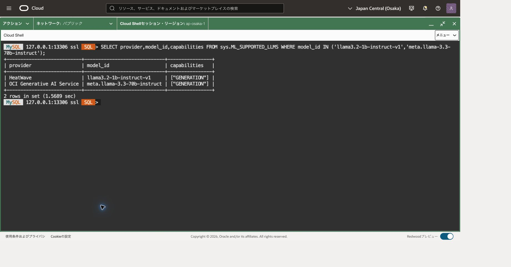

同じSQL関数から、HeatWave内の言語モデルとOCI Generative AIのモデルを指定して短いメモを要約します。出力の違いだけでなく、どこで処理され、どの権限と費用が必要かを比較します。RAG、埋め込み、外部文書の取込みは扱いません。

前提条件は次のとおりです。

- [201章](../201-heatwave-analytics/)と[202章](../202-lakehouse-join/)のHeatWaveクラスタが稼働し、Lakehouseが有効であること。
- MySQL 9.7 LTSの主DBへ接続し、必要なsysルーチンを実行できること。
- [203章](../203-automl/)のモデルをアンロードし、学習や大量ロードを同時に実行していないこと。
- OCI側モデルの利用前に、送信先、入力内容、IAM、課金先を確認できること。

32GBで使えるモデルを[公式対応表](https://dev.mysql.com/doc/heatwave/en/mys-hw-genai-supported-models.html)と実DBで照合します。小型モデルの対応言語に合わせて英語を使います。

接続が閉じていれば[101章](../101-create-connect/)の手順4で前面転送とSQL接続を再開し、UUIDとTLSを照合します。同じ主DBの接続が開いていれば、そのままモデル確認へ進みます。

## 1. 実行先と費用を確認する

|方式|処理先|追加確認|
|---|---|---|
|in-database LLM|HeatWave内のモデル|対応shape、空きメモリ、モデルID。OCI LLM向けIAMは不要|
|OCI LLM|OCI Generative AIの選択モデル|対応リージョン・提供モード、DBのresource principal、送信データ、モデル別課金|

OCI LLMはDBのresource principalでサービスを呼びます。Cloud ShellのAPIキーは不要ですが、入力はDB外のOCIサービスへ送られます。

HeatWave.32GB × 1は16GB単位の2 capacity-hours/時です。例えば2時間で4 capacity-hoursとなり、DB・ストレージ料金は別です。OCIモデルは選択モデルの入力・出力トークン等の現行SKUで見積もります。契約単価、通貨、税で金額は変わります。[価格表](https://www.oracle.com/cloud/price-list/)

基本は各経路1回、出力上限128トークンです。失敗・結果不明も呼出し済みと数え、再送しません。

## 2. 使用できるモデルを確認する

```text
\sql
```

```sql
-- 目的: OCIサービス呼出しの課金先設定を確認する。変更は行わない。
SHOW VARIABLES LIKE 'rapid_ml_genai%';
```

in-databaseは一覧のproviderが該当する行から、現在のshapeで使えるモデルを選びます。OCIモデルは一覧だけで決めず、[OCIのモデル・リージョン表](https://docs.oracle.com/en-us/iaas/Content/generative-ai/model-endpoint-regions.htm)と照合し、大阪のon-demand対応、モデルID、廃止予定を確認します。大阪で提供されるすべてのモデルがHeatWaveから利用できるわけではありません。候補`meta.llama-3.3-70b-instruct`が両方で確認できなければ、そのまま実行しません。

```sql
-- 目的: 選択した2モデルの処理先と生成機能を一覧と照合する。
SELECT provider,model_id,capabilities FROM sys.ML_SUPPORTED_LLMS
WHERE model_id IN ('llama3.2-1b-instruct-v1','meta.llama-3.3-70b-instruct');
```



## 3. OCI LLM用ポリシーを用意する

最初に、対象DBのresource principalに対する既存許可を確認します。既存の許可で利用できるなら、動的グループやポリシーを重複作成しません。以下は不足時にIAM管理者が検討する構成例です。次の`DB_OCID`を主DBのOCIDに置き換えます。

```text
ALL {resource.type = 'mysqldbsystem', resource.id = 'DB_OCID'}
```

`IdentityDomainName`、`GroupName`、`CompartmentName`を実環境に合わせ、課金に使うコンパートメント内へ権限を限定します。

```text
Allow dynamic-group IdentityDomainName/GroupName to use generative-ai-chat in compartment CompartmentName
Allow dynamic-group IdentityDomainName/GroupName to inspect generative-ai-model in compartment CompartmentName
```

今回は埋め込みを呼び出さないため、`generative-ai-text-embedding`を追加しません。DBを作れる権限とIAMポリシーを編集できる権限は別です。既存許可を確認し、不要なtenancy全体の権限を追加しないでください。[公式サービス認証手順](https://dev.mysql.com/doc/heatwave/en/mys-hw-genai-authenticate-service.html)、[動的グループの条件](https://docs.oracle.com/en-us/iaas/Content/Identity/dynamicgroups/Writing_Matching_Rules_to_Define_Dynamic_Groups.htm)

DBの課金先と許可区画を照合し、別の課金先には変更しません。IAM不足ならOCI経路は未実施とします。

## 4. 同じプロンプトと保存先を用意する

「プロンプト」はモデルへ渡す指示と入力文です。この章では架空の保守メモだけを使います。実設備・個人情報・秘密は入力しません。同じファイルを2経路で使い、応答を保存することで、比較のためだけに再生成しないようにします。

MySQL Shellを終了し、OSで固定の専用領域を初回だけ作ります。既存なら中止して末尾の状態判定へ進みます。umask 077は自分だけが読める設定です。

```text
\quit
```

```bash
umask 077
(
  set -eu
  test ! -e "$HOME/mhw204-work"
  mkdir -m 700 "$HOME/mhw204-work"
  printf '%s' 'Summarize this fictional maintenance note in three short bullet points: observations, action taken, and next check. Do not add facts. Pump P-17 showed a temperature of 72 C and vibration of 4.2 mm/s at 09:00. The technician cleaned the cooling filter at 09:20. At 09:40 the temperature was 63 C and vibration was 3.8 mm/s. A follow-up inspection is scheduled for tomorrow at 09:00.' > "$HOME/mhw204-work/prompt.txt"
  cd "$HOME/mhw204-work"
  sha256sum prompt.txt > prompt.sha256
  : > ledger.tsv
  printf '保存先: %s\n' "$HOME/mhw204-work"
)
```

同じ入力をSHA-256で照合します。OSで以下を使ってJSモードへ接続します。json/rawは改行区切りの結果JSONで、json=offは全出力のJSONラップを無効化します。

```bash
"$HOME/mysql-shell-community-26.7.1-el8/usr/bin/mysqlsh" --mysql --js --host=127.0.0.1 --port=13306 \
  --user=tutorial_admin --ssl-mode=REQUIRED \
  --json=off --result-format=json/raw
```

JSモードで、現在のDB UUIDを照合してから同じ入力を読み込みます。OS環境変数は接続前に設定しておく必要があります。`os.loadTextFile` はファイルを読み、`?` の束縛で入力をSQL文字列として安全に渡します。

```javascript
var prompt204;
(function () {
var work = os.getenv('HOME') + '/mhw204-work';
if (!work || !os.path.isfile(work + '/prompt.txt')) throw new Error('Restore the recorded directory');
if (session.runSql('SELECT @@server_uuid').fetchOne()[0] !== 'RECORDED_MAIN_UUID') throw new Error('Wrong DB');
prompt204 = os.loadTextFile(work + '/prompt.txt');
if (!prompt204 || prompt204.indexOf('Pump P-17') < 0) throw new Error('Unexpected prompt');
session.runSql('SET @prompt = ?', [prompt204]);
})();
```

### 4.1 生成を行わず保存方法を試す

`\pager` はSQL結果を外部コマンドへ渡します。ここではOSの `tee` で画面とファイルへ同じ内容を出します。`set -C` は既存ファイルの上書きを拒否します。保存に失敗しても生成を再送してはいけません。まず固定の架空値で試します。[公式pager](https://dev.mysql.com/doc/mysql-shell/26.7/en/mysql-shell-using-pager.html)、[JSON出力形式](https://dev.mysql.com/doc/mysql-shell/26.7/en/mysqlsh.html)

固定値を1行返すだけで、モデルは呼び出しません。

```text
\sql
\pager bash -c 'set -C; tee /dev/stderr > "$HOME/mhw204-work/save-test.ndjson"'
SELECT 'fictional-save-test' AS saved_value;
```

次にpagerを解除して、JSで保存した結果を読み戻します。表示に色付けや付加行が混ざってJSONとして読めなければ停止し、設定を確認します。

```text
\nopager
\js
```

```javascript
(function () {
var text = os.loadTextFile(os.getenv('HOME') + '/mhw204-work' + '/save-test.ndjson').trim();
var rows = text.split(/\r?\n/).filter(function (line) { return line.trim().length > 0; });
if (rows.length !== 1 || JSON.parse(rows[0]).saved_value !== 'fictional-save-test') throw new Error('Save/read-back mismatch; do not generate');
print('SAVE_READBACK_PASS');
})();
```

`SAVE_READBACK_PASS` を確認した場合だけ次へ進みます。このテストが成功しない環境で生成を開始しません。

## 5. 各経路を1回ずつ実行して保存する

`task:generation` は両経路共通、`language:en` は英語、`temperature:0` はばらつきを抑える指定、`max_tokens:128` は出力上限です。完全な再現性は保証されません。`summarization` はin-database専用なので、この比較には使いません。

### 5.1 in-database LLM

最初にMySQL Shellを終了し、OSで送信前台帳を記録します。これは送信の予約で、まだ生成はしません。mkdirは同じcall IDの二重使用を拒否します。ハッシュ一致・台帳書込み・読戻しが成功して **ATTEMPT_RECORDED** が出たときだけ接続します。途中で失敗したら記録を調べ、同じ呼出しを再送しません。

```text
\quit
```

```bash
(
  set -eu
  cd "$HOME/mhw204-work"
  sha256sum --check prompt.sha256
  test -s save-test.ndjson
  mkdir local-001
  printf 'local-001\tin-database\tllama3.2-1b-instruct-v1\t%s\tgeneration,en,0,128\t1\tattempted\n' \
    "$(awk '{print $1}' prompt.sha256)" > local-001/attempt.tsv
  cat local-001/attempt.tsv >> ledger.tsv
  cmp -s local-001/attempt.tsv <(tail -n 1 ledger.tsv)
  printf '%s\n' ATTEMPT_RECORDED
)
```

手順4のJS接続コマンドとUUID照合・@prompt設定を再実行します。生成はまだしません。

ATTEMPT_RECORDEDが出た場合だけ、次の生成SQLを1回実行します。失敗や応答不明なら再送しません。

```text
\sql
\pager bash -c 'set -C; tee /dev/stderr > "$HOME/mhw204-work/local-001/response.ndjson"'
```

同じ保守メモをHeatWave内で生成し、応答JSONを1列で返します。

```sql
SELECT sys.ML_GENERATE(@prompt, JSON_OBJECT(
  'task','generation','model_id','llama3.2-1b-instruct-v1','language','en',
  'temperature',0,'max_tokens',128)) AS response;
\nopager
\quit
```

OSで結果が非空、1行のJSONとして読め、responseを含むことを検査してcompletedを追記します。これは応答受領の記録です。APIエラーの有無と要約品質は、responseの内容を読んで別に判定します。

```bash
(
  set -eu
  cd "$HOME/mhw204-work"
  test -s local-001/response.ndjson
  python3 -c 'import json,pathlib; p=pathlib.Path("local-001/response.ndjson"); r=[json.loads(x) for x in p.read_text().splitlines() if x.strip()]; assert len(r)==1 and r[0].get("response") is not None; print(r[0]["response"])'
  test ! -e local-001/completed.tsv
  (set -C; printf 'local-001\tcompleted\n' > local-001/completed.tsv)
  cat local-001/completed.tsv >> ledger.tsv
  printf '%s\n' LOCAL_RESPONSE_SAVED
)
```

### 5.2 OCI LLM

OCIの送信先・IAM・課金先が確認済みの場合だけ進みます。OSで別call IDを予約します。既存ディレクトリがあれば中断再開へ進み、再予約しません。

```bash
(
  set -eu
  cd "$HOME/mhw204-work"
  sha256sum --check prompt.sha256
  mkdir oci-001
  printf 'oci-001\tOCI\tmeta.llama-3.3-70b-instruct\t%s\tgeneration,en,0,128\t1\tattempted\n' \
    "$(awk '{print $1}' prompt.sha256)" > oci-001/attempt.tsv
  cat oci-001/attempt.tsv >> ledger.tsv
  cmp -s oci-001/attempt.tsv <(tail -n 1 ledger.tsv)
  printf '%s\n' ATTEMPT_RECORDED
)
```

成功時だけ手順4のJS接続・UUID照合・@prompt設定を再実行します。

直前のATTEMPT_RECORDEDを確認後、OCI側のモデルを一度だけ呼び出します。

```text
\sql
\pager bash -c 'set -C; tee /dev/stderr > "$HOME/mhw204-work/oci-001/response.ndjson"'
SELECT sys.ML_GENERATE(@prompt, JSON_OBJECT(
  'task','generation','model_id','meta.llama-3.3-70b-instruct','language','en',
  'temperature',0,'max_tokens',128)) AS response;
\nopager
\quit
```

OCI応答も読み戻して受領完了を記録します。上限で途切れた出力でも呼出し済みと数え、出力上限を自動で増やしません。

```bash
(
  set -eu
  cd "$HOME/mhw204-work"
  test -s oci-001/response.ndjson
  python3 -c 'import json,pathlib; p=pathlib.Path("oci-001/response.ndjson"); r=[json.loads(x) for x in p.read_text().splitlines() if x.strip()]; assert len(r)==1 and r[0].get("response") is not None; print(r[0]["response"])'
  test ! -e oci-001/completed.tsv
  (set -C; printf 'oci-001\tcompleted\n' > oci-001/completed.tsv)
  cat oci-001/completed.tsv >> ledger.tsv
  printf '%s\n' OCI_RESPONSE_SAVED
)
```

[ML_GENERATEの公式仕様](https://dev.mysql.com/doc/heatwave/en/mys-hwgenai-ml-generate.html)に照らし、応答中のエラー、所要時間、利用可能なトークン情報を確認します。

## 6. 保存した結果と方式を比較する

温度72→63、振動4.2→3.8、清掃、翌日09:00の予定を点検します。入力にない故障原因や安全性の断定は誤りです。

参考出力例では、各経路を1回実行した要約に次の違いがありました。生成結果は毎回異なるため、文面の一致ではなく、入力中の事実が保たれ、入力にない内容が追加されていないことを確認します。

|実行したモデル|参考例で確認できた内容|
|---|---|
|in-database：`llama3.2-1b-instruct-v1`|温度72→63、清掃、翌日09:00の予定を保持。観測・清掃時刻も記載した一方、振動4.2→3.8は省略|
|OCI：`meta.llama-3.3-70b-instruct`|温度と振動の4つの数値、清掃、翌日09:00の予定を保持。観測・清掃時刻は省略|

API成功と品質は別です。省略された情報が重要なら採用しません。1件の例をモデル一般の優劣とせず、同じ入力でも出力が変わる前提で確認します。

DB内処理と小型モデルで足りるならin-database、OCIモデルが必要なら送信先・権限・追加費用を含めて選びます。どちらも品質確認は必要です。

完了したら[106章](../106-monitor-cleanup/)で専用DB・クラスタ・IAM・一時ファイルを整理します。共有資源は保持します。

達成条件は2経路の保存応答を比較し、残った情報・省略された情報から用途に合う方式を説明できることです。unknownがあれば未完了として記録します。

## 中断からの再開と後片付け

再開では固定ディレクトリを読みます。新規作成や生成の再送はしません。

```bash
(
  set -eu
  cd "$HOME/mhw204-work"
  sha256sum --check prompt.sha256
  cat ledger.tsv
  find . -maxdepth 2 -type f -print
)
```

|状態|対応|
|---|---|
|callディレクトリ・attempted記録ともない経路|未実施。モデル可用性とIAMを再確認し、その経路だけ実行|
|completedと有効な応答ファイルがある|生成しない。保存結果を読んで比較|
|attemptedはあるがcompletedまたは有効応答がない|unknown。課金済みの可能性があり、自動再送しない|
|ハッシュ不一致、ファイル欠損、台帳不整合|停止して調査。比較完了としない|

再接続時は手順4で同じpromptを読み直します。生成済み結果はファイルから読み、変数消失を再呼出しの理由にしません。

比較記録が不要になったら106で章専用領域も削除します。次で内容を照合し、確認した絶対パス1件を明記して対話削除します。共有領域は削除しません。

```bash
find "$HOME/mhw204-work" -maxdepth 2 -type f -print
```

```bash
rm -ri -- "$HOME/mhw204-work"
```

## 章の移動

[前章](../203-automl/) · [全演習の後片付け](../106-monitor-cleanup/)
