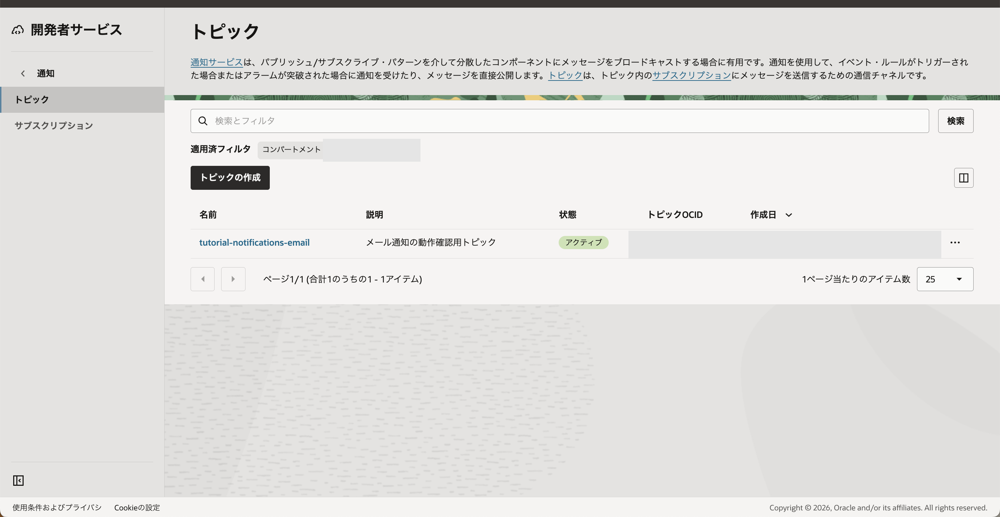
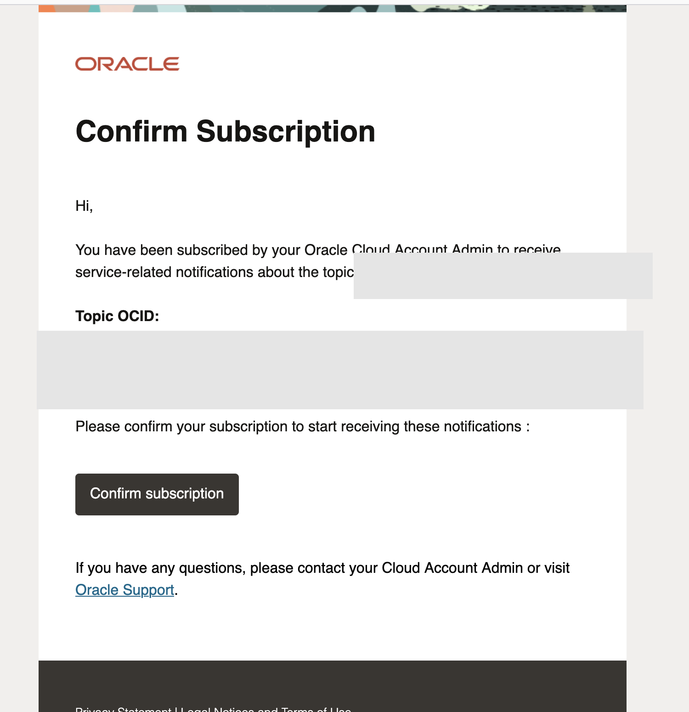
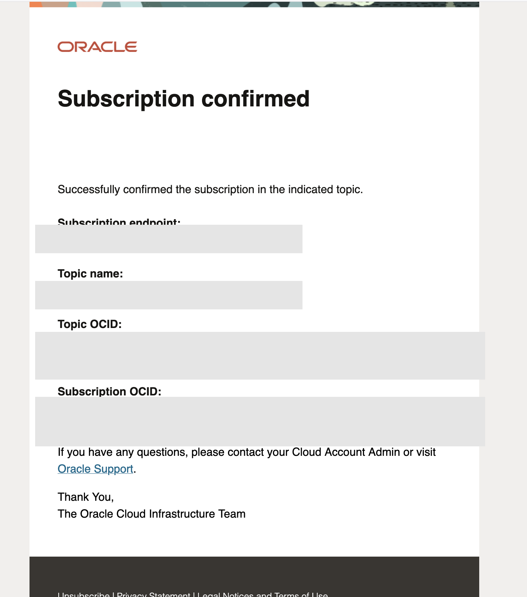
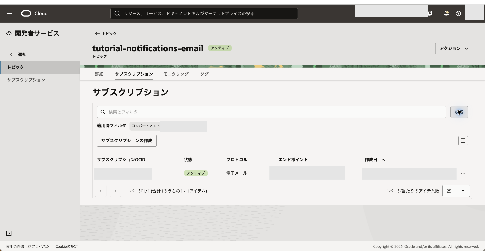
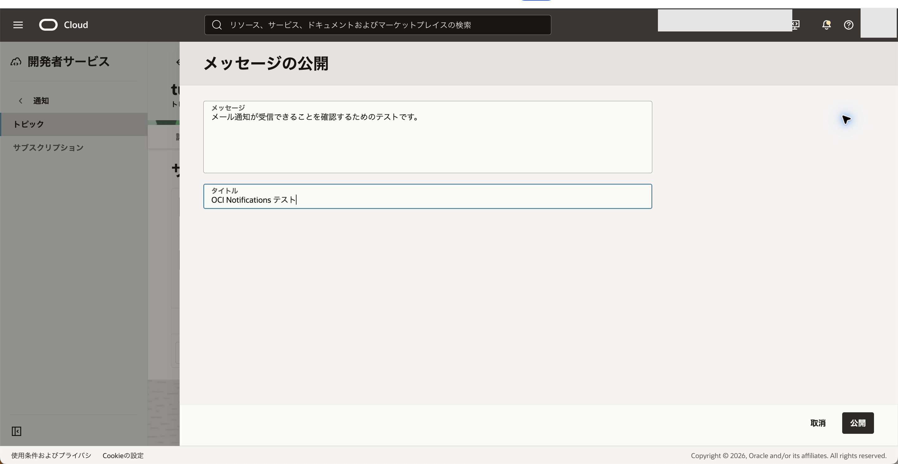
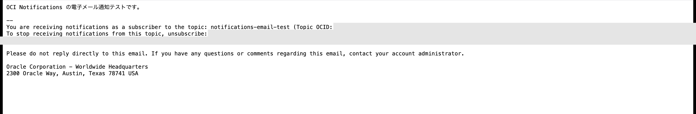

# OCI Notificationsで電子メール通知を送信する

OCI Notificationsは、トピックにメッセージを公開し、登録した購読先へ配信するサービスです。このチュートリアルでは、電子メール通知を実際に確認したあと、作成物を削除します。

## 前提条件

- OCIコンソールへサインイン済みであること
- 対象コンパートメントを選択できること
- 確認リンクを受け取れる電子メールアドレスを用意していること

### 必要な権限

Notificationsのトピック操作には、少なくとも `ONS_TOPIC_INSPECT`、`ONS_TOPIC_READ`、`ONS_TOPIC_CREATE`、`ONS_TOPIC_DELETE`、`ONS_TOPIC_SUBSCRIBE`、`ONS_TOPIC_PUBLISH` が必要です。教材用の専用コンパートメントに限定する例は次のとおりです。

```
Allow group <グループ名> to manage ons-topics in compartment <コンパートメント名>
```

購読を別のグループで管理する場合は、必要に応じて次のポリシーを追加します。

```
Allow group <購読管理グループ名> to manage ons-subscriptions in compartment <コンパートメント名>
```

`manage ons-topics` には、トピックの作成、購読、メッセージ公開、削除に必要な操作が含まれます。詳細は [Notificationsの詳細](https://docs.oracle.com/ja-jp/iaas/Content/Notification/Concepts/notificationoverview.htm) および [Notificationsの保護](https://docs.oracle.com/ja-jp/iaas/Content/Identity/Concepts/commonpolicies.htm#notifications) を参照してください。

## 1. トピックを作成する

1. ナビゲーション・メニューから **開発者サービス**、**通知**、**トピック** の順に選択します。
2. **トピックの作成** を選択します。
3. **名前** に `<トピック名>`、**説明** に用途が分かる説明を入力し、**作成** を選択します。

期待結果: 新しいトピックが一覧に表示され、状態が **アクティブ** になります。



失敗時確認: コンパートメントが正しいこと、トピック名が同一コンパートメント内で重複していないこと、必要なポリシーがあることを確認します。


## 2. 電子メールアドレスを購読する

1. 作成したトピックを選択し、**サブスクリプション** タブを開きます。
2. **サブスクリプションの作成** を選択します。
3. **プロトコル** に **電子メール** を選び、**電子メール** に `<メールアドレス>` を入力して **作成** を選択します。

期待結果: 購読が **保留中** と表示され、確認メールが送信されます。


失敗時確認: 迷惑メールフォルダを含めて確認メールを探し、メールアドレスの入力誤りを確認します。


## 3. メール内のリンクで購読を有効化する

1. Oracle Cloud Infrastructure Notificationsから届く確認メールを開きます。
2. **Confirm subscription** を選択します。



3. ブラウザで `Subscription confirmed` と表示されることを確認します。



4. OCIコンソールへ戻り、**サブスクリプション** の状態が **アクティブ** になるまで更新します。

期待結果: 電子メール購読が **アクティブ** になり、トピックからのメッセージを受信できる状態になります。



失敗時確認: 確認リンクが期限切れの場合は、購読を作り直して新しい確認メールを使用します。


## 4. テストメッセージを送信して受信を確認する

1. トピックの **アクション** から **メッセージの公開** を選択します。
2. **メッセージ** にテスト本文、**タイトル** に件名を入力します。
3. **公開** を選択し、購読したメールアドレスで受信を確認します。



期待結果: 指定したタイトルと本文を含む電子メールを受信します。



失敗時確認: 購読が **アクティブ** であること、正しいトピックへ公開したこと、迷惑メールフォルダを確認します。


## 5. 作成物を削除する

1. トピックの **アクション** から **削除** を選択します。
2. 表示されたトピック名を確認し、**削除** を選択します。
3. トピック一覧から対象が消えたことを確認します。

期待結果: トピックと紐づく購読が削除されます。

失敗時確認: 状態が **削除中** の間はしばらく待機して一覧を更新します。


トピックを削除すると、紐づく購読も利用できなくなります。教材用以外のトピックを誤って選択しないよう、名前を確認してから削除してください。


## 参考情報

- [トピックの管理](https://docs.oracle.com/ja-jp/iaas/Content/Notification/Tasks/managingtopics.htm)
- [電子メール購読の作成](https://docs.oracle.com/ja-jp/iaas/Content/Notification/Tasks/create-subscription-email.htm)
- [メッセージの公開](https://docs.oracle.com/ja-jp/iaas/Content/Notification/Tasks/publish-message.htm)
