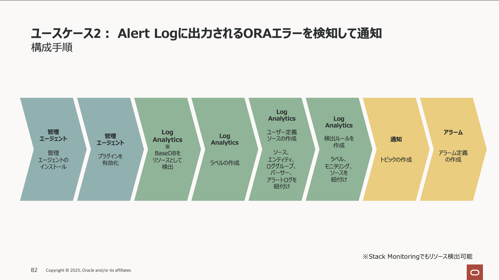
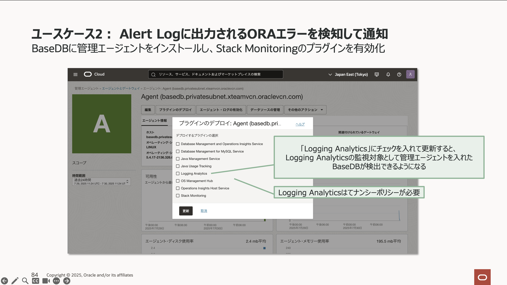
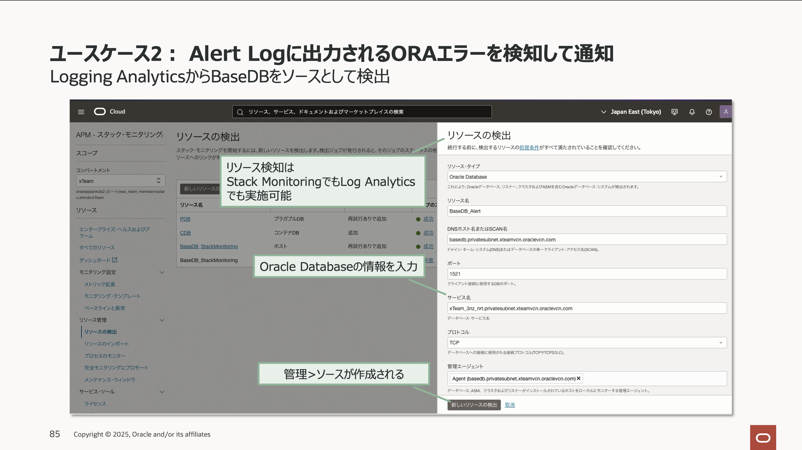
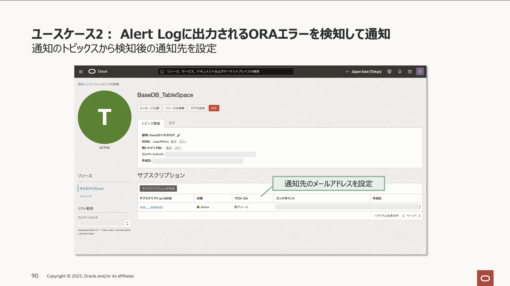
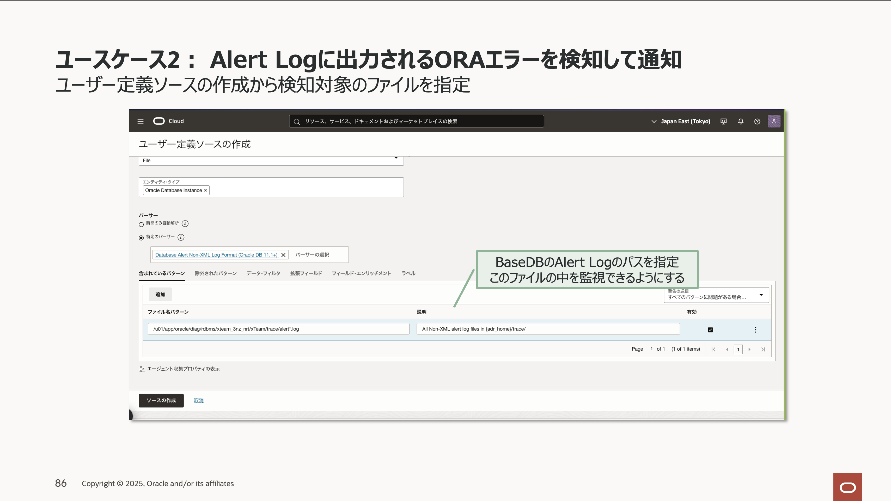
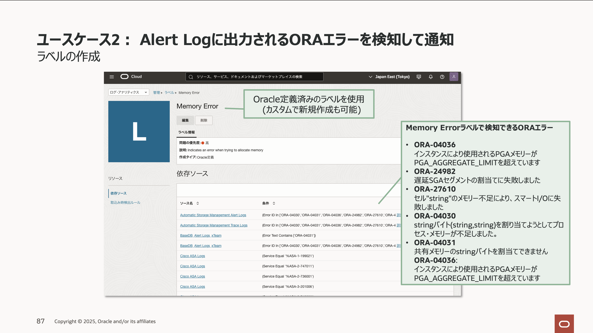
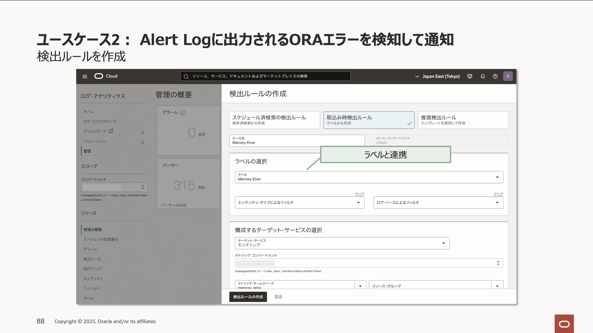
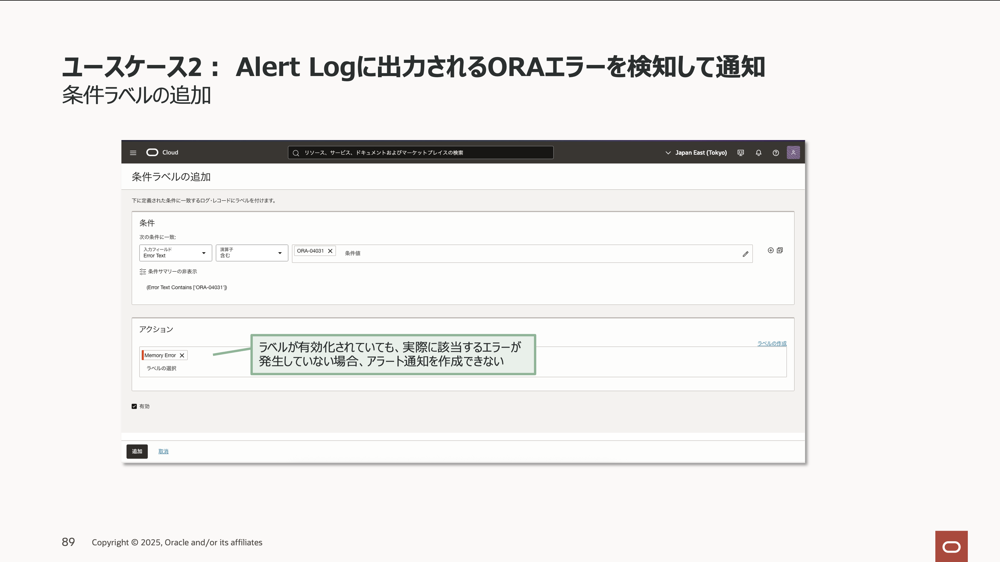
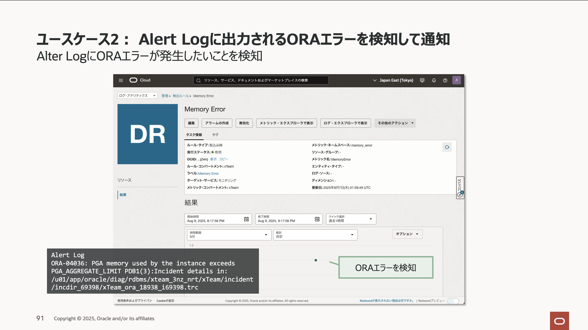
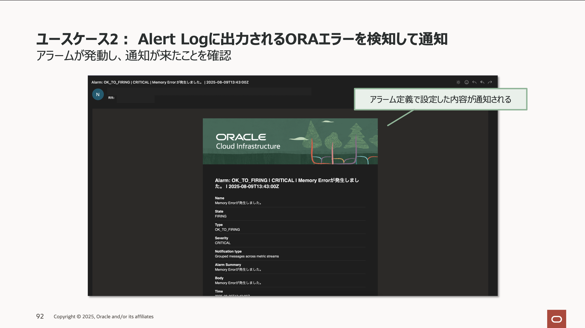

このチュートリアルでは、OCI の Database Management、そして Log Analytics を活用した BaseDB の監視方法を、具体的なユースケースに沿って解説します。 
Oracle Database のエラー検知など、具体的なシナリオとセットアップ時の注意点などを取り上げながら、各サービスの効果的な使い方をご紹介します。 

---

# 1 ブロッキング・セッション(ロック)を検知して通知する 

### －Database Management を利用した性能監視手順

Oracle Database の性能監視を、Database Management を活用して実施する手順です。  
こちらの手順や実際のデモ動画は以下のセミナーからご確認いただけます。

**Oracle Database Technology Night #91 Oracle AI Database 最新パフォーマンス分析手法**
資料はこちら

<iframe class="speakerdeck-iframe" style="border: 0px; background: rgba(0, 0, 0, 0.1) padding-box; margin: 0px; padding: 0px; border-radius: 6px; box-shadow: rgba(0, 0, 0, 0.2) 0px 5px 40px; width: 100%; height: auto; aspect-ratio: 560 / 315;" frameborder="0" src="https://speakerdeck.com/player/549739d0e5df46ba9b0a79a8a757d92b" title="[TechNight #91] Oracle Database 最新パフォーマンス分析手法" allowfullscreen="true" data-ratio="1.7777777777777777"></iframe>

動画はこちら

<iframe width="560" height="315" src="https://www.youtube.com/embed/TLOh44T4HS4?si=x12ABsSnO9DHgsHe" title="YouTube video player" frameborder="0" allow="accelerometer; autoplay; clipboard-write; encrypted-media; gyroscope; picture-in-picture; web-share" referrerpolicy="strict-origin-when-cross-origin" allowfullscreen></iframe>

---

# 2 ORA エラー発生時に通知を受け取る方法  

### －Logging Analytics を利用した監視手順

## 2-0 概要

ここからは Oracle Database で ORA エラーが発生した場合、Logging Analytics を活用して通知を受け取る手順です。  
本手順は以下の環境を前提とします。

- **Base Database Services (BaseDB)**
  - エディション：Standard Edition (SE)
- **Logging Analytics**（本手順内でセットアップ）
  　- 本ガイドではメモリエラーにより、Alert Log に ORA エラーが発生した場合に検知するケースを前提とします。

セットアップ手順の概要は以下です。

## 2-1 管理エージェントの準備

- Logging Analytics 利用には管理エージェントのインストールとプラグイン有効化が必要です。  
  詳細は[前述手順](#1-1-管理エージェントの準備)を参照ください。同じ手順でセットアップできます。

## 2-2 Logging Analytics のセットアップ

Logging Analytics と BaseDB を連携します。連携設定方法は下記を参照ください。
管理エージェントのプラグインは Logging Analytics を有効化します。

[Logging Analytics：OCI コンピュートから OS ログを収集する方法](https://oracle-japan.github.io/ocitutorials/management/logginganalytics_logcollection4ocivm/)

**＜ Logging Analytics セットアップ時の注意＞**

- Logging Analytics はテナンシーレベルのポリシー設定が必要です。
- Stack Monitoring からリソース検出も可能。両サービス用に同時検出できます。
- ユーザー定義ソースの作成時、未作成ならそのまま新規作成してください。
- ORA エラー詳細は[エラーメッセージ 19c](https://docs.oracle.com/cd/F19136_01/errmg/ORA-02140.html)からご確認できます。
- Oracle 既定のラベルを利用すると、OS エラーも ORA エラーも含めて検知されます。特定のエラーのみ検知したい場合は、ユーザー自身でカスタムラベルを作成してください。
- 条件ラベルを追加しても、実際に該当エラーが発生していない場合はアラート通知が作成できません。BaseDB との連携以降、該当エラーが発生したタイミングで条件ラベルが選択肢として表示されます。

## 2-3 ORA エラー発生時の通知先の作成

アラーム発動時に通知を受け取るための通知先設定を行います。  
手順は、[アラーム通知先設定方法](https://oracle-japan.github.io/ocitutorials/intermediates/monitoring-resources/#4-%E3%82%A2%E3%83%A9%E3%83%BC%E3%83%A0%E3%81%AE%E9%80%9A%E7%9F%A5%E5%85%88%E3%81%AE%E4%BD%9C%E6%88%90)をご確認ください。

---

## 2-4 ORA エラー発生時に発動するアラーム定義の作成

アラーム定義を作成していきます。
ORA エラーが発生した際のアラーム作成や注意点は、[表領域圧迫時に発動するアラーム定義の作成](#1-4-表領域圧迫時に発動するアラーム定義の作成)と同様です。

---

**補足：運用・通知に関する追加アドバイス**

- 通知の大量発生や誤検知による運用負荷増大を避けるため、「必要に応じた通知」「通知結果の検証」にご留意ください。
- 詳細条件や除外条件を工夫して不要なアラートや通知が乱発しないよう調整しましょう。

以上でユースケースのご紹介は以上です。 
OCIのサービスを活用して様々なBaseDBの監視方法を試してみましょう！

---
