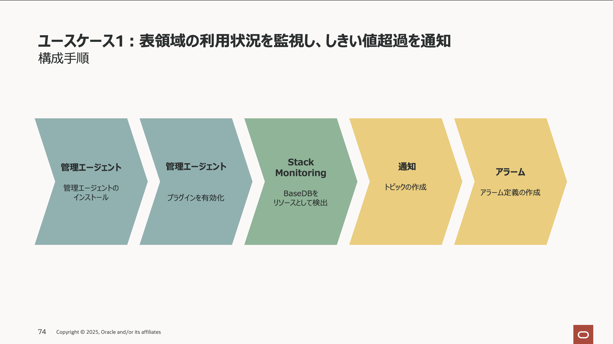
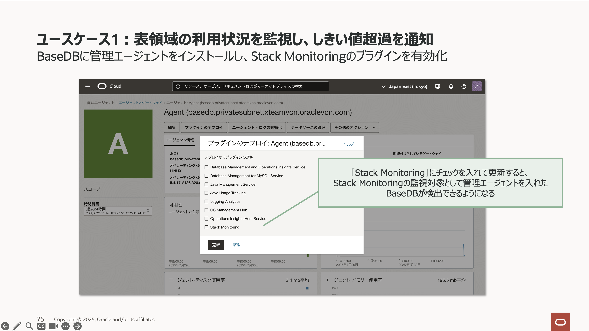
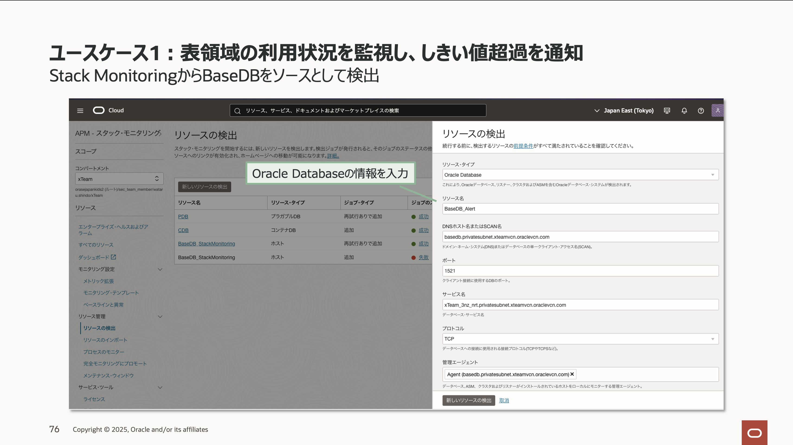
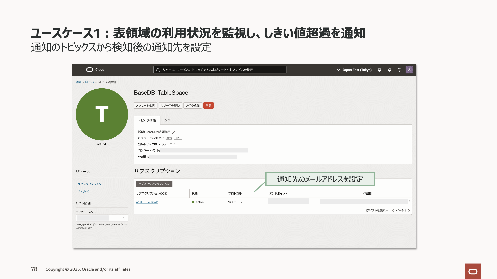
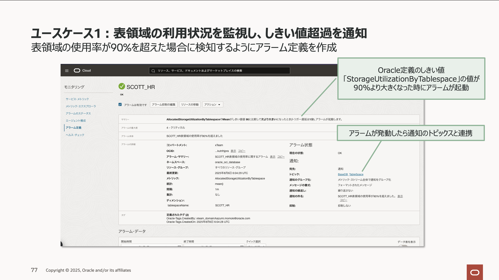
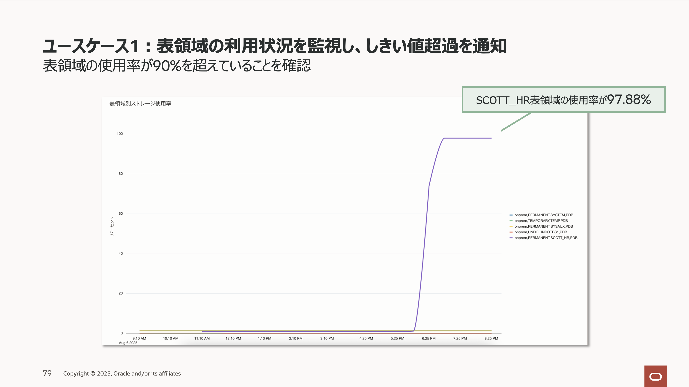
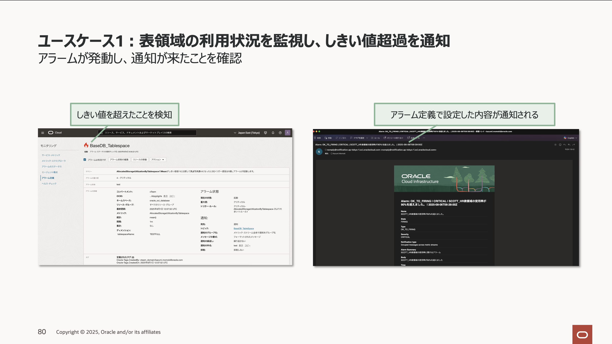

このチュートリアルでは、OCI の Stack Monitoring、Database Management、そして Log Analytics を活用した BaseDB の監視方法を、具体的なユースケースに沿って解説します。 
Oracle Database のエラー検知や表領域の使用率監視など、具体的なシナリオとセットアップ時の注意点などを取り上げながら、各サービスの効果的な使い方をご紹介します。 

# 1 表領域が圧迫された際に通知を受け取る

### －Stack Monitoring を利用した監視手順

## 1-0 概要

Oracle Database の PDB 上で特定の表領域が圧迫された場合に、Stack Monitoring を使って通知を受け取るための設定方法について説明します。  
このガイドは以下のサービスおよび構成を前提としています。

- **Base Database Services (BaseDB)**
  - エディション：Standard Edition (SE)
  - 任意のユーザーおよび表領域が作成済み
  - 本ガイドでは「ユーザー SCOTT」・「表領域 SCOTT_HR」を利用
- **Stack Monitoring**（本手順内でセットアップ）

セットアップで順の概要はこちらです。

## 1-1 管理エージェントの準備

Stack Monitoring の利用には、専用管理エージェントのインストールを実施した後、Stack Monitoring プラグインの有効化が必要です。  
管理エージェントをインストールする詳細な手順は下記リンクをご覧ください。

[管理エージェントのインストール手順](https://oracle-japan.github.io/ocitutorials/management/stack_monitoring_basedb/#1-%E7%AE%A1%E7%90%86%E3%82%A8%E3%83%BC%E3%82%B8%E3%82%A7%E3%83%B3%E3%83%88%E3%81%AE%E3%82%A4%E3%83%B3%E3%82%B9%E3%83%88%E3%83%BC%E3%83%AB)

**＜管理エージェントをインストールする際の注意事項＞**

- BaseDB に既定でインストールされている JDK のバージョンは新しいため、エージェントのインストールが失敗する場合があります。事前に JDK8 を準備しましょう。
- インストールする JDK の例：Java SE Development Kit 8u281（Linux x64 Compressed Archive）
- BaseDB 本体への影響を防ぐため、root ユーザーやシステム全体で JAVA_HOME を永続設定しないことをおすすめします。
- mgmt_agent ユーザーが必要なファイルへアクセスできるよう、OS 側の権限設定にもご注意ください。

 

## 1-2 Stack Monitoring のセットアップ

続いて Stack Monitoring と BaseDB の連携設定を行います。  
詳細手順は下記リンクをご覧ください。

[ホストのメトリックを可視化する方法](https://oracle-japan.github.io/ocitutorials/management/stack_monitoring_basedb/#5-%E3%83%9B%E3%82%B9%E3%83%88%E3%81%AE%E3%83%A1%E3%83%88%E3%83%AA%E3%83%83%E3%82%AF%E3%82%92%E5%8F%AF%E8%A6%96%E5%8C%96)

**＜ Stack Monitoring セットアップ時の注意事項＞**

- リソース検出に失敗する場合は、入力内容に加え、IAM ポリシーに記載間違いがないかご確認ください。
- 今回のユースケースの場合、Stack Monitoring SE で実施したいことを実現できます。

---

## 1-3 アラームが発動したら通知する通知先の作成

次にアラームが発動した際に通知を受け取れるよう通知先（メール等）を設定します。  
設定方法は下記リンクをご参照ください。

[アラーム通知先の設定方法](https://oracle-japan.github.io/ocitutorials/intermediates/monitoring-resources/#4-%E3%82%A2%E3%83%A9%E3%83%BC%E3%83%A0%E3%81%AE%E9%80%9A%E7%9F%A5%E5%85%88%E3%81%AE%E4%BD%9C%E6%88%90)

---

## 1-4 表領域圧迫時に発動するアラーム定義の作成

表領域の使用率が 90%を超えた際、自動的に検知および通知を行うアラームを作成します。  
手順は下記リンクをご参照ください。

[アラーム定義の作成方法](https://oracle-japan.github.io/ocitutorials/intermediates/monitoring-resources/#5-%E3%82%A2%E3%83%A9%E3%83%BC%E3%83%A0%E5%AE%9A%E7%BE%A9%E3%81%AE%E4%BD%9C%E6%88%90)

**＜アラーム作成時のポイント＞**

- 通知の文面は、アラーム設定画面で入力した内容がそのまま使われます。分かりやすい説明文にしましょう。
- 表領域の使用率を監視対象とする場合、以下のメトリック情報を使用します：
  - メトリック・ネームスペース：`oracle_oci_database`
  - メトリック名：`AllocatedStorageUtilizationByTablespace`
- 「統計」の各項目の意味：
  - mean：期間内の平均値（Sum ÷ Count）
  - rate：間隔ごとの平均変化率
  - sum：合計値
  - max/min：最大/最小値
  - Count：観測回数
  - P50/P90 等：パーセンタイル値  
    詳しくは[基本アラーム作成ガイド](https://docs.oracle.com/ja-jp/iaas/Content/Monitoring/Tasks/create-alarm-basic.htm#top)を参照ください。
- アラーム定義作成・有効化後は緑色のチェックが表示されます。「アラームは有効です」のチェックを外すと無効化され通知されません。

 

## 1-5 動作確認

セットアップが完了すると、以下のように動作します。

**補足・注意：通知の頻度と運用面** 
アラームが有効な場合、表領域使用率がしきい値（例：90%）を超えた状態が継続していると、通知（メール等）が繰り返し送信される場合があります。  
通知が過剰となる場合や意図しない大量通知を防ぎたい場合は、必要に応じてアラームの有効化/無効化を切り替える、またはしきい値や通知の間隔を調整してください。

具体的な管理方法は以下のリンクからご確認いただけます。 
参考: [アラーム抑制の管理](https://docs.oracle.com/ja-jp/iaas/Content/Monitoring/Tasks/suppressions.htm)

**よくあるトラブル**

Q. 通知メールが届きません

以下の箇所をご確認ください。

1. 通知先メールアドレスが正しいか 
2. メールの受信設定（迷惑メール等）を確認 
3. 通知先チャネル（メール／SMS 等）の有効化や紐付けミスがないか 
4. アラームルール自体が有効になっているか  

Q. 管理エージェントがインストールできない・エラーが出る

以下の箇所をご確認ください。

- JDK バージョンの不一致がないか 
- ファイヤーウォールやプロキシ設定 
- Oracle 公式ガイドに沿った OS 権限設定 

Q. 表領域使用率メトリックが表示されない

以下の箇所をご確認ください。

- エージェント/プラグインが有効・正常稼働か 
- mgmt_agent ユーザーが必要なファイルへアクセスできる権限を持っているか 
- エージェントが対象 DB を正しく検出しているか 

 

---

# 2 ブロッキング・セッション(ロック)を検知して通知する 

### －Database Management を利用した性能監視手順

Oracle Database の性能監視を、Database Management を活用して実施する手順です。  
こちらの手順や実際のデモ動画は以下のセミナーからご確認いただけます。

**Oracle Database Technology Night #91 Oracle AI Database 最新パフォーマンス分析手法**
資料はこちら

<iframe class="speakerdeck-iframe" style="border: 0px; background: rgba(0, 0, 0, 0.1) padding-box; margin: 0px; padding: 0px; border-radius: 6px; box-shadow: rgba(0, 0, 0, 0.2) 0px 5px 40px; width: 100%; height: auto; aspect-ratio: 560 / 315;" frameborder="0" src="https://speakerdeck.com/player/549739d0e5df46ba9b0a79a8a757d92b" title="[TechNight #91] Oracle Database 最新パフォーマンス分析手法" allowfullscreen="true" data-ratio="1.7777777777777777"></iframe>

動画はこちら

<iframe width="560" height="315" src="https://www.youtube.com/embed/TLOh44T4HS4?si=x12ABsSnO9DHgsHe" title="YouTube video player" frameborder="0" allow="accelerometer; autoplay; clipboard-write; encrypted-media; gyroscope; picture-in-picture; web-share" referrerpolicy="strict-origin-when-cross-origin" allowfullscreen></iframe>

---

# 3 ORA エラー発生時に通知を受け取る方法  

### －Logging Analytics を利用した監視手順

## 3-0 概要

ここからは Oracle Database で ORA エラーが発生した場合、Logging Analytics を活用して通知を受け取る手順です。  
本手順は以下の環境を前提とします。

- **Base Database Services (BaseDB)**
  - エディション：Standard Edition (SE)
- **Logging Analytics**（本手順内でセットアップ）
  　- 本ガイドではメモリエラーにより、Alert Log に ORA エラーが発生した場合に検知するケースを前提とします。

セットアップ手順の概要は以下です。

## 2-1 管理エージェントの準備

- Logging Analytics 利用には管理エージェントのインストールとプラグイン有効化が必要です。  
  詳細は[前述手順](#1-1-管理エージェントの準備)を参照ください。同じ手順でセットアップできます。

## 2-2 Logging Analytics のセットアップ

Logging Analytics と BaseDB を連携します。連携設定方法は下記を参照ください。
管理エージェントのプラグインは Logging Analytics を有効化します。

[Logging Analytics：OCI コンピュートから OS ログを収集する方法](https://oracle-japan.github.io/ocitutorials/management/logginganalytics_logcollection4ocivm/)

**＜ Logging Analytics セットアップ時の注意＞**

- Logging Analytics はテナンシーレベルのポリシー設定が必要です。
- Stack Monitoring からリソース検出も可能。両サービス用に同時検出できます。
- ユーザー定義ソースの作成時、未作成ならそのまま新規作成してください。
- ORA エラー詳細は[エラーメッセージ 19c](https://docs.oracle.com/cd/F19136_01/errmg/ORA-02140.html)からご確認できます。
- Oracle 既定のラベルを利用すると、OS エラーも ORA エラーも含めて検知されます。特定のエラーのみ検知したい場合は、ユーザー自身でカスタムラベルを作成してください。
- 条件ラベルを追加しても、実際に該当エラーが発生していない場合はアラート通知が作成できません。BaseDB との連携以降、該当エラーが発生したタイミングで条件ラベルが選択肢として表示されます。

## 2-3 ORA エラー発生時の通知先の作成

アラーム発動時に通知を受け取るための通知先設定を行います。  
手順は、[アラーム通知先設定方法](https://oracle-japan.github.io/ocitutorials/intermediates/monitoring-resources/#4-%E3%82%A2%E3%83%A9%E3%83%BC%E3%83%A0%E3%81%AE%E9%80%9A%E7%9F%A5%E5%85%88%E3%81%AE%E4%BD%9C%E6%88%90)をご確認ください。

---

## 2-4 ORA エラー発生時に発動するアラーム定義の作成

アラーム定義を作成していきます。
ORA エラーが発生した際のアラーム作成や注意点は、[表領域圧迫時に発動するアラーム定義の作成](#1-4-表領域圧迫時に発動するアラーム定義の作成)と同様です。

---

**補足：運用・通知に関する追加アドバイス**

- 通知の大量発生や誤検知による運用負荷増大を避けるため、「必要に応じた通知」「通知結果の検証」にご留意ください。
- 詳細条件や除外条件を工夫して不要なアラートや通知が乱発しないよう調整しましょう。

以上でセットアップは完了です。

---
