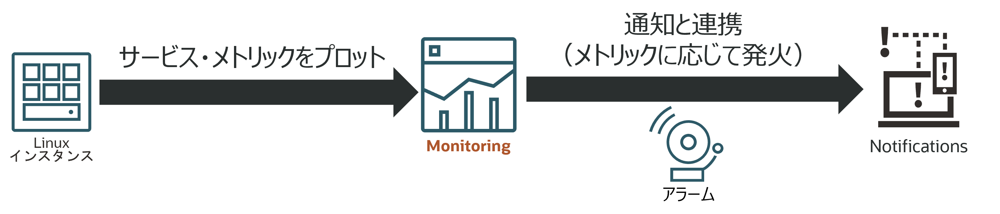
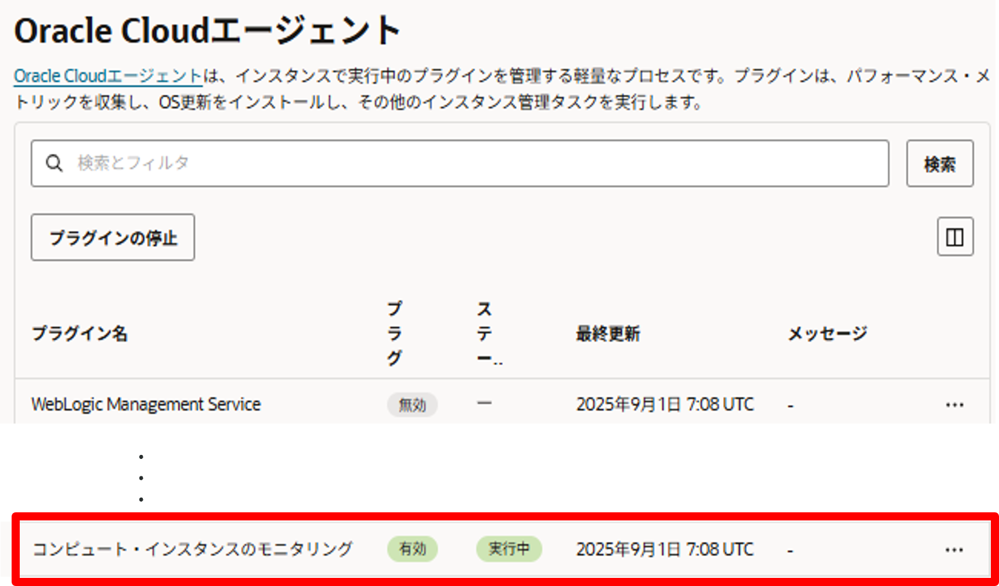
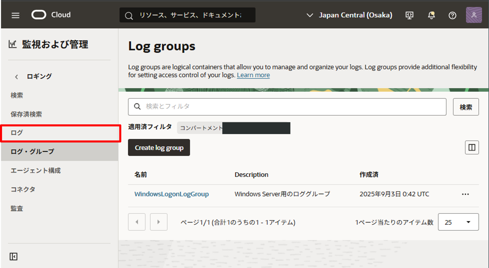

OCI のネイティブサービスであるモニタリングとロギングを利用して、コンピュート・インスタンスと BaseDB の監視を行っていきます。
ここでは、少し実践的なユースケースをベースにしてサービスの利用方法を解説をします。<br>
コンピュート・インスタンスの監視を解説し、モニタリングとロギングの基礎的な利用法を復習してから、BaseDB に応用していきます。<br>
モニタリングとロギングのサービスを解説するリソースとしては、以下も参考にしてみてください。<br>

# 実践的なコンピュート・インスタンスの監視

**モニタリング**と**ロギング**サービスを活用することで、コンピュート・インスタンスの状態を監視できます。
異常や不正な動作をいち早く検知し、アラームと通知サービスを利用して発報も可能です。

- **モニタリング（メトリック監視）**: CPU やメモリ、OS 設定状態などの動作異常を把握

- **ログ監視**: ユーザー操作やイベントを検出

これらを組み合わせることで、システム障害やセキュリティインシデントの早期検知に繋がります。

以下に、コンピュート・インスタンスの監視における応用的なユースケースを紹介します。
このチュートリアルでは、ユースケース 1~3 の内容をステップバイステップで解説します。

### A. モニタリングによるコンピュート・インスタンスの監視例

- **サービス・メトリックの利用例**

  - CPU 使用率が極端に高い状態を検知
    - OCI チュートリアル応用編 [『モニタリング機能で OCI のリソースを監視する』](https://oracle-japan.github.io/ocitutorials/intermediates/monitoring-resources/) を参照してください
  - メモリ使用率のメトリックが欠損した場合、OS がハングしていることを検知（ユースケース 1）

- **カスタム・メトリックの利用例**
  - OS のファイアウォール（FW）無効化状態を検知（ユースケース 2）

### B. ロギングによるコンピュート・インスタンスの監視例

- Windows Server にユーザーがログインしたことを検知（ユースケース 3）

## 前提条件

- VCN のサブネット内に、以下を用意する
  - Oracle Linux 8 プラットフォーム・イメージから作成したコンピュート・インスタンス
  - Windows Server 2022 Standard コンピュート・インスタンス
- コンピュート・インスタンスに SSH/RDP 接続するためのゲートウェイ
- モニタリング、ロギングサービスが存在する Oracle Service Network (OSN) へのゲートウェイ(例えばサービスゲートウェイ)
- 後半で利用する BaseDatabase


## ユースケース 1：メモリ使用率のメトリック欠損から OS ハングを検知

Oracle Linux 8 のコンピュート・インスタンスで、メトリックが欠損したときに発報を行います。<br>



プラットフォーム・イメージから作成されたコンピュート・インスタンスは Oracle Cloud Agent のコンピュート・インスタンスのモニタリング・プラグインにより、メモリ使用率などの情報をモニタリングから監視可能です。



1. まず、通知のためのトピックを作成します。トピックは、後ほど通知先を定義したサブスクリプションを紐づけるためのエンティティです。

   - ハンバーガーメニューから、「開発者サービス」 > 「アプリケーション統合」 > 「通知」 を選択し、「トピックの作成」をクリック
   - トピックの作成画面が開くので、以下の内容を参考に入力

     - 名前：OS_hung_topic
     - 説明： OS がハングしたときに通知を行うためのトピック
     - コンパートメント：ユーザーグループに適切なポリシーが付与されたものを選択

     

2. 次に、通知先を設定するためにサブスクリプションを作成していきます。

   - 「開発者サービス」から「サブスクリプション」を選択します。
     
   - サブスクリプションの作成画面が開くので、以下の内容を参考に入力し、作成ボタンをクリック
     - サブスクリプション・トピック：OS_hung_topic（先ほどの手順で作成したトピックを選択）
     - プロトコル：電子メール
     - 電子メール欄：ご自身のメールアドレス
       
   - 登録したアドレス宛に確認メールが届くので、Confirm subscription をクリックして、サブスクリプションを有効化します
     
   - サブスクリプションの状態が「保留中」から「アクティブ」に変化します
     

3. 最後に通知するときの条件を定義するアラームの設定を行います。

   - ハンバーガーメニューから、「監視および管理」 > 「モニタリング」 > 「アラーム定義」 を選択し、「アラームの作成」をクリック
   - アラームの作成画面が開くので、以下の内容を参考に入力し、作成ボタンをクリック

     - アラーム名：OS_hung_alarm
     - アラーム・サマリー：メモリ使用率のメトリックが欠損したときに発火するアラーム
     - メトリックの説明
       - コンパートメント：コンピュート・インスタンスが含まれているもの
       - メトリック・ネームスペース：oci_computeagent
       - メトリック名：MemoryUtilization
       - 間隔：1 分
       - 統計：Mean
     - メトリックディメンション

       - ディメンション名：resourceDisplayName
       - ディメンション値：Oracle Linux 8 コンピュート・インスタンス名を選択
         

     - トリガー・ルール 1

       - 演算子：「なし」を選択
       - トリガー遅延分数：1
       - アラームの重大度：クリティカル
       - アラーム本体：任意のメッセージを記入

       

     - 宛先
       - 宛先サービス：通知
       - コンパートメント：前の手順で作成したトピックが含まれるもの
       - トピック：OS_hung_topic
       - 通知の件名：任意のもの
     - その後の選択肢：デフォルトのままで OK
       

4. コンピュートインスタンスに SSH 接続を行い、OS をシャットダウンしたとき、通知が来るかを確認します
   - コンピュート・インスタンスの IP アドレスへ SSH 接続を行います
     - 方法が分からない場合は、OCI チュートリアル入門編 [『その 3 - インスタンスを作成する』](https://oracle-japan.github.io/ocitutorials/beginners/creating-compute-instance/)をご参照ください
   - `sudo shutdown -h now` を実行して、OS をシャットダウンします
     - インスタンスの状態は稼働中のままになります。インスタンス詳細画面の「モニタリング」から、メトリックの収集が止まっていることが確認できます
       
   - 少し待ってメールが届くことを確認します
     

以上で、ユースケース 1 の内容は終了です。<br>
インスタンス詳細画面のアクションメニューから「再起動」を行い、OS も含めて再起動を行い、次の項目に入ってきます。<br>


## ユースケース 2：カスタム・メトリックを用いた OS のファイア・ウォール無効化の検出

ひきつづき Oracle Linux 8 のコンピュート・インスタンスで、OS のファイアウォール停止状態を検知してみます。<br>

ユースケース 1 では、コンピュート・インスタンスのモニタリング・プラグインにより、CPU 使用率やメモリ使用率などの OS 上の情報をサービス・メトリックとして利用しましたが、ファイア・ウォールの情報は収集しないため、カスタム・メトリックを作成します。

<b>※この項には、コンピュート・インスんタンスの OS を停止する手順が含まれます。セキュリティ・リストや NSG でアクセスの絞り込みを適切に行ったうえでお試しください。</b>


1. コンピュート・インスタンスからカスタム・メトリックをアップロードする権限を動的グループを作成します

   - ハンバーガーメニューから、「アイデンティティとセキュリティ」> 利用中のドメイン（ここでは Default ドメイン） > 「動的グループ」タブを選択し、「動的グループの作成」をクリックします
     

   - 動的グループの作成画面が開くので以下の内容を参考に入力して、作成ボタンをクリック

     - 名前：任意の名前
     - 説明：任意の説明
     - 一致ルール：`instance.compartment.id = '<compartment_ocid>'`を入力（<compartment_ocid>はインスタンスが含まれるコンパートメントの OCID で置き換え）

     

2. そのまま、アイデンティティとセキュリティから「ポリシー」を選択して、動的グループに付与するポリシーを作成します

   - 今回はインスタンスが存在するコンパートメントを選択し、ポリシーの作成画面を開きます
   - 以下の内容を参考に入力して作成ボタンをクリックします

     - 名前：任意の名前
     - 説明：任意の説明
     - コンパートメント：rootコンパートメント
     - ポリシー・ビルダー：手動エディタに切り替え、`Allow dynamic-group tutorial_dg to use metrics in tenancy`を入力

     

3. コンピュートインスタンスに SSH 接続を行い、カスタム・メトリックをプロットするためのスクリプトを実行します。

   - まず、Python スクリプトを利用するための環境構築を行います
     - `sudo dnf install -y python3-pip`
     - `pip3 install psutil`
   - 次のコードを編集して custom_metric.py として保存します。

     - <region>は、リージョンコードを入力（例えば、東京リージョンは ap-tokyo-1、大阪リージョンは ap-osaka-1）
     - <compartment_ocid>は、手順 2 で動的グループへのポリシーで記述したコンパートメントを指定

     ```python
     # This is a sample python script to post firewall status custom metric to oci monitoring.
     # Command: python3 custom_metric.py
     import oci,psutil,datetime
     from pytz import timezone


     # initialize service client with OCI python SDK
     signer = oci.auth.signers.InstancePrincipalsSecurityTokenSigner()
     monitoring_client = oci.monitoring.MonitoringClient(config={}, signer=signer, service_endpoint="https://telemetry-ingestion.<region>.oraclecloud.com")
     # get fw state
     def is_firewalld_running():
         for proc in psutil.process_iter(attrs=["name"]):
             if proc.info["name"] == "firewalld":
                 return 1  # when running
         return 0  # when stopping
     times_stamp = datetime.datetime.now(timezone('UTC'))
     # post custom metric to oci monitoring
     post_metric_data_response = monitoring_client.post_metric_data(
        post_metric_data_details=oci.monitoring.models.PostMetricDataDetails(
           metric_data=[
                 oci.monitoring.models.MetricDataDetails(
                    namespace="custom_metrics",
                    compartment_id="<compartment_ocid>",
                    name="fw_state",
                    dimensions={'resourceDisplayName': 'OL8-VM'},
                    datapoints=[
                       oci.monitoring.models.Datapoint(
                             timestamp=datetime.datetime.strftime(
                                times_stamp,"%Y-%m-%dT%H:%M:%S.%fZ"),
                             value=is_firewalld_running())]
                    )]
        )
     )
     # Get the data from response
     print(post_metric_data_response.data)
     ```

4. `python3 custom_metric.py`が実行できることを確認したら、`crontab -e`で以下を書き込みます。<br> `*/1 * * * * /usr/bin/python3 /home/opc/custom_metric.py`

5. ユースケース 1 の設定を参考にして、アラームの設定を行います。

   - アラーム名：任意
   - アラーム・サマリー：任意
   - メトリックの説明
     - コンパートメント：ユースケース 1 と同様
     - メトリック・ネームスペース：custom_metrics を選択（Python スクリプトで名付けたネームスペース）
     - メトリック名：fw_state（Python スクリプトで名付けたメトリック名）
     - 間隔：1 分
     - 統計：Mean
   - メトリック・ディメンション
     - resourceDisplayName: OL8-VM（Python スクリプトで設定したディメンション）
   - トリガー・ルール 1
     - 演算子：「次と等しい」を選択
     - 値：0
     - トリガー遅延分数：1
     - アラームの重大度：クリティカル
     - アラーム本体：任意のメッセージ

   

   - 宛先サービス：通知
   - コンパートメント：ユースケース 1 と同様
   - トピック：ユースケース 1 で利用したもの（新たに FW 停止検知用のトピックを作成しても OK）
   - 通知の件名：任意
   - その他の設定：デフォルト値のまま
     

6. `sudo systemctl stop firewalld`を実行してファイア・ウォールを停止(少し待つと、アラーム定義の詳細画面から、fw_state メトリックが 0 をプロットしていることが確認できます)
   
7. 時間を空けてメールが来たことを確認します。
   

以上で、ユースケース 2 の内容も終了です。<br>
`sudo systemctl start firewalld`を実行して次の項目に入ってきます。<br>

## ユースケース 3：ロギングを利用した Windows Server へのユーザーログオン検知

ここからは、Windows Server へのユーザーのログオンを検知するための設定を行っていきます。<br>
Windows Server ではユーザーがログオンした際に、セキュリティ・ログに Event ID=4624 で記録されます。<br>
そのログをコネクタ・ハブを介して、通知に連携して捕捉します。


1. はじめに、サービスどうしを連携させるために必要なポリシーを設定します。<br>
   ハンバーガーメニューから「アイデンティティとセキュリティ」> 「ポリシー」へ移動し、先ほどルートコンパートメントに作成したポリシーにステートメントを追加します。<br>
  「ポリシー・ステートメントの編集」で次の2文を追加します（<>内はユースケース 2 のときと同じ値で置き換えます）。

- 動的グループがカスタム・ログを利用するためのポリシー：`allow dynamic-group <dynamic_group_name> to use log-content in tenancy`
- サービス・コネクタが通知サービスを利用するためのポリシー：`allow any-user to use ons-topics in compartment id <target_topic_compartment_OCID> where all {request.principal.type= 'serviceconnector', request.principal.compartment.id='<serviceconnector_compartment_OCID>'}`

2. ログを保存しておくためのログ・グループを作成します。<br>ハンバーガーメニューから「監視および管理」>「ロギング」>「ログ・グループ」を選択し、「Create log group」ボタンからログの作成を開始します。


- compartment：Windows Server が配置されたコンパートメント
- Name：任意
- Description：任意

3. 「監視および管理」から「ログ」へ移動します。<br>
   　

OCI では、サービスごとに標準のログを有効化することが可能ですが、Windows Server 内のログを連携するためには、カスタム・ログを手動で作成する必要があります。「カスタム・ログの作成」ボタンをクリックし、以下の内容を参考に入力していきます。

- カスタム・ログ名：任意
- リソース・コンパートメント：ここでは Windows Server が配置されたコンパートメント
- ログ・グループ：「既存の選択」から、先ほど作成したログ・グループを選択
  　

以上を次へ入力したら、「次」をクリックして、エージェント構成の作成に移っていきます。
以下の内容を参考に入力し、作成ボタンをクリックします。

- エージェント構成の作成：「新規構成の追加」を選択
- 構成名：任意
- 説明：任意
- コンパートメント：ここでは Windows Server が配置されたコンパートメント
- Host groups

  - ドメインの選択の有効化：オフにする
  - グループタイプ：動的グループ
  - グループ：手順 1 で権限を与えた動的グループ

- 構成タイプ：ロギング
- エージェント構成のログ入力の構成 
- 入力タイプ：Windows イベントログ 
- 名前の入力：security_input 
- イベント・チャネル：「セキュリティ」
  　

4. 次は、ログと通知サービスとの紐づけを行うためのサービス・コネクタの設定を行っていきます。

- コネクタ名：任意
- 説明：任意
- リソース・コンパートメント：ここでは Windows Server が配置されたコンパートメント
- サービス・コネクタの構成
  - ソース：ロギング
  - ターゲット：通知
- 問い合わせコード・エディタ：拡張モードに変更し、末尾に次のクエリを追加
  ` | data.EventID='4624' AND data.EventData[8]='10'`

  

- （少し飛んで）ターゲットの構成 - コンパートメント：ここでは Windows Server が配置されたコンパートメント - トピック：ユースケース 1 と 2 で利用したもの（新たに Windows ログオン検知用のトピックを作成しても OK） - メッセージの書式：「フォーマットされたメッセージの送信」
  　

5. Windows Server にログインして、少し待ち、通知が来ることを確認できたら成功です。
   

<br>
以上で、コンピュート・インスタンスの監視については終了です。<br>
サービスメトリックの不在通知や、カスタム・メトリックとカスタム・ログによる通知方法を試してみました。
&#13;&#10;
通知サービスのサブスクリプションやコネクタ・ハブのタスクを編集することによって、メール通知以外にもFunctionsでのリソース操作など、より応用的な利用方法も考えられます。<br>

---
