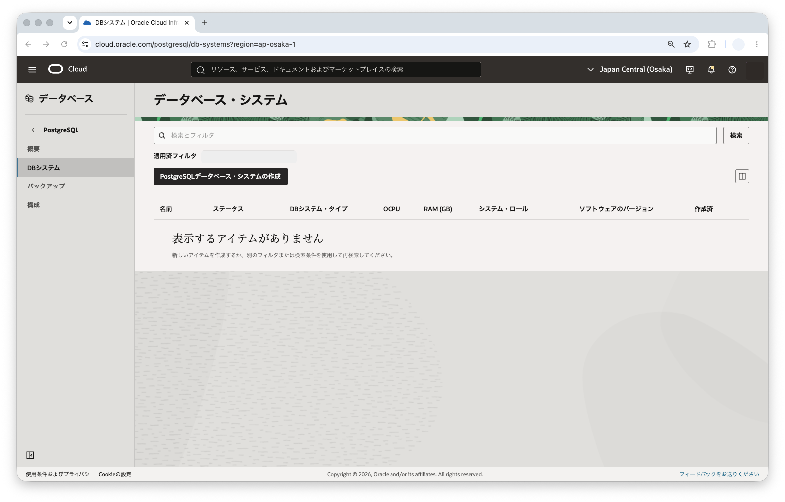
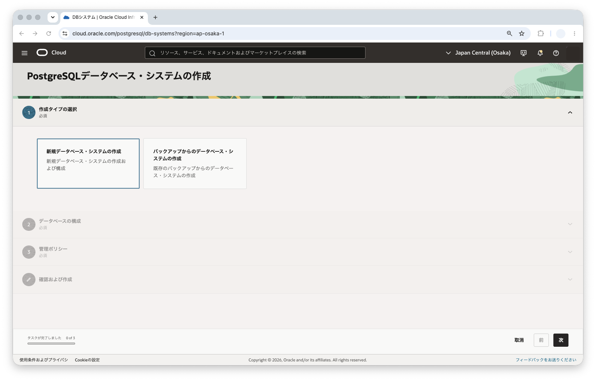
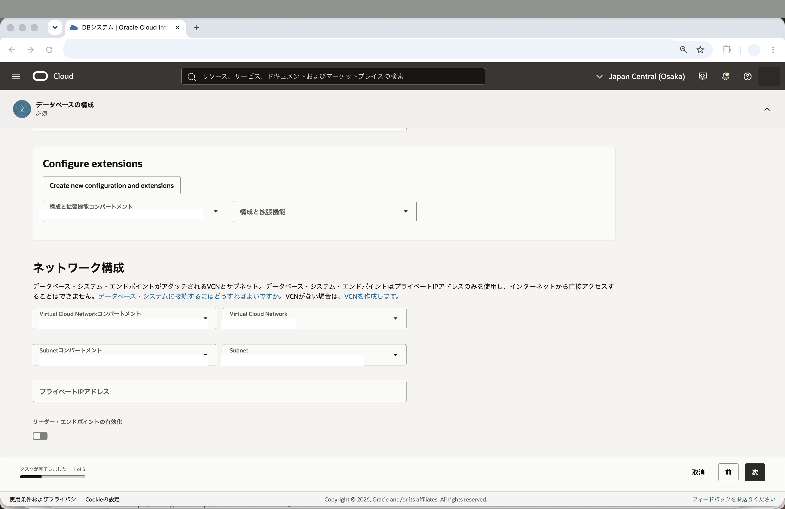
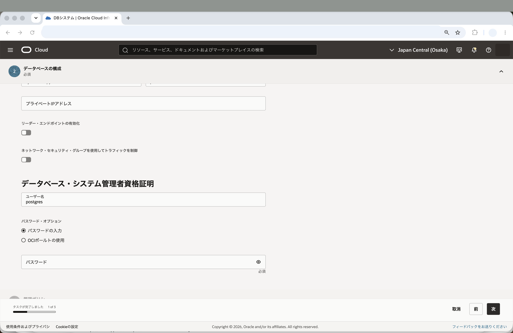
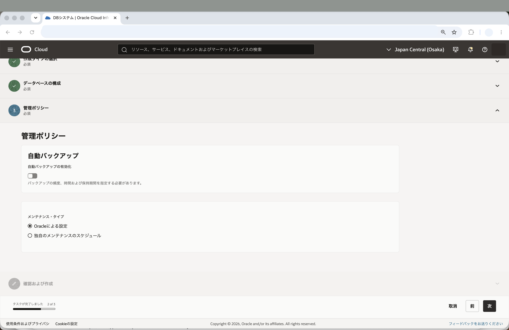
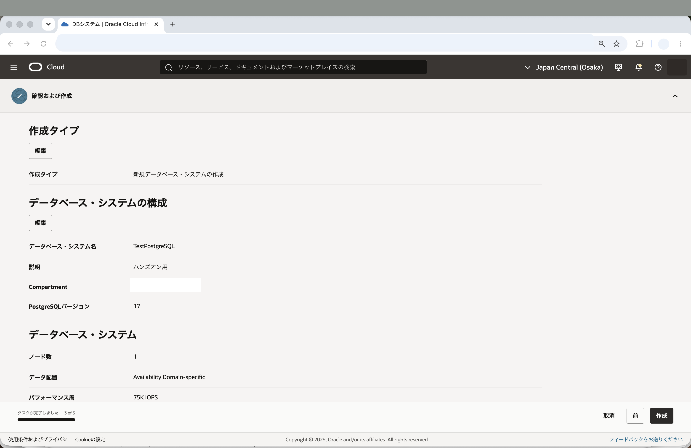
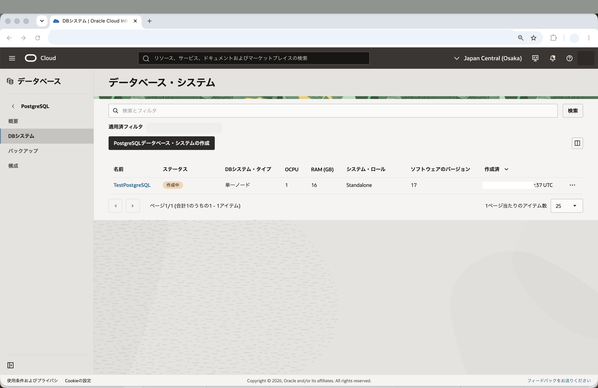
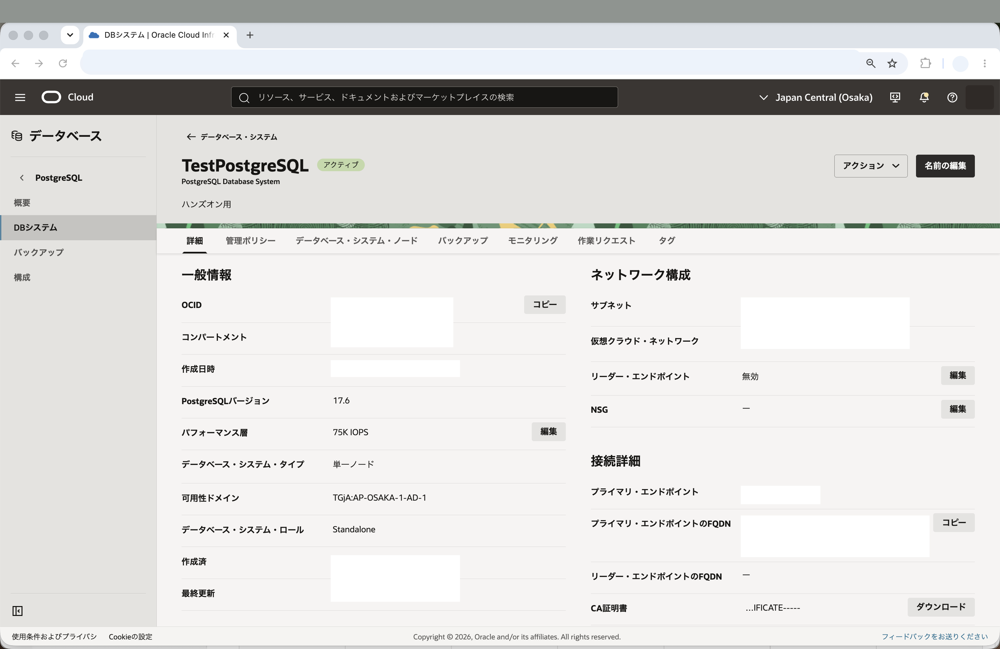
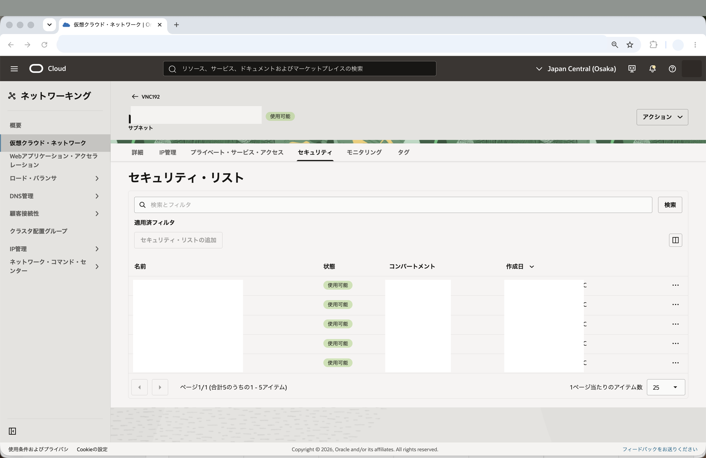
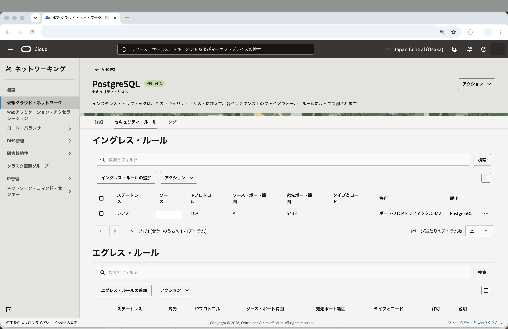

Oracle Cloud Infrastructureでは、PostgreSQL互換のフルマネージド・データベース・サービスであるOCI Database with PostgreSQLを利用できます。

このチュートリアルでは、OCIコンソールからOCI Database with PostgreSQLのDBシステムを最小構成で作成し、前提条件で作成済みのコンピュート・インスタンスからPostgreSQLクライアントを使って接続する手順を説明します。

**所要時間 :** 約20分 (DBシステム作成の待ち時間を含む)

**前提条件 :**

1. Oracle Cloud Infrastructure の環境(無料トライアルでも可) と、管理権限を持つユーザーアカウントがあること
2. [OCIコンソールにアクセスして基本を理解する - Oracle Cloud Infrastructureを使ってみよう(その1)](../../beginners/getting-started/) を完了していること
3. [クラウドに仮想ネットワーク(VCN)を作る - Oracle Cloud Infrastructureを使ってみよう(その2)](../../beginners/creating-vcn/) を完了していること
4. [インスタンスを作成する - Oracle Cloud Infrastructureを使ってみよう(その3)](../../beginners/creating-compute-instance/) を完了していること

**注意 :** チュートリアル内の画面ショットについては Oracle Cloud Infrastructure の現在のコンソール画面と異なっている場合があります。

**目次：**

- [1. OCI Database with PostgreSQLとは?](#anchor1)
- [2. OCI Database with PostgreSQLのDBシステムの作成](#anchor2)
- [3. セキュリティリストの修正(イングレス・ルールの追加)](#anchor3)
- [4. PostgreSQLクライアントのインストール](#anchor4)
- [5. 作成したDBシステムへの接続確認](#anchor5)
- [6. 作成したリソースの削除](#anchor6)

<br>

<a id="anchor1"></a>

# 1. OCI Database with PostgreSQLとは?

OCI Database with PostgreSQLは、OCIでPostgreSQL互換のデータベースを利用できるフルマネージド・サービスです。DBシステム、バックアップ、メンテナンス、メトリック、ログなどをOCIコンソールやAPIから管理できます。サービスの詳細は、[OCI Database with PostgreSQLのドキュメント](https://docs.oracle.com/ja-jp/iaas/Content/postgresql/home.htm)を参照してください。

OCI Database with PostgreSQLのDBシステム・エンドポイントはプライベートIPアドレスを使用し、インターネットから直接アクセスできません。そのため、このチュートリアルでは、前提条件で作成済みのコンピュート・インスタンスからプライベート・ネットワーク経由でDBシステムへ接続します。

<br>

<a id="anchor2"></a>

# 2. OCI Database with PostgreSQLのDBシステムの作成

OCI Database with PostgreSQLのDBシステムを作成します。このチュートリアルでは、学習用途として1ノードの最小構成を作成します。

1. コンソールメニューから **データベース** → **PostgreSQL** → **DBシステム** を選択します。

2. **PostgreSQLデータベース・システムの作成** ボタンを押します。この際、左下の **リスト範囲** でリソースを作成したいコンパートメントを選択していることを確認してください。ここでは、前提条件で利用しているコンパートメントを使用します。

    

3. **作成タイプの選択** で **新規データベース・システムの作成** を選択し、**次へ** をクリックします。

    

4. **データベース構成** で、以下の項目を入力します。

    - **データベース・システム名** - 任意の名前を入力します。ここでは `TestPostgreSQL` と入力しています。
    - **説明** - このDBシステムの説明を入力します。ここでは `ハンズオン用` と入力しています。(入力は任意です)
    - **コンパートメント** - リソースを作成するコンパートメントを選択します。
    - **PostgreSQLメジャー・バージョン** - 表示されているバージョンから選択します。ここではデフォルトで選択されているバージョンを使用します。

    

5. **データベース・システム** で、以下の項目を入力します。

    - **ノード数** - `1` を指定します。
    - **パフォーマンス層** - デフォルトの値を使用します。
    - **データ配置** - 学習用途ではデフォルトの値を使用します。
    - **可用性ドメイン** - 表示される可用性ドメインを選択します。

    ※ ノード数を2以上にすると読取りレプリカ・ノードを含む構成を作成できます。このチュートリアルでは最小構成を確認するため、1ノードで作成します。

6. **ハードウェア構成** で、以下の項目を入力します。

    - **プロセッサ** - デフォルトの値を使用します。
    - **シェイプの選択** - 表示される最小のシェイプ、または学習環境で利用可能なシェイプを選択します。

    利用できるシェイプや最小構成はリージョン、テナンシ、サービスの更新状況によって異なる場合があります。表示されている候補から、学習用途に適した小さいシェイプを選択してください。

    

7. **構成および拡張** はデフォルトのままにします。

8. **ネットワーク構成** で、以下の項目を入力します。

    - **コンパートメント** - VCNおよびサブネットを含むコンパートメントを選択します。
    - **Virtual Cloud Network** - 前提条件で作成したVCNを選択します。ここでは `TutorialVCN` を使用します。
    - **サブネット** - 前提条件で作成したプライベート・サブネットを選択します。ここでは `プライベート・サブネット-TutorialVCN` を使用します。
    - **プライベートIPアドレス** - 空欄のままにします。
    - **リーダー・エンドポイントの有効化** - このチュートリアルでは無効のままにします。
    - **ネットワーク・セキュリティ・グループを使用したトラフィックの制御** - このチュートリアルでは使用しません。

    

9. **データベース・システム管理者資格証明** で、以下の項目を入力します。

    - **パスワードの入力** - 選択します。
    - **パスワード** - 管理者パスワードを入力します。
    - **パスワードの確認** - 管理者パスワードを再入力します。

    ※ OCI Database with PostgreSQLの管理ユーザーは、一般的なPostgreSQLのスーパーユーザーではありません。ユーザーやロールの作成など、マネージド・サービスで許可された管理操作を行うためのユーザーです。

    

10. **次へ** をクリックします。

11. **管理ポリシー** で、以下の項目を確認します。

    - **自動バックアップ** - 学習用途では有効のままにします。
    - **バックアップ頻度** - デフォルトの値を使用します。
    - **バックアップ保持期間(日数)** - デフォルトの値を使用します。
    - **バックアップ・コピーの有効化** - このチュートリアルでは無効のままにします。
    - **メンテナンス・タイプ** - デフォルトの値を使用します。

    

12. **次へ** をクリックします。

13. **確認および作成** で設定内容を確認し、問題がなければ **作成** をクリックします。

    

14. DBシステムが **作成中** になるのでしばらく待ちます。作成が完了すると、ステータスが **アクティブ** に変わります。

    

    

15. 作成したDBシステムの詳細画面で、**接続の詳細** に表示される **FQDN** を確認しておきます。後続の接続確認で使用します。

16. 同じく **接続の詳細** からCA証明書をダウンロードします。ダウンロードした証明書は、後続の接続確認で使用します。

    

<br>

<a id="anchor3"></a>

# 3. セキュリティリストの修正(イングレス・ルールの追加)

このチュートリアルで作成したDBシステムへコンピュート・インスタンスから接続するため、PostgreSQLの通信に使用するTCP 5432ポートへの通信を許可します。

1. コンソールメニューから **ネットワーキング** → **仮想クラウド・ネットワーク** を選択し、前提条件で作成したVCNを選択します。ここでは `TutorialVCN` を使用します。

2. **プライベート・サブネット-TutorialVCN** をクリックします。

3. **プライベート・サブネット-TutorialVCNのセキュリティ・リスト** をクリックします。

    

4. **イングレス・ルールの追加** をクリックします。

5. 立ち上がった **イングレス・ルールの追加** ウィンドウで、以下の項目を入力し **イングレス・ルールの追加** ボタンを押します。

    - **ソースCIDR** - `10.0.0.0/16` と入力します。
    - **IPプロトコル** - `TCP` を選択します。
    - **ソース・ポート範囲** - `すべて` のままにします。
    - **宛先ポート範囲** - `5432` と入力します。
    - **説明** - `PostgreSQL` と入力します。(入力は任意です)

6. TCP 5432ポートに対するイングレス・ルールが追加されたことを確認します。

    

<br>

<a id="anchor4"></a>

# 4. PostgreSQLクライアントのインストール

前提条件で作成したコンピュート・インスタンスに接続し、PostgreSQLクライアントをインストールします。

1. [インスタンスを作成する - Oracle Cloud Infrastructureを使ってみよう(その3)](../../beginners/creating-compute-instance/)で作成したコンピュート・インスタンスにSSHで接続します。

2. 以下のコマンドを実行し、PostgreSQLクライアントをインストールします。

    実行コマンド例(コピー＆ペースト用)

    ```
    sudo dnf install -y postgresql
    ```

    ※ 使用しているOSイメージによっては、`dnf` のかわりに `yum` を使用します。

3. 以下のコマンドで `psql` コマンドが使用できることを確認します。

    ```
    psql --version
    ```

4. OCIコンソールからダウンロードしたCA証明書を、コンピュート・インスタンスに配置します。ここでは、ホーム・ディレクトリに `dbsystem.pub` というファイル名で保存したものとして説明します。

    ローカルPCにダウンロードした証明書をSSHで転送する場合の実行例は以下の通りです。`<秘密鍵ファイル>`、`<コンピュートのパブリックIPアドレス>`、`<ダウンロードした証明書ファイル>` は環境にあわせて置き換えてください。

    ```
    scp -i <秘密鍵ファイル> <ダウンロードした証明書ファイル> opc@<コンピュートのパブリックIPアドレス>:~/dbsystem.pub
    ```

    コンピュート・インスタンス上で以下のコマンドを実行し、証明書ファイルが配置されていることを確認します。

    ```
    ls -l ~/dbsystem.pub
    ```

<br>

<a id="anchor5"></a>

# 5. 作成したDBシステムへの接続確認

PostgreSQLクライアントを使用して、作成したDBシステムへ接続します。

1. 以下のコマンドを実行して、DBシステムに接続します。`<DBシステムのFQDN>` は、DBシステム詳細画面の **接続の詳細** で確認したFQDNに置き換えてください。

    実行コマンド例(コピー＆ペースト用)

    ```
    psql "sslmode=verify-full sslrootcert=$HOME/dbsystem.pub host=<DBシステムのFQDN> dbname=postgres user=postgres"
    ```

    ※ 要塞ポート転送セッションを利用してローカルPCから接続する場合は、OCI公式ドキュメントの[OCI Database with PostgreSQLでのデータベースへの接続](https://docs.oracle.com/ja-jp/iaas/Content/postgresql/connect-to-db.htm)も参照してください。

    パスワードを求められたら、DBシステム作成時に設定した管理者パスワードを入力します。

    接続できない場合は、以下を確認してください。

    - コンピュート・インスタンスとDBシステムが同じVCN内、または到達可能なネットワーク内にあること
    - DBシステムがプライベート・サブネットに作成されていること
    - プライベート・サブネットのセキュリティ・リストでTCP 5432が許可されていること
    - 接続文字列のFQDN、証明書パス、ユーザー名に誤りがないこと

2. 接続後、以下のSQLを実行します。

    ```
    SELECT version();
    ```

    ```
    SELECT current_database();
    ```

    ```
    SELECT current_user;
    ```

3. チュートリアル用のデータベースを作成します。

    ```
    CREATE DATABASE tutorialdb;
    ```

4. `psql` を終了します。

    ```
    \q
    ```

5. 作成した `tutorialdb` に接続します。

    ```
    psql "sslmode=verify-full sslrootcert=$HOME/dbsystem.pub host=<DBシステムのFQDN> dbname=tutorialdb user=postgres"
    ```

6. テーブルを作成し、データを登録します。

    ```
    CREATE TABLE products (
      id integer PRIMARY KEY,
      name text NOT NULL,
      price integer NOT NULL
    );
    ```

    ```
    INSERT INTO products (id, name, price) VALUES
      (1, 'keyboard', 12000),
      (2, 'mouse', 3000),
      (3, 'display', 28000);
    ```

7. 登録したデータを確認します。

    ```
    SELECT * FROM products ORDER BY id;
    ```

    実行例

    ```
     id |   name   | price
    ----+----------+-------
      1 | keyboard | 12000
      2 | mouse    |  3000
      3 | display  | 28000
    (3 rows)
    ```

    

8. `psql` を終了します。

    ```
    \q
    ```

これで、この章の作業は終了です。

この章では、OCI Database with PostgreSQLのDBシステムを1つ作成し、コンピュート・インスタンスからPostgreSQLクライアントで接続確認をしました。

<br>

<a id="anchor6"></a>

# 6. 作成したリソースの削除

以降のチュートリアルでは、このチュートリアルで作成したDBシステムをそのまま使用します。継続してPostgreSQLチュートリアルを進める場合は、この章の削除作業は行わないでください。

このチュートリアルで作成したDBシステムを今後使用しない場合は、課金を避けるため削除します。

1. コンソールメニューから **データベース** → **PostgreSQL** → **DBシステム** を選択します。

2. 作成したDBシステムをクリックします。ここでは `TestPostgreSQL` を選択します。

3. **他のアクション** → **削除** をクリックします。

4. 確認ダイアログの内容を確認し、必要な操作を行って削除します。

5. DBシステムのステータスが削除中になったことを確認します。

※ 削除時のバックアップ保持や最終バックアップの扱いは、コンソールの表示内容を確認して選択してください。学習用途でバックアップを残す必要がない場合は、不要なバックアップが残らないように注意してください。
