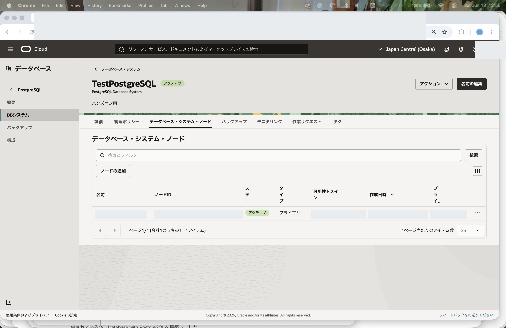
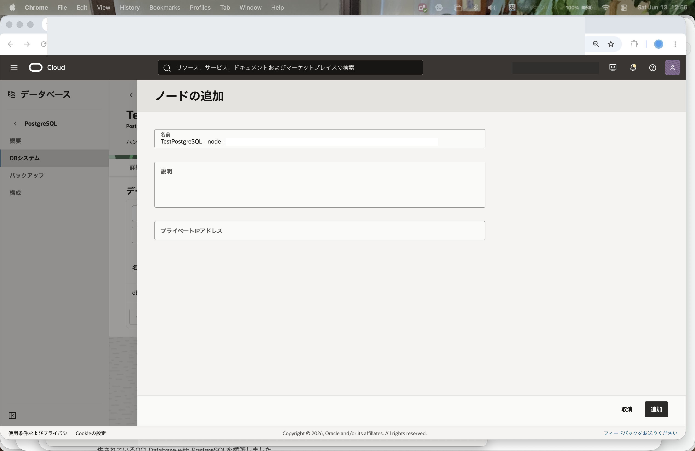
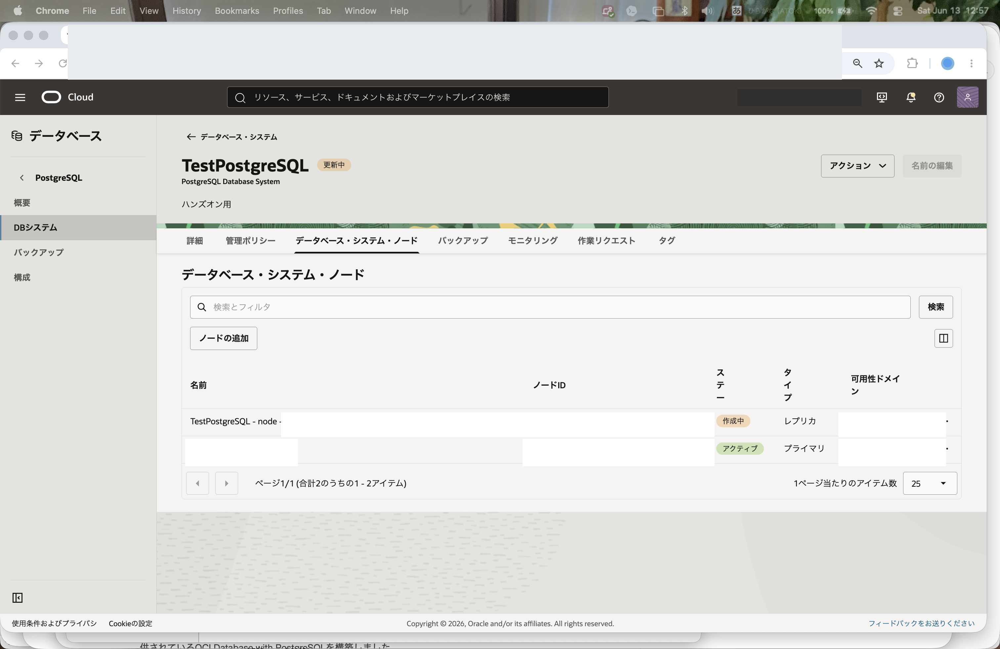
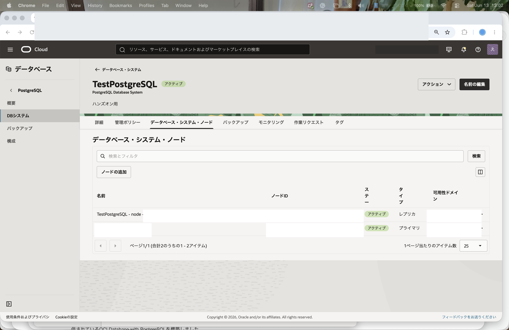
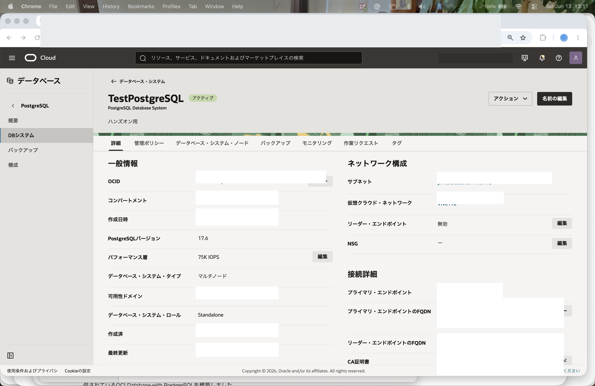
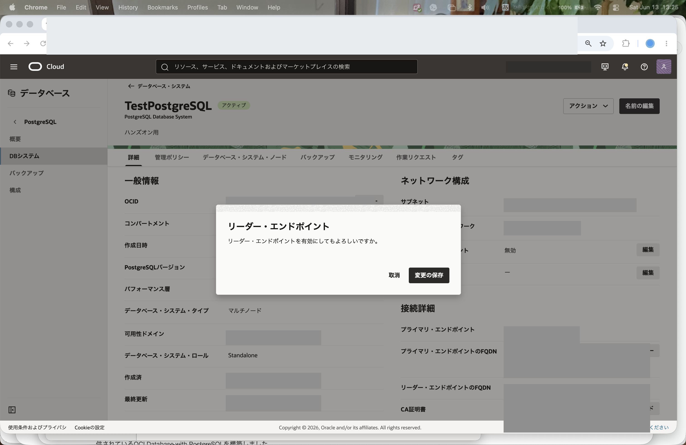
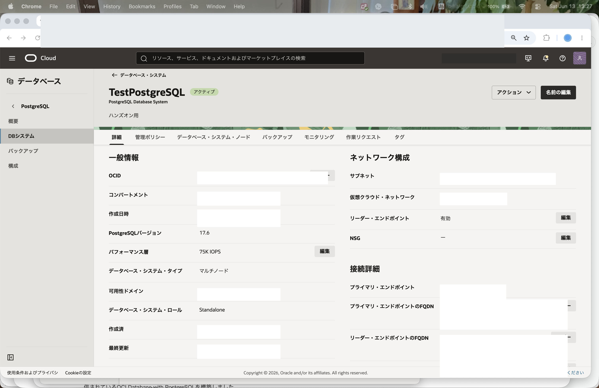
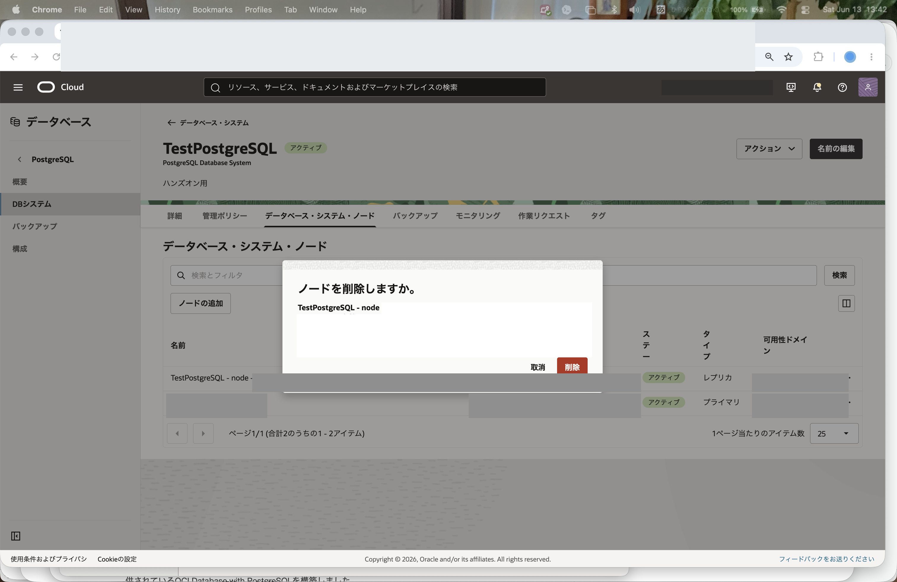
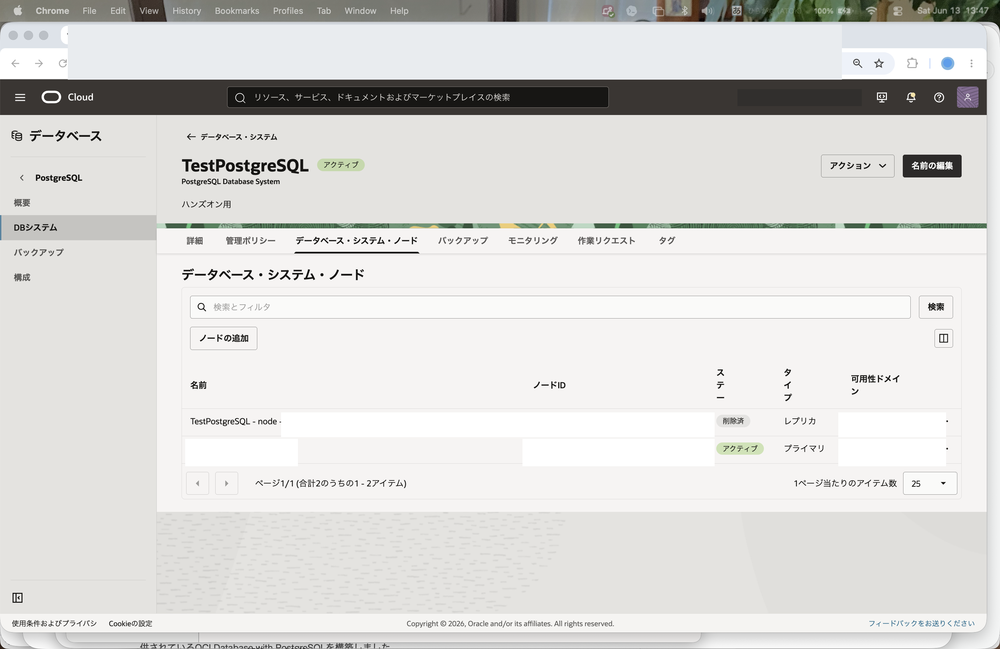

Oracle Cloud Infrastructureでは、OCI Database with PostgreSQLのDBシステムに読取りレプリカを追加し、読取り処理を複数ノードに分散できます。

このチュートリアルでは、[101: PostgreSQLを最小構成で作成し、データベースに接続する](../psql101-create-db/)で作成した1ノード構成のDBシステムに読取りレプリカを追加し、リーダー・エンドポイントを有効化して、接続先の違いを確認します。

**所要時間 :** 約20分 (読取りレプリカ追加の待ち時間を含む)

**前提条件 :**

1. Oracle Cloud Infrastructure の環境(無料トライアルでも可) と、管理権限を持つユーザーアカウントがあること
2. [OCIコンソールにアクセスして基本を理解する - Oracle Cloud Infrastructureを使ってみよう(その1)](../../beginners/getting-started/) を完了していること
3. [クラウドに仮想ネットワーク(VCN)を作る - Oracle Cloud Infrastructureを使ってみよう(その2)](../../beginners/creating-vcn/) を完了していること
4. [インスタンスを作成する - Oracle Cloud Infrastructureを使ってみよう(その3)](../../beginners/creating-compute-instance/) を完了していること
5. [101: PostgreSQLを最小構成で作成し、データベースに接続する](../psql101-create-db/) を完了していること

**注意 :** チュートリアル内の画面ショットについては Oracle Cloud Infrastructure の現在のコンソール画面と異なっている場合があります。

**目次：**

- [1. 高可用性構成と負荷分散の概要](#anchor1)
- [2. DBシステム作成時に2ノード構成を選択する場合](#anchor2)
- [3. 既存DBシステムに読取りレプリカを追加する](#anchor3)
- [4. リーダー・エンドポイントを有効化する](#anchor4)
- [5. プライマリ・エンドポイントとリーダー・エンドポイントの接続先を確認する](#anchor5)
- [6. ノード数を1に戻す](#anchor6)

<br>

<a id="anchor1"></a>

# 1. 高可用性構成と負荷分散の概要

OCI Database with PostgreSQLでは、1つのDBシステムに複数のデータベース・インスタンス・ノードを配置できます。DBシステム内にはプライマリ・ノードと読取りレプリカ・ノードがあり、プライマリは読取りと書込みを処理し、読取りレプリカは読取り処理を担当します。

高可用性の観点では、少なくとも2つのノードを含むDBシステムで障害が検出されると、サービスはフェイルオーバーを実行し、レプリカの1つをプライマリに昇格します。これにより、単一ノード構成よりも短い復旧時間でサービスを継続できます。マルチADリージョンでリージョナル・データ配置を選択した場合は、可用性ドメイン・レベルの停止にも耐えられる構成にできます。詳細は、OCI公式ドキュメントの[OCI Database with PostgreSQLの高可用性とビジネス継続性](https://docs.oracle.com/ja-jp/iaas/Content/postgresql/high-availability.htm)を参照してください。

ストレージの観点では、OCI Database with PostgreSQLはコンピュート・リソースから分離されたデータベース最適化ストレージを使用します。読取りレプリカはPostgreSQLデータベースの追加コピーを持つのではなく、共有ストレージを使用します。そのため、フェイルオーバー時の切り替えや読取りスケールにおいて、データコピーの管理を抑えやすく、表の作成や削除に応じたストレージの動的スケーリングにより容量管理の負担も軽減できます。

ビジネス継続性の目標として、公式ドキュメントでは、マルチノードDBシステムのリカバリ時間目標(RTO)は2分未満、リカバリ・ポイント目標(RPO)は0、アップタイムSLAは99.99%と記載されています。単一ADリージョンの単一ノードDBシステムでは、RTOは20分未満、RPOは0、アップタイムSLAは99.9%です。

負荷分散の観点では、読取りレプリカを追加すると、読取りワークロードをプライマリから分離できます。これにより、読取り処理が多いアプリケーションではプライマリの負荷を下げ、読取り処理を複数ノードに分散できます。

OCI Database with PostgreSQLでは、接続先として主に以下のエンドポイントを使用します。

- **プライマリ・エンドポイント** - プライマリに接続するエンドポイントです。読取りと書込みに使用します。
- **リーダー・エンドポイント** - 読取りレプリカに接続するためのエンドポイントです。読取り処理の分散に使用します。

リーダー・エンドポイントは、読取りレプリカを追加しただけでは使用できません。DBシステムのネットワーク構成でリーダー・エンドポイントを有効化する必要があります。

<br>

<a id="anchor2"></a>

# 2. DBシステム作成時に2ノード構成を選択する場合

新規にDBシステムを作成する時点で2ノード構成にする場合は、[101: PostgreSQLを最小構成で作成し、データベースに接続する](../psql101-create-db/)の作成手順のうち、**データベース・システム** の **ノード数** を `1` ではなく `2` に変更します。


このチュートリアルでは、101で作成済みの1ノード構成のDBシステムを使って、既存DBシステムに読取りレプリカを追加する流れを確認します。そのため、この章では実際の作成操作は行いません。

<br>

<a id="anchor3"></a>

# 3. 既存DBシステムに読取りレプリカを追加する

101で作成したDBシステムに、読取りレプリカを1つ追加します。ノード追加の詳細は、OCI公式ドキュメントの[データベース・システムへのノードの追加](https://docs.oracle.com/ja-jp/iaas/Content/postgresql/node-add.htm#top)も参照してください。

1. コンソールメニューから **データベース** → **PostgreSQL** → **DBシステム** を選択します。

2. 101で作成したDBシステムをクリックします。ここでは `TestPostgreSQL` を選択します。

3. DBシステムの詳細画面で **データベース・システム・ノード** タブをクリックします。

    

4. **ノードの追加** をクリックします。


5. ノード追加画面で、追加する読取りレプリカの設定を確認します。学習用途では、表示されるデフォルト値を使用します。

    

6. **追加** をクリックします。

7. ノード追加の作業リクエストが開始されます。追加したノードが使用可能になるまで待ちます。

    

8. **データベース・システム・ノード** タブで、プライマリと読取りレプリカが表示されていることを確認します。

    

読取りレプリカの追加中は、DBシステムの状態やノードの状態が一時的に更新中になります。ノード追加が完了してから、次の章に進んでください。

<br>

<a id="anchor4"></a>

# 4. リーダー・エンドポイントを有効化する

読取りレプリカに接続するため、DBシステムのリーダー・エンドポイントを有効化します。

1. DBシステムの詳細画面で **詳細** タブをクリックします。

2. **ネットワーク構成** の **リーダー・エンドポイント** が無効になっていることを確認します。

    

3. **ネットワーク構成** の **編集** をクリックします。

4. **リーダー・エンドポイントの有効化** をオンにします。

    

5. **変更の保存** をクリックします。

6. DBシステムの詳細画面で、**接続詳細** に **リーダー・エンドポイントのFQDN** が表示されることを確認します。

    

リーダー・エンドポイントのFQDNは、後続の接続確認で使用します。101で確認したプライマリ・エンドポイントのFQDNとあわせて控えておきます。

<br>

<a id="anchor5"></a>

# 5. プライマリ・エンドポイントとリーダー・エンドポイントの接続先を確認する

コンピュート・インスタンスから、プライマリ・エンドポイントとリーダー・エンドポイントに接続します。

1. 101で使用したコンピュート・インスタンスにSSHで接続します。

2. 101でダウンロードしたCA証明書がコンピュート・インスタンスに配置されていることを確認します。ここでは、ホーム・ディレクトリに `dbsystem.pub` というファイル名で保存しているものとして説明します。

    ```
    ls -l ~/dbsystem.pub
    ```

3. プライマリ・エンドポイントに接続します。`<プライマリ・エンドポイントのFQDN>` は、DBシステム詳細画面の **接続詳細** で確認したFQDNに置き換えてください。

    ```
    psql "sslmode=verify-full sslrootcert=$HOME/dbsystem.pub host=<プライマリ・エンドポイントのFQDN> dbname=postgres user=postgres"
    ```

4. 接続後、以下のSQLを実行し、接続先の情報を確認します。

    ```
    SELECT inet_server_addr();
    ```

    ```
    SELECT pg_is_in_recovery();
    ```

    `pg_is_in_recovery()` が `f` の場合、プライマリに接続しています。

5. `psql` を終了します。

    ```
    \q
    ```

6. リーダー・エンドポイントに接続します。`<リーダー・エンドポイントのFQDN>` は、DBシステム詳細画面の **接続詳細** で確認したFQDNに置き換えてください。

    ```
    psql "sslmode=verify-full sslrootcert=$HOME/dbsystem.pub host=<リーダー・エンドポイントのFQDN> dbname=postgres user=postgres"
    ```

7. 接続後、以下のSQLを実行し、接続先の情報を確認します。

    ```
    SELECT inet_server_addr();
    ```

    ```
    SELECT pg_is_in_recovery();
    ```

    `pg_is_in_recovery()` が `t` の場合、読取りレプリカに接続しています。

8. リーダー・エンドポイントへの接続を複数回実行し、`inet_server_addr()` の結果を確認します。

リーダー・エンドポイントは読取りレプリカ向けの接続先です。読取りレプリカが複数ある場合は、接続が複数の読取りレプリカに振り分けられることを確認できます。このチュートリアルのように2ノード構成で読取りレプリカが1つの場合は、リーダー・エンドポイントの接続先は追加した読取りレプリカになります。

<br>

<a id="anchor6"></a>

# 6. ノード数を1に戻す

読取りレプリカを今後使用しない場合は、課金を避けるためノード数を1に戻します。

1. DBシステムの詳細画面で **データベース・システム・ノード** タブをクリックします。

2. 追加した読取りレプリカの行にある **アクション** メニューをクリックします。

    

3. **削除** をクリックします。

4. 確認ダイアログの内容を確認し、削除を実行します。

    

5. 読取りレプリカの削除が完了し、DBシステムが1ノード構成に戻ったことを確認します。

    

6. リーダー・エンドポイントを使用しない場合は、**詳細** タブの **ネットワーク構成** からリーダー・エンドポイントを無効化します。

これで、この章の作業は終了です。

この章では、OCI Database with PostgreSQLのDBシステムに読取りレプリカを追加し、リーダー・エンドポイントを使用した接続先の違いを確認しました。
