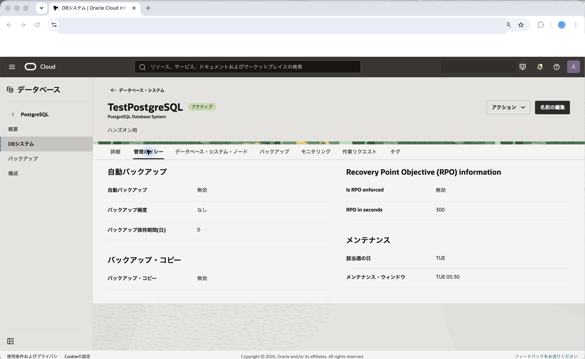
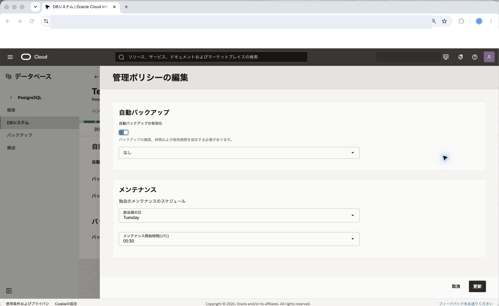
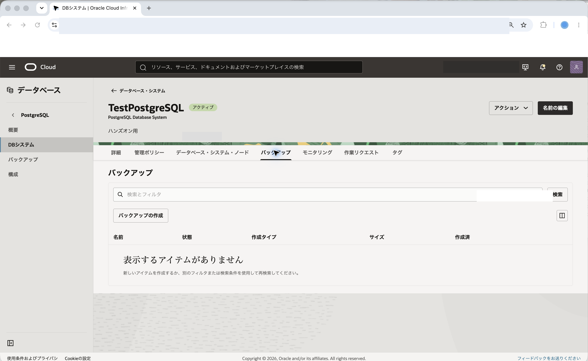
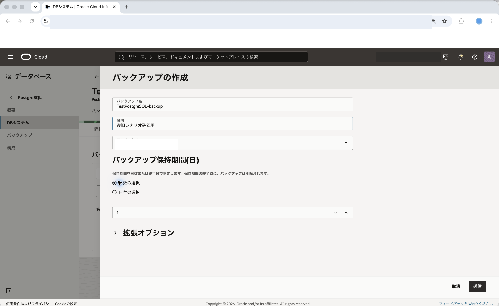
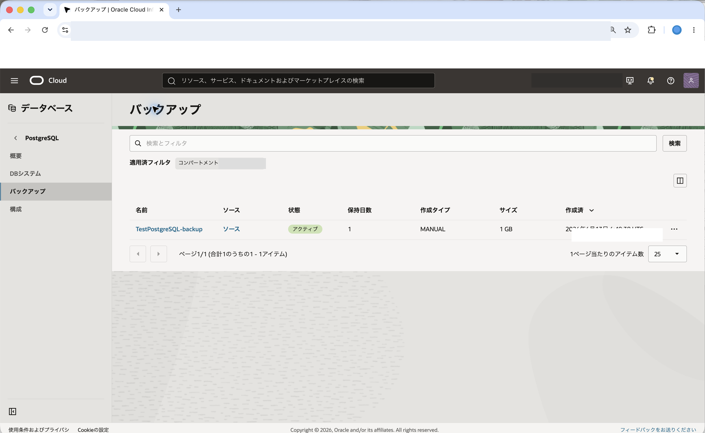

OCI Database with PostgreSQLでは、DBシステムのバックアップを自動またはオンデマンドで作成できます。

このチュートリアルでは、[101: PostgreSQLを最小構成で作成し、データベースに接続する](../psql101-create-db/)で作成したDBシステムを使用し、自動バックアップ設定の確認と変更、オンデマンド・バックアップの手動作成を行います。

**所要時間 :** 約20分 (バックアップ作成の待ち時間を含む)

**前提条件 :**

1. Oracle Cloud Infrastructure の環境(無料トライアルでも可) と、管理権限を持つユーザーアカウントがあること
2. [OCIコンソールにアクセスして基本を理解する - Oracle Cloud Infrastructureを使ってみよう(その1)](../../beginners/getting-started/) を完了していること
3. [クラウドに仮想ネットワーク(VCN)を作る - Oracle Cloud Infrastructureを使ってみよう(その2)](../../beginners/creating-vcn/) を完了していること
4. [インスタンスを作成する - Oracle Cloud Infrastructureを使ってみよう(その3)](../../beginners/creating-compute-instance/) を完了していること
5. [101: PostgreSQLを最小構成で作成し、データベースに接続する](../psql101-create-db/) を完了していること

**注意 :** チュートリアル内の画面ショットについては Oracle Cloud Infrastructure の現在のコンソール画面と異なっている場合があります。

**目次：**

- [1. バックアップの概要](#anchor1)
- [2. 自動バックアップ設定を確認する](#anchor2)
- [3. 自動バックアップ設定を変更する](#anchor3)
- [4. オンデマンド・バックアップを作成する](#anchor4)
- [5. バックアップの作成結果を確認する](#anchor5)

 

# 1. バックアップの概要

OCI Database with PostgreSQLでは、DBシステムのバックアップを作成し、障害対応や検証環境の作成に使用できます。バックアップには、サービスがスケジュールに従って作成する自動バックアップと、利用者が任意のタイミングで作成するオンデマンド・バックアップがあります。

自動バックアップは、DBシステムの管理ポリシーで有効化、頻度、保持期間などを管理します。オンデマンド・バックアップは、作業前の退避や復旧シナリオの確認など、特定の時点を明示的に残したい場合に使用します。

このチュートリアルでは、バックアップ設定の変更とオンデマンド・バックアップの作成をOCIコンソールから確認します。バックアップ機能の詳細は、OCI公式ドキュメントの[バックアップの管理](https://docs.oracle.com/ja-jp/iaas/Content/postgresql/backups.htm)を参照してください。

 

# 2. 自動バックアップ設定を確認する

101で作成したDBシステムの自動バックアップ設定を確認します。

1. コンソールメニューから **データベース** → **PostgreSQL** → **DBシステム** を選択します。

2. 101で作成したDBシステムをクリックします。ここでは `TestPostgreSQL` を選択します。

3. DBシステムの詳細画面で **管理ポリシー** タブをクリックします。

    

4. **バックアップ・ポリシー** または **自動バックアップ** の設定を確認します。

5. バックアップが有効か、バックアップ頻度、バックアップ保持期間を確認します。

自動バックアップの設定は、DBシステム作成時に指定した管理ポリシーに基づきます。学習環境では、以降の復旧シナリオでオンデマンド・バックアップを使用するため、自動バックアップ設定は確認のみでもかまいません。

 

# 3. 自動バックアップ設定を変更する

自動バックアップ設定を変更します。ここでは例として、バックアップ保持期間を変更する流れを確認します。

1. DBシステムの詳細画面で **管理ポリシー** タブをクリックします。

2. 画面右上にある**アクション▼**のプルダウンから **管理ポリシーの編集** をクリックします。

3. **自動バックアップ** が有効であることを確認します。

4. **バックアップ頻度**、**バックアップ保持期間(日数)** などの設定を確認し、必要に応じて変更します。

    

5. **更新** をクリックします。

6. 管理ポリシーの表示に戻り、変更後のバックアップ設定が反映されていることを確認します。

バックアップ保持期間を長くすると、復旧できる期間は長くなりますが、保存されるバックアップ量も増えます。学習環境では、必要以上に長い保持期間を設定しないようにします。

 

# 4. オンデマンド・バックアップを作成する

104の復旧シナリオで使用するため、オンデマンド・バックアップを作成します。

1. DBシステムの詳細画面で **バックアップ** タブをクリックします。

2. **バックアップの作成** をクリックします。

    

3. バックアップ作成画面で、以下の項目を入力します。

    - **名前** - 任意のバックアップ名を入力します。ここでは `TestPostgreSQL-backup` と入力します。
    - **説明** - バックアップの説明を入力します。ここでは `復旧シナリオ確認用` と入力します。(入力は任意です)

    

4. **バックアップの作成** をクリックします。

5. バックアップの作業リクエストが開始されます。バックアップが作成されるまで待ちます。

オンデマンド・バックアップの作成には時間がかかる場合があります。作成中はバックアップの状態が一時的に更新中または作成中になります。

 

# 5. バックアップの作成結果を確認する

作成したオンデマンド・バックアップを確認します。

1. DBシステムの詳細画面で **バックアップ** タブをクリックします。

2. 作成したバックアップが一覧に表示されていることを確認します。

3. バックアップの状態が **アクティブ** または使用可能な状態になっていることを確認します。

    

4. バックアップ名をクリックし、バックアップの詳細画面を開きます。

5. バックアップの対象DBシステム、作成日時、状態を確認します。

これで、この章の作業は終了です。

この章では、OCI Database with PostgreSQLの自動バックアップ設定を確認・変更し、オンデマンド・バックアップを作成しました。次のチュートリアルでは、このバックアップから新しいDBシステムを作成します。
