OCI Database with PostgreSQLでは、作成済みのバックアップから新しいDBシステムを作成できます。

このチュートリアルでは、[103: バックアップを管理する](../psql103-backup-management/)で作成したオンデマンド・バックアップを使用し、新しいDBシステムを作成します。作成後、コンピュート・インスタンスから接続してデータを確認し、最後に復旧確認用のDBシステムを削除します。

**所要時間 :** 約30分 (DBシステム作成の待ち時間を含む)

**前提条件 :**

1. Oracle Cloud Infrastructure の環境(無料トライアルでも可) と、管理権限を持つユーザーアカウントがあること
2. [OCIコンソールにアクセスして基本を理解する - Oracle Cloud Infrastructureを使ってみよう(その1)](../../beginners/getting-started/) を完了していること
3. [クラウドに仮想ネットワーク(VCN)を作る - Oracle Cloud Infrastructureを使ってみよう(その2)](../../beginners/creating-vcn/) を完了していること
4. [インスタンスを作成する - Oracle Cloud Infrastructureを使ってみよう(その3)](../../beginners/creating-compute-instance/) を完了していること
5. [101: PostgreSQLを最小構成で作成し、データベースに接続する](../psql101-create-db/) を完了していること
6. [103: バックアップを管理する](../psql103-backup-management/) を完了し、オンデマンド・バックアップを作成していること

**注意 :** チュートリアル内の画面ショットについては Oracle Cloud Infrastructure の現在のコンソール画面と異なっている場合があります。

**目次：**

- [1. バックアップからの復旧シナリオの概要](#anchor1)
- [2. 復旧元のバックアップを確認する](#anchor2)
- [3. バックアップから新しいDBシステムを作成する](#anchor3)
- [4. 復旧したDBシステムに接続する](#anchor4)
- [5. 復旧したデータを確認する](#anchor5)
- [6. 復旧確認用のDBシステムを削除する](#anchor6)

<br>

<a id="anchor1"></a>

# 1. バックアップからの復旧シナリオの概要

バックアップから新しいDBシステムを作成すると、既存のDBシステムを直接上書きせず、別のDBシステムとして復旧結果を確認できます。検証環境の作成、復旧手順の確認、データ破損や誤操作からの切り戻し検討などに利用できます。

このチュートリアルでは、103で作成したオンデマンド・バックアップを復旧元として使用します。新しいDBシステムは、101で使用したVCNとプライベート・サブネットに作成します。作成後、101と同じコンピュート・インスタンスからPostgreSQLクライアントで接続します。

バックアップからのDBシステム作成の詳細は、OCI公式ドキュメントの[PostgreSQLデータベース・システムの作成](https://docs.oracle.com/ja-jp/iaas/Content/postgresql/create-db.htm)および[バックアップの管理](https://docs.oracle.com/ja-jp/iaas/Content/postgresql/backups.htm)を参照してください。

<br>

<a id="anchor2"></a>

# 2. 復旧元のバックアップを確認する

103で作成したオンデマンド・バックアップを確認します。

1. コンソールメニューから **データベース** → **PostgreSQL** → **バックアップ** を選択します。

    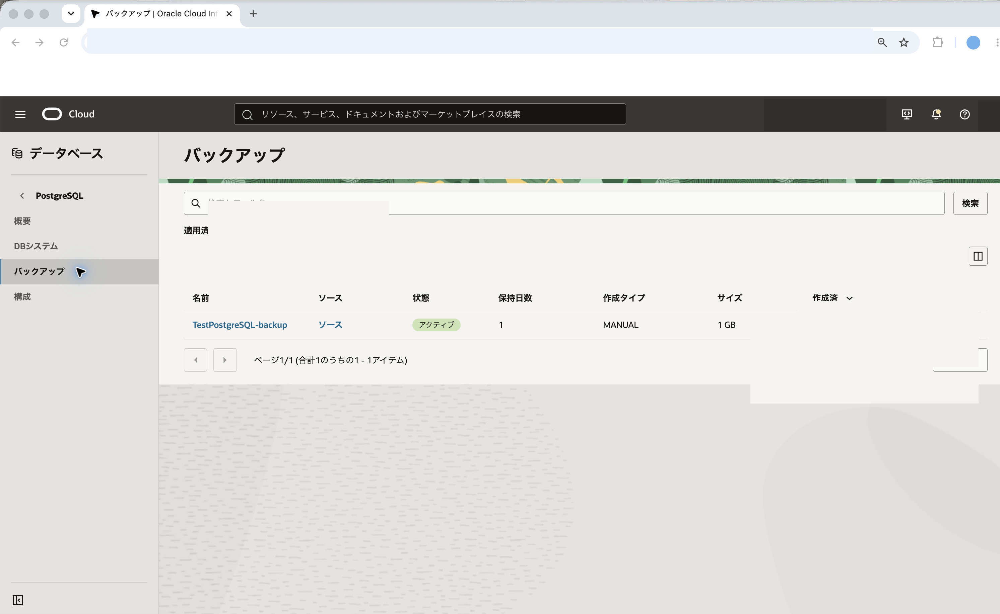

2. 103で作成したバックアップをクリックします。ここでは `TestPostgreSQL-backup` を選択します。

3. バックアップの詳細画面で、状態が **アクティブ** または使用可能な状態であることを確認します。

4. バックアップの対象DBシステム、作成日時、バックアップ・タイプを確認します。

    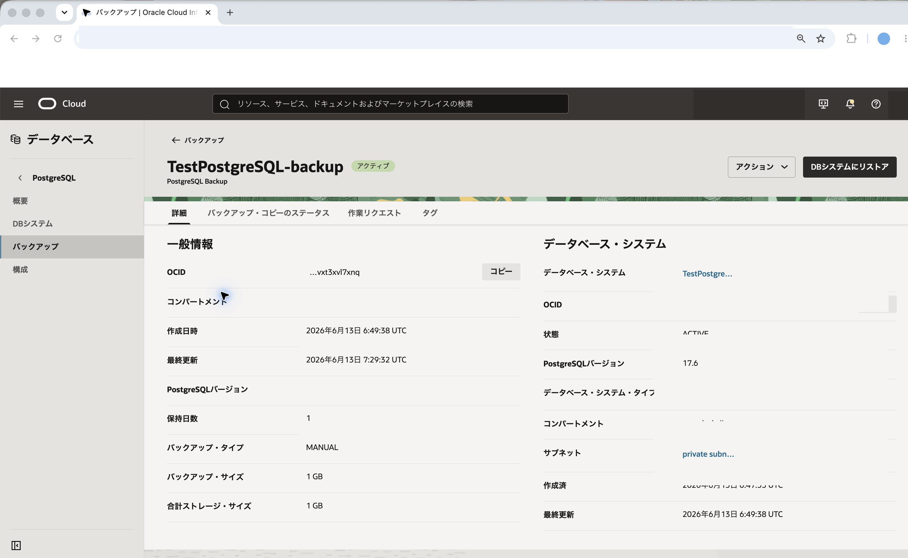

復旧元バックアップが使用可能な状態でない場合は、バックアップ作成が完了するまで待ってから次の章に進みます。

<br>

<a id="anchor3"></a>

# 3. バックアップから新しいDBシステムを作成する

バックアップから新しいDBシステムを作成します。

1. データベース・システムの一覧の画面で **データベース・システムの作成** をクリックします。

    

2. **作成タイプの選択** で、バックアップからDBシステムを作成する選択肢が選ばれていることを確認します。

    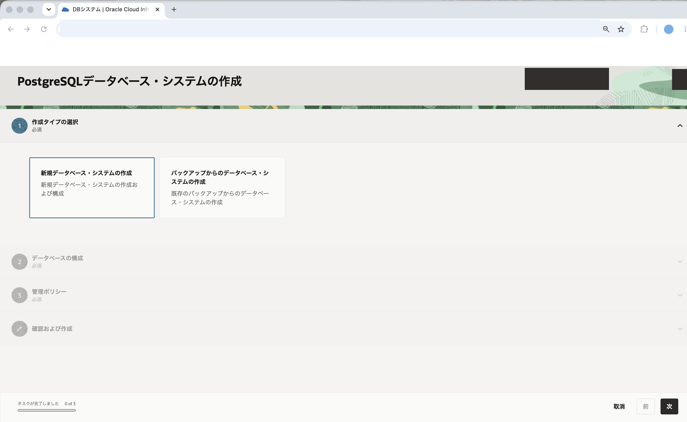

3. **データベース構成** で、以下の項目を入力します。

    - **データベース・システム名** - 任意の名前を入力します。ここでは `TestPostgreSQL-restore` と入力します。
    - **説明** - このDBシステムの説明を入力します。ここでは `復旧確認用` と入力しています。(入力は任意です)
    - **コンパートメント** - リソースを作成するコンパートメントを選択します。

    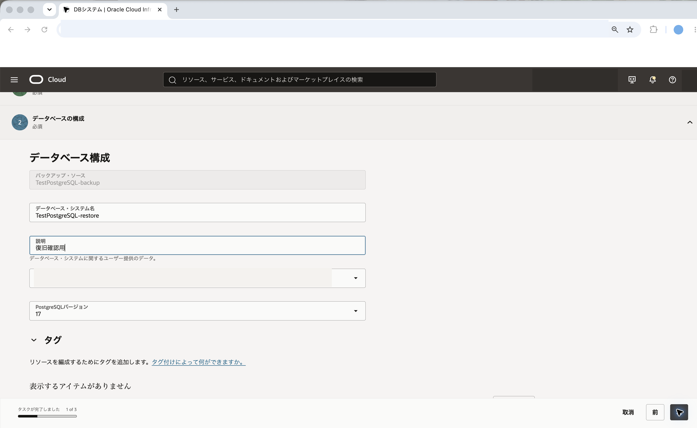

4. **データベース・システム**、**ハードウェア構成** は学習用途に合わせて小さい構成を選択します。101と同じ構成で復旧する場合は、101で使用した値と同じ値を指定します。

5. **ネットワーク構成** で、以下の項目を入力します。

    - **Virtual Cloud Network** - 101で使用したVCNを選択します。
    - **サブネット** - 101で使用したプライベート・サブネットを選択します。
    - **プライベートIPアドレス** - 空欄のままにします。
    - **リーダー・エンドポイントの有効化** - このチュートリアルでは無効のままにします。
    - **ネットワーク・セキュリティ・グループを使用したトラフィックの制御** - 101と同じ設定を使用します。

    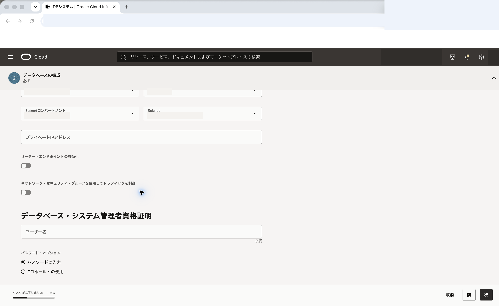

6. **データベース・システム管理者資格証明** で、管理者パスワードを入力します。

    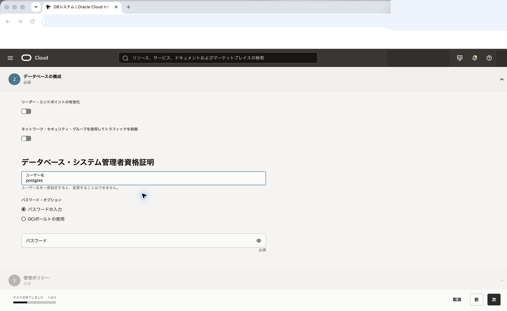

7. **管理ポリシー** で、バックアップやメンテナンスの設定を確認します。学習用途ではデフォルト値を使用します。

8. **確認および作成** で設定内容を確認し、問題がなければ **作成** をクリックします。

    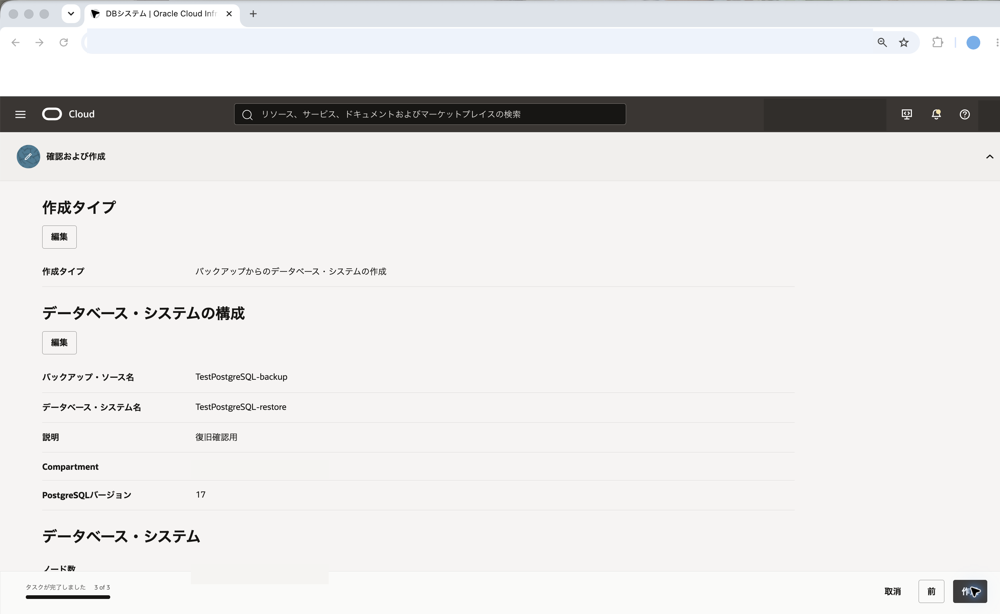

9. DBシステムが作成中になります。作成が完了し、ステータスが **アクティブ** になるまで待ちます。

    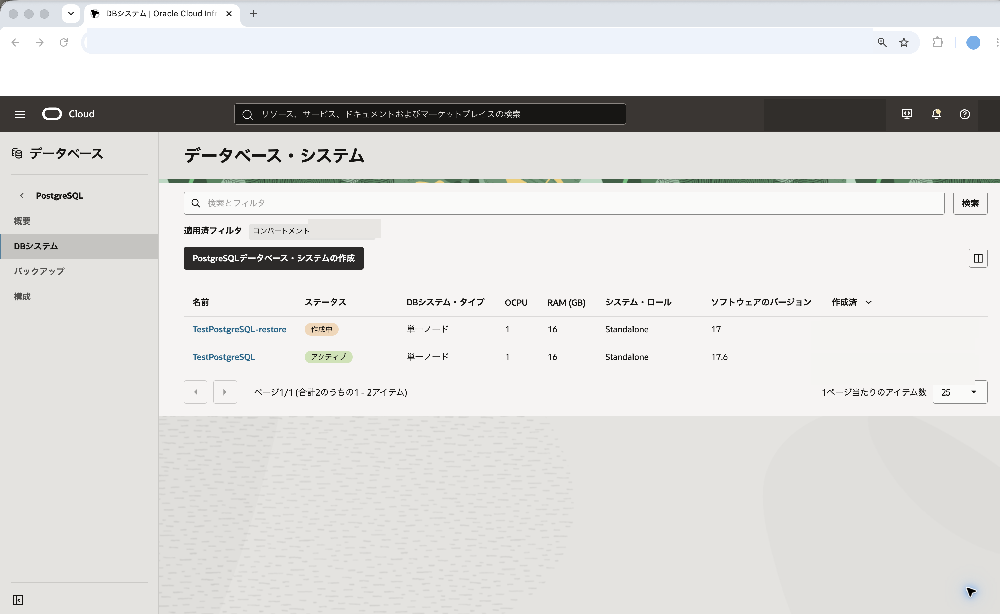

    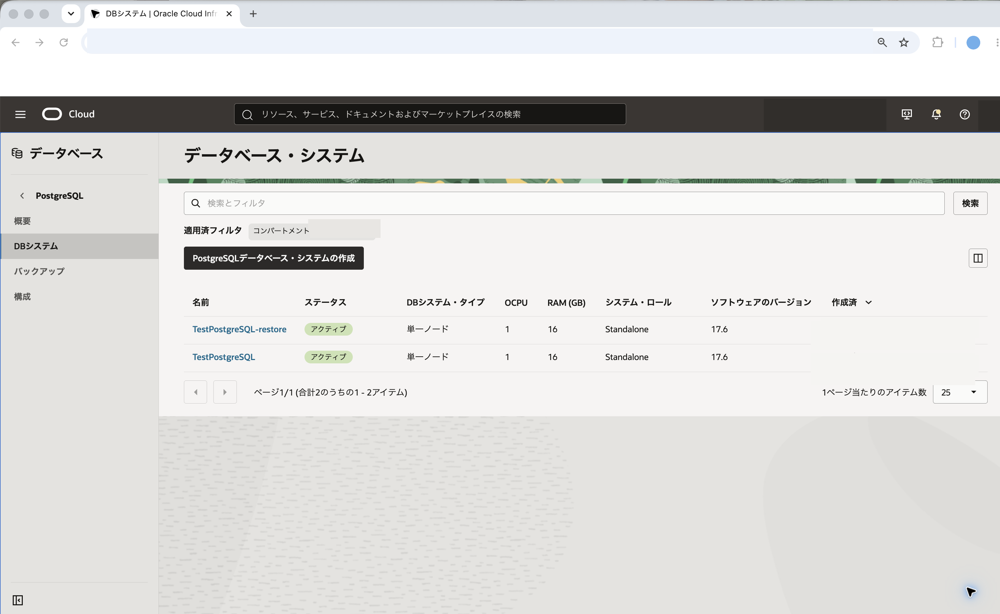

10. 作成したDBシステムの詳細画面で、**接続の詳細** に表示される **FQDN** を確認します。

11. **接続の詳細** からCA証明書をダウンロードします。ここでは、コンピュート・インスタンス上で `restore-dbsystem.pub` というファイル名で使用するものとして説明します。

    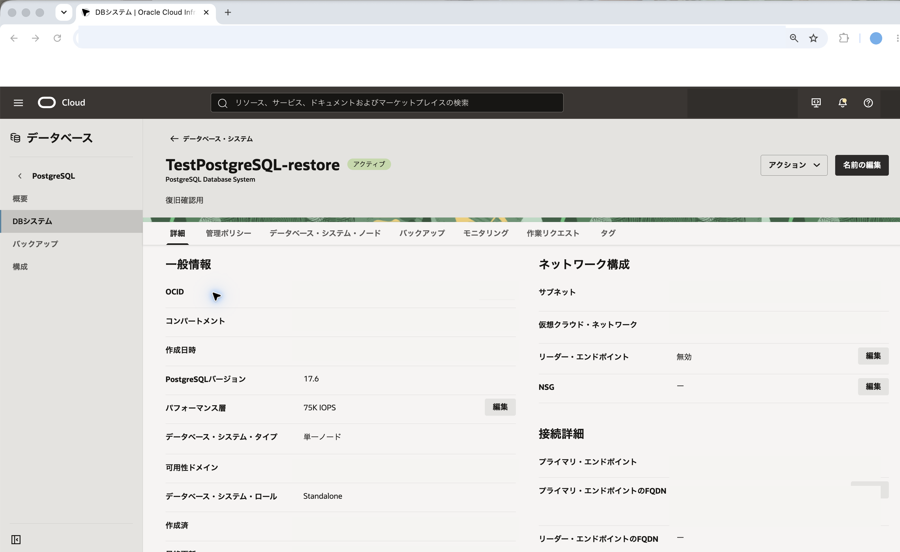

<br>

<a id="anchor4"></a>

# 4. 復旧したDBシステムに接続する

101で使用したコンピュート・インスタンスから、復旧したDBシステムに接続します。

1. 101で使用したコンピュート・インスタンスにSSHで接続します。

2. 復旧したDBシステムのCA証明書をコンピュート・インスタンスに配置します。ここでは、ホーム・ディレクトリに `restore-dbsystem.pub` というファイル名で保存したものとして説明します。

3. 以下のコマンドを実行して、復旧したDBシステムに接続します。`<復旧したDBシステムのFQDN>` は、DBシステム詳細画面の **接続の詳細** で確認したFQDNに置き換えてください。

    ```
    psql "sslmode=verify-full sslrootcert=$HOME/restore-dbsystem.pub host=<復旧したDBシステムのFQDN> dbname=postgres user=postgres"
    ```

4. パスワードを求められたら、DBシステム作成時に設定した管理者パスワードを入力します。

5. 接続できたことを確認します。

<br>

<a id="anchor5"></a>

# 5. 復旧したデータを確認する

バックアップから復旧したデータを確認します。

1. 101で作成した `tutorialdb` が存在するか確認します。

    ```
    \l
    ```

2. `psql` を終了します。

    ```
    \q
    ```

3. `tutorialdb` に接続します。

    ```
    psql "sslmode=verify-full sslrootcert=$HOME/restore-dbsystem.pub host=<復旧したDBシステムのFQDN> dbname=tutorialdb user=postgres"
    ```

4. 101で作成した表とデータを確認します。

    ```
    SELECT * FROM products ORDER BY id;
    ```

5. 101で登録したデータが表示されることを確認します。

6. `psql` を終了します。

    ```
    \q
    ```

これで、バックアップから作成した新しいDBシステムに、バックアップ取得時点のデータが復旧されていることを確認できました。

<br>

<a id="anchor6"></a>

# 6. 復旧確認用のDBシステムを削除する

復旧確認用に作成したDBシステムを今後使用しない場合は、課金を避けるため削除します。

1. コンソールメニューから **データベース** → **PostgreSQL** → **DBシステム** を選択します。

2. 復旧確認用に作成したDBシステムをクリックします。ここでは `TestPostgreSQL-restore` を選択します。

3. **他のアクション** → **削除** をクリックします。

    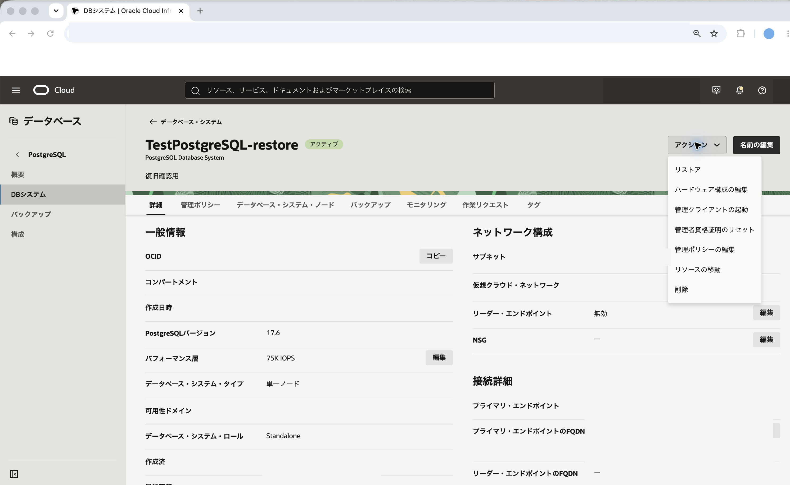

4. 確認ダイアログの内容を確認し、必要な操作を行って削除します。

    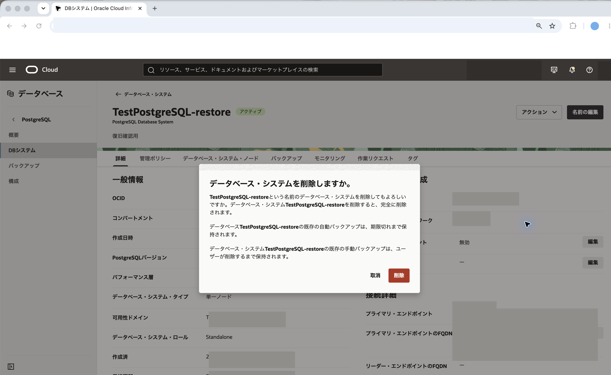

5. DBシステムのステータスが削除中になったことを確認します。

    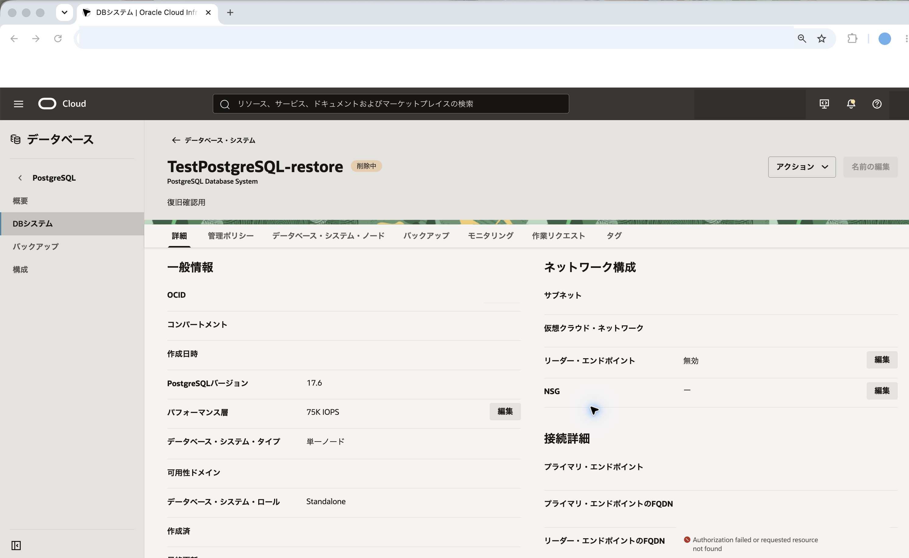

※ 101で作成した元のDBシステムは、以降のチュートリアルで使用します。継続してPostgreSQLチュートリアルを進める場合は、元のDBシステムは削除しないでください。

これで、この章の作業は終了です。

この章では、オンデマンド・バックアップから新しいDBシステムを作成し、復旧したデータを確認しました。
