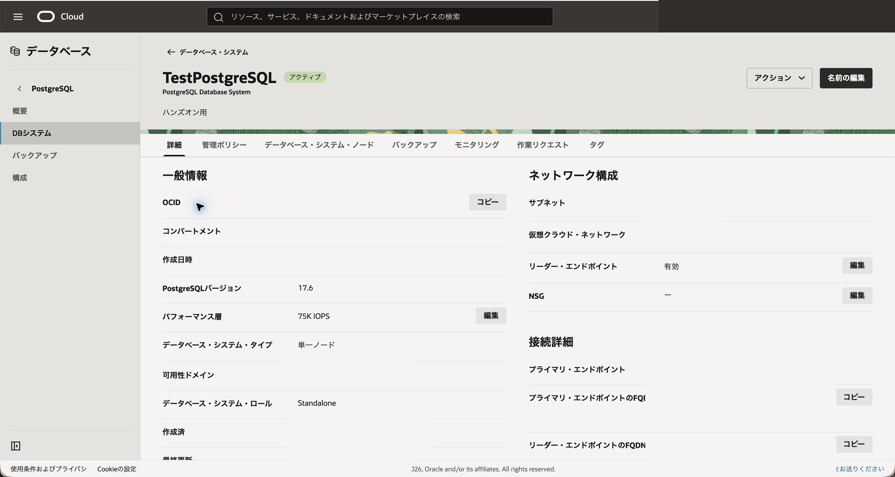
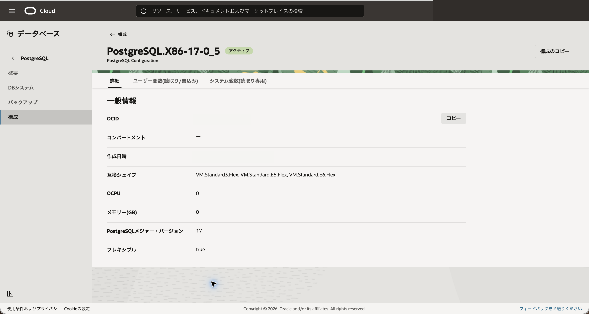
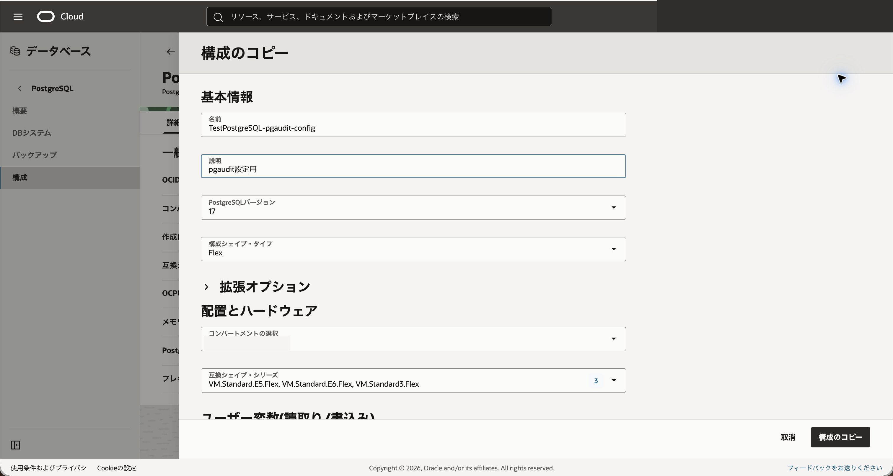
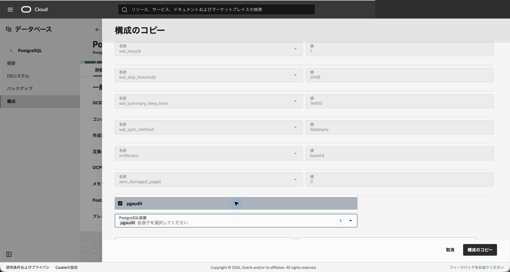
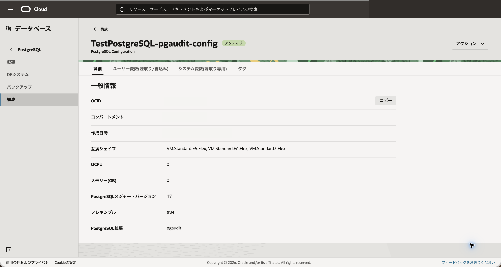
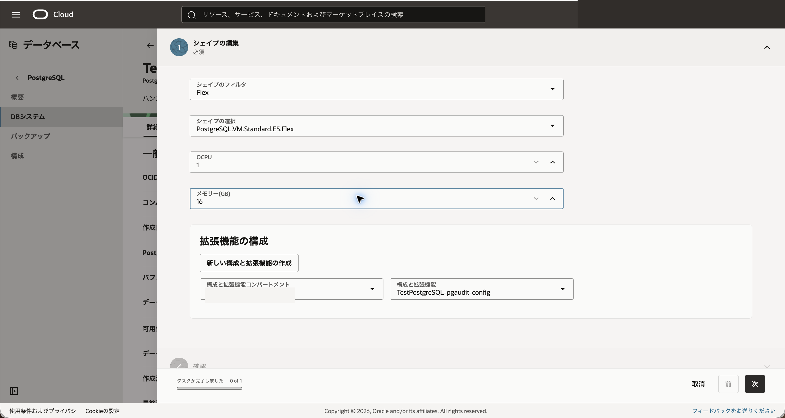
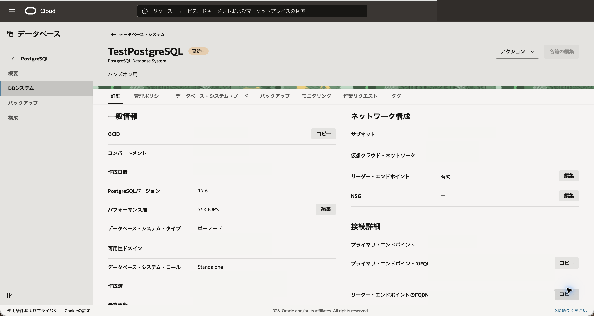
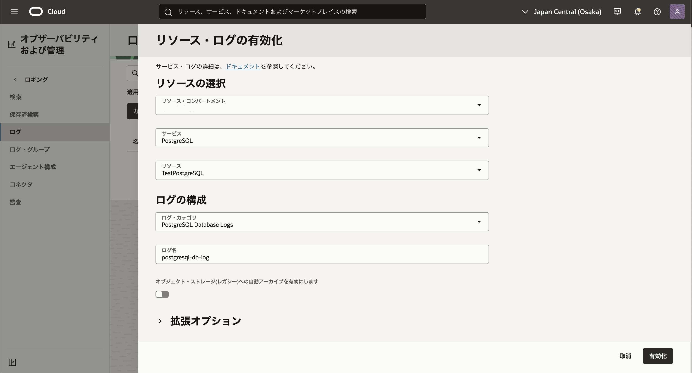
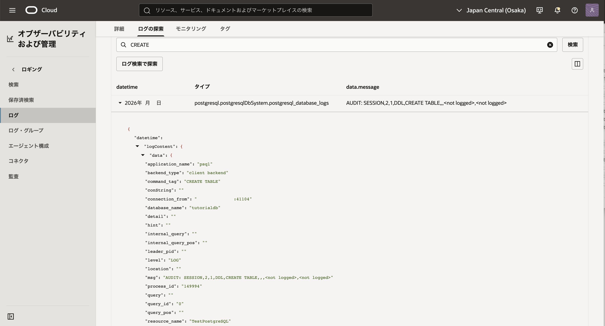

OCI Database with PostgreSQLでは、PostgreSQLの構成を使用して、DBシステムで利用できる拡張機能を管理できます。

このチュートリアルでは、監査ログを出力する拡張機能 `pgaudit` を例に、OCIコンソールで構成内の拡張機能を有効化し、監査ログをOCI Loggingサービスで確認します。

**所要時間 :** 約15分 (構成変更の反映待ち時間を含む)

**前提条件 :**

1. Oracle Cloud Infrastructure の環境(無料トライアルでも可) と、管理権限を持つユーザーアカウントがあること
2. [OCIコンソールにアクセスして基本を理解する - Oracle Cloud Infrastructureを使ってみよう(その1)](../../beginners/getting-started/) を完了していること
3. [クラウドに仮想ネットワーク(VCN)を作る - Oracle Cloud Infrastructureを使ってみよう(その2)](../../beginners/creating-vcn/) を完了していること
4. [インスタンスを作成する - Oracle Cloud Infrastructureを使ってみよう(その3)](../../beginners/creating-compute-instance/) を完了していること
5. [101: PostgreSQLを最小構成で作成し、データベースに接続する](../psql101-create-db/) を完了していること

**注意 :** チュートリアル内の画面ショットについては Oracle Cloud Infrastructure の現在のコンソール画面と異なっている場合があります。

**目次：**

- [1. pgauditと拡張機能管理の概要](#anchor1)
- [2. 現在の構成を確認する](#anchor2)
- [3. pgauditを有効化した構成を作成する](#anchor3)
- [4. 構成をDBシステムに反映する](#anchor4)
- [5. pgaudit拡張機能を有効化する](#anchor5)
- [6. OCI LoggingでPostgreSQLログを有効化する](#anchor6)
- [7. 監査ログを生成するSQLを実行する](#anchor7)
- [8. 監査ログを確認する](#anchor8)

<br>

<a id="anchor1"></a>

# 1. pgauditと拡張機能管理の概要

`pgaudit` は、PostgreSQLで実行されたSQL文を監査ログとして出力するための拡張機能です。監査対象を設定することで、DDL、読取り、書込みなどの操作をログに記録できます。

OCI Database with PostgreSQLでは、DBシステムに関連付けられた構成を使用して、データベースで利用できるPostgreSQL拡張機能を管理します。一部の拡張機能は、データベース内で `CREATE EXTENSION` を実行する前に、構成の **拡張機能の構成** セクションで有効化しておく必要があります。

このチュートリアルでは、以下の流れで `pgaudit` を設定します。

1. 現在のDBシステム構成を確認する
2. 構成をコピーし、拡張機能リストから `pgaudit` を選択する
3. `pgaudit` を有効化した構成をDBシステムに反映する
4. `CREATE EXTENSION pgaudit;` を実行する
5. OCI LoggingサービスでPostgreSQLログを有効化する
6. 監査対象のSQLを実行する
7. Loggingサービスで監査ログを検索する

PostgreSQLログを有効化する前に実行したSQLの監査ログは確認できない場合があります。そのため、このチュートリアルではPostgreSQLログを有効化した後に、監査対象のSQLを実行します。

<br>

<a id="anchor2"></a>

# 2. 現在の構成を確認する

101で作成したDBシステムに関連付けられている構成を確認します。

1. コンソールメニューから **データベース** → **PostgreSQL** → **DBシステム** を選択します。

2. 101で作成したDBシステムをクリックします。ここでは `TestPostgreSQL` を選択します。

3. DBシステムの詳細画面で、**構成** または **構成および拡張** に関連する項目を確認します。

4. DBシステムに関連付けられている構成名をクリックします。

5. 構成の詳細画面で、構成の内容を確認します。

    

既存の構成を直接編集するのではなく、構成をコピーして `pgaudit` を有効化した新しい構成を作成します。その後、新しい構成をDBシステムに適用します。

<br>

<a id="anchor3"></a>

# 3. pgauditを有効化した構成を作成する

既存の構成をコピーし、`pgaudit` を有効化した構成を作成します。

1. DBシステムに関連付けられている構成の詳細画面で、**構成および拡張機能のコピー** をクリックします。

    

2. **構成のコピー** パネルで、以下の項目を入力します。

    - **名前** - 任意の名前を入力します。ここでは `TestPostgreSQL-pgaudit-config` と入力します。
    - **説明** - 構成の説明を入力します。ここでは `pgaudit設定用` と入力します。(入力は任意です)

    

3. **拡張機能の構成** セクションを確認します。

    

4. **PostgreSQL拡張機能** リストから `pgaudit` を選択します。

    すでに他の拡張機能が選択されている場合は、既存の選択を残したうえで `pgaudit` を追加します。

    

5. 構成パラメータで `pgaudit.log` を設定します。ここでは例として、以下を設定します。

    ```
    read, write, ddl
    ```

    `pgaudit.log` は通常のPostgreSQL接続ユーザーでは変更できないため、`psql` 接続後に `SET pgaudit.log = ...` を実行しても権限エラーになります。監査対象はDBシステムに適用する構成で設定します。

6. **作成** をクリックします。

7. 作成した構成の詳細画面で、`pgaudit` が拡張機能として含まれていること、`pgaudit.log` に指定した値が設定されていることを確認します。

    

監査対象を広く設定すると、出力されるログ量が増えます。学習環境では必要なSQLだけを実行し、確認後は不要なログ出力設定を戻すことを検討してください。

<br>

<a id="anchor4"></a>

# 4. 構成をDBシステムに反映する

作成した構成をDBシステムに反映します。

1. コンソールメニューから **データベース** → **PostgreSQL** → **DBシステム** を選択します。

2. 101で作成したDBシステムをクリックします。

3. DBシステムの詳細画面で、構成を変更する操作をクリックします。

4. `pgaudit` 用に作成した構成を選択します。

    

5. **変更の保存** をクリックします。

6. DBシステムの状態が更新中になる場合は、アクティブに戻るまで待ちます。

    

構成の変更により、DBシステムが一時的に更新中になる場合があります。コンソールで再起動や適用待ちの表示が出た場合は、表示内容に従って構成変更を反映してください。

<br>

<a id="anchor5"></a>

# 5. pgaudit拡張機能を有効化する

コンピュート・インスタンスからDBシステムに接続し、`pgaudit` 拡張機能を有効化します。

1. 101で使用したコンピュート・インスタンスにSSHで接続します。

2. 101で使用した接続コマンドを実行し、DBシステムに接続します。

    ```
    psql "sslmode=verify-full sslrootcert=$HOME/dbsystem.pub host=<DBシステムのFQDN> dbname=postgres user=postgres"
    ```

3. `pgaudit` が利用可能な拡張機能として表示されることを確認します。

    ```
    SELECT name, default_version, installed_version
    FROM pg_available_extensions
    WHERE name = 'pgaudit';
    ```

4. `pgaudit` 拡張機能を作成します。

    ```
    CREATE EXTENSION IF NOT EXISTS pgaudit;
    ```

5. 拡張機能が作成されたことを確認します。

    ```
    SELECT extname, extversion
    FROM pg_extension
    WHERE extname = 'pgaudit';
    ```

6. `pgaudit.log` の設定値を確認します。

    ```
    SHOW pgaudit.log;
    ```

    OCIコンソールの構成で設定した以下の値が出力されることを確認します。

    ```
    read, write, ddl
    ```

<br>

<a id="anchor6"></a>

# 6. OCI LoggingでPostgreSQLログを有効化する

OCI Loggingサービスで、DBシステムのPostgreSQLログを有効化します。

OCI Database with PostgreSQLのサービス・ログは、Loggingサービスのログ・ページから有効化します。ログを有効化する際は、サービスとして **PostgreSQL**、ログ・カテゴリとして **PostgreSQLデータベース・ログ** を選択します。

1. コンソールメニューから **オブザーバビリティおよび管理** → **ロギング** → **ログ** を選択します。

2. **アクション** メニューから **サービス・ログの有効化** を選択します。

    **リソース・ログの有効化** パネルが開きます。

3. リソースの指定で、以下の項目を選択します。

    - **リソース・コンパートメント** - DBシステムを作成したコンパートメントを選択します。
    - **サービス** - `PostgreSQL` を選択します。
    - **リソース** - 101で作成したDBシステムを選択します。ここでは `TestPostgreSQL` を選択します。

    

4. ログの構成で、以下の項目を選択または入力します。

    - **ログ・カテゴリ** - `PostgreSQLデータベース・ログ` を選択します。
    - **ログ名** - 任意の名前を入力します。ここでは `postgresql-db-log` とします。
    - **コンパートメント** - ログを作成するコンパートメントを選択します。

5. **拡張オプション** を開き、**ログ・グループ** を指定します。

    既存のログ・グループがある場合は選択します。ログ・グループの候補が表示されず、`一致する文字列が見つかりませんでした。` と表示される場合は、対象コンパートメントにログ・グループがまだ作成されていません。この場合は、**ログ・グループ** のページで、対象のコンパートメントを選択の上で、 **新規ログ・グループの作成** を選択し、ログ・グループ名を入力します。ここでは `postgresql-log-group` とします。

6. **有効化** をクリックします。

7. 作成したPostgreSQLログが有効になったことを確認します。

ログの有効化後、Loggingサービスにログが表示されるまで数分かかる場合があります。

<br>

<a id="anchor7"></a>

# 7. 監査ログを生成するSQLを実行する

`pgaudit` の監査対象になるSQLを実行します。

1. テスト用の表を作成します。

    ```
    CREATE TABLE IF NOT EXISTS audit_test (
      id integer PRIMARY KEY,
      message text NOT NULL
    );
    ```

2. データを登録します。

    ```
    INSERT INTO audit_test (id, message)
    VALUES (1, 'pgaudit test')
    ON CONFLICT (id) DO UPDATE SET message = EXCLUDED.message;
    ```

3. データを検索します。

    ```
    SELECT * FROM audit_test;
    ```

4. `psql` を終了します。

    ```
    \q
    ```

<br>

<a id="anchor8"></a>

# 8. 監査ログを確認する

Loggingサービスで、7章で実行したSQLが監査ログとして出力されていることを確認します。

1. コンソールメニューから **オブザーバビリティおよび管理** → **ロギング** → **ログ** を選択します。

2. 6章でログを作成したコンパートメントを選択します。

    DBシステムのコンパートメントとログ・グループのコンパートメントが異なる場合は、ログ・グループを作成したコンパートメントを選択します。

3. 6章で作成したPostgreSQLログをクリックします。ここでは `postgresql-db-log` を選択します。

4. **ログの探索** を開きます。

5. 検索期間を、7章でSQLを実行した時間帯を含むように設定します。

6. 検索条件に `CREATE` を指定して検索します。

7. `CREATE TABLE` に対応する監査ログが表示されることを確認します。

    

監査ログが表示されない場合は、以下を確認してください。

- `pgaudit` の構成変更がDBシステムに反映されていること
- `CREATE EXTENSION pgaudit;` が実行済みであること
- `SHOW pgaudit.log;` で `read, write, ddl` が表示されること
- PostgreSQLログを有効化した後に監査ログ生成用SQLを実行していること
- 検索期間がSQLを実行した時刻を含んでいること

これで、この章の作業は終了です。

この章では、OCI Database with PostgreSQLで `pgaudit` を有効化し、監査ログをOCI Loggingサービスで確認しました。
