OCI Database with PostgreSQLでは、ウォーム・スタンバイを使用して、プライマリDBシステムからスタンバイDBシステムへデータをレプリケーションできます。

この構成の本来的な目的は、災害対策構成として、プライマリDBシステムとは異なるリージョンへデータを転送しておくことです。これにより、プライマリ側で障害が発生した場合に、スタンバイ側を昇格して復旧する構成を検討できます。

この機能がない場合、他リージョンで復旧するには、他リージョンに保持したバックアップからDBシステムをリストアする方式が中心になります。この方式では、リストア完了まで待つ必要があるため、RTO(目標復旧時間)に課題が残る場合があります。ウォーム・スタンバイを使用したレプリケーションでは、継続的にデータを転送しておくことで、バックアップからのリストア方式より短いRTOを目指せます。

このチュートリアルでは、[101: PostgreSQLを最小構成で作成し、データベースに接続する](../psql101-create-db/)で作成したDBシステムを元に、ウォーム・スタンバイを追加する手順を確認します。学習環境でネットワーク構成を単純にするため、ここでは同一リージョン、同一コンパートメント内でウォーム・スタンバイを作成します。

災害対策構成などで複数のリージョンやコンパートメントを使う場合は、各リソースの作成や確認を行う前に、OCIコンソール右上のリージョンと、画面内のコンパートメントが意図した対象になっていることを確認します。実践的な作業では、この確認を見落とすと、想定と異なるリージョンやコンパートメントにリソースを作成したり、作成済みのリソースが表示されないように見えたりするため注意します。

実運用で他リージョンへレプリケーションする場合は、リージョン間のVCN接続、ルート、セキュリティ・ルール、DNS解決など、VCNネットワーク周辺の追加設定が必要です。OCI Database with PostgreSQLはプライベート・サブネットにDBシステムを配置する前提のため、プライマリとスタンバイ間でプライベート・ネットワーク到達性を確保する必要があります。クロスリージョン構成の詳細は、OCI公式ドキュメントの[ウォーム・スタンバイを使用したクロスリージョン・レプリケーション](https://docs.oracle.com/ja-jp/iaas/Content/postgresql/cross-region-replication.htm)を参照してください。

**所要時間 :** 約30分 (ウォーム・スタンバイ作成の待ち時間を含む)

**前提条件 :**

1. Oracle Cloud Infrastructure の環境(無料トライアルでも可) と、管理権限を持つユーザーアカウントがあること
2. [OCIコンソールにアクセスして基本を理解する - Oracle Cloud Infrastructureを使ってみよう(その1)](../../beginners/getting-started/) を完了していること
3. [クラウドに仮想ネットワーク(VCN)を作る - Oracle Cloud Infrastructureを使ってみよう(その2)](../../beginners/creating-vcn/) を完了していること
4. [インスタンスを作成する - Oracle Cloud Infrastructureを使ってみよう(その3)](../../beginners/creating-compute-instance/) を完了していること
5. [101: PostgreSQLを最小構成で作成し、データベースに接続する](../psql101-create-db/) を完了していること
6. 101で作成したDBシステムがアクティブであること

**注意 :** チュートリアル内の画面ショットについては Oracle Cloud Infrastructure の現在のコンソール画面と異なっている場合があります。

**目次：**

- [1. ウォーム・スタンバイを使用したレプリケーションの概要](#anchor1)
- [2. 事前にネットワークとDBシステムを確認する](#anchor2)
- [3. プライマリDBシステムのシェイプを変更する](#anchor3)
- [4. ウォーム・スタンバイを作成する](#anchor4)
- [5. レプリケーション構成を確認する](#anchor5)
- [6. スタンバイDBシステムの接続情報を確認する](#anchor6)
- [7. psqlからレプリケーションを確認する](#anchor7)
- [8. クロスリージョン構成で必要になるネットワーク設定を確認する](#anchor8)
- [9. 作成したウォーム・スタンバイを削除する](#anchor9)

<br>

<a id="anchor1"></a>

# 1. ウォーム・スタンバイを使用したレプリケーションの概要

ウォーム・スタンバイは、プライマリDBシステムとは別のDBシステムにデータを継続的にレプリケーションする構成です。通常時はプライマリDBシステムでアプリケーション処理を行い、スタンバイDBシステムは災害対策用の待機系として保持します。

バックアップからのリストア方式では、障害発生後にバックアップを選択し、新しいDBシステムを作成してから接続先を切り替えます。このため、バックアップ時点から障害発生時点までの差分や、リストアにかかる時間を考慮する必要があります。

ウォーム・スタンバイ構成では、あらかじめスタンバイ側にデータを転送しておくため、障害時にはスタンバイ側を昇格して復旧する構成を検討できます。実運用では、RTO/RPOの要件、ネットワーク設計、アプリケーションの接続先切替手順、運用時の監視を含めて設計します。

このチュートリアルでは、ウォーム・スタンバイの作成と構成確認までを行います。スタンバイの昇格や本番切替の訓練は行いません。

<br>

<a id="anchor2"></a>

# 2. 事前にネットワークとDBシステムを確認する

101で作成したDBシステムとネットワーク構成を確認します。

1. コンソールメニューから **データベース** → **PostgreSQL** → **DBシステム** を選択します。

2. OCIコンソール右上のリージョンが、101でDBシステムを作成したリージョンであることを確認します。

3. DBシステム一覧のコンパートメントが、101でDBシステムを作成したコンパートメントであることを確認します。

4. 101で作成したDBシステムをクリックします。ここでは `TestPostgreSQL` を選択します。

5. DBシステムのステータスが **アクティブ** であることを確認します。

6. **ネットワーク構成** で、DBシステムが配置されているVCNとサブネットを確認します。

7. **接続詳細** で、プライマリ・エンドポイントとFQDNを確認します。

    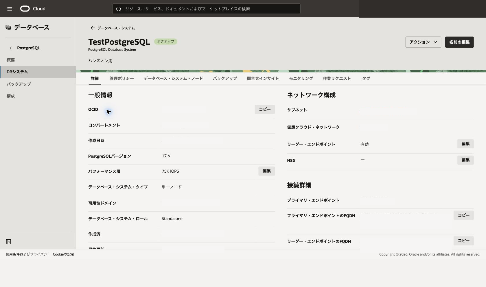

このチュートリアルでは、同一リージョン、同一コンパートメント内でウォーム・スタンバイを作成します。スタンバイ側にも、プライマリDBシステムと通信できるプライベート・サブネットを指定します。

<br>

<a id="anchor3"></a>

# 3. プライマリDBシステムのシェイプを変更する

ウォーム・スタンバイを作成する前に、プライマリDBシステムのシェイプを、OCPU 2、メモリー32GB以上に変更します。101で作成した最小構成のままでは、ウォーム・スタンバイ作成に必要なリソース要件を満たさない場合があります。

1. プライマリDBシステムの詳細画面を開きます。

2. **ハードウェア構成** で、シェイプ、OCPU数、メモリーを確認します。

3. **編集** または **シェイプの編集** に相当する操作をクリックします。

4. シェイプの編集画面で、以下の値を指定します。

    - **OCPU数** - `2` 以上
    - **メモリー(GB)** - `32` 以上

    画面構成の例は、[105: 拡張機能を管理する](../psql105-extension-pgaudit/)で使用したシェイプ編集画面を参照してください。画面例の値ではなく、このチュートリアルではOCPU 2、メモリー32GB以上を指定します。

    

5. **更新** または **保存** をクリックします。

6. DBシステムの状態が更新中になった場合は、アクティブに戻るまで待ちます。

7. DBシステムの詳細画面で、OCPU数とメモリーが変更後の値になっていることを確認します。

106用にこの画面を撮影する場合は、OCPU数とメモリーサイズはマスクして利用します。

<br>

<a id="anchor4"></a>

# 4. ウォーム・スタンバイを作成する

101で作成したDBシステムを元に、レプリカDBシステムとしてウォーム・スタンバイを作成します。

1. コンソールメニューから **データベース** → **PostgreSQL** → **DBシステム** を選択します。

2. **データベース・システムの作成** をクリックします。

3. データベース・システムの作成画面で、**レプリカ・データベース・システムの作成** を選択します。

    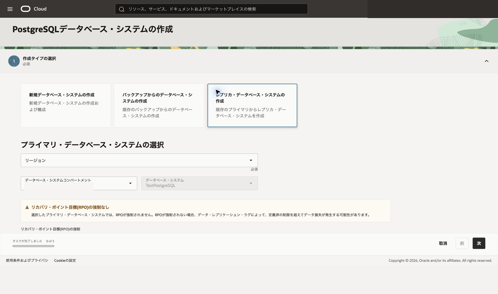

4. レプリカDBシステム作成画面で、以下の項目を指定します。

    - **ソース・リージョン** - 101でDBシステムを作成したリージョンを選択します。
    - **ソース・コンパートメント** - 101でDBシステムを作成したコンパートメントを選択します。
    - **ソース・データベース・システム** - 101で作成したDBシステムを選択します。ここでは `TestPostgreSQL` を選択します。

    - **コンパートメント** - 101でDBシステムを作成したコンパートメントを選択します。
    - **リージョン** - このチュートリアルでは、プライマリDBシステムと同じリージョンを選択します。
    - **名前** - 任意の名前を入力します。ここでは `TestPostgreSQL-standby` と入力します。

    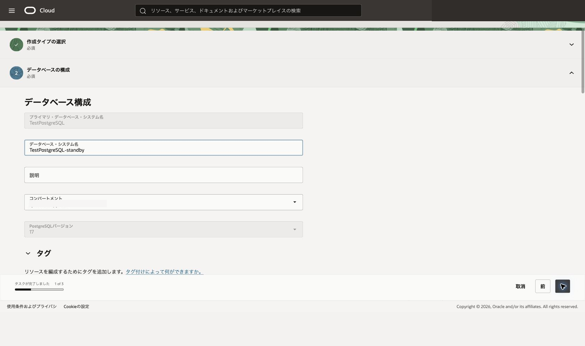

    - **仮想クラウド・ネットワーク** - プライマリDBシステムと通信できるVCNを選択します。
    - **サブネット** - プライベート・サブネットを選択します。

    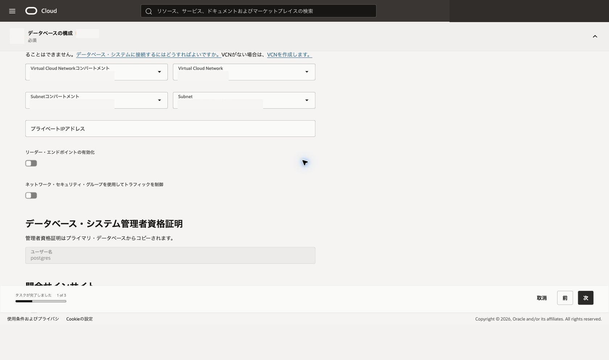

5. 必要に応じて、シェイプ、OCPU、メモリー、管理ポリシーなどの設定を確認します。

    データベース・システム作成時の画面構成は、101の作成手順のスクリーンショットも参考にできます。

    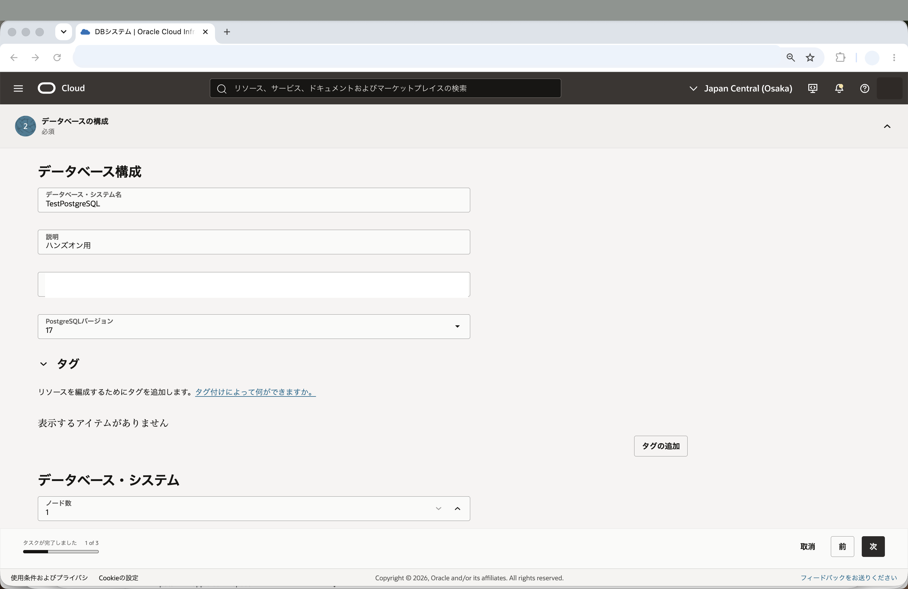

    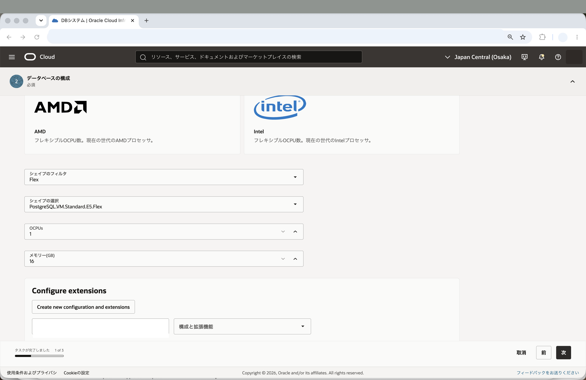

6. **作成** をクリックします。

7. 作業リクエストが開始され、ウォーム・スタンバイの作成が開始されることを確認します。

    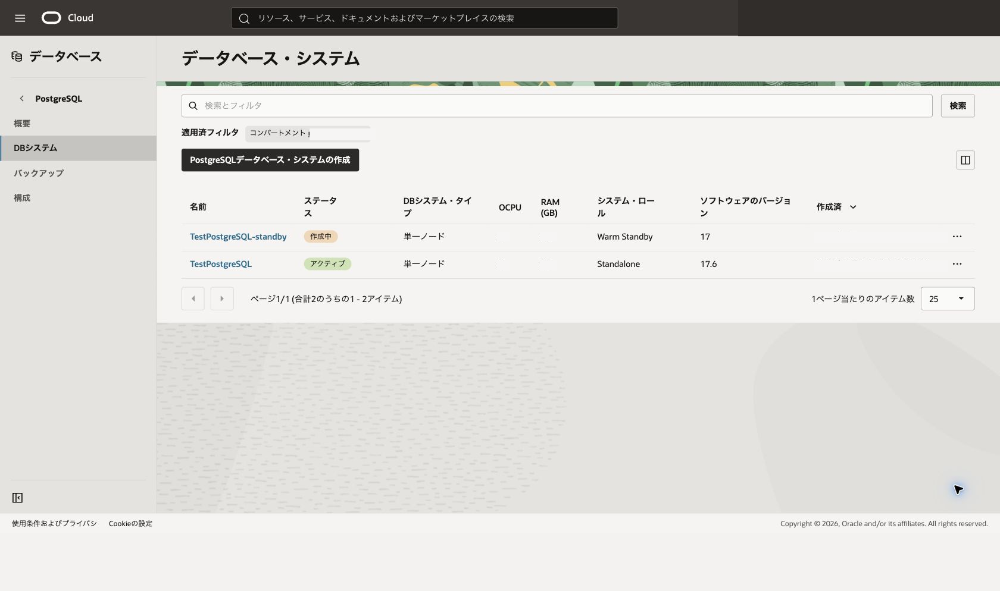

ウォーム・スタンバイの作成には時間がかかる場合があります。作成中は、DBシステムまたは作業リクエストのステータスを確認します。

<br>

<a id="anchor5"></a>

# 5. レプリケーション構成を確認する

ウォーム・スタンバイの作成結果を確認します。

1. プライマリDBシステムの詳細画面を開きます。

2. **レプリカ** のタブを確認します。

3. スタンバイDBシステムが表示されていることを確認します。

    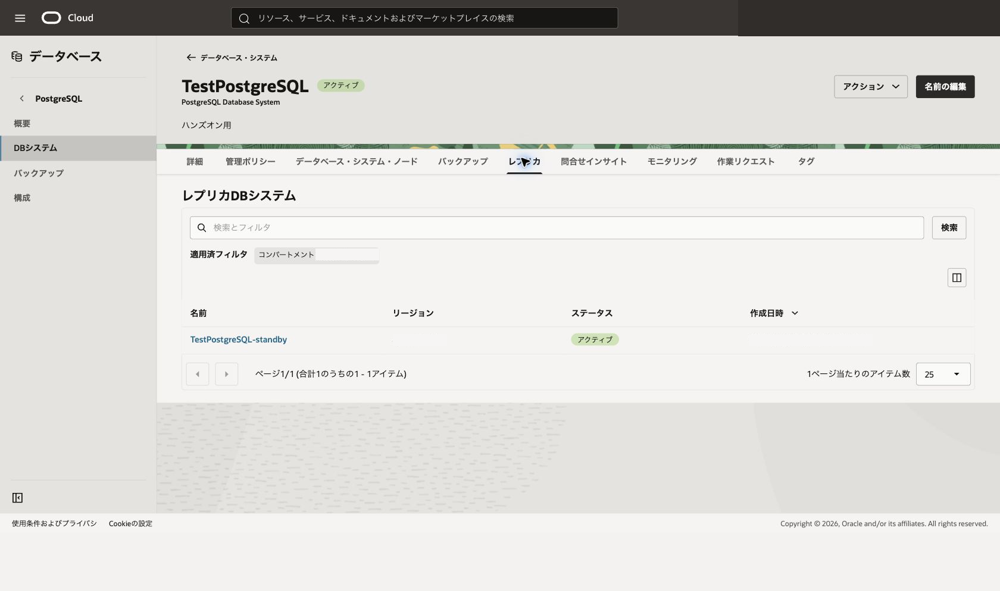

4. スタンバイDBシステムの状態がアクティブ、またはレプリケーション可能な状態であることを確認します。

5. 必要に応じて、作業リクエストの詳細を開き、作成処理が成功していることを確認します。

    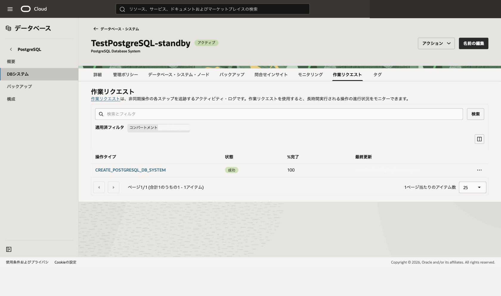

レプリケーション構成では、プライマリDBシステムとスタンバイDBシステムのロールを確認します。スタンバイ側は通常時のアプリケーション接続先ではなく、災害対策用の待機系として扱います。

<br>

<a id="anchor6"></a>

# 6. スタンバイDBシステムの接続情報を確認する

スタンバイDBシステムのネットワーク情報を確認します。

1. スタンバイDBシステムの詳細画面を開きます。

2. **一般情報** で、DBシステム・ロールや状態を確認します。

    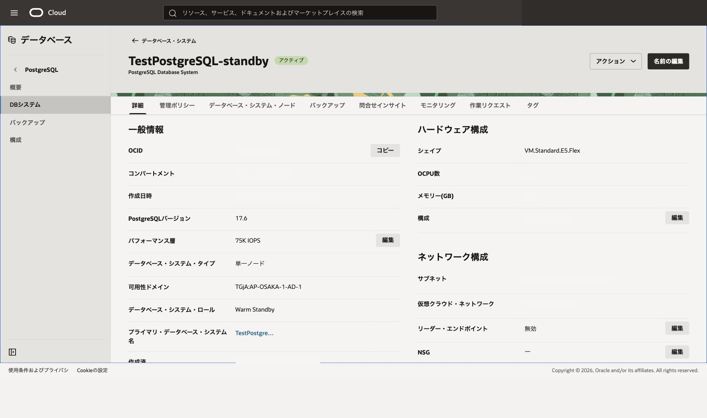

3. **ネットワーク構成** で、VCN、サブネット、NSGを確認します。

4. **接続詳細** で、スタンバイ側のエンドポイントやFQDNを確認します。

    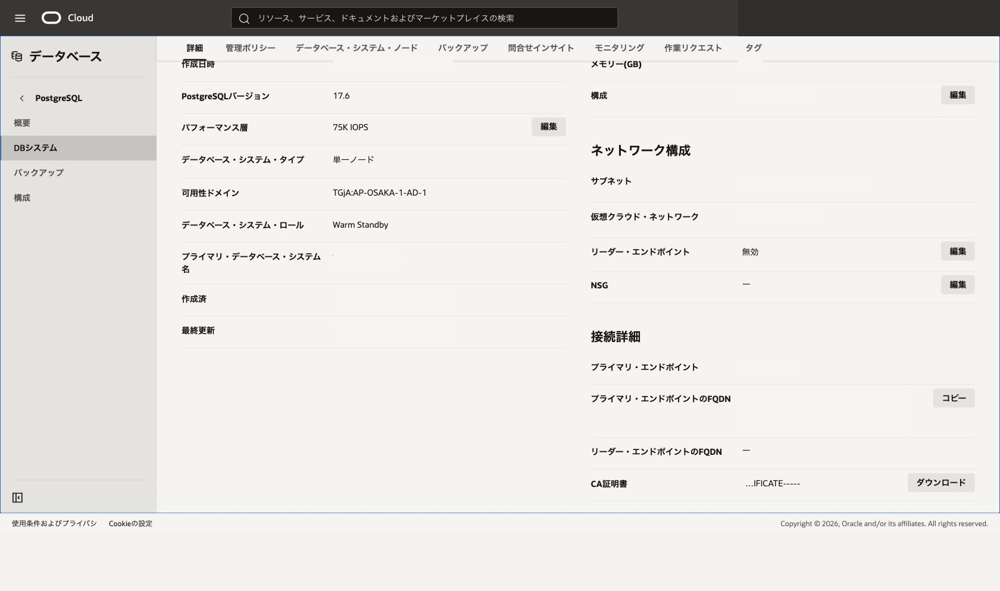

5. プライマリDBシステムの接続情報と比較し、アプリケーション接続先を切り替える場合に確認すべき情報を整理します。

このチュートリアルでは、スタンバイDBシステムへのアプリケーション切替や昇格操作は実施しません。実運用では、昇格手順、アプリケーション接続先変更、DNS切替、接続確認、切戻し方針を事前に設計します。

<br>

<a id="anchor7"></a>

# 7. psqlからレプリケーションを確認する

101で使用したコンピュート・インスタンスから、プライマリDBシステムとスタンバイDBシステムに接続し、データがレプリケーションされていることを確認します。

この手順では、プライマリDBシステムに確認用の表とデータを作成し、スタンバイDBシステム側で同じデータを参照できることを確認します。スタンバイDBシステムは読取り用の待機系として扱うため、書込みはプライマリDBシステムに対して実行します。

1. 101で使用したコンピュート・インスタンスにSSH接続します。

2. プライマリDBシステムのFQDNを使用して、`tutorialdb` に接続します。

    ```sh
    psql "host=<プライマリ・エンドポイントのFQDN> port=5432 dbname=tutorialdb user=postgres sslmode=require"
    ```

3. プライマリDBシステム側で、確認用の表を作成し、行を追加します。

    ```sql
    CREATE TABLE IF NOT EXISTS warm_standby_replication_check (
      id BIGINT GENERATED BY DEFAULT AS IDENTITY PRIMARY KEY,
      message TEXT NOT NULL,
      created_at TIMESTAMPTZ NOT NULL DEFAULT now()
    );

    INSERT INTO warm_standby_replication_check (message)
    VALUES ('replication check from primary')
    RETURNING id, message, created_at;
    ```

4. 追加した行を確認します。

    ```sql
    SELECT id, message, created_at
    FROM warm_standby_replication_check
    ORDER BY id DESC
    LIMIT 5;
    ```

5. `\q` でpsqlを終了します。

6. スタンバイDBシステムのFQDNを使用して、`tutorialdb` に接続します。

    ```sh
    psql "host=<スタンバイ側のFQDN> port=5432 dbname=tutorialdb user=postgres sslmode=require"
    ```

7. スタンバイDBシステムがリカバリ中であり、読取り専用であることを確認します。

    ```sql
    SELECT pg_is_in_recovery();
    SHOW transaction_read_only;
    ```

    `pg_is_in_recovery` が `t`、`transaction_read_only` が `on` と表示されれば、スタンバイ側に接続していることを確認できます。

8. プライマリDBシステムで追加した行が、スタンバイDBシステム側で参照できることを確認します。

    ```sql
    SELECT id, message, created_at
    FROM warm_standby_replication_check
    ORDER BY id DESC
    LIMIT 5;
    ```

    直前に追加した `replication check from primary` の行が表示されれば、プライマリDBシステムからスタンバイDBシステムへデータがレプリケーションされていることを確認できます。表示されない場合は、少し待ってから同じ `SELECT` 文を再実行します。

9. `\q` でpsqlを終了します。

<br>

<a id="anchor8"></a>

# 8. クロスリージョン構成で必要になるネットワーク設定を確認する

このチュートリアルでは同一リージョン内でウォーム・スタンバイを作成しましたが、本来の災害対策構成では他リージョンにスタンバイDBシステムを配置します。

OCI Database with PostgreSQLはプライベート・サブネットにDBシステムを配置する前提です。そのため、他リージョンへレプリケーションする場合は、プライマリ側とスタンバイ側のVCN間でプライベート・ネットワーク到達性を確保する必要があります。

クロスリージョン構成では、少なくとも以下を確認します。

- プライマリ・リージョンとスタンバイ・リージョンのVCN設計
- リージョン間のVCN接続
- ルート表
- セキュリティ・リストまたはNSG
- DNS解決
- DBシステムのプライベート・エンドポイント間の通信要件

このネットワーク設定は環境ごとに設計が異なるため、このチュートリアルでは実作業としては扱いません。詳細は、OCI公式ドキュメントの[ウォーム・スタンバイを使用したクロスリージョン・レプリケーション](https://docs.oracle.com/ja-jp/iaas/Content/postgresql/cross-region-replication.htm)を参照してください。

<br>

<a id="anchor9"></a>

# 9. 作成したウォーム・スタンバイを削除する

学習環境で不要になったウォーム・スタンバイを削除します。

1. スタンバイDBシステムの詳細画面を開きます。

2. **アクション** または **他のアクション** メニューを開きます。

3. **削除** をクリックします。

4. 確認ダイアログの内容を確認し、必要な操作を行って削除します。

    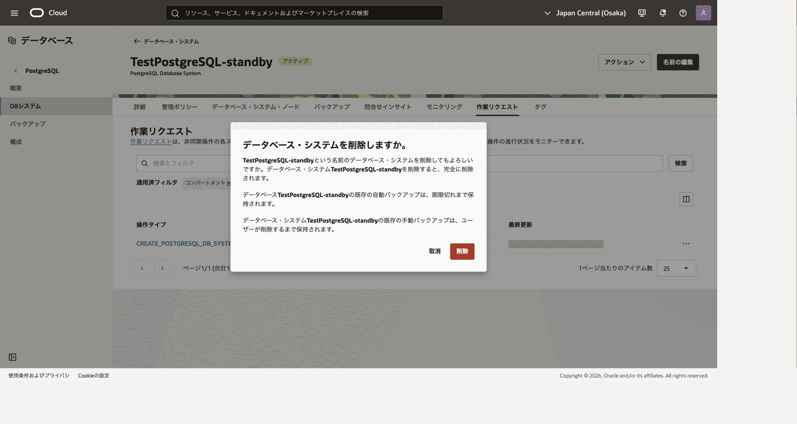

5. スタンバイDBシステムのステータスが削除中になったことを確認します。

※ 101で作成したプライマリDBシステムを以降も使用する場合は、プライマリDBシステム自体は削除しないでください。

これで、この章の作業は終了です。

この章では、OCI Database with PostgreSQLでウォーム・スタンバイを追加し、災害対策構成に向けたレプリケーションの考え方を確認しました。
