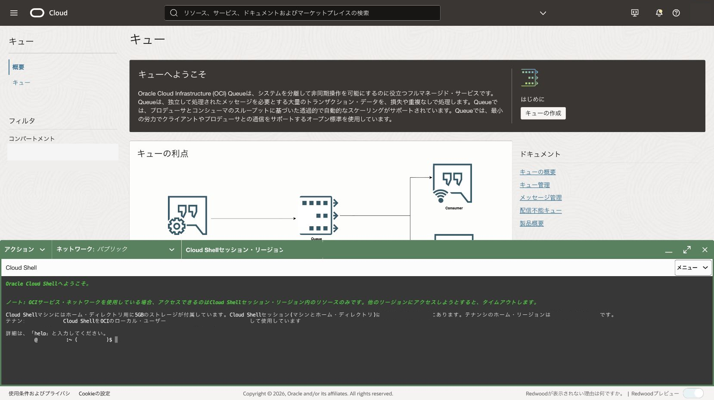
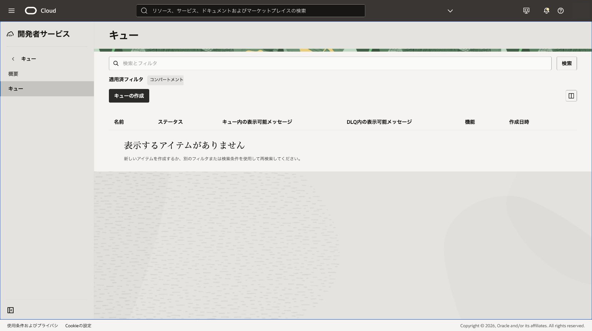
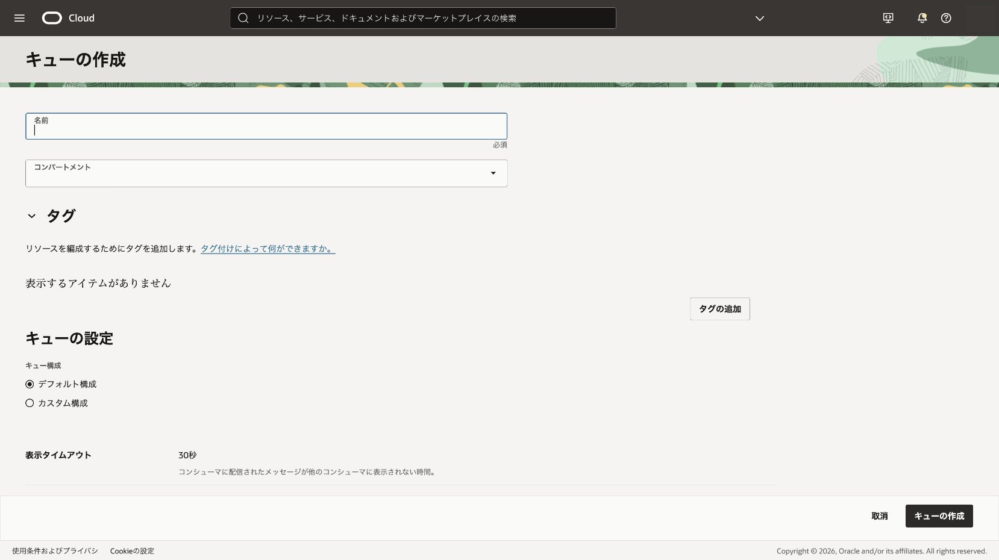
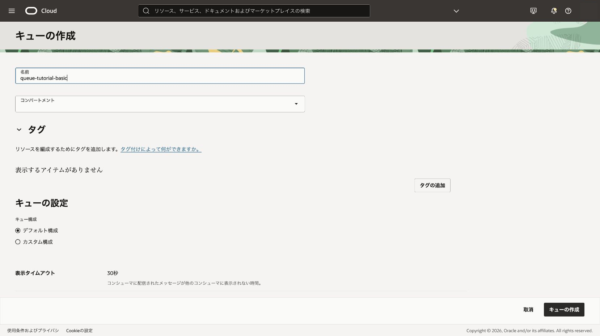
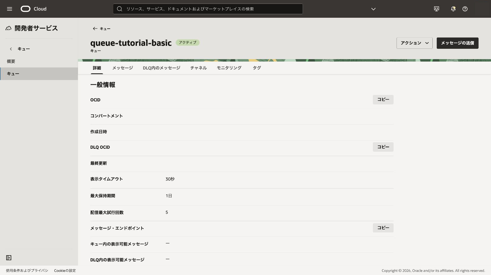

OCI Queueの基本単位となるキューを作成します。本章ではOracle管理キーとデフォルト構成を使用します。

**所要時間 :** 約20分

**前提条件 :**

1. OCIコンソールへサインインできること
2. `<対象コンパートメント>`でQueueを管理できること
3. Queueを利用できるリージョンとサービス制限の空きが確認済みであること

**注意 :** リージョン、コンパートメント名、OCIDなどの環境固有値を共有ファイルや共有画面へ記録しないでください。

**目次：**

- [1. 全章で必要なポリシーを準備する](#anchor1)
- [2. Queue画面を開く](#anchor2)
- [3. キューを作成する](#anchor3)
- [4. 確認](#anchor4)
- [5. トラブルシュート](#anchor5)
- [6. 作成したリソースの削除](#anchor6)

<a id="anchor1"></a>

# 1. 全章で必要なポリシーを準備する

本チュートリアル全体では、Queueの作成・送受信・削除、コンシューマ・グループ、メトリック確認、Cloud Shell、201章の検証用ポリシー操作を行います。学習期間中だけ使用する専用コンパートメントとグループを用意し、少数の文で全操作をカバーします。

次は、具体的なチュートリアル用名称を使った例です。

- ポリシー名: `OCIQueueTutorialAuthoringPolicy`
- グループ名: `OCIQueueTutorialAuthors`
- コンパートメント名: `OCIQueueTutorial`

```text
Allow group OCIQueueTutorialAuthors to manage all-resources in compartment OCIQueueTutorial
Allow group OCIQueueTutorialAuthors to use cloud-shell in tenancy
```

1文目は専用コンパートメント内だけを対象とします。テナンシ全体へ`manage all-resources`を付与しないでください。2文目はCloud Shellの起動に使用します。既存ポリシーで同等以上の権限がある場合は、重複して作成する必要はありません。

自分の環境へコピーする場合は、山括弧の3か所を置き換えます。

```text
Allow group <チュートリアル制作者グループ名> to manage all-resources in compartment <チュートリアル専用コンパートメント名>
Allow group <チュートリアル制作者グループ名> to use cloud-shell in tenancy
```

1. テナンシ管理者へ、対象グループ、専用コンパートメント、既存権限との差分と上記2文を提示します。
2. 管理者がポリシーを作成するか、既存権限で充足することを確認します。
3. 対象ユーザーがグループへ所属していることと、Cloud Shellを起動できることを確認します。
   - 期待結果: Queueとコンシューマ・グループを専用コンパートメント内で管理でき、Cloud Shellを起動できます。
   - 失敗時確認: グループ名、アイデンティティ・ドメイン、コンパートメント階層、ポリシー配置先、反映待ちを確認します。

<div align="center">

</div>
<br>

組織方針で`all-resources`を使用できない場合は、1文目を次の2文へ置き換えます。

```text
Allow group <チュートリアル制作者グループ名> to manage queues in compartment <チュートリアル専用コンパートメント名>
Allow group <チュートリアル制作者グループ名> to manage queue-consumer-group in compartment <チュートリアル専用コンパートメント名>
```

参考: [キュー・ポリシー（日本語）](https://docs.oracle.com/ja-jp/iaas/Content/queue/policy-reference.htm)、[クラウド・シェル（日本語）](https://docs.oracle.com/ja-jp/iaas/Content/API/Concepts/cloudshellintro.htm)、[ポリシー構文（日本語）](https://docs.oracle.com/ja-jp/iaas/Content/Identity/Concepts/policysyntax.htm)

<a id="anchor2"></a>

# 2. Queue画面を開く

1. OCIコンソールのナビゲーション・メニューから**開発者サービス**、**アプリケーション統合**、**キュー**を選択します。
   - 期待結果: キューの一覧が表示されます。
   - 失敗時確認: リージョンがQueue対応リージョンか、Queue画面を表示する権限があるかを確認します。
2. 画面上部のリージョンと一覧のコンパートメントを、事前に決めた値へ合わせます。
   - 期待結果: `<対象コンパートメント>`のキュー一覧が表示されます。
   - 失敗時確認: コンパートメントの参照権限と、選択したリージョンを確認します。

<div align="center">

</div>
<br>

<a id="anchor3"></a>

# 3. キューを作成する

1. **キューの作成**をクリックします。
2. **名前**へ`queue-tutorial-basic`を入力し、**コンパートメント**を確認します。リソース名に個人名や案件名を含めないでください。

<div align="center">

</div>
<br>

3. **デフォルト構成**を選択し、暗号化が**Oracle管理キー**であることを確認します。

<div align="center">

</div>
<br>

4. コンシューマ・グループは無効のまま、**キューの作成**をクリックします。
   - 期待結果: 詳細ページへ移動し、状態が`作成中`から`アクティブ`になります。
   - 失敗時確認: `manage queues`相当の権限、サービス制限、表示名の重複や入力規則を確認します。

<div align="center">

</div>
<br>

<a id="anchor4"></a>

# 4. 確認

詳細ページで表示タイムアウト、最大保持期間、最大配信試行回数、暗号化、メッセージ・エンドポイントを確認します。環境固有値はコピーして本文へ貼り付けず、必要な操作時だけOCIコンソールまたはCloud Shellで参照します。

期待結果は、キューの状態が`アクティブ`であることです。

<div align="center">

</div>
<br>

<a id="anchor5"></a>

# 5. トラブルシュート

- 一覧へ表示されない場合はリージョンとコンパートメントを再確認します。
- 認可エラーの場合はIAMを変更せず、必要なポリシー案を管理者へ提示します。
- 作成が長時間完了しない場合は作業リクエストとサービス状態を確認します。

<a id="anchor6"></a>

# 6. 作成したリソースの削除

後続章で使用するため、本章では削除しません。`queue-tutorial-basic`は105章の手順で削除します。

参考: [キューの作成](https://docs.oracle.com/ja-jp/iaas/Content/queue/queue-create.htm)
