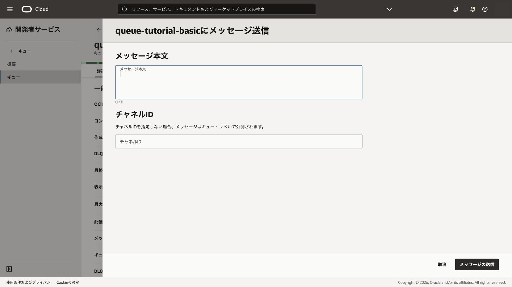
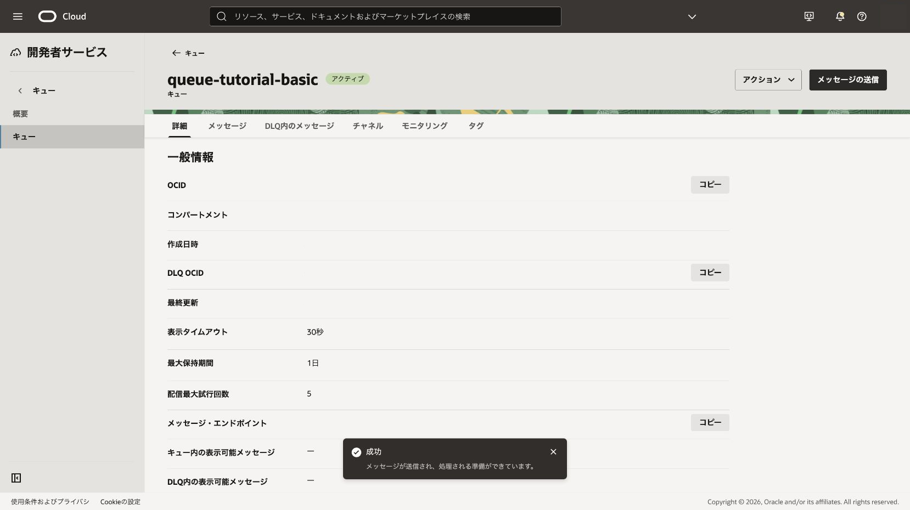
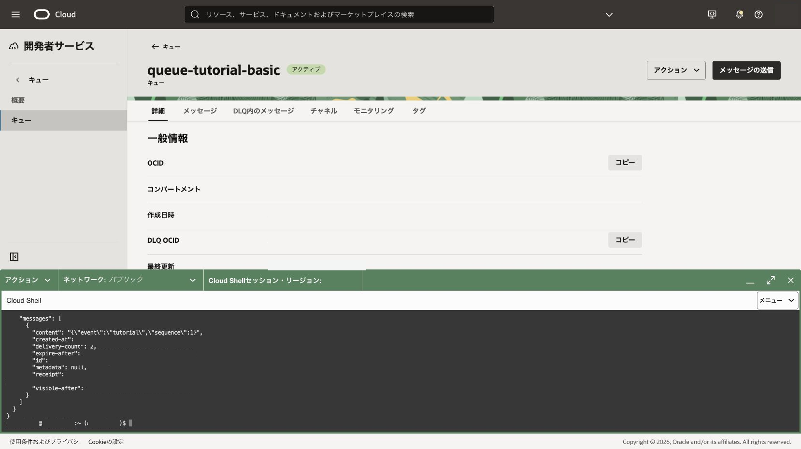

Producerが送信したメッセージをConsumerが取得し、処理済みのreceiptを使って削除する基本フローを体験します。

**所要時間 :** 約30分

**前提条件 :** 101章の`queue-tutorial-basic`がアクティブであり、Cloud ShellでOCI CLIを実行できること

**目次：**

- [1. メッセージを送信する](#anchor1)
- [2. メッセージを取得・削除する](#anchor2)
- [3. 確認](#anchor3)
- [4. トラブルシュート](#anchor4)
- [5. 作成したリソースの削除](#anchor5)

<a id="anchor1"></a>

# 1. メッセージを送信する

1. キュー詳細で**メッセージの送信**を選択し、`{"event":"tutorial","sequence":1}`を入力します。

<div align="center">

</div>
<br>

2. **メッセージの送信**をクリックします。
   - 期待結果: 送信成功が表示されます。
   - 失敗時確認: `queue-push`相当の権限とメッセージ・エンドポイントへの到達性を確認します。

<div align="center">

</div>
<br>

3. Cloud Shellを開き、キュー詳細に表示されるキューOCIDとメッセージ・エンドポイントをシェル変数へ一時的に設定します。値を履歴や共有ファイルへ保存しないでください。

```bash
QUEUE_ID='<キューOCID>'
QUEUE_ENDPOINT='<メッセージ・エンドポイント>'
```

Queueのメッセージ操作では、管理APIの既定エンドポイントではなく、キュー詳細に表示されるメッセージ・エンドポイントを使用します。

<a id="anchor2"></a>

# 2. メッセージを取得・削除する

1. Cloud Shellで1件取得します。

```bash
oci queue messages get-messages \
  --endpoint "$QUEUE_ENDPOINT" \
  --queue-id "$QUEUE_ID" \
  --limit 1 \
  --timeout-in-seconds 10
```

期待結果は、`content`、`deliveryCount`、`receipt`を含むレスポンスです。`receipt`は削除に必要な一時値であり、画面を共有する場合は隠します。

<div align="center">

</div>
<br>

2. レスポンスのreceiptを一時変数へ設定して削除します。

```bash
MESSAGE_RECEIPT='<取得結果のreceipt>'
oci queue messages delete-message \
  --endpoint "$QUEUE_ENDPOINT" \
  --queue-id "$QUEUE_ID" \
  --message-receipt "$MESSAGE_RECEIPT" \
  --force
```

> **実行結果の確認**
>
> 成功時は応答本文が表示されません。エラーが表示されず、Cloud Shellのプロンプトに戻れば削除成功です。

```text
<出力なし>
```

`ServiceError`が表示された場合は、receiptの期限と、同じメッセージを再取得してreceiptが更新されていないかを確認します。

<a id="anchor3"></a>

# 3. 確認

同じコマンドでもう一度取得します。長期ポーリングを避ける場合は`--timeout-in-seconds 0`を指定します。

> **削除完了の確認ポイント**
>
> `messages`が空の配列であれば、対象メッセージは返っていません。スクリーンショットの代わりに、次の出力と照合します。

```json
{
  "data": {
    "messages": []
  }
}
```

`messages`に別のメッセージが表示された場合は、`content`と`id`を確認し、削除対象と区別します。

<a id="anchor4"></a>

# 4. トラブルシュート

- コンソールのポーリングも配信回数を増やすため、意図しない再試行に注意します。
- `NotAuthorizedOrNotFound`の場合は、`--endpoint`へメッセージ・エンドポイントを指定したか、対象リージョン、キューOCID、`queue-pull`権限を確認します。
- メッセージが見えない場合は可視性タイムアウトが終わるまで待つか、別メッセージでやり直します。

<a id="anchor5"></a>

# 5. 作成したリソースの削除

本章のメッセージは手順内で削除済みです。キューは後続章のため保持します。

参考: [キューへのメッセージの公開](https://docs.oracle.com/ja-jp/iaas/Content/queue/publish-messages-queue.htm)、[キューからのメッセージの使用](https://docs.oracle.com/ja-jp/iaas/Content/queue/consume-messages-queue.htm)
