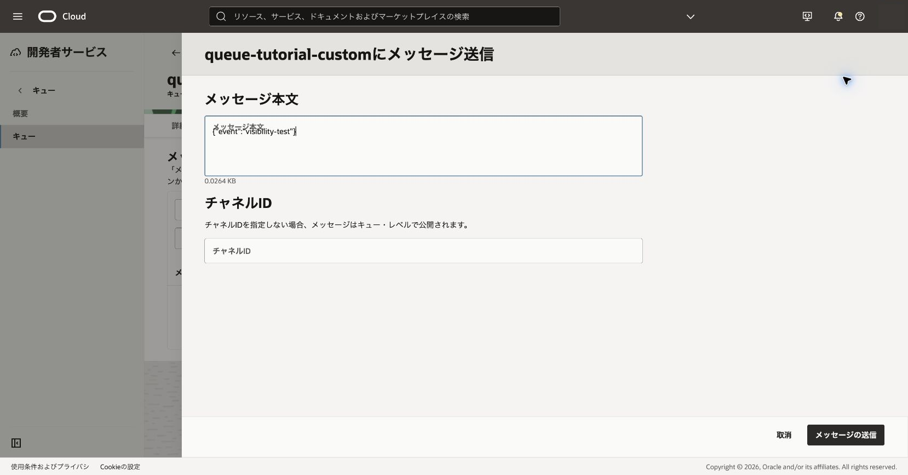
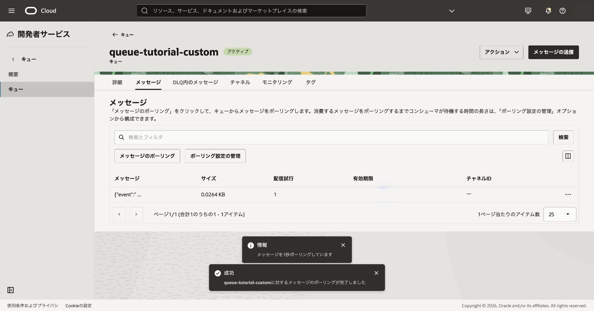
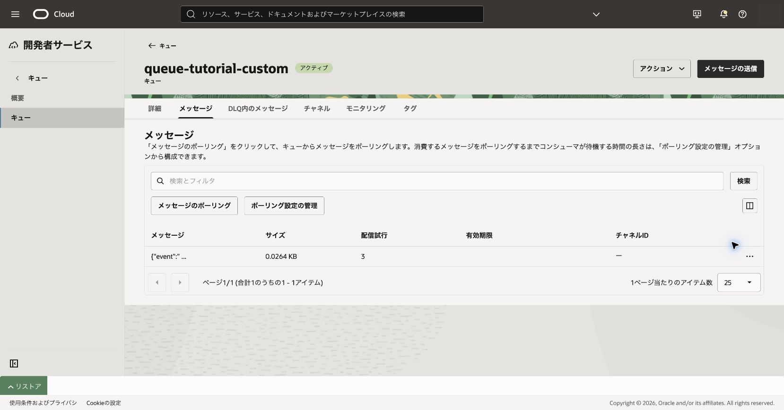

Queueでは、取得しただけではメッセージは削除されません。可視性タイムアウトとreceipt更新の関係を確認します。

**所要時間 :** 約25分

**前提条件 :** 102章まで完了し、`queue-tutorial-basic`とCloud Shellを利用できること

**目次：**

- [1. 検証用メッセージを準備する](#anchor1)
- [2. 非表示と再配信を確認する](#anchor2)
- [3. 確認](#anchor3)
- [4. トラブルシュート](#anchor4)
- [5. 作成したリソースの削除](#anchor5)

<a id="anchor1"></a>

# 1. 検証用メッセージを準備する

キュー詳細の**メッセージの送信**から`{"event":"visibility-test"}`を送信します。送信成功を確認してから次へ進みます。

<div align="center">

</div>
<br>

<a id="anchor2"></a>

# 2. 非表示と再配信を確認する

1. Cloud Shellで可視性を60秒に指定して取得します。

```bash
oci queue messages get-messages \
  --endpoint "$QUEUE_ENDPOINT" \
  --queue-id "$QUEUE_ID" \
  --limit 1 \
  --visibility-in-seconds 60 \
  --timeout-in-seconds 0
```

   - 期待結果: `deliveryCount`と`receipt`を含む1件が返ります。
   - 失敗時確認: 対象メッセージが既に取得中または削除済みでないかを確認します。

<div align="center">

</div>
<br>

2. receiptを使わず直ちに再取得します。
   - 期待結果: 60秒以内は同じメッセージが返りません。
3. 60秒経過後に再取得します。
   - 期待結果: 同じcontentが新しいreceiptで返り、配信回数が増えます。

<div align="center">

</div>
<br>

4. 必要に応じて`update-message`へ`--endpoint "$QUEUE_ENDPOINT"`を付けて可視性を延長し、最後に同じエンドポイントと最新receiptでメッセージを削除します。実行時の正確なオプションは`oci queue messages update-message --help`で確認します。

> **削除コマンドの成功表示**
>
> `delete-message --force`の成功時は応答本文がなく、エラーを表示せずにプロンプトへ戻ります。

```text
<出力なし>
```

<a id="anchor3"></a>

# 3. 確認

再取得して対象メッセージが返らないことを確認します。

> **確認する出力**
>
> `messages`が`[]`であれば削除完了です。次の出力例を確認基準とします。

```json
{
  "data": {
    "messages": []
  }
}
```

取得のたびに配信回数が増えるため、DLQ検証用でないキューを何度もポーリングしないでください。

<a id="anchor4"></a>

# 4. トラブルシュート

- すぐ再取得できた場合は`visibility-in-seconds`と経過時間を確認します。
- 削除が失敗した場合は古いreceiptでないか確認します。
- メッセージがDLQへ移動した場合は、過剰なポーリングで最大試行回数を超えていないか確認します。

<a id="anchor5"></a>

# 5. 作成したリソースの削除

検証メッセージを最新receiptで削除します。キューは後続章のため保持します。

参考: [キューからのメッセージの使用](https://docs.oracle.com/ja-jp/iaas/Content/queue/consume-messages-queue.htm)
