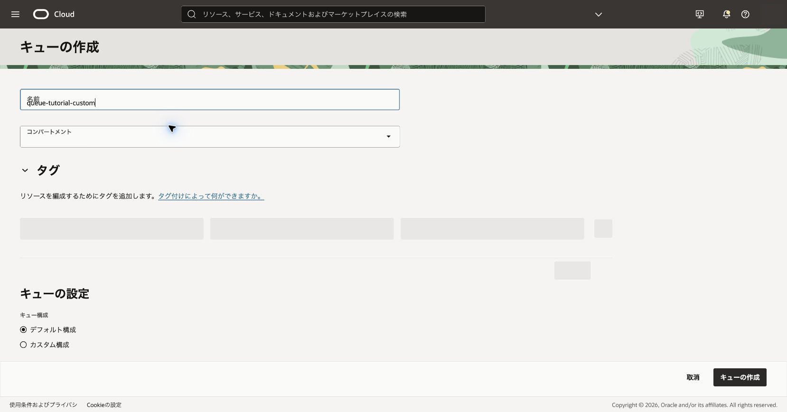
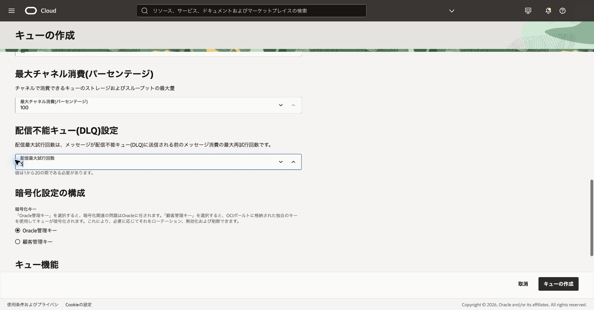
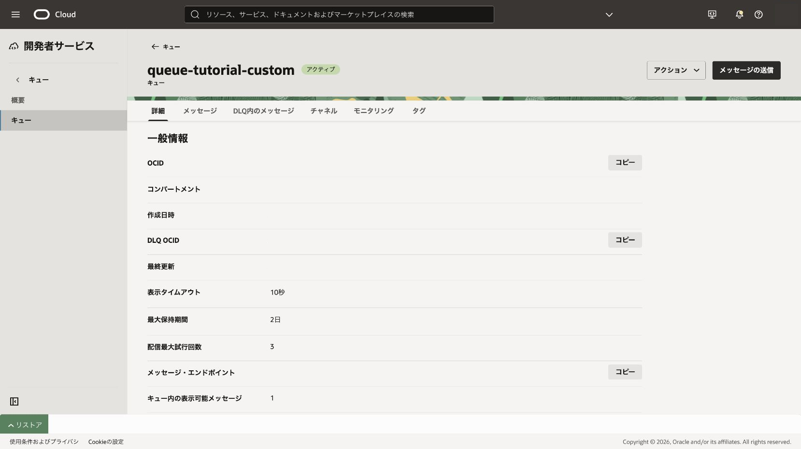

デフォルト構成とカスタム構成を比較し、作成後に変更できない設定を理解します。

**所要時間 :** 約25分

**前提条件 :** 101章が完了し、追加キュー1個を202章の完了まで保持できること

**注意 :** 最大保持期間は作成後に変更できません。設定値は作成前に公式の許容範囲と実画面で再確認します。

**目次：**

- [1. カスタム構成を計画する](#anchor1)
- [2. 比較用キューを作成する](#anchor2)
- [3. 確認](#anchor3)
- [4. トラブルシュート](#anchor4)
- [5. 作成したリソースの削除](#anchor5)

# 1. カスタム構成を計画する

1. `queue-tutorial-basic`の詳細で、表示タイムアウト、最大保持期間、最大配信試行回数、暗号化方式を記録します。

 

2. 比較用キューでは、表示タイムアウトを10秒、最大保持期間を2日、配信最大試行回数を3回にします。
   - 期待結果: 変更点と作成後に変更できない項目を説明できます。
   - 失敗時確認: 実画面のヘルプと公式ドキュメントで値の範囲を再確認します。

# 2. 比較用キューを作成する

1. Queue一覧で**キューの作成**をクリックします。
2. 名前へ`queue-tutorial-custom`を入力し、対象コンパートメントを確認します。

 

3. **カスタム構成**を選択し、表示タイムアウトを10秒、最大保持期間を2日、配信最大試行回数を3回にします。

 

4. 暗号化は**Oracle管理キー**を選択し、コンシューマ・グループは無効にします。

 

5. **キューの作成**をクリックします。
   - 期待結果: 状態が`アクティブ`になります。
   - 失敗時確認: 各値が許容範囲内か、サービス制限と権限を確認します。

# 3. 確認

2つのキューの詳細を開き、設定差を比較します。保持期間が編集対象に含まれないことを確認します。顧客管理キーはVaultの追加リソースと権限を要するため、本章では作成しません。

 

# 4. トラブルシュート

- 保存できない値は単位と許容範囲を確認します。
- カスタム設定が見えない場合は作成方式の選択状態を確認します。
- 保持期間を誤った場合は既存キューを変更できないため、対象と依存関係を確認してから削除し、作り直します。

# 5. 作成したリソースの削除

`queue-tutorial-custom`は202章でも利用するため、202章の完了まで保持します。

参考: [キューの作成](https://docs.oracle.com/ja-jp/iaas/Content/queue/queue-create.htm)
