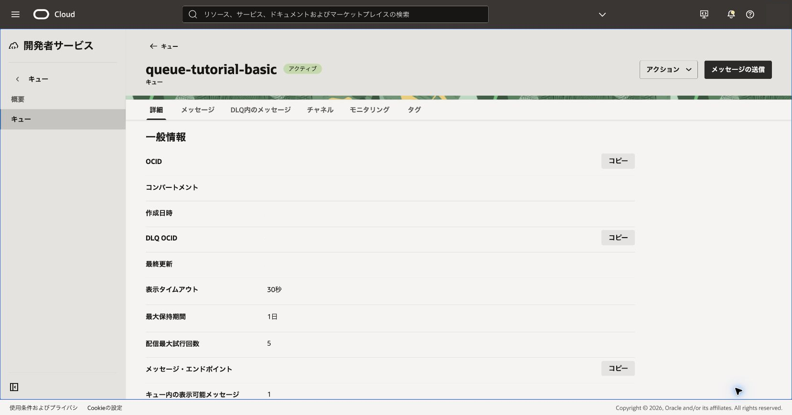
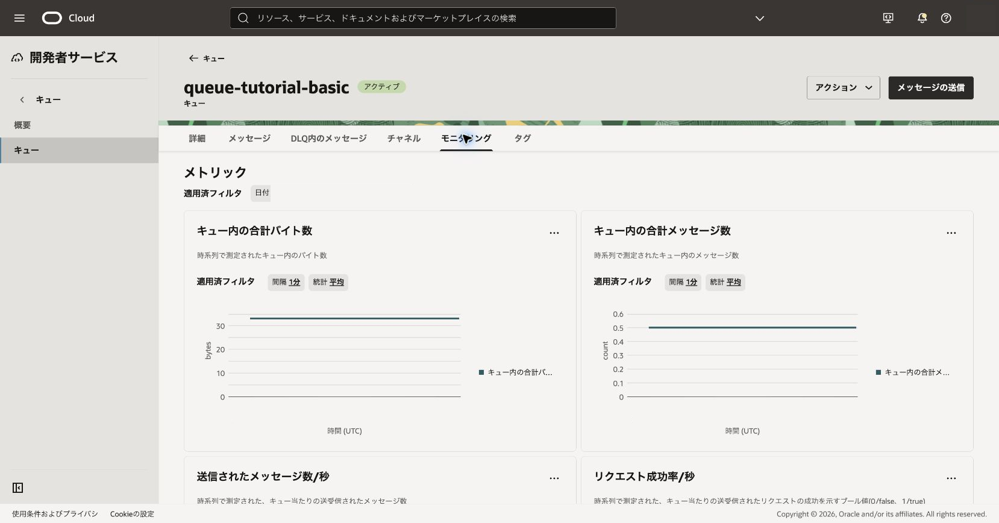
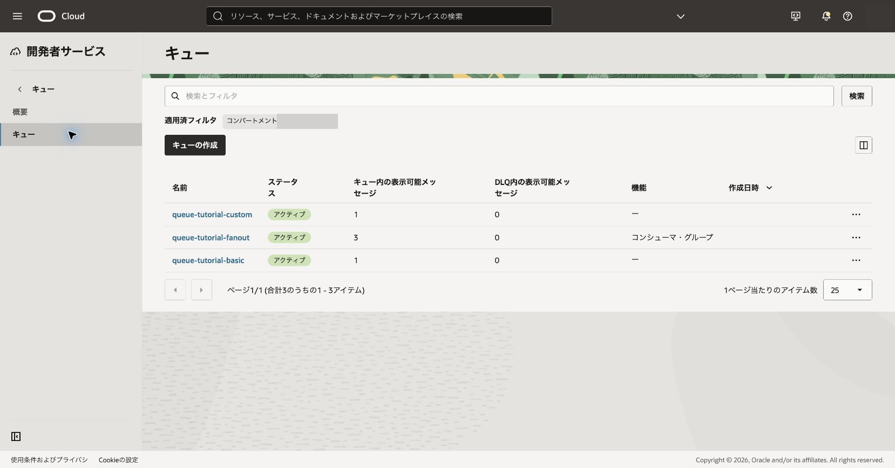
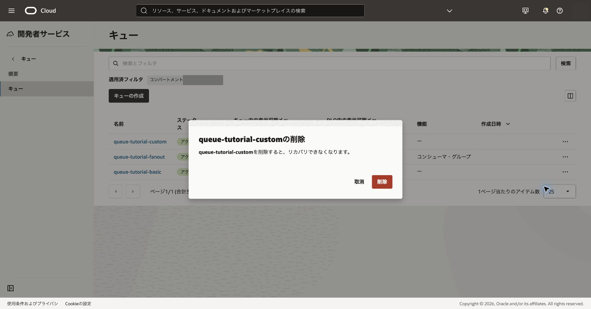

キューの状態を運用視点で確認し、後片付けの手順を学びます。

**所要時間 :** 約20分

**前提条件 :** 101〜104章が完了していること

**注意 :** 削除と消去は元に戻せません。対象名、リージョン、コンパートメントを照合し、組織で必要な承認を得てから実行してください。

**目次：**

- [1. 統計とメトリックを確認する](#anchor1)
- [2. 作業リクエストと削除対象を確認する](#anchor2)
- [3. 確認](#anchor3)
- [4. トラブルシュート](#anchor4)
- [5. 作成したリソースの削除](#anchor5)

# 1. 統計とメトリックを確認する

1. キュー詳細の**メッセージ**または統計表示で、表示可能・処理中・DLQの件数を確認します。

 

2. **メトリック**を開き、`QueueSize`、`MessagesInQueueCount`、`MessagesCount`、`RequestSuccess`、`RequestsLatency`、`ConsumerLag`を確認します。
   - 期待結果: 送受信操作に対応するグラフが表示されます。
   - 失敗時確認: 表示期間、リージョン、Monitoringの参照権限を確認します。メトリック反映には時間差があります。

 

# 2. 状態と削除対象を確認する

1. Queue一覧で対象キューが**アクティブ**であることを確認します。

 

2. `RESOURCE_LEDGER.md`と照合し、削除するキュー、残っているメッセージ、後続章の依存を確認します。
3. 組織で必要な削除承認がない場合はここで停止します。

# 3. 確認

キューの状態、主要メトリック、メッセージ件数、削除依存を説明できることを確認します。後続章で使用するリソースは保持します。

# 4. トラブルシュート

- メトリックが空の場合は期間を広げ、テスト送受信後に再確認します。
- 削除できない場合はキュー状態、権限、進行中の処理を確認します。
- 一覧に残る場合はライフサイクル状態が変わるまで待ち、一覧を再読込みします。

# 5. 作成したリソースの削除

必要な承認を得た後、対象キューのアクションから**削除**を選択し、確認ダイアログの対象名を照合して実行します。削除完了後は一覧から消えたことを確認します。

 

参考: [キュー・メトリック](https://docs.oracle.com/ja-jp/iaas/Content/queue/metrics.htm)
