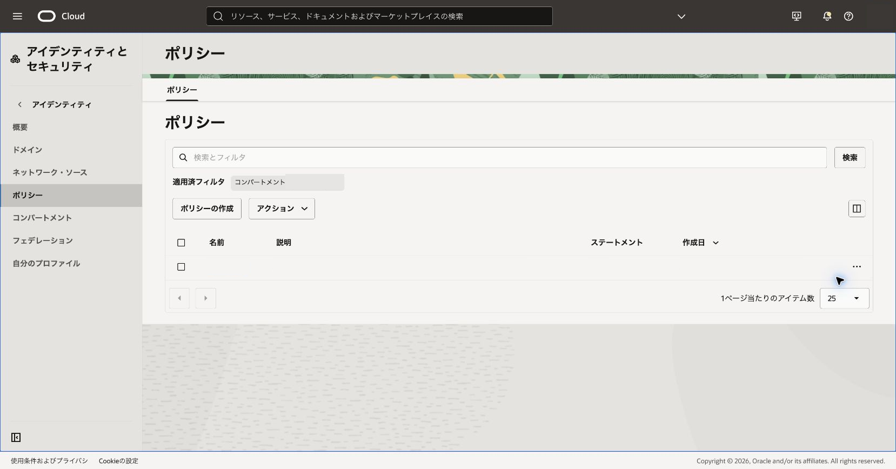

Queue管理者、Producer、Consumerの役割を分離し、必要な権限を理解します。

**所要時間 :** 約35分

**前提条件 :** 102章が完了し、IAMポリシーを確認できること

**注意 :** IAM変更は組織の変更管理手続きに従います。具体的なグループ、コンパートメント、既存ポリシーとの差分を提示し、管理者の承認を得てください。

**目次：**

- [1. 必要権限を設計する](#anchor1)
- [2. ポリシー案と検証方法を確認する](#anchor2)
- [3. 確認](#anchor3)
- [4. トラブルシュート](#anchor4)
- [5. 作成したリソースの削除](#anchor5)

<a id="anchor1"></a>

# 1. 必要権限を設計する

1. 対象コンパートメントの既存ポリシーと利用グループを確認します。

<div align="center">

</div>
<br>

2. 次のチュートリアル用グループと最小権限案を確認します。

- `OCIQueueTutorialManagers`: QueueとConsumer Groupを管理する担当
- `OCIQueueTutorialProducers`: メッセージ送信だけを行う担当
- `OCIQueueTutorialConsumers`: メッセージ取得、可視性更新、削除を行う担当

```text
Allow group OCIQueueTutorialManagers to manage queues in compartment OCIQueueTutorial
Allow group OCIQueueTutorialManagers to manage queue-consumer-group in compartment OCIQueueTutorial
Allow group OCIQueueTutorialProducers to use queue-push in compartment OCIQueueTutorial
Allow group OCIQueueTutorialConsumers to use queue-pull in compartment OCIQueueTutorial
```

`OCIQueueTutorial`はチュートリアル上の例です。実環境では次の差替え用セットの`<compartment_name>`を、使用を許可されたコンパートメント名へ置換します。

```text
Allow group <QueueManagers> to manage queues in compartment <compartment_name>
Allow group <QueueManagers> to manage queue-consumer-group in compartment <compartment_name>
Allow group <QueueProducers> to use queue-push in compartment <compartment_name>
Allow group <QueueConsumers> to use queue-pull in compartment <compartment_name>
```

> **ポリシー案の確認ポイント**
>
> スクリーンショットの代わりに、上の4文がそれぞれManager、Producer、Consumerの役割と対象コンパートメントに一致することを確認します。プレースホルダーが残ったまま保存しないでください。

Queueの管理権限とConsumer Groupの管理権限は別のリソース・タイプです。Consumer Groupを作成・更新・削除するManagerには両方を付与します。

<a id="anchor2"></a>

# 2. ポリシー案と検証方法を確認する

1. 管理者はキュー作成、Producerは送信、Consumerは取得・更新・削除を担当するテスト表を作ります。
2. 対象グループ、ポリシー配置先、コンパートメント範囲、既存権限との差分を管理者へ提示します。
3. 管理者の承認後にポリシーを作成または更新します。
   - 期待結果: 役割ごとに許可された操作だけ成功します。
   - 失敗時確認: ユーザーのグループ所属、ポリシーのスコープ、反映待ちを確認します。

> **保存前に画面の文で確認する内容**
>
> 変更対象がチュートリアル用ポリシーだけであること、配置先と対象コンパートメントが一致すること、既存ステートメントを削除していないことを確認します。保存後は「ポリシーが正常に作成または更新された」ことを示す成功通知を確認します。表示文言はコンソールのバージョンで異なることがあります。

既存の広い権限を持つユーザーでは「許可されない操作」を検証できません。拒否動作も確認する場合は、各グループだけに所属する検証用主体を別途用意し、その作成とグループ割当てもIAM変更として承認します。

<a id="anchor3"></a>

# 3. 確認

次の出力例とメッセージで役割ごとの結果を照合します。日時、ID、receiptはプレースホルダで表示しています。

## Producerの送信成功

> **確認メッセージ:** `messages`に1件の結果が含まれ、`id`と`expire-after`が返れば送信成功です。

```json
{
  "data": {
    "messages": [
      {
        "expire-after": "<timestamp>",
        "id": "<message-id>"
      }
    ]
  }
}
```

## Consumerの取得成功

> **確認メッセージ:** `content`が送信した値と一致し、`delivery-count`と`receipt`が返れば取得成功です。

```json
{
  "data": {
    "messages": [
      {
        "content": "iam-role-test",
        "delivery-count": 1,
        "receipt": "<receipt>"
      }
    ]
  }
}
```

## 権限外操作の拒否

> **確認メッセージ:** 許可していない操作だけが`NotAuthorizedOrNotFound`になることを確認します。次は代表例であり、CLIバージョンによって文言や付随項目が異なることがあります。

```text
ServiceError:
{
  "code": "NotAuthorizedOrNotFound",
  "message": "Authorization failed or requested resource not found."
}
```

認可エラーの実出力にはテナンシ名、ユーザー名、リクエストIDが含まれ得るため、記録へ転記する場合は環境固有値を除きます。

<a id="anchor4"></a>

# 4. トラブルシュート

- 想定外に操作できる場合は上位コンパートメントや別グループ由来の権限を確認します。
- すべて拒否される場合はグループ所属とポリシー構文、対象コンパートメントを確認します。
- 権限検証のために既存ユーザーの権限を弱めません。

<a id="anchor5"></a>

# 5. 作成したリソースの削除

ポリシーを追加した場合は変更記録を残します。検証完了後、影響範囲を再確認し、管理者の承認後に追加した文だけを削除します。

参考: [Queueポリシー・リファレンス](https://docs.oracle.com/ja-jp/iaas/Content/queue/policy-reference.htm)
