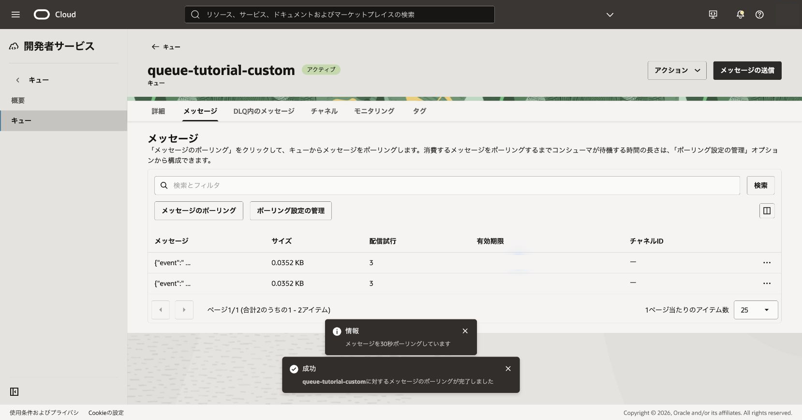

正常に処理できないメッセージを配信不能キュー（DLQ）へ分離する動作を確認します。DLQはキュー作成時に自動作成され、独立したキューを別途作るものではありません。

**所要時間 :** 約35分

**前提条件 :** 104章の`queue-tutorial-custom`が利用できること。このキューは表示タイムアウト10秒、最大配信試行回数3回です。

**注意 :** ポーリングするたびに配信回数が増えます。本章専用メッセージだけを使い、他章のメッセージをDLQへ移動させないでください。

**目次：**

- [1. DLQ検証用キューとメッセージを準備する](#anchor1)
- [2. 配信失敗を再現する](#anchor2)
- [3. 確認](#anchor3)
- [4. トラブルシュート](#anchor4)
- [5. 作成したリソースの削除](#anchor5)

# 1. DLQ検証用キューとメッセージを準備する

1. 104章で作成した`queue-tutorial-custom`を開き、表示タイムアウト10秒、最大配信試行回数3回であることを確認します。
2. キュー詳細でDLQ OCIDが表示され、DLQが自動作成されていることを確認します。

 

3. `{"event":"dlq-test","result":"fail"}`を1件送信します。
   - 期待結果: メッセージが通常キューへ送信されます。
   - 失敗時確認: Queue管理権限、送信権限、設定値を確認します。

送信操作を再試行した場合は、同じcontentが複数件作成されていないか通常キューの件数を確認します。重複している場合も、他の検証データと区別できる同じ検証用contentだけを追跡します。

# 2. 配信失敗を再現する

1. メッセージを取得しますが、削除しません。

 

2. 可視性タイムアウトの経過後に再取得します。
3. `deliveryCount`を確認しながら、設定した最大配信試行回数を超えるまで繰り返します。
   - 期待結果: 最終的に通常キューから返らなくなります。
   - 失敗時確認: receiptで削除していないか、待ち時間が十分か、別メッセージを取得していないかを確認します。

 

# 3. 確認

キュー詳細からDLQのメッセージを確認し、検証用contentと配信回数を照合します。確認操作自体も配信回数へ影響し得るため、必要以上にポーリングしません。

 

# 4. トラブルシュート

- DLQへ移動しない場合は最大配信試行回数と取得回数を確認します。
- 早く移動した場合はコンソールを含む事前のポーリング回数を確認します。
- DLQに別メッセージがある場合はcontentを照合し、誤って削除しません。

# 5. 作成したリソースの削除

検証完了後、DLQ内の検証メッセージを消去または取得・削除します。`queue-tutorial-custom`を後続章で使わない場合は親キューも削除します。DLQは親キューと一体で管理します。

参考: [配信不能キュー](https://docs.oracle.com/ja-jp/iaas/Content/queue/deadletterqueues.htm)
