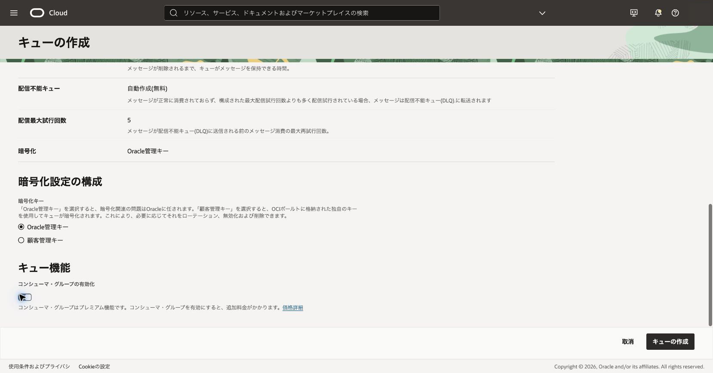
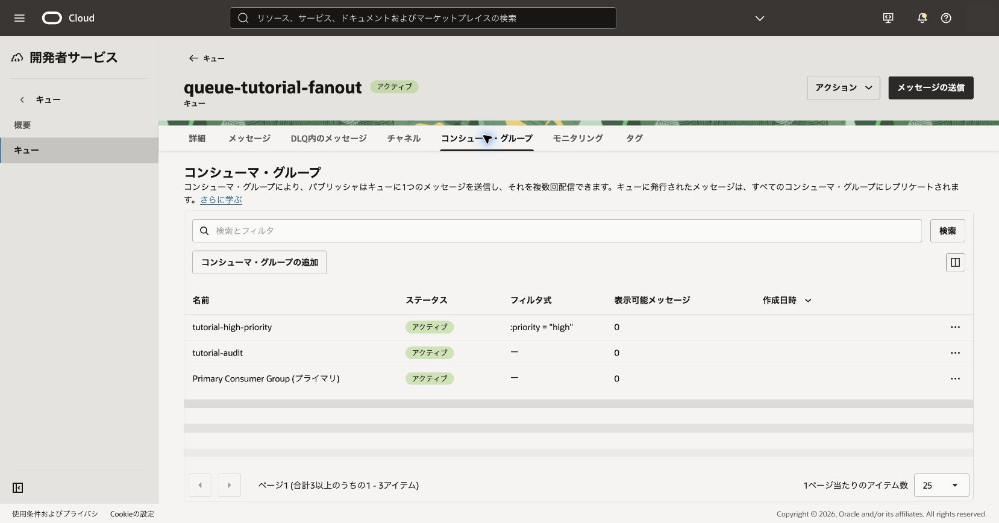
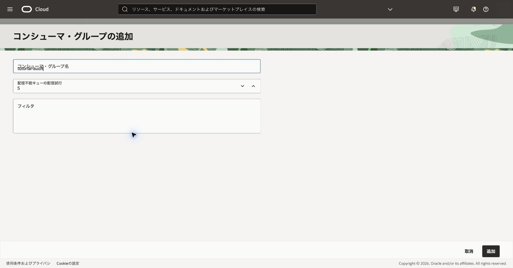
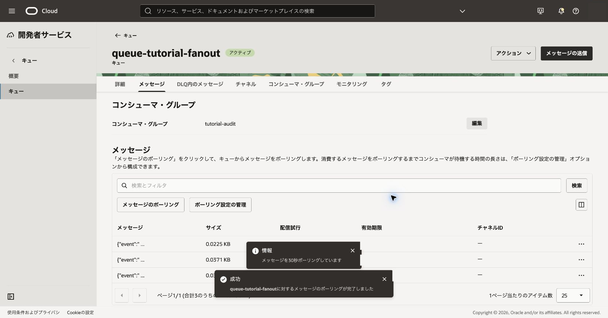
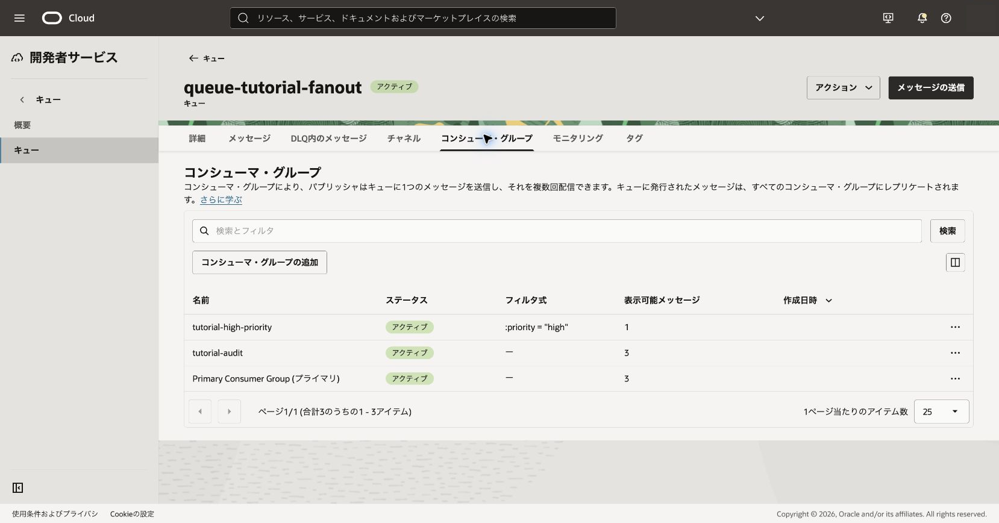

コンシューマ・グループはキュー内の永続的な論理配信経路です。エフェメラルなチャネルとは異なります。

**所要時間 :** 約40分

**前提条件 :** 102章が完了し、コンシューマ・グループ管理権限を確認済みであること

**費用に関する注意 :** コンシューマ・グループは追加料金が発生するプレミアム機能です。本章を実施する前に料金を確認し、組織で必要な承認を得てください。

**目次：**

- [1. グループ対応キューを作成する](#anchor1)
- [2. 複数グループで取得する](#anchor2)
- [3. 確認](#anchor3)
- [4. トラブルシュート](#anchor4)
- [5. 作成したリソースの削除](#anchor5)

# 1. グループ対応キューを作成する

1. Queue一覧から`queue-tutorial-fanout`を作成し、**コンシューマ・グループの有効化**をオンにします。

 

2. キューがアクティブになったら**コンシューマ・グループ**を開き、primaryグループが有効であることを確認します。

 

3. **コンシューマ・グループの追加**から`tutorial-audit`をフィルタなしで追加します。
   - 期待結果: primaryと`tutorial-audit`が一覧へ表示されます。
   - 失敗時確認: 機能が有効か、`queue-consumer-group`の作成権限があるかを確認します。

 

# 2. 複数グループで取得する

1. `{"event":"fanout-test"}`を1件送信します。
2. **メッセージ**タブを開き、コンシューマ・グループが**Primary Consumer Group**であることを確認して、**メッセージのポーリング**、**続行**の順にクリックします。

 

3. コンシューマ・グループの**編集**をクリックし、`tutorial-audit`を選択して**更新**します。もう一度**メッセージのポーリング**、**続行**の順にクリックします。

 

期待結果は、同じcontentをそれぞれの配信経路から独立して取得できることです。各グループのreceiptは別々に扱います。

# 3. 確認

primaryと`tutorial-audit`の両方でメッセージを削除し、それぞれから再取得できないことを確認します。片方の削除が他方の未処理メッセージを削除しない点を説明します。

 

# 4. トラブルシュート

- グループ一覧がない場合はキュー機能が有効か確認します。
- グループ指定取得で拒否される場合は対象グループの権限とOCIDを確認します。
- primaryで見えない場合はprimaryが無効化されていないか確認します。

# 5. 作成したリソースの削除

検証完了後、各グループの検証メッセージを削除し、作成した`tutorial-audit`、最後に親キューを削除します。

参考: [キュー内の多数のコンシューマ・グループへのファンアウト](https://docs.oracle.com/ja-jp/iaas/Content/queue/fanout-top.htm)
