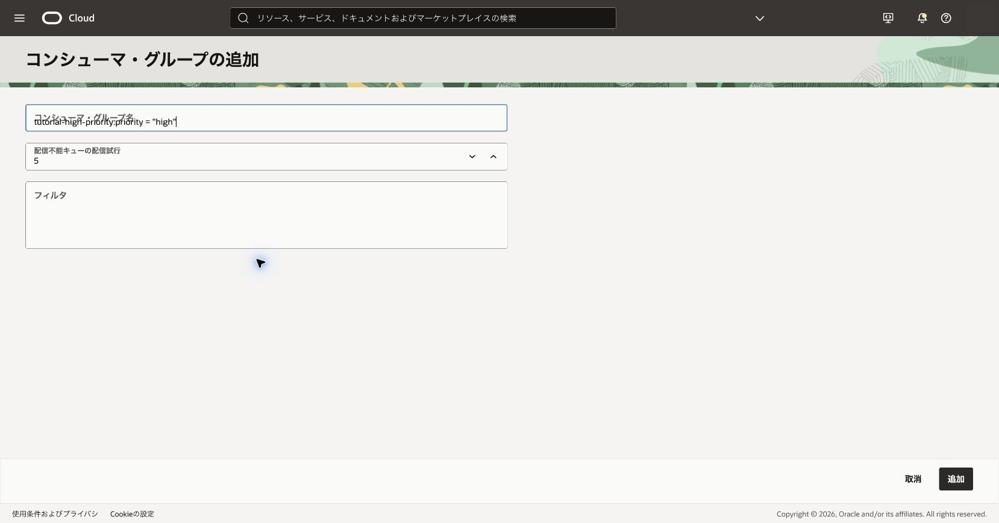
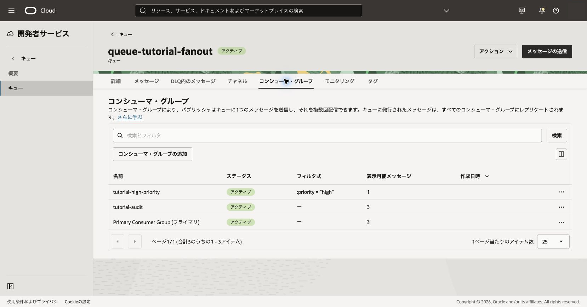
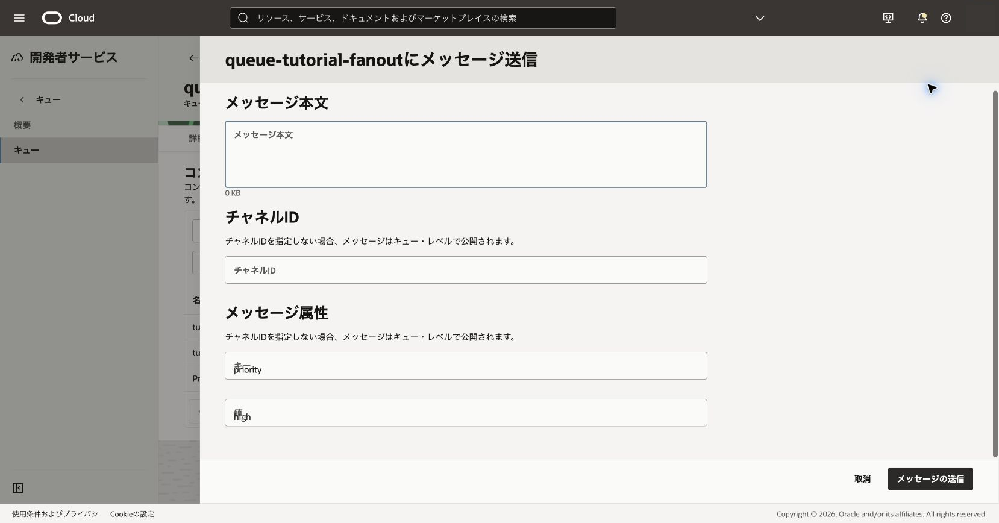
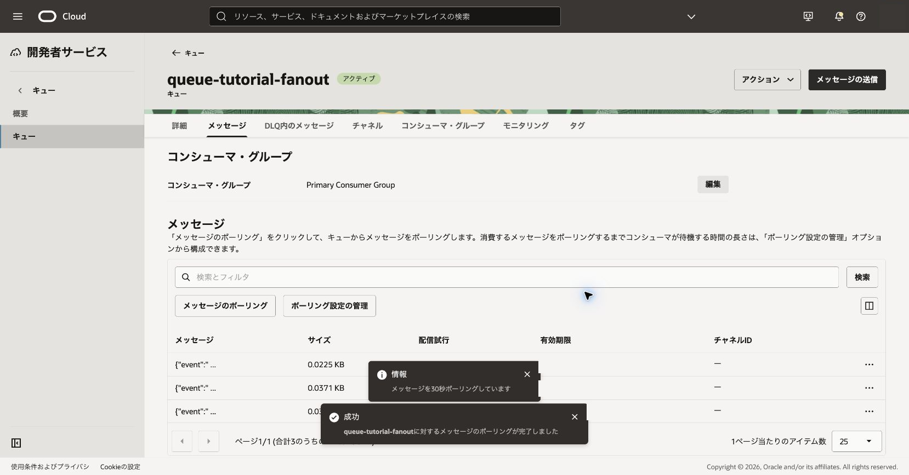
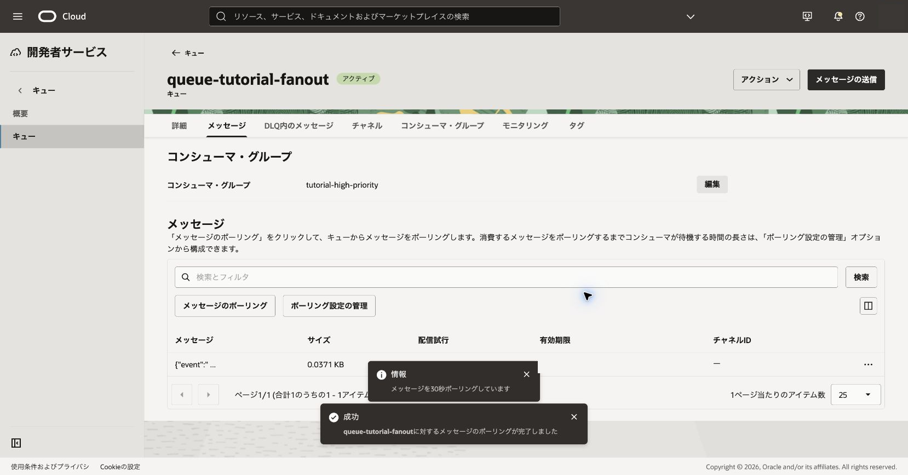

コンシューマ・グループのフィルタはメッセージ本文ではなく属性を評価します。属性に応じた配信の違いを確認します。

**所要時間 :** 約40分

**前提条件 :** 203章の`queue-tutorial-fanout`が利用できること

**注意 :** フィルタはメッセージの初回公開時だけ評価されます。primaryを無効にするとどのフィルタにも一致しないメッセージが失われる可能性があるため、本章では有効のままにします。

**費用に関する注意 :** 属性フィルタは追加料金が発生するコンシューマ・グループを使用します。本章を実施する前に料金を確認し、組織で必要な承認を得てください。

**目次：**

- [1. フィルタ付きグループを作成する](#anchor1)
- [2. 属性付きメッセージを送信する](#anchor2)
- [3. 確認](#anchor3)
- [4. トラブルシュート](#anchor4)
- [5. 作成したリソースの削除](#anchor5)

# 1. フィルタ付きグループを作成する

1. コンシューマ・グループ一覧で**追加**をクリックします。
2. 名前へ`tutorial-high-priority`、フィルタへ`:priority = "high"`を入力します。

 

3. DLQ配信試行回数を確認して追加します。
   - 期待結果: フィルタ式付きのグループが有効になります。
   - 失敗時確認: 属性名の大文字小文字、引用符、式の長さ、管理権限を確認します。

 

# 2. 属性付きメッセージを送信する

1. キュー詳細の**メッセージの送信**をクリックします。
2. 次の2件を1件ずつ送信します。**メッセージ属性**のキーへ`priority`、値へそれぞれ`high`または`normal`を入力します。
   - `{"event":"filtered-test","sequence":1}`、属性`priority=high`
   - `{"event":"filtered-test","sequence":2}`、属性`priority=normal`

 

3. **メッセージ**タブで**Primary Consumer Group**を選択してポーリングし、続いて`tutorial-high-priority`へ切り替えてポーリングします。
   - 期待結果: primaryは両方を受け取り、フィルタ付きグループは`high`だけを受け取ります。
   - 失敗時確認: 本文ではなくattributesへ値を設定したか、送信前にグループが有効だったかを確認します。

 

 

# 3. 確認

フィルタ付きグループから`normal`メッセージが返らないことを確認します。検証後は各グループで取得したメッセージを、それぞれの最新receiptで削除します。

# 4. トラブルシュート

- 両方届く場合はグループのフィルタが空でないか確認します。
- どちらも届かない場合は属性キーと値の大文字小文字を確認します。
- フィルタ変更前のメッセージは再評価されないため、新しいメッセージで試します。

# 5. 作成したリソースの削除

検証完了後、グループ内のメッセージを削除し、`tutorial-high-priority`を削除します。親キューを後続章で使う場合は保持します。

参考: [コンシューマ・グループと属性フィルタ](https://docs.oracle.com/ja-jp/iaas/Content/queue/fanout-top.htm)
