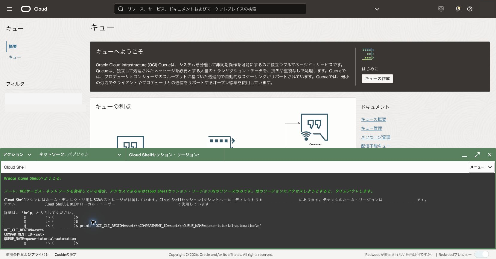
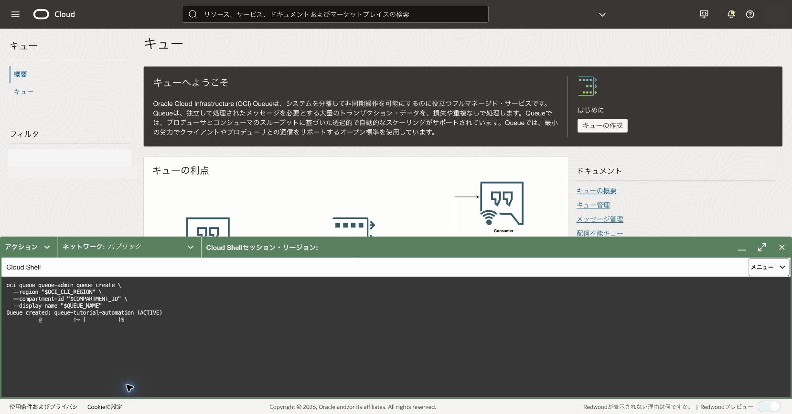
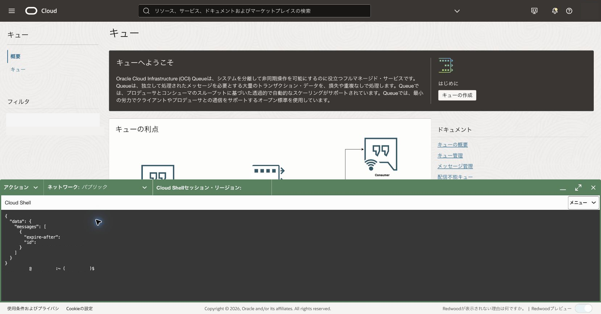
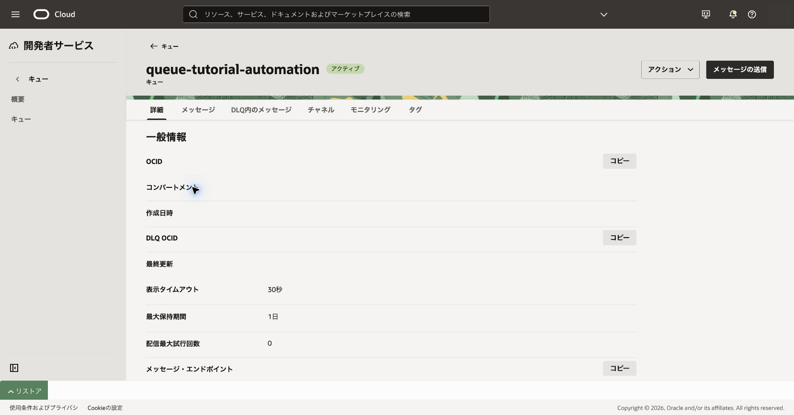

コンソールで学んだQueue操作をOCI CLIで再現します。資格情報や実OCIDはスクリプトへ埋め込みません。

**所要時間 :** 約35分

**前提条件 :** 102章と105章を理解し、Cloud ShellでOCI CLIを実行できること

**注意 :** 作成・削除を含むため、実行対象のリージョン、コンパートメント、表示名を毎回確認します。削除処理は組織で必要な承認を得てから実行してください。

**目次：**

- [1. 安全な入力と作成処理を準備する](#anchor1)
- [2. 送受信と後片付けを自動化する](#anchor2)
- [3. 確認](#anchor3)
- [4. トラブルシュート](#anchor4)
- [5. 作成したリソースの削除](#anchor5)

<a id="anchor1"></a>

# 1. 安全な入力と作成処理を準備する

1. Cloud Shellで環境変数を一時設定します。シェル履歴や共有ファイルへ実値を残さない運用に従います。

```bash
OCI_CLI_REGION='<リージョン識別子>'
COMPARTMENT_ID='<コンパートメントOCID>'
QUEUE_NAME='queue-tutorial-automation'
```

<div align="center">

</div>
<br>

2. 実行前チェックを行い、キューを作成します。Queueの作成は非同期処理であるため、作成レスポンスのワーク・リクエストIDを使って完了を確認し、作成されたキューのOCIDを取得します。

```bash
test -n "$OCI_CLI_REGION" && test -n "$COMPARTMENT_ID" && test -n "$QUEUE_NAME"
WORK_REQUEST_ID=$(oci queue queue-admin queue create \
  --region "$OCI_CLI_REGION" \
  --compartment-id "$COMPARTMENT_ID" \
  --display-name "$QUEUE_NAME" \
  --query '"opc-work-request-id"' \
  --raw-output)

while [ "$(oci queue queue-admin work-request get \
  --work-request-id "$WORK_REQUEST_ID" \
  --query 'data.status' \
  --raw-output)" = 'IN_PROGRESS' ]; do
  sleep 5
done

test "$(oci queue queue-admin work-request get \
  --work-request-id "$WORK_REQUEST_ID" \
  --query 'data.status' \
  --raw-output)" = 'SUCCEEDED'

QUEUE_ID=$(oci queue queue-admin work-request get \
  --work-request-id "$WORK_REQUEST_ID" \
  --query 'data.resources[0].identifier' \
  --raw-output)
QUEUE_ENDPOINT=$(oci queue queue-admin queue get \
  --queue-id "$QUEUE_ID" \
  --query 'data."messages-endpoint"' \
  --raw-output)
```

期待結果はワーク・リクエストが`SUCCEEDED`となり、`QUEUE_ID`と`QUEUE_ENDPOINT`へ作成したキューの値が一時保存されることです。いずれかが空の場合は後続操作を実行しません。同じ表示名で再実行する前に、既存キューがないことを確認してください。

<div align="center">

</div>
<br>

<a id="anchor2"></a>

# 2. 送受信と後片付けを自動化する

1. 公式CLIの生成機能でmessages JSONのひな形を作り、検証用contentへ置き換えます。

```bash
oci queue messages put-messages \
  --endpoint "$QUEUE_ENDPOINT" \
  --generate-param-json-input messages > /tmp/queue-messages.json
```

<div align="center">

</div>
<br>

2. `put-messages`で送信し、`get-messages`で取得します。

```bash
oci queue messages put-messages \
  --endpoint "$QUEUE_ENDPOINT" \
  --queue-id "$QUEUE_ID" \
  --messages file:///tmp/queue-messages.json
oci queue messages get-messages \
  --endpoint "$QUEUE_ENDPOINT" \
  --queue-id "$QUEUE_ID" \
  --limit 1 \
  --timeout-in-seconds 10
```

<div align="center">

</div>
<br>

<div align="center">

</div>
<br>

3. 取得結果のreceiptを使ってメッセージを削除します。receiptをログへ残さないでください。
4. キュー削除はスクリプトの通常経路へ含めず、`CONFIRM_DELETE`が明示的に設定され、必要な削除承認がある場合だけ別手順として実行します。
   - 期待結果: 再実行時に既存リソースを誤作成・誤削除しません。
   - 失敗時確認: キュー状態、リージョン、入力値、権限、メッセージ・エンドポイントを確認します。

<a id="anchor3"></a>

# 3. 確認

コンソールで検証用キューの状態と送受信結果を照合します。スクリプト、Cloud Shellの履歴、出力にOCID、receipt、FQDN、メール、個人名が残っていないか確認します。

<div align="center">

</div>
<br>

<a id="anchor4"></a>

# 4. トラブルシュート

- `QUEUE_ID`が空なら処理を停止し、作成コマンドの標準エラーを確認します。
- メッセージ操作が失敗する場合は、管理APIだけでなくメッセージ・エンドポイントへ到達できるか確認します。
- 同名キューがある場合は既存リソースを再利用せず、管理対象のリソース一覧と照合してから判断します。

<a id="anchor5"></a>

# 5. 作成したリソースの削除

必要な削除承認を得た後、対象キューのOCIDと表示名をコンソールで再確認し、`oci queue queue-admin queue delete --queue-id "$QUEUE_ID"`を実行します。キュー管理操作にはメッセージ・エンドポイントを指定しません。完了後は作業リクエストと一覧を確認し、管理対象のリソース一覧を更新します。

参考: [Queue CLIコマンド・リファレンス](https://docs.oracle.com/en-us/iaas/tools/oci-cli/latest/oci_cli_docs/cmdref/queue.html)
