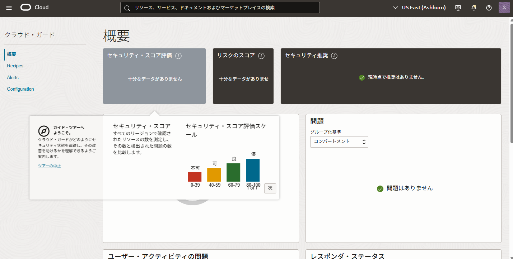

Cloud Guardは、OCI上のリソース構成やユーザーアクティビティを監視し、潜在的なセキュリティリスクを自動的に検出・修正するためのサービスです。

このチュートリアルでは、Cloud Guardを有効化して実際に利用を開始するまでの手順を説明します。

**所要時間**：
- 約15分

**前提条件**：
- なし
- Free TierテナントではCloug Guardはご利用できませんので、ご注意ください。

**注意**：
- OCIコンソールのUIはアップデートにより変更される場合があります。そのため一部画面ショットと異なる場合がありますのでご注意ください。


## 1. IAMポリシーの確認
はじめに、Cloud Guardを使用するためのIAMポリシーが設定されていることを確認してください。

以下のポリシーが必要です。
```
allow group <CloudGuardUsersGroup> to manage cloud-guard-family in tenancy
allow group <CloudGuardUsersGroup> to read threat-intel-family in tenancy
```

また、Cloud GuardはFree Tierテナントではご利用できません。その他前提条件については以下ドキュメントをご参照ください。

> https://docs.oracle.com/ja-jp/iaas/Content/cloud-guard/using/prerequisites.htm


## 2. Cloud Guardの有効化
コンソール左上のメニューボタンより、[アイデンティティとセキュリティ] → [クラウド・ガード] を選択します。  
まだCloud Guardが有効化されていない場合は、「クラウド・ガードの有効化」ボタンが表示されますので、こちらをクリックします。


Cloud Guardを利用するには、OCIリソースの状態を把握するためのアクセスポリシーが必要です。  
トグルボタンを有効化すると、必要なポリシーが自動的に作成されます。有効化したら「次へ」をクリックします。


>「CloudGuardPolicies」という名前でIAMポリシーが自動で作成されます。

次に、Cloud Guardが検知情報を集約するレポートリージョンと、監視対象となる範囲（ターゲット）を設定します。

ターゲットはコンパートメント単位で指定することが可能ですが、トグルスイッチを有効化することで、テナント全体を対象に設定することもできます。


> 通知サービスやイベントサービスとの連携はレポートリージョンが使用されます

最後にサマリを確認し、問題がなければ「Submit」をクリックして有効化を完了します。






以下のようなエラーが出る場合、IAMポリシーが設定されているかどうかを確認ください。  
```
Compartment ocid1.tenancy.oc1..xxxxx is missing required permissions to read following resource types : [tenancies]
```


これでCloud Guardの有効化は完了です。


## 3. Cloud Guard構成の確認
Cloud Guardの設定状況を確認するには、左側メニューから [Configuration] → [ターゲット] を選択します。  
ここでは、Cloud Guardが検査対象とする範囲（ターゲット）の作成や管理を行うことができます。

先ほどの有効化画面でターゲットの自動構成を有効にしていた場合、ルート・コンパートメントに、ルート・コンパートメント名と同じ名前のターゲットが自動的に作成されていることが確認できます。


また、ターゲットの詳細画面を開くと、すでに次の３つの検知レシピ（ディテクタレシピ）が設定されていることがわかります。
- 脅威ディテクタ
- 構成ディテクタ
- アクティビティディテクタ

これらのディテクタは、事前定義されたルールを用いてOCI環境内での脅威検知・設定違反・不審な操作などを自動的に検出します。  
この検知ルールの詳細については [リファレンス](https://docs.oracle.com/ja-jp/iaas/Content/cloud-guard/using/detect-recipes.htm) をご確認ください。


ディテクタレシピは上記以外にも「レスポンダレシピ」や「インスタンスセキュリティレシピ」「コンテナ構成セキュリティレシピ」があります。必要に応じて個別に有効化してください。


Cloud Guardの利用にあたっては、利用におけるIAMポリシーリファレンスもありますので、OCI公式ドキュメントも参照してください。
> https://docs.oracle.com/ja-jp/iaas/Content/cloud-guard/using/prerequisites.htm

