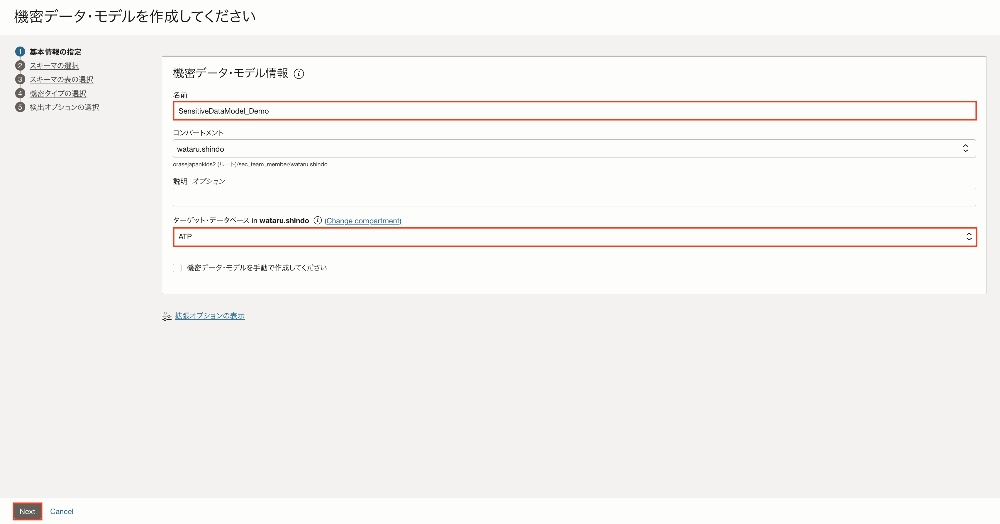
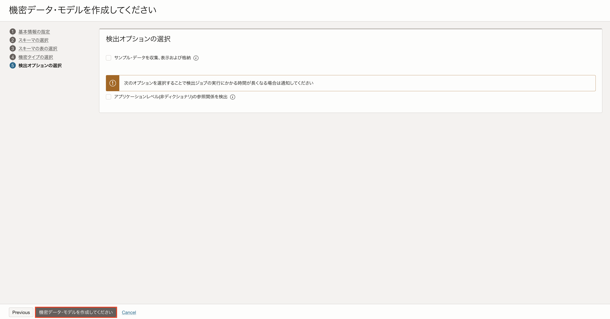
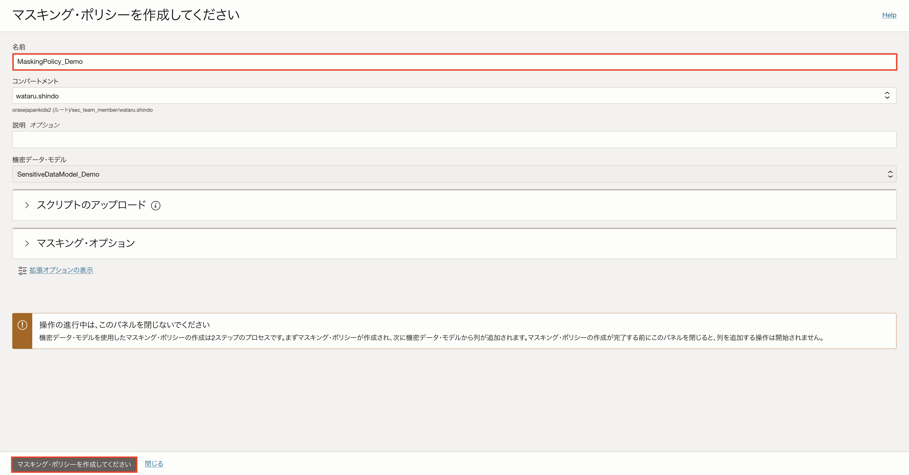
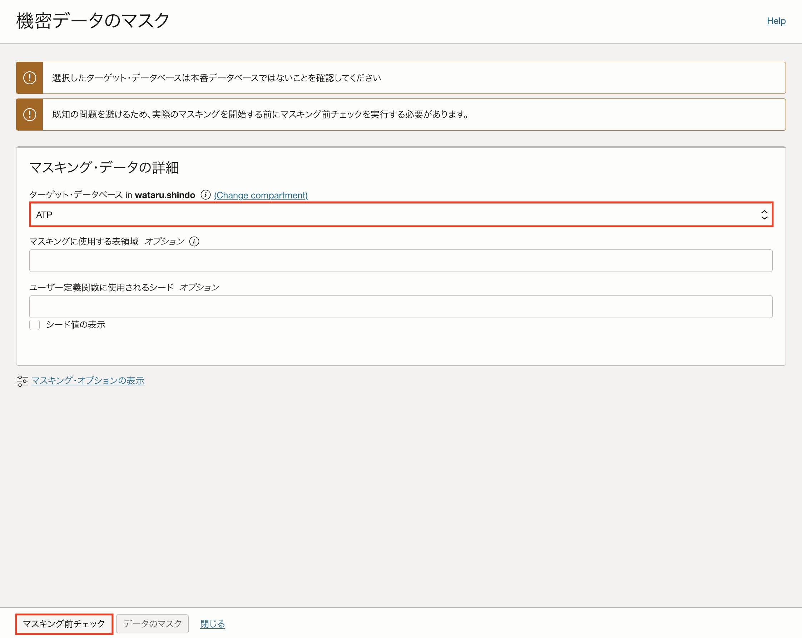
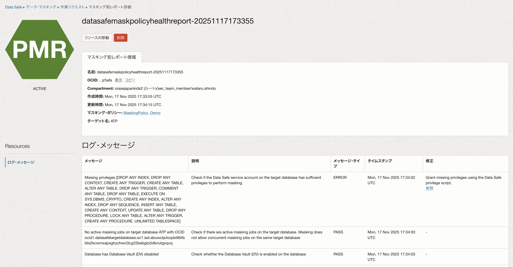
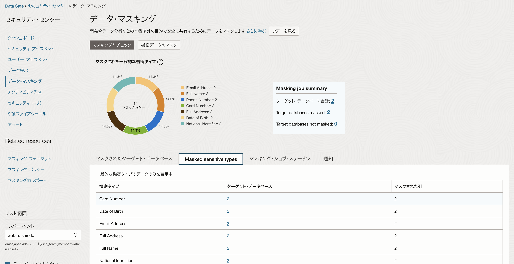
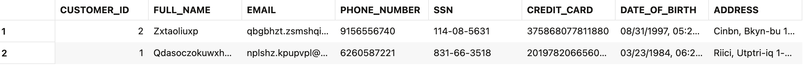

データ・マスキングは、開発・テスト環境など本番以外の環境で個人情報や機密データが漏えいするリスクを軽減するために不可欠なプロセスです。Data Safeのデータ・マスキング機能は、氏名・住所・メール・電話番号・クレジットカード番号などの機密情報を意味を保ちながら疑似データに変換できます。<br>
本チュートリアルでは、Data Safeのデータ・マスキング機能を使用してデータベースに格納された機密データをマスキングする方法をご紹介します。

**所要時間 :** 
+ 約30分

**前提条件 :**
+ Oracle DatabaseにData Safeが設定済み

# 機密データの作成
Data Safeのデータ・マスキングは機密データ検出と呼ばれる作業を実施してから、データをマスキングできます。
本チュートリアルでは、実際にデータベースに機密データを作成し、機密データ検出およびデータ・マスキングを実行します。<br>

マスキングをするデータを作成します。テーブルを作成するスキーマを作成します。
```
CREATE USER demo IDENTIFIED BY WElcome12345###;
```
作成したスキーマにテーブルを作成します。
```
CREATE TABLE demo.sensitive_customers(
    customer_id       NUMBER GENERATED BY DEFAULT AS IDENTITY PRIMARY KEY,
    full_name         VARCHAR2(100),     -- 氏名
    email             VARCHAR2(100),     -- メールアドレス
    phone_number      VARCHAR2(20),      -- 電話番号
    ssn               VARCHAR2(11),      -- 米国SSN形式
    credit_card       VARCHAR2(19),      -- クレジットカード番号
    date_of_birth     DATE,              -- 生年月日
    address           VARCHAR2(200)      -- 住所
);
```
作成したテーブルにサンプル・データを挿入します。
```
INSERT INTO demo.sensitive_customers
(full_name, email, phone_number, ssn, credit_card, date_of_birth, address)
VALUES
('Taro Yamada', 'taro.yamada@example.com', '090-1234-5678', '123-45-6789',
 '4111-1111-1111-1111', DATE '1985-04-12', 'Tokyo, Minato-ku 1-2-3');

INSERT INTO demo.sensitive_customers
(full_name, email, phone_number, ssn, credit_card, date_of_birth, address)
VALUES
('Hanako Suzuki', 'hanako.suzuki@example.com', '080-8765-4321', '987-65-4321',
 '5500-0000-0000-0004', DATE '1990-07-25', 'Osaka, Kita-ku 4-5-6');

COMMIT;
```
# 機密データモデルの作成
サンプルデータの作成が完了したら、Data Safeで機密データの検出します。
機密データの検出はセキュリティ・センターの「データ検出」をクリックします。

「機密データの検出」をクリックします。

名前に「任意の名前」とターゲット・データベースに対象のデータベースを選択し、「Next」をクリックします。

機密データが存在するスキーマを選択します。

選択したスキーマの表を選択できます。選択した場合は、スキーマの選択した表でのみ検出が実行されます。「Next」をクリックします。

機密タイプを選択します。（今回は全て選択しますが、必要な項目だけを選択することも可能です。）

「機密データ・モデルを作成してください」をクリックします。（サンプルデータを収集する場合は、「サンプル・データを収集および格納」を選択します。）

# マスキング・ポリシーの作成
機密データ・モデルの作成が完了したら、マスキング・ポリシーを作成します。<br>
「マスキング・ポリシー を作成してください」をクリックします。

名前に「任意の名前」を入力し、「マスキング・ポリシーを作成してください」をクリックします。

# マスキングの実行
マスキング・ポリシーの作成が完了したら、マスキングを実行します。<br>
「ターゲットのマスク」をクリックします。

マスキングを実行する前にマスキング前チェックを実行する必要があります。<br>
「ターゲット・データベース」を選択し、「マスキング前チェック」をクリックします。

マスキング前チェックが問題ないことを確認します。

再度「ターゲットのマスク」をクリックします。

ターゲット・データベースと作成したマスキング・ポリシーを選択し、「データのマスク」をクリックします。

マスキングが完了したことを確認します。


# マスキング結果の確認
マスキングが完了すると、マスクされた列や機密タイプの情報が表示されます。


以下のSQLを実行し、表のデータが変更されていることを確認します。
```
SQL > SELECT * FROM demo.sensitive_customers;
```

<br>

データ・マスキングのチュートリアルについては以上です。
データ・マスキングを実施することで機密データを安全に匿名化できるのでデータ漏えいリスクを大きく軽減できます。またOCI コンソール上から簡単にデータ・マスキングを実施できるため、環境構築や運用にかかる負荷も抑えられます。