Data Safeのセキュリティ・アセスメントは、データベースのセキュリティ体制の全体像を提供します。 データベース構成、ユーザーとその権限、およびセキュリティ・ポリシーを分析し、セキュリティ・リスクを明らかにします。また明らかにされたリスクを改善するための推奨事項も表示されます。<br>
本チュートリアルでは、セキュリティ・アセスメントの基本機能とベースラインの設定方法についてご紹介します。

**所要時間 :** 
+ 約30分

**前提条件 :**
+ Oracle DatabaseにData Safeが設定済み

# セキュリティ・アセスメントの基本機能
セキュリティ・アセスメントはセキュリティ・センターの「セキュリティ・アセスメント」をクリックします。

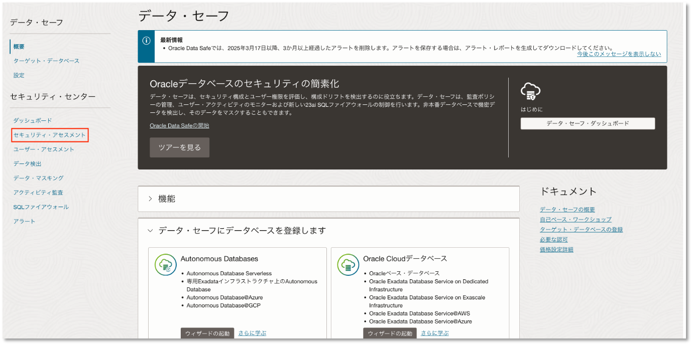

「リスクのサマリー」のタブには「ユーザー・アカウント」、「権限およびロール」といったデータベースのセキュリティカテゴリに対してリスク・レベルが割り当てられます。

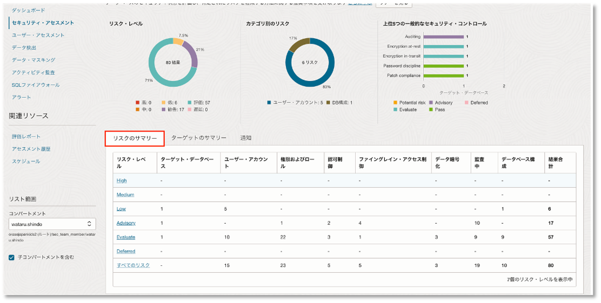

リスク・レベルのリンクをクリックするとリスクレベルに割り当てられた項目の内容が表示されます。

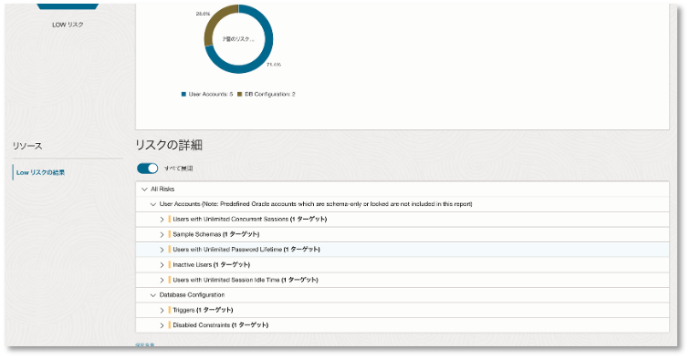

タブを開いて「ターゲット・データベース」のリンクをクリックすると、リスクの具体的な情報や推奨事項が表示されます。

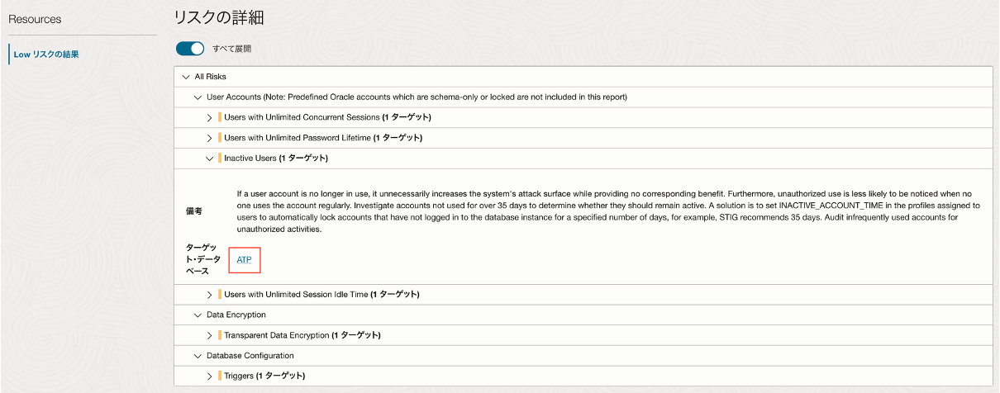

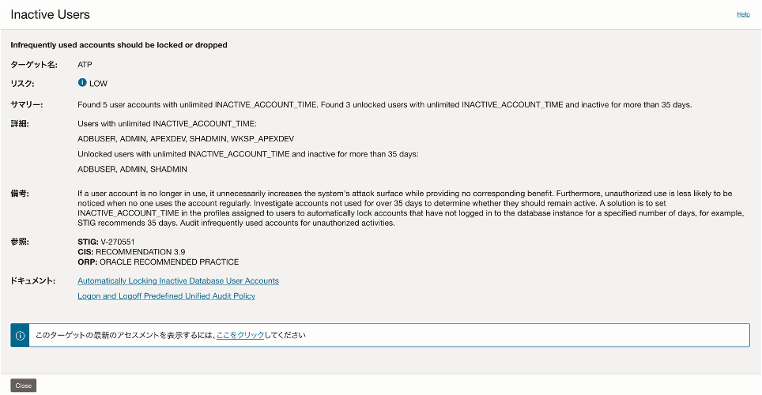

「ターゲットのサマリー」のタブにはData Safeを設定しているデータベースの情報が表示されます。

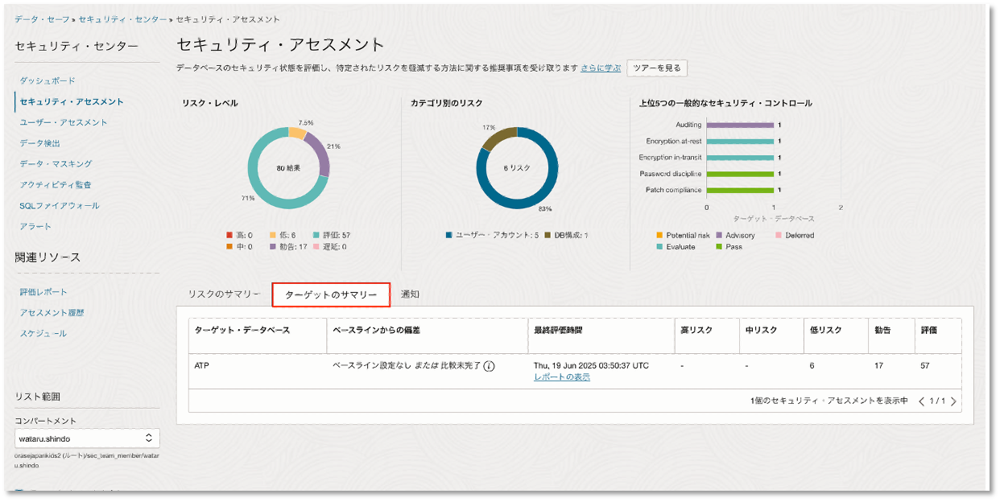

レポートの表示をクリックすると、そのデータベースのアセスメント評価が表示されます。

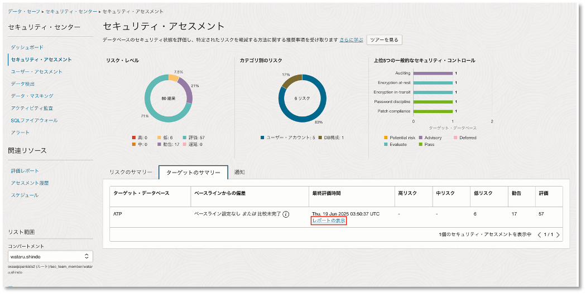


「通知」のタブは、ベースラインが更新された際やベースライン設定後に実施したアセスメントがベースラインから逸脱した際にユーザに通知をする設定ができます。

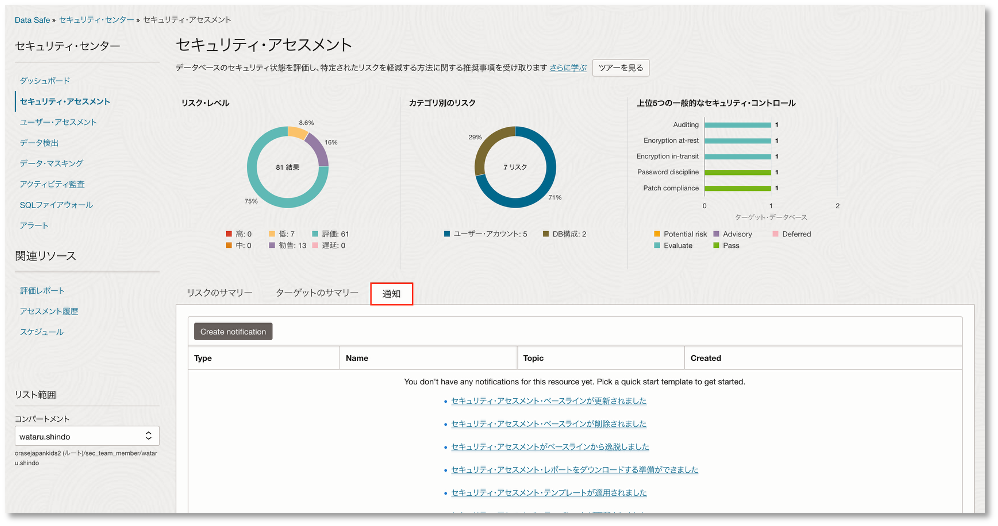

## ベースラインの設定と更新スケジュール
アセスメントでは、現在の設定をベースライン（基準値）として登録できます。また通知サービスと連携することで、このベースラインから逸脱した設定が検出された際に、ユーザーへ通知できます。本チュートリアルでは、登録したベースラインから意図的に設定を変更し、通知が行われることを確認します。<br>

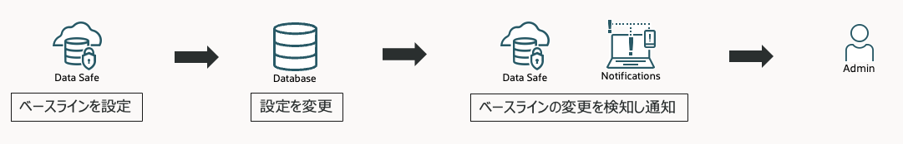

まずベースラインとして登録するアセスメントにベースラインを設定します。<br>
アセスメント評価の画面で「ベースラインとして設定」をクリックします。

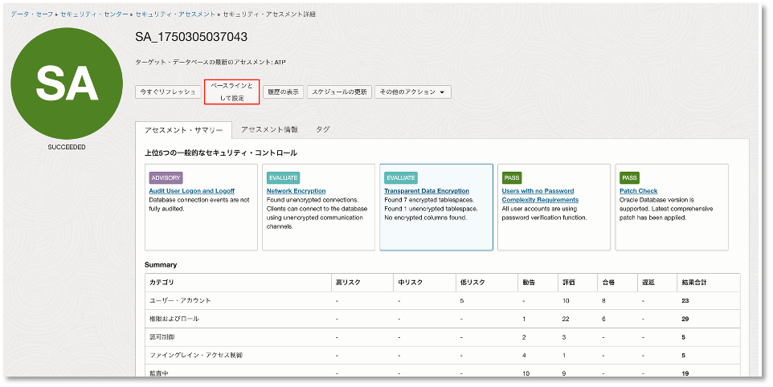

次の画面で「はい」をクリックします。

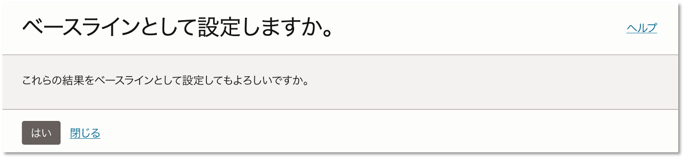

ベースラインから逸脱した設定を検出した際に通知されるように通知を設定します。<br>
「Create notification」をクリックします。

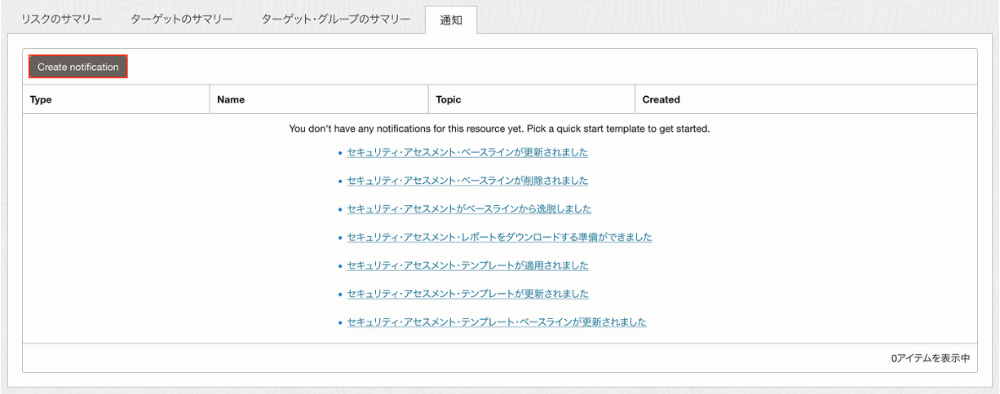

以下のように設定します。
 - template selection：セキュリティ・アセスメントがベースラインから逸脱しました。
 - Event Rule：任意のルール名
 - Topic：任意のトピック（今回は通知先をメールとします。）

※Topicとsub scriptionを新規で作成する場合は「Create new Topic」から作成できます。


データベースの設定を変更します。
今回はベースラインを逸脱する設定として、ユーザ・アカウントのロックなし・パスワードの有効期限なしを設定します。<br>
データベースにログインし、以下のSQLを実行します。

```SQL
ALTER PROFILE DEFAULT LIMIT PASSWORD_LIFE_TIME UNLIMITED;
```

実際にアラートが発報されるか、アセスメントを更新して確認します。<br>
アセスメント詳細の画面で、アセスメントを即時実行できる「今すぐリフレッシュ」をクリックします。

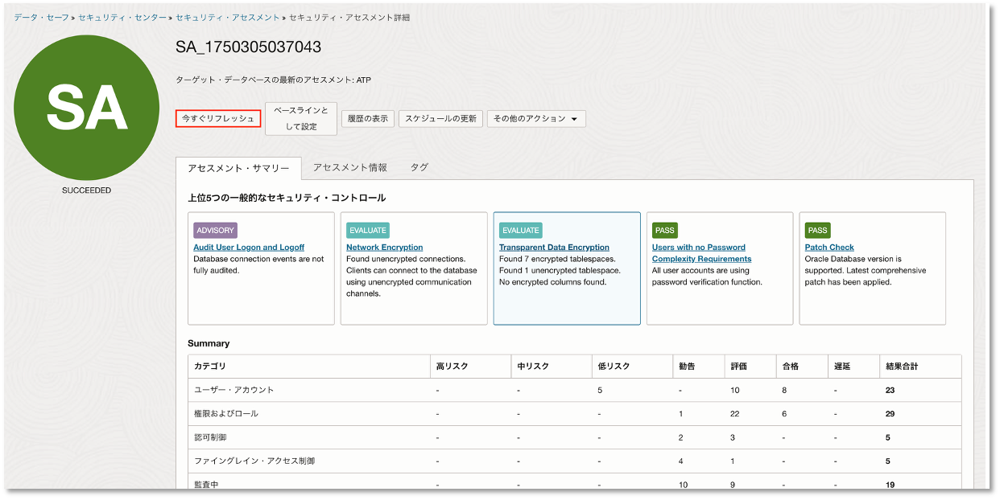

通知先にベースラインから逸脱したことを知らせるメールが届きます。

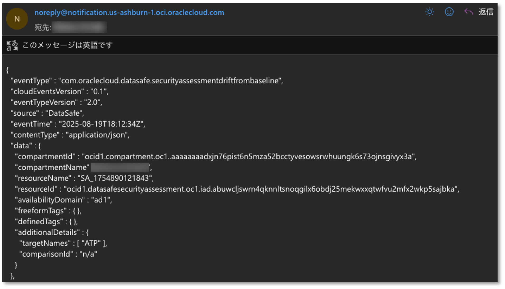

また設定変更後に実行したアセスメント詳細の「ベースラインとの比較」から、ユーザ・アカウントが変更済であることやユーザのパスワード期限を設定してないレポートを確認できます。

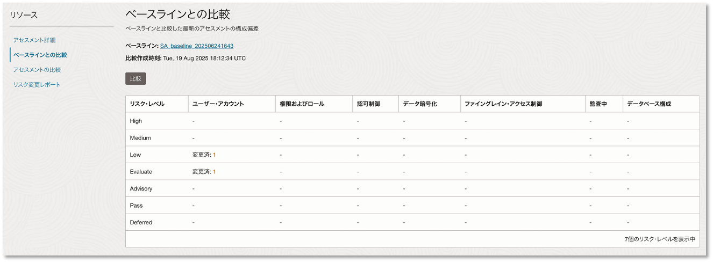

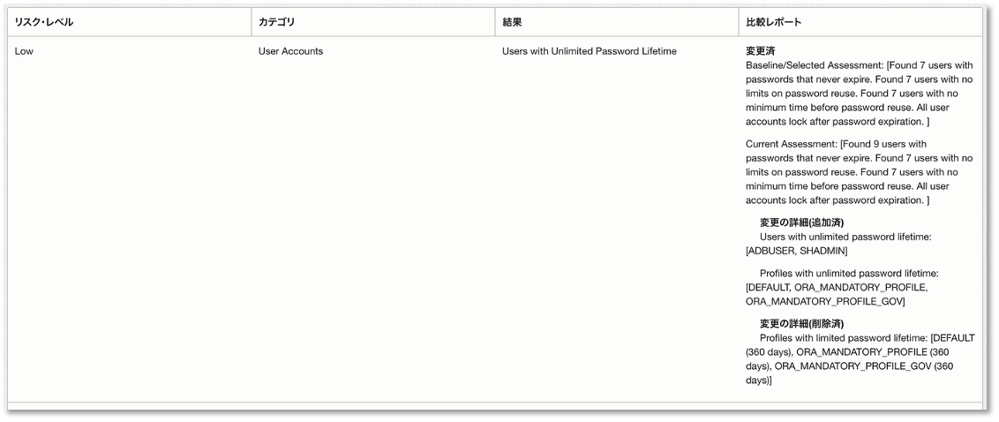

アセスメントはスケージュール実行も可能で、アセスメント詳細画面の「スケジュールの更新」から設定できます。スケジュールは、日単位、週単位、月単位設定できます。


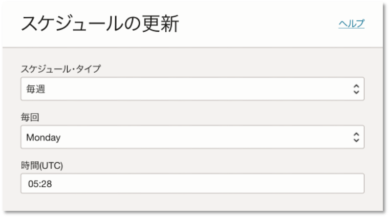

また画面左下の「アセスメントの比較」から過去に実施したアセスメント同士との比較もでき、過去のアセスメントからの変更点などが表示されます。

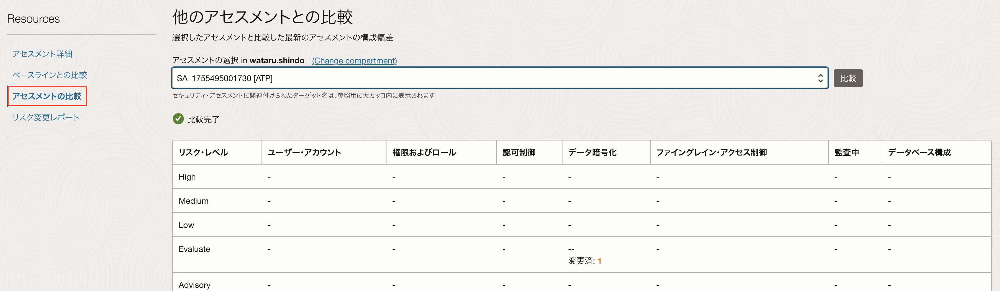

セキュリティ・アセスメントのチュートリアルについては以上です。

セキュリティ・アセスメントでは、データベース構成やユーザー権限など多様な観点からセキュリティ・リスクを可視化できます。定期的にアセスメントを行い結果をもとに設定を見直すことで、データベースをセキュアに運用できます。


