OCI Network Firewall は Oracle Cloud Infrastructure (OCI) のクラウドネイティブなマネージド・ファイアウォールです。  
パロアルトネットワークスの次世代ファイアウォール技術を基に、IDS/IPSを始め、URLフィルタリングや SSL/TLS検査などの高度なセキュリティ機能を提供しています。

また侵入検知のため、ポートスキャンや簡易的なインジェクション攻撃を行います。ご自身の管理下にないサーバーや、本番環境に対しては使用しないでください。ツールを使用したことによりトラブルや損失が発生した場合については責任を負いかねます。

**実施内容 :**  

本チュートリアルでは、Network Firewallポリシーの設定方法と動作検証を行います。  
具体的には以下のアクセス制御を設定し、コンピュートインスタンスからのアクセスが適切に許可・拒否されることを確認します。

+ パケットフィルタリング
  + ポート番号にて許可するプロトコルを設定します。その後、URLフィルタリングと組み合わせ、許可または拒否する URL を設定します。
+ URLフィルタリング
  + URLを設定し、適切に動作するかを確認します。  
+ IDS/IPS（侵入検知・防御システム）
  + ポートスキャン、SQLインジェクション、OSコマンドインジェクションを検知し、それぞれにて発生するログを確認します。

**所要時間 :** 
+ 約40分  

**前提条件 :**
+ ユーザーに必要なIAMポリシーが割り当てられていること。ポリシーの詳細は[ドキュメント「ネットワーク・ファイアウォールIAMポリシー」](https://docs.oracle.com/ja-jp/iaas/Content/network-firewall/iam-policy-reference.htm)を参照ください。
+ OCIチュートリアル「[OCI Network Firewallを構築する](/ocitutorials/security/networkfirewall-setup/)」にて、Network Firewallが動作できる環境が作成されていること。  
※ OCIへのインバウンドおよびアウトバウンドへの通信検査を行います。そのため、インターネットからNetwork Firewallを経由してOCI内のインスタンスにアクセスできること、OCI内のインスタンスから Network Firewall を経由してインターネットへ出ていけることができれば問題ありません。
+ このチュートリアルでは以下の構成を前提とします。  
  


**注意 :**
+ チュートリアル内の画面ショットについては、現在のコンソール画面と異なっている場合があります。

<br>

# 0. ファイアウォール・ポリシーについて
OCI Network Firewall では、トラフィックの許可・拒否や検査の設定をファイアウォール・ポリシーで管理します。  
各 Network Firewall は 1 つのファイアウォール・ポリシーに関連付ける必要があります。一方で、1 つのファイアウォール・ポリシーを複数の Network Firewall に関連付けることができるため、共通ルールの一元管理が可能です。  
また、ポリシー内に該当ルールがない場合、トラフィックは拒否されるため、通信を行うには最低１つのルール設定を行う必要があります。  

ポリシーでは、主に次のようなルールやリストを設定します。

- セキュリティ・ルール
- 復号化ルール
- トンネル検査ルール
- NATルール
- アプリケーション・リスト
- サービス・リスト
- URLリスト
- アドレス・リスト

以下、それぞれについて簡単に説明します。

## ・セキュリティ・ルール  
セキュリティ・ルールは、トラフィックに対して許可、拒否、ドロップ、侵入検知/侵入防止などの全体の動作を定義するルールです。
ルールの条件には、ソース/宛先アドレス、アプリケーション、サービス、URL を指定でき、それぞれ以下のリストを利用して条件を定義します。
+ 「**アプリケーション・リスト**」：ICMPまたはICMPv6
+ 「**サービス・リスト**」：TCP/UDPおよびポート番号
+ 「**URLリスト**」：特定のURL
+ 「**アドレス・リスト**」：IPアドレスまたはCIDRブロック

なお、1 つのポリシーに設定できるセキュリティ・ルールの最大数は 10,000 です。

## ・復号化ルール 
復号化ルールは、指定したソース/宛先条件に一致する SSL/TLS 通信を復号するかどうか を定義するルールです。アクションとしては、SSL Forward Proxy による復号、SSL Inbound Inspection による復号、または復号しない、のいずれかを選択できます。  
復号化ルールはセキュリティ・ルールより先に評価され、その後セキュリティ・ルールに一致しないトラフィックはドロップされます。

復号化ルールを作成する場合は、証明書検証などの設定を行う「**復号化プロファイル**」と、復号に使用する証明書や秘密鍵を参照する「**マップされたシークレット**」を事前に用意しておく必要があります。
１つのポリシーに設定できる復号化ルールの最大数は 1,000 です。

また、このSSL/TLS復号には２つのオプションがあります。このチュートリアルではこの設定はおこないませんが、各オプションについての設定に関するチュートリアルがありますので、別途ご参考ください。
- [OCI Network FirewallのSSLインスペクション（インバウンドモード）を行う](/ocitutorials/security/networkfirewall-sslinspect-inb/)
- [OCI Network FirewallのSSLインスペクション（転送プロキシモード）を行う](/ocitutorials/security/networkfirewall-sslinspect-fwd)

## ・トンネル検査ルール
トンネル検査ルールは、OCIの仮想テスト・アクセス・ポイント（VTAP）サービスを使用し、Oracleリソースにミラーリングされたトラフィックを、OCI Network Firewall で検査するためのルールです。対象となるトラフィックは VXLAN でカプセル化されており、トンネル検査ではその通信を検査します。  
このルールは、Network Firewall をトンネル検査構成で利用する場合に使用します。1 つのポリシーに設定できるトンネル検査ルールの最大数は 500 です。

こちらの構成については、OCIチュートリアル「[トンネル検査構成でOCI Network Firewallを構築する](/ocitutorials/security/networkfirewall-setup-tunnelinspection/)」にて説明していますので、必要に応じてご覧ください。  

## ・NATルール
NAT ルールは、条件に一致したトラフィックに対して送信元 NAT（SNAT）を適用するためのルールです。
ファイアウォールが配置されたサブネットから自動的に確保される IPアドレスを使用して、送信元 IP アドレスを変換します。  
現在、NAT ルールは IPv4 のみ をサポートし、Private NAT のみ対応となります。Public NAT を行う際は、NATゲートウェイを併用します。

条件として、以下の項目を組み合わせて設定することができます。
+ ソース・アドレス（アドレス・リスト）
+ 宛先・アドレス（アドレス・リスト）
+ サービス

また、NAT ルールは復号化ルール、セキュリティ・ルール、トンネル検査ルールの後に評価されます。1 つのポリシーに設定できる NAT ルールの最大数は 2,000 です。

## ・アプリケーション・リスト
アプリケーション・リストは、「アプリケーション」として定義した項目をまとめて管理するためのリストです。
OCI Network Firewall では、「アプリケーション」はプロトコルに基づくシグネチャで定義され、現在ユーザー定義できるものは次のとおりです。
- ICMP/ICMPv6 タイプ
- ICMP/ICMPv6 コード

アプリケーションはポリシーごとに最大 6,000 個、アプリケーション・リストはポリシーごとに最大 2,500 個作成でき、1 つのリストには最大 200 個のアプリケーションを含められます。

## ・サービス・リスト
サービス・リストは、レイヤー 4 の情報を「サービス」として定義し、それらをまとめたリストです。  
サービスでは次の情報を設定できます。
- プロトコル：TCP/UDP
- ポート範囲：１つのサービスにつき最大 10 個 のポート範囲

サービス・リストはポリシーごとに最大 2,000 個作成でき、1 つのリストには最大 200 個のサービスを含められます。

## ・URLリスト
URL リストは、制御対象とする URL をまとめて定義するためのリストです。  
セキュリティ・ルールから参照して、特定のドメインや URL へのアクセスを許可または制御できます。  
URL には `*` や `^` などのワイルドカードを利用でき、`http://` や `https://` は含めずに指定します。

## ・アドレス・リスト
アドレス・リストは、制御対象とする IP アドレスや CIDR をまとめて定義するためのリストです。  
セキュリティ・ルールや NAT ルールから参照して、送信元/宛先アドレスの条件として利用できます。
必要に応じて、特定のユースケース（条件下※）ではサービス・リクエストを上げていただくことで、FQDN を利用することも可能です。

※ この条件の詳細については以下ドキュメントを参照ください  
https://docs.oracle.com/ja-jp/iaas/Content/network-firewall/address-list-create.htm


<br>

---

# 1. ファイアウォール・ポリシーの設定
すでにファイアウォールにアタッチされたポリシーでは設定の変更ができないため、ポリシーを新しく作成した後に既存のポリシーと入れ替える形で適用します。

OCIコンソール画面左上の **メニューボタン → [アイデンティティとセキュリティ] → [ファイアウォール] → [ネットワーク・ファイアウォール・ポリシー]** をクリックし、作成したポリシーを選択します。
表示されたポリシーの作成画面にて「ネットワーク・ファイアーウォール・ポリシーの作成」ボタンをクリックし、新しくポリシーを作成します。  
※ ここでは「nfw_pol_tutorial_test」というポリシーを作成することとします。

ポリシーを作成すると、ポリシーの詳細画面が表示されます。

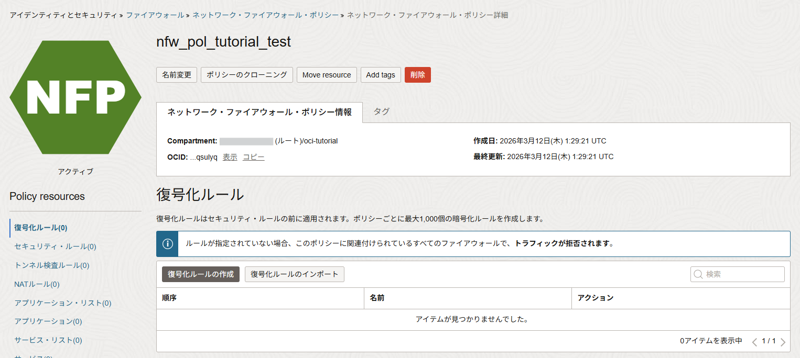

<br>

## 1-1. サービス・リストの作成
まず、アクセスを許可するポート番号を「サービス」として作成し、「サービス・リスト」に追加します。  
作成したポリシーの詳細画面左下のポリシー・リソースから「サービス・リスト」を選択し、「サービス・リストの作成」ボタンをクリックします。

「サービス・リストの作成」画面にて、任意のサービス・リスト名（例: http-https-access）を入力し、その後「サービスの作成」ボタンをクリックします。  
「サービスの作成」画面では以下の項目を入力し、「サービスの作成と選択」を選択します。  

+ **`名前`** - http
+ **`プロトコル`** - TCP
+ **`ポート範囲`** - 80-80

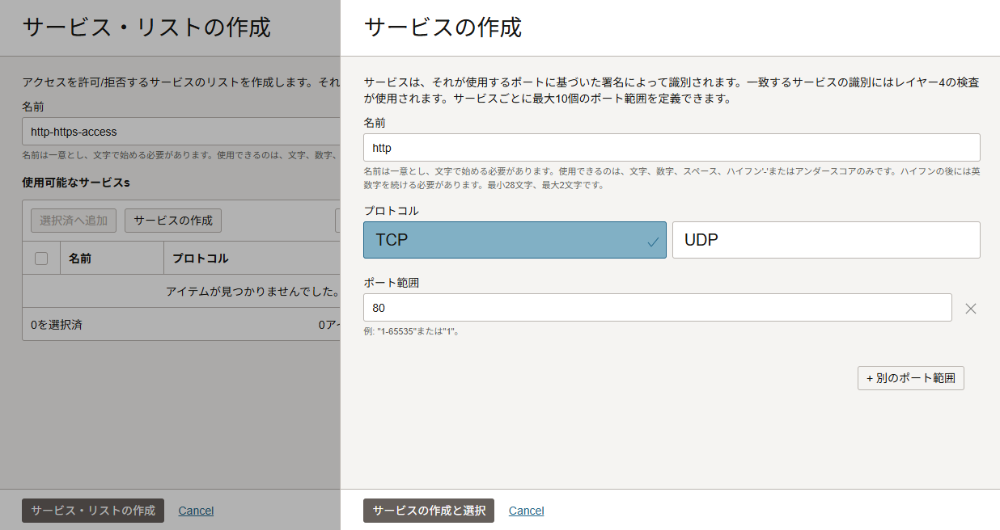

同様に、以下 https の 443ポートをサービスとして、サービス・リストに追加します。

+ **`名前`** - https
+ **`プロトコル`** - TCP
+ **`ポート範囲`** - 443-443

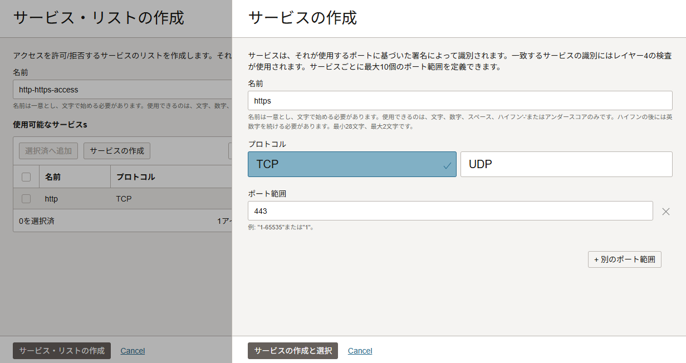

作成した `http` と `https` のサービスが「選択したサービス」として追加されていることを確認します。  
※ 自動で追加されていない場合は、サービスを選択したのち「選択済へ追加」ボタンをクリックすることで追加します。  

その後、「サービス・リストの作成」ボタンをクリックします。

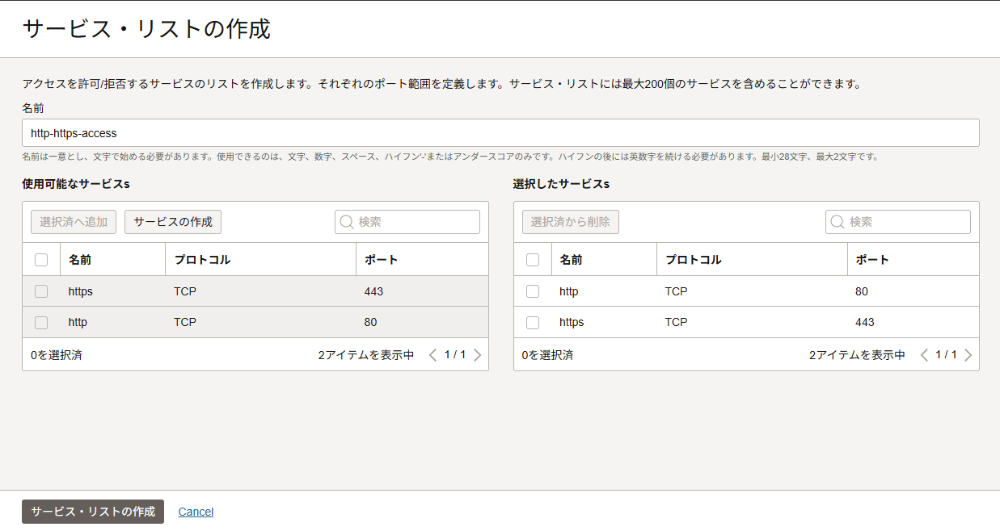

同じ手順で、ssh アクセスに使用するポート 22番と、リモートデスクトップ接続に使用するポート 3389番をサービスとして作成し、それぞれ新しいサービス・リストとして作成します。

+ **`サービス・リスト名`** - ssh-access
+ **`サービス名`** - ssh
+ **`プロトコル`** - TCP
+ **`ポート範囲`** - 22

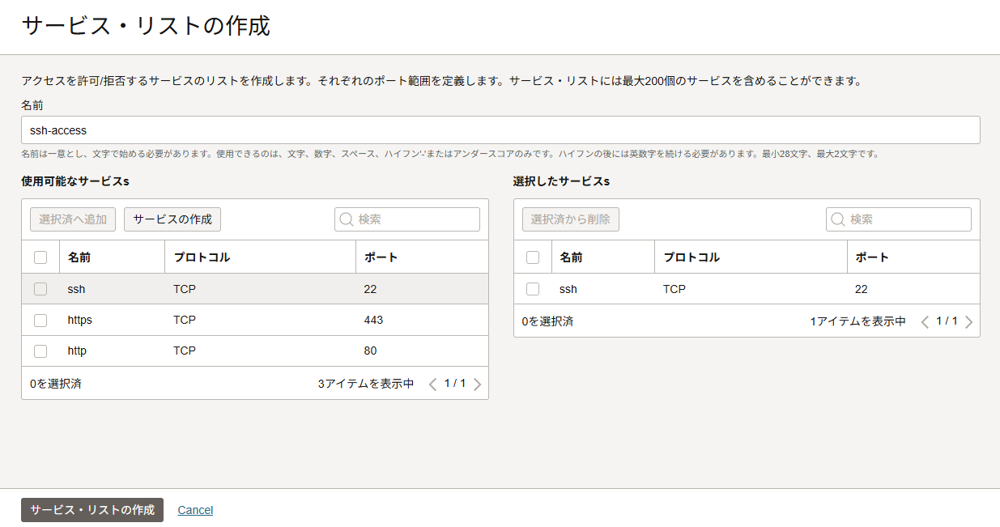

+ **`サービス・リスト名`** - rdp-access
+ **`サービス名`** - rdp
+ **`プロトコル`** - TCP
+ **`ポート範囲`** - 3389

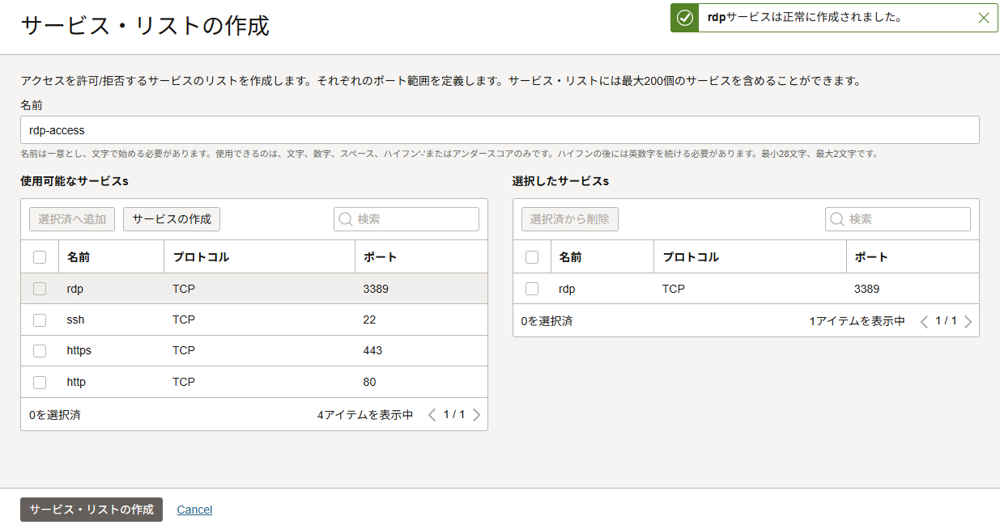

以上の手順でサービス・リストの作成は完了です。

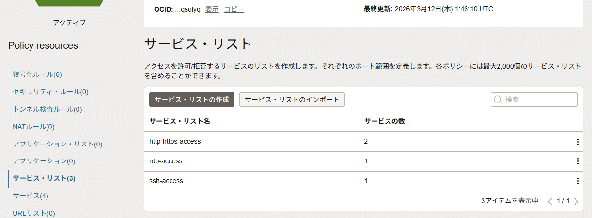

<br>

## 1-2. URLリストの作成
続いて、アクセスを許可する URLリストと、アクセスを拒否する URLリストを作成します。  
ポリシー詳細画面左下のポリシー・リソース欄より「URLリスト」を選択し、「URLリストの作成」ボタンをクリックします。  
表示された「URLリストの作成」画面にて以下を入力し、アクセスを許可するURLリストを追加します。

本チュートリアルでは Oracle と Google のドメインを許可リストに追加します。
+ **`名前`** - allow-urls
+ **`プロトコル`** - 以下をペースト

```
oracle.com
*.oracle.com/
google.com
*.google.com/
```

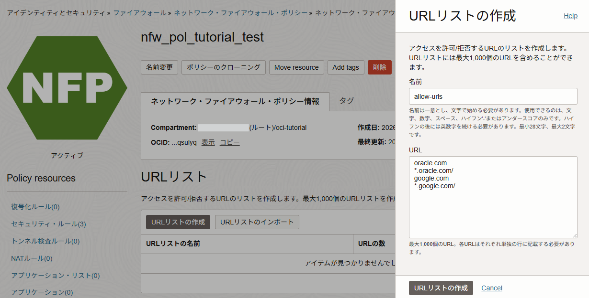

同じ手順でアクセスを拒否するURLリストも作成します。  
本チュートリアルでは Facebook と Yahoo! Japan のドメインを拒否リストに追加します。
+ **`名前`** - deny-urls
+ **`プロトコル`** - 以下をペースト

```
facebook.com
*.facebook.com/
yahoo.co.jp
*.yahoo.co.jp/
```


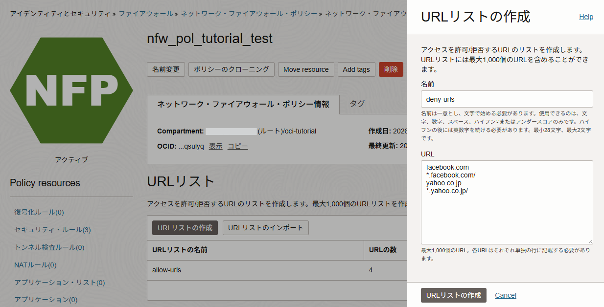

以上の手順でURLリストの作成は完了です。

<br>

## 1-3. セキュリティ・ルールの作成
ここまでで「サービス・リスト」と「URLリスト」を作成しましたが、この設定に該当するルールを許可または拒否するためのルール「セキュリティ・ルール」を作成する必要があります。  
ここでは、先ほど作成した「サービス・リスト」「URLリスト」を使用し、以下5つのルールを作成します。

1. 指定したURLリストへのインターネット経由のアクセスを許可するルール
2. 指定したURLリストへのインターネット経由のアクセスを拒否するルール
3. SSHアクセスを許可するルール
4. リモート・デスクトップ接続を許可するルール  
5. IPS（不正侵入防止）を行うルール

まずは、「1. 指定したURLリストへのインターネット経由のアクセスを許可するルール」を作成します。  
ポリシー詳細画面左下のポリシー・リソース欄から「セキュリティ・ルール」を選択し、「セキュリティ・ルールの作成」ボタンをクリックします。

セキュリティ・ルールの作成画面にてセキュリティ・ルール名（例：urls-allow-rule）を入力します。  

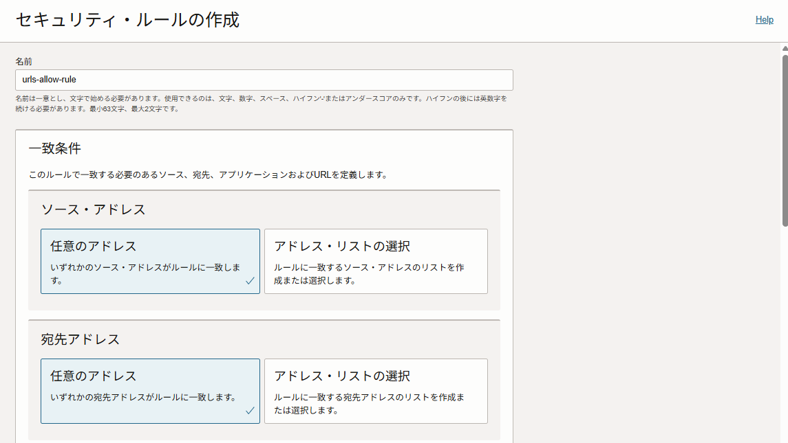

一致条件の項目にて、「ソースIPアドレス」、「宛先IPアドレス」、「アプリケーション」はすべて「任意」を選択します。  
「サービス」では「サービス・リストの選択」を選択し、「サービス・リストの選択」ボタンをもう一度クリックします。

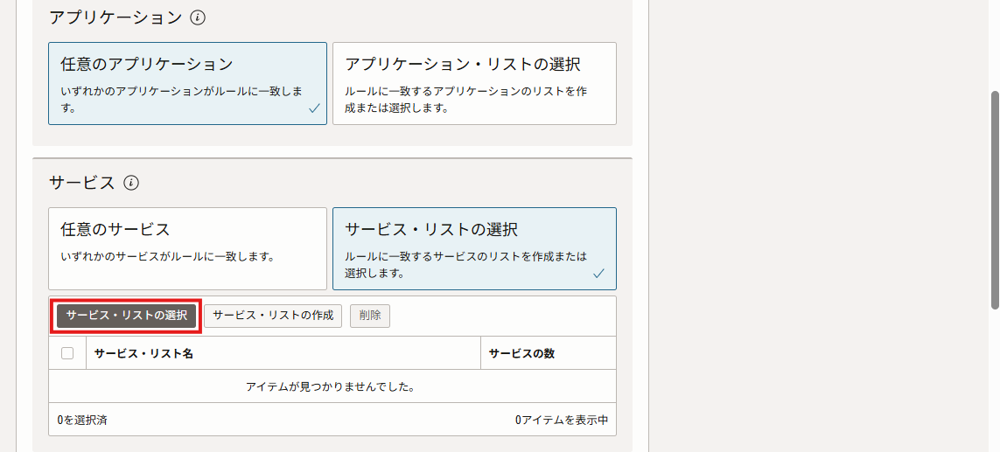

「サービス・リストの選択」画面にて、手順1-1 で作成したポート80,443番を追加したサービス・リスト（http-https-access）にチェックをいれ、「選択済へ追加」ボタンをクリックします。  
選択されたサービス・リスト欄に表示されていることを確認したら、画面下の「選択したサービス・リストの追加」ボタンをクリックします。

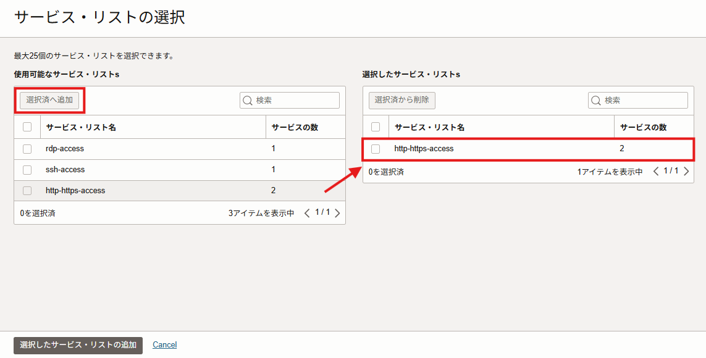

続いて、アクセスを許可するURLを指定します。  
URL項目にて、「URLリストの選択」を選択し、「URLリストの選択」ボタンをクリックします。

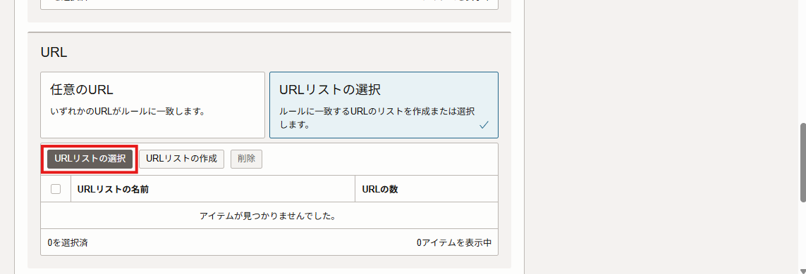

URLリストの選択画面にて、アクセスを許可するURLを追加したリストをチェックし、「選択済へ追加」ボタンをクリックします。  
選択されたURLリスト欄に表示されていることを確認したら、画面下の「選択したURLリストの追加」ボタンをクリックします。

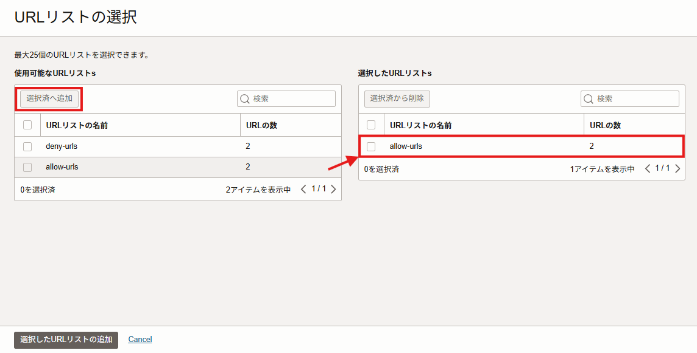

続いて、セキュリティ・ルールの作成画面の「ルール・アクション」の項目にて「トラフィックの許可」を選択し、「セキュリティ・ルールの作成」ボタンをクリックします。

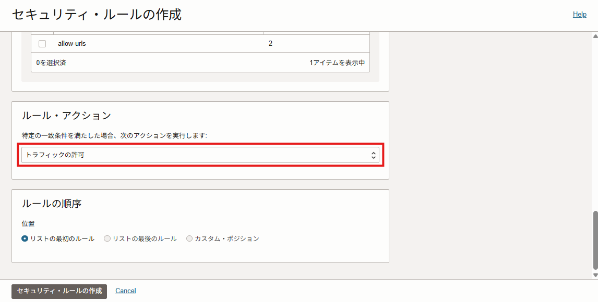

以上で、指定したURLへのインターネットを経由したアクセスを許可するルールを作成する手順は完了です。  

続いて、「2. 指定したURLリストへのインターネット経由のアクセスを拒否するルール」を作成します。

先程と同様にセキュリティ・ルールの作成」ボタンをクリックし、セキュリティ・ルールの作成画面にてセキュリティ・ルール名（例：urls-deny-rule）を入力します。  

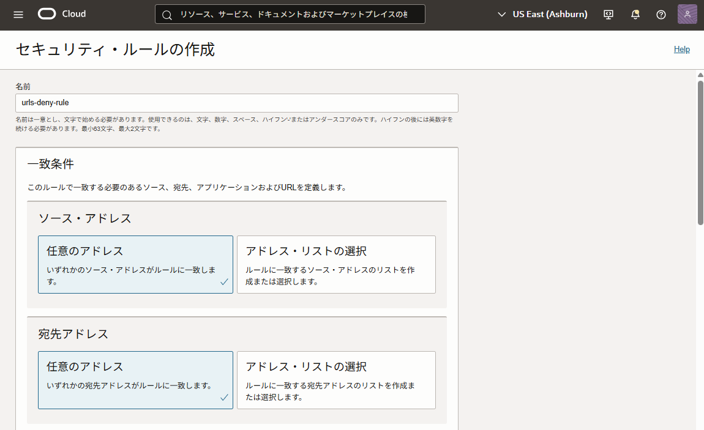

「サービス」にて「サービス・リストの選択」を選択し、「サービス・リストの選択」ボタンをクリックします。  
「サービス・リストの選択」画面にて、手順1-1で作成したポート80,443番を追加したサービス・リスト（http-https-access）にチェックをいれ、「選択済へ追加」ボタンをクリックします。  
選択されたサービス・リスト欄に表示されていることを確認し、画面下の「選択したサービス・リストの追加」ボタンをクリックします。

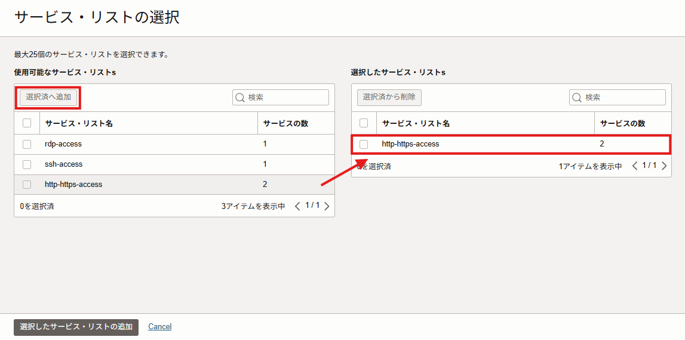

続いて、アクセスを拒否するURLを指定します。  
URLの項目にて、「URLリストの選択」を選択し、「URLリストの選択」ボタンをクリックします。

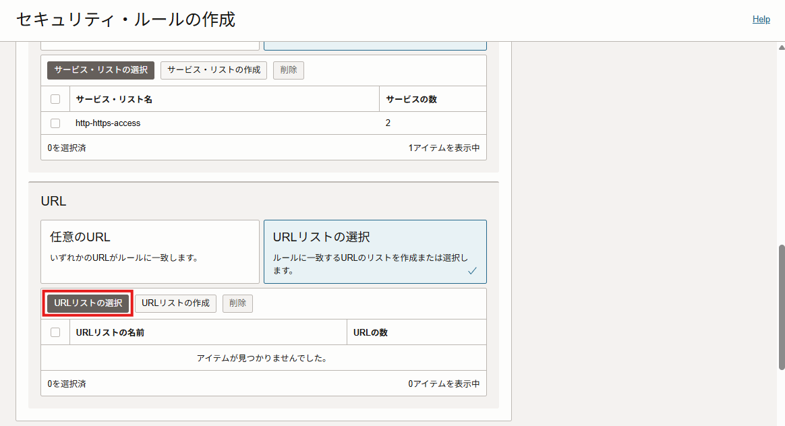

URLリストの選択画面にて、アクセスを拒否するURLを追加したリスト（deny-urls）をチェックし、「選択済へ追加」ボタンをクリックします。
選択されたURLリスト欄に表示されていることを確認したのち、画面下の「選択したURLリストの追加」ボタンをクリックします。

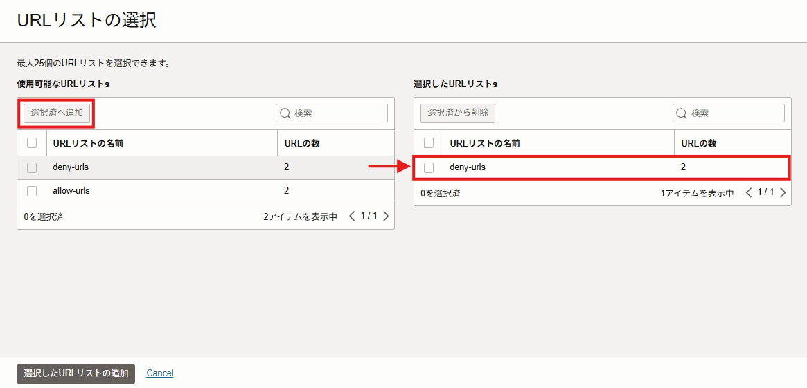

続いて、セキュリティ・ルールの作成画面の「ルール・アクション」の項目にて「トラフィックの拒否」を選択し、「セキュリティ・ルールの作成」ボタンをクリックします。

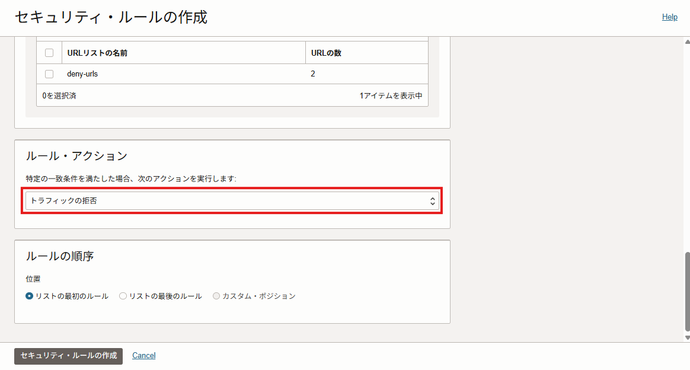

以上で、指定したURLへのインターネットを経由したアクセスを拒否するルールを作成する手順は完了です。  

続いて、「3. SSHアクセスを許可するルール」を作成します。  

「セキュリティ・ルールの作成」ボタンをクリックし、セキュリティ・ルールの作成画面にてセキュリティ・ルール名（例：ssh-allow）を入力します。  

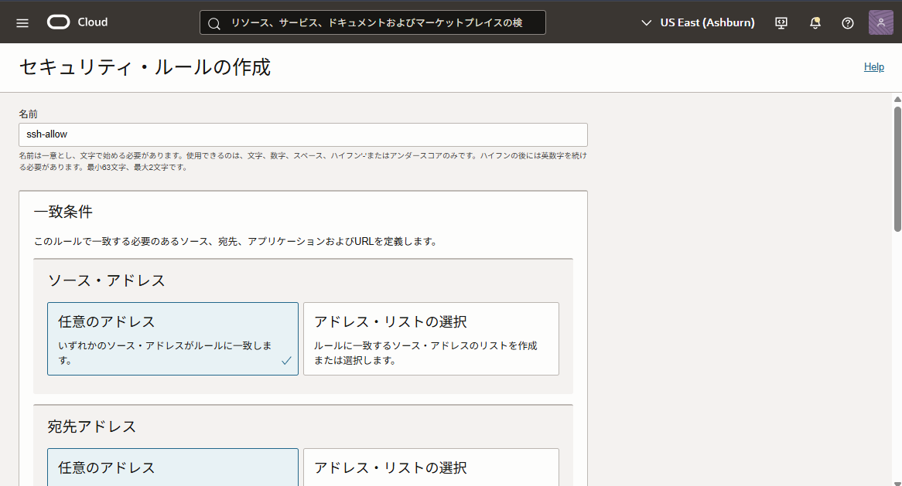

一致条件の項目にて、「ソースアドレス」、「宛先アドレス」、「アプリケーション」、「URL」はすべて「任意」を選択します。  
「サービス」にて「サービス・リストの選択」を選択し、「サービス・リストの選択」ボタンをクリックします。  

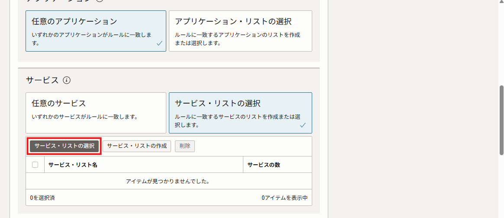

「サービス・リストの選択」画面にて、手順1-1で作成したポート22番を追加したサービス・リスト（ssh-access）にチェックをいれ、「選択済へ追加」ボタンをクリックします。  
選択されたサービス・リストの欄に表示されていることを確認したのち、画面下の「選択したサービス・リストの追加」ボタンをクリックします。

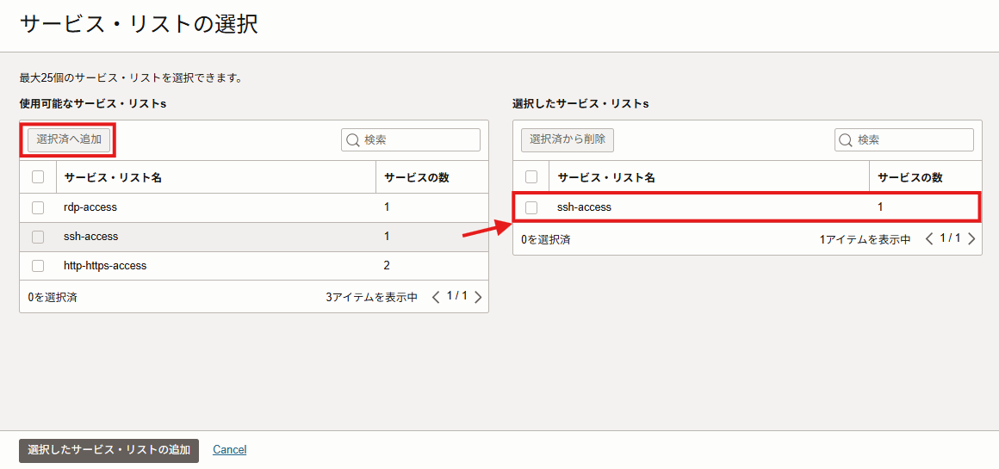

最後に「ルール・アクション」の項目にて「トラフィックの許可」を選択し、「セキュリティ・ルールの作成」ボタンをクリックします。

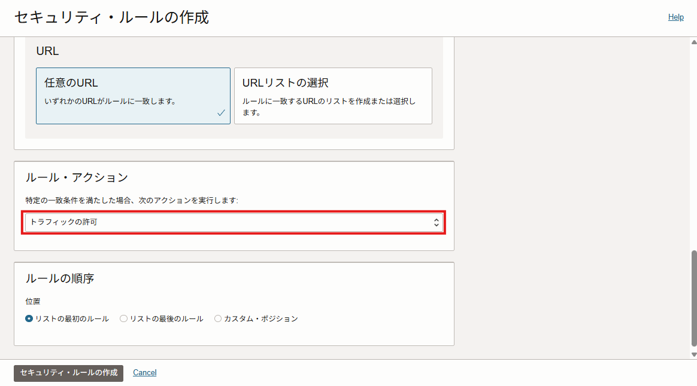

以上の手順で、SSHアクセスを許可するルールを作成する手順は完了です。  

次に「4. リモート・デスクトップ接続を許可するルール」を作成します。  

いままでと同様に「セキュリティ・ルールの作成」ボタンよりセキュリティ・ルールの作成画面に遷移し、セキュリティ・ルール名（例：rdp-allow）を入力します。  

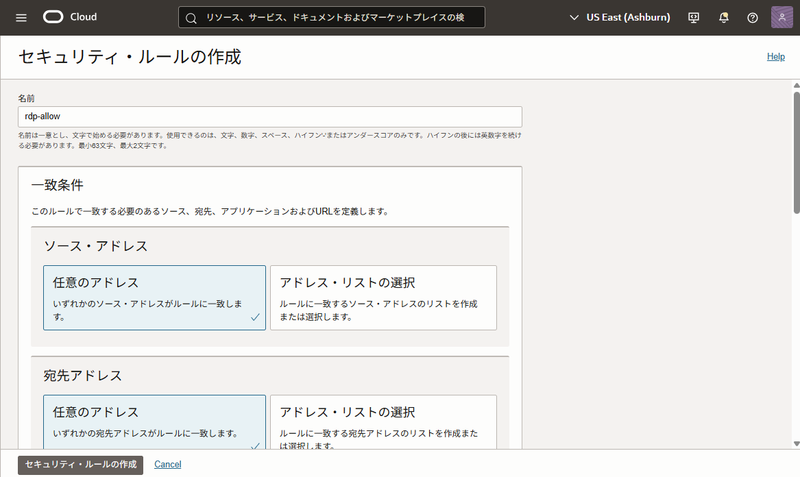

一致条件の項目にて、「ソースアドレス」、「宛先アドレス」、「アプリケーション」、「URL」はすべて「任意」を選択します。  
サービス項目では、「サービス・リストの選択」をクリックし、手順1-1で作成したポート3389番を追加したサービス・リスト（rdp-access）にチェックをいれ、「選択済へ追加」ボタンをクリックします。  
選択されたサービス・リストの欄に表示されていることを確認のち、画面下の「選択したサービス・リストの追加」ボタンをクリックします。

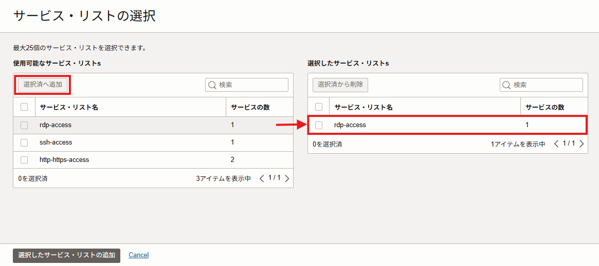

「ルール・アクション」の項目にて「トラフィックの許可」を選択し、「セキュリティ・ルールの作成」ボタンをクリックします。

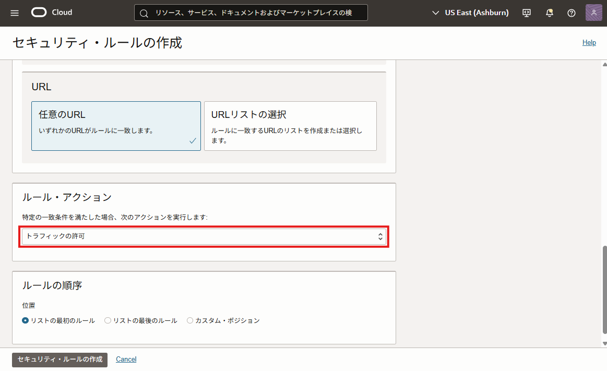

以上で、リモート・デスクトップ接続を許可するルールの作成は終了です。

最後に「5. IPS（不正侵入防止）を行うルール」を作成します。
「セキュリティ・ルールの作成」ボタンをクリックし、セキュリティ・ルールの作成画面にてセキュリティ・ルール名（例：ips-rule）を入力します。  

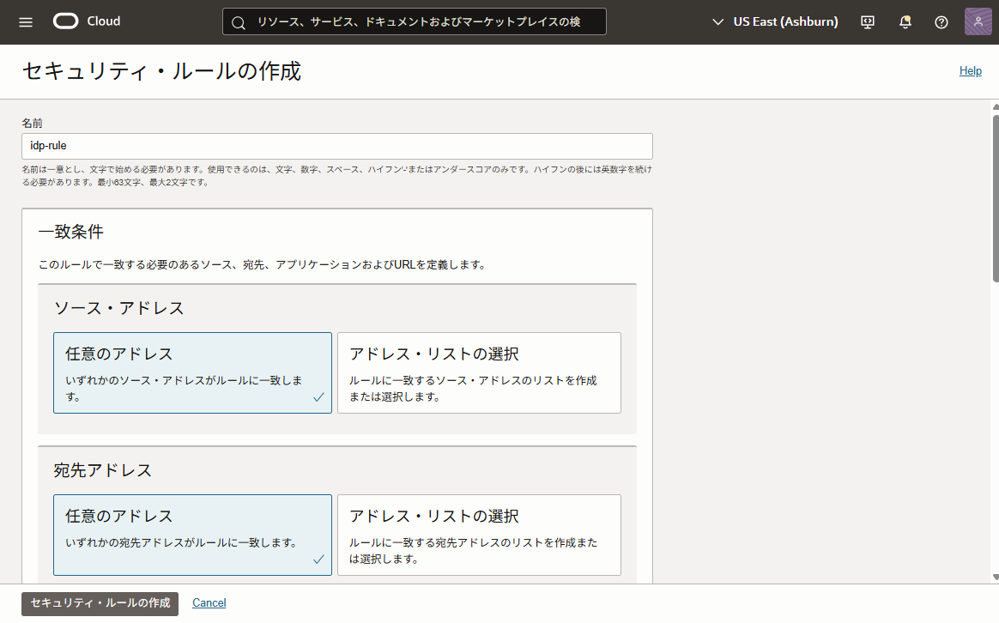

一致条件の項目はすべて「任意」、ルール・アクションに「侵入防止」を選択し、ルールの順序は「リストの最後のルール」を選択します。  
そして、「セキュリティ・ルールの作成」ボタンをクリックします。  

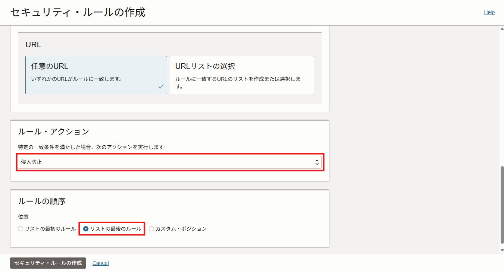

以上で、不正侵入を検知するルールの作成は終了です。  
ここまでで、作成したセキュリティ・ルールとその並び順は以下画像のようになります。

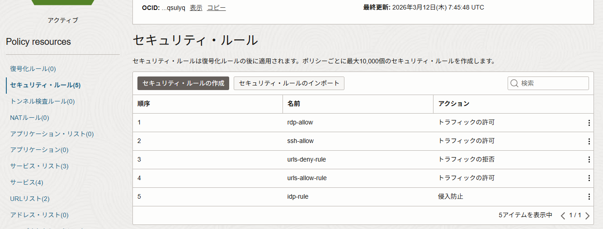

## 1-4. ファイアウォール・ポリシーの適用
作成したファイアウォール・ポリシーをファイアウォールインスタンスに適用させます。  
ファイアウォール詳細画面より「編集」ボタンをクリックし、設定した「ネットワーク・ファイアウォール・ポリシー」を選択、「更新」をクリックします。

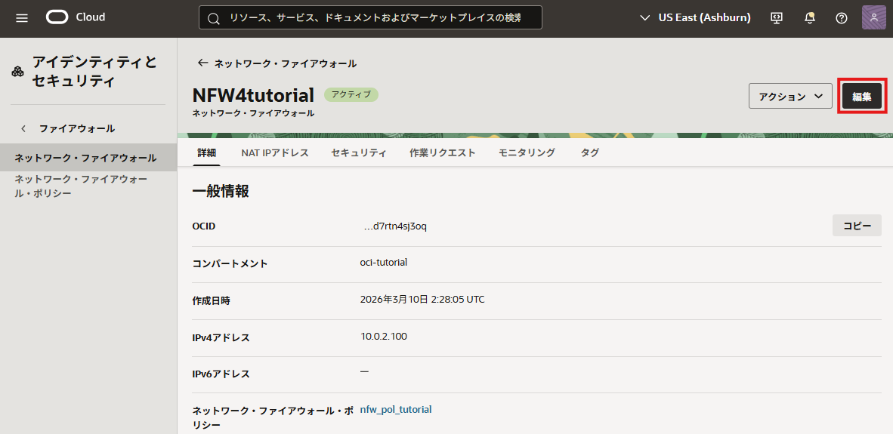

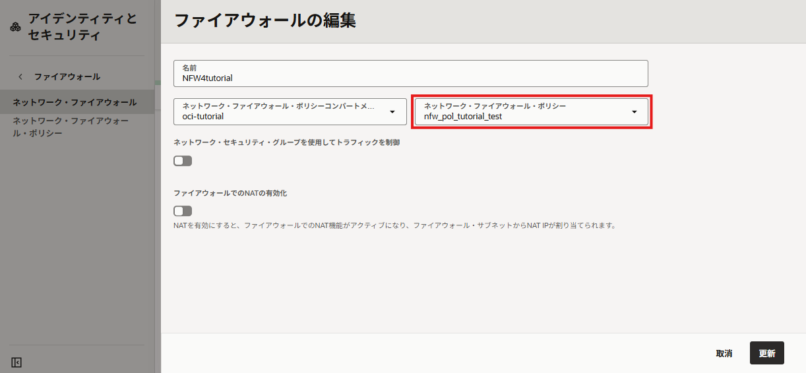

ポリシーの反映には10分程度かかる場合があります。

また、次の手順の確認のため、NFWサブネットのセキュリティ・リストで以下の通信が許可されていることを確認しておきます。
パフォーマンス向上のため、NFWサブネットのルールについては、ステートレスの設定を推奨しています。

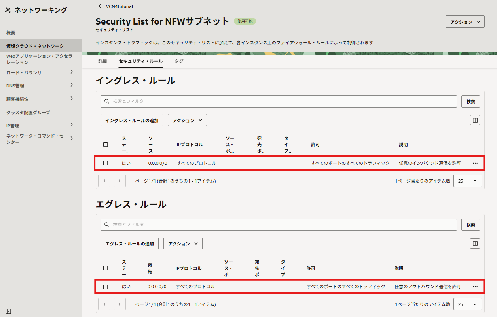

<br>

# 2. OCI からのアウトバウンド通信検査の動作確認
ここからは作成したポリシーNetwork Firewallの動作を確認します。  
使用するOCI内のインスタンスとして、Linux か Windows の両方で動作を確認します。

Linuxインスタンスの場合、[手順2-1](#2-1-curlコマンドで確認する場合) に従って動作を確認してください。Windowsインスタンスでも、Powershellを使用して同様に動作を確認することができます。  
Windowsインスタンスの場合は、[手順2-2](#2-2-windowsのブラウザから確認する場合) に従ってブラウザで動作を確認することも可能です。

## 2-1. curlコマンドで確認する場合
対象のインスタンスにSSHでアクセスし、インスタンスからインターネットにアクセスすることで、OCI Network Firewallの動作を確認します。

OCIコンソール画面左上の **メニューボタン → [コンピュート] → [インスタンス] → [対象のLinuxのコンピュート・インスタンス名]** をクリックし、コンピュート・インスタンスのパブリックIPアドレスを確認します。
OCIコンソール の CloudShell や Putty などのツールでコンピュート・インスタンスに opc ユーザーで SSH アクセスします。  

OCI Network Firewallの設定で、「`*.google.com`」と「`*.oracle.com`」へのアクセスを許可しているので、ターミナルを開き以下コマンドで各ドメインにアクセスできることを確認します。

```
curl -I https://www.oracle.com

curl -I https://www.google.com
```

```sh
# 実行例
[opc@websvr4tutorial ~]$ curl -I https://www.oracle.com
HTTP/2 200
content-type: text/html; charset=UTF-8
strict-transport-security: max-age=31536000; includeSubDomains
last-modified: Tue, 10 Mar 2026 16:25:13 GMT
...

[opc@websvr4tutorial ~]$ curl -I https://www.google.com
HTTP/2 200
content-type: text/html; charset=ISO-8859-1
content-security-policy-report-only: object-src 'none';base-uri 'self';script-src 'nonce-1O0mYWfNk4AuIjXLWM6Dyg' 'strict-dynamic' 'report-sample' 'unsafe-eval' 'unsafe-inline' https: http:;report-uri https://csp.withgoogle.com/csp/gws/other-hp
reporting-endpoints: default="//www.google.com/httpservice/retry/jserror?ei=AVKyacqSCpHa5NoPibrrgA4&cad=crash&error=Page%20Crash&jsel=1&bver=2395&dpf=mVBSZ1MX9_REhIbL6rTBSBAJlKgwJ_2vmeCwXy5NqWY"
...
```

一方、「`*.facebook.com`」と「`*.yahoo.co.jp`」へのアクセスは拒否するように設定しているため、以下コマンドで各ドメインへのアクセスに失敗することが確認できます。

```
curl -I https://www.facebook.com

curl -I https://www.yahoo.co.jp
```

```sh
# 実行例
[opc@websvr4tutorial ~]$ curl https://www.facebook.com
curl: (35) OpenSSL SSL_connect: Connection reset by peer in connection to www.facebook.com:443

[opc@websvr4tutorial ~]$ curl https://www.yahoo.co.jp
curl: (35) OpenSSL SSL_connect: Connection reset by peer in connection to www.yahoo.co.jp:443
```

また、ウイルステストファイルにアクセスし、アクセスがブロックされることを確認します。

```
curl http://files.trendmicro.com/products/eicar-file/eicar.com
```

```sh
# 実行例
[opc@websvr4tutorial ~]$ curl http://files.trendmicro.com/products/eicar-file/eicar.com
curl: (56) Recv failure: Connection reset by peer
```

<br>

## 2-2. Windowsのブラウザから確認する場合
OCIコンソール画面左上の **メニューボタン → [コンピュート] → [インスタンス] → 対象のWindowsのインスタンス名** をクリックし、インスタンスの詳細画面を表示します。  
インスタンス詳細画面右上の「インスタンス・アクセス」に記載のある「パブリックIPアドレス」、「ユーザー名」、「初期パスワード」を控えます。
ローカルPC（Windowsの場合）のアプリ「リモートデスクトップ接続」を開き、上記にて控えた情報で Windows インスタンスへアクセスします。  

表示されたログイン画面にて、ユーザー名と初期パスワードを入力します。初期アクセスの場合、初期パスワードのリセットを促す画面が表示されるので、パスワードをリセットし、Windowsサーバーにログインします。

続いてWindowsのブラウザ「Internet Explorer」を使用するために、ブラウザのセキュリティ機能を無効化します。
Windowsのホーム画面左下のメニューから「Server Manager」を選択します。

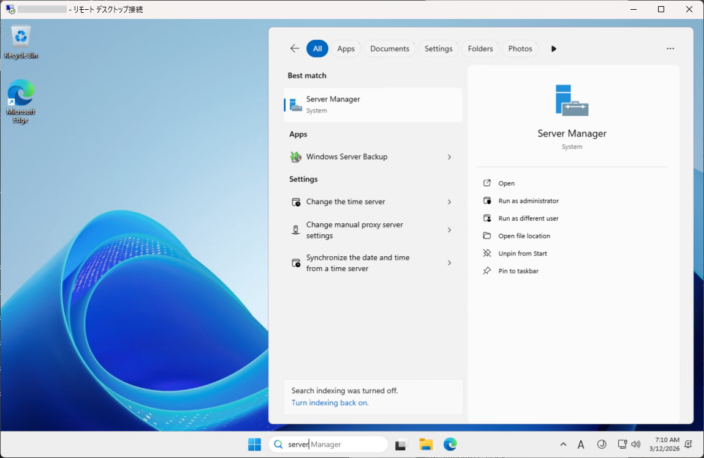

表示されたServer Manager左側のメニューから「Local Server」を選択し、「IE Enhanced Security Configuration」の "On" の部分をクリックします。

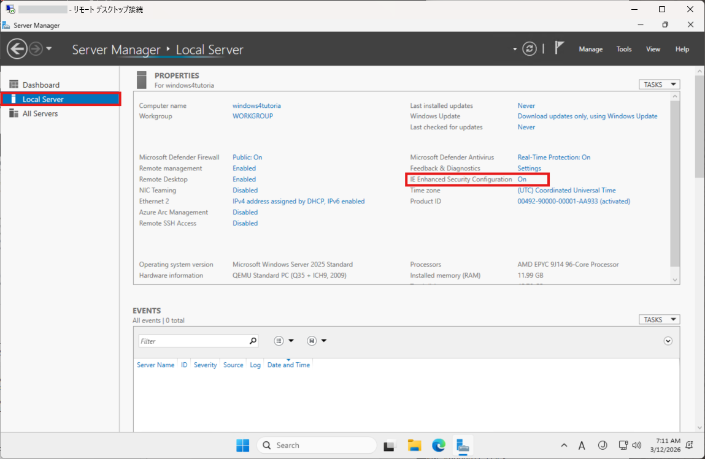

ポップアップ画面にて、Administrators と Users 各設定を "off" にし、「OK」ボタンをクリックします。

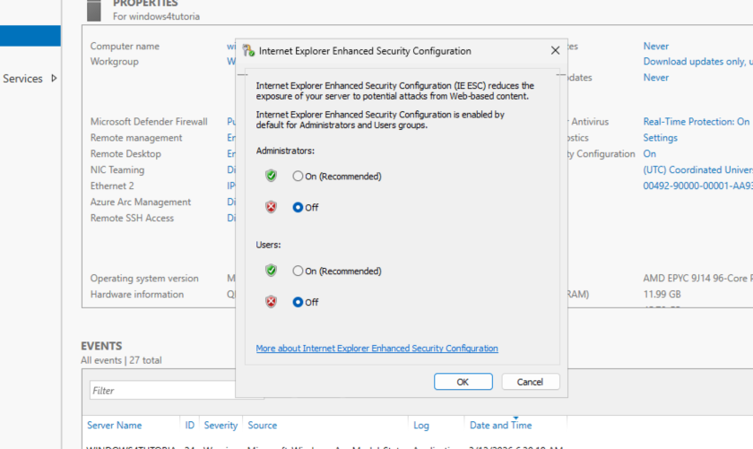

続いて、Windowsでブラウザ「Internet Explorer」を開き、googleのホームページにアクセスできることを確認します。

```
https://www.google.com
```

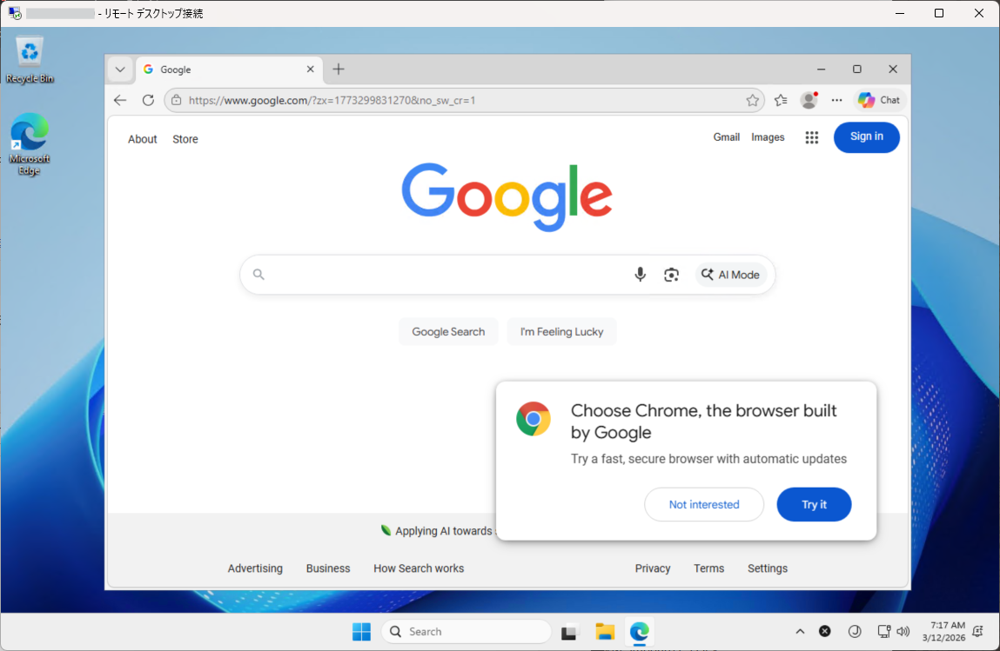

一方で、yahooのホームページにはアクセスができないことも確認できます。

```
https://www.yahoo.co.jp
```

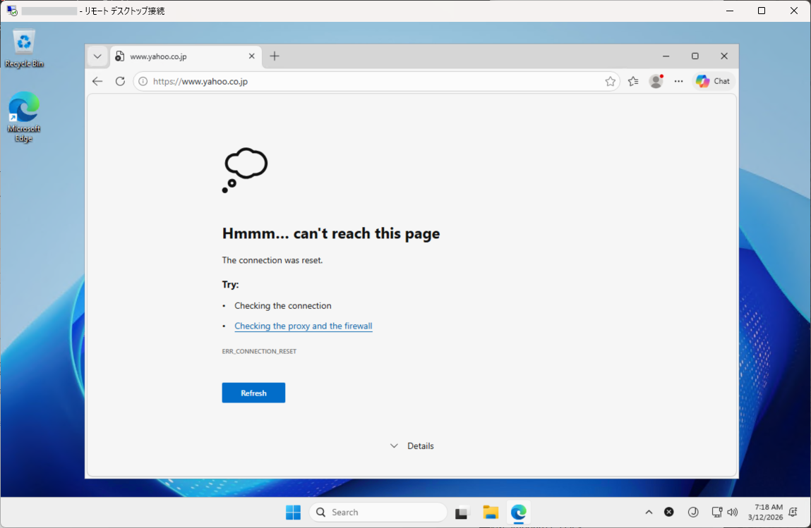

また、ウイルステストファイルにアクセスし、アクセスのブロックを確認することができます。

```
curl http://files.trendmicro.com/products/eicar-file/eicar.com
```


<br>

# 3. OCI へのインバウンド通信検査の動作確認
ここからは、OCI内に作成したコンピュートインスタンスに対して攻撃を行い、通信がブロックされるかを確認します。  
Network Firewall 詳細画面の「モニタリング」タブより、「Threat Log」を有効化することで検知した通信のログを見ることができますので、事前に有効化しておきます

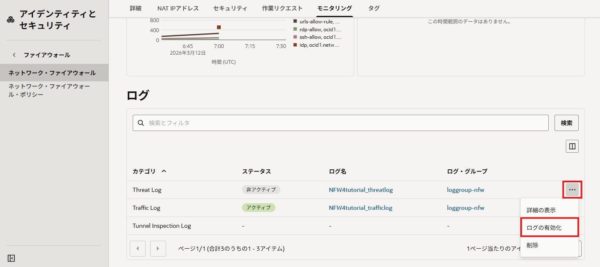

## 3-1. ポートスキャンを行う
ポートスキャンには Nmap を使用します。本チュートリアルでは、攻撃環境としてKali Linuxを使用しますが、WindowsやMacでも問題なく実行できます。  
Nmap のインストールについては、以下のリンクを参考にしてください。
+ [Download the Free Nmap Security Scanner for Linux/Mac/Windows](https://nmap.org/download)

以下のコマンドを実行します。

```
nmap -sV -Pn -v <コンピュートのパブリックIPアドレス>
```

以下は実行例です。結果より443、80、22、2000、5060番ポートが空いていることが分かります。
```sh
# 実行例
$ nmap -sV -Pn -v xxx.xxx.xxx
Starting Nmap 7.95 ( https://nmap.org ) at 2025-03-13 18:26 JST
NSE: Loaded 47 scripts for scanning.
Initiating Parallel DNS resolution of 1 host. at 18:26
Completed Parallel DNS resolution of 1 host. at 18:26, 0.04s elapsed
Initiating SYN Stealth Scan at 18:26
Scanning xxx.xxx.xxx [1000 ports]
Discovered open port 443/tcp on xxx.xxx.xxx
Discovered open port 80/tcp on xxx.xxx.xxx
Discovered open port 22/tcp on xxx.xxx.xxx
Discovered open port 2000/tcp on xxx.xxx.xxx
Discovered open port 5060/tcp on xxx.xxx.xxx
Completed SYN Stealth Scan at 18:26, 4.27s elapsed (1000 total ports)
Initiating Service scan at 18:26
Scanning 5 services on xxx.xxx.xxx
WARNING: Service xxx.xxx.xxx:443 had already soft-matched http-proxy, but now soft-matched rtsp; ignoring second value
Service scan Timing: About 80.00% done; ETC: 18:29 (0:00:39 remaining)
Completed Service scan at 18:29, 161.28s elapsed (5 services on 1 host)
NSE: Script scanning xxx.xxx.xxx.
Initiating NSE at 18:29
Completed NSE at 18:29, 0.28s elapsed
Initiating NSE at 18:29
Completed NSE at 18:29, 1.08s elapsed
Nmap scan report for xxx.xxx.xxx
Host is up (0.0050s latency).
Not shown: 994 filtered tcp ports (no-response)
PORT     STATE  SERVICE        VERSION
22/tcp   open   ssh            OpenSSH 8.0 (protocol 2.0)
80/tcp   open   http           Apache httpd 2.4.37 ((Oracle Linux Server))
113/tcp  closed ident
443/tcp  open   ssl/http-proxy (bad gateway)
2000/tcp open   cisco-sccp?
5060/tcp open   sip?

Read data files from: /usr/share/nmap
Service detection performed. Please report any incorrect results at https://nmap.org/submit/ .
Nmap done: 1 IP address (1 host up) scanned in 167.20 seconds
           Raw packets sent: 1994 (87.736KB) | Rcvd: 6 (260B)
```

ログを確認してみると、nmapツールによってスキャンが実行されたことを検知していることが確認できます。

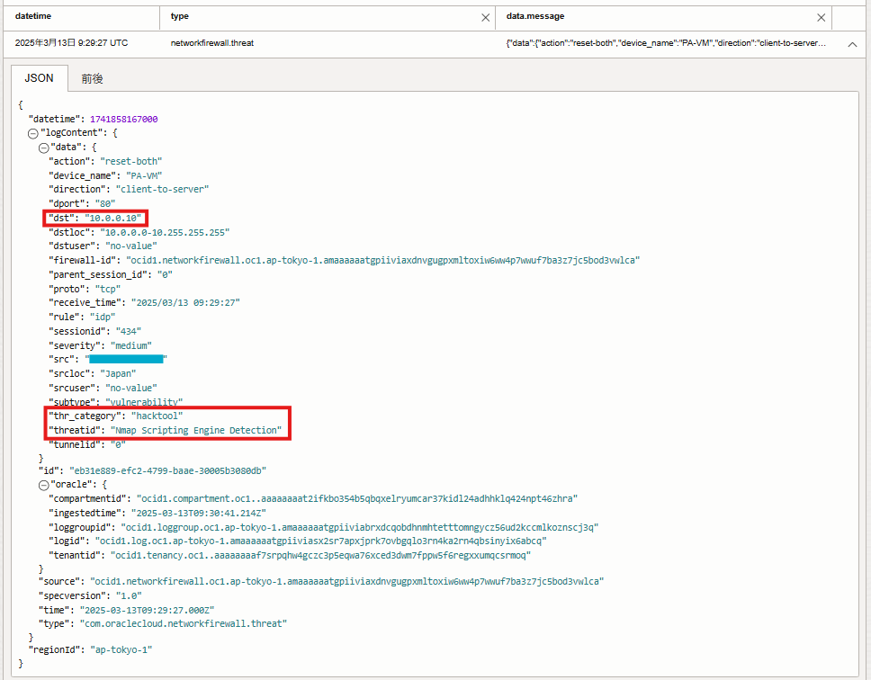


## 3-2. SQLインジェクションを行う
ここではcurlコマンドを使用します。ペイロードを検知させることが目的のため、ターゲットインスタンスにて入力フォームを準備する必要はありません。

```
curl -X POST http://<コンピュートのパブリックIPアドレス>/login \
    -d "username=admin' OR '1'='1" \
    -d "password=test" -v
```
```sh
# 実行例
$ curl -X POST http://xxx.xxx.xxx/login \
     -d "username=admin' OR '1'='1" \
     -d "password=test" -v
Note: Unnecessary use of -X or --request, POST is already inferred.
*   Trying xxx.xxx.xxx:80...
* Connected to xxx.xxx.xxx (xxx.xxx.xxx) port 80
* using HTTP/1.x
> POST /login HTTP/1.1
> Host: xxx.xxx.xxx
> User-Agent: curl/8.12.1
> Accept: */*
> Content-Length: 39
> Content-Type: application/x-www-form-urlencoded
>
* upload completely sent off: 39 bytes
* Recv failure: Connection reset by peer
* closing connection #0
curl: (56) Recv failure: Connection reset by peer
```
ログを確認してみると、SQLインジェクションを検知していることが確認できます。

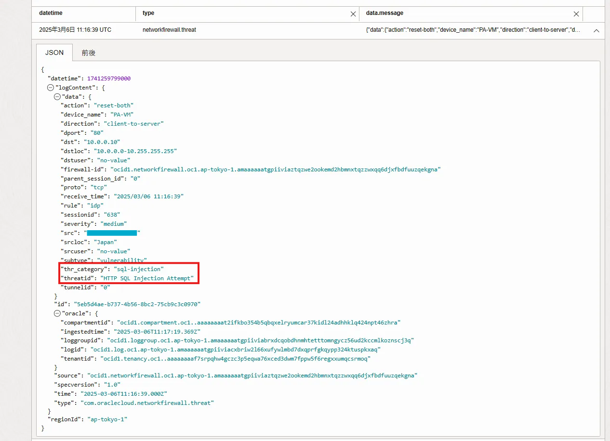

## 3-3. OSコマンドインジェクションを行う
最後にcurlコマンドを使用して、OSコマンドインジェクションを実行してみます。SQLインジェクションと同様、ペイロードを検知させることが目的のため、ターゲットインスタンスにてなにか別途準備を行う必要はありません。

```
curl "http://<コンピュートのパブリックIPアドレス>/?cmd=cat%20/etc/passwd" -v
```

```sh
# 実行例
$ curl "http://xxx.xxx.xxx/?cmd=cat%20/etc/passwd" -v
*   Trying xxx.xxx.xxx:80...
* Connected to xxx.xxx.xxx (xxx.xxx.xxx) port 80
* using HTTP/1.x
> GET /?cmd=cat%20/etc/passwd HTTP/1.1
> Host: xxx.xxx.xxx
> User-Agent: curl/8.12.1
> Accept: */*
>
* Request completely sent off
* Recv failure: Connection reset by peer
* closing connection #0
curl: (56) Recv failure: Connection reset by peer
```
こちらも検知していることがログから確認できます。

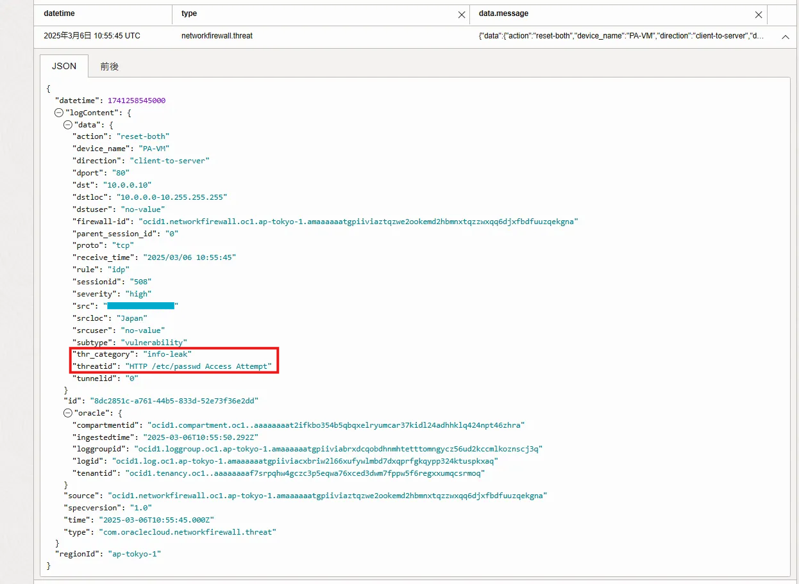

以上でネットワーク・ファイアウォールの動作確認は終了です。

# (補足) SSL/TLS復号機能について

本チュートリアルでは設定していませんが、クライアントとサーバー間の通信がSSLによって暗号化されている場合、本機能を利用することでHTTPSトラフィックを復号し、通信の内容を検査することができます。  
この設定は、ネットワーク・ファイアウォール・ポリシーの「マップされたシークレット」、「復号化プロファイル」にて証明書関連の設定を行うことが可能です。  

「マップされたシークレット」とは、OCI Vaultサービスで設定された証明書認証のことを指します。マップされたシークレットは「SSL転送プロキシ」または「SSLインバウンド検査」を使用してSSL/TLSトラフィックを復号、検査するために使用されます。「マップされたシークレット」を作成するには、OCI Vaultサービスでシークレット情報が作成されている必要があります。
証明書の設定については[ドキュメント](https://docs.oracle.com/ja-jp/iaas/Content/network-firewall/setting-up-certificate-authentication.htm#network-firewall-setting-up-certificate-authentication)を参照ください。

一方「復号化プロファイル」では、「SSL転送プロキシモード」または「SSLインバウンド検証モード」の2つのモードに関する設定を行うことができます。
「SSL転送プロキシモード」では、Network Firewallが内部クライアントとサーバーの仲介サーバーとなり、内部クライアントと外部サーバーそれぞれと通信をします。
「SSLインバウンド検査モード」では外からのインバウンド通信を復号し、内容を検査します。

「SSL転送プロキシモード」は内部ユーザーからNetwork Firewallを経由してインターネットへ出るSSL/TLSトラフィックを復号し、以下のような条件を検知しアクションを取ることが可能です。
+ 期限切れ証明書をブロック
+ 信頼されていない発行者をブロック
+ ブロック・タイムアウト証明書
+ サポートされていない暗号スイートをブロック
+ 証明書拡張の制限
+ 不明な証明書をブロック
+ 処理リソースがない場合はブロック

「SSLインバウンド検査モード」は登録されたサーバーの証明書、秘密鍵を使用して外部のクライアントからNetwork Firewallに保護されたサーバーへのインバウンドのSSL/TLS通信を復号し、以下の条件を検知してアクションを取ることが可能です。
+ サポートされていないSSLバージョンのセッションをブロック
+ サポートされていないSSL暗号スイートのセッションをブロック
+ 処理リソースがない場合はブロック

それぞれのモードを設定するチュートリアルもありますので、こちらもぜひご覧ください。

+ [OCI Network FirewallのSSLインスペクション（転送プロキシモード）を行う](/ocitutorials/security/networkfirewall-sslinspect-fwd/)
+ [OCI Network FirewallのSSLインスペクション（インバウンドモード）を行う](/ocitutorials/security/networkfirewall-sslinspect-inb/)