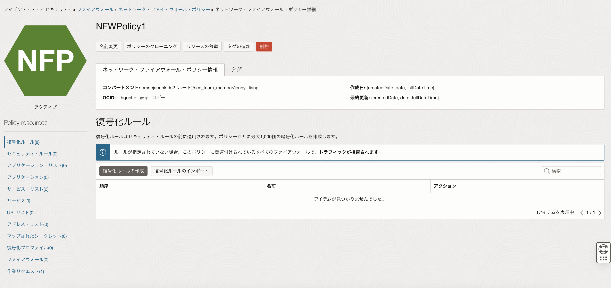
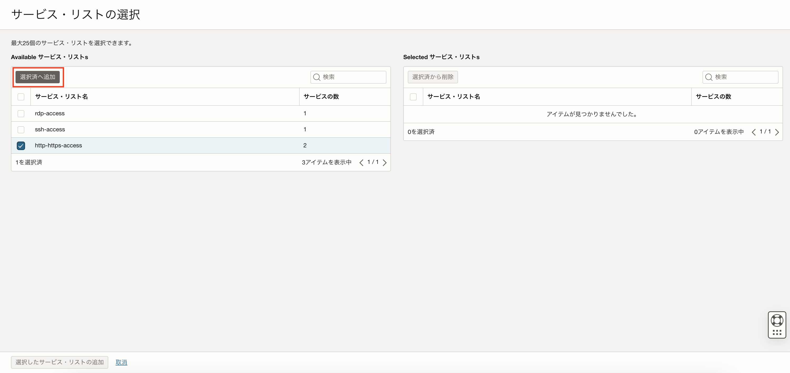
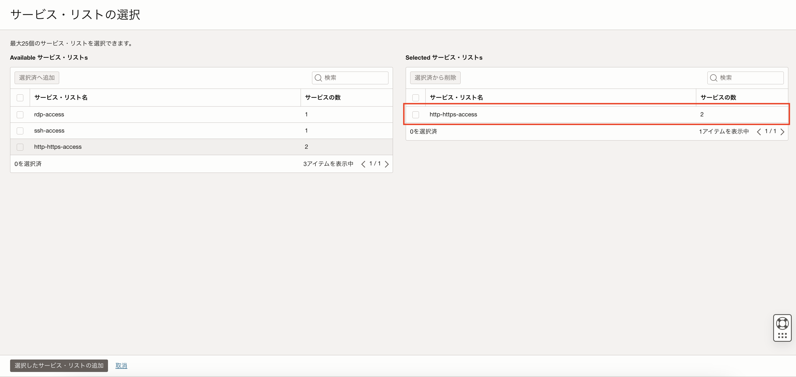
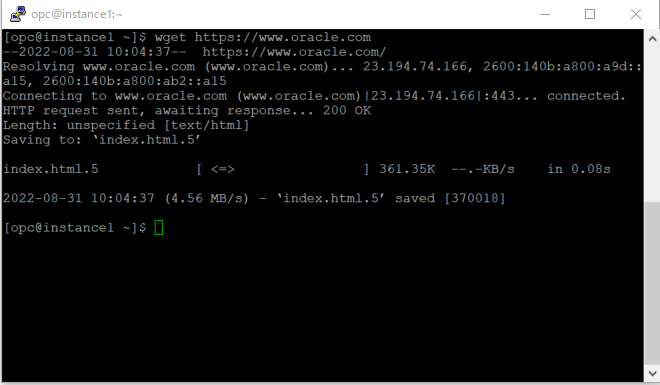
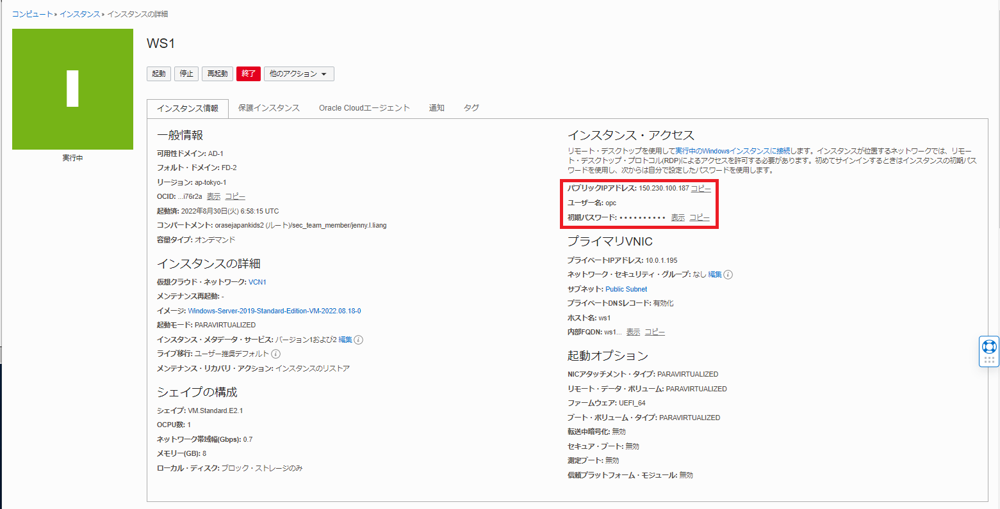
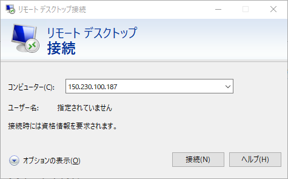
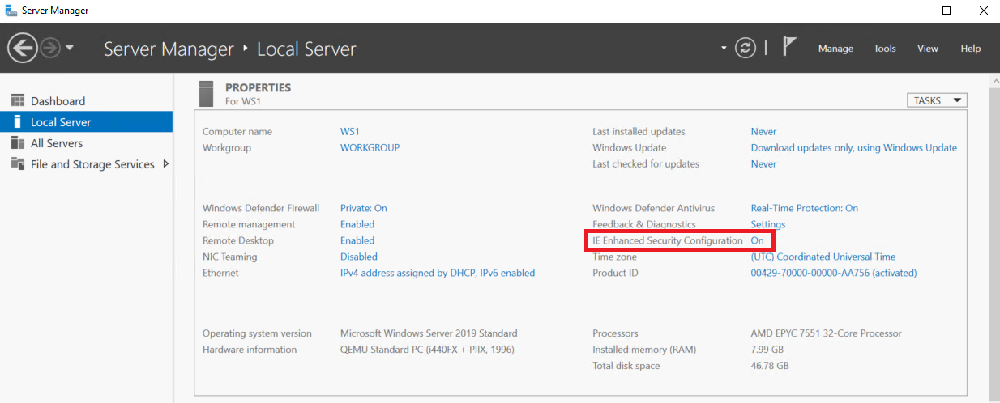
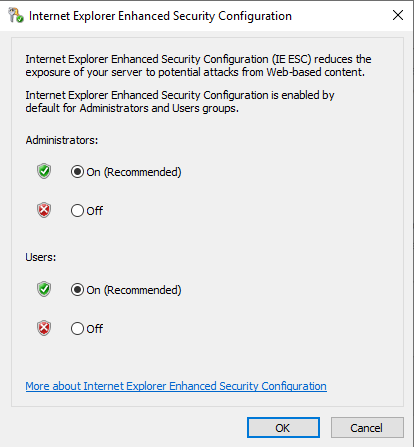
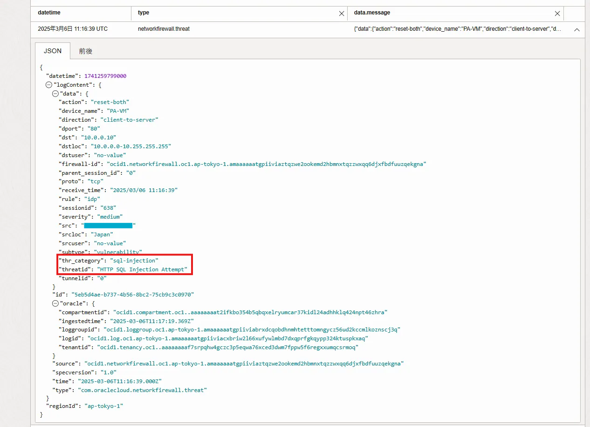

OCI Network FirewallはOracle Cloud Infrastructure (OCI) のクラウドネイティブなマネージド・ファイアウォールです。  
パロアルトネットワークスの次世代ファイアウォール技術を基に、IDPSを始めURLフィルタリングやTLS/SSL検査などの高度なセキュリティ機能を提供しています。


本チュートリアルでは、Network Firewallポリシーの設定方法と動作検証を行います。具体的には、以下の機能の設定を実施します。

+ パケットフィルタリング
+ URLフィルタリング
+ IDPS（侵入検知・防御システム）


また侵入検知のため、ポートスキャンや簡易的なインジェクション攻撃を行います。ご自身の管理下にないサーバーや、本番環境に対しては使用しないでください。ツールを使用したことによりトラブルや損失が発生した場合についても責任を負いかねます。

**所要時間 :** 
+ 約40分  

**前提条件 :**
+ ユーザーに必要なIAMポリシーが割り当てられていること。ポリシーの詳細は[ドキュメント](https://docs.oracle.com/ja-jp/iaas/Content/network-firewall/overview.htm#iam)を参照ください。
+ OCIチュートリアル「[OCI Network Firewallを構築する](/ocitutorials/security/networkfirewall-setup/)」にて、Network Firewallが動作できる環境が作成されていること。
(インバウンドおよびアウトバウンドへの通信を行います。そのため、インターネットからNetwork Firewallを経由してOCI内のインスタンスにアクセスできること、OCI内のインスタンスからNetwork Firewallを経由してインターネットへ出ていけることができれば大丈夫です)

**注意 :**
+ ※チュートリアル内の画面ショットについてはOracle Cloud Infrastructureの現在のコンソール画面と異なっている場合があります。


<br>

# ファイアウォール・ポリシーについて
Network Firewallではトラフィックの許可/拒否、検査の設定を「ファイアウォール・ポリシー」にて行います。  
各Network Firewallは必ず1つのファイアーウォール・ポリシーに紐づける必要がありますが、1つのファイアーウォール・ポリシーを複数のNetwork Firewallに紐づけることができます。

ポリシー内に該当ルールがない場合、トラフィックは拒否されるため、通信を行うには最低1つのルールの設定を行う必要があります。

## ポリシーの各項目ルール
以下、ポリシーにて設定することができるルールについてそれぞれ簡単に説明します。

### ・復号化ルール 
特定のソースや宛先に対するトラフィックを復号する設定を行います。  
復号を行う場合は、適用するための「**復号化プロファイル**」と「**マップされたシークレット**」を事前に設定する必要があります。

1つのポリシーに設定できる復号化ルールの最大数は1,000です。

### ・セキュリティ・ルール  
セキュリティ・ルールは、トラフィックの許可・ブロック、または脅威検知・防御を行うための設定です。  
ルールは、ソース・宛先アドレス、URLなどに基づいて適用され、以下のリストを利用して条件を定義します。
+ 「**アプリケーション・リスト**」：ICMPまたはICMPv6
+ 「**サービス・リスト**」：TCP/UDPおよびポート番号
+ 「**URLリスト**」：特定のURL
+ 「**アドレス・リスト**」：IPアドレスまたはCIDRブロック

1つのポリシーに設定できるセキュリティ・ルールの最大数は10,000です。


### ・トンネル検査ルール

トンネル検査ルールは、OCIの仮想テスト・アクセス・ポイント（VTAP）サービスを使用し、Oracleリソースにミラー化されたトラフィックを検査するための設定です。
Network Firewallをトンネル検査構成という形で利用する際に利用します。
こちらの構成については、OCIチュートリアル「[トンネル検査構成でOCI Network Firewallを構築する](https://oracle-japan.github.io/ocitutorials/security/networkfirewall-setup-tunnelinspection/)」も用意していますので、ご覧ください。

1つのポリシーに設定できるトンネル検査ルールの最大数は500です。

<br>

---

# 0. 設定と検証内容

本チュートリアルでは以下のアクセス制御を設定し、コンピュートインスタンスからのアクセスが適切に許可・拒否されることを確認します。

**許可するアクセス**
+ ポート番号：22（SSH）、3389（RDP）、443（HTTPS）
+ URL：「www.google.com」

**拒否するアクセス**
+ URL：「www.yahoo.co.jp」「www.facebook.com」

**IDPSの動作検証**
+ ポートスキャン、SQLインジェクション、OSコマンドインジェクションを検知し、それぞれにて発生するログを確認します。

<br>

# 1. ファイアウォール・ポリシーの設定
すでにファイアウォールにアタッチされたポリシーでは設定の変更ができないため、ポリシーを新しく作成した後に既存のポリシーと入れ替える形で適用します。

OCIコンソール画面左上のメニューボタン → [アイデンティティとセキュリティ] → [ファイアウォール] → [ネットワーク・ファイアウォール・ポリシー] をクリックし、作成したポリシーを選択します。
表示されたポリシーの作成画面にて任意のポリシー名を入力し、「ポリシーの作成」ボタンをクリックします。
※例）「NFWPolicy1」


ポリシーを選択すると、ポリシーの詳細画面が表示されます。



<br>

## 1-1. サービス・リストの作成
アクセスを許可するポート番号を「サービス」として作成し、「サービス・リスト」に追加します。  
作成したポリシーの詳細画面左下のポリシー・リソースから「サービス・リスト」を選択し、「サービス・リストの作成」ボタンをクリックします。
 


  
「サービス・リストの作成」画面にて、任意のサービス・リスト名を入力します。  
※例）「http-https-access」  

サービス・リスト名を入力したら、「サービスの作成」ボタンをクリックします。  
 


「サービスの作成」画面にて、以下を入力し、「Create and select service」を選択します。  
+ **`名前`** - http
+ **`プロトコル`** - TCP
+ **`ポート範囲`** - 80-80
 


同じように、以下httpsの443ポートをサービスとして、サービス・リストに追加します。
+ **`名前`** - https
+ **`プロトコル`** - TCP
+ **`ポート範囲`** - 443-443
 


httpとhttpsのサービスのボックスにチェックを入れ、「選択済へ追加」ボタンをクリックします。  
サービス・リストにサービスを追加したら画面下の「サービス・リストの作成」ボタンをクリックします。
 


同じ手順でsshアクセスに使用するポート22番とリモートデスクトップ接続に使用するポート3389番をサービスとして作成し、それぞれをサービス・リストに追加します。
+ **`サービス・リスト名`** - ssh-access
+ **`サービス名`** - ssh
+ **`プロトコル`** - TCP
+ **`ポート範囲`** - 22


+ **`サービス・リスト名`** - rdp-access
+ **`サービス名`** - rdp
+ **`プロトコル`** - TCP
+ **`ポート範囲`** - 3389-3389


以上の手順でサービス・リストの作成は完了です。


<br>

## 1-2. URLリストの作成
続いて、アクセスを許可するURLのリストと、アクセスを拒否するURLのリストを作成します。  
ポリシー詳細画面左下のポリシー・リソースから「URLリスト」を選択し、「URLリストの作成」ボタンをクリックします。  
表示された「URLリストの作成」画面にて以下を入力し、アクセスを許可するURLリストを追加します。


  
本チュートリアルでは検証としてOracleとGoogleのドメインを許可リストに追加します。
+ **`名前`** - allow-urls
+ **`プロトコル`** - *.oracle.com, *.google.com

URLを追加したら、画面下の「URLリストの作成」ボタンをクリックします。


同じ手順でアクセスを拒否するURLリストも作成します。  
本チュートリアルでは検証として、FacebookとYahoo! Japanのドメインを拒否リストに追加します。
+ **`名前`** - deny-urls
+ **`プロトコル`** - *.facebook.com, *.yahoo.co.jp
 


以上の手順でURLリストの作成は完了です。

<br>

## 1-3. セキュリティ・ルールの作成
セキュリティ・ルールでは、先ほど作成した「サービス・リスト」「URLリスト」を使用し、以下5つのルールを作成します。
+ 指定したURLリストへのインターネット経由のアクセスを許可するルール
+ 指定したURLリストへのインターネット経由のアクセスを拒否するルール
+ SSHアクセスを許可するルール
+ リモート・デスクトップ接続を許可するルール  
+ IPS（不正侵入防止）を行うルール

まずは指定したURLへのインターネットを経由したアクセスを許可ルールを作成します。  
ポリシー詳細画面左下のポリシー・リソースから「セキュリティ・ルール」を選択し、「セキュリティ・ルールの作成」ボタンをクリックします。


セキュリティ・ルールの作成画面にてセキュリティ・ルール名を入力します。  
例）urls-allow-rule
 


一致条件の項目にて、「ソースIPアドレス」、「宛先IPアドレス」、「アプリケーション」はすべて「任意」を選択します。  
「サービス」にて「サービス・リストの選択」をクリックし、「サービス・リストの選択」ボタンをもう一度クリックします。
 


「サービス・リストの選択」画面にて、手順1-1で作成したポート80,443番を追加したサービス・リストにチェックをいれ、「選択済へ追加」ボタンをクリックします。
 


選択されたサービス・リストの欄に表示されていることを確認したら、画面下の「選択したサービス・リストの追加」ボタンをクリックします。
 


続いて、アクセスを許可するURLを指定します。  
URLsの項目にて、「URLリストの選択」をクリックし、再度「URLリストの選択」ボタンをクリックします。
 


URLリストの選択画面にて、アクセスを許可するURLを追加したリストをチェックし、「選択済へ追加」ボタンをクリックします。
 


選択されたURLリストの欄に表示されていることを確認したら、画面下の「選択したURLリストの追加」ボタンをクリックします。
 


続いて、セキュリティ・ルールの作成画面の「ルール・アクション」の項目にて「トラフィックの許可」を選択し、「セキュリティ・ルールの作成」ボタンをクリックします。
 


以上で、指定したURLへのインターネットを経由したアクセスを許可するルールを作成する手順は完了です。  

続いて、指定したURLへのインターネットを経由したアクセスを拒否するルールを作成します。

「セキュリティ・ルールの作成」ボタンをクリックし、セキュリティ・ルールの作成画面にてセキュリティ・ルール名を入力します。  
例）urls-deny-rule
 


「サービス」にて「サービス・リストの選択」をクリックし、「サービス・リストの選択」ボタンをもう一度クリックします。
 


「サービス・リストの選択」画面にて、手順1-1で作成したポート80,443番を追加したサービス・リストにチェックをいれ、「選択済へ追加」ボタンをクリックします。
 


選択されたサービス・リストの欄に表示されていることを確認したら、画面下の「選択したサービス・リストの追加」ボタンをクリックします。
 


続いて、アクセスを拒否するURLを指定します。  
URLsの項目にて、「URLリストの選択」をクリックし、再度「URLリストの選択」ボタンをクリックします。
 


URLリストの選択画面にて、アクセスを拒否するURLを追加したリストをチェックし、「選択済へ追加」ボタンをクリックします。
 


選択されたURLリストの欄に表示されていることを確認したら、画面下の「選択したURLリストの追加」ボタンをクリックします。
 


続いて、セキュリティ・ルールの作成画面の「ルール・アクション」の項目にて「トラフィックの拒否」を選択し、「セキュリティ・ルールの作成」ボタンをクリックします。
 


以上で、指定したURLへのインターネットを経由したアクセスを拒否するルールを作成する手順は完了です。  

続いて、SSHアクセスを許可するルールを作成します。  

「セキュリティ・ルールの作成」ボタンをクリックし、セキュリティ・ルールの作成画面にてセキュリティ・ルール名を入力します。  
例）ssh-allow
 


一致条件の項目にて、「ソースアドレス」、「宛先アドレス」、「アプリケーション」、「URL」はすべて「任意」を選択します。  
「サービス」にて「サービス・リストの選択」をクリックし、「サービス・リストの選択」ボタンをもう一度クリックします。  
 


「サービス・リストの選択」画面にて、手順1-1で作成したポート22番を追加したサービス・リストにチェックをいれ、「選択済へ追加」ボタンをクリックします。
 


選択されたサービス・リストの欄に表示されていることを確認したら、画面下の「選択したサービス・リストの追加」ボタンをクリックします。
 


「ルール・アクション」の項目にて「トラフィックの許可」を選択し、「セキュリティ・ルールの作成」ボタンをクリックします。
 


以上の手順で、SSHアクセスを許可するルールを作成する手順は完了です。  

次にリモート・デスクトップ接続を許可するルールを作成します。  

「セキュリティ・ルールの作成」ボタンをクリックし、セキュリティ・ルールの作成画面にてセキュリティ・ルール名を入力します。  
例）rdp-allow
 
 

一致条件の項目にて、「ソースアドレス」、「宛先アドレス」、「アプリケーション」、「URL」はすべて「任意」を選択します。  
 


「サービス・リストの選択」画面にて、手順1-1で作成したポート3389番を追加したサービス・リストにチェックをいれ、「選択済へ追加」ボタンをクリックします。
 


選択されたサービス・リストの欄に表示されていることを確認したら、画面下の「選択したサービス・リストの追加」ボタンをクリックします。
 


「ルール・アクション」の項目にて「トラフィックの許可」を選択し、「セキュリティ・ルールの作成」ボタンをクリックします。
 


以上で、リモート・デスクトップ接続を許可するルールの作成は終了です。


最後にIPS（不正侵入防止）を行うルールを作成します。
「セキュリティ・ルールの作成」ボタンをクリックし、セキュリティ・ルールの作成画面にてセキュリティ・ルール名を入力します。  
例）idp

一致条件の項目はすべて「任意」、ルール・アクションに「侵入検知」を選択し、「セキュリティ・ルールの作成」ボタンをクリックします。  


以上で、不正侵入を検知するルールの作成は終了です。

## 1-4. ファイアウォール・ポリシーの適用
作成したファイアウォール・ポリシーをファイアウォールインスタンスに適用させます。  
ファイアウォール詳細画面より「編集」ボタンをクリックし、設定した「ネットワーク・ファイアウォール・ポリシー」を選択し、「設定の保存」をクリックします。


## （補足）SSLについて
本チュートリアルでは設定しませんが、ネットワーク・ファイアウォール・ポリシーの「マップされたシークレット」、「復号化プロファイル」にて証明書関連の設定を行うことが可能です。  
クライアントとサーバー間の通信がSSLによって暗号化されている場合、本機能を利用することでHTTPSトラフィックを復号し、通信の内容を検査することができます。

「マップされたシークレット」とは、OCI Vaultサービスで設定された証明書認証のことを指します。「マップされたシークレット」は「SSL転送プロキシ」または「SSLインバウンド検査」を使用してSSL/TLSトラフィックを復号、検査するために使用されます。「マップされたシークレット」を作成するには、OCI Vaultサービスでシークレット情報が作成されている必要があります。
証明書認証の設定については[ドキュメント](https://docs.oracle.com/ja-jp/iaas/Content/network-firewall/setting-up-certificate-authentication.htm#network-firewall-setting-up-certificate-authentication)を参照ください。


一方「復号化プロファイル」では、「SSL転送プロキシモード」または「SSLインバウンド検証モード」の2つのモードに関する設定を行うことができます。
「SSL転送プロキシモード」では、Network Firewallが内部クライアントとサーバーの仲介サーバーとなり、内部クライアントと外部サーバーそれぞれと通信をします。
「SSLインバウンド検査モード」では外からのインバウンド通信を復号し、内容を検査します。

「SSL転送プロキシモード」は内部ユーザーからNetwork Firewallを経由してインターネットへ出るSSL/TLSトラフィックを復号し、以下のような条件を検知しアクションを取ることが可能です。
+ 期限切れ証明書をブロック
+ 信頼されていない発行者をブロック
+ ブロック・タイムアウト証明書
+ サポートされていない暗号スイートをブロック
+ 証明書拡張の制限
+ 不明な証明書をブロック
+ 処理リソースがない場合はブロック

「SSLインバウンド検査モード」は登録されたサーバーの証明書、秘密鍵を使用して外部のクライアントからNetwork Firewallに保護されたサーバーへのインバウンドのSSL/TLS通信を復号し、以下の条件を検知してアクションを取ることが可能です。
+ サポートされていないSSLバージョンのセッションをブロック
+ サポートされていないSSL暗号スイートのセッションをブロック
+ 処理リソースがない場合はブロック

それぞれのモードを設定するチュートリアルもありますので、ぜひご覧ください。

+ [OCI Network FirewallのSSLインスペクション（転送プロキシモード）を行う](/ocitutorials/security/networkfirewall-sslinspect-fwd/)
+ [OCI Network FirewallのSSLインスペクション（インバウンドモード）を行う](/ocitutorials/security/networkfirewall-sslinspect-inb/)


<br>

# 2. OCI Network Firewall URLフィルタリングの動作確認

Network Firewallの動作を確認します。  
Linuxインスタンスの場合は手順2-1に従って動作を確認してください。Windowsインスタンスでも、Powershellを使用して同様に動作を確認することができます。  
Windowsのインスタンスの場合は、手順2-2に従ってブラウザで動作を確認することも可能です。


## 2-1. wgetコマンドで確認する場合
対象のインスタンスにSSHでアクセスし、OCI Network Firewallの動作を確認します。

OCIコンソール画面左上のメニューボタン → コンピュート → インスタンス → 対象のLinuxのコンピュート・インスタンス名をクリックし、コンピュート・インスタンスのパブリックIPアドレスを確認します。
OCIのシリアルコンソールやPuttyなどのツールでコンピュート・インスタンスにSSHアクセスします。  
※本チュートリアルではPuttyを使用してSSHアクセスを実施しています。

OCI Network Firewallの設定で、「\*.google.com」と「\*.oracle.com」へのアクセスを許可しているので、ターミナルを開き以下コマンドで各ドメインにアクセスできることを確認します。

```sh
$ wget https://www.oracle.com
```



```sh
$ wget https://www.google.com
```
 


OCI Network Firewallの設定で、「www.facebook.com」と「www.yahoo.co.jp」へのアクセスを拒否しているので、以下コマンドで各ドメインへのアクセスに失敗することが確認できます。

```sh
$ wget https://www.facebook.com
```
 


```sh
$ wget https://www.yahoo.co.jp
```
 


<br>


## 2-2. Windowsのブラウザから確認する場合
OCIコンソール画面左上のメニューボタン → [コンピュート] → [インスタンス] → 対象のWindowsのインスタンス名をクリックし、インスタンスの詳細画面を表示します。
インスタンス詳細画面右上の「インスタンス・アクセス」に記載のある「パブリックIPアドレス」、「ユーザー名」、「初期パスワード」を手元にメモします。
 



ローカルPC（Windowsの場合）のアプリ「リモートデスクトップ接続」を開き、手順6-2で作成したWindowsのインスタンスのパブリックIPアドレスを入力し、「接続」ボタンをクリックします。
 


「このリモートコンピューターのIDを識別できません。接続しますか？」というメッセージが表示された場合、「はい」を選択して続行します。
 


表示されたログイン画面にて、ユーザー名と初期パスワードを入力します。初期パスワードのリセットを促す画面が表示されるので、パスワードをリセットし、Windowsサーバーにログインします。

続いてWindowsのブラウザ「Internet Explorer」を使用するために、ブラウザのセキュリティ機能を無効化します。
Windowsのホーム画面左下のメニューから「Server Manager」を選択します。


表示されたServer Manager左側のメニューから「Local Server」を選択し、「IE Enhanced Security Configuration」の”On”の部分をクリックします。
 


ポップアップ画面にて、AdministratorsとUsers各設定を"off"にし、「OK」ボタンをクリックします。
 


続いて、Windowsでブラウザ「Internet Explorer」を開き、googleのホームページにアクセスできることを確認します。
```
https://www.google.com
```
 


一方で、yahooのホームページにはアクセスができないことも確認できます。
```
https://www.yahoo.co.jp
```
 


<br>

# 3. OCI Network Firewall IPSの動作確認
OCI内に作成したコンピュートインスタンスに対して攻撃を行い、通信がブロックされるかを確認します。  
Network Firewallの詳細画面より、「Threat Log」を有効化することで検知した通信のログを見ることができますので、事前に有効化しておいてください。


## 3-1. ポートスキャンを行う
ポートスキャンには Nmap を使用します。本チュートリアルでは、攻撃環境としてKali Linuxを使用しますが、WindowsやMacでも問題なく実行できます。  
Nmap のインストールについては、以下のリンクを参考にしてください。
+ [Download the Free Nmap Security Scanner for Linux/Mac/Windows](https://nmap.org/download)

以下のコマンドを実行します。

```sh
nmap -sV -Pn -v <コンピュートのパブリックIPアドレス>
```

以下は実行例です。結果より443、80、22、2000、5060番ポートが空いていることが分かります。
```sh
実行例）
$ nmap -sV -Pn -v xxx.xxx.xxx
Starting Nmap 7.95 ( https://nmap.org ) at 2025-03-13 18:26 JST
NSE: Loaded 47 scripts for scanning.
Initiating Parallel DNS resolution of 1 host. at 18:26
Completed Parallel DNS resolution of 1 host. at 18:26, 0.04s elapsed
Initiating SYN Stealth Scan at 18:26
Scanning xxx.xxx.xxx [1000 ports]
Discovered open port 443/tcp on xxx.xxx.xxx
Discovered open port 80/tcp on xxx.xxx.xxx
Discovered open port 22/tcp on xxx.xxx.xxx
Discovered open port 2000/tcp on xxx.xxx.xxx
Discovered open port 5060/tcp on xxx.xxx.xxx
Completed SYN Stealth Scan at 18:26, 4.27s elapsed (1000 total ports)
Initiating Service scan at 18:26
Scanning 5 services on xxx.xxx.xxx
WARNING: Service xxx.xxx.xxx:443 had already soft-matched http-proxy, but now soft-matched rtsp; ignoring second value
Service scan Timing: About 80.00% done; ETC: 18:29 (0:00:39 remaining)
Completed Service scan at 18:29, 161.28s elapsed (5 services on 1 host)
NSE: Script scanning xxx.xxx.xxx.
Initiating NSE at 18:29
Completed NSE at 18:29, 0.28s elapsed
Initiating NSE at 18:29
Completed NSE at 18:29, 1.08s elapsed
Nmap scan report for xxx.xxx.xxx
Host is up (0.0050s latency).
Not shown: 994 filtered tcp ports (no-response)
PORT     STATE  SERVICE        VERSION
22/tcp   open   ssh            OpenSSH 8.0 (protocol 2.0)
80/tcp   open   http           Apache httpd 2.4.37 ((Oracle Linux Server))
113/tcp  closed ident
443/tcp  open   ssl/http-proxy (bad gateway)
2000/tcp open   cisco-sccp?
5060/tcp open   sip?

Read data files from: /usr/share/nmap
Service detection performed. Please report any incorrect results at https://nmap.org/submit/ .
Nmap done: 1 IP address (1 host up) scanned in 167.20 seconds
           Raw packets sent: 1994 (87.736KB) | Rcvd: 6 (260B)
```

ログを確認してみると、nmapツールによってスキャンが実行されたことを検知していることが確認できます。


## 3-2. SQLインジェクションを行う
ここではcurlコマンドを使用します。ペイロードを検知させることが目的のため、ターゲットインスタンスにて入力フォームを準備する必要はありません。

```sh
curl -X POST http://<コンピュートのパブリックIPアドレス>/login \
    -d "username=admin' OR '1'='1" \
    -d "password=test" -v
```
```sh
実行例）
$ curl -X POST http://xxx.xxx.xxx/login \
     -d "username=admin' OR '1'='1" \
     -d "password=test" -v
Note: Unnecessary use of -X or --request, POST is already inferred.
*   Trying xxx.xxx.xxx:80...
* Connected to xxx.xxx.xxx (xxx.xxx.xxx) port 80
* using HTTP/1.x
> POST /login HTTP/1.1
> Host: xxx.xxx.xxx
> User-Agent: curl/8.12.1
> Accept: */*
> Content-Length: 39
> Content-Type: application/x-www-form-urlencoded
>
* upload completely sent off: 39 bytes
* Recv failure: Connection reset by peer
* closing connection #0
curl: (56) Recv failure: Connection reset by peer
```
ログを確認してみると、SQLインジェクションを検知していることが確認できます。



## 3-3. OSコマンドインジェクションを行う
最後にcurlコマンドを使用して、OSコマンドインジェクションを実行してみます。SQLインジェクションと同様、ペイロードを検知させることが目的のため、ターゲットインスタンスにてなにか別途準備を行う必要はありません。
```sh
curl "http://<コンピュートのパブリックIPアドレス>/?cmd=cat%20/etc/passwd" -v
```

```sh
実行例）
$ curl "http://xxx.xxx.xxx/?cmd=cat%20/etc/passwd" -v
*   Trying xxx.xxx.xxx:80...
* Connected to xxx.xxx.xxx (xxx.xxx.xxx) port 80
* using HTTP/1.x
> GET /?cmd=cat%20/etc/passwd HTTP/1.1
> Host: xxx.xxx.xxx
> User-Agent: curl/8.12.1
> Accept: */*
>
* Request completely sent off
* Recv failure: Connection reset by peer
* closing connection #0
curl: (56) Recv failure: Connection reset by peer
```
こちらも検知していることがログから確認できます。


以上でネットワーク・ファイアウォールの動作確認は終了です。